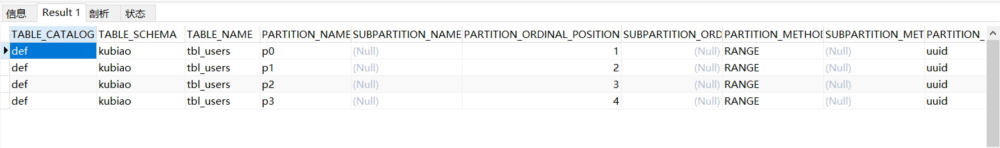

## 1.什么是分区？
所谓的**分区**就是将一个表分解成多个区块进行操作和保存，从而降低每次操作的数据，提高性能，而对应用来说是透明的。
从逻辑上看就只是一个表（这里跟分库分表的访问不一样），但是物理上的这个表可能是由多个物理分区组成，每个分区都是一个独立的对象，可以进行独立处理。

## 2.分区目的？
1）进行**逻辑数据分割**，分割数据能够有多个不同的物理文件路径。

2）可以**保存更多的数据**，突破系统单个文件的最大限制。

3）**提升性能**，提高每个分区的读写速度，提高分区范围查询的速度。

4）可以通过删除相关分区来快速删除数据。

5）通过跨多个磁盘来分散数据查询，从而**提高磁盘I/O的性能**。

6）涉及到例如SUM()和COUNT()这样**聚合函数的查询**，可以很容易地进行**并行处理**。

7）分区能**支持引擎**。

## 3.分区支持的引擎
MySQL支持大部分的存储引擎创建分区，如MyISAM、InnoDB等；不支持MERGE和CSV等创建分区。
**同一个分区表中的所有分区必须是同一个存储引擎**。

## 4.确认MySQL支持分区
从**MySQL5.1**开始引入分区功能，可以如下方式查看是否支持：

1）“老”版本方式：SHOW VARIABLES LIKE ‘%partition%’

2）"新"版本方式：show plugins

```text
# 信息中查看到这一条数据就表示支持分区
| partition                  | ACTIVE   | STORAGE ENGINE     | NULL           | GPL     |
```

## 5.分区的类型
1）**RANGE分区**：基于属于一个给定**连续区间**的列值，把多行**分配给分区**。

2）**LIST分区**：类似于按RANGE分区，LIST是列值匹配一个**离散值集合**中的某个值来进行选择。

3）**HASH分区**：基于**用户定义的表达式的返回值**来进行选择的分区，该表达式使用将要插入到表中的这些行的列值进行计算，这个函数必须产生非负整数值。

4）**KEY分区**：类似于按HASH分区，由**MySQL服务器提供其自身的哈希函数**。

注意事项：不论什么类型的分区，都要注意以下问题：
```text
1.如果表中存在primary key 或者 unique key 时，分区的列必须是primary key 或者 unique key的一个组成部分，
也就是说，分区函数的列只能从primary key或者 unique key这些key中取子集。

2.如果表中不存在任何的primary key 或者 unique key 时，则可以指定任何一个列作为分区列。

3.MySQL5.5版本之前的Range、List、Hash分区要求分区键必须是int；MySQL5.5及以上，支持非整型的Range和List分区，
即：range columns 和 list columns。
```

## 6.分区命名
分区的名字基本遵循其他MySQL标识符应当遵循的原则，例如用于表和数据库名字的标识符，但是注意，分区的名字是不区分大小写的。

无论使用何种类型的分区，**分区总是在创建时就自动的顺序编号，且从0开始记录**。

## 7.创建分区

### 7.1 RANGE分区

**创建数据：**
```text
--创建数据库
CREATE DATABASE kubiao DEFAULT CHARACTER SET utf8 COLLATE utf8_general_ci;

--创建分区表，主键：int类型
CREATE TABLE tbl_users (
`uuid` INT NOT NULL,
`customerId` VARCHAR(200),
`pwd` VARCHAR(20),
`showName` VARCHAR(100),
`trueName` VARCHAR(100),
`registerTime` VARCHAR(100)
)
PARTITION BY RANGE (uuid) (
PARTITION p0 VALUES LESS THAN (5),
PARTITION p1 VALUES LESS THAN (10),
PARTITION p2 VALUES LESS THAN (15),
PARTITION p3 VALUES LESS THAN MAXVALUE
);

--插入数据
INSERT INTO tbl_users VALUES
(1,"只为你","123456","qzp","quezhipeng","20200808"),
(6,"人生","123456","人生","无名","20200808"),
(12,"无须终有","123456","无须终有","无声","20200808"),
(100,"坚持","123456","胜利","坚持","20200808");
```

**查看数据：**

1）到存放数据的地方查看文件,命令如下：
```text
$ sudo vim /etc/mysql/mysql.conf.d/mysqld.cnf
```

2）查看存放数据的datadir目录所在位置
```text
datadir         = /var/lib/mysql
```

3）进入目录，查看文件，找到对应的数据库名，查看分区
```text
root@ubuntu:/etc/mysql# cd /var/lib/mysql/
root@ubuntu:/var/lib/mysql# ls
auto.cnf  ca-key.pem       client-key.pem   ego             ib_logfile0  jdbcstudy  myedc               private_key.pem  school           shiro  tmall
blog      ca.pem           crm              ib_buffer_pool  ib_logfile1  kubiao     mysql               public_key.pem   server-cert.pem  sxcrm  wcg
book      client-cert.pem  debian-5.7.flag  ibdata1         ibtmp1       mybatis    performance_schema  qzp51zx          server-key.pem   sys
root@ubuntu:/var/lib/mysql# cd kubiao
root@ubuntu:/var/lib/mysql/kubiao# ls
db.opt  tbl_users.frm  tbl_users#P#p0.ibd  tbl_users#P#p1.ibd  tbl_users#P#p2.ibd  tbl_users#P#p3.ibd
```

4）通过命令来查看分区信息
```text
mysql> SELECT * FROM information_schema.`PARTITIONS` WHERE table_schema='kubiao' AND table_name='tbl_users';
```
效果：



5）查看分区上的数据
```text
SELECT * FROM tbl_users PARTITION(p0);
```

6）查看MySQL操作的分区
```text
EXPLAIN PARTITIONS SELECT * FROM tbl_users WHERE uuid = 2;
```

7）扩展知识，主键为非整型
```text
--创建分区表，主键：非整型类型
CREATE TABLE tbl_users3 (
`uuid` INT NOT NULL,
`customerId` VARCHAR(200),
`pwd` VARCHAR(20),
`showName` VARCHAR(100),
`trueName` VARCHAR(100),
`registerTime` VARCHAR(100)
)
--字符串比较是字符比较
PARTITION BY RANGE columns(customerId) (
PARTITION p0 VALUES LESS THAN ('id05'),
PARTITION p1 VALUES LESS THAN ('id10'),
PARTITION p2 VALUES LESS THAN ('id15')
);

--插入数据
INSERT INTO tbl_users VALUES
(1,"id01","123456","qzp","quezhipeng","20200808"),
(2,"id06","123456","人生","无名","20200808"),
(3,"id12","123456","无须终有","无声","20200808");
```

### 7.2 List分区
**创建数据：**
```text
CREATE TABLE tbl_users2 (
`uuid` INT NOT NULL,
`customerId` VARCHAR(200),
`pwd` VARCHAR(20),
`showName` VARCHAR(100),
`trueName` VARCHAR(100),
`registerTime` VARCHAR(100)
)
PARTITION BY List(uuid) (
PARTITION p0 VALUES in(1,2,3,5),
PARTITION p1 VALUES in(7,9,10),
PARTITION p2 VALUES in(11,15)
);

--插入数据，注意：加入数据需要根据主键来，不可以时主键分区中没有的，否则报错
INSERT INTO tbl_users2 VALUES
(1,"只为你","123456","qzp","quezhipeng","20200808"),
(7,"人生","123456","人生","无名","20200808"),
(10,"无须终有","123456","无须终有","无声","20200808"),
(15,"坚持","123456","胜利","坚持","20200808");
```

注意：如果试图操作的列值不在分区值列表中时，那么会失败并报错，
要注意的是，LIST分区没有类似如：“VALUES LESS THAN”这样的包含其他值在内的定义，将要匹配的任何值都必须在值列表中找到。

LIST分区除了能和RANGE分区结合起来生成一个复合的子分区，与Hash和KEY分区结合起来成复合的子分区也是可以的。

**查看数据：**

同RANGE分区的操作一样，不在重复操作！

### 7.3 HASH分区
HASH分区：主要用来确保数据在预先确定数目的分区中平均分布，
在RANGE和LIST分区中，必须明确指定一个给定的列值或者列值集合以指定应该保存在哪个分区中；
而在HASH分区中，MySQL自动完成这些工作，要做的只是基于将要被哈希的列值指定的一个表达式，以及指定被分区的表将要被分割成的分区数量，如：

```text
--创建一张hash分区表
CREATE TABLE tbl_users4 (
`uuid` INT NOT NULL,
`customerId` VARCHAR(200),
`pwd` VARCHAR(20),
`showName` VARCHAR(100),
`trueName` VARCHAR(100),
`registerTime` VARCHAR(100)
)
PARTITION BY hash(uuid)
PARTITIONS 3;

--插入数据，注意：分区是有uuid/3求余数决定,余数为0，在p0;余数为1，在p1;余数为2，在p2,以此类推....
INSERT INTO tbl_users2 VALUES
(1,"只为你","123456","qzp","quezhipeng","20200808"),
(7,"人生","123456","人生","无名","20200808"),
(10,"无须终有","123456","无须终有","无声","20200808"),
(15,"坚持","123456","胜利","坚持","20200808");
```

查看数据操作同RANGE分区的操作一样，不在重复操作！

注意事项：
```text
1) 由于每次插入、更新、删除一行，这个表达式都要计算一次；
意味着非常复杂的表达式可能会引起性能问题，尤其是在执行同时大量行的运算（例如：批量插入）的时候。

2) 最有效率的哈希函数是只对单个表列进行计算，并且它的值随列值进行一致地增大或者减小，因为这考虑了在分区范围i上的“修剪”。
也就是说，表达式值和它所基于的列的值变化越接近，就能越有效地使用该表达式来进行HASH分区。

3) 只支持整数分区

    3.1) 线性HASH分区
    线性HASH分区在“PARTITION BY”子句中添加“LINEAR”关键字。
    
    特点：增加、删除、合并和拆分分区将变得更加快捷，有利于处理含有极其其大量数据的表，
    
    缺点：各个分区间数据的分区不大可能均衡。
```

### 7.4 KEY分区
类似于按照HASH分区，HASH分区允许用户自定义表达式，
而KEY分区不允许使用用户自定义的表达式：HASH分区只支持整数分区，KEY分区支持除了blob或者text类型之外的其他数据类型分区。

与HASH分区不同，**创建KEY分区表的时候，可以不指定分区键，默认会选择使用主键或者唯一键作为分区键，没有主键或唯一键，就必须指定分区键**。

```text
--创建一张key分区表
CREATE TABLE tbl_users5 (
`uuid` INT NOT NULL,
`customerId` VARCHAR(200),
`pwd` VARCHAR(20),
`showName` VARCHAR(100),
`trueName` VARCHAR(100),
`registerTime` VARCHAR(100)
)
PARTITION BY LINEAR key(uuid)
PARTITIONS 3;

--插入数据，注意：分区是有uuid/3求余数决定,余数为0，在p0;余数为1，在p1;余数为2，在p2,以此类推....
INSERT INTO tbl_users5 VALUES
(1,"只为你","123456","qzp","quezhipeng","20200808"),
(7,"人生","123456","人生","无名","20200808"),
(10,"无须终有","123456","无须终有","无声","20200808"),
(15,"坚持","123456","胜利","坚持","20200808");
```

查看数据操作同RANGE分区的操作一样，不在重复操作！

## 8.子分区
子分区是分区表中每个分区的再次分割，适合保存非常大量的数据。

```text
CREATE TABLE tbl_users6 (
`uuid` INT NOT NULL,
`customerId` VARCHAR(200),
`pwd` VARCHAR(20),
`showName` VARCHAR(100),
`trueName` VARCHAR(100),
`registerTime` DATE
)
PARTITION BY RANGE(YEAR(registerTime)) -- 主分区
SUBPARTITION BY HASH(TO_DAYS(registerTime)) -- 子分区hash分区，求余
SUBPARTITIONS 2
(
PARTITION P0 VALUES LESS THAN (2008),
PARTITION P1 VALUES LESS THAN (2015),
PARTITION P2 VALUES LESS THAN MAXVALUE
);

--插入数据
INSERT INTO tbl_users6 VALUES
(1,"只为你","123456","qzp","quezhipeng","2005-08-08"),
(7,"人生","123456","人生","无名","2008-08-08"),
(10,"无须终有","123456","无须终有","无声","2013-08-08"),
(15,"坚持","123456","胜利","坚持","2020-08-08");
```

查看数据操作同RANGE分区的操作一样，不在重复操作！

**注意事项：**

1）在MySQL5.1中，对于已经通过RANGE或者LIST分区了的表再进行子分区是可能的。子分区既可以使用HASH分区，也可以使用KEY分区，这也被称为**复合分区**。

2）每个分区必须有相同数量的子分区。

3）如果在一个分区表上的任何分区上使用SUBPARTITION来明确定义任何子分区，那么就必须定义所有的子分区。

4）每个SUBPARTITION子句必须包括（至少）子分区的一个名字。

5）在每个分区内，子分区的名字必须是唯一的，目前在整个表中，也要保持唯一。例如：
```text
CREATE TABLE tbl_users7 (
`uuid` INT NOT NULL,
`customerId` VARCHAR(200),
`pwd` VARCHAR(20),
`showName` VARCHAR(100),
`trueName` VARCHAR(100),
`registerTime` DATE
)
PARTITION BY RANGE(YEAR(registerTime)) -- 主分区
SUBPARTITION BY HASH(TO_DAYS(registerTime)) -- 子分区
(
    PARTITION P0 VALUES LESS THAN (2008)(
    SUBPARTITION s0,
    SUBPARTITION s1
    ),
    PARTITION P1 VALUES LESS THAN (2015)(
    SUBPARTITION s2,
    SUBPARTITION s3
    ),
    PARTITION P2 VALUES LESS THAN MAXVALUE(
    SUBPARTITION s4,
    SUBPARTITION s5
    )
);
```

6）子分区可以用于特别大的表，可以在多个磁盘间分配数据和索引，例如：
```text
SUBPARTITION s0
DATA DIRECTORY = '/disk0/data'
INDEX DIRECTORY = '/disk0/idx',
SUBPARTITION s0
DATA DIRECTORY = '/disk1/data'
INDEX DIRECTORY = '/disk1/idx',
```

## 9.MySQL分区处理NULL值的方式
MySQL中的分区在禁止空值NULL上没有进行处理，无论它是一个列值还是一个用户定义表达式的值，
一般而言，在这种情况下MySQL把NULL视为0，如果你希望回避这种做法，在设计表时就声明列“NOT NULL”。

## 10.分区管理概述
可以对分区进行添加、删除、重新定义、合并或拆分等管理操作。

### RANGE 和 LIST分区的管理

1）删除分区语句：
```text
--语法：
alter table `表名` drop partition 分区p0;

--实例：
ALTER TABLE tbl_users DROP PARTITION p0;

--查看新的表创建语句语法：
SHOW CREATE TABLE 表名;

--实例：
SHOW CREATE TABLE tbl_users;
```

注意事项：
```text
(1).当删除一个分区，也同时删除了该分区中所有的数据。

(2).如果是LIST分区的话，删除的数据不能新增进来，因为这些数据对应的列值包含在已经删除的分区中。
```

2）添加分区语句：
```text
--语法：
ALTER TABLE `表名` ADD PARTITION (PARTITION_definitions);
ALTER TABLE `表名` ADD PARTITION (PARTITION 分区名 分区语句的要求(查看新建表分区));

--RANGE添加分区实例：
ALTER TABLE tbl_users ADD PARTITION (PARTITION p3 VALUES LESS THAN(30));

--LIST添加分区实例：
ALTER TABLE tbl_users2 ADD PARTITION (PARTITION p0 VALUES in(1,2,3,5));
```

注意：
```text
(1).对于RANGE分区的表，只可以添加新的分区到分区列表的高端。

(2).对于LIST分区的表，不能添加已经包含在现有分区值列表中的任意值。
```

3）如果希望能不丢失数据的条件下重新定义分区，可以使用如下语句：
```text
--拆分分区语法：
ALTER TABLE tbl_name REORGANIZE PARTITION partition_list INTO(PARTITION_definitions);
ALTER TABLE tbl_name REORGANIZE PARTITION 分区名 INTO(PARTITION 新分区名1 分区语句的要求,PARTITION 新分区名2 分区语句的要求);

--RANGE拆分分区实例：
ALTER TABLE tbl_users REORGANIZE PARTITION p1 INTO(PARTITION p0 VALUES LESS THAN(5),PARTITION p1 VALUES LESS THAN(10));
--LIST拆分分区实例：
ALTER TABLE tbl_users2 REORGANIZE PARTITION p1 INTO(PARTITION p0 VALUES in(1,2,3,5,7),PARTITION p1 VALUES in(9,10));

--合并分区语法：
ALTER TABLE tbl_name REORGANIZE PARTITION partition_list INTO(PARTITION_definitions);

--RANGE合并分区实例：
ALTER TABLE tbl_users REORGANIZE PARTITION p1,p2 INTO(PARTITION p1 VALUES LESS THAN(15));
--LIST合并分区实例：
ALTER TABLE tbl_users2 REORGANIZE PARTITION p1,p0 INTO(PARTITION p0 VALUES in(1,3,5,7,9,10));
```

4）删除所有分区，但保留数据
```text
alter table tbl_name remove partitioning
```

### HASH和KEY分区的管理

1）减少分区数量的语法：
```text
--语法：数字代表减掉的分区数
ALTER TABLE tbl_name COALESCE PARTITION 1;
--HASH实例
ALTER TABLE tbl_users4 COALESCE PARTITION 1;
--KEY实例
ALTER TABLE tbl_users5 COALESCE PARTITION 1;
```

2）添加分区数量的语法：
```text
--语法：数字代表增加的分区数
ALTER TABLE tbl_name ADD PARTITION PARTITIONS 2;
--HASH实例
ALTER TABLE tbl_users4 ADD PARTITION PARTITIONS 2;
--KEY实例
ALTER TABLE tbl_users5 ADD PARTITION PARTITIONS 2;
```

### 其他分区管理：

1）重建分区：类似于先删除保存在分区中的所有记录，然后重新插入它们，可用于整理分区碎片。
```text
--重建分区语法
ALTER TABLE tbl_name REBUILD PARTITION partition_list(分区名);
--重建分区实例
ALTER TABLE tbl_users REBUILD PARTITION p2,p3;
```

2）优化分区：如果从分区中删除了大量的行，或者对一个带有可变长度的行（也就是说，有VARCHAR,或TEXT类型的列）作了许多修改，
收回没有使用的空间，并整理分区数据文件的碎片。
```text
--优化分区语法：
ALTER TABLE tbl_name OPTIMIZE PARTITION partition_list(分区名);
--优化分区实例
ALTER TABLE tbl_users OPTIMIZE PARTITION p2,p3;
```

3）分析分区：读取并保存分区的键分布
```text
--分析分区语法：
ALTER TABLE tbl_name ANALYZE PARTITION partition_list(分区名);

--分析分区实例
ALTER TABLE tbl_users ANALYZE PARTITION p2,p3;
```

4）检查分区：检查分区中的数据或索引是否已经被破坏
```text
--检查分区语法：
ALTER TABLE tbl_name CHECX PARTITION partition_list(分区名);
--检查分区实例
ALTER TABLE tbl_users CHECX PARTITION p2,p3;
```

5）修补分区：修补被破坏的分区
```text
--修补分区语法：
ALTER TABLE tbl_name REPAIR PARTITION partition_list(分区名);
--修补分区实例
ALTER TABLE tbl_users REPAIR PARTITION p2,p3;
```

## 分区注意事项：
```text
1.最大分区数目不能操作1024，一般建议对单表的分区数不要超过150个。

2.如果含有唯一索引或者主键，则分区列必须包含在所有的唯一索引或者主键在内。

3.不支持外键。

4.不支持全文索引，对分区表的分区键创建索引，那么这个索引也将被分区。

5.按日期进行分区很合适，因为很多日期函数可以用，但是对于字符串来说合适的分区函数不太多。

6.只有RANGE 和 LIST分区能进行子分区，HASH和KEY分区不能进行子分区。

7.临时表不能被分区。

8.分区表对于单条记录的查询没有优势。

9.要注意选择分区的成本，每插入一行数据都需要按照表达式筛选插入的分区。

10.分区字段尽量不要为null。
```

# MySQL分区的例子

## 需求：
按时间分区。 对千万数据左右的表，进行分区，数据的增加量大概千万/年。

## 代码实现：
模拟之前已经存在的表：

```text
# 创建表
DROP TABLE IF EXISTS `test`;
CREATE TABLE `test`  (
`id` bigint(20) NOT NULL AUTO_INCREMENT COMMENT '主键id',
`description` varchar(512) CHARACTER SET utf8 COLLATE utf8_bin NULL DEFAULT NULL,
`state` tinyint(4) NULL DEFAULT 0 COMMENT '0:未处理，1：处理中，2：处理完成，3：异常订单',
`create_time` datetime(0) NULL DEFAULT NULL COMMENT '创建时间'
) ;

# 取消自增
alter table test modify id int;

# 删除主键
alter table test drop PRIMARY KEY;

# 添加复合主键
alter table test add PRIMARY KEY(id,create_time);

# id 改为自增
alter table test modify  id int AUTO_INCREMENT;

# 增加组合索引，分区的字段必须是唯一，所以唯一索引无法创建。
# ALTER TABLE test ADD UNIQUE (serial_no,delete_flag);

# 增加分区，按时间 1 年
ALTER TABLE test PARTITION BY RANGE COLUMNS(create_time) (
PARTITION p1 VALUES LESS THAN ('20190101'),
PARTITION p2 VALUES LESS THAN ('20200101'),
PARTITION p3 VALUES LESS THAN ('20210101'),
PARTITION p4 VALUES LESS THAN ('20220101'),
PARTITION p5 VALUES LESS THAN ('20230101'),
PARTITION p6 VALUES LESS THAN ('20240101'),
PARTITION p7 VALUES LESS THAN ('20250101'),
PARTITION p8 VALUES LESS THAN ('20260101'),
PARTITION p9 VALUES LESS THAN ('20270101')
);
```
