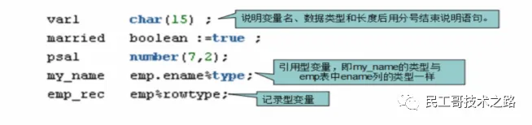
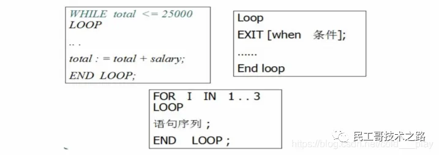

## 什么是PL/SQL？
PL/SQL（Procedure Language/SQL）是Oracle对sql语言的过程化扩展，
指在SQL命令语言种增加了过程处理语句（如分支、循环等），使SQL语言具有过程处理能力。
把SQL语言的数据操纵能力与过程语言的数据处理能力结合起来，使得PLSQL面向过程但比过程语言简单、高效、灵活和实用。

示例：为职工涨工资，每人涨10%的工资。
```text
update emp set sal = sal * 1.1;
```

示例：按职工的职称涨工资，总裁涨1000元，经理涨800元，其他人员涨400元。

这样的需求我们就无法使用一条SQL来实现，需要借助其他程序来帮助完成，也可以使用pl/sql。

## PL/SQL的语法
```text
declare
    说明部分（变量说明，光标声明，例外说明）
begin
    语句序列（DML语句）...
exception
    列外处理语句
End
```

## 变量和变量的定义
### 说明变量（char, varchar2, date, number, boolean, long）




### 引用变量
Myname emp.ename%type;

引用型变量，即my_name的类型与emp表种ename列的类型一样，在sql种使用into。

```text
declare
    emprec emp.ename%type;
begin
    select t.ename into emprec from emp t where t.empno = 7369;
    dbms_output.put_line(emprec);
end;
```

### 记录型变量
Emprec emp%rowtype

记录变量分量的引用

emp_rec.ename := 'ADAMS';

```text
declare
    p emp%rowtype;
begin
    select * into p from emp t where t.empno = 7369;
    dbms_output.put_line(p.ename || ' ' || p.sal);
end;
```

## If语句
语法1：
```text
IF 条件 THEN 
    语句1：
    语句2：
END IF；
```

语法2：
```text
IF 条件 THEN 
    语句序列1：
ELSE 
    语句序列2：
END IF；
```

语法3：
```text
IF 条件 THEN 
    语句：
ELSIF 
    语句序列2：
ELSE 
    语句：
END IF；
```

示例1：如果从控制台输入1则输出我是1
```text
declare
    pnum number := &num;
begin
    if pnum = 1 then
        dbms_output.put_line('我是1');
    end if;
end;
```

示例2：如果从控制台输入1则输出我是1，否则输出我不是1
```text
declare
    mynum number := &num;
begin
    if mynum = 1 then
        dbms_output.put_line('我是1');
    else
        dbms_output.put_line('我不是1');
    end if;
end;
```

示例3：判断人的不同年龄段，18岁以下是未成年人，18以上40以下是中年人，40以上是老年人。
```text
declare
    mynum number := &num;
begin
    if mynum < 18 then
        dbms_output.put_line('未成年人');
    elsif mynum >= 18 and mynum < 40 then
        dbms_output.put_line('中年人');
    elsif mynum > 40 then
        dbms_output.put_line('老年人');
    end if;
end;
```

## 循环
语法：


示例1：使用语法1输出1到10的数字
```text
declare
    step number := 1;
begin
    while step <= 10 loop
        dbms_output.put_line(step);
        step := step + 1;
    end loop;
end;
```

示例2：使用语法2输出1到10的数字
```text
declare
    step number := 1;
begin
    loop
        exit when step > 10;
        
        dbms_output.put_line(step);
        step := step + 1;
    end loop;
end;
```

示例3：使用语法3输出1到10的数字
```text
declare
    step number := 1;
begin
    for step in 1 .. 10 loop
        dbms_output.put_line(step);
    end loop;
end;
```

