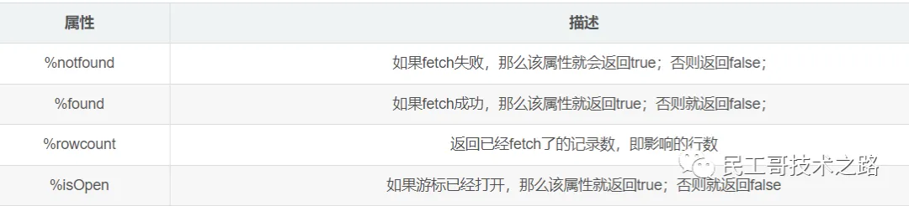

在写Java程序中有集合的概念，那么在pl/sql中也会用到多条记录，这时候就需要用到游标，游标可以存储查询返回的多条数据。

## 游标的属性




## 语法
```text
CURSOR 游标名 [(参数名 数据类型，参数名 数据类型，...)] IS SELECT 语句；
```

例如：
```text
cursor c1 is select ename from emp;
```

游标的使用步骤：
* 打开游标： open c1;（打开游标执行查询）
* 取一行游标的值：fetch c1 into pjob;（取一行到变量中）
* 关闭游标：close c1；（关闭游标释放资源）
* 游标的结束的方式：exit when c1%notfound

注意：上面的pjob必须与emp表中的job列类型一致
* 定义：pjob emp.empjob%type;

示例1：使用游标方式输出emp表中的员工编号和姓名
```text
declare
    cursor pc is select * from emp;
    pemp emp%rowtype;
begin
    open pc;
    
    loop
        fetch pc into pemp;
        
        exit when pc%notfound;
        
        dbms_output.put_line(pemp.empno || ' ' || pemp.ename);
    end loop;
    
    close pc;
end;
```

示例2：写一段PL/SQL程序，为部门号为10号的员工涨工资
```text
declare
cursor pc(dno emp.deptno%type) is
select empno from emp where deptno = dno;
pno emp.empno%type;
begin
    open pc(20);
    
    loop
        fetch pc into pno;
        
        exit when pc%notfound;
        
        update emp t set t.sal = t.sal + 1000 where t.empno = pno;
    end loop;
    
    close pc;
end;
```