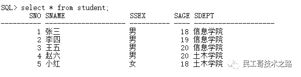
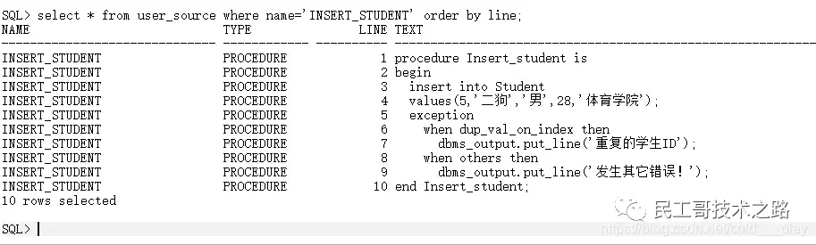
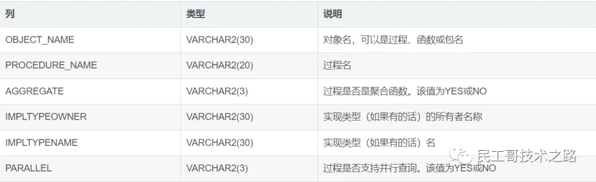

## 存储过程
存储过程是Oracle开发者在数据转换或查询报表时经常使用的方式一。

存储过程是一种命名PL/SQL程序块，
它将一些相关的SQL语句、流程控制语句组合在一起，用于执行某些特定的操作或者任务，可以将经常需要执行的特定的操作写成过程。
通过过程名，就可以多次调用过程，从而实现程序的模块化设计。
这种方式极大地节省了用户的时间，也提高了程序的效率。

## 概述
在Oracle中，可以在数据库中定义子程序，在子程序中将一些固定的操作集中起来，由Oracle数据库服务器完成，以完成某个特定的功能。
这种子程序称为存储过程（Procedure）。
存储过程可以通俗地理解为是存储在数据库服务器中的封装了一段或多段SQL语句的PL/SQL代码块。
在数据库中有一些是系统默认的存储过程，那么可以直接通过存储过程的名称进行调用。
另外，存储过程还可以在编程语言中调用，如Java、C#等等。

## 存储过程优点：
存储过程在服务器端运行，执行速度快。

存储过程执行一次后驻留在Oracle数据库服务器的高速Cache中，
以后再次执行存储过程时，只需从高速Cache中调用已经编译好的代码即可，从而提高了系统性能。

存储过程确保了数据库的安全。
使用存储过程，可以在禁止用户直接访问应用程序中的某些数据表的情况下，授权执行访问这些数据表的存储过程。

自动完成需要预先执行的任务。
存储过程可以设置为系统启动时自动执行，而不必在系统启动后再进行手动操作，
从而方便了用户的使用，可以自动完成一些需要预先执行的任务。

## 创建存储过程
```text
CREATE [OR REPLACE] PROCEDURE procedure_name
    [
        Parameter [IN | OUT | IN OUT] data_type1,
        Parameter [IN | OUT | IN OUT] data_type2,
        ......
    ]
IS|AS
    声明部分
BEGIN
    执行部分
EXCEPTION
    异常处理部分
END procedure_name;
```
* OR REPLACE: 表示如果指定的过程已经存在，则覆盖同名的存储过程。
* Procedure_name: 表示存储过程的名称。
* Parameter: 表示存储过程中的参数。
* IN: 表示向存储过程传递参数。
* OUT: 表示从存储过程返回参数。
* data_type: 表示传入参数的数据类型，也可以带有默认值。
* AS或IS 后声明的变量主要用于过程体内，且不能加DECLARE语句。

## 执行存储过程
语法：
```text
方式一：直接调用
SQL> exec Procedure_name;

方式二：在另一个PL/SQL中调用
begin
    Procedure_name(parameter1,parameter2,...);
end;
```

示例：创建一个简单的存储过程Insert_student，该过程可用于向Student表添加数据。表信息如下：



创建存储过程：
```text
create or replace procedure Insert_student is
begin
    insert into Student values(5,'二狗','男',28,'体育学院');
exception
    when dup_val_on_index then
        dbms_output.put_line('重复的学生ID');
    when others then
        dbms_output.put_line('发生其它错误！');
end Insert_student;
```

执行存储过程：
```text
SQL> set serveroutput on;  --保证DBMS_OUTPUT.PUT_LINE成功输出
SQL> exec Insert_student;
重复的学生ID
PL/SQL procedure successfully completed
```

## 查看存储过程
存储过程一旦被创建就会存储到数据库服务器上，Oracle通过使用视图USER_SOURCE查看已经存在的存储过程脚本。

查看存储过程Insert_student的脚本



user_procedures视图的部分类说明




## Oracle 带参数的存储过程
### 带参数的存储过程
存储过程允许带有参数，参数的使用将增加存储过程的灵活性，给数据库编程带来极大的方便。

存储过程中如果使用了参数，在执行存储过程时必须为其指定参数。总的来说，参数可以是常量、变量和表达式等。

Oracle有三种参数模式：
* IN
* OUT
* IN OUT

### IN参数
该类参数值由调用者传入，并且只能够被存储过程读取。这种模式的参数是最常用的，也是默认的参数模式。

示例：创建一个带有输入参数的存储过程，当使用Insert_student添加学生信息时，
用户只需要向该存储过程传入参数值，然后由存储过程从中读取数据。
```text
create or replace procedure Insert_student
(SNO IN varchar2,SNAME IN varchar2,SSEX IN char,SAGE IN number,SDEPT IN varchar2) 
is
begin
    insert into student values(SNO,SNAME,SSEX,SAGE,SDEPT);
exception
    when dup_val_on_index then 
        dbms_output.put_line('重复的学生ID');
    when others then 
        dbms_output.put_line('发生其它错误！');
end Insert_student;
```

执行存储过程并传递参数，共有三种方式：

1）名称传递
```text
sql> set serveroutput on;
sql> exec Insert_student(SNAME=>'小李',SNO=>6,SAGE=>9,SSEX=>'男',SDEPT=>'艺术学院')
重复的学生ID
PL/SQL procedure successfully completed
```

2）位置传递
```text
sql> set serveroutput on;
sql> exec Insert_student(6,'小李','男',9,'艺术学院')
重复的学生ID
PL/SQL procedure successfully completed
```

3）组合传递
```text
sql> set serveroutput on;
sql> exec Insert_student(6,'小李','男',SDEPT=>'艺术学院',SAGE=>9)
重复的学生ID
PL/SQL procedure successfully completed
```

### OUT参数
该类参数值由存储过程写入。

示例：创建一个带有输出参数的存储过程，该存储过程根据学生的姓名返回该学生的所属学院。
```text
create or replace procedure p_getSdept(NAME IN varchar2,DEPT OUT varchar2)
is
    temp varchar(20);
begin
    select s.SDEPT into temp
    from student s
    where s.SNAME=NAME;
    DEPT := temp;
end p_getSdept;
```

### IN OUT参数
示例：使用IN OUT参数交换两个变量的值
```text
create or replace procedure p_swap(value1 in out number,value2 in out number)
is
    temp number;
begin
    temp := value1;
    value1 := value2;
    value2 := temp;
end p_swap;
```

执行：
```text
declare
    var_1 varchar2:=1;
    var_2 varchar2:=2
begin
    p_swap(var_1,var_2);
    dbms_output.put_line('var_1='||var_1);
    dbms_output.put_line('var_2='||var_2);
end;
```

### 默认值问题
创建存储过程的同时可以给**输入参数提供默认值**。**OUT和IN OUT参数不具有默认值**。

示例：根据传入SNO查询学生姓名，默认查询1号学生姓名
```text
create or replace procedure p_getStudent(s_no in varchar2 default '1')
is
    name varchar2(20);
begin
    select SNAME into name
    from student
    where SNO = s_no;
    dbms_output.put_line('name='||name);
end p_getStudent;
```

执行：
```text
sql> set serveroutput on;
sql> exec p_getStudent()
name=张三
PL/SQL procedure successfully completed

sql> set serveroutput on;
sql> exec p_getStudent('2')
name=李四
PL/SQL procedure successfully completed
```


