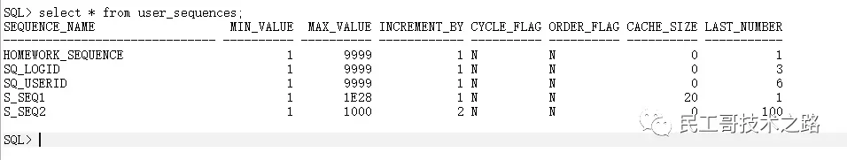
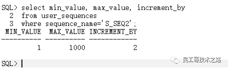

## 序列
序列（sequence）是一种数据库对象，可以为表中的行自动生成序列号，
利用它可生成唯一的整数，产生一组等间隔的数值（类型为数字Number），主要用于生成唯一、连续的序号。
序列是一种共享式的对象，多个用户可以共同使用序列中的序号。
一般序列所生成的整数通常可以用来填充数字类型的主键列，这样当向表中插入数据时，
主键列就使用了序列中的序号，从而保证主键的列值不会重复。
用这种方法可以替代在应用程序中产生主键值的方法，可以获得更可靠的主键值。

## 创建序列
一个序列的是由特殊的Oracle程序自动生成的，因此避免了在应用层实现序列而引起的性能瓶颈。
序列号是一个Oracle整数，最多可以有38个数字。创建序列时，需要定义的信息包括序列名、上升或下降、序列号之间的间距和其它信息。

语法如下
```text
CREATE SEQUENCE sequence_name
[START WITH start_num]
[INCREMENT BY increment_num]
[{MAXVALUE maximum_num | NOMAXVALUE}]
[{MINVALUE minimum_num | NOMINVALUE}]
[{CYCLE | NOCYCLE}]
[{CACHE cache_num | NOCACHE}]
[{ORDER | NOORDER}];
```

其中各语法选项含义如下：

* sequence_name: 指定序列名
* start_num： 指定序列从哪个整数开始，该值**默认为1**
* increment_num： 指定该序列每次增加的整数增量，值**默认为1**。
  increment_num的绝对值必须小于maximum_num与minimum_num之差。
* maximum_num： 指定该序列的最大整数。maximum_num必须大于或等于start_num，而且maximum_num必须大于minimum_num。
* NOMAXVALUE： 指定升序序列的最大值为1027，降序序列的最大值为-1。NOMAXVALUE为默认值。
* minimum_num： 指定该序列的最小整数。minimum_num必须小于或等于start_num，而且minimum_num必须小于maximum_num。
* NOMINVALUE： 指定升序序列的最小值为1，降序序列的最小值为-1026。NOMINVALUE为默认值。
* CYCLE： 指定该序列即使已经达到最大值或最小值也继续生成整数。
  当升序序列达到最大值时，下一个生成的值是最小值。当降序序列达到最小值时，下一个生成的值是最大值。
* NOCYCLE： 指定该序列在达到最大值或最小值之后就不能再生成整数了。NOCYCLE是默认值。
* cache_num： 指定要保留在内存中整数的个数。默认要缓存的整数位20个。
  可以缓存的整数最少为2个；可以缓存的整数个数最多为：CELL(maximum_num - minimum_num)/ABS(increment_num)。
* NOCACHE： 指定不缓存任何整数。这可以阻止数据库为序列预分配值，从而避免序列产生不连续的情况，但这会降低性能。
  序列不连续的情况之所以会发生，是因为在关闭数据库时所缓存的值将全部丢失。如果省略CACHE和NOCACHE，则数据库默认缓存的整数位20个。
* ORDER： 确保按照请求次序生成整数。当使用Real Application Clusters(RAC)时一般使用ORDER选项，
  Real Application Clusters由数据库管理员安装和管理。
  Real Application Clusters是共享相同内存的多个数据库服务器，它们可以提高性能。
* NOORDER: 不确保按照请求次序生成整数。NOORDER为默认值。

使用默认值创建一个序列s_seq1
```text
sql> create sequence s_seq1;
sequence created
```

创建序列s_seq2，开始值为100，增幅是2，最大值是1000，序列中的序号不在内存中进行缓冲
```text
sql> create sequence s_seq2
        start with 100
        increment by 2
        maxvalue 1000
        nocache;
sequence created
```

序列的信息可以从数据字典user_sequences中获得，如下：



使用SELECT语句查看序列s_seq2的最小值、最大值、增幅等信息：




## 修改序列
ALTER SEQUENCE语句可以用来修改序列。在修改序列时，可以修改的序列内容有如下限制：
* 不能修改序列的初值
* 序列的最小值不能大于当前值
* 序列的最大值不能小于当前值

修改序列S_SEQ2的最小值、最大值、增幅，并使其中的序号可循环使用：
```text
sql> alter sequence s_seq2
        minvalue 5
        maxvalue 50000
        increment by 3
        cycle;
Sequence altered
```

## 删除序列
对于不再使用的序列，应该及时地将其删除。DROP SEQUENCE可以用来删除序列。 删除序列S_SEQ1
```text
sql> drop sequence s_seq1;
Sequence dropped
```

## 使用序列
对用户而言，序列中的可用资源是其中包含的序号。
用户可以通过SELECT命令获得可用的序号，也可以将序号应用于DML语句和表达式中。
如果要使用其他用户的序列号，则必须具有对该序列的SELECT权限。

序列提供了两个伪列，即NEXTVAL和CURRVAL，用来访问序列中的序号。
* NEXTVAL： 返回序列生成的下一个值。
* CURRVAL： 返回序列的当前值。

需要注意的是，在第一次引用CURRVAL之前，必须引用过一个序列的NEXTVAL，用于初始化序列的值，否则会出现错误提示。

使用序列S_SEQ1为表sys_user表插入一条数据，代码如下：
```text
create table sys_user(
userId number primary key,
userName varchar2(20) not null,
userPWD varchar2(20) not null
);

sql> insert into sys_user values(s_seq1.nextval,'Jeff','11111');
1 row inserted
```

