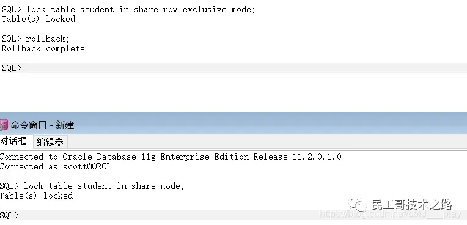

## 锁概述
加锁是实现数据库**并发控制**的一个非常重要的技术。
当事务在对某个数据对象进行操作前，先向系统发出请求，对其加锁。
加锁后事务就对该数据对象有了一定的控制，在该事务释放锁之前，其他的事务不能对此数据对象进行更新操作。

Oracle通过使用**锁（Lock）机制**维护数据的**完整性**、**并发性**和**一致性**。

Oracle在两个不同级别上提供读取一致性：**语句级**读取一致性和**事务级**读取一致性。
* 语句级读取一致性： Oracle总是实施语句级读取一致性，保证单个查询所返回的数据与该查询开始时保持一致。
* 事务级读取一致性： 事务级读取一致性是指在**同一个事物中**的所有数据对时间点是一致的。

## 锁的分类
在数据库中有两种基本的锁类型：**排他锁**（Exclusive Locks，即X锁）和**共享锁**（Share Locks，即S锁）。

排他锁， 也称之为写锁。
这种模式的锁防止资源的共享，用做数据的修改。
假如有事务T给数据A加上该锁，那么其他的事务将不能对A加任何锁，
所以此时只允许T对该数据进行读取和修改，直到事务完成将该类型的锁释放为止。

共享锁， 也称之为读锁。
该模式锁下的数据只能被读取，不能被修改。
如果有事务T给数据A加上共享锁后，那么其他事务不能对其加排他锁，只能加共享锁。加了该锁的数据可以被并发地读取。

## 锁的类型
* DML锁（Data Locks，数据锁）： 用户保护数据的完整性。
* DDL锁（Dictionary Locks，字典锁）： 用于保护数据库对象的结构，如表、索引等的结构定义。
* 内部所和闩（Internal Locks and Latches）： 保护数据库的内部结构。

DML锁的目的在于保证并发情况下的数据完整性，
在Oracle数据库中，**DML锁**主要包括**TM锁**和**TX锁**， 其中TM锁称为**表级锁**，TX锁称为**事物锁**或**行级锁**。

当Oracle执行DML语句时，系统自动在所要操作的表上申请TM类型的锁。
当TM锁获得后，系统再自动申请TX类型的锁，并将实际锁定的数据行的锁标志位进行置位。
这样在事务加锁前检查TX锁相容性时就不用再逐行检查锁标志了，只需要检查TM锁模式的相容性即可，大大提高了系统的效率。
TM锁包括了SS、SX、S、X等多种模式， 在数据库中用0~6来表示。

不同的SQL操作产生不同类型的TM锁，如下表


在数据行上只有X锁（排他锁）。
在Oracle数据库中，当一个事务首次发起一个DML语句时就获得一个TX锁，该锁保持到事务被提交或回滚。
当两个或多个会话在表的同一条记录上执行DML语句时，第一个会话在该条记录上加锁，其他的会话处于等待状态。
当第一个会话提交后，TX锁被释放，其他会话才可以加锁。

当Oracle数据库发生TX锁等待时，如果不及时处理常常会引起Oracle数据库挂起，或导致死锁的发生。
这些现象都会对实际应用产生极大的危害，如长时间未响应、大量事务失败等。

在日常工作中，如果发现执行SQL语句时，数据库长时间没有响应，很可能是产生了TX锁等待的现象。
为了解决这个问题，首先应该找出持锁的事务，然后再进行相关的处理，如提交事务或强行中断事务。

Oracle在动态状态表**V中存储与数据库中的锁有关的所有信息。查看����∗∗中存储与数据库中的锁有关的所有信息。
查看�LOCK表的结构如下图：


## Oracle 加锁的方法
### 行共享锁（Row Share ，RS）
对数据表定义了行共享锁后，如果被事务A获得，那么其他事务可以进行并发查询、插入、删除及加锁，但不能以排他方式存取该数据表。

为Student表添加行共享锁
```text
sql> lock table student in row share mode;
Table(s) locked
```

### 行排他锁（Row Exclusive，RX）
当事务A获得行排他锁后，其他事务可以对同一数据表中的其他数据行进行并发查询、插入、修改、删除及加锁
，但不能使用行共享锁、行共享排他锁和行排他锁3种方式加锁。

为Student表添加行排他锁
```text
sql> lock table student in row exclusive mode;
Table(s) locked
```

### 共享锁（Share，S）
当事务A获得共享锁后，其他事务可以对同一数据表中的其他数据行进行并发查询、加共享锁。
但不能修改表，不能使用排他锁、行共享排他锁和行排他锁3种方式加锁。

为Student表添加共享锁：

第一步：为表Student添加排他锁
```text
sql> lock table student in share mode;
Table(s) locked
```

第二步：打开一个新的SQL Plus会话，分别执行查询和更新操作


此时，新打开的会话可以查询，但是更新语句一直处于锁等待的状态。
回到第一个会话，当解除锁，例如输入rollback回滚操作后，新会话会立刻执行完成。


### 共享行排他锁（Share Row Exclusive，SRX）
当事务A获得共享排他锁后，其他事务可以执行查询和对其他数据行加锁，
但不能修改表，也不能再添加共享锁、共享行排他锁、行排他锁和排他锁。

为Student添加共享行排他锁

第一步：为Student添加共享行排他锁
```text
sql> lock table student in share row exclusive mode;
Table(s) locked
```

第二步：新会话中为student添加共享锁


发现，新打开的会话窗口，为已经添加共享排他锁的事务再次添加共享锁时，一直处于等待状态，当第一个会话释放资源时，第二个会话方可执行。




### 排他锁（Exclusive，X）
排他锁是最严格的锁，当事务A获得排他锁后，事务A可以执行对数据表的读写操作，其他事务可以执行查询但不能执行插入、修改和删除操作。

其他事务可以执行查询和对其他数据行加锁，但不能修改表，也不能再添加共享锁、共享行排他锁，行排他锁和排他锁。

为Student表添加排他锁

第一步：为表Student添加排他锁
```text
sql> lock table student in exclusive mode;
Table(s) locked
```

第二步：打开一个新的SQL Plus会话，分别执行查询和更新操作


此时，新打开的会话可以查询，但是更新语句一直处于锁等待状态。回到第一个会话，解除锁，新会话立刻执行完成。


