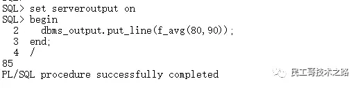
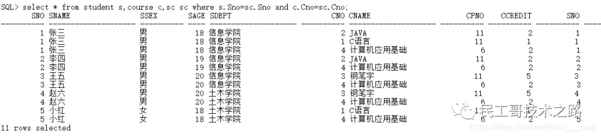
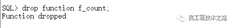

## 函数
函数一般用于计算和返回一个值，可以将经常需要进行的计算写成函数。
函数的调用是表达式的一部分，而过程的调用是一条PL/SQL语句。

函数与过程在创建形式上有些相似，也是编译后放在**内存**中供用户使用，只不过调用时函数要用表达式，而不像过程只需调用过程名。
另外，函数必须有一个返回值，而过程则没有。

## 创建函数
创建函数的语法和创建存储过程的语法也很相似。它们在数据库内采用相同的规则，参数的传递也相同。

创建函数的基本语法如下：
```text
CREATE [OR REPLACE] FUNCTION function_name
[
    parameter1 [IN|OUT|IN OUT]data_type1,
    parameter2 [IN|OUT|IN OUT]data-type2,
    ......
]
RETURN data_type;
IS|AS
    声明部分
BEGIN
    执行部分
EXCEPTION
    异常处理部分
END [function_name];
```

在语法结构上，定义存储过程和函数的区别主要有两处：
* 一是函数有RETURN数据类型子句，用于指定函数返回值的数据类型；
* 二是在函数体内，用户可以在任何地方使用RETURN语句返回值，其返回值的数据类型必须是函数头中声明的，
  并且执行RETURN语句后函数将返回，不再执行下面的语句。

示例：创建函数用于求两个数的平均值
```text
create or replace function f_avg(num1 in number,num2 in number)
return number 
as
    result_avg number;
begin
    result_avg :=(num1 + num2)/2;
    return result_avg;
end f_avg;
```

创建函数之后就可以在需要时调用，调用函数与调用过程不同。
调用函数时，需要一个变量来保存函数的返回的结果值，这样函数就组成了表达式的一部分。这也就意味着，**函数不能像调用过程那样独立地调用**。

使用匿名程序块中调用函数f_avg()获取两个数的平均值：


创建函数用于计算选修某门课程的学生人数
```text
create or replace function f_count(c_name in varchar2) 
return number
as 
    resultCount number;
begin
  select count(distinct s.Sno) into resultCount
  from student s,course c,sc sc
  where s.Sno=sc.Sno and c.Cno=sc.Cno and c.Cname=c_name;
  
  return(resultCount);
end f_count;
```




## 调用函数
函数声明时所定义的参数成为**形式参数**，应用程序调用时为函数传递的参数称为**实际参数**。
实际参数和形式参数之间的数据传递有两种方法：传址法和传值法。

调用函数和调用过程有所不同，需要一个变量来保存返回的值，这样函数就组成了表达式的一部分。因此不能像调用过程那样独立地调用函数。

## 删除函数
对于不再使用的函数，可以使用DROP FUNCTION语句进行删除，语法如下：
```text
DROP FUNCTION <function_name>;
```

