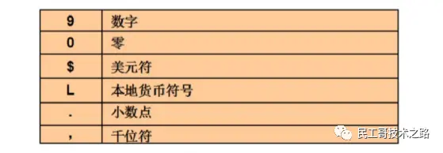

## 什么是SQL的函数？


## 函数的类型
函数类型分为：单行函数和多行函数

## 单行函数
单行函数有如下几类：
* 字符函数
* 数值函数
* 日期函数
* 转换函数
* 通用函数

## 字符函数

字符函数也分为2类：
* 大小写控制函数：UPPER、LOWER、INITCAP
* 字符控制函数：CONCAT、SUBSTR、LENGTH\LENGTHB、INSTR、LPAD\RPAD、TRIM、REPLACE

示例：接收字符输入返回字符或者数值，dual是伪表 。

1.把小写的字符串转换成大写的字符：upper(str)
```text
sql> select upper('tomcat') from dual;
TOMCAT
```

2.把大写字符变成小写字符：lower(str)
```text
sql> select lower('TOMCAT') from dual;
tomcat
```

3.把首字符大写：initcap(str)
```text
sql> select initcap('tomcat') from dual;
Tomcat
```

4.字符串的连接可以使用concat或使用“||”，建议使用"||" concat(str1,str2)
```text
sql> select concat('hello',' world') from dual;
hello world
```

5.字符串的截取，使用substr，
第一个参数是源字符串，第二个参数是开始索引，第三个参数长度，开始的索引使用1和0效果相同 substr(str, start, length)
```text
sql> select substr('hello',1,3) from dual;
hel
```

6.获取字符串的长度length(str)
```text
sql> select length('hello') from dual;
5
```

7.字符串替换，第一个参数是源字符串，第二个参数是被替换的字符串，第三个是替换字符串：replace(str,source, target)。
```text
sql> select replace('ababab','a','c') from dual;
cbcbcb
```

8.字符串填充

左填充：lpad，右填充：rpad。

第一个参数为原字符串，第二个参数为填充到多少位，第三个参数为填充的字符。

```text
sql> select lpad('tom',10,'@') from dual;
@@@@@@@tom
sql> select rpad('tom',10,'@') from dual;
tom@@@@@@@
```

9.去掉前后指定的字符：trim
```text
sql> select trim('h' from 'hello world') from dual;
ello world
```

## 数值函数

* ROUND: 四舍五入
* TRUNC: 截断
* MOD: 求余

1.四舍五入，第一个参数为原数值，第二个参数为保留位数
```text
sql> select round(123.45678,2) from dual;
123.46
```

2.截断，第一个参数为原数值，第二个参数为保留位数
```text
sql> select trunc(123.45678,2) from dual;
123.45
```

3.求余
```text
sql> select mod(1500,400) from dual;
300
```

## 日期函数
Oracle中的日期：
* Oracle中的日期型数据实际含有两个值；日期和时间。
* 默认的使其格式是：DD-MON-RR。

日期的数学运算：
* 在日期上加上或减去一个数字结果仍为日期
* 两个日期相减返回日期之间相差的天数
* 可以用数字除24

日期函数：
* MONTH_BETWEENS: 两个日期的相差月数
* ADD_MONTHS: 向指定日期中加上若干月数
* NEXT_DAY: 指定日期的下一个日期
* LAST_DAY: 本月的最后一天
* ROUND: 日期四舍五入
* TRUNC: 日期截断

日期的四舍五入：
```text
假如sysdate='25-JUL-95'
ROUND(sysdate, 'MONTH'): 01-AUG-95
ROUND(sysdate, 'YEAR'): 01-JAN-96
TRUNC(sysdate, 'MONTH'): 01-JUL-95
TRUNC(sysdate, 'YEAR'): 01-JAN-95
```

### 日期函数示例
1.查询雇员进入公司的周数

分析：查询雇员进入公司的天数（sysdate - 入职日期）/ 7 就是周数
```text
select ename,round((sysdate - hiredate)/7) from emp;
```

2.获得两个时间段中的月数：MONTHS_BETWEEN（），示例：查询所有雇员进入公司的月数。
```text
select ename,round(months_between(sysdate,hiredate)) from emp;
```

3.获得几个月后的日期：ADD_MONTHS()：ADD_MONTHS()，示例：查询所有雇员进入公司的月数。
```text
select add_months(sysdate, 3) from dual;
```


## 转换函数
数据类型转换分为2种：隐式数据类型转换和显式数据类型转换。

### 隐式数据类型转换
Oracle自动完成数据类型的转换
```text
VARCHAR2/CHAR-->NUMBER
VARCHAR2/CHAR-->DATE
NUMBER-->VARCHAR2
DATE-->VARCHAR2
```

### 显示数据类型转换


TO_CHAR函数对日期的转换：
```text
TO_CHAR(date, 'format_model')
```

日期的格式：


TO_CHAR 函数对数字的转换：
```text
TO_CHAR(number, 'format_madel')
```

数字转换的格式：




TO_NUMBER和TO_DATE函数

使用TO_NUMBER函数将字符串转换成数字
```text
TO_NUMBER(char[, 'format_model'])
```

使用TO_DATE函数将字符串转换成日期
```text
TO_DATE(char[,'format_model'])
```

TO_CHAR:字符串转换函数

示例：查询所有的雇员，将年月日分开，此时可以使用TO_CHAR函数拆分

注意：拆分时使用通配符
* 年：y，年是四位使用yyyy
* 月：m，月是两位使用mm
* 日：d，日是两位使用dd

```text
sql> select to_char(hiredate,'yyyy-mm-dd') from emp;
2022-12-01
2022-05-23
```

在结果中10以下的月前面被补了前导零，可以使用fm去掉前导零
```text
sql> select empno,ename,to_char(hiredate,'fmyyyy-mm-dd') from emp;
2022-12-1
2022-5-23
```

TO_CHAR还可以给数字做格式化

示例：把雇员的工资按三位用“，”分隔，在oracle中“9”代表一位数字
```text
sql> select ename,to_char(sal,'99,999') from emp;
SMITH 800
LISI 1,600
```

如果在钱的前面加上国家的符号可以使用“$”代表是美元，如果要使用本地的钱的单位使用“L”。
```text
sql> select ename, to_char(sal,'L99,999') from emp;
SMITH ￥800
LISI ￥1,600
```

TO_NUMBER:数值转换函数

TO_NUMBER可以把字符串转换数值
```text
sql> select to_number('10')+to_number('10') from dual;
20
```

TO_DATE：日期转换函数

TO_DATE可以把字符串的数据转换成日期类型
```text
sql> select to_date('1985-04-22', 'yyyy-mm-dd') from dual;
1985/4/22
```

## 通用函数

### 什么是通用函数？
这些函数适用于任何数据类型，同时也适用于空值

常用的通用函数：
* NVL(expr1, expr2)
* NVL2(expr1, expr2, expr3)
* NULLIF(expr1, expr2)
* COALESCE(expr1, expr2, …, exprn)

### 通用函数示例
1.空值处理nvl

示例：查询所有的雇员的年薪
```text
sql> select ename, nvl(comm,0) 奖金, sal*12+nvl(comm,0) 年薪 from emp;
SMITH   0   9600
ALLEN   300 19500
```

## 条件表达式
什么是条件表达式？在SQL语句中使用IF-THEN-ELSE。

实现的方式：
* CASE表达式：SQL99的语法，类似Basic，比较繁琐
* DECODE函数：Oracle自己的语法，类似Java，比较简单

CASE表达式
```text
CASE expr WHEN comparison_expr1 THEN return_expr1
[WHEN comparison_expr2 THEN return_expr2
WHEN comparison_exprn THEN return_exprn
ELSE else_expr]
END
```

DECODE函数
```text
DECODE(col|expression, search1, result1
[, search2, result2, ...,}
[, default]) 
```    

示例：根据10号部分员工的工资，显示税率
```text
select ename, sal,
    decode (trunc(sal/2000, 0),
    0, 0.00,
    1, 0.09,
    2, 0.20,
    3, 0.30,
    4, 0.40,
    5, 0.42,
    6, 0.44,
    0.45) TAX_RATE
from emp
where deptno = 10;
```

