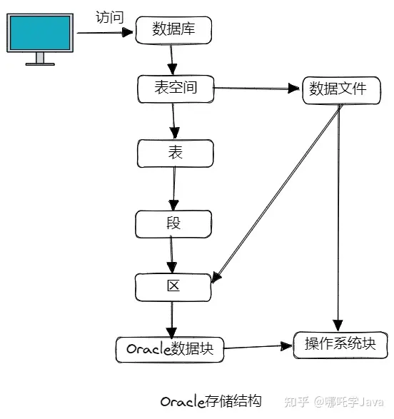
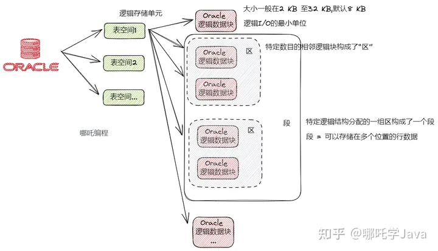
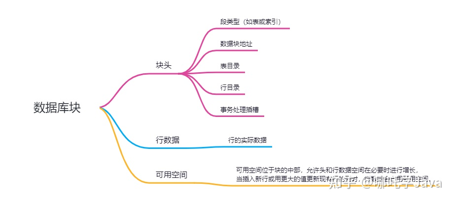
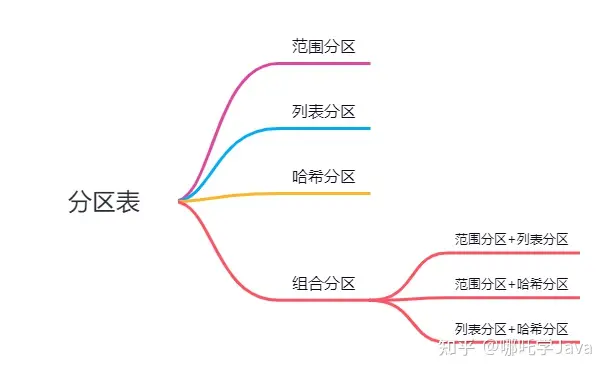

# 一、Oracle是如何存储数据的？
## 1、逻辑存储与物理存储
在国企或者一线大厂，一般都会选择使用Oracle数据库，程序通过mybatis等持久层框架访问Oracle数据库，
指定表空间，表空间内包含若干张表，表中存有行数据，行数据以行片段的形式存储在数据库块中，
① 当插入的行太大，无法装入单个块时；
② 或因为更新的缘故，导致现有行超出了当前空间时 -> 就会发生整个行不存储在一个位置的情况。

Oracle在逻辑上将数据存储在表空间中，在物理上将数据存储在数据文件中。

表空间包括若干个数据文件，这些表空间使用与运行Oracle软件的操作系统一致的物理结构。
数据库的数据存储在构成数据库表空间的数据文件中。

临时文件是一个临时表空间的文件；它是通过TEMPFILE选项创建的。临时表空间不包含表，通常用于排序。



## 2、进一步分析它们之间的关系
- 1）数据库包含若干个表空间（逻辑存储单元）；
- 2）每一个表空间包含很多的Oracle 逻辑数据块，逻辑数据块的大小一般在2 KB 至32 KB，默认8 KB；
- 3）Oracle 数据块是逻辑I/O的最小单位；
- 4）特定数目的相邻逻辑块构成了“区”；
- 5）特定逻辑结构分配的一组区构成了一个段；



## 3、Oracle逻辑数据块



数据库块包含块头、行数据、可用空间。

**（1）块头**
块头包含段类型（如表或索引）、数据块地址、表目录、行目录和事务处理插槽。

每个插槽的大小为24 字节，修改块中的行时会使用这些插槽。

**（2）行数据**
块中行的实际数据。

**（3）可用空间**
可用空间位于块的中部，允许头和行数据空间在必要时进行增长。当插入新行或用更大的值更新现有行的列时，行数据会占用可用空间。

**（4）致块头增长的原因有：**
- 行目录需要更多的行条目；
- 需要的事务处理插槽数多于最初配置的数目；

块中的可用空间最初是相邻的。
但是，删除和更新操作可能会使块中的可用空间变成碎片，需要时Oracle服务器会接合块中的空闲空间。

# 二、Oracle分区表技术
【分区】是指【表】和【索引】可以被分成若干个部分，它们拥有相同的逻辑属性和数据结构。所有分区的字段和索引都是一样的。

【分区表】是将表数据分为若干个可以被单独管理的片，每个片就是一个分区，分一个分区都可以拥有自己的物理属性，
比如表空间、事务槽、存储参数、最小区段数等，通过建分区语句指定，提升可用性和存储效率。

每个分区可以被单独管理，降低管理成本和备份成本，提高容错率，避免“一荣既荣，一损俱损”的问题。

## 1、分区表的优缺点
（1）优点
- 可以通过指定分区提高查询性能；
- 提高容错率，避免“一荣既荣，一损俱损”的问题；
- 降低管理成本；
- 降低备份成本；

（2）缺点
- 普通表和分区表不能直接转换，可以通过数据迁移，再重命名的方式实现，需要重建约束、索引，
  在创建表时可以添加关键字“parallel compress”并行执行，提高效率，下面会通过SQL实例介绍。

## 2、何时分区？
单表的数据量如果过大，会影响SQL的读写性能，我们可以通过分库分表的方式解决表性能的问题。

Oracle的分区表是将一张大表在物理上分成几个较小的表，从逻辑上看仍然是一张完整的表。
这样，每次DML操作只考虑其中一张分区表即可。

那么，临界点是多少呢？
- 数量量超过500万且空间占用超过2GB的时候必须分区；
- 数量量高于100万，低于500万时建议分区；

注意：单个分区的数据可以超过500万，但存储空间不建议超过2GB。

# 三、分区相关的数据字典
根据数据字典表的前缀不同，可查询的内容及权限有所差异：
- DBA_开头：需要DBA权限，查询全库内容；
- ALL_开头：查询当前用户权限下的内容；
- USER_开头：查询当前用户下的内容；

以下是分区表的一些相关字典表，前缀是“DBA_”、“ALL_”、“USER_”；
- 分区表信息字典表：*_PART_TABLES；
- 分区信息字典表：*_TAB_PARTITIONS；
- 子分区信息字典表：*_TAB_SUBPARTITIONS；
- 分区表的分区字段信息字典表：*_PART_KEY_COLUMNS；

# 四、分区表的分类



## 1、范围分区
将数据基于范围映射到每一个分区，这个范围是由创建分区表时指定的分区键决定。

一般选取id或者时间作为范围分区的分区键。

### （1）按月建表，按天分区
```text
create table WORKER_202301
(
id          VARCHAR2(100) not null,
name        VARCHAR2(200),
technology  VARCHAR2(100),
save_date   DATE
)
partition by range (SAVE_DATE)
(
partition WORKER20230129 values less than (TO_DATE('2023-01-30 00:00:00', 'SYYYY-MM-DD HH24:MI:SS', 'NLS_CALENDAR=GREGORIAN'))
tablespace MYSPACE
pctfree 10
initrans 1
maxtrans 255
storage
(
initial 80K
minextents 1
maxextents unlimited
),
partition WORKER20230130 values less than (TO_DATE('2023-01-31 00:00:00', 'SYYYY-MM-DD HH24:MI:SS', 'NLS_CALENDAR=GREGORIAN'))
tablespace MYSPACE
pctfree 10
initrans 1
maxtrans 255
storage
(
initial 80K
minextents 1
maxextents unlimited
)
);

create index IDX_WORKER_ID202301 on WORKER_202301 (ID)
local;
create index IDX_WORKER_ID_NAME202301 on WORKER_202301 (ID, NAME)
local;
```
### （2）建表语句分析
- NLS_CALENDAR=GREGORIAN：
  用于指定Oracle所使用的日历体系，
  其取值为Arabic Hijrah、English Hijrah、Gregorian、Japanese Imperial、Persian、ROC Official、Thai Buddha。
- tablespace：指定表空间；
- pctfree：块保留10%的空间留给更新该块数据使用
- initrans：初始化事务槽的个数；
- maxtrans：最大事务槽的个数；
- storage：存储参数
- initial：区段(extent)一次扩展64k
- minextents：最小区段数
- maxextents unlimited：最大区段无限制

```text
❝ 
每个块都有一个块首部。这个块首部中有一个事务表。
事务表中会建立一些条目来描述哪些事务将块上的哪些行/元素锁定。这个事务表的初始大小由对象的INITRANS 设置指定。
对于表，这个值默认为2（索引的INITRANS 也默认为2）。
事务表会根据需要动态扩展，最大达到MAXTRANS 个条目（假设块上有足够的自由空间）。
所分配的每个事务条目需要占用块首部中的23～24 字节的存储空间。
注意，对于Oracle 10g，MAXTRANS 则会忽略，所有段的MAXTRANS 都是255。
由于oracle块里有一个PCT_free的概念，
即oracle会预留块大小的10%作为缓冲，当修改oracle的事务增加时，事务槽向下增长，
当更新oracle块的数据时，数据向上增长，PCT_free的空间被压缩。
❞
```

【local索引】是针对单个分区表的索引；

在对分区表进行维护操作时需检查索引是否失效，索引失效除了会导致查询慢，还会导致数据写入失败，
在ALTER TABLE语法中也可以添加关键字“UPDATE INDEXES”避免维护表时索引失效。

### （3）插入三条数据
```text
insert into worker_202301 (id,name,technology,save_date) values ('1','哪吒','java',to_date('2023/1/29 22:45:19','yyyy-MM-dd hh24:mi:ss'));
insert into worker_202301 (id,name,technology,save_date) values ('2','云韵','java',to_date('2023/1/29 22:46:19','yyyy-MM-dd hh24:mi:ss'));
insert into worker_202301 (id,name,technology,save_date) values ('3','美杜莎','Python',to_date('2023/1/30 00:45:19','yyyy-MM-dd hh24:mi:ss'));
```

### （4）查询指定分区
```text
select * from worker_202301
partition (WORKER20230129);
```
跨分区查询时，查询每个分区的数据后使用UNION ALL关键字做集合查询，提高查询效率。

### （5）添加分区
```text
ALTER TABLE worker_202301
ADD PARTITION WORKER20230131
VALUES LESS THAN
(TO_DATE('2023-02-01 00:00:00',
'SYYYY-MM-DD HH24:MI:SS',
'NLS_CALENDAR=GREGORIAN'));
```

### （6）删除分区
```text
ALTER TABLE worker_202301
DROP PARTITION WORKER20230131;
```

## 2、列表分区
### （1）列表分区适用于一个字段只有「固定」的几个值，比如类型、月份、课程等。
```text
create table WORKER_202302
(
id          VARCHAR2(100) not null,
name        VARCHAR2(200),
technology  VARCHAR2(100),
save_date   DATE
)
partition by list (technology)
(
partition technology_java values ('java'),
partition technology_python values ('python'),
partition technology_c values ('c')
);

create index IDX_WORKER_ID202301 on WORKER_202301 (ID)
local;
create index IDX_WORKER_ID_NAME202301 on WORKER_202301 (ID, NAME)
local;
```
### （2）插入三条数据
```text
insert into worker_202302 (id,name,technology,save_date) values ('1','哪吒','java',to_date('2023/2/1 22:45:19','yyyy-MM-dd hh24:mi:ss'));
insert into worker_202302 (id,name,technology,save_date) values ('2','云韵','java',to_date('2023/2/1 22:46:19','yyyy-MM-dd hh24:mi:ss'));
insert into worker_202302 (id,name,technology,save_date) values ('3','美杜莎','python',to_date('2023/2/2 00:45:19','yyyy-MM-dd hh24:mi:ss'));
```

### （3）查询列表分区数据
```text
select * from worker_202302
partition (technology_java);
```

### （4）如果一个分区的数据量不大，可以合并分区
```text
create table WORKER_202303
(
id          VARCHAR2(100) not null,
name        VARCHAR2(200),
technology  VARCHAR2(100),
save_date   DATE
)
partition by list (technology)
(
partition technology_java values ('java','python'),
partition technology_c values ('c','c++')
);
```

## 3、哈希分区
【范围分区】和【列表分区】都是使用某一个字段进行分区，此字段的分区度大才行，但也会产生诸多问题，
比如上述的按技术列表分区，现阶段，Java开发人员明显高于C，此时就会导致分区不均匀的问题。

此时，hash分区闪亮登场，hash分区的好处是让分区更均匀一些。

### （1）上面的诸多参数都可以省略。
```text
create table WORKER_202304
(
id          VARCHAR2(100) not null,
name        VARCHAR2(200),
technology  VARCHAR2(100),
save_date   DATE
)
partition by hash (id)
(
partition worker_id_1,
partition worker_id_2,
partition worker_id_3,
partition worker_id_4,
);
```
此时，插入200条数据，id从1到200，验证一下是否均匀。数据条数分别是51、55、61、33。
```text
select * from WORKER_202304;

select count(1) from WORKER_202304 partition (worker_id_1);
select count(1) from WORKER_202304 partition (worker_id_2);
select count(1) from WORKER_202304 partition (worker_id_3);
select count(1) from WORKER_202304 partition (worker_id_4);
```

### （2）何时使用hash分区？
- 分区键的值最好是连续的；
- 分区数量最好是2的n次方，对hash运算更加友好；

### （3）添加hash分区：
```text
ALTER TABLE worker_202304
ADD PARTITION worker_id_5;
```
刚创建好分区，worker_id_5就有数据了，why？匪夷所思。

添加分区时，所有数据会重新计算hash值，重新分配到不同的分区表中。

### （4）不可以删除hash分区
hash分区不能删除。

## 4、范围列表组合分区
### （1）建表语句
```text
create table WORKER_202305
(
id          VARCHAR2(100) not null,
name        VARCHAR2(200),
technology  VARCHAR2(100),
save_date   DATE
)
partition by range (SAVE_DATE) SUBPARTITION BY LIST (technology)
(
partition WORKER20230529 values less than (TO_DATE(' 2023-05-30 00:00:00', 'SYYYY-MM-DD HH24:MI:SS', 'NLS_CALENDAR=GREGORIAN'))
(
SUBPARTITION technology_java_29 values('java'),
SUBPARTITION technology_python_29 values('python'),
SUBPARTITION technology_c_29 values('c')
),
partition WORKER20230530 values less than (TO_DATE(' 2023-05-31 00:00:00', 'SYYYY-MM-DD HH24:MI:SS', 'NLS_CALENDAR=GREGORIAN'))
(
SUBPARTITION technology_java_30 values('java'),
SUBPARTITION technology_python_30 values('python'),
SUBPARTITION technology_c_30 values('c')
)
);
```

### （2）插入8条数据
```text
insert into worker_202305 (id,name,technology,save_date) values ('101','哪吒','java',to_date('2023/5/29 22:45:19','yyyy-MM-dd hh24:mi:ss'));
insert into worker_202305 (id,name,technology,save_date) values ('102','云韵','java',to_date('2023/5/29 22:46:19','yyyy-MM-dd hh24:mi:ss'));
insert into worker_202305 (id,name,technology,save_date) values ('103','美杜莎','java',to_date('2023/5/29 00:45:19','yyyy-MM-dd hh24:mi:ss'));
insert into worker_202305 (id,name,technology,save_date) values ('104','哪吒','java',to_date('2023/5/29 22:45:19','yyyy-MM-dd hh24:mi:ss'));
insert into worker_202305 (id,name,technology,save_date) values ('105','云韵1','python',to_date('2023/5/30 22:46:19','yyyy-MM-dd hh24:mi:ss'));
insert into worker_202305 (id,name,technology,save_date) values ('106','美杜莎1','python',to_date('2023/5/30 00:45:19','yyyy-MM-dd hh24:mi:ss'));
insert into worker_202305 (id,name,technology,save_date) values ('107','哪吒1','python',to_date('2023/5/30 22:45:19','yyyy-MM-dd hh24:mi:ss'));
insert into worker_202305 (id,name,technology,save_date) values ('108','云韵1','python',to_date('2023/5/30 22:46:19','yyyy-MM-dd hh24:mi:ss'));
```

### （3）查询分区数据
```text
select count(1) from worker_202305 PARTITION (WORKER20230529); //4条 ok
select count(1) from worker_202305 PARTITION (WORKER20230530); //4条 ok
select count(1) from worker_202305 SUBPARTITION (TECHNOLOGY_JAVA_29); //4条 ok
select count(1) from worker_202305 SUBPARTITION (TECHNOLOGY_JAVA_30); //0条 ok
```

### （4）添加主分区
```text
ALTER TABLE worker_202305 ADD PARTITION WORKER20230531 values less than (TO_DATE(' 2023-06-1 00:00:00', 'SYYYY-MM-DD HH24:MI:SS', 'NLS_CALENDAR=GREGORIAN'))
(
SUBPARTITION technology_java_31 values('java'),
SUBPARTITION technology_python_31 values('python'),
SUBPARTITION technology_c_31 values('c')
)
```
为WORKER20230529添加子分区technology_go_29：
```text
ALTER TABLE worker_202305
MODIFY PARTITION WORKER20230529
ADD SUBPARTITION technology_go_29 values('go');
```

### （5）删除子分区
```text
ALTER TABLE worker_202305
DROP SUBPARTITION technology_go_29;
```

## 5、范围哈希组合分区
### （1）建表语句
```text
create table WORKER_202306
(
id          VARCHAR2(100) not null,
name        VARCHAR2(200),
technology  VARCHAR2(100),
save_date   DATE
)
partition by range (SAVE_DATE) SUBPARTITION BY HASH (id)
(
partition WORKER20230628 values less than (TO_DATE('2023-06-29 00:00:00', 'SYYYY-MM-DD HH24:MI:SS', 'NLS_CALENDAR=GREGORIAN'))
(
SUBPARTITION worker_id_1,
SUBPARTITION worker_id_2,
SUBPARTITION worker_id_3,
SUBPARTITION worker_id_4
),
partition WORKER20230629 values less than (TO_DATE('2023-06-30 00:00:00', 'SYYYY-MM-DD HH24:MI:SS', 'NLS_CALENDAR=GREGORIAN'))
(
SUBPARTITION worker_id_5,
SUBPARTITION worker_id_6,
SUBPARTITION worker_id_7,
SUBPARTITION worker_id_8
)
);
```

（2）插入10条数据
```text
insert into worker_202306 (id,name,technology,save_date) values ('101','哪吒','java',to_date('2023/6/28 22:45:19','yyyy-MM-dd hh24:mi:ss'));
insert into worker_202306 (id,name,technology,save_date) values ('102','云韵','java',to_date('2023/6/28 22:46:19','yyyy-MM-dd hh24:mi:ss'));
insert into worker_202306 (id,name,technology,save_date) values ('103','美杜莎','java',to_date('2023/6/28 00:45:19','yyyy-MM-dd hh24:mi:ss'));
insert into worker_202306 (id,name,technology,save_date) values ('104','哪吒','java',to_date('2023/6/28 22:45:19','yyyy-MM-dd hh24:mi:ss'));
insert into worker_202306 (id,name,technology,save_date) values ('105','云韵1','python',to_date('2023/6/29 22:46:19','yyyy-MM-dd hh24:mi:ss'));
insert into worker_202306 (id,name,technology,save_date) values ('106','美杜莎1','python',to_date('2023/6/29 00:45:19','yyyy-MM-dd hh24:mi:ss'));
insert into worker_202306 (id,name,technology,save_date) values ('107','哪吒1','python',to_date('2023/6/29 22:45:19','yyyy-MM-dd hh24:mi:ss'));
insert into worker_202306 (id,name,technology,save_date) values ('108','云韵1','python',to_date('2023/6/29 22:46:19','yyyy-MM-dd hh24:mi:ss'));
insert into worker_202306 (id,name,technology,save_date) values ('109','云韵1','python',to_date('2023/6/29 22:46:19','yyyy-MM-dd hh24:mi:ss'));
insert into worker_202306 (id,name,technology,save_date) values ('110','云韵1','python',to_date('2023/6/29 22:46:19','yyyy-MM-dd hh24:mi:ss'));
```
### （3）查询分区数据
```text
select count(1) from worker_202306 PARTITION (WORKER20230628);
select count(1) from worker_202306 PARTITION (WORKER20230629);
select count(1) from worker_202306 SUBPARTITION (worker_id_1);
select count(1) from worker_202306 SUBPARTITION (worker_id_2);
select count(1) from worker_202306 SUBPARTITION (worker_id_5);
select count(1) from worker_202306 SUBPARTITION (worker_id_6);
```
由于hash分区的缘故，数据分布不均匀。

## 6、列表哈希组合分区
### （1）建表语句
```text
create table WORKER_202307
(
id        VARCHAR2(100) not null,
name      VARCHAR2(200),
technology      VARCHAR2(100),
save_date DATE
)
partition by list (technology) SUBPARTITION BY HASH (id)
(
partition technology_java values ('java')
(
SUBPARTITION worker_id_1,
SUBPARTITION worker_id_2,
SUBPARTITION worker_id_3,
SUBPARTITION worker_id_4
),
partition technology_python values ('python')
(
SUBPARTITION worker_id_5,
SUBPARTITION worker_id_6,
SUBPARTITION worker_id_7,
SUBPARTITION worker_id_8
)
);
```

### （2）插入10条数据
```text
insert into worker_202307 (id,name,technology,save_date) values ('101','哪吒','java',to_date('2023/7/28 22:45:19','yyyy-MM-dd hh24:mi:ss'));
insert into worker_202307 (id,name,technology,save_date) values ('102','云韵','java',to_date('2023/7/28 22:46:19','yyyy-MM-dd hh24:mi:ss'));
insert into worker_202307 (id,name,technology,save_date) values ('103','美杜莎','java',to_date('2023/7/28 00:45:19','yyyy-MM-dd hh24:mi:ss'));
insert into worker_202307 (id,name,technology,save_date) values ('104','哪吒','java',to_date('2023/7/28 22:45:19','yyyy-MM-dd hh24:mi:ss'));
insert into worker_202307 (id,name,technology,save_date) values ('105','云韵1','python',to_date('2023/7/29 22:46:19','yyyy-MM-dd hh24:mi:ss'));
insert into worker_202307 (id,name,technology,save_date) values ('106','美杜莎1','python',to_date('2023/7/29 00:45:19','yyyy-MM-dd hh24:mi:ss'));
insert into worker_202307 (id,name,technology,save_date) values ('107','哪吒1','python',to_date('2023/7/29 22:45:19','yyyy-MM-dd hh24:mi:ss'));
insert into worker_202307 (id,name,technology,save_date) values ('108','云韵1','python',to_date('2023/7/29 22:46:19','yyyy-MM-dd hh24:mi:ss'));
insert into worker_202307 (id,name,technology,save_date) values ('109','云韵1','python',to_date('2023/7/29 22:46:19','yyyy-MM-dd hh24:mi:ss'));
insert into worker_202307 (id,name,technology,save_date) values ('110','云韵1','python',to_date('2023/7/29 22:46:19','yyyy-MM-dd hh24:mi:ss'));
```

### （3）查询分区数据
```text
select count(1) from worker_202307 PARTITION (technology_java);
select count(1) from worker_202307 PARTITION (technology_python);
select count(1) from worker_202307 SUBPARTITION (worker_id_1);
select count(1) from worker_202307 SUBPARTITION (worker_id_2);
select count(1) from worker_202307 SUBPARTITION (worker_id_5);
select count(1) from worker_202307 SUBPARTITION (worker_id_6);
```

# 五、对已有表进行分区
## 1、先创建一张表，再插入200条数据。
```text
create table WORKER_202308
(
id          number not null,
name        VARCHAR2(200),
technology  VARCHAR2(100),
save_date   DATE
)
```

## 2、创建一张新表，建一个范围分区
```text
create table WORKER_202308_tab
(
id          number not null,
name        VARCHAR2(200),
technology  VARCHAR2(100),
save_date   DATE
)
partition by range (id)
(
partition WORKER1 values less than (201)
);
```

## 3、把原表数据插入到新表
```text
select * from WORKER_202308;
select * from WORKER_202308_tab;

ALTER TABLE WORKER_202308_tab
EXCHANGE PARTITION WORKER1
WITH TABLE WORKER_202308
WITHOUT VALIDATION;
```
成功转移。

## 4、删除原表、新表改名
```text
DROP TABLE WORKER_202308;
RENAME WORKER_202308_tab TO WORKER_202308;
```

## 5、将一个分区拆分成多个分区，分区界限元素必须是一个：字符串，日期时间或间隔文字。
```text
ALTER TABLE WORKER_202308
SPLIT PARTITION WORKER1 AT (id)
INTO (PARTITION WORKER2,PARTITION WORKER3);
```
上面语句会报错：ORA-14019：分区界限元素必须是一个：字符串，日期时间或间隔文字。

AT括号内不能是字段名称，改为数字即可。
```text
ALTER TABLE WORKER_202308
SPLIT PARTITION WORKER1 AT (180)
INTO (PARTITION WORKER2,PARTITION WORKER3);
```
注意：不能修改分区列的数据类型，否则会报错：ORA-14060：不能修改分区列的数据类型或长度。

通过sql查询验证分区是否成功。
```text
SELECT * FROM USER_TAB_PARTITIONS
WHERE TABLE_NAME='WORKER_202309';
```

通过sql查询分区数据：
```text
select count(1) from WORKER_202309
PARTITION (WORKER1); // 分区不存在 ok

select count(1) from WORKER_202309
PARTITION (WORKER2); // 179条数据 ok

select count(1) from WORKER_202309
PARTITION (WORKER3); // 21条数据 ok
```

## 6、截断分区
截断分区是指删除某个分区中的数据，并不会删除分区，也不会删除其它分区中的数据。
```text
ALTER TABLE WORKER_202309
TRUNCATE PARTITION WORKER3;
```

## 7、合并分区
```text
ALTER TABLE WORKER_202309
MERGE PARTITIONS WORKER2,WORKER3
INTO PARTITION WORKER3 ;
```

# 六、小结
使用Oracle这么久，第一次系统的了解Oracle的存储结构，Oracle -> 表空间 -> 段 -> 区 -> 逻辑数据块。

了解了Oracle分区表技术适用于哪些场景、何时分区、分区表的分类，并通过SQL实例进行了实战演练。

oracle分区表本地索引和全局索引