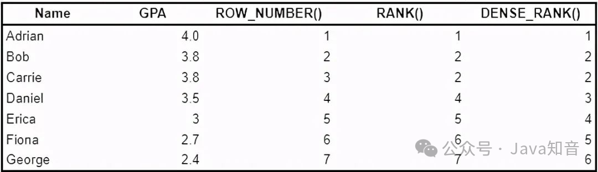

## 1.常见表表达式（CTEs）
如果您想要查询子查询，那就是CTEs施展身手的时候 - CTEs基本上创建了一个临时表。

使用常用表表达式（CTEs）是模块化和分解代码的好方法，与您将文章分解为几个段落的方式相同。

请在Where子句中使用子查询进行以下查询。
```text
SELECT
    name,
    salary
FROM People
WHERE
    NAME IN ( SELECT DISTINCT NAME FROM population WHERE country = "Canada" AND city = "Toronto" )
AND salary >= (
    SELECT
    AVG( salary )
    FROM
    salaries
    WHERE
    gender = "Female"
)
```
这似乎似乎难以理解，但如果在查询中有许多子查询，那么怎么样？这就是CTEs发挥作用的地方。
```text
with toronto_ppl as (
    SELECT DISTINCT name
    FROM population
    WHERE country = "Canada"
    AND city = "Toronto"
)
, avg_female_salary as (
    SELECT AVG(salary) as avgSalary
    FROM salaries
    WHERE gender = "Female"
)
SELECT
    name, salary
FROM People
WHERE name in (SELECT DISTINCT FROM toronto_ppl)
AND salary >= (SELECT avgSalary FROM avg_female_salary)
```
现在很清楚，Where子句是在多伦多的名称中过滤。
如果您注意到，CTE很有用，因为您可以将代码分解为较小的块，但它们也很有用，因为它允许您为每个CTE分配变量名称（即toronto_ppl和avg_female_salary）

同样，CTEs允许您完成更高级的技术，如创建递归表。

## 2.递归CTEs.
递归CTE是引用自己的CTE，就像Python中的递归函数一样。递归CTE尤其有用，它涉及查询组织结构图，文件系统，网页之间的链接图等的分层数据，尤其有用。

递归CTE有3个部分：
* **锚构件**：返回CTE的基本结果的初始查询
* **递归成员**：引用CTE的递归查询。这是所有与锚构件的联盟
* **停止递归构件的终止条件**

以下是获取每个员工ID的管理器ID的递归CTE的示例：
```text
with org_structure as (
SELECT id
, manager_id
FROM staff_members
WHERE manager_id IS NULL
UNION ALL
SELECT sm.id
, sm.manager_id
FROM staff_members sm
INNER JOIN org_structure os
ON os.id = sm.manager_id
```

## 3.临时函数
如果您想了解有关临时函数的更多信息，请检查此项，但知道如何编写临时功能是重要的原因：
* 它允许您将代码的块分解为较小的代码块
* 它适用于写入清洁代码
* 它可以防止重复，并允许您重用类似于使用Python中的函数的代码。

考虑以下示例：
```text
SELECT 
    name
    , CASE WHEN tenure < 1 THEN "analyst"
            WHEN tenure BETWEEN 1 and 3 THEN "associate"
            WHEN tenure BETWEEN 3 and 5 THEN "senior"
            WHEN tenure > 5 THEN "vp"
            ELSE "n/a"
        END AS seniority
FROM employees
```

相反，您可以利用临时函数来捕获案例子句。
```text
CREATE TEMPORARY FUNCTION get_seniority(tenure INT64) AS (
    CASE WHEN tenure < 1 THEN "analyst"
        WHEN tenure BETWEEN 1 and 3 THEN "associate"
        WHEN tenure BETWEEN 3 and 5 THEN "senior"
        WHEN tenure > 5 THEN "vp"
        ELSE "n/a"
    END
);
SELECT name, get_seniority(tenure) as seniority
FROM employees
```
通过临时函数，查询本身更简单，更可读，您可以重复使用资历函数！

## 4.使用CASE WHEN枢转数据
您很可能会看到许多要求在陈述时使用CASE WHEN的问题，这只是因为它是一种多功能的概念。如果要根据其他变量分配某个值或类，则允许您编写复杂的条件语句。

较少众所周知，它还允许您枢转数据。例如，如果您有一个月列，并且您希望为每个月创建一个单个列，则可以使用语句追溯数据的情况。

示例问题：编写SQL查询以重新格式化表，以便每个月有一个收入列。

Initial table:  
+------+---------+-------+  
| id   | revenue | month |  
+------+---------+-------+  
| 1    | 8000    | Jan   |  
| 2    | 9000    | Jan   |  
| 3    | 10000   | Feb   |  
| 1    | 7000    | Feb   |  
| 1    | 6000    | Mar   |  
+------+---------+-------+

Result table:  
+------+-------------+-------------+-------------+-----+-----------+  
| id   | Jan_Revenue | Feb_Revenue | Mar_Revenue | ... | Dec_Revenue |  
+------+-------------+-------------+-------------+-----+-----------+  
| 1    | 8000        | 7000        | 6000        | ... | null        |  
| 2    | 9000        | null        | null        | ... | null        |  
| 3    | null        | 10000       | null        | ... | null        |  
+------+-------------+-------------+-------------+-----+-----------+

## 5.EXCEPT vs NOT IN
除了几乎不相同的操作。它们都用来比较两个查询/表之间的行。所说，这两个人之间存在微妙的细微差别。

首先，除了过滤删除重复并返回不同的行与不在中的不同行。

同样，除了在查询/表中相同数量的列，其中不再与每个查询/表比较单个列。

## 6.自联结
一个SQL表自行连接自己。你可能会认为没有用，但你会感到惊讶的是这是多么常见。在许多现实生活中，数据存储在一个大型表中而不是许多较小的表中。
在这种情况下，可能需要自我连接来解决独特的问题。

让我们来看看一个例子。

示例问题：给定下面的员工表，写出一个SQL查询，了解员工的工资，这些员工比其管理人员工资更多。对于上表来说，Joe是唯一一个比他的经理工资更多的员工。

+----+-------+--------+-----------+  
| Id | Name  | Salary | ManagerId |  
+----+-------+--------+-----------+  
| 1  | Joe   | 70000  | 3         |  
| 2  | Henry | 80000  | 4         |  
| 3  | Sam   | 60000  | NULL      |  
| 4  | Max   | 90000  | NULL      |  
+----+-------+--------+-----------+Answer:  

```text
SELECT  
a.Name as Employee  
FROM  
Employee as a  
JOIN Employee as b on a.ManagerID = b.Id  
WHERE a.Salary > b.Salary
```

## 7.Rank vs Dense Rank vs Row Number
它是一个非常常见的应用，对行和价值进行排名。以下是公司经常使用排名的一些例子：

按购物，利润等数量排名最高值的客户

排名销售数量的顶级产品

以最大的销售排名顶级国家

排名在观看的分钟数，不同观众的数量等观看的顶级视频。

在SQL中，您可以使用几种方式将“等级”分配给行，我们将使用示例进行探索。考虑以下Query和结果：
```text
SELECT Name  
, GPA  
, ROW_NUMBER() OVER (ORDER BY GPA desc)  
, RANK() OVER (ORDER BY GPA desc)  
, DENSE_RANK() OVER (ORDER BY GPA desc)  
FROM student_grades
```



ROW_NUMBER()返回每行开始的唯一编号。当存在关系时（例如，BOB vs Carrie），ROW_NUMBER()如果未定义第二条标准，则任意分配数字。

Rank()返回从1开始的每行的唯一编号，除了有关系时，Rank()将分配相同的数字。同样，差距将遵循重复的等级。

dense_rank()类似于Rank()，除了重复等级后没有间隙。请注意，使用dense_rank()，Daniel排名第3，而不是第4位。

## 8.计算Delta值
另一个常见应用程序是将不同时期的值进行比较。例如，本月和上个月的销售之间的三角洲是什么？或者本月和本月去年这个月是什么？

在将不同时段的值进行比较以计算Deltas时，这是Lead()和LAG()发挥作用时。

这是一些例子：
```text
# Comparing each month's sales to last month
SELECT month  
, sales  
, sales - LAG(sales, 1) OVER (ORDER BY month)  
FROM monthly_sales
# Comparing each month's sales to the same month last year
SELECT month  
, sales  
, sales - LAG(sales, 12) OVER (ORDER BY month)  
FROM monthly_sales
```

## 9.计算运行总数
如果你知道关于row_number()和lag()/lead()，这可能对您来说可能不会惊喜。但如果你没有，这可能是最有用的窗口功能之一，特别是当您想要可视化增长！

使用具有SUM()的窗口函数，我们可以计算运行总数。请参阅下面的示例：
```text
SELECT Month  
, Revenue  
, SUM(Revenue) OVER (ORDER BY Month) AS Cumulative  
FROM monthly_revenue
```


## 10.日期时间操纵
您应该肯定会期望某种涉及日期时间数据的SQL问题。例如，您可能需要将数据分组组或将可变格式从DD-MM-Yyyy转换为简单的月份。

示例问题：给定天气表，写一个SQL查询，以查找与其上一个（昨天）日期相比的温度较高的所有日期的ID。

+---------+------------------+------------------+  
| Id(INT) | RecordDate(DATE) | Temperature(INT) |  
+---------+------------------+------------------+  
|       1 |       2015-01-01 |               10 |  
|       2 |       2015-01-02 |               25 |  
|       3 |       2015-01-03 |               20 |  
|       4 |       2015-01-04 |               30 |  
+---------+------------------+------------------+
Answer:  
```text
SELECT  
    a.Id  
FROM  Weather a,  Weather b  
WHERE  a.Temperature > b.Temperature  
AND DATEDIFF(a.RecordDate, b.RecordDate) = 1
```
就这样！我希望这有助于您在面试准备中 - 我相信，如果您知道这10个内部概念，那么在那里大多数SQL问题时，你会做得很好。