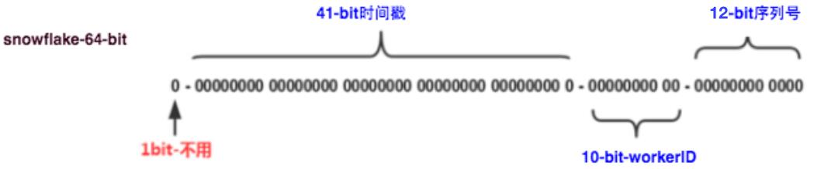
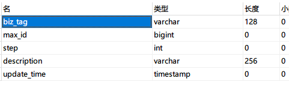

# 前言
日常开发中，数据需要使用唯一的ID来标识，一般情况下使用自增主键作为数据ID。
但是在大数量的情况下，往往会引入分库分表，这时自增ID已经无法满足需求了，就需要一个能够生成全局唯一ID的系统。

# 分布式ID
在分布式系统中，因为有多个计算节点，所以在生成唯一标识符（ID）时，不能依赖单点生成，需要保证在全局范围内每个ID是唯一的，
这种全局唯一的ID就是所谓的分布式ID。

以下是一些典型的生成分布式ID的需求和原则：

- 「全局唯一性」：无论ID在何处生成，都需要保证在全局范围内是唯一的。
- 「趋势递增」：在MySQL InnoDB引擎中使用的是聚簇索引，由于多数RDBMS使用B-tree的数据结构来存储索引数据，
    所以在索引列上如果使用自增ID，那么每次插入新的记录，都是添加到当前索引节点的最右边，当一页满了以后，就会分裂出新的页，
    因此写操作（包括更新和删除）都不会触发结构调整，效率较高。这是为什么许多人推荐使用趋势递增的ID。
- 「一定含义」：在某些场景下，我们希望ID能够携带一些信息，例如创建时间、业务类型等。
- 「高效性能」：ID生成效率要高，不能存在严重的性能瓶颈。
- 「可用性」：保证在服务宕机后，依然能够获取到ID。

一些常见的分布式ID生成策略有：UUID、雪花算法（Twitter的Snowflake）、数据库自增ID、基于Redis的ID生成方案等。
具体选择哪种方案，需要根据系统的实际需求来决定。

# 常见分布式ID生成方法
## UUID
UUID 是由 128 位的数字组成，通常由 32 个字符表示，以特定的方式排列，例如：550e8400-e29b-41d4-a716-446655440000。
这种方式生成的唯一标识符在全局范围内都是唯一的。

由于 UUID 是由 128 位的数生成的，所以 UUID 的总数是 2 的 128 次方，这是一个极其庞大的数字，
大到在实际应用中，生成两个相同的 UUID 的概率可以忽略不计。

UUID 的主要目的是让信息的创建者能够创建唯一的标识符，而不需要通过中心数据库来保证其唯一性。
因此，无论是在分布式系统还是在单个项目中，都可以使用 UUID 生成独特的键。

UUID 有多种生成版本，包括：

- 基于时间和 MAC 地址的 UUID（Version 1）。
- DCE 安全的 UUID（Version 2）。
- 基于 MD5 散列和命名空间的 UUID（Version 3）。
- 基于随机数的 UUID（Version 4）。
- 基于 SHA-1 散列和命名空间的 UUID（Version 5）。

其中在java中我们用到的四Version4版本生成的。

```text
UUID uuid = UUID.randomUUID();
System.out.println(uuid.toString());
```

**「优缺点：」**

- 「优点：」
    本地生成，没有网络消耗。

- 「缺点：」
    不易存储，uuid太长了。如果用的Version1 MAC地址生成的，可能会导致MAC地址泄漏。

从Mysql索引角度思考：
```text
mysql的主键尽量越短越好，一方面根据索引定位比较索引的时候，占用空间越小比较越快。
另一方面排序，主键索引是排好序的，如果乱插入会导致之前排好序的叶子节点打破重组。
```

## 雪花算法
雪花算法（Snowflake Algorithm）是 Twitter 公司开源的一种生成全局唯一 ID 的方法，
主要用来满足 Twitter 系统内【高并发请求】和【分布式系统环境】下生成全局唯一标识符的需求。



它是一个64位的二进制数，包括四部分：

- **符号位**：最高位，始终为0。
- **时间戳**：占用41位，精确到毫秒，总共可以容纳约69年的时间。
- **工作机器id**：占用10位，前 5 位表示机房 ID，后 5 位表示机器 ID，最多可以容纳1024个节点。
- **序列号**：一共12位，用来表示序列号。 
  序列号为自增值，代表单台机器每毫秒能够产生的最大ID数(2^12 = 4096)，也就是说单台机器每毫秒最多可以生成4096个唯一ID。

雪花算法的QPS理论上约为409.6w/s。
每个节点每毫秒从0开始不断累加，最多可以累加到4095，一共可以产生4096个ID。
如果在同一毫秒内，单个节点的请求量超过了4096，那么雪花算法将无法生成更多的ID，直到下一个毫秒才能继续生成新的ID。

核心代码如下：
```text
import org.shade.apache.commons.lang3.RandomUtils;
import org.shade.apache.commons.lang3.StringUtils;
import org.shade.apache.commons.lang3.SystemUtils;

import java.net.Inet4Address;
import java.net.UnknownHostException;
import java.util.Arrays;
import java.util.concurrent.TimeUnit;
import java.util.concurrent.locks.LockSupport;

public class SnowflakeIdWorker {

    // 开始时间截 (2022-12-28)
    private final long twepoch = 1672211070000L;

    // 数据标识id所占的位数
    private final long dataCenterIdBits = 5L;

    // 机器id所占的位数
    private final long workerIdBits = 5L;

    // 序列在id中占的位数
    private final long sequenceBits = 12L;

    // 支持的最大数据标识id，结果是31
    private final long maxDatacenterId = -1L ^ (-1L << dataCenterIdBits);

    // 支持的最大机器id，结果是31 (这个移位算法可以很快计算出几位二进制数所能表示的最大十进制数)
    private final long maxWorkerId = -1L ^ (-1L << workerIdBits);

    // 机器ID向左移12位
    private final long workerIdShift = sequenceBits;

    // 数据标识id向左移17位(12+5)
    private final long datacenterIdShift = sequenceBits + workerIdBits;

    // 时间截向左移22位(5+5+12)
    private final long timestampLeftShift = sequenceBits + workerIdBits + dataCenterIdBits;

    // 生成序列的掩码，这里为4095 (0b111111111111=0xfff=4095)
    private final long sequenceMask = -1L ^ (-1L << sequenceBits);

    // 工作机器ID(0~31)
    private long workerId;

    // 数据中心ID(0~31)
    private long datacenterId;

    // 毫秒内序列(0~4095)
    private long sequence = 0L;

    // 上次生成ID的时间截
    private long lastTimestamp = -1L;

    /**
     * 构造函数
     *
     * @param workerId 工作ID (0~31)
     * @param datacenterId 数据中心ID (0~31) 此方法是判断传入的机房号和机器号是否超过了最大值31或者小于0
     */
    public SnowflakeIdWorker(long workerId, long datacenterId) {
        if (workerId > maxWorkerId || workerId < 0) {
            throw new IllegalArgumentException(
                String.format("worker Id can't be greater than %d or less than 0", maxWorkerId));
        }
        if (datacenterId > maxDatacenterId || datacenterId < 0) {
            throw new IllegalArgumentException(
                String.format("datacenter Id can't be greater than %d or less than 0", maxDatacenterId));
        }
        this.workerId = workerId;
        this.datacenterId = datacenterId;
    }

    /**
     * 核心方法 获得下一个ID (该方法是线程安全的)
     *
     * @return SnowflakeId
     */
    public synchronized long nextId() {
        // 获取当前的系统时间
        long timestamp = timeGen();
        // 如果当前时间小于上一次ID生成的时间戳，说明系统时钟回退过这个时候应当抛出异常
        if (timestamp < lastTimestamp) {
            throw new RuntimeException(
                String.format("Clock moved backwards.  Refusing to generate id for %d milliseconds", lastTimestamp - timestamp));
        }
        // 如果是同一时间生成的，则进行毫秒内序列
        if (lastTimestamp == timestamp) {
            // sequence 要增1, 但要预防sequence超过 最大值4095，所以要 与 SEQUENCE_MASK 按位求与
            // 即如果此时sequence等于4095，加1后为4096，再和4095按位与后，结果为0
            sequence = (sequence + 1) & sequenceMask;
            // 毫秒内序列溢出
            if (sequence == 0) {
                // 阻塞到下一个毫秒,获得新的时间戳
                timestamp = tilNextMillis(lastTimestamp);
            }
        } else { // 时间戳改变，毫秒内序列重置
            sequence = 0L;
        }

        // 上次生成ID的时间截
        // 把当前时间赋值给 lastTime, 以便下一次判断是否处在同一个毫秒内
        lastTimestamp = timestamp;

        // 移位并通过或运算拼到一起组成64位的ID
        long id = ((timestamp - twepoch) << timestampLeftShift) // 时间戳减去默认时间 再左移22位 与运算
                    | (datacenterId << datacenterIdShift) // 机房号 左移17位 与运算
                    | (workerId << workerIdShift) // 机器号 左移12位 与运算
                    | sequence; // 序列号无需左移 直接进行与运算
        return id;
    }

    /**
     * 阻塞到下一个毫秒，直到获得新的时间戳
     *
     * @param lastTimestamp 上次生成ID的时间截
     * @return 当前时间戳
     */
    protected long tilNextMillis(long lastTimestamp) {
        long timestamp = timeGen();
        while (timestamp <= lastTimestamp) {
            timestamp = timeGen();
        }
        return timestamp;
    }

    /**
     * 返回以毫秒为单位的当前时间
     *
     * @return 当前时间(毫秒)
     */
    protected long timeGen() {
        return System.currentTimeMillis();
    }

    private static Long getWorkId() {
        try {
            String hostAddress = Inet4Address.getLocalHost().getHostAddress();
            int[] ints = StringUtils.toCodePoints(hostAddress);
            int sums = 0;
            for (int b : ints) {
                sums += b;
            }
            return (long)(sums % 32);
        } catch (UnknownHostException e) {
            return RandomUtils.nextLong(0, 31);
        }
    }

    private static Long getDataCenterId() {
        int[] ints = StringUtils.toCodePoints(SystemUtils.getHostName());
        int sums = 0;
        for (int i : ints) {
            sums += i;
        }
        return (long)(sums % 32);
    }
}
```

**「优缺点：」**

优点：
```text
毫秒在高位，自增在底位，整个ID都是趋势递增的。不依赖第三方系统，分布式系统部署，稳定性高。
可以根据自身业务分配组合bit位，灵活。
```

缺点：
```text
强依赖机器时钟，如果机器时钟回拨，会导致id重复。
其他的那几位都是固定的只有这个时间戳和序列号是动态的，如果时间戳回到之前就会导致重复。
```

**「美团解决雪花算法的时钟问题：」**

首先在启动时，服务会进行检查：

1、新节点通过检查综合对比其余Leaf节点的系统时间，来判断自身系统时间是否准确。
具体做法是：
- 首先，取所有运行中的Leaf-snowflake节点的服务 IP:Port，
- 然后，通过RPC请求得到所有节点的系统时间，计算 sum(time)/nodeSize，
- 然后，看【本机时间】与【这个平均值】是否在阈值之内来确定当前系统时间是否准确，
- 如果准确，则正常启动服务；如果不准确，则认为本机系统时间发生大步长偏移，启动失败。

2、在ZooKeeper中登记过的老节点，同样会比较自身系统时间、ZooKeeper上本节点曾经的记录时间，
以及所有运行中的Leaf-snowflake节点的时间，不准确同样启动失败。

## 数据库生成
### mysql自动递增ID

- 优点：非常简单，成本小，ID单调自增，存储空间小。

- 缺点：如果ID是自增的，会很容易的泄漏ID。支持的并发量不大、存在数据库单点问题。每次获取id都要读取一次数据库。

### Redis

通过 命令incr 来实现id的原子递增。

redis是基于内存的，速度快，但是如果出现redis故障，导致数据丢失，不管RDB还是AOD都有丢失数据的可能，那就意味着ID存在重复。

## 美团Leaf方案实现

世界上没有两片相同的树叶。

### 「Leaf-segment数据库方案」：

这个有类似于JVM内存TLAB，JVM会提前为每个线程分配一块空间，这样线程就不用和其他的线程争抢内存。

说回来，上边说到了mysql每次生成id都需要访问一次数据库。
那么我一次性多拿点，拿上个几千个id，用完了再回来拿，就可以大大减轻数据库的压力。



- biz_tag：用来【区分业务】，
- max_id：表示该biz_tag目前所被分配的ID【号段的最大值】，
- step：表示每次分配的【号段长度】。

这种满足id递增，但是id不够随机，信息不安全，可以根据id算出来一天的订单量。
并且强依赖数据库，如果数据库崩了，导致整个系统不可用(也不是立马不可用，会等系统取出来的值消耗完然后再去数据库取的时候系统崩了)。

```text
TP999：表示在所有的请求中，有99.9%的请求的响应时间是在TP999以内的。
举个例子，如果TP999是200毫秒，那么表示99.9%的请求在200毫秒内就能得到响应。
"TP999数据波动大"意味着这个值在不同时间点可能会有较大的变化，这通常是由于系统负载、网络延迟等因素引起的。
```

这种设计还会导致TP999，只有用完的时候才会取id，导致波动。所以就有了双Buffer优化。

### 「双Buffer优化：」

双Buffer优化其实就是，不要在用完id的时候，再去数据库取id。

当前号段已下发10%时，如果下一个号段未更新，则另启一个更新线程去更新下一个号段。
当前号段全部下发完后，如果下个号段准备好了则切换到下个号段为当前segment接着下发，循环往复。
通常号段的长度设置为高峰期QPS的600倍，这样当DB宕机，系统仍然能发号。

来看一个简易的实现。
```text
static class LeafSegmentIdGenerator {

    // 定义两个Buffer
    private SegmentIdBuffer buffer1 = new SegmentIdBuffer();
    private SegmentIdBuffer buffer2 = new SegmentIdBuffer();
    
    // 当前使用的Buffer
    private volatile SegmentIdBuffer currentBuffer;
    
    // 初始化方法
    public void init() {
        buffer1.load(leafAllocDao.updateMaxIdAndGetLeafAlloc(tag)); //预先加载号段
        currentBuffer = buffer1;
        buffer2.load(leafAllocDao.updateMaxIdAndGetLeafAlloc(tag)); //预先加载号段
    }
    
    public Long getId() {
        if (currentBuffer.canGetId()) { //如果当前Buffer还有ID可以使用
            return currentBuffer.getId();
        } else {
            // 如果当前Buffer的ID已经用完，切换Buffer，并在另一线程中异步加载号段
            if (currentBuffer == buffer1) {
                currentBuffer = buffer2;
                new Thread(() -> buffer1.load(leafAllocDao.updateMaxIdAndGetLeafAlloc(tag))).start();
            } else {
                currentBuffer = buffer1;
                new Thread(() -> buffer2.load(leafAllocDao.updateMaxIdAndGetLeafAlloc(tag))).start();
            }
            return getId();
        }
    }
}
```
