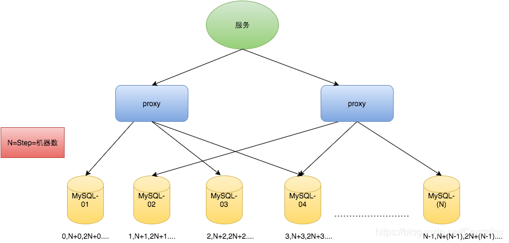
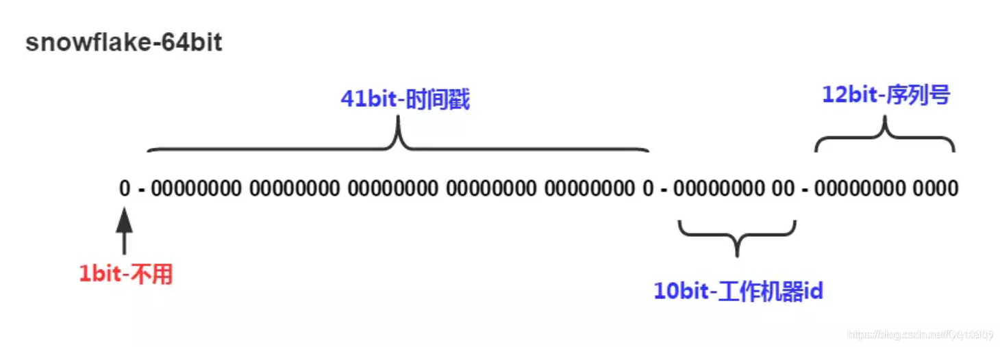
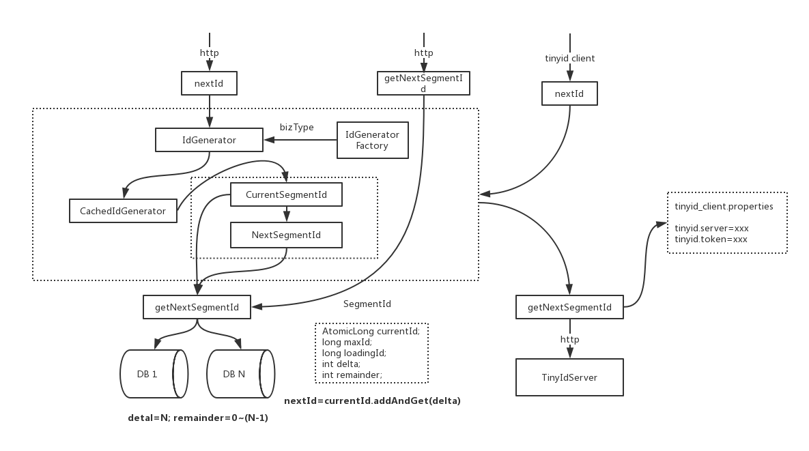
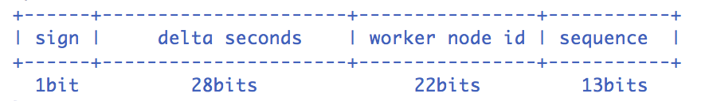

# 一、分布式ID简介
## 什么是分布式ID？
在我们业务数据量不大的时候，单库单表完全可以支撑现有业务，数据再大一点搞个MySQL主从同步读写分离也能对付。

但随着数据日渐增长，主从同步也扛不住了，就需要对数据库进行分库分表，但分库分表后需要有一个唯一ID来标识一条数据，
数据库的自增ID显然不能满足需求；例如我们的订单，需要有一个全局唯一标识的订单号，这个订单号就是分布式ID

## 分布式ID需要满足那些条件？
* 全局唯一：必须保证ID是全局性唯一的，基本要求
* 高可用：不会出现获取不到ID的情况
* 高性能：高可用低延时，ID生成响应要块，否则反倒会成为业务瓶颈
* 简单通用：拿来即用的原则

# 二、 分布式ID都有哪些生成方式？
* UUID
* 数据库自增ID
* 数据库多主模式
* 号段模式
* Redis
* 雪花算法（SnowFlake）
* 滴滴出品（TinyID）
* 百度 （Uidgenerator）
* 美团（Leaf）
* MongoDB的ObjectID

## 1、UUID
```text
String uuid = UUID.randomUUID().toString().replaceAll("-","");
```
**优点：**
- 足够简单，只需要上面一行代码即可生成一个全局唯一的ID，

**缺点：**
- UUID是随机的，没有具体的业务含义，如果用UUID作为订单号，是没有意义的，从这个UUID看不到跟订单有任何的关联关系，
- UUID是一个无序的字符串，不具备趋势自增特性
- 长度过长，存储以及查询对MySQL的性能消耗较大，如果用来作为主键，索引的性能会很差

## 2、数据库自增ID
基于数据库 auto_increment 自增ID也可以生成一个分布式ID。

**优点：**
- 实现简单，ID单调自增，数值类型查询速度快

**缺点：**
- 访问量激增时MySQL本身就是系统的瓶颈，用它来实现分布式服务风险比较大，不推荐！

## 3、数据库集群模式
为了解决第二种数据库单个DB的风险，可以采用数据库集群的模式来解决这个问题。

- 可以使用主从模式解决单DB不满足高可用的问题，需要考虑的问题是：
  主从之间同步是存现时间延迟的，如果主DB挂了可能会有重复的ID生成（原因是什么？ --  主从复制延时导致）。
- 如果担心一个主节点挂掉没法用，那就做双主模式集群，也就是两个Mysql实例都能单独的生产自增ID。
  需要考虑的问题是：1：两个MySQL实例的自增ID都从1开始，会生成重复的ID，怎么解决？2：后续DB扩容怎么办？



## 4、基于数据库的号段模式
号段模式是当下分布式ID生成器的主流实现方式之一，号段模式可以理解为从数据库批量的获取自增ID，每次从数据库取出一个号段范围，
例如 (1,1000] 代表1000个ID，具体的业务服务将本号段，生成1~1000的自增ID并加载到内存，典型的是TinyID。

表结构如下：
```text
CREATE TABLE id_generator (
  id int(10) NOT NULL,
  max_id bigint(20) NOT NULL COMMENT '当前最大id',
  step int(20) NOT NULL COMMENT '号段的布长',
  biz_type int(20) NOT NULL COMMENT '业务类型',
  version int(20) NOT NULL COMMENT '版本号',
  PRIMARY KEY (`id`)
) 
```
等这批号段ID用完，再次向数据库申请新号段，对max_id字段做一次update操作，
update max_id= max_id + step，update成功则说明新号段获取成功，新的号段范围是(max_id ,max_id +step]。

SQL语句：
```text
update id_generator set max_id = #{max_id+step} where biz_type = XXX
```

为了解决并发更新的问题，使用乐观锁控制，优化后的SQL：
```text
update id_generator set max_id = #{max_id+step}, version = version + 1 
where version = # {version} and biz_type = XXX
```

**优点：**
这种分布式ID生成方式不强依赖于数据库，不会频繁的访问数据库，对数据库的压力小很多。

## 5、基于Redis模式
Redis也同样可以实现，原理就是利用redis的 incr命令实现ID的原子性自增。

Redis是内存数据库，需要考虑持久化的问题，redis有两种持久化方式RDB和AOF：
- RDB：会定时打一个快照进行持久化，假如连续自增但redis没及时持久化，而这会Redis挂掉了，重启Redis后会出现ID重复的情况。
- AOF：对每条写命令进行持久化，即使redis挂掉了也不会出现ID重复的情况，但由于incr命令的特殊性，会导致Redis重启恢复的数据时间过长。

## 6、基于雪花算法（Snowflake）模式
雪花算法（Snowflake）是twitter公司内部分布式项目采用的ID生成算法，开源后广受国内大厂的好评，在该算法影响下各大公司相继开发出各具特色的分布式生成器。



Snowflake生成的是Long类型的ID，一个Long类型占8个字节，每个字节占8比特，也就是说一个Long类型占64个比特。

Snowflake ID组成结构：
正数位（占1比特）+ 时间戳（占41比特）+ 机器ID（占5比特）+ 数据中心（占5比特）+ 自增值（占12比特）= 64比特组成的一个Long类型。

- 第一个bit位（1bit）：
  Java中long的最高位是符号位代表正负，正数是0，负数是1，一般生成ID都为正数，所以默认为0。
- 时间戳部分（41bit）：
  毫秒级的时间，不建议存当前时间戳，而是用（当前时间戳 - 固定开始时间戳）的差值，可以使产生的ID从更小的值开始；
  41位的时间戳可以使用69年，(1L << 41) / (1000L * 60 * 60 * 24 * 365) = 69年
- 工作机器id（10bit）：
  也被叫做workId，这个可以灵活配置，机房或者机器号组合都可以。
- 序列号部分（12bit）：
  自增值支持同一毫秒内同一个节点可以生成4096个ID。

Snowflake雪花算法最核心的是中间的10位工作机器ID的分配，做到自动生成workID，避免运维人员的去分配。

**优点：**
- 毫秒数在高位，自增序列在低位，整个ID都是趋势递增的。
- 不依赖数据库等第三方系统，以服务的方式部署，稳定性更高，生成ID的性能也是非常高的。
- 可以根据自身业务特性分配bit位，非常灵活。

**缺点：**
- 强依赖机器时钟，如果机器上时钟回拨，会导致发号重复或者服务会处于不可用状态。
- 根据算法的思路，使用java语言可以直接生成一个工具类，进行本地调用用来生成全局唯一的ID，

参考github地址：[GitHub - beyondfengyu/SnowFlake: Twitter的雪花算法SnowFlake，使用Java语言实现](https://github.com/beyondfengyu/SnowFlake)。

## 7、滴滴出品（TinyID）
Tinyid由滴滴开发，Github地址：[GitHub - didi/tinyid: ID Generator id生成器 分布式id生成系统，简单易用、高性能、高可用的id生成系统](https://github.com/didi/tinyid)

Tinyid是基于号段模式每个服务获取一个号段（1000,2000]、（2000,3000]、（3000,4000]。

**1：具体实现原理：**

- tinyid是基于数据库发号算法实现的，简单来说是数据库中保存了可用的id号段，
  tinyid会将可用号段加载到内存中，之后生成id会直接内存中产生。

- 可用号段在第一次获取id时加载，如当前号段使用达到一定量时，会异步加载下一可用号段，保证内存中始终有可用号段。
  当前号段使用完毕，下一号段会替换为当前号段。依次类推。

**2：架构图**



**提供了两种接入方式：**
- http接入，通过访问tinyid-server来生成ID，其中tinyid-server推荐部署到多个机房的多台机器，这种方式需要考虑网络的延时性
- 使用tinyid-client来获取id，

**优点：**
- id为本地生成(调用AtomicLong.addAndGet方法)，性能大大增加
- client对server访问变的低频，减轻了server的压力，无须担心网络延迟
- 即便所有server挂掉，因为client预加载了号段，依然可以继续使用一段时间

**缺点：**
- 如果client机器较多频繁重启，可能会浪费较多的id（原因是什么？）

## 8、百度 （UidGenerator）
UidGenerator是Java实现的，基于[Snowflake](https://github.com/twitter/snowflake)算法的唯一ID生成器。
Github地址：[GitHub - baidu/uid-generator: UniqueID generator](https://github.com/baidu/uid-generator)

UidGenerator以组件形式工作在应用项目中，支持自定义workerId位数和初始化策略，
从而适用于docker等虚拟化环境下实例自动重启、漂移等场景，UidGenerator通过借用未来时间来解决sequence天然存在的并发限制；
采用RingBuffer来缓存已生成的UID，并行化UID的生产和消费。

**具体算法实现：**

Snowflake算法：



Snowflake算法描述：
指定机器 & 同一时刻 & 某一并发序列，是唯一的，据此可生成一个64bits的唯一ID（long）。

默认采用上图字节分配方式：

- sign(1bit)：
  固定1bit符号标识，即生成的UID为正数。
- delta seconds (28 bits)：
  当前时间，相对于时间基点"2016-05-20"的增量值，单位：秒，最多可支持约8.7年
- worker id (22 bits)：
  机器id，最多可支持约420w次机器启动。内置实现为在启动时由数据库分配，默认分配策略为用后即弃，后续可提供复用策略。
- sequence (13 bits)：
  每秒下的并发序列，13 bits可支持每秒8192个并发。

## 9、美团（Leaf）
Leaf由美团开发，github地址：[GitHub - Meituan-Dianping/Leaf: Distributed ID Generate Service](https://github.com/Meituan-Dianping/Leaf)

同时支持【号段模式】和【Snowflake算法模式】，可以切换使用。

**1：Leaf-segment号段模式：**

在使用数据库的方案上，做了如下改变：
- 原方案每次获取ID都得读写一次数据库，造成数据库压力大。
  改为利用proxy server批量获取，每次获取一个segment(step决定大小)号段的值。
  用完之后再去数据库获取新的号段，可以大大的减轻数据库的压力。
- 各个业务不同的发号需求用biz_tag字段来区分，每个biz-tag的ID获取相互隔离，互不影响。

号段模式的具体实现思路同TinyID一样。

**2：Leaf-snowflake雪花算法：**

完全沿用snowflake方案的bit位设计，即是“1+41+10+12”的方式组装ID号。
为了解决集权下workID的问题，美团的Leaf-snowflake跟百度不一样，
【百度】是通过【数据库】来生成workID，
而【美团】是通过【Zookeeper持久顺序节点】的特性自动对snowflake节点配置workerID，所以Leaf是依赖ZK服务的。

**特点：**

- 弱依赖ZooKeeper：
  除了每次会去ZK拿数据以外，也会在本机文件系统上缓存一个workerID文件。
  当ZooKeeper出现问题，恰好机器出现问题需要重启时，能保证服务能够正常启动。这样做到了对ZK的弱依赖。
- 解决时钟问题：
  因为这种方案依赖时间，如果机器的时钟发生了回拨，那么就会有可能生成重复的ID号，需要解决时钟回退的问题。
