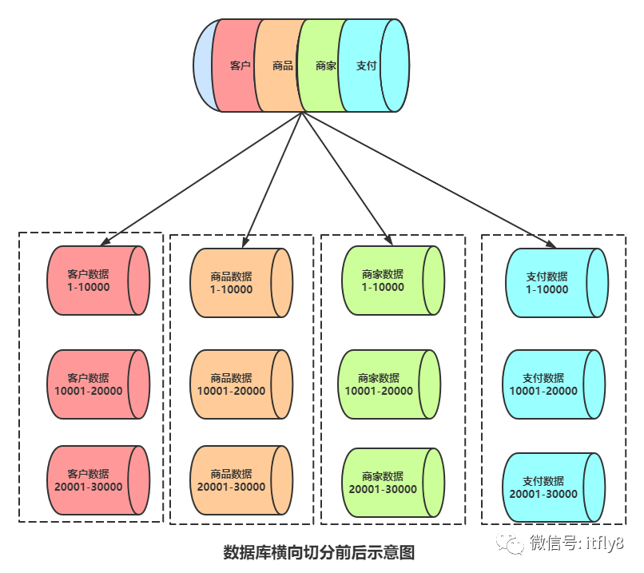

# 零.分布式事务重要概念
## 什么是分布式事务

在日常生活中，很多事要么全部做，要么全部不做，不能只做一部分，不然就会产生其他复杂的问题，很多人喜欢举转账的例子，
对于同一个账号，A在湖北往出转500，B在广东取钱500，那么A转出去之后要将A账号的钱数目扣除，
B账号数目增加: 事务 = (A账号扣除500，B账号增加500)。

看到没，像这样多个步骤放在一起，就是事务，要么都执行，要么都不执行。
如果我们的数据存储在多个数据库中，也就是存在跨库调用，由于网络具有不安全性以及延时性，如何保证事务分布式执行呢？
如果执行到一半断电又该如何处理？

## 本地事务4个特性
在讲解分布式事务之前先简单回顾事务的一些特点，俗称ACID，下面逐一讲解:

- **原子性(Atomic)**
  在化学中，分子构成的物质，分子是保持化学特性的最小单位，如H2O，CO2H2O，CO2等，由原子构成的物质，
  原子保持物质特性，像FeFe啥的，意思就是不可分割，再分成质子中子啥的就不是我们认为的物质了，
  这儿的原子性也是这个道理，就是事务不可以再拆分，例如上面的事务，看着可以是由两个过程组成的事务，
  但是你拆开就不是我们认为该有的过程，所以，事务不可再分，具有原子性。

- **一致性（Consistency）**
  一致性也很好理解，对于上面的两个账户，如果银行想知道自己这儿被存了多少钱，
  那么这个事务执行前，A账号有500块，B账号没有钱，银行账户总共500块，事务执行后A账号没有钱，B账号有500块，
  也就是这个500块是一定的，不可能出现A账号有500块，B账号也有500块，那就数据不一致了。
  这样的话，说明事务中某些步骤执行出现了问题，产生中间数据，那么就不一致。

  在分布式中，对于一个结果，多处同时查询，得出的结果应该是一致的。

- **隔离性（Isolation）**
  一个事务在未完成时，另一个事务不会影响到它，也就是如果B还给C转账1000，记为事务2:

  事务1 = (A账号扣除500，B账号增加500)

  事务2 = (B账号扣除1000，C账号增加1000)

  这两个事务之间不会产生影响，也就是不会发生A转出的500块到达C账号这种情况。

- 持久性（Durability）
  持久化，一般是意味着将数据写入磁盘，不会轻易改变的意思，这儿是事务提交之后，会影响到数据库，不会丢失。
  这也就意味着，随着系统越来越庞大，我们为了提高可用性、维护性、吞吐量等等技术指标，
  就算改善原有架构，业务计算的问题解决后，数据库还是会成为整个系统中的瓶颈。

## 一致性的讨论
ACID本质而言都是为了保护数据的一致性，而数据数据持久化时会触发数据库操作，造成效率低小，
所以围绕一致性(效率)产生了一些讨论，分别是【强一致性】、【弱一致性】、【最终一致性】。

- **强一致性**
  任何一次读都能读到某个数据的最近一次写的数据。系统中的所有进程，看到的操作顺序，都和全局时钟下的顺序一致。
  简言之，在任意时刻，所有节点中的数据是一样的，这就要求数据一有改变就写到数据库。

- **弱一致性**
  数据更新后，不要求及时写入数据库以及同步到所有节点，也就是这时候数据与真实数据可能有一些出入，
  对于架构而言，如果能容忍后续的访问只能访问到部分或者全部访问不到，则是弱一致性。

- **最终一致性**
  不保证在任意时刻任意节点上的同一份数据都是相同的，也就是有些节点数据可能是准确的，有的可能是不准确的， 
  但是随着时间的迁移，不同节点上的同一份数据总是在向趋同的方向变化。
  简单说，就是在一段时间后，节点间的数据会最终达到一致状态。

三种一致性中，【强一致性数据】更加可靠，但是由于时时刻刻要求所有数据库保持数据一致，
所以效率低下，数据没有统一完，请求就没法得到响应。
在高并发场景下，体验不太好，所以在实际使用中，根据不同的业务选择是一致性也不同，
购物时账号付钱肯定是强一致性，但是商品库存数据就不一定非要强一致性，至于商品下面的评论啥的，甚至可以选择弱一致性。

## 分库分表
前面讲过集群的AKF拆分原则(Redis集群拆分原则之AKF)，
大概意思是硬件性能是有上限的，当硬件没法支撑请求流量时，可以将流量分发到不同的服务器上，
AKF拆分之Y轴、Z轴拆分是业务拆分与数据拆分，那也就会涉及到将数据库中的数据拆分存储在不同的地方，
这就叫【分库分表】，不同类型数据存储在不同数据库中做多机存储和负载，这样一来，传统的事务机制ACID便无法正常运行。

【分库分表内容】是数据切分（Sharding），以及切分后对数据的定位、整合。
具体来说，【数据切分】就是将数据分散存储到多个数据库中，使得单一数据库中的数据量变小，
通过扩充主机的数量缓解单一数据库性能问题，从而达到提升数据库操作性能的目的。

数据切分，根据其切分类型，可以分为两种方式：【垂直（纵向）切分】和【水平（横向）切分】。

### 垂直拆分
【垂直切分】常见有【垂直分库】和【垂直分表】两种，两种含义类似。

【垂直分库】就是根据业务耦合性，将【关联度低的不同表】存储在【不同的数据库】。
做法与大系统拆分为多个小系统类似，按业务分类进行独立划分。
与“微服务治理”的做法相似，每个微服务使用单独的一个数据库。如图：

【垂直分表】类似，
例如将一张表包含一个人所有信息，例如姓名、身份证、性别、身高、体重、省、市、区、村、专业、G点等等，那么可以拆分成三个表:
- 第一个表只包含基本信息(姓名、身份证、性别、身高、体重)；
- 第二个表包含籍贯信息(省、市、区、村)；
- 第三个表包含学习信息(专业、G点)。

**垂直拆分优缺点：**
- 垂直切分的优点：
  - 解决业务系统层面的耦合，业务清晰
  - 与微服务的治理类似，也能对不同业务的数据进行分级管理、维护、监控、扩展等
  - 高并发场景下，垂直切分一定程度的提升IO、数据库连接数、单机硬件资源的瓶颈

- 垂直切分的缺点：
  - 部分表无法join，只能通过接口聚合方式解决，提升了开发的复杂度
  - 分布式事务处理复杂
  - 依然存在单表数据量过大的问题（需要水平切分）

### 水平拆分
上面对数据库垂直拆分之后，如果某个库还是好大，比如存储的数据极其庞大，那么可以再对数据库进行水平的拆分:

上面的水平拆分时按照ID区间来切分。例如：将userId为1~10000的记录分到第一个库，10001~20000的分到第二个库，以此类推。
某种意义上，某些系统中使用的“冷热数据分离”，将一些使用较少的历史数据迁移到其他库中，
业务功能上只提供热点数据的查询，也是类似的实践。

除了上面按照用户ID区间拆分，也可以做Hash运算拆分，这儿就不详细展开了。

**水平拆分优缺点：**
- 水平拆分优点：
  - 单表大小可控
  - 天然便于水平扩展，后期如果想对整个分片集群扩容时，只需要添加节点即可，无需对其他分片的数据进行迁移
  - 使用分片字段进行范围查找时，连续分片可快速定位分片进行快速查询，有效避免跨分片查询的问题。

- 水平拆分缺点：
  - 热点数据成为性能瓶颈。
    连续分片可能存在数据热点，例如按时间字段分片，有些分片存储最近时间段内的数据，可能会被频繁的读写，
    而有些分片存储的历史数据，则很少被查询。

## 分库分表带来的问题
分库分表能有效的缓解单机和单库带来的性能瓶颈和压力，突破网络IO、硬件资源、连接数的瓶颈，同时也带来了一些问题。
前面说过，事务包含一组子操作，这些造作要么全部执行，要么全部不执行。
但是分库之后，一个事务可能涉及多个数据库或者多个表扩库执行，而网络具有不稳定性，
也就是事务执行难度加大，分表分库后事务为了与传统事务做出区别，叫做分布式事务(跨分片事务)。

【跨分片事务】也是【分布式事务】，没有简单的方案，一般可使用"XA协议"和"两阶段提交"处理。

分布式事务能最大限度保证了数据库操作的原子性。但在提交事务时需要协调多个节点，推后了提交事务的时间点，延长了事务的执行时间。
导致事务在访问共享资源时发生冲突或死锁的概率增高。
随着数据库节点的增多，这种趋势会越来越严重，从而成为系统在数据库层面上水平扩展的枷锁。

### 最终一致性
对于那些性能要求很高，但对一致性要求不高的系统，往往不苛求系统的实时一致性，
只要在允许的时间段内达到最终一致性即可，可采用事务补偿的方式。

与事务在执行中发生错误后立即回滚的方式不同，事务补偿是一种事后检查补救的措施，
一些常见的实现方法有：对数据进行对账检查，基于日志进行对比，定期同标准数据来源进行同步等等。事务补偿还要结合业务系统来考虑。

## 分布式事务解决思路
讲这个之前需要先简单回顾CAP原则和Base理论，因为分布式事务不同于ACID的刚性事务，
在分布式场景下基于BASE理论，提出了柔性事务的概念。

要想通过柔性事务来达到最终的一致性，就需要依赖于一些特性，这些特性在具体的方案中不一定都要满足，因为不同的方案要求不一样；
但是都不满足的话，是不可能做柔性事务的。

### CAP原则
CAP一般人可能听了不下一百遍了，很多人都说CAP是"三选二"的关系，
让人误以为有AC这种情况，但是实际CAP是二选一的关系，这个在2012年已经有一篇论文进行解释:
CAP Twelve Years Later: How the "Rules" Have Changed

相当于是对之前三选二说法进行修正，
CAP中P(分区容错性)是必须具备的，在满足P的前提下，很难同时满足A(可用性)和C(一致性)，
但是在之后，又有一篇文章:Harvest， yield， and scalable tolerant systems，
这篇论文是基于上面那篇“CAP 12年后”的论文写的，它主要提出了 Harvest 和 Yield 概念，
并把上面那篇论文中所讨论的东西讲得更为仔细了一些。
简单来说就是【满足P之后，C和A在放宽约束后可以得到兼顾】，并不是非此即彼的关系，说远了。

#### 为什么P是必须的?

为什么CAP原则中分区容错性是必须的呢，
首先要理解什么是分区容错性，分区，这儿说的是网络，网络集群设计到很多的服务器，
某一瞬间网络不稳定，那么相当于将网络分成了不同的区，假设分成了两个区，这时候如果有一笔交易:
- 对分区一发出消息:A给B转账100元，
- 对分区二发出消息:A给B转账200元

那么对于两个分区而言，有两种情况:
- a）无可用性，即这两笔交易至少会有一笔交易不会被接受；
- b）无一致性，一半看到的是 A给B转账100元而另一半则看到 A给B转账200元。

所以，分区容忍性必须要满足，解决策略是一个数据项复制到多个节点上，那么出现分区之后，这一数据项就可能分布到各个区里。容忍性就提高了。

### Base理论
在很多时候，我们并不需要强一致性的系统，所以后来，
人们争论关于数据一致性和可用性时，主要是集中在强一致性的ACID或最终一致性的BASE中，
BASE是对CAP中【一致性】和【可用性】权衡的结果，其来源于对大规模互联网分布式系统实践的总结，是基于CAP定律逐步演化而来。

其核心思想是即使无法做到强一致性，但每个应用都可以根据自身业务特点，采用适当的方式来使系统达到【最终一致性】。

BASE理论是Basically Available(基本可用)，Soft State（软状态）和Eventually Consistent（最终一致性）三个短语的缩写。

#### 基本可用
假设系统，出现了不可预知的故障，但还是能用，相比较正常的系统而言：
- 【响应时间】上的损失：
  正常情况下的搜索引擎0.5秒即返回给用户结果，而基本可用的搜索引擎可以在2秒作用返回结果。
- 【功能】上的损失：
  在一个电商网站上，正常情况下，用户可以顺利完成每一笔订单。
  但是到了大促期间，为了保护购物系统的稳定性，部分消费者可能会被引导到一个降级页面。

这就叫基本可用。

#### 软状态
相对于原子性而言，要求多个节点的数据副本都是一致的，这是一种“硬状态”。

【软状态】指的是：
允许系统中的数据存在【中间状态】，并认为该状态不影响系统的整体可用性，即允许系统在多个不同节点的数据副本存在数据延时。

#### 最终一致性
上面说软状态，然后不可能一直是软状态，必须有个时间期限。
在期限过后，应当保证所有副本保持数据一致性，从而达到数据的最终一致性。
这个时间期限取决于网络延时、系统负载、数据复制方案设计等等因素。

**Base其核心思想是：**

既然无法做到强一致性（Strong consistency），但每个应用都可以根据自身的业务特点，
采用适当的方式来使系统达到最终一致性（Eventual consistency）。
有了Base理论就可以开始讲述分布式事务的处理思路了。

# 一.2PC/XA(两阶段提交)

## 1.1 准备阶段

协调者询问参与者是否准备成功，参与者回复结果

## 1.2 提交阶段

如果事务在每个参与者身上都执行成功了，协调者会发通知让所有参与者提交事务，否则，协调者让所有参与者回滚事务

注意：（在准备阶段中，参与者执行了事务，但是并没有提交，只有在提交阶段，接受到协调者通知之后，才会进行提交或者回滚）

## 1.3 存在的问题
- 同步堵塞：
    所有参与者在等待其他参与者响应的过程中都处于同步堵塞状态，无法进行其他操作。
- 单点问题：
    协调者在2PC/XA中起到起到非常大的作用，发生故障将会造成很大影响，
    在第二阶段，如果出现问题，会导致所有参与者处于等待状态，无法进行其他操作。
- 数据不一致：
    在第二阶段，如果协调者只发送了部分Commit消息，此时出现了故障，就会导致部分参与者提交事务，
    其他参与者没有提交事务，使得数据不一致。
- 太过保守：
    任意节点失败都会导致整个事务提交失败，没有完善的容错机制。

# 二.TCC(补偿事务)

采用补偿机制，针对每一个操作，都会注册一个与其对应的确认和补偿操作，它分为3个阶段：

- 1）try阶段主要是【对业务系统进行检测和资源预留】。
- 2）confirm阶段是【对业务系统做确认提交】，try阶段执行成功后开始执行confirm，默认confirm不会出错，
  即【try成功，confirm一定成功】。
- 3）cancel阶段是【在业务执行错误，需要回滚的状态下执行的业务取消，预留资源释放】。

**优点：** 跟2PC比起来，实现以及流程相对简单一点，但是数据的一致性也比2PC差一点。

**缺点：** 缺点比较明细，在2，3步都有可能失败，TCC属于应用层的补偿方式，不是很好处理。

# 三.本地消息表（异步确保）

【本地消息表】与【业务数据表】处于【同一个数据库】中，这样就能利用【本地事务】来保证在对这两个表的操作满足事务特性，
并且使用了【消息队列】保证最终一致性。
- 1）在分布式事务操作的一方完成【写业务数据的操作】之后【向本地消息表发送一个消息】，本地事务能保证这个消息一定写入本地消息表中。
- 2）之后【将本地消息表中的消息转发到kafka等消息队列里，如果转发成功则将消息从本地消息表中删除，否则继续重新转发】。
- 3）在分布式事务操作的另一方从消息队列中读取到一个消息，并执行消息中的操作。

**优点：** 一种非常经典的实现，避免了分布式事务，实现了最终一致性。

**缺点：** 消息表会耦合到业务系统中，如果没有封装好的解决方案，会有很多杂活需要处理。

# 四.3PC

3PC的出现是为了解决2PC的一些问题，
相比于2PC，他在参与者中也引入了超时机制，并且新增一个阶段使得参与者可以利用这个阶段统一各自的状态。

3PC包含3个阶段，【准备阶段】，【预提交阶段】，【提交阶段】。

* 【准备阶段】：协调者只会询问参与者的自身情况；
* 【预提交阶段】：和2PC的准备阶段一样，除了事务的提交其他该做的都做好了；
* 【提交阶段】：和2PC的提交阶段一样。

不管哪个阶段有参与者返回失败都会宣布事务失败，和2PC一样。

**3PC的阶段影响：**

- 1）准备阶段的变更不会直接影响事务，而是去询问【参与者是否有条件接这个事务】，
    因此不会锁资源，不会使在某些资源不可用的情况下所有参与者都堵塞。

- 2）预提交阶段的引入起到了统一状态的作用，但是多引入了一个阶段也就多了一层交互，会导致性能差点，
    而且绝大部分的情况下资源都应该是可用的。

**参与者超时带来的影响：**

- 1）2PC是同步堵塞的，而3PC引入了超时机制，如果等待提交命令的时候超时了，参与者就会提交事务，
  到了这个阶段大概率是提交，如果等待预提交命令超时，那就该干啥干啥。

- 2）超时机制也会带来数据不一致的问题，比如在等待提交命令超时了，参与者默认执行的是提交事务，
  但是有可能执行回滚操作，这样就会导致数据不一致。

引入了参与者超时机制，并且增加了预提交阶段使得故障恢复之后协调者的决策复杂度降低，
但整体的交互过程更长了，性能有所下降，并且还是会存在数据不一致问题。

# 五.MQ消息事务

**通过消息实现事务过程：**

（1）先【给Broker发送事务消息】即【半消息】(对消费者来说不可见，然后发送成功后发送方再执行本地事务)。

（2）再根据【本地事务的结果】向Broker发送Commit或者RollBack命令。

（3）并且RocketMQ的发送方会提供一个【反查事务状态接口】，如果一段时间内，消息没有收到任何操作请求，
那么Broker会通过反查接口得知发送方事务是否执行成功，然后执行Commit或者RollBack命令。

（4）如果是Commit那么订阅方就能收到这个消息，然后在做对应的操作，做完之后再消费这条消息。

（5）如果是RollBack那么订阅方收不到这条消息，等于事务没执行过。

# 六.最大努力通知

最大努力通知其实表明了一种柔性事务的思想。

发起方通过一定的机制【最大努力】将业务处理结果【通知】到接收方。具体包括：
- 有一定的【消息重复通知】机制。
  因为接收方可能没有接收到通知，此时要有一定的机制对消息重复通知。
- 【消息校对】机制。
  如果尽最大努力也没有通知到接收方，或者接收方消费消息后要再次消费，此时可由接收方主动向发起方查询消息信息来满足需求。

**前面介绍的的本地消息表和事务消息都属于可靠消息，与这里介绍的最大努力通知有什么不同？**

【可靠消息一致性】，发起方需要保证将消息发出去，并且将消息发到接收方，消息的可靠性关键由【发起方】来保证。

【最大努力通知】，发起方尽最大的努力将业务处理结果通知给接收方，但是可能消息接收不到，
此时需要接收方主动调用发起方的接口查询业务处理结果，通知的可靠性关键在【接收方】。

解决方案上，最大努力通知需要：
- 【提供接口】，让接受通知放能够通过接口查询业务处理结果；
- 【消息队列ACK机制】，消息队列按照间隔1min、5min、10min、30min、1h、2h、5h、10h的方式，
  逐步拉大通知间隔，直到达到通知要求的时间窗口上限。之后不再通知。

【最大努力通知】适用于【业务通知类型】，
例如微信交易的结果，就是通过最大努力通知方式通知各个商户，既有回调通知，也有交易查询接口。

# 总结：

可以看出 2PC 和 3PC 是一种强一致性事务，不过还是有【数据不一致，阻塞】等风险，而且只能用在数据库层面。

而 TCC 是一种【补偿性事务】思想，适用的范围更广，在业务层面实现，因此【对业务的侵入性较大】，每一个操作都需要实现对应的三个方法。

本地消息、事务消息 和 最大努力通知 其实都是【最终一致性事务】，因此适用于一些对【时间不敏感】的业务。