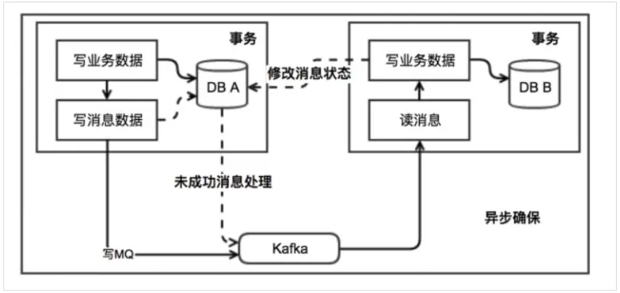

# 一.　2PC/XA(两阶段提交)

## 1.1 准备阶段

协调者询问参与者是否准备成功，参与者回复结果

## 1.2 提交阶段

如果事务在每个参与者身上都执行成功了，协调者会发通知让所有参与者提交事务，否则，协调者让所有参与者回滚事务

注意：（在准备阶段中，参与者执行了事务，但是并没有提交，只有在提交阶段，接受到协调者通知之后，才会进行提交或者回滚）

## 1.3 存在的问题
- 同步堵塞：
    所有参与者在等待其他参与者响应的过程中都处于同步堵塞状态，无法进行其他操作。
- 单点问题：
    协调者在2PC/XA中起到起到非常大的作用，发生故障将会造成很大影响，
    在第二阶段，如果出现问题，会导致所有参与者处于等待状态，无法进行其他操作。
- 数据不一致：
    在第二阶段，如果协调者只发送了部分Commit消息，此时出现了故障，就会导致部分参与者提交事务，
    其他参与者没有提交事务，使得数据不一致。
- 太过保守：
    任意节点失败都会导致整个事务提交失败，没有完善的容错机制。

# 二.　TCC(补偿事务)

采用补偿机制，针对每一个操作，都会注册一个与其对应的确认和补偿操作，它分为3个阶段：

- 1）try阶段主要是对业务系统进行检测和资源预留。
- 2）confirm阶段是对业务系统做确认提交，try阶段执行成功后开始执行confirm，默认confirm不会出错，即try成功，confirm一定成功。
- 3）cancel阶段是在业务执行错误，需要回滚的状态下执行的业务取消，预留资源释放。

**优点：** 跟2PC比起来，实现以及流程相对简单一点，但是数据的一致性也比2PC差一点。

**缺点：** 缺点比较明细，在2，3步都有可能失败，TCC属于应用层的补偿方式，不是很好处理。

# 三.　　本地消息表（异步确保）

本地消息表与业务数据表处于同一个数据库中，这样就能利用本地事务来保证在对这两个表的操作满足事务特性，
并且使用了消息队列保证最终一致性。
- 1）在分布式事务操作的一方完成写业务数据的操作之后向本地消息表发送一个消息，本地事务能保证这个消息一定写入本地消息表中。
- 2）之后讲本地消息表中的消息转发到kafka等消息队列里，如果转发成功则将消息从本地消息表中删除，否则继续重新转发。
- 3）在分布式事务操作的另一方从消息队列中读取到一个消息，并执行消息中的操作。

**优点：** 一种非常经典的实现，避免了分布式事务，实现了最终一致性

**缺点：** 消息表会耦合到业务系统中，如果没有封装好的解决方案，会有很多杂活需要处理

# 四.　3PC

3PC的出现是为了解决2PC的一些问题，
相比于2PC，他在参与者中也引入了超时机制，并且新增一个阶段使得参与者可以利用这个阶段统一各自的状态。

3PC包含3个阶段，准备阶段，预提交阶段，提交阶段。

3PC的准备阶段协调者只会询问参与者的自身情况，
而预提交阶段就是和2PC的准备阶段一样，除了事务的提交其他该做的都做好了，提交阶段就是和2PC一样。

不管哪个阶段有参与者返回失败都会宣布事务失败，和2PC一样

**3PC的阶段影响：**

- 1）准备阶段的变更不会直接影响事务，而是去询问参与者是否有条件接这个事务，
    因此不会锁资源，不会使在某些资源不可用的情况下 所有参与者都堵塞。

- 2）预提交阶段的引入起到了统一状态的作用，但是多引入了一个阶段也就多了一层交互，会导致性能差点，
    而且绝大部分的情况下资源都应该是可用的。

**参与者超时带来的影响：**

- 1）2PC是同步堵塞的，而3PC引入了超时机制，如果等待提交命令的时候超时了，参与者就会提交事务，
  到了这个阶段大概率是提交，如果等待预提交命令超时，那就该干啥干啥。

- 2）超时机制也会带来数据不一致的问题，比如在等待提交命令超时了，参与者默认执行的是提交事务，
  但是有可能执行回滚操作，这样就会导致数据不一致。

引入了参与者超时机制，并且增加了预提交阶段使得故障恢复之后协调者的决策复杂度降低，
但整体的交互过程更长了，性能有所下降，并且还是会存在数据不一致问题。

# 五.　　MQ消息事务

**通过消息实现事务过程：**

（1）先给Broker发送事务消息即半消息(对消费者来说不可见，然后发送成功后发送方再执行本地事务)。

（2）再根据本地事务的结果向Broker发送Commit或者RollBack命令。

（3）并且RocketMQ的发送方会提供一个反查事务状态接口，如果一段时间内办消息没有收到任何操作请求，
那么Broker会通过反查接口得知发送方事务是否执行成功，然后执行Commit或者RollBack命令。

（4）如果是Commit那么订阅方就能收到这个消息，然后在做对应的操作，做完之后再消费这条消息。

（5）如果是RollBack那么订阅方收不到这条消息，等于事务没执行过。

# 六.　　最大努力通知

最大努力通知其实表明了一种柔性事务的思想

# 总结：

可以看出 2PC 和 3PC 是一种强一致性事务，不过还是有数据不一致，阻塞等风险，而且只能用在数据库层面。

而 TCC 是一种补偿性事务思想，适用的范围更广，在业务层面实现，因此对业务的侵入性较大，每一个操作都需要实现对应的三个方法。

本地消息、事务消息和最大努力通知其实都是最终一致性事务，因此适用于一些对时间不敏感的业务。