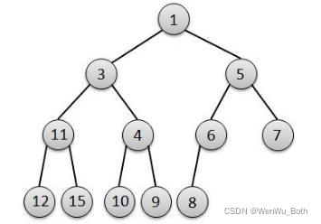
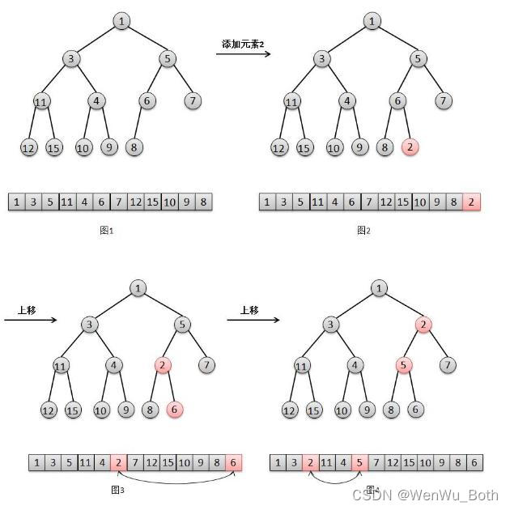
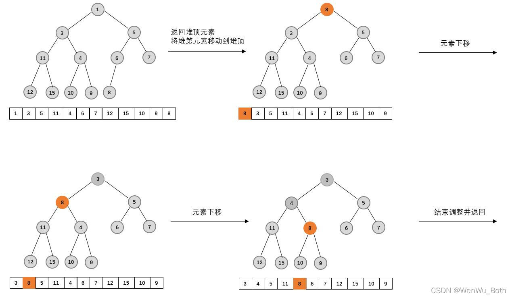
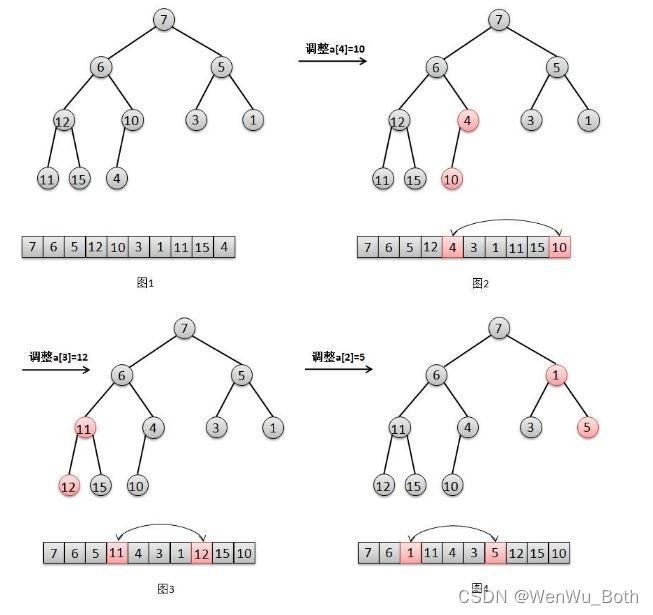

## PriorityQueue简介
PriorityQueue为优先队列，其与普通的FIFO(先进先出)队列不同的地方是，优先队列每次出队的均是队列中优先级最高的元素。

PriorityQueue使用最小(大)二叉堆来管理队列中的元素，元素的大小比较方法由用户指定的**Comparator**指定，每次出队元素为堆顶元素。

## 二叉堆介绍

### 最小二叉堆
最小二叉堆满足如下约束:
- 完全二叉树；
- 所有非叶子节点的根节点value均小于其左、右子节点的value；

如下图即为典型的最小二叉堆:



### 入队
最小二叉堆的元素添加过程如下:
- 将待添加元素添加到二叉树的最后一个位置；
- 若元素value比父节点的value小，则交换该元素和父节点的位置，即元素上移；
- 若上移后，其value仍然比父节点的value小，再次交换该元素和父节点的位置，继续上移；
- 不断上移，直到元素value不比父节点的value小，结束添加流程。



### 出队
最小二叉堆的元素删除过程如下：
- 将堆顶元素删除(返回)，并将堆底最后一个元素移动到堆顶；
- 此时二叉堆不能就不满足最小二叉堆的性质了，需要元素调整，即将堆顶元素不断下移；
- 比较元素value和左、右子节点的value大小，若左子节点value最小，则将该元素与左子节点交换；
  若右子节点value最小，则将该元素与右子节点交换；否则结束下移，调整完成并返回。
- 不断执行上一步骤，直至无法继续下移，调整完成并返回。



### 构造堆
假设有1个无序数组，要求 我们将其构造成最小二叉堆。

最简单的做法是，遍历无序数组，然后逐个元素执行入队过程，该种方法每次入队均需要伴随着元素的移动，不够高效。

另外一种做法是:
- 首先将无序数组构造成二叉堆；
- 从最后一个非叶子节点由下往上逐步执行元素下移，使各个非叶子节点value均小于其左、右子节点的value；
- 遍历直至root节点，结束遍历返回最小二叉堆。



最大二叉堆与最小二叉堆类似的过程，只是上移、下移操作由"比小"操作变成了"比大"操作。

## 源码分析
其实理解了最小二叉堆的构造、添加和删除过程，PriorityQueue源码就变得很简单了。

PriorityQueue基于数组来实现，其成员变量如下:
```text
// 初始容量
private static final int DEFAULT_INITIAL_CAPACITY = 11;
// 元素数组
transient Object[] queue; // non-private to simplify nested class access
// 优先队列的元素个数
int size;
// 比较器
private final Comparator<? super E> comparator;
// 优先队列被调整的次数
transient int modCount;     // non-private to simplify nested class access
```

### 入队
入队方法有add、offer，而add又是直接调用的offer。
```text
public boolean offer(E e) {
    // 若添加的元素为null，则直接抛出空指针异常
    if (e == null)
        throw new NullPointerException();
    // 操作数+1
    modCount++;
    int i = size;
    // 如果元素个数已大于或等于数组的长度，则执行扩容操作
    if (i >= queue.length)
        grow(i + 1);
    // 将待添加元素添加到数组最后，并执行元素上移过程
    siftUp(i, e);
    // 元素添加完成后，元素个数+1
    size = i + 1;
    // 返回true，代表添加元素成功
    return true;
}
```
先看一下扩容函数:
```text
private void grow(int minCapacity) {
    // 获取现有容量
    int oldCapacity = queue.length;
    // Double size if small; else grow by 50%
    // 若现有容量<64，则新容量变为现有容量的2倍+2
    // 若现有容量>64，则新容量变为现有容量的1.5倍
    int newCapacity = oldCapacity + ((oldCapacity < 64) ? (oldCapacity + 2) : (oldCapacity >> 1));
    // overflow-conscious code
    // 若新容量大于Integer.MAX_VALUE - 8，执行hugeCapacity方法
    if (newCapacity - MAX_ARRAY_SIZE > 0)
        newCapacity = hugeCapacity(minCapacity);
    // 将老数组元素拷贝到新数组中
    queue = Arrays.copyOf(queue, newCapacity);
}

private static int hugeCapacity(int minCapacity) {
    if (minCapacity < 0) // overflow
        throw new OutOfMemoryError();
    return (minCapacity > MAX_ARRAY_SIZE) ? Integer.MAX_VALUE : MAX_ARRAY_SIZE;
}
```

元素上移过程如下:
```text
private void siftUp(int k, E x) {
    // 判断是否有传入的comparator
    // 若有则执行siftUpUsingComparator，否则执行siftUpComparable
    if (comparator != null)
        siftUpUsingComparator(k, x, queue, comparator);
    else
        siftUpComparable(k, x, queue);
}

private static <T> void siftUpComparable(int k, T x, Object[] es) {
    Comparable<? super T> key = (Comparable<? super T>) x;
    while (k > 0) {
        // 获取父节点的index=(k-1)/2
        int parent = (k - 1) >>> 1;
        // 拿到父节点的value
        Object e = es[parent];
        // 若当前节点value>=父节点，停止上移，直接break返回
        if (key.compareTo((T) e) >= 0)
            break;
        // 若当前节点value>=父节点，与父节点替换，元素上移
        es[k] = e;
        k = parent;
    }
    es[k] = key;
}

// 过程基本与siftUpComparable相同，区别就是在元素上移的过程中，siftUpUsingComparator方法使用传入的Comparator来进行大小比较
private static <T> void siftUpUsingComparator(
    int k, T x, Object[] es, Comparator<? super T> cmp) {
    while (k > 0) {
        int parent = (k - 1) >>> 1;
        Object e = es[parent];
        if (cmp.compare(x, (T) e) >= 0)
        break;
        es[k] = e;
        k = parent;
    }
    es[k] = x;
}
```

可以发现，PriorityQueue构造时若不传入自定义的Comparator，元素上移过程中进行Value比较的时候，默认使用的元素的compareTo方法。

故PriorityQueue默认是**最小优先队列**，若需要最大优先队列，则需要传入相应的Comparator。

### 出队
出队方法有peek和poll。

peek方法返回优先队列的首元素，但不删除首元素；

poll方法不仅返回优先队列的首元素，同时删除首元素。

首先看peek方法:
```text
public E peek() {
    return (E) queue[0];
}
```

由于不涉及首元素的删除操作，所以直接返回首元素即可。

接着看一下poll方法:
```text
public E poll() {
    final Object[] es;
    final E result;
    // 若数组的首元素不为null
    if ((result = (E) ((es = queue)[0])) != null) {
        // 操作数+1
        modCount++;
        final int n;
        // 获取数组的末尾元素，并将数组大小-1
        final E x = (E) es[(n = --size)];
        // 将数组末尾置为null
        es[n] = null;
        if (n > 0) {
            final Comparator<? super E> cmp;
            // 若无传入的Comparator，则执行siftDownComparable
            // 若有传入的Comparator，则执行siftDownUsingComparator
            if ((cmp = comparator) == null)
                // 传参为0，说明从首元素开始下移
                siftDownComparable(0, x, es, n);
            else
                siftDownUsingComparator(0, x, es, n, cmp);
        }
    }
    return result;
}

private static <T> void siftDownComparable(int k, T x, Object[] es, int n) {
    // assert n > 0;
    Comparable<? super T> key = (Comparable<? super T>)x;
    int half = n >>> 1;           // loop while a non-leaf
    // 从上到下，从左到右不断循环遍历非叶子节点
    while (k < half) {
        // 获取左子节点的index
        int child = (k << 1) + 1; // assume left child is least
        // 获取左子节点的value
        Object c = es[child];
        // 获取右子节点的index
        int right = child + 1;
        // 若右子节点存在，且右子节点的值小于左子节点，则将左右子节点的最小值更新为右子节点的值
        if (right < n && ((Comparable<? super T>) c).compareTo((T) es[right]) > 0)
            c = es[child = right];
        // 若该元素小于左、右子节点中的偏小者，停止下移，直接break
        if (key.compareTo((T) c) <= 0)
            break;
        // 否则，将该节点与左、右子节点中的偏小者调换，继续执行下移过程
        es[k] = c;
        k = child;
    }
    es[k] = key;
}

// 与siftDownComparable方法类似，只是元素下移的过程中使用了传入的Comparator来进行元素大小比较
private static <T> void siftDownUsingComparator(int k, T x, Object[] es, int n, Comparator<? super T> cmp) {
    // assert n > 0;
    int half = n >>> 1;
    while (k < half) {
        int child = (k << 1) + 1;
        Object c = es[child];
        int right = child + 1;
        if (right < n && cmp.compare((T) c, (T) es[right]) > 0)
        c = es[child = right];
        if (cmp.compare(x, (T) c) <= 0)
            break;
        es[k] = c;
        k = child;
    }
    es[k] = x;
}
```

### 基于集合构造优先队列
PriorityQueue提供了initFromCollection方法将传入的集合构造成优先队列：
```text
private void initFromCollection(Collection<? extends E> c) {
    // 拷贝元素创建初始堆
    initElementsFromCollection(c);
    // 将初始堆调整为最小(大)二叉堆
    heapify();
}
```

接着看一下heapify()方法:
```text
private void heapify() {
    final Object[] es = queue;
    // 获取最后1个非叶子节点的index=(n/2)-1
    int n = size, i = (n >>> 1) - 1;
    final Comparator<? super E> cmp;
    // 由最后1个非叶子节点开始往上遍历，逐渐执行节点的下移过程
    if ((cmp = comparator) == null)
        for (; i >= 0; i--)
            siftDownComparable(i, (E) es[i], es, n);
    else
        for (; i >= 0; i--)
            siftDownUsingComparator(i, (E) es[i], es, n, cmp);
    }
}
```

需要注意的是: PriorityQueue不是线程安全的，在多线程环境下，需要自己基于锁机制来实现线程安全。
