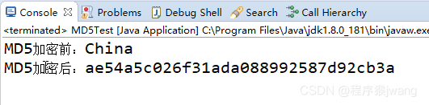
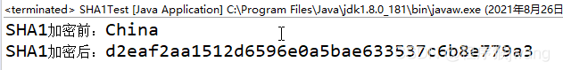
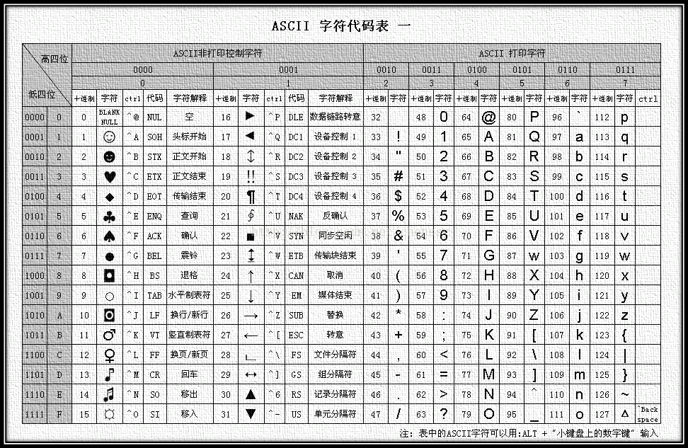
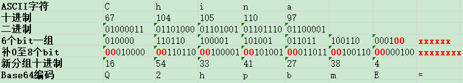
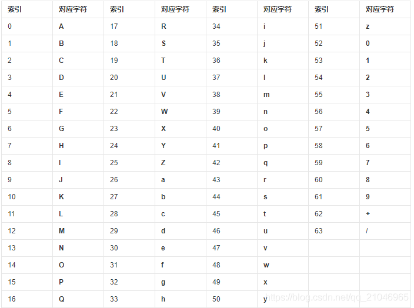
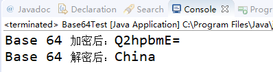
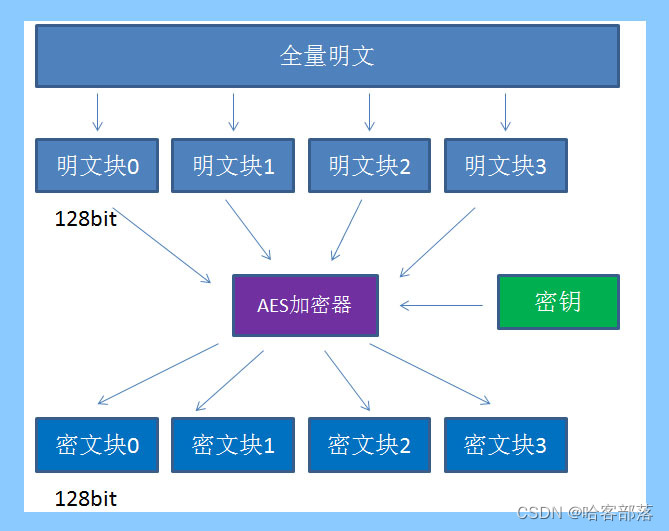
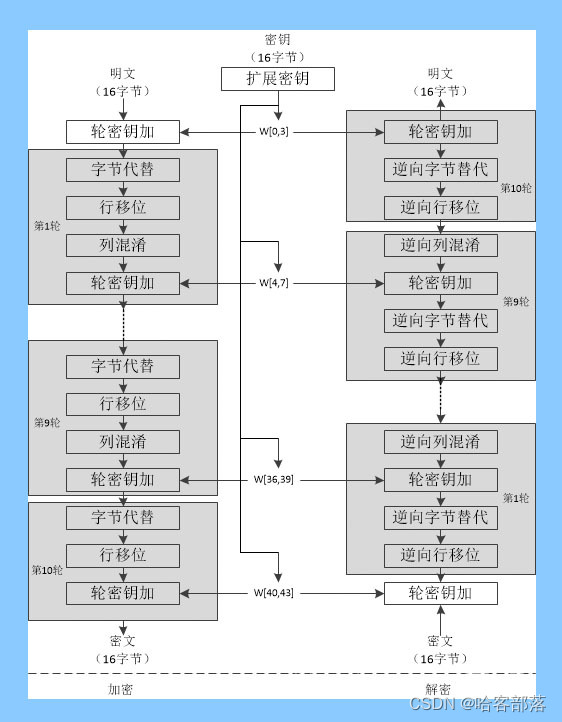

# java加密算法

> 在密码学中，加密算法分为双向加密和单向加密。
> 单向加密包括MD5、SHA等摘要算法，它们是不可逆的。
> 双向加密包括对称加密和非对称加密，对称加密包括AES加密、DES加密等。双向加密是可逆的，存在密文的密钥。AES算法是DES算法的替代者，也是现在最流行的加密算法之一。
> 

---

## 一、MD5

### 1、概念

> MD5信息摘要算法（英语：MD5 Message-Digest Algorithm），一种被广泛使用的密码散列函数，可以产生出一个128位（16个字节）的散列值（hash value），用于确保信息传输完整一致。
> MD5由美国密码学家罗纳德·李维斯特（Ronald Linn Rivest）设计，于1992年公开，用以取代MD4算法。
> 这套算法的程序在 RFC 1321 标准中被加以规范。1996年后该算法被证实存在弱点，可以被加以破解，对于需要高度安全性的数据，专家一般建议改用其他算法，如SHA-2。
> 2004年，证实MD5算法无法防止碰撞（collision），因此不适用于安全性认证，如SSL公开密钥认证或是数字签名等用途。
>
> MD5属于典型的单向加密算法（单向加密又称为不可逆加密算法，在加密过程中不使用密钥，明文由系统加密处理成密文，密文无法解密。
> 一般适合于验证，在验证过程中，重新输入明文，并经过同样的加密算法处理，得到相同的密文并被系统重新认证。广泛使用于口令加密）。
> 

### 2、MD5加密原理

> 我们仍然以单词 China 为例，如何将其进行MD5加密呢？
>
> 第一步：首先将China单词转化为ASCII码的十六进制表示方式
> 
>       China的十六进制为：43 68 69 6E 61
> 
> 第二步：对得到的数据  4368696E61 进行填充和附加，使其能够被512整除。
> 
>       填充，指的是对原始信息进行填充，填充的首位是1，其余位全部为0，填充后的数据需要满足（n*512 - 64）位，我们本次试验的数据很明显是小于该位数的，即满足 512-64 = 448位即可。
>       附加，指的是附加原始信息的长度，也就是还需要在后面补充64位，如果长度大于64位，则只取低64位。
>       通过填充和附加，使得数据变为512位。
>       以China为例，数据为：4368696E61，该数据长度为40位，因为 40 < 448，所以需要进行填充，共需填充 448 - 40 = 408位，使用十六进制表示为80000.....0000（408位）。然后进行附加，由于我们的数据长度为40位，十六进制为28，但是需要凑成64位，所以附加  2800000000000000。
>       最终经过填充和附加得到的数据为：4368696E61 80000.....0000（408位）2800000000000000。
> 
> 第三步：将得到数据进行拆分，按照512位分块，每个512位分成4个128位数据块，最后将4个128位的数据块依次送到不同的散列函数进行4轮运算，每一轮又按照32位的小数据块进行复杂运算，最后将得到一个128位的哈希值，也就是最终的结果。
>

### 3、注意事项

> MD5算法很有用，因为与存储可变长度的大文本相比，比较和存储这些较小的哈希值更容易。
> MD5算法是一种广泛使用的用于单向哈希的算法，该哈希用于验证而不必给出原始值。
> Unix系统使用 MD5算法以128位加密格式存储用户密码。
> MD5算法被广泛用于检查文件的完整性。而且，使用该算法很容易生成原始消息的信息摘要。MD5算法可以执行任意位数的消息的信息摘要，不限于MD的和，MD5sum仅限八位字节。但是多年来，MD5容易出现哈希冲突弱点，即可以为两个不同的输入创建相同的哈希函数。MD5对这些冲突攻击没有提供任何安全性。
> SHA（Secure Hash Algorithm，可产生160位信息摘要，并由NSA设计为数字签名算法的一部分）现已取代MD5，因为它不易产生SHA，现在已在密码学领域被接受以用于生成哈希函数-我发生碰撞，直到现在还没有发生碰撞。而且，MD5算法比优化的SHA算法要慢得多。SHA比MD5算法安全得多，而且，与MD5不同，它可以用超出速率的现有技术来实现。如今，考虑到更高的数据安全性（例如SHA256（可生成文本的256位签名）），新的哈希算法正在市场上出现。
>
> 此外，如果必须要使用MD5算法的话，可以在原有MD5的基础上 “加盐”，以确保使用MD5算法加密的数据安全性得到一定提升。

### 4、Java实现MD5加密
```
package cn.edu.ccut;
 
import java.math.BigInteger;
import java.security.MessageDigest;
import java.security.NoSuchAlgorithmException;
 
public class MD5Test {
 
	public static void main(String[] args) throws Exception {
        String str = "China";
        md5(str);
    }
    
    public static void md5(String str) {
    	byte[] secretBytes = null;
        try {
            secretBytes = MessageDigest.getInstance("md5").digest(str.getBytes());
        } catch (NoSuchAlgorithmException e) {
            throw new RuntimeException("没有这个md5算法！");
        }
        String md5code = new BigInteger(1, secretBytes).toString(16);
        for (int i = 0; i < 32 - md5code.length(); i++) {
            md5code = "0" + md5code;
        }
        System.out.println("MD5加密后："+md5code);
    }
}
```
> 执行结果如下:
> 
> 
---

## 二、SHA(SHA1、SHA256)

### 1、概念

> 安全散列算法（英语：Secure Hash Algorithm，缩写为SHA）是一个密码散列函数家族，是FIPS所认证的安全散列算法。
> SHA 能计算出一个数字消息所对应到的，长度固定的字符串（又称消息摘要）的算法。且若输入的消息不同，它们对应到不同字符串的机率很高。
> 
> SHA1（英语：Secure Hash Algorithm 1，中文名：安全散列算法1）是一种密码散列函数，美国国家安全局设计，并由美国国家标准技术研究所（NIST）发布为联邦数据处理标准（FIPS）。
> SHA-1可以生成一个被称为消息摘要的160位（20个字节）散列值，散列值通常呈现形式为40个十六进制数。
>
> SHA256是SHA2的一种，可产生256位的哈希值，较SHA1更加的安全。
>

### 2、SHA1加密原理

> 我们仍然以单词 China 为例，如何将其进行MD5加密呢？
> 
>         第一步：首先将China单词转化为ASCII码的十六进制表示方式
>           China的十六进制为：43 68 69 6E 61
>         第二步：对得到的数据  4368696E61 进行填充和附加，使其能够被512整除。
>           对于任意长度的明文，SHA1的明文分组过程与MD5相类似，首先需要对明文添加位数，使明文总长度为448（mod512）位。
>           在明文后添加位的方法是第一个添加位是l，其余都是0。然后将真正明文的长度（没有添加位以前的明文长度）以64位表示，附加于前面已添加过位的明文后，此时的明文长度正好是512位的倍数。与MD5不同的是SHA1的原始报文长度不能超过2的64次方，另外SHA1的明文长度从低位开始填充。
>         第三步：将得到数据进行拆分，按照512位分块。SHA1有4轮运算，每一轮包括20个步骤（一共80步），最后产生160位摘要。
>
### 3、注意事项
>  与MD5相比，SHA1有以下优缺点：
> 
>        最显著和最重要的区别是SHA1摘要比MD5摘要长32 位。使用强行技术，产生任何一个报文使其摘要等于给定报摘要的难度对MD5是2^128数量级的操作，而对SHA1则是2^160数量级的操作。这样，SHA1对强行攻击有更大的强度。相对的在相同的硬件上，SHA1的运行速度比MD5慢。
>        但是就目前的情况来看，SHA1也很容易被攻破，为了安全起见，可以选择诸如SHA256，SHA512等高强度的算法来提升安全性。
> 

### 4、Java实现SHA1加密

> 实例代码:
> 

```
package cn.edu.ccut;

import java.security.MessageDigest;

public class SHA1Test {
 
    public static void main(String args[]) throws Exception {
        String str = "China";
        System.out.println("SHA1加密前：" + str);
        System.out.println("SHA1加密后：" + shaEncode(str));
    }
    
    public static String shaEncode(String inStr) throws Exception {
        MessageDigest sha = null;
        try {
            sha = MessageDigest.getInstance("SHA");
        } catch (Exception e) {
            System.out.println(e.toString());
            e.printStackTrace();
            return "";
        }
        byte[] byteArray = inStr.getBytes("UTF-8");
        byte[] md5Bytes = sha.digest(byteArray);
        StringBuffer hexValue = new StringBuffer();
        for (int i = 0; i < md5Bytes.length; i++) {
            int val = ((int) md5Bytes[i]) & 0xff;
            if (val < 16) {
                hexValue.append("0");
            }
            hexValue.append(Integer.toHexString(val));
        }
        return hexValue.toString();
    }
}
```

> 运行结果:
> 
> 
---

## 三、Base64

###  1、概念
> Base64是网络上最常见的用于传输8Bit字节码的编码方式之一，Base64就是一种基于64个可打印字符来表示二进制数据的方法。可查看RFC2045～RFC2049，上面有MIME的详细规范。
> 
> Base64编码是从二进制到字符的过程，可用于在HTTP环境下传递较长的标识信息。采用Base64编码具有不可读性，需要解码后才能阅读。
>        
> Base64由于以上优点被广泛应用于计算机的各个领域，然而由于输出内容中包括两个以上“符号类”字符（+, /, =)，不同的应用场景又分别研制了Base64的各种“变种”。为统一和规范化Base64的输出，Base62x被视为无符号化的改进版本。
>
> 从以上的概念中我们不难看出，Base64实际上是一种编码方式，而不是严格意义上的加密算法，但可以作为学习加密算法起到一定的铺垫作用
>

### 2、Base64编码原理

> 在了解Base64之前，需要了解ASCII码的相关内容（在计算机中，所有的数据在存储和运算时都要使用二进制数表示，简单来说ASCII码就是现实世界语言文字与计算机语言交流的规范，现实世界的语言都可以使用ASCII码进行标识）。
>
> 如：China这个单词，参照ASCII代码表其ASCII码十进制表示为：67 104 105 110 97
>
> 那么如何将China这个单词使用Base64编码呢？
>
> 第一步：首先将China单词转化为ASCII码的二进制表示方式
>
> 第二步：每6个bit为一组进行分组，需要注意的是 将以前8bit一组的数据拆分成6bit一组的数据，很可能会发生位数不足的情况，位数不足我们需要在后面补0，同时确保均匀分组（分组后位数为6和8的公倍数），没有对应上数据的分组用 “=”表示。
>
> 第三步：将新的分组前面补充00至8bit，参照Base64编码表得出Base64编码串
>
> 以China为例，详细步骤如下：
> 由于China只有5*8=40bit，以6bit分组时务必确保是6和8的公倍数，所以以6bit分组后数据达到了48bit（含补位和未对应分组）
>
> China的最终Base64编码为：Q2hpbmE=
>
> 以下是Base64编码对照表：
> 
> 

### 3、注意事项

> * 通过上面的描述，我们知道Base64算不上是一种加密算法，其实也就是一种编码的方式，不能用于诸如密码等重要数据的加密，将直接破解
> * 中文有多种编码（比如：utf-8、gb2312、gbk等），不同编码对应Base64编码结果都不一样
> * 由于其优势，广泛的应用于网络传输，如图片数据等
> 

### 4、Java实现Base64编码
```
package cn.edu.ccut;
 
import java.util.Base64;
 
public class Base64Test {
 
	public static void main(String[] args) throws Exception {
        String str = "China";
        base64(str);
    }
 
    public static void base64(String str) {
        byte[] bytes = str.getBytes();
        //Base64 加密
        String encoded = Base64.getEncoder().encodeToString(bytes);
        System.out.println("Base 64 加密后：" + encoded);
        //Base64 解密
        byte[] decoded = Base64.getDecoder().decode(encoded);
        String decodeStr = new String(decoded);
        System.out.println("Base 64 解密后：" + decodeStr);
        System.out.println();
    }
}
```
> 运行结果如下：
> 
> 

---

## 四、AES

### 1、概念

> AES是高级加密标准，在密码学中又称Rijndael加密法，是美国联邦政府采用的一种区块加密标准。这个标准用来替代原先的DES，目前已经被全世界广泛使用，同时AES已经成为对称密钥加密中最流行的算法之一。AES支持三种长度的密钥：128位，192位，256位。
> 

### 2、AES加密算法原理

> 1. 密钥
> 
>   密钥是AES算法实现加密和解密的根本。对称加密算法之所以对称，是因为这类算法对明文的加密和解密需要使用同一个密钥。
>
>   AES支持三种长度的密钥：128位，192位，256位。
>
>   平时大家所说的AES128，AES192，AES256，实际上就是指的AES算法对不同长度密钥的使用。

> 2. 填充
>
>   要想了解填充的概念，我们先要了解AES的分组加密特性。什么是分组加密呢？
> 
>   我们来看看下面这张图：AES算法在对明文加密的时候，并不是把整个明文一股脑加密成一整段密文，而是把明文拆分成一个个独立的明文块，每一个明文块长度128bit。
>
>   这些明文块经过AES加密器的复杂处理，生成一个个独立的密文块，这些密文块拼接在一起，就是最终的AES加密结果。
>
>   假如一段明文长度是192bit，如果按每128bit一个明文块来拆分的话，第二个明文块只有64bit，不足128bit。这时候怎么办呢？就需要对明文块进行填充（Padding）。
>
>   填充涉及以下三种填充模式：
>     
>    * NoPadding：不做任何填充，但是要求明文必须是16字节的整数倍。
>    
>    * PKCS5Padding（默认）：如果明文块少于16个字节（128bit），在明文块末尾补足相应数量的字符，且每个字节的值等于缺少的字符数。
>
>    * > 比如明文：{1,2,3,4,5,a,b,c,d,e},缺少6个字节，则补全为{1,2,3,4,5,a,b,c,d,e,6,6,6,6,6,6}
>
>    * ISO10126Padding：如果明文块少于16个字节（128bit），在明文块末尾补足相应数量的字节，最后一个字符值等于缺少的字符数，其他字符填充随机数。
>
>    * > 比如明文：{1,2,3,4,5,a,b,c,d,e},缺少6个字节，则可能补全为{1,2,3,4,5,a,b,c,d,e,5,c,3,G,$,6}
> 

### 3、AES算法流程

> AES加密算法涉及4种操作：字节替代（SubBytes）、行移位（ShiftRows）、列混淆（MixColumns）和轮密钥加（AddRoundKey）。下图给出了AES加解密的流程，从图中可以看出：
>
> 1、解密算法的每一步分别对应加密算法的逆操作；
>
> 2、加解密所有操作的顺序正好是相反的。
> 正是由于这几点（再加上加密算法与解密算法每步的操作互逆）保证了算法的正确性。
> 加解密中每轮的密钥分别由种子密钥经过密钥扩展算法得到。
> 算法中16个字节的明文、密文和轮子密钥都以一个4x4的矩阵表示。

> 
> * AddRoundKey （轮密钥加）— 矩阵中的每一个字节都与该次轮密钥（round key）做XOR运算；每个子密钥由密钥生成方案产生。
> * SubBytes（字节替代） — 通过非线性的替换函数，用查找表的方式把每个字节替换成对应的字节。
> * ShiftRows（行移位） — 将矩阵中的每个横列进行循环式移位。
> * MixColumns （列混淆）— 为了充分混合矩阵中各个直行的操作。这个步骤使用线性转换来混合每列的四个字节。

> 以上为AES在加密中的大致流程。
> 
> 总而言之，AES是用来替代DES的新一代加密标准，具有128bit的分组长度，支持128、192和256比特的密钥长度，它是目前最流行的加密算法之一。
> 

### 4、AES代码实现

```
public class Aes {
 
    public static final String ALGORITHM = "AES";
 
    public static Charset charset = Charset.forName("UTF-8");
     
    public static void main(String[] args) {
        String content = "青年人需要认识到自己所负的责任！";
        SecretKey secretKey;
        try {
            long timeStartEncry = System.currentTimeMillis();
            // 生成密钥
            secretKey = generateKey();
            // 加密
            byte[] encryptResult = encrypt(content, secretKey);
            long timeEndEncry = System.currentTimeMillis();
            System.out.println("加密后的结果为==" + new String(encryptResult, charset));
            // 解密
            String decryptResult = decrypt(encryptResult, secretKey);
            System.out.println("解密后的结果==" + decryptResult);
            System.out.println("加密用时：" + (timeEndEncry - timeStartEncry));
        } catch (NoSuchAlgorithmException | InvalidKeyException | NoSuchPaddingException | IllegalBlockSizeException | BadPaddingException e) {
            e.printStackTrace();
        }
    }
    
    /**
     * 生成密钥
     *
     * @return
     * @throws NoSuchAlgorithmException
     */
    public static SecretKey generateKey() throws NoSuchAlgorithmException {
        KeyGenerator secretGenerator = KeyGenerator.getInstance(ALGORITHM);
        SecureRandom secureRandom = new SecureRandom();
        secretGenerator.init(secureRandom);
        SecretKey secretKey = secretGenerator.generateKey();
        return secretKey;
    }
 
    /**
     * 加密
     *
     * @param content
     * @param secretKey
     * @return
     */
    public static byte[] encrypt(String content, SecretKey secretKey) throws InvalidKeyException, NoSuchAlgorithmException, NoSuchPaddingException, IllegalBlockSizeException, BadPaddingException { // 加密
        return aes(content.getBytes(charset), Cipher.ENCRYPT_MODE, secretKey);
    }
 
    /**
     * 解密
     *
     * @param contentArray
     * @param secretKey
     * @return
     */
    public static String decrypt(byte[] contentArray, SecretKey secretKey) throws InvalidKeyException, NoSuchAlgorithmException, NoSuchPaddingException, IllegalBlockSizeException, BadPaddingException { // 解密
        byte[] result = aes(contentArray, Cipher.DECRYPT_MODE, secretKey);
        return new String(result, charset);
    }
 
    private static byte[] aes(byte[] contentArray, int mode, SecretKey secretKey)
            throws NoSuchAlgorithmException, NoSuchPaddingException, InvalidKeyException, IllegalBlockSizeException, BadPaddingException {
        Cipher cipher = Cipher.getInstance(ALGORITHM);
        cipher.init(mode, secretKey);
        byte[] result = cipher.doFinal(contentArray);
        return result;
    }
}
```
> 