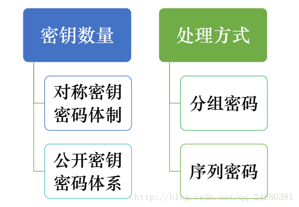
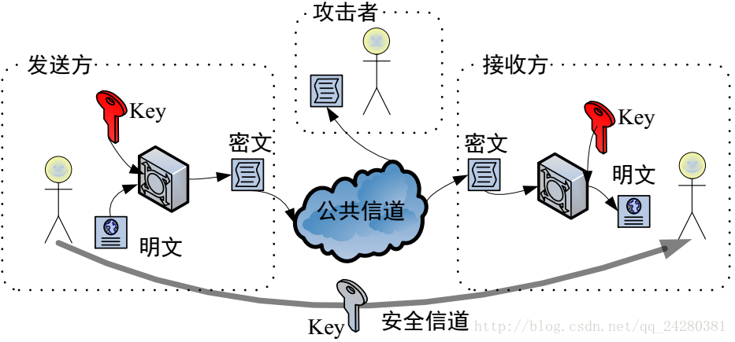
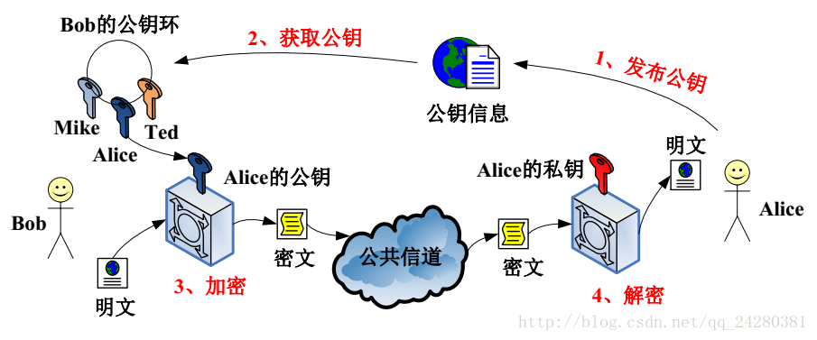
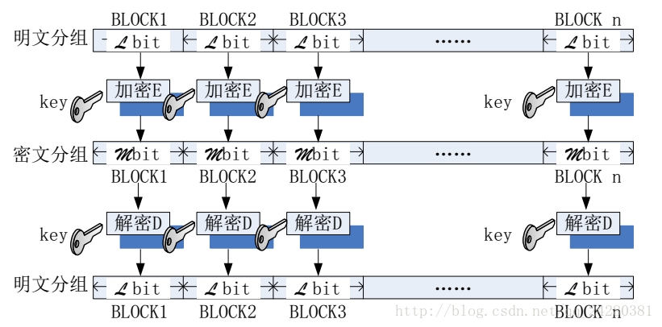
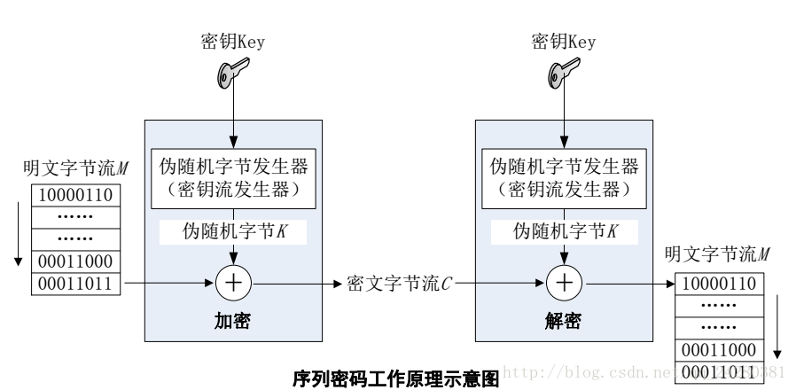

关于加解密这一部分，准备分四章来写。
第一章主要从整体上了解下加解密算法，第二、三、四章分别介绍下java中的对称加密算法，非对称加密算法和Hash算法。
OK，下面开始正文。

---

# 一、密码学概述
首先我们在看这些加密算法之前先来简单了解下密码学。

## 1、密码学的发展历程
密码学的发展历程从古至今一共经过了4个阶段：古代加密方法、古典密码、近代密码、现代密码。

### 1）古代加密方法：
源于 公元前440年的 古希腊，目的是将秘密嵌入于公开的内容，如：隐形墨水、图画、文章、特殊物品等。
其主要依赖于技巧与加密方法的保密来实现信息加密。

### 2）古典密码：
出现在公元前54年，加密方法大多是按照字母表向后移动n位等来实现。
虽然这种方法已经脱离了实物，向算法发展，但是其还是部分依赖于算法本身的保密来实现信息的加密。

### 3）近代密码（1860s）：
此时数学开始主导密码学，同时已经认识到真正保证信息加密安全的不是加密算法本身，而是秘钥。
即使加密算法本身外泄，有秘钥的存在，密码也不会失效。

### 4）现代密码（1950s）：
现代密码基于计算机科学的发展，同时极度依赖于数学的发展。
此时不再依赖技巧，以数学理论作为基础，安全性完全依赖于严密的数学证明，允许引入大量复杂运算，高效准确，同时破解难度极高。

## 2、密码学基本概念

### 1）什么是密码学：
以数学、信息科学、计算机科学为基础用于解决数据的机密性、完整性、非否性以及身份识别等问题的一门综合学科。

### 2）密码学组成：
密码编码学：将密码变化的客观规律应用于编制密码以实现信息安全。

密码分析学：研究密码变化规律中固有的缺陷，并应用于破译密码，以获取保密信息。

### 3）密码学体制：
由明文、密文、加密算法、解密算法以及秘钥五部分组成。

### 4）密码体制分类：


对称秘钥密码体制模型：


非对称（公开）秘钥密码体制模型：


分组密码模型：


序列密码模型：


OK，关于密码学的基本内容就说到这里。接下来来看看密码学中最核心的加密技术。

加密技术是对信息进行编码和解码的技术，编码是把原来可读信息（明文）转换成代码形式（密文），同时解码便是将密文转化成明文。

加密技术的核心便是加密算法，而加密算法一般情况下可以分为【对称加密】、【非对称加密】和【Hash】三类算法。

# 二、对称加密算法
对称加密算法就是数据发信方将明文（原始数据）和加密密钥（key）一起经过特殊加密算法处理后，使其变成复杂的加密密文发送出去。
收信方收到密文后，若想解读原文，则需要使用加密时的密钥及相同算法的逆算法对密文进行解密，才能使其恢复成可读明文。
在对称加密算法中，使用的密钥只有一个，发收信双方都使用这个密钥对数据进行加密和解密，这就要求解密方事先必须知道加密密钥。

对称加密算法的特点是算法公开、计算量小、加密速度快、加密效率高。
不足之处是，交易双方都使用同样钥匙，安全性得不到保证。
此外，每对用户每次使用对称加密算法时，都需要使用其他人不知道的惟一匙这会使得发收信双方所拥有的钥匙数量成几何级数增长，
密钥管理成为用户的负担。

对称加密算法在分布式网络系统上使用较为困难，主要是因为密钥管理困难，使用成本较高。

**常见的对称加密算法主要有：DES、3DES和AES算法**。

## DES（Data Encryption Standard）：
数据加密标准，速度较快，适用于加密大量数据的场合。

对称密码算法的加密与解密关系如下：
```text
EK(P)= C
DK(C)= P
```
其中E为加密算法，D为解密算法，P为明文，C为密文，K为秘钥

DES加密算法是典型的对称加密算法，加密和解密都是用同一个秘钥。
同时它也是一种分组密码，以64位为分组对数据加密，它的密钥长度是56位，加密解密用同一算法。
DES加密算法是对密钥进行保密，而公开算法，包括加密和解密算法。
这样，只有掌握了和发送方相同密钥的人才能解读由DES加密算法加密的密文数据。
因此，破译DES加密算法实际上就是搜索密钥的编码。

对于56位长度的密钥来说，如果用穷举法来进行搜索的话，其运算次数为256。
随着计算机系统能力的不断发展，DES的安全性比它刚出现时会弱得多，然而从非关键性质的实际出发，仍可以认为它是足够的。
不过，DES现在仅用于旧系统的鉴定，而更多地选择新的加密标准。

## 3DES：
三重DES，DES的增强版本。

3DES还是利用DES密码算法，但是利用三次，加密过程为“加密-解密-加密”，解密过程为“解密-加密-解密”。
用公式可以表示为：
```text
EK1(DK2(EK3(P))) = C //加密
DK1(EK2(DK3(C))) = P //解密
```
由于三次过程使用的密钥不一样，所以相当于增加了密钥长度。实际应用中，K1和K3是相同的，也就是外层的两次加密和两次解密使用相同的密钥。
这样，三重DES的密钥长度就相当于K1+K2的长度，即112位(DES的密钥长度为56位)。
采用“加密-解密-加密”模式的理由是为了与DES保持兼容，只要设置K1=K2=K3，三重DES就和DES一样了，只是多了两道运算步骤而已。

三重DES只是DES的一个变种，此外还有其它变种，例如DESX、CRYPT(3)、GDES、RDES、snDES等等。

## AES（Advanced Encryption Standard）：
高级加密标准，是下一代的加密算法标准，速度快，安全级别高。

AES加密算法是密码学中的高级加密标准，该加密算法采用对称分组密码体制，
密钥长度的最少支持为128、192、256，分组长度128位，算法应易于各种硬件和软件实现。
这种加密算法是美国联邦政府采用的区块加密标准，这个标准用来替代原先的DES，已经被多方分析且广为全世界所使用。

AES加密算法被设计为支持128／192／256位（/32=nb)数据块大小（即分组长度）；支持128／192／256位（/32=nk)密码长度，
在10进制里，对应34×1038、62×1057、1.1×1077个密钥。

# 三、非对称加密算法
非对称加密算法使用两把完全不同但又是完全匹配的一对钥匙（公钥和私钥）。
在使用非对称加密算法加密文件时，只有使用匹配的一对公钥和私钥，才能完成对明文的加密和解密过程。
加密明文时采用公钥加密，解密密文时使用私钥才能完成，而且发信方（加密者）知道收信方的公钥，
只有收信方（解密者）才是唯一知道自己私钥的人。

## 非对称加密算法的基本原理：
如果发信方想发送只有收信方才能解读的加密信息，发信方必须首先知道收信方的公钥，然后利用收信方的公钥来加密原文；
收信方收到加密密文后，使用自己的私钥才能解密密文。
显然，采用非对称加密算法，收发信双方在通信之前，收信方必须将自己早已随机生成的公钥送给发信方，而自己保留私钥。
由于非对称算法拥有两个密钥，因而特别适用于分布式系统中的数据加密。

**常见的非对称加密算法主要有：RSA和DSA算法**。

### RSA：
由 RSA 公司发明，是一个支持变长密钥的公共密钥算法，需要加密的文件块的长度也是可变的。

RSA加密算法是目前最有影响力的公钥加密算法，并且被普遍认为是目前最优秀的公钥方案之一。
RSA是第一个能同时用于【加密】和【数宇签名】的算法，它能够抵抗到目前为止已知的所有密码攻击，已被ISO推荐为公钥数据加密标准。

RSA加密算法基于一个十分简单的数论事实：
将两个大素数相乘十分容易，但那时想要，但那时想要对其乘积进行因式分解却极其困难，因此可以将乘积公开作为加密密钥。

### DSA（Digital Signature Algorithm）：
数字签名算法，是一种标准的 DSS（数字签名标准）。

DSA是Schnorr和ElGamal签名算法的变种，被美国NIST作为DSS(DigitalSignature Standard)。
简单的说，这是一种更高级的验证方式，用作数字签名。
不单单只有公钥、私钥，还有数字签名。私钥加密生成数字签名，公钥验证数据及签名。
如果数据和签名不匹配则认为验证失败！

【数字签名】的作用就是校验数据在传输过程中不被修改。数字签名，是单向加密的升级！

# 四、Hash算法
Hash算法（又称不可逆加密算法）的特征是加密过程中不需要使用密钥，输入明文后由系统直接经过加密算法处理成密文，
这种加密后的数据是无法被解密的，只有重新输入明文，并再次经过同样不可逆的加密算法处理，得到相同的加密密文并被系统重新识别后，
才能真正解密。显然，在这类加密过程中，加密是自己，解密还得是自己，
而所谓解密，实际上就是重新加一次密，所应用的“密码”也就是输入的明文。

Hash算法不存在密钥保管和分发问题，非常适合在分布式网络系统上使用，但因加密计算复杂，工作量相当繁重，通常只在数据量有限的情形下使用，
如广泛应用在计算机系统中的口令加密，利用的就是Hash加密算法。

**常见的Hash算法主要有：MD5和SHA1**。

## MD5（Message Digest Algorithm 5）：
是RSA数据安全公司开发的一种单向散列算法，非可逆，相同的明文产生相同的密文。

MD5为计算机安全领域广泛使用的一种【散列函数】，用以提供消息的完整性保护。

对MD5加密算法简要的叙述可以为：
MD5以512位分组来处理输入的信息，且每一分组又被划分为16个32位子分组，经过了一系列的处理后，
算法的输出由四个32位分组组成，将这四个32位分组级联后将生成—个128位散列值。

MD5被广泛用于各种软件的【密码认证】和【钥匙识别】上。
MD5用的是哈希函数，它的典型应用是对一段信息产生信息摘要，以防止被篡改。
MD5的典型应用是对一段Message产生fingerprin指纹，以防止被“篡改”。
如果再有—个第三方的认证机构，用MD5还可以防止文件作者的“抵赖”，这就是所谓的数字签名应用。
MD5还广泛用于操作系统的登陆认证上，如UNIX、各类BSD系统登录密码、数字签名等诸多方。

## SHA1（Secure Hash Algorithm）：
可以对任意长度的数据运算生成一个160位的数值。

SHA1是和MD5一样流行的消息摘要算法。SHA加密算法模仿MD4加密算法。SHA1设计为和数字签名算法（ＤＳＡ）一起使用。

SHA1主要适用于数字签名标准里面定义的【数字签名算法】。对于长度小于264位的消息，SHA1会产生一个160位的消息摘要。
当接收到消息的时候，这个消息摘要可以用来验证数据的完整性。
在传输的过程中，数据很可能会发生变化，那么这时候就会产生不同的消息摘要。
SHA1不可以从消息摘要中复原信息，而两个不同的消息不会产生同样的消息摘要。
这样，SHA1就可以验证数据的完整性，所以说SHA1是为了保证文件完整性的技术。

SHA1加密算法可以采用不超过264位的数据输入，并产生一个160位的摘要。
输入被划分为512位的块，并单独处理。
160位缓冲器用来保存散列函数的中间和最后结果。
缓冲器可以由5个32位寄存器（A、B、C、D和E）来表示。
SHA1是一种比MD5的安全性强的算法，理论上，凡是采取“消息摘要”方式的数字验证算法都是有“碰撞”的
——也就是两个不同的东西算出的消息摘要相同，互通作弊图就是如此。
但是安全性高的算法要找到指定数据的“碰撞”很困难，而利用公式来计算“碰撞”就更困难--目前为止通用安全算法中仅有MD5被破解。

参考：http://blog.csdn.net/achejq/article/details/9135209
