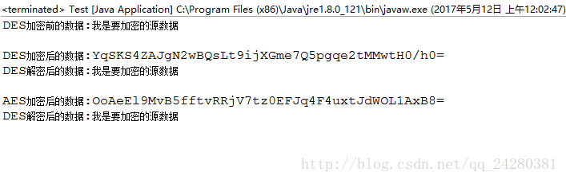

对称加密算法是应用较早的加密算法，技术成熟。

在对称加密算法中，数据发信方将明文（原始数据）和加密密钥一起经过特殊加密算法处理后，使其变成复杂的加密密文发送出去。
收信方收到密文后，若想解读原文，则需要使用加密用过的密钥及相同算法的逆算法对密文进行解密，才能使其恢复成可读明文。
在对称加密算法中，使用的密钥只有一个，发收信双方都使用这个密钥对数据进行加密和解密，这就要求解密方事先必须知道加密密钥。

常用的对称加密算法主要有：DES算法，3DES算法，TDEA算法，Blowfish算法，RC5算法，IDEA算法，AES算法等。

在本篇文章中主要来说说DES加密算法和AES加密算法。

# 一、DES加密算法

## 1、DES加密算法介绍
DES是一种典型的对称加密算法，出自IBM的研究，后来被美国政府正式采用，之后开始广泛流传，但是近些年使用越来越少，
因为DES使用56位密钥，以现代计算能力，24小时内即可被破解。

对于对称加密算法，最重要的便是秘钥（key）的生成。
同样DES加密算法DES 使用一个56位的密钥以及附加的8位奇偶校验位（每组的第8位作为奇偶校验位），产生最大64位的分组大小。
这64位的分组是一个迭代的分组密码，使用称为Feistel的技术，其中将加密的文本块分成两半。
使用子密钥对其中一半应用循环功能，然后将输出与另一半进行“异或”运算；接着交换这两半，这一过程会继续下去，但最后一个循环不交换。
DES 使用16轮循环，使用异或，置换，代换，移位操作四种基本运算。

## 2、加密算法java代码
直接来看代码，定义一个工具类DesUtil用来封装DES的加解密操作，同时将其中的加解密函数定义为static类型，以便于其他方法进行调用。

```java
import java.nio.charset.StandardCharsets;
import java.security.Key;
import java.util.Base64;

import javax.crypto.Cipher;
import javax.crypto.SecretKeyFactory;
import javax.crypto.spec.DESKeySpec;
import javax.crypto.spec.IvParameterSpec;

public class DesUtil {
    // DES是加密方式
    private final static String ALGORITHM = "DES"; 
    // DES是加密方式 CBC是工作模式 PKCS5Padding是填充模式
    private final static String TRANSFORMATION = "DES/CBC/PKCS5Padding";
    // 初始化向量参数，AES 为16bytes. DES 为8bytes.
    private final static String IVPARAMETERSPEC = "12345678"; 

    /**
     * 通过输入的密码生成DES加密的Key的函数
     * @param password 输入的密码
     * @return DES加密所需要的Key对象
     */
    public static Key getKey(String password) {
        if (password != null) {
            try {
                DESKeySpec dks = new DESKeySpec(password.getBytes());
                //创建一个密匙工厂，然后用它把DESKeySpec转换成SecretKey，这个SecretKey就是加密时使用的Key
                SecretKeyFactory keyFactory = SecretKeyFactory.getInstance(ALGORITHM);
                return keyFactory.generateSecret(dks);
            } catch (Exception e) {
                e.printStackTrace();
            }
        }
        return null;
    }
    
    /**
     * DES加密函数
     * @param password （String对象）输入的密码，用于生成DES的秘钥
     * @param data     （String对象）待加密的数据
     * @return         （String对象）加密后的数据
     */
    public static String encrypt(String password, String data) {
        if (password != null & data != null) {
            try {
                return encrypt(getKey(password), data.getBytes(StandardCharsets.UTF_8));
            } catch (Exception e) {
                e.printStackTrace();
            }
        }
        return null;
    }
    
    /**
     * DES加密函数
     * @param key    （Key对象）DES加密所用的key
     * @param data   （byte数组）待加密的数据的byte数组
     * @return       （String对象）加密后的数据
     */
    public static String encrypt(Key key, byte[] data) {
        if (key != null & data != null) {
            try {
                //声明加密处理类，并指定转换名称
                Cipher cipher = Cipher.getInstance(TRANSFORMATION);
                //用密匙和向量初始化此加密对象
                cipher.init(Cipher.ENCRYPT_MODE, key, new IvParameterSpec(IVPARAMETERSPEC.getBytes()));
                //通过生成的加密对象对源数据进行加密，返回加密后的字节数组
                byte[] bytes = cipher.doFinal(data);
                //最后再使用Base64进行一次编码，返回编码后的String
                return Base64.getEncoder().encodeToString(bytes);
            } catch (Exception e) {
                e.printStackTrace();
            }
        }
        return null;
    }

    /**
     * DES解密函数
     * @param password （String对象）输入的密码，用于生成DES的秘钥
     * @param data     （String对象）加密后的数据
     * @return         （String对象）解密后的数据
     */
    public static String decrypt(String password, String data) {
        if (password != null & data != null) {
            byte[] bytes = Base64.getDecoder().decode(data);
            return decrypt(getKey(password), bytes);
        }
        return null;
    }

    /**
     * DES解密函数
     * @param key    （Key对象）DES解密所用的key
     * @param data   （byte数组）代解密的数据的byte数组
     * @return       （String对象）解密后的数据
     */
    public static String decrypt(Key key, byte[] data) {
        if (key != null & data != null) {
            try {
                Cipher cipher = Cipher.getInstance(TRANSFORMATION);
                IvParameterSpec iv = new IvParameterSpec(IVPARAMETERSPEC.getBytes());
                cipher.init(Cipher.DECRYPT_MODE, key, iv);
                byte[] bytes = cipher.doFinal(data);

                return new String(bytes, StandardCharsets.UTF_8);
            } catch (Exception e) {
                e.printStackTrace();
            }
        }
        return null;
    }
}
```

# 二、AES加密算法

## 1、AES加密算法介绍
20世纪末，当差分密码分析及线性密码分析出现以后，由美国人开创的DES(DataEncryptionStandard，即数据加密标准)逐渐由繁荣走向衰落。
数据加密标准DES于1977年1月向社会公布，它是第一个世界公认的实用分组密码算法标准。但在经过20年的应用后，DES已被认为不可靠。
3DES作为DES的替代，密钥长度为168bits，可克服穷举攻击问题。同时，3DES的底层加密算法对密码分析攻击有很强的免疫力。
但由于用软件实现该算法的速度慢，使得3DES不能成为长期使用的加密算法标准，需要一种新的高级加密标准来替代。

1997年1月2日，美国国家和标准技术研究所 (NIST)发布高级加密标准（AES—FIPS）研发计划，
9月12日发布征集候选算法公告，NIST计划确定一种可以保护敏感信息的公开、全球通用并且免费的算法
作为AES(Advanced EncryptionStandard，即高级加密标准)，用以取代DES。
对该标准的基本要求是：支持 128比特分组长度和 128、192、256比特 密钥长度，并且算法必须是私钥体制的分组密码。
经过3年多时间的反复较量，对首轮人选的15种不同算法进行了广泛的评估和测试，筛选出5种算法进人决赛。
由比利时的密码专家JoanDaemen及VincentRijmen所提出的R~ndeal加密算法，最终胜出。
2000年l0月2日，Rijndael算法被NIST确定为新一代高级加密标准。

根据使用的密码长度，AES最常见的有3种方案，用以适应不同的场景要求，分别是AES-128、AES-192和AES-256，
相对而言，AES的128密钥比DES的56密钥强1021倍。

## 2、加密算法Java代码
同样的，我们首先定义一个工具类AesUtil来封装AES的加解密操作，同时将其中的加解密函数定义为static类型，以便于其他方法进行调用。

```java
import java.nio.charset.StandardCharsets;
import java.security.Key;
import java.security.SecureRandom;
import java.util.Base64;

import javax.crypto.Cipher;
import javax.crypto.KeyGenerator;
import javax.crypto.SecretKey;
import javax.crypto.spec.IvParameterSpec;
import javax.crypto.spec.SecretKeySpec;

public class AesUtil {
    //AES是加密方式
    private final static String ALGORITHM = "AES";
    private final static String TRANSFORMATION = "AES/CBC/PKCS5Padding";
    
    /**
     * 通过输入的密码生成AES加密的Key的函数
     * @param password 输入的密码
     * @return AES加密所需要的Key对象
     */
    public static Key getKey(String password) {
        if (password != null) {
            try {
                KeyGenerator keyGen = KeyGenerator.getInstance("AES");
                keyGen.init(128, new SecureRandom(password.getBytes()));
                SecretKey secretKey = keyGen.generateKey();
                byte[] raw = secretKey.getEncoded();
                return new SecretKeySpec(raw, ALGORITHM);
            } catch (NoSuchAlgorithmException e) {
                e.printStackTrace();
            }
        }
        return null;
    }
    
    /**
     * AES加密函数
     * @param password （String对象）输入的密码，用于生成AES的秘钥
     * @param data     （String对象）待加密的数据
     * @return         （String对象）加密后的数据
     */
    public static String encrypt(String password, String data) {
        if (password != null & data != null) {
            try {
                return encrypt(getKey(password), data.getBytes(StandardCharsets.UTF_8));
            } catch (UnsupportedEncodingException e) {
                e.printStackTrace();
            }
        }
        return null;
    }
    
    /**
     * AES加密函数
     * @param key    （Key对象）AES加密所用的key
     * @param data   （byte数组）待加密的数据的byte数组
     * @return       （String对象）加密后的数据
     */
    public static String encrypt(Key key, byte[] data) {
        if (key != null & data != null) {
            try {
                // 声明加密处理类，并指定转换名称
                Cipher cipher = Cipher.getInstance(TRANSFORMATION);
                // 用密匙和向量初始化此加密对象
                cipher.init(Cipher.ENCRYPT_MODE, key, new IvParameterSpec(new byte[cipher.getBlockSize()]));
                // 通过生成的加密对象对源数据进行加密，返回加密后的字节数组
                byte[] bytes = cipher.doFinal(data);
                // 最后再使用Base64进行一次编码，返回编码后的String
                return Base64.getEncoder().encodeToString(bytes);
            } catch (Exception e) {
                e.printStackTrace();
            }
        }
        return null;
    }
    
    /**
     * AES解密函数
     * @param password （String对象）输入的密码，用于生成AES的秘钥
     * @param data     （String对象）加密后的数据
     * @return         （String对象）解密后的数据
     */
    public static String decrypt(String password, String data) {
        if (password != null & data != null) {
            byte[] bytes = Base64.getDecoder().decode(data);
            return decrypt(getKey(password), bytes);
        }
        return null;
    }
    
    /**
     * AES解密函数
     * @param key    （Key对象）AES解密所用的key
     * @param data   （byte数组）待解密的数据的byte数组
     * @return       （String对象）解密后的数据
     */
    public static String decrypt(Key key, byte[] data) {
        if (key != null & data != null) {
            try {
                Cipher cipher = Cipher.getInstance(TRANSFORMATION);
                cipher.init(Cipher.DECRYPT_MODE, key, new IvParameterSpec(new byte[cipher.getBlockSize()]));
                byte[] bytes = cipher.doFinal(data);
                return new String(bytes, StandardCharsets.UTF_8);
            } catch (Exception e) {
                e.printStackTrace();
            }
        }
        return null;
    }
}
```

# 三、运行程序
编写main函数，测试两个加解密类的正确性。
```java
public class Test {
    // 使用此密码生成DES的秘钥
    private final static String Password = "zyhzyhzy";
    
    public static void main(String[] args) {
        String data = "我是要加密的源数据";

        System.out.println("DES加密前的数据:" + data + "\n");

        // DES加密
        String desCipherText = DesUtil.encrypt(Password, data);
        System.out.println("DES加密后的数据:" + desCipherText);
        // DES解密
        String desStr = DesUtil.decrypt(Password, desCipherText);
        System.out.println("DES解密后的数据:" + desStr + "\n");

        // AES加密
        String aesCipherText = AesUtil.encrypt(Password, data);
        System.out.println("AES加密后的数据:" + aesCipherText);
        // AES解密
        String aesStr = AesUtil.decrypt(Password, aesCipherText);
        System.out.println("DES解密后的数据:" + aesStr);  
    }
}
```
程序运行后结果如下：

可以看到，DES和AES的加解密方法都正确运行。

OK，关于java中的对称加密算法就说到这里，下一章将给大家带来java中的非对称加密算法的学习。
