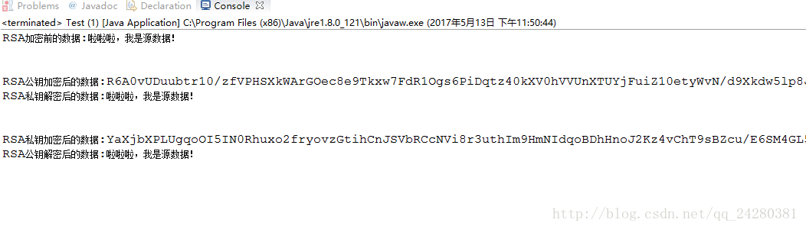

非对称加密算法是一种密钥的保密方法。

非对称加密算法需要两个密钥：公开密钥（public key）和私有密钥（private key）。
公开密钥与私有密钥是一对，如果用公开密钥对数据进行加密，只有用对应的私有密钥才能解密；
如果用私有密钥对数据进行加密，那么只有用对应的公开密钥才能解密。
因为加密和解密使用的是两个不同的密钥，所以这种算法叫作非对称加密算法。 

非对称加密算法实现机密信息交换的基本过程是：
甲方生成一对密钥并将其中的一把作为公用密钥向其它方公开；
得到该公用密钥的乙方使用该密钥对机密信息进行加密后再发送给甲方；
甲方再用自己保存的另一把专用密钥对加密后的信息进行解密。

另一方面，甲方可以使用乙方的公钥对机密信息进行签名后再发送给乙方；乙方再用自己的私匙对数据进行验签。

甲方只能用其专用密钥解密由其公用密钥加密后的任何信息。非对称加密算法的保密性比较好，它消除了最终用户交换密钥的需要。

非对称密码体制的特点：算法强度复杂、安全性依赖于算法与密钥但是由于其算法复杂，而使得加密解密速度没有对称加密解密的速度快。
对称密码体制中只有一种密钥，并且是非公开的，如果要解密就得让对方知道密钥。
所以保证其安全性就是保证密钥的安全，而非对称密钥体制有两种密钥，其中一个是公开的，这样就可以不需要像对称密码那样传输对方的密钥了。
这样安全性就大了很多。

常用的非对称加密算法主要有：RSA、DSA、Elgamal、背包算法、Rabin、D-H、ECC（椭圆曲线加密算法）。

本篇文章就来说说java中的RSA算法的使用。

# 一、RSA算法介绍

RSA算法是最流行的公钥密码算法，使用长度可以变化的密钥。RSA是第一个既能用于【数据加密】也能用于【数字签名】的算法。

RSA算法原理如下：
1. 随机选择两个大质数p和q，p不等于q，计算N=pq；
2. 选择一个大于1小于N的自然数e，e必须与(p-1)(q-1)互素。
3. 用公式计算出d：d×e = 1 (mod (p-1)(q-1)) 。
4. 销毁p和q。

最终得到的N和e就是“公钥”，d就是“私钥”，发送方使用N去加密数据，接收方只有使用d才能解开数据内容。

RSA的安全性依赖于大数分解，小于1024位的N已经被证明是不安全的，而且由于RSA算法进行的都是大数计算，
使得RSA最快的情况也比DES慢上倍，这是RSA最大的缺陷，因此通常只能用于加密少量数据或者加密密钥，但RSA仍然不失为一种高强度的算法。

# 二、加密算法Java代码
直接来看代码，定义一个工具类RsaUtil用来封装RSA算法的加解密操作，同时将其中的加解密函数定义为static类型，以便于其他方法进行调用。

```java
import java.nio.charset.StandardCharsets;
import java.security.KeyFactory;
import java.security.KeyPair;
import java.security.KeyPairGenerator;
import java.security.PrivateKey;
import java.security.PublicKey;
import java.security.interfaces.RSAPrivateKey;
import java.security.interfaces.RSAPublicKey;
import java.security.spec.PKCS8EncodedKeySpec;
import java.security.spec.X509EncodedKeySpec;
import java.util.Base64;

import javax.crypto.Cipher;

public class RsaUtil {
    // 非对称加密密钥算法
    private static final String RSA = "RSA";
    // 加密填充方式
    private static final String ECB_PKCS1_PADDING = "RSA/ECB/PKCS1Padding";

    /**
     * 根据秘钥长度随机生成RSA密钥对
     * @param keyLength 秘钥长度(范围为512~2048，一般为1024)
     * @return 生成的密钥对
     */
    public static KeyPair getKeyPair(int keyLength) {
        if (keyLength > 512 & keyLength < 2048) {
            try {
                KeyPairGenerator kpg = KeyPairGenerator.getInstance(RSA);
                kpg.initialize(keyLength);
                return kpg.genKeyPair();
            } catch (NoSuchAlgorithmException e) {
                e.printStackTrace();
            }
        }
        return null;
    }

    /**
     * 公钥加密算法
     * @param data      (字符串)明文
     * @param publicKey (RSAPublicKey)公钥
     * @return (字符串)密文
     */
    public static String encryptByPublicKey(String data, RSAPublicKey publicKey) {
        if (data != null & publicKey != null) {
            try {
                byte[] bytes = encryptByPublicKey(data.getBytes(StandardCharsets.UTF_8), publicKey.getEncoded());
                return Base64.getEncoder().encodeToString(bytes);
            } catch (UnsupportedEncodingException e) {
                e.printStackTrace();
            }
        }
        return null;
    }

    /**
     * 公钥加密算法
     * @param data      (字节数组)明文
     * @param publicKey (字节数组)公钥
     * @return (字节数组)密文
     */
    public static byte[] encryptByPublicKey(byte[] data, byte[] publicKey) {
        if (data != null & publicKey != null) {
            try {
                // 得到公钥
                X509EncodedKeySpec keySpec = new X509EncodedKeySpec(publicKey);
                KeyFactory kf = KeyFactory.getInstance(RSA);
                PublicKey keyPublic = kf.generatePublic(keySpec);
                // 加密数据
                Cipher cp = Cipher.getInstance(ECB_PKCS1_PADDING);
                cp.init(Cipher.ENCRYPT_MODE, keyPublic);
                return cp.doFinal(data);
            } catch (Exception e) {
                e.printStackTrace();
            }
        }
        return null;
    }

    /**
     * 私钥加密算法
     * @param data       (字符串)明文
     * @param privateKey (RSAPrivateKey)私钥
     * @return (字符串)密文
     */
    public static String encryptByPrivateKey(String data, RSAPrivateKey privateKey) {
        if (data != null & privateKey != null) {
            try {
                byte[] bytes = encryptByPrivateKey(data.getBytes(StandardCharsets.UTF_8), privateKey.getEncoded());
                return Base64.getEncoder().encodeToString(bytes);
            } catch (UnsupportedEncodingException e) {
                e.printStackTrace();
            }
        }
        return null;
    }

    /**
     * 私钥加密算法
     * @param data       (字节数组)明文
     * @param privateKey (字节数组)私钥
     * @return (字节数组)密文
     */
    public static byte[] encryptByPrivateKey(byte[] data, byte[] privateKey) {
        if (data != null & privateKey != null) {
            try {
                // 得到私钥
                PKCS8EncodedKeySpec keySpec = new PKCS8EncodedKeySpec(privateKey);
                KeyFactory kf = KeyFactory.getInstance(RSA);
                PrivateKey keyPrivate = kf.generatePrivate(keySpec);
                // 数据加密
                Cipher cipher = Cipher.getInstance(ECB_PKCS1_PADDING);
                cipher.init(Cipher.ENCRYPT_MODE, keyPrivate);
                return cipher.doFinal(data);
            } catch (Exception e) {
                e.printStackTrace();
            }
        }
        return null;
    }

    /**
     * 公钥解密算法
     * @param encrypted (字符串)密文
     * @param publicKey (RSAPublicKey)公钥
     * @return (字符串)明文
     */
    public static String decryptByPublicKey(byte[] encrypted, RSAPublicKey publicKey) {
        if (encrypted != null & publicKey != null) {
            try {
                byte[] bytes = Base64.getDecoder().decode(encrypted);
                bytes = decryptByPublicKey(bytes, publicKey.getEncoded());
                if (bytes == null) {
                    return null;
                }
                return new String(bytes, StandardCharsets.UTF_8);
            } catch (UnsupportedEncodingException e) {
                e.printStackTrace();
            }
        }
        return null;
    }


    /**
     * 公钥解密算法
     * @param encrypted (字节数组)密文
     * @param publicKey (字节数组)公钥
     * @return (字节数组)明文
     */
    public static byte[] decryptByPublicKey(byte[] encrypted, byte[] publicKey) {
        if (encrypted != null & publicKey != null) {
            try {
                // 得到公钥
                X509EncodedKeySpec keySpec = new X509EncodedKeySpec(publicKey);
                KeyFactory kf = KeyFactory.getInstance(RSA);
                PublicKey keyPublic = kf.generatePublic(keySpec);
                // 数据解密
                Cipher cipher = Cipher.getInstance(ECB_PKCS1_PADDING);
                cipher.init(Cipher.DECRYPT_MODE, keyPublic);
                return cipher.doFinal(encrypted);
            } catch (Exception e) {
                e.printStackTrace();
            }
        }
        return null;
    }

    /**
     * 私钥解密算法
     * @param encrypted  (字符串)密文
     * @param privateKey (RSAPrivateKey)私钥
     * @return (字符串)解密后的明文
     */
    public static String decryptByPrivateKey(String encrypted, RSAPrivateKey privateKey) {
        if (encrypted != null & privateKey != null) {
            try {
                byte[] bytes = Base64.getDecoder().decode(encrypted);
                bytes = decryptByPrivateKey(bytes, privateKey.getEncoded());
                if (bytes == null) {
                    return null;
                }
                return new String(bytes, StandardCharsets.UTF_8);
            } catch (UnsupportedEncodingException e) {
                e.printStackTrace();
            }
        }
        return null;
    }

    /**
     * 私钥解密算法
     * @param encrypted  (字节数组)密文
     * @param privateKey (字节数组)私钥
     * @return (字节数组)明文
     */
    public static byte[] decryptByPrivateKey(byte[] encrypted, byte[] privateKey) {
        if (encrypted != null & privateKey != null) {
            try {
                // 得到私钥
                PKCS8EncodedKeySpec keySpec = new PKCS8EncodedKeySpec(privateKey);
                KeyFactory kf = KeyFactory.getInstance(RSA);
                PrivateKey keyPrivate = kf.generatePrivate(keySpec);
                // 解密数据
                Cipher cp = Cipher.getInstance(ECB_PKCS1_PADDING);
                cp.init(Cipher.DECRYPT_MODE, keyPrivate);
                return cp.doFinal(encrypted);
            } catch (Exception e) {
                e.printStackTrace();
            }
        }
        return null;
    }
}
```

三、运行程序
首先编写main函数，进行Rsa的加解密操作，验证我们的Rsa家解密算法的正确性：
```java
import java.security.KeyPair;
import java.security.interfaces.RSAPrivateKey;
import java.security.interfaces.RSAPublicKey;

public class Test {

    private static int keyLength = 1024;

    public static void main(String[] args) {
        String sourceStr = "啦啦啦，我是源数据！";
        System.out.println("RSA加密前的数据:" + sourceStr + "\n\n");

        // 得到密钥对
        KeyPair keyPair = RsaUtil.getKeyPair(keyLength);
        // 公钥
        RSAPublicKey publicKey = (RSAPublicKey) keyPair.getPublic();
        // 私钥
        RSAPrivateKey privateKey = (RSAPrivateKey) keyPair.getPrivate();

        // 公钥加密
        String publicCipherText = RsaUtil.encryptByPublicKey(sourceStr, publicKey);
        System.out.println("RSA公钥加密后的数据:" + publicCipherText);
        // 私钥解密
        String publicDestStr = RsaUtil.decryptByPrivateKey(publicCipherText, privateKey);
        System.out.println("RSA私钥解密后的数据:" + publicDestStr + "\n\n");

        // 私钥加密
        String privateCipherText = RsaUtil.encryptByPublicKey(sourceStr, publicKey);
        System.out.println("RSA私钥加密后的数据:" + privateCipherText);
        // 公钥解密
        String privateDestStr = RsaUtil.decryptByPrivateKey(publicCipherText, privateKey);
        System.out.println("RSA公钥解密后的数据:" + privateDestStr);
    }
}
```
运行程序，可以看到结果如下所示：


可以看到，我们使用Rsa公钥对源数据加密后使用私钥成功的将其解密出来。同时使用Rsa私钥将源数据进行加密后成功的使用公钥将其解密出来。

OK，关于java中的RSA加密算法就先说到这里，下一章将会带来Java中的Hash算法的学习。
