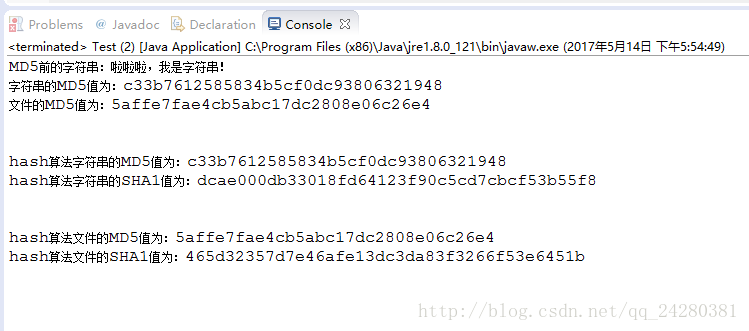
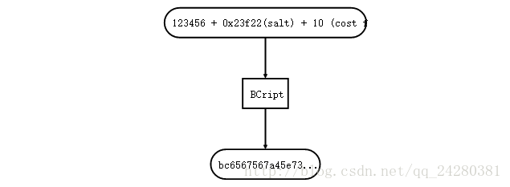

Hash算法严格上来说并【不属于加密算法】，而是与加密算法属于并列关系的一种算法。

概括来说，哈希（Hash）是将【目标文本】转换成具有【相同长度】的、【不可逆】的杂凑字符串（或叫做消息摘要），
而加密（Encrypt）是将【目标文本】转换成具有【不同长度】的、【可逆】的密文。

具体来说，两者的主要区别有以下两个：
1）Hash算法转换过程不可逆，而加密转换过程可逆。
2）Hash算法无论输入的源数据的长度是多少，同一种Hash算法转换后结果的长度都相同。而加密转换后结果的长度一般与源数据的长度正相关。

关于Hash算法和加解密算法，我们讨论如下几个问题：

1、为什么Hash算法是不可逆，但是加密算法是可逆的？
```text
这里的不可逆既指不能根据转换后的结果逆转回原文，也指对于两个输入，即使其转换结果相同也不能说这两个输入就一定相同。

因为，【Hash算法】的【定义域】是一个【无限集合】，但是【值域】确是一个【有限集合】，将一个无限集合映射到有限集合上，根据“鸽笼原理”，
每个哈希结果都存在无数个可能的目标文本，因此哈希是一个【多对一】的映射，所以它也【不存在逆映射】。

但是对于【加密算法】，它的结果往往取决于输入，其【定义域】和【值域】都是【无限集合】，明显是一个【一一映射】，
对于一一映射，理论上都是可逆的。
```

2、对于Hash算法和加解密算法一般情况下我们是如何选择的呢
```text
基本原则是：
    如果被保护数据仅仅用作比较验证，在以后不需要还原成明文形式，则使用哈希；
    如果被保护数据在以后需要被还原成明文，则需要使用加密。

如一般情况下，几乎所有的注册用户时我们输入的密码都是使用Hash算法进行加密,然后将其保存在数据库中的。
当我们登录时，输入我们的密码，然后通过Hash运算，将运算结果与数据库中存储的结果比较，相同的话就登录，不同的话就代表密码错误，需要重新输入。
当我们忘记自己的密码需要修改密码时，我们需要使用密保等进行验证，验证成功后需要设置新密码，然后Hash算出新密码的结果，
将数据库中的源密码的Hash结果覆盖。而不是我们忘记密码后服务器将我们的原密码给我们重新发送过来，然后我么是原密码进行登录。
这是几乎是不可能的，原因就是因为Hash算法是不可逆的。

而对于使用加解密算法，例子就很多了。
比如加密文件，将加密后的数据保存后者发送给他人。别人不知道密码时是无法解密的，只有输入密码后才能将加密后的文件解密出来。
```

OK，对于Hash算法和加解密算法就介绍到这里。先来我们来看常用的Hash算法都有哪些。

常见的Hash算法有：MD2、MD4、MD5、HAVAL、SHA、SHA-1、HMAC、HMAC-MD5、HMAC-SHA1等

下来我们看MD5和SHA1两种Hash算法在Java中的使用。

# 一、MD5算法

## 1、MD5简介
Message Digest Algorithm MD5（消息摘要算法5）为计算机安全领域广泛使用的一种散列函数，用以提供【消息的完整性保护】。
是计算机广泛使用的杂凑算法之一，将数据（如汉字）运算为另一固定长度值，是杂凑算法的基础原理，MD5的前身有MD2、MD3和MD4。

MD5算法具有以下特点：
- 1、压缩性：任意长度的数据，算出的MD5值长度都是固定的。
- 2、容易计算：从原数据计算出MD5值很容易。
- 3、抗修改性：对原数据进行任何改动，哪怕只修改1个字节，所得到的MD5值都有很大区别。
- 4、强抗碰撞：已知原数据和其MD5值，想找到一个具有相同MD5值的数据（即伪造数据）是非常困难的。

MD5应用场景：
- 1、一致性验证
- 2、数字签名
- 3、安全访问认证

## 2、MD5的Java代码
首先，我们还是先新建一个MD5Util类来封装MD5的操作：

```java
import java.io.File;
import java.io.FileInputStream;
import java.io.IOException;
import java.io.UnsupportedEncodingException;
import java.nio.charset.StandardCharsets;
import java.security.MessageDigest;
import java.security.NoSuchAlgorithmException;

public class MD5Util {

    /**
     * 计算字符串的MD5值
     * @param string 明文
     * @return 字符串的MD5值
     */
    public static String md5(String string) {
        if (string.isEmpty()) {
            return "";
        }
        MessageDigest md5;
        try {
            md5 = MessageDigest.getInstance("MD5");
            byte[] bytes = md5.digest(string.getBytes(StandardCharsets.UTF_8));
            StringBuilder result = new StringBuilder();
            for (byte b : bytes) {
                String temp = Integer.toHexString(b & 0xff);
                if (temp.length() == 1) {
                    temp = "0" + temp;
                }
                result.append(temp);
            }
            return result.toString();
        } catch (Exception e) {
            e.printStackTrace();
        }
        return "";
    }

    /**
     * 计算文件的MD5值
     * @param file 文件File
     * @return 文件的MD5值
     */
    public static String md5(File file) {
        if (file == null || !file.isFile() || !file.exists()) {
            return "";
        }
        FileInputStream in = null;
        StringBuilder result = new StringBuilder();
        byte[] buffer = new byte[1024];
        int len;
        try {
            MessageDigest md5 = MessageDigest.getInstance("MD5");
            in = new FileInputStream(file);
            while ((len = in.read(buffer)) != -1) {
                md5.update(buffer, 0, len);
            }
            byte[] bytes = md5.digest();

            for (byte b : bytes) {
                String temp = Integer.toHexString(b & 0xff);
                if (temp.length() == 1) {
                    temp = "0" + temp;
                }
                result.append(temp);
            }
        } catch (Exception e) {
            e.printStackTrace();
        } finally {
            if (null != in) {
                try {
                    in.close();
                } catch (IOException e) {
                    e.printStackTrace();
                }
            }
        }
        return result.toString();
    }
}
```
在MD5Util类中，我们分别定义了对字符串和文件计算MD5值的函数，接下来只需要在main函数使用这两个函数。

# 二、SHA1算法

## 1、SHA1算法简介：
安全哈希算法（Secure Hash Algorithm）主要适用于数字签名标准（Digital Signature Standard DSS）里面定义的数字签名算法（Digital Signature Algorithm DSA）。
对于长度小于2^64位的消息，SHA1会产生一个160位的消息摘要。当接收到消息的时候，这个消息摘要可以用来验证数据的完整性。
在传输的过程中，数据很可能会发生变化，那么这时候就会产生不同的消息摘要。

SHA1有如下特性：
- 不可以从消息摘要中复原信息；
- 两个不同的消息不会产生同样的消息摘要。

SHA1算法原理大概如下：

1）首先进行SHA1分组：
对于任意长度的明文，SHA1可以产生160位的摘要。对明文的分组处理过程如下：
```text
1）对数据流尾部添加0x80标记。任意长度的明文首先需要添加位数，使明文总长度为448（mod512）位。
    将0x80字节追加到数据流尾部以后，源数据流的整个长度将会发生变化，考虑到还要添加64位（8个字节）的位长度，
    必须填充0 以使修改后的源数据流是64字节（512位）的倍数。在明文后添加位的方法是第 一个添加位是l，其余都是0。

2）然后将真正明文的长度（没有添加位以前的明文长度）以64位表示，附加于前面已添加过位的明文后，此时的明文长度正好是 512位的倍数。
    当明文长度大于2的64次方时，仅仅使用低64位比特填充，附加到最后一个分组的末尾。

3）经过添加处理的明文，其长度正好为512位的整数倍，然后按512位的长度进行分组（block），可以划分成L份明文分组，
    我们用Y0，Y1，……，YL-1表示这些明文分组。

4）Sha1默认数据流以big endian方式存放。
```
2）分组之后，对所得到的若干分组反复重复处理。
对每个明文分组的摘要生成过程如下：
```text
1）将512位划分成16个子明文分组，每个子分组32位
2）申请5个链接变量a、b、c、d、e，初始为H0、H1、H2、H3、H4
3）将16个子分组扩展为80份
4）80个子分组进行4轮运算，得到新的a、b、c、d、e值
5）新的链接变量与原始链接变量进行求和
6）链接变量作为下一个明文分组的初始链接变量
7）最后一个分组的5个链接变量就是SHA1摘要
```

## 2、SHA1算法Java代码：
计算SHA1值的Java代码与计算MD5值的代码基本相同，区别只在于
```text
MessageDigest.getInstance("MD5"); // 这句话里面的"MD5"的不同，当计算SHA1值时只需要将"MD5"改为"SHA1"就行。
```
所以我们将上面计算MD5值的MD5Util类进行扩展，重新建一个HashUtil类，此类可以计算各种Hash算法的Hash值，
只需要将算法名传入hash函数就行。

```java
import java.io.File;
import java.io.FileInputStream;
import java.io.IOException;
import java.io.UnsupportedEncodingException;
import java.nio.charset.StandardCharsets;
import java.security.MessageDigest;
import java.security.NoSuchAlgorithmException;

public class HashUtil {

    /**
     * 计算字符串的hash值
     * @param string    明文
     * @param algorithm 算法名
     * @return 字符串的hash值
     */
    public static String hash(String string, String algorithm) {
        if (string.isEmpty()) {
            return "";
        }
        MessageDigest hash;
        try {
            hash = MessageDigest.getInstance(algorithm);
            byte[] bytes = hash.digest(string.getBytes(StandardCharsets.UTF_8));
            StringBuilder result = new StringBuilder();
            for (byte b : bytes) {
                String temp = Integer.toHexString(b & 0xff);
                if (temp.length() == 1) {
                    temp = "0" + temp;
                }
                result.append(temp);
            }
            return result.toString();
        } catch (Exception e) {
            e.printStackTrace();
        }
        return "";
    }

    /**
     * 计算文件的hash值
     * @param file      文件File
     * @param algorithm 算法名
     * @return 文件的hash值
     */
    public static String hash(File file, String algorithm) {
        if (file == null || !file.isFile() || !file.exists()) {
            return "";
        }
        FileInputStream in = null;
        StringBuilder result = new StringBuilder();
        byte[] buffer = new byte[1024];
        int len;
        try {
            MessageDigest hash = MessageDigest.getInstance(algorithm);
            in = new FileInputStream(file);
            while ((len = in.read(buffer)) != -1) {
                hash.update(buffer, 0, len);
            }
            byte[] bytes = hash.digest();

            for (byte b : bytes) {
                String temp = Integer.toHexString(b & 0xff);
                if (temp.length() == 1) {
                    temp = "0" + temp;
                }
                result.append(temp);
            }
        } catch (Exception e) {
            e.printStackTrace();
        } finally {
            if (null != in) {
                try {
                    in.close();
                } catch (IOException e) {
                    e.printStackTrace();
                }
            }
        }
        return result.toString();
    }
}
```
# 三、运行程序
在main函数中添加测试代码：
```java
import java.io.File;

public class Test {

    public static void main(String[] args) {
        String str = "啦啦啦，我是字符串！";
        System.out.println("MD5前的字符串：" + str);
        File file = new File("D:/test.txt");

        String strMD5 = MD5Util.md5(str);
        System.out.println("字符串的MD5值为：" + strMD5);

        String fileMD5 = MD5Util.md5(file);
        System.out.println("文件的MD5值为：" + fileMD5 + "\n\n");

        String hashStrMD5 = HashUtil.hash(str, "MD5");
        System.out.println("hash算法字符串的MD5值为：" + hashStrMD5);
        String hashStrSHA1 = HashUtil.hash(str, "SHA1");
        System.out.println("hash算法字符串的SHA1值为：" + hashStrSHA1 + "\n\n");

        String hashFileMD5 = HashUtil.hash(file, "MD5");
        System.out.println("hash算法文件的MD5值为：" + hashFileMD5);
        String hashFileSHA1 = HashUtil.hash(file, "SHA1");
        System.out.println("hash算法文件的SHA1值为：" + hashFileSHA1);
    }
}
```
运行程序，可以看到程序运行后的结果为：


# 四、补充
MD5、SHA1等hash算法作为一种不可逆算法，一定程度上保证了密码的安全性，但是MD5等hash算法真的是完全安全的吗，其实不然。

从概率来说16的32次方遍历后至少出现两个相同的MD5值，但是16的32次方有多大？3402823669209384634633746074317.7亿，
就算全世界最快的超级计算机也要跑几十亿年才能跑完。可是，王小云教授发现，可以很快的找到MD5的“磕碰”，
便是两个文件可以产生相同的“指纹”。这意味着，当你在网络上运用电子签名签署一份合同后，
还可能找到其他一份具有相同签名但内容悬殊的合同，这么两份合同的真伪性便无从辨别。
王小云教授的研究效果证明了利用MD5算法的磕碰可以严重威胁信息体系安全，这一发现使现在电子签名的法律效力和技能体系受到应战。
因此，业界专家普林斯顿计算机教授Edward Felten等强烈呼吁信息体系的设计者赶快更换签名算法，而且他们侧重这是一个需要当即处理的疑问。

同时美国国家技能与规范局（NIST）于2004年8月24日宣布专门谈论，谈论的首要内容为：“在近来的世界暗码学会议（Crypto 2004）上，
研究人员宣布他们发现了破解数种HASH算法的办法，其间包含MD4，MD5，HAVAL-128，RIPEMD还有 SHA-0。
剖析标明，于1994年代替SHA-0成为联邦信息处理规范的SHA-1的削弱条件的变种算法能够被破解；但完好的SHA-1并没有被破解，
也没有找到SHA-1的碰撞。研究结果阐明SHA-1的安全性暂时没有问题，但随着技能的发展，技能与规范局计划在2010年之前逐步筛选SHA-1，
换用别的更长更安全的算法（如SHA-224、SHA-256、SHA-384和SHA-512）来代替。”

所以从这里也可以看出，单步的hash算法还是存在很大的漏洞，容易被碰撞。

那么该如何进一步的加强hash算法的安全性呢，可以使用如下的办法：

1）hash+盐（salt）：
```text
salt可以简单的理解成：随机产生的一定长度的，可以和密码相结合，从而使hash算法产生不同结果的字符串。
也就相当于你的新密码 = 旧密码 + 随机的盐值，然后对新密码进行hash。

优点：
    这种方法会极大防止受到彩虹表的攻击，因为即便攻击者构造出彩虹表，因为你使用了 hash（密码+ salt），
    攻击者彩虹表里的哈希值（hash（密码））和你数据库中的哈希值是不同的。
缺点：
    如果攻击者知道了salt和你的哈希值，就可以计算出你的原始密码（当然也没有那么容易）
```

2）增加计算的时间 （哈希 + salt + Iteration）：
```text
通过迭代计算的方式增加计算密码的成本。迭代的周期控制在用户可以接受范围内，这样攻击者的计算和时间成本就会大大增加。
```
类似的方法可以使用： BCript
hashed value = BCript(password，salt，cost factor)



一般到此时，hash结果就比较安全了。但是如果还需要更加地安全，可以继续对这种方法计算出来的hash值使用加密算法加密。
然后做到：
```text
1）定时更换密钥
    （准备一组密钥定时更换，首先通过密钥解密加密存储的密码得到 bscript计算出的hash值，在用新的密钥进行加密）
2）密钥存储在在不同的数据源
    （通过将密钥存储在不同的数据源的方法，进一步增加了破解难度，因为需要同时获得用户密码表数据，同时要获得其他数据源存储的密钥）
```
OK，关于加密解密相关的内容就先写到这里。
