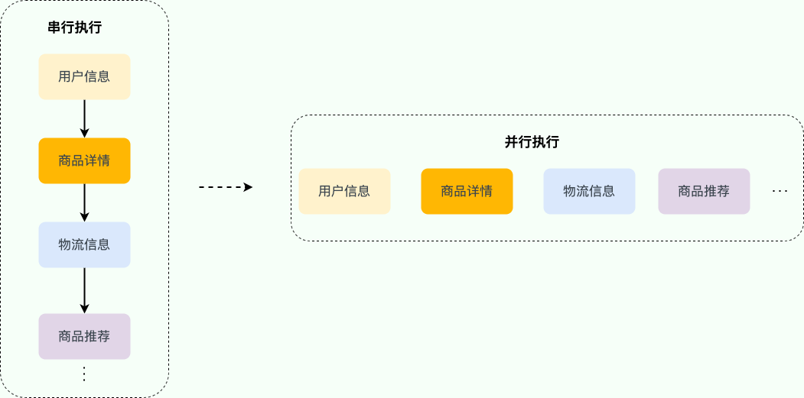
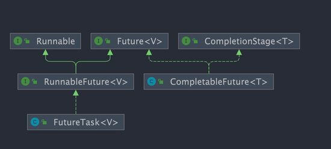
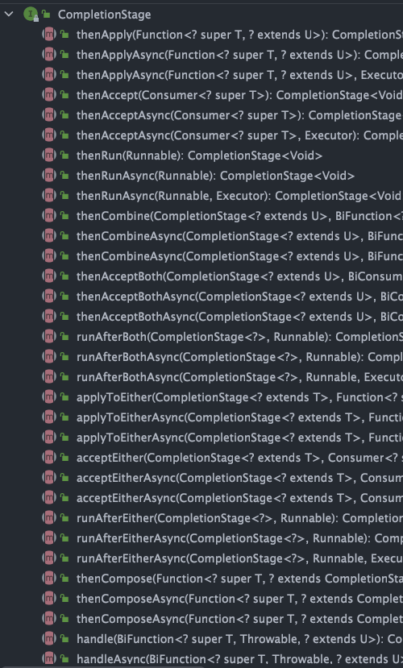
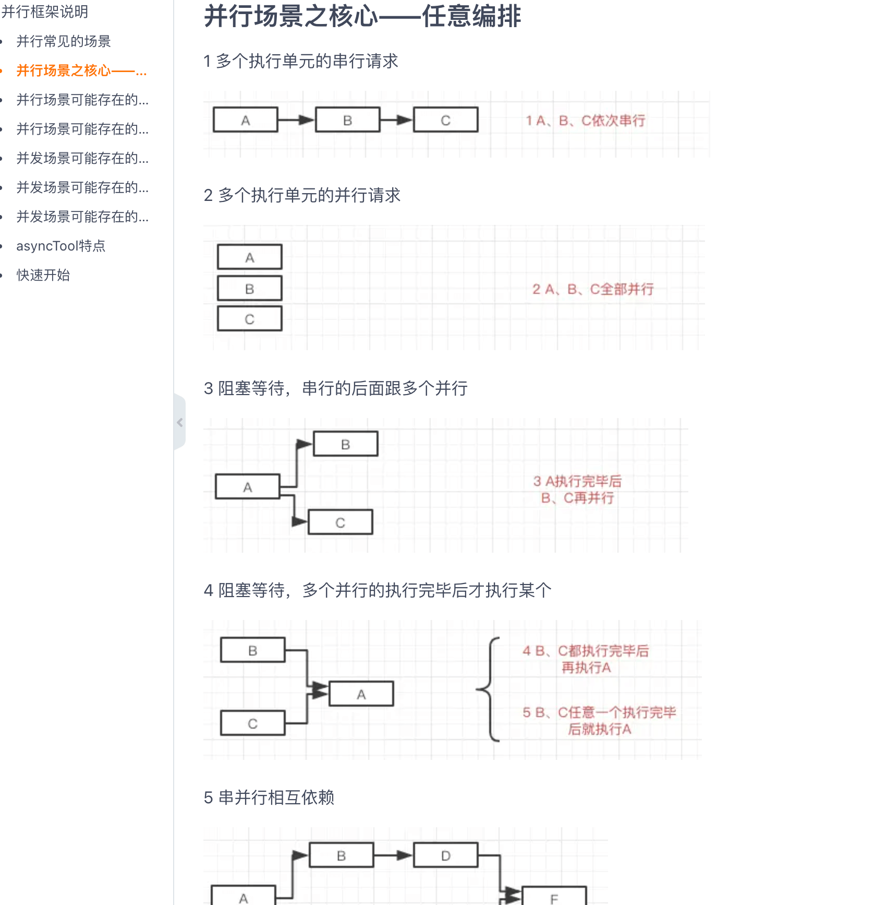

# CompletableFuture详解

一个接口可能需要调用N个其他服务的接口，这在项目开发中还是挺常见的。
举个例子：用户请求获取订单信息，可能需要调用用户信息、商品详情、物流信息、商品推荐等接口，最后再汇总数据统一返回。

如果是串行（按顺序依次执行每个任务）执行的话，接口的响应速度会非常慢。
考虑到这些接口之间有大部分都是 **无前后顺序关联** 的，可以 **并行执行** ，
就比如说调用获取商品详情的时候，可以同时调用获取物流信息。
通过并行执行多个任务的方式，接口的响应速度会得到大幅优化。



对于存在前后顺序关系的接口调用，可以进行编排，如下图所示。


1. 获取用户信息之后，才能调用商品详情和物流信息接口。
2. 成功获取商品详情和物流信息之后，才能调用商品推荐接口。

对于Java程序来说，Java 8才被引入的`CompletableFuture`可以帮助我们来做多个任务的编排，功能非常强大。

这篇文章是`CompletableFuture`的简单入门，带大家看看`CompletableFuture`常用的API。

## Future 介绍

`Future`类是异步思想的典型运用，主要用在一些需要执行耗时任务的场景，避免程序一直原地等待耗时任务执行完成，执行效率太低。
具体来说是这样的：
当我们执行某一耗时的任务时，可以将这个耗时任务交给一个子线程去异步执行，同时我们可以干点其他事情，不用傻傻等待耗时任务执行完成。
等我们的事情干完后，我们再通过`Future`类获取到耗时任务的执行结果。
这样一来，程序的执行效率就明显提高了。

这其实就是多线程中经典的 **Future模式**，你可以将其看作是一种设计模式，核心思想是异步调用，主要用在多线程领域，并非Java语言独有。

在Java中，`Future`类只是一个泛型接口，位 `java.util.concurrent`包下，其中定义了5个方法，主要包括下面这4个功能：
- 取消任务；
- 判断任务是否被取消;
- 判断任务是否已经执行完成;
- 获取任务执行结果。

```java
// V 代表了Future执行的任务返回值的类型
public interface Future<V> {
    // 取消任务执行
    // 成功取消返回 true，否则返回 false
    boolean cancel(boolean mayInterruptIfRunning);
    // 判断任务是否被取消
    boolean isCancelled();
    // 判断任务是否已经执行完成
    boolean isDone();
    // 获取任务执行结果
    V get() throws InterruptedException, ExecutionException;
    // 指定时间内没有返回计算结果就抛出 TimeOutException 异常
    V get(long timeout, TimeUnit unit) throws InterruptedException, ExecutionException, TimeoutException;

}
```

简单理解就是：我有一个任务，提交给了`Future`来处理。任务执行期间我自己可以去做任何想做的事情。
并且，在这期间我还可以取消任务以及获取任务的执行状态。
一段时间之后，我就可以`Future`那里直接取出任务执行结果。

## CompletableFuture 介绍

`Future`在实际使用过程中存在一些局限性比如不支持**异步任务的编排组合**、获取计算结果的`get()`方法为阻塞调用。

Java 8才被引入`CompletableFuture`类可以解决`Future`的这些缺陷。
`CompletableFuture`除了提供了更为好用和强大的`Future`特性之外，
还提供了函数式编程、异步任务编排组合（可以将多个异步任务串联起来，组成一个完整的链式调用）等能力。

下面我们来简单看看`CompletableFuture`类的定义。

```java
public class CompletableFuture<T> implements Future<T>, CompletionStage<T> {
}
```

可以看到，`CompletableFuture`同时实现了`Future`和`CompletionStage`接口。



`CompletionStage`接口描述了一个异步计算的阶段。
很多计算可以分成多个阶段或步骤，此时可以通过它将所有步骤组合起来，形成异步计算的流水线。

`CompletableFuture`除了提供了更为好用和强大的`Future`特性之外，还提供了函数式编程的能力。


`Future`接口有5个方法：
- `boolean cancel(boolean mayInterruptIfRunning)`：尝试取消执行任务。
- `boolean isCancelled()`：判断任务是否被取消。
- `boolean isDone()`：判断任务是否已经被执行完成。
- `get()`：等待任务执行完成并获取运算结果。
- `get(long timeout, TimeUnit unit)`：多了一个超时时间。

`CompletionStage`接口描述了一个异步计算的阶段。
很多计算可以分成多个阶段或步骤，此时可以通过它将所有步骤组合起来，形成异步计算的流水线。

`CompletionStage`接口中的方法比较多，`CompletableFuture`的函数式能力就是这个接口赋予的。
从这个接口的方法参数你就可以发现其大量使用了Java8引入的函数式编程。



由于方法众多，所以这里不能一一讲解，下文中我会介绍大部分常见方法的使用。

## CompletableFuture 常见操作

### 创建 CompletableFuture

常见的创建`CompletableFuture`对象的方法如下：

1. 通过new关键字。
2. 基于`CompletableFuture`自带的静态工厂方法：`runAsync()`、`supplyAsync()`。

#### new 关键字

通过new关键字创建`CompletableFuture`对象这种使用方式可以看作是将`CompletableFuture`当做`Future`来使用。

我在我的开源项目 [guide-rpc-framework](https://github.com/Snailclimb/guide-rpc-framework) 中
就是这种方式创建的`CompletableFuture`对象。

下面咱们来看一个简单的案例。

我们通过创建了一个结果值类型为`RpcResponse<Object>`的`CompletableFuture`，你可以把`resultFuture`看作是异步运算结果的载体。

```text
CompletableFuture<RpcResponse<Object>> resultFuture = new CompletableFuture<>();
```

假设在未来的某个时刻，我们得到了最终的结果。
这时，我们可以调用`complete()`方法为其传入结果，这表示`resultFuture`已经被完成了。

```text
// complete() 方法只能调用一次，后续调用将被忽略。
resultFuture.complete(rpcResponse);
```

你可以通过`isDone()`方法来检查是否已经完成。
```text
public boolean isDone() {
    return result != null;
}
```

获取异步计算的结果也非常简单，直接调用`get()`方法即可。调用`get()`方法的线程会阻塞直到`CompletableFuture`完成运算。
```text
rpcResponse = completableFuture.get();
```

如果你已经**知道计算的结果**的话，可以使用静态方法`completedFuture()`来创建`CompletableFuture`。
```text
CompletableFuture<String> future = CompletableFuture.completedFuture("hello!");
assertEquals("hello!", future.get());
```

`completedFuture()`方法底层调用的是带参数的new方法，只不过，这个方法不对外暴露。
```text
public static <U> CompletableFuture<U> completedFuture(U value) {
    return new CompletableFuture<U>((value == null) ? NIL : value);
}
```

#### 静态工厂方法

这两个方法可以帮助我们封装计算逻辑。

```text
static <U> CompletableFuture<U> supplyAsync(Supplier<U> supplier);
// 使用自定义线程池(推荐)
static <U> CompletableFuture<U> supplyAsync(Supplier<U> supplier, Executor executor);

static CompletableFuture<Void> runAsync(Runnable runnable);
// 使用自定义线程池(推荐)
static CompletableFuture<Void> runAsync(Runnable runnable, Executor executor);
```

`runAsync()`方法接受的参数是`Runnable`，这是一个函数式接口，**不允许返回值**。
当你需要异步操作且不关心返回结果的时候可以使用`runAsync()`方法。
```java
@FunctionalInterface
public interface Runnable {
    void run();
}
```

`supplyAsync()`方法接受的参数是`Supplier<U>`，这也是一个函数式接口，`U`是返回结果值的类型。
```java
@FunctionalInterface
public interface Supplier<T> {

    /**
     * Gets a result.
     *
     * @return a result
     */
    T get();
}
```

当你需要异步操作且关心返回结果的时候,可以使用`supplyAsync()`方法。

```java
public class Test {
    public static void main(String[] args) {
        CompletableFuture<Void> future = CompletableFuture.runAsync(() -> System.out.println("hello!"));
        future.get(); // 输出 "hello!"

        CompletableFuture<String> future2 = CompletableFuture.supplyAsync(() -> "hello!");
        assertEquals("hello!", future2.get());
    }
}
```

### 处理异步结算的结果

当我们获取到异步计算的结果之后，还可以对其进行进一步的处理，比较常用的方法有下面几个：
- `thenApply()`
- `thenAccept()`
- `thenRun()`
- `whenComplete()`

`thenApply()`方法接受一个`Function`实例，用它来处理结果。
```text
// 沿用上一个任务的线程池
public <U> CompletableFuture<U> thenApply(Function<? super T,? extends U> fn) {
    return uniApplyStage(null, fn);
}

// 使用默认的 ForkJoinPool 线程池（不推荐）
public <U> CompletableFuture<U> thenApplyAsync(Function<? super T,? extends U> fn) {
    return uniApplyStage(defaultExecutor(), fn);
}
// 使用自定义线程池(推荐)
public <U> CompletableFuture<U> thenApplyAsync(Function<? super T,? extends U> fn, Executor executor) {
    return uniApplyStage(screenExecutor(executor), fn);
}
```

`thenApply()`方法使用示例如下：
```java
public class Test {
    public static void main(String[] args) {
        CompletableFuture<String> future = CompletableFuture.completedFuture("hello!")
                                                            .thenApply(s -> s + "world!");
        assertEquals("hello!world!", future.get());
        
        // 这次调用将被忽略。
        future.thenApply(s -> s + "nice!");
        assertEquals("hello!world!", future.get());
    }
}
```

你还可以进行 **流式调用**：
```java
public class Test {
    public static void main(String[] args) {
        CompletableFuture<String> future = CompletableFuture.completedFuture("hello!")
                                                            .thenApply(s -> s + "world!")
                                                            .thenApply(s -> s + "nice!");
        assertEquals("hello!world!nice!", future.get());
    }
}
```

**如果你不需要从回调函数中获取返回结果，可以使用`thenAccept()`或者`thenRun()`。
这两个方法的区别在于`thenRun()`不能访问异步计算的结果。**

`thenAccept()`方法的参数是 `Consumer<? super T>`。

```text
public CompletableFuture<Void> thenAccept(Consumer<? super T> action) {
    return uniAcceptStage(null, action);
}

public CompletableFuture<Void> thenAcceptAsync(Consumer<? super T> action) {
    return uniAcceptStage(defaultExecutor(), action);
}

public CompletableFuture<Void> thenAcceptAsync(Consumer<? super T> action, Executor executor) {
    return uniAcceptStage(screenExecutor(executor), action);
}
```

顾名思义，`Consumer`属于消费型接口，它可以接收1个输入对象然后进行“消费”。

```java
@FunctionalInterface
public interface Consumer<T> {

    void accept(T t);

    default Consumer<T> andThen(Consumer<? super T> after) {
        Objects.requireNonNull(after);
        return (T t) -> { accept(t); after.accept(t); };
    }
}
```

`thenRun()`的方法是的参数是`Runnable`。

```text
public CompletableFuture<Void> thenRun(Runnable action) {
    return uniRunStage(null, action);
}

public CompletableFuture<Void> thenRunAsync(Runnable action) {
    return uniRunStage(defaultExecutor(), action);
}

public CompletableFuture<Void> thenRunAsync(Runnable action, Executor executor) {
    return uniRunStage(screenExecutor(executor), action);
}
```

`thenAccept()` 和 `thenRun()` 使用示例如下：

```java
public class Test {
    public static void main(String[] args) {
        CompletableFuture.completedFuture("hello!")
                .thenApply(s -> s + "world!")
                .thenApply(s -> s + "nice!")
                .thenAccept(System.out::println); // hello!world!nice!

        CompletableFuture.completedFuture("hello!")
                .thenApply(s -> s + "world!")
                .thenApply(s -> s + "nice!")
                .thenRun(() -> System.out.println("hello!")); // hello!
    }
}
```

`whenComplete()`的方法的参数是`BiConsumer<? super T, ? super Throwable>`。

```text
public CompletableFuture<T> whenComplete(BiConsumer<? super T, ? super Throwable> action) {
    return uniWhenCompleteStage(null, action);
}

public CompletableFuture<T> whenCompleteAsync(BiConsumer<? super T, ? super Throwable> action) {
    return uniWhenCompleteStage(defaultExecutor(), action);
}

// 使用自定义线程池(推荐)
public CompletableFuture<T> whenCompleteAsync(BiConsumer<? super T, ? super Throwable> action, 
                                            Executor executor) {
    return uniWhenCompleteStage(screenExecutor(executor), action);
}
```

相对于`Consumer`，`BiConsumer`可以接收2个输入对象然后进行“消费”。

```java
@FunctionalInterface
public interface BiConsumer<T, U> {
    void accept(T t, U u);

    default BiConsumer<T, U> andThen(BiConsumer<? super T, ? super U> after) {
        Objects.requireNonNull(after);

        return (l, r) -> {
            accept(l, r);
            after.accept(l, r);
        };
    }
}
```

`whenComplete()`使用示例如下：

```java
public class Test {
    public static void main(String[] args) {
        CompletableFuture<String> future = CompletableFuture.supplyAsync(() -> "hello!")
                .whenComplete((res, ex) -> {
                    // res 代表返回的结果
                    // ex 的类型为 Throwable ，代表抛出的异常
                    System.out.println(res);
                    // 这里没有抛出异常所有为 null
                    assertNull(ex);
                });
        assertEquals("hello!", future.get());
    }
}
```

### 异常处理

你可以通过`handle()`方法来处理任务执行过程中可能出现的抛出异常的情况。

```text
public <U> CompletableFuture<U> handle(BiFunction<? super T, Throwable, ? extends U> fn) {
    return uniHandleStage(null, fn);
}

public <U> CompletableFuture<U> handleAsync(BiFunction<? super T, Throwable, ? extends U> fn) {
    return uniHandleStage(defaultExecutor(), fn);
}

public <U> CompletableFuture<U> handleAsync(BiFunction<? super T, Throwable, ? extends U> fn, Executor executor) {
    return uniHandleStage(screenExecutor(executor), fn);
}
```

示例代码如下：

```java
public class Test {
    public static void main(String[] args) {
        CompletableFuture<String> future = CompletableFuture.supplyAsync(() -> {
            throw new RuntimeException("Computation error!");
            return "hello!";
        }).handle((res, ex) -> {
            // res 代表返回的结果
            // ex 的类型为 Throwable ，代表抛出的异常
            return res != null ? res : "world!";
        });
        assertEquals("world!", future.get());
    }
}
```

你还可以通过`exceptionally()`方法来处理异常情况。

```java
public class Test {
    public static void main(String[] args) {
        CompletableFuture<String> future = CompletableFuture.supplyAsync(() -> {
            throw new RuntimeException("Computation error!");
            return "hello!";
        }).exceptionally(ex -> {
            System.out.println(ex.toString());// CompletionException
            return "world!";
        });
        assertEquals("world!", future.get());
    }
}
```

如果你想让`CompletableFuture`的结果就是异常的话，可以使用`completeExceptionally()`方法为其赋值。

```text
CompletableFuture<String> completableFuture = new CompletableFuture<>();
// ...
completableFuture.completeExceptionally(new RuntimeException("Calculation failed!"));
// ...
completableFuture.get(); // ExecutionException
```

### 组合 CompletableFuture

你可以使用`thenCompose()`按顺序链接两个`CompletableFuture`对象，实现异步的任务链。
它的作用是将前一个任务的返回结果作为下一个任务的输入参数，从而形成一个依赖关系。

```text
public <U> CompletableFuture<U> thenCompose(Function<? super T, ? extends CompletionStage<U>> fn) {
    return uniComposeStage(null, fn);
}

public <U> CompletableFuture<U> thenComposeAsync(Function<? super T, ? extends CompletionStage<U>> fn) {
    return uniComposeStage(defaultExecutor(), fn);
}

public <U> CompletableFuture<U> thenComposeAsync(Function<? super T, ? extends CompletionStage<U>> fn,
                                                    Executor executor) {
    return uniComposeStage(screenExecutor(executor), fn);
}
```

`thenCompose()`方法会使用示例如下：

```java
public class Test {
    public static void main(String[] args) {
        CompletableFuture<String> future = CompletableFuture.supplyAsync(() -> "hello!")
                .thenCompose(s -> CompletableFuture.supplyAsync(() -> s + "world!"));
        assertEquals("hello!world!", future.get());
    }
}
```

在实际开发中，这个方法还是非常有用的。
比如说，task1和task2都是异步执行的，但task1必须执行完成后才能开始执行task2（task2依赖task1的执行结果）。

和`thenCompose()`方法类似的还有`thenCombine()`方法，它同样可以组合两个`CompletableFuture`对象。

```java
public class Test {
    public static void main(String[] args) {
        CompletableFuture<String> completableFuture = CompletableFuture.supplyAsync(() -> "hello!")
                .thenCombine(CompletableFuture.supplyAsync(() -> "world!"), (s1, s2) -> s1 + s2)
                .thenCompose(s -> CompletableFuture.supplyAsync(() -> s + "nice!"));
        assertEquals("hello!world!nice!", completableFuture.get());
    }
}
```

**那`thenCompose()`和`thenCombine()`有什么区别呢？**
- `thenCompose()`可以链接两个`CompletableFuture`对象，并将前一个任务的返回结果作为下一个任务的参数，它们之间存在着**先后顺序**。
- `thenCombine()`会在两个任务都执行完成后，把两个任务的结果合并。两个任务是**并行执行**的，它们之间并没有先后依赖顺序。

除了 `thenCompose()`和`thenCombine()`之外，还有一些其他的组合`CompletableFuture`的方法用于实现不同的效果，满足不同的业务需求。

例如，如果我们想要实现task1和task2中的任意一个任务执行完后就执行task3的话，可以使用`acceptEither()`。

```text
public CompletableFuture<Void> acceptEither(CompletionStage<? extends T> other, Consumer<? super T> action) {
    return orAcceptStage(null, other, action);
}

public CompletableFuture<Void> acceptEitherAsync(CompletionStage<? extends T> other, Consumer<? super T> action) {
    return orAcceptStage(asyncPool, other, action);
}
```

简单举一个例子：

```java
public class Test {
    public static void main(String[] args) {
        CompletableFuture<String> task = CompletableFuture.supplyAsync(() -> {
            System.out.println("任务1开始执行，当前时间：" + System.currentTimeMillis());
            try {
                Thread.sleep(500);
            } catch (InterruptedException e) {
                e.printStackTrace();
            }
            System.out.println("任务1执行完毕，当前时间：" + System.currentTimeMillis());
            return "task1";
        });

        CompletableFuture<String> task2 = CompletableFuture.supplyAsync(() -> {
            System.out.println("任务2开始执行，当前时间：" + System.currentTimeMillis());
            try {
                Thread.sleep(1000);
            } catch (InterruptedException e) {
                e.printStackTrace();
            }
            System.out.println("任务2执行完毕，当前时间：" + System.currentTimeMillis());
            return "task2";
        });

        task.acceptEitherAsync(task2, (res) -> {
            System.out.println("任务3开始执行，当前时间：" + System.currentTimeMillis());
            System.out.println("上一个任务的结果为：" + res);
        });

        // 增加一些延迟时间，确保异步任务有足够的时间完成
        try {
            Thread.sleep(2000);
        } catch (InterruptedException e) {
            e.printStackTrace();
        }
    }
}
```
输出：
```plain
任务1开始执行，当前时间：1695088058520
任务2开始执行，当前时间：1695088058521
任务1执行完毕，当前时间：1695088059023
任务3开始执行，当前时间：1695088059023
上一个任务的结果为：task1
任务2执行完毕，当前时间：1695088059523
```

任务组合操作`acceptEitherAsync()`会在异步任务1和异步任务2中的任意一个完成时触发执行任务3，但是需要注意，这个触发时机是不确定的。
如果任务1和任务2都还未完成，那么任务 3 就不能被执行。

### 并行运行多个 CompletableFuture

你可以通过`CompletableFuture`的`allOf()`这个静态方法来并行运行多个`CompletableFuture`。

实际项目中，我们经常需要并行运行多个互不相关的任务，这些任务之间没有依赖关系，可以互相独立地运行。

比说我们要读取处理6个文件，这6个任务都是没有执行顺序依赖的任务，但是我们需要返回给用户的时候将这几个文件的处理的结果进行统计整理。
像这种情况我们就可以使用并行运行多个`CompletableFuture`来处理。

示例代码如下：

```text
CompletableFuture<Void> task1 =
  CompletableFuture.supplyAsync(()->{
    //自定义业务操作
  });
  
// ......

CompletableFuture<Void> task6 =
  CompletableFuture.supplyAsync(()->{
    //自定义业务操作
  });
  
// ......

 CompletableFuture<Void> headerFuture = CompletableFuture.allOf(task1,.....,task6);

  try {
    headerFuture.join();
  } catch (Exception ex) {
    ......
  }
  System.out.println("all done. ");
```

经常和`allOf()`方法拿来对比的是`anyOf()`方法。

**`allOf()`方法会等到所有的`CompletableFuture`都运行完成之后再返回**

```java
public class Test {
    public static void main(String[] args) {
        Random rand = new Random();
        
        CompletableFuture<String> future1 = CompletableFuture.supplyAsync(() -> {
            try {
                Thread.sleep(1000 + rand.nextInt(1000));
            } catch (InterruptedException e) {
                e.printStackTrace();
            } finally {
                System.out.println("future1 done...");
            }
            return "abc";
        });
        
        CompletableFuture<String> future2 = CompletableFuture.supplyAsync(() -> {
            try {
                Thread.sleep(1000 + rand.nextInt(1000));
            } catch (InterruptedException e) {
                e.printStackTrace();
            } finally {
                System.out.println("future2 done...");
            }
            return "efg";
        });

        CompletableFuture<Void> completableFuture = CompletableFuture.allOf(future1, future2);
        // 调用`join()`可以让程序等`future1`和`future2`都运行完了之后再继续执行。
        completableFuture.join();
        
        assertTrue(completableFuture.isDone());
        System.out.println("all futures done...");
    }
}
```
输出：
```plain
future1 done...
future2 done...
all futures done...
```

**`anyOf()`方法不会等待所有的`CompletableFuture`都运行完成之后再返回，只要有一个执行完成即可！**

```text
CompletableFuture<Object> f = CompletableFuture.anyOf(future1, future2);
System.out.println(f.get());
```
输出结果可能是：
```plain
future2 done...
efg
```
也可能是：
```plain
future1 done...
abc
```

## CompletableFuture 使用建议

### 使用自定义线程池

我们上面的代码示例中，为了方便，都没有选择自定义线程池。实际项目中，这是不可取的。

`CompletableFuture`默认使用`ForkJoinPool.commonPool()`作为执行器，这个线程池是全局共享的，可能会被其他任务占用，导致性能下降或者饥饿。
因此，建议使用自定义的线程池来执行`CompletableFuture`的异步任务，可以提高并发度和灵活性。

```text
private ThreadPoolExecutor executor = new ThreadPoolExecutor(10, 10, 0L, TimeUnit.MILLISECONDS,
                                            new LinkedBlockingQueue<Runnable>());

CompletableFuture.runAsync(() -> {
     // ...
}, executor);
```

### 尽量避免使用 get()

`CompletableFuture`的`get()`方法是阻塞的，尽量避免使用。
如果必须要使用的话，需要添加超时时间，否则可能会导致主线程一直等待，无法执行其他任务。

```text
    CompletableFuture<String> future = CompletableFuture.supplyAsync(() -> {
        try {
            Thread.sleep(10_000);
        } catch (InterruptedException e) {
            e.printStackTrace();
        }
        return "Hello, world!";
    });

    // 获取异步任务的返回值，设置超时时间为 5 秒
    try {
        String result = future.get(5, TimeUnit.SECONDS);
        System.out.println(result);
    } catch (InterruptedException | ExecutionException | TimeoutException e) {
        // 处理异常
        e.printStackTrace();
    }
}
```

上面这段代码在调用`get()`时抛出了`TimeoutException`异常。
这样我们就可以在异常处理中进行相应的操作，比如取消任务、重试任务、记录日志等。

### 正确进行异常处理

使用 `CompletableFuture`的时候一定要以正确的方式进行异常处理，避免异常丢失或者出现不可控问题。

下面是一些建议：

- 使用`whenComplete`方法可以在任务完成时触发回调函数，并正确地处理异常，而不是让异常被吞噬或丢失。
- 使用`exceptionally`方法可以处理异常并重新抛出，以便异常能够传播到后续阶段，而不是让异常被忽略或终止。
- 使用`handle`方法可以处理正常的返回结果和异常，并返回一个新的结果，而不是让异常影响正常的业务逻辑。
- 使用`CompletableFuture.allOf`方法可以组合多个`CompletableFuture`，并统一处理所有任务的异常，而不是让异常处理过于冗长或重复。
- ……

### 合理组合多个异步任务

正确使用`thenCompose()`、`thenCombine()`、`acceptEither()`、`allOf()`、`anyOf()`等方法来组合多个异步任务，
以满足实际业务的需求，提高程序执行效率。

实际使用中，我们还可以利用或者参考现成的异步任务编排框架，
比如京东的 [asyncTool](https://gitee.com/jd-platform-opensource/asyncTool) 。



## 后记

这篇文章只是简单介绍了`CompletableFuture`的核心概念和比较常用的一些API。
如果想要深入学习的话，还可以多找一些书籍和博客看，比如下面几篇文章就挺不错：

- [CompletableFuture 原理与实践-外卖商家端 API 的异步化 - 美团技术团队](https://tech.meituan.com/2022/05/12/principles-and-practices-of-completablefuture.html)：这篇文章详细介绍了 `CompletableFuture` 在实际项目中的运用。参考这篇文章，可以对项目中类似的场景进行优化，也算是一个小亮点了。这种性能优化方式比较简单且效果还不错！
- [读 RocketMQ 源码，学习并发编程三大神器 - 勇哥 java 实战分享](https://mp.weixin.qq.com/s/32Ak-WFLynQfpn0Cg0N-0A)：这篇文章介绍了 RocketMQ 对`CompletableFuture`的应用。具体来说，从 RocketMQ 4.7 开始，RocketMQ 引入了 `CompletableFuture`来实现异步消息处理 。

另外，建议G友们可以看看京东的 [asyncTool](https://gitee.com/jd-platform-opensource/asyncTool) 这个并发框架，
里面大量使用到了`CompletableFuture`。
