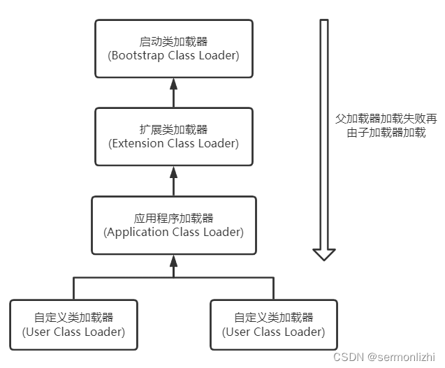
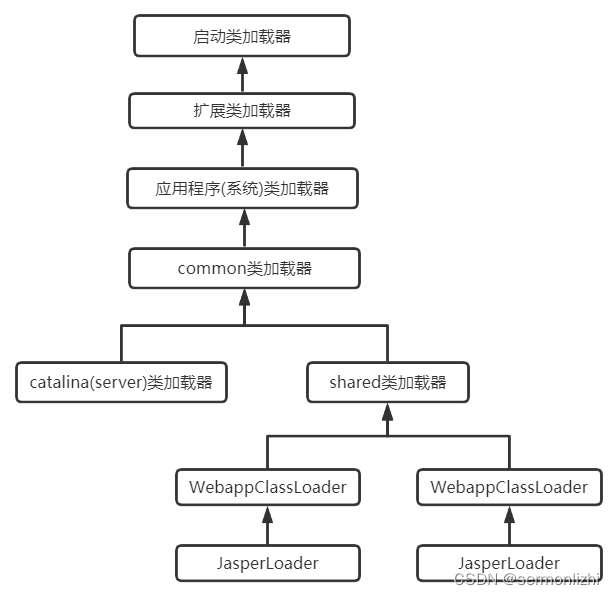

# 第01节 JVM类加载机制

在Java中，通常会说万物皆是对象，即便是一个编译后的.class文件，它也需要变成一个对象，才能在Java中使用，
而将.class文件变成对象的过程就是【类加载机制】。

这篇文章主要介绍Java的类加载机制的原理，包括常用的类加载器和设计原理。

## 一、类加载过程
以下面的简单程序为例：
```java
public class ClassLoadTest {
    public static void main(String[] args) {
        System.out.println("Hello Word");
    }
}
```
当通过Java命令运行该类的main()方法启动程序时，首先需要通过类加载器将ClassLoadTest.class主类文件加载进JVM。

Java中任何一个类都需要通过 类加载器 加载完成后才能创建该类的实例，类加载都是由loadClass()方法完成，其中加载过程分为如下几步：
**加载 >> 验证 >> 准备 >> 解析 >> 初始化 >> 使用 >> 卸载**
```text
加载：在磁盘上查找编译后的【.class文件】，并通过IO【写进内存】。
    只有当某个类被使用时才会加载(懒加载)，比如调用该类的main()方法或者new对象等。
    在加载阶段会生成一个该类的java.lang.Class对象，作为方法区各种数据(比如方法等类元信息)的访问入口。
    (注：每一个类被加载时，其实JVM内部会生成两个Klass对象，InstanceKlass和MateInstanceKlass，
    前者是在堆区，主要包含一些静态属性；后者是在方法区，包含类元信息)

验证：校验【字节码文件】的正确性。

准备：给类的【静态变量】【分配内存】，并【赋予默认值】。

解析：将【符号引用】替换为【直接引用】，
    该阶段会把一些静态方法(比如main())替换为指向数据所在内存的指针或句柄等(直接引用)，这个过程称为静态链接(类加载期间完成)。
    而动态链接是在程序运行过程中将符号引用转换为直接引用。

    符号引用可以简单理解为一个类中定义的属性和方法等的字面量，也就是方法名、属性名等这些，而直接引用就是方法或者属性对应的在内存中的地址。
    每个.class文件都有一个常量池，这些常量池里面存放的就是各种符号引用。
    常量池又分为静态常量池和运行时常量池，常量池在磁盘上存放着时就是静态常量池，将静态常量池加载进内存中(方法区)就变成了运行时常量池，
    程序运行的过程中可以将新的常量放入到运行时常量池中。
    
    可以通过下面的命令查看.class文件对应的静态常量池：
        javap -verbose ClassLoadTest.class
        
初始化：给类的【静态变量】【初始化】为指定的值，执行【静态代码块】。
```

类被加载到方法区之后主要包含：运行时常量池、类型信息、字段信息、方法信息、类加载器引用、对应Class实例的引用等信息。

**类加载器引用**：该类指向类加载器实例的引用。

**对应Class实例引用**：类加载器在加载类信息放到方法区中后，会创建一个对应的Class 类型的对象实例放到堆(Heap)中，
  作为访问方法区中类定义的入口和切入点，该Class实例与加载过程中提到的InstanceKlass对象是对应的。

注意：类在使用过程中是逐步加载的，Jar包或War包中的类并不是一次性全部加载，而是使用到时才加载。

## 二、类加载器与双亲委派机制

### 2.1 类加载器
上面已经提到了类加载的过程是由类加载器来完成，Java内部提供了几种类加载器：
```text
1) 启动类加载器(Bootstrap Class Loader)
    负责加载存放在【JRE的lib目录下的核心类库】，比如rt.jar、charsets.jar等，该加载器实例是通过JVM底层的C++代码创建的，
    所有Java程序中如果想打印该加载器实例时，返回的是Null。

2) 扩展类加载器(Extension Class Loader)
    该类加载器是在sun.misc.Launcher$ExtClassLoader内部通过Java代码实现的。
    主要负责加载存在在【JRE的lib/ext目录】下的JAR包以及通过【java.ext.dirs系统变量】指定的路径中的JAR包。

3) 应用程序类加载器(Application Class Loader)
    该类加载器与扩展类加载器一样，是在sun.misc.Launcher$AppClassLoader内部通过Java代码实现，
    主要负责加载【ClassPath路径】下的所有JAR包。
```
除了上面Java内部提供的三种类加载器，开发人员还可以通过【自定义类加载器】来进行扩展。

可以通过下面的程序查看对应的类加载器实例：
```text
public class ClassLoadTest {

    public static void main(String[] args) {
        System.out.println(String.class.getClassLoader());
        System.out.println(DNSNameService.class.getClassLoader());
        System.out.println(ClassLoadTest.class.getClassLoader());
    }
}
```
控制台输出：
```text
F:\JDK\jdk1.8.0_301\bin\java.exe ...
null
sun.misc.Launcher$ExtClassLoader@7229724f
sun.misc.Launcher$AppClassLoader@18b4aac2
```

输出结果与上面介绍的一样，启动类加载器的实例是C++的实例对象，所以输出null，而扩展类加载器和应用程序类加载器则是由JVM创建的。

在sun.misc.Launcher中，会记录应用类加载器的实例作为loader属性的引用，而在ClassLoader类中，它的getSystemClassLoader()返回的就是Lacuncher类中静态属性AppClassLoader的实例。所以应用程序类加载器通常也称作系统类加载器。

### 2.2 类加载器初始化过程
在第一部分类加载过程中看到了在创建完JVM后，会有底层C++代码创建引导类加载器的实例，
然后再由引导类加载器创建JVM启动器实例sun.misc.Launcher。

Launcher类的核心代码如下，初始化的时候会调用Launcher的构造方法，而构造方法内部则分别创建了扩展类加载器实例和应用程序类加载器实例。
```text
public class Launcher {
    private static URLStreamHandlerFactory factory = new Launcher.Factory();
    private static Launcher launcher = new Launcher();
    private static String bootClassPath = System.getProperty("sun.boot.class.path");
    private ClassLoader loader;
    private static URLStreamHandler fileHandler;

    public static Launcher getLauncher() {
        return launcher;
    }

    public Launcher() {
        Launcher.ExtClassLoader var1;
        try {
            // 创建扩展类加载器实例
            var1 = Launcher.ExtClassLoader.getExtClassLoader();
        } catch (IOException var10) {
            throw new InternalError("Could not create extension class loader", var10);
        }

        try {
            // 创建系统类加载器实例,其中扩展类加载器实例为入参
            this.loader = Launcher.AppClassLoader.getAppClassLoader(var1);
        } catch (IOException var9) {
            throw new InternalError("Could not create application class loader", var9);
        }
    }
}
```

扩展类加载器和系统类加载器都继承了ClassLoader类，
所以ExtClassLoader.getExtClassLoader()会先去调用ClassLoader(Void unused, ClassLoader parent)构造方法，
这里面第一行代码就是把扩展类加载器的实例作为系统类加载器实例的【父类加载器】。这也是后面要介绍的类加载器双亲委派机制的前提。
```text
private ClassLoader(Void unused, ClassLoader parent) {
  this.parent = parent;
  ……
}
```

### 2.3 双亲委派机制
Java中类加载器之间的关系通过双亲委派机制来保证，下图展示了双亲委派模型：


【双亲委派机制】确保在加载每个类时，由当前的类加载器委派给它的父(上层)类加载器加载，依次类推直到启动类加载器，
如果启动类加载器在加载的路径下找不到目标类，则再交给子(下层)类加载器加载，
同样依次类推，如果所有的父加载器都找不到目标类，则在当前类加载器的路径中查找并加载目标类。

简单来说就是【**父加载器优先加载，父加载器无法加载再由子加载器加载**】。

双亲委派机制实现起来也很简单，源码如下：
```text
protected Class<?> loadClass(String name, boolean resolve) throws ClassNotFoundException {
    synchronized (getClassLoadingLock(name)) {
        // 首先检查当前类是否已经被加载,这是一个本地方法,已经加载的类会在JVM的一个Hash结构中
        Class<?> c = findLoadedClass(name);
        if (c == null) {
            long t0 = System.nanoTime();
            try {
                if (parent != null) {
                    // 如果有父加载器,就递归委托给父加载器来加载
                    c = parent.loadClass(name, false);
                } else {
                    // 没有父加载器就交给启动类加载器加载,这个地方其实也不是直接让启动类加载器来加载
                    // 而是在启动类加载器加载的类中找是否有当前类
                    c = findBootstrapClassOrNull(name);
                }
            } catch (ClassNotFoundException e) {
                // ClassNotFoundException thrown if class not found
                // from the non-null parent class loader
            }

            // 如果该父类加载器找不到该类，就调用下面的findClass方法
            if (c == null) {
                // If still not found, then invoke findClass in order
                // to find the class.
                long t1 = System.nanoTime();
                // 都会调用URLClassLoader的findClass方法在加载器的类路径里查找并加载该类
                c = findClass(name);

                // this is the defining class loader; record the stats
                sun.misc.PerfCounter.getParentDelegationTime().addTime(t1 - t0);
                sun.misc.PerfCounter.getFindClassTime().addElapsedTimeFrom(t1);
                sun.misc.PerfCounter.getFindClasses().increment();
            }
        }
        if (resolve) {
            resolveClass(c);
        }
        return c;
    }
}
```
**双亲委派机制的【好处】**：
```text
1) 沙箱安全机制：
    如果开发人员编写了一个同核心类库包和类名都相同的类，通过双亲委派机制，这样的类并不会加载(加载的是对应路径下的类)，
    可以防止核心API库被随意篡改。
2) 避免重复加载：
    父加载器已经加载过的类，无序子加载器再次加载，保证被加载类的唯一性。同一个类，被不同的类加载器加载，生成的Class实例是不同的。
```

除了双亲委派机制外，还有**全盘负责委托机制**，即：
```text
当一个ClassLoader装载一个类时，除非显示的使用另一个ClassLoader，否则该类所依赖和引用的类也都将由该ClassLoader进行装载。
```

### 三、自定义类加载器
在URLClassLoader中，findClass()方法最终都会调用到ClassLoader的defineClass()，如下所示：
```text
protected final Class<?> defineClass(String name, byte[] b, int off, int len) throws ClassFormatError {
    return defineClass(name, b, off, len, null);
}

protected final Class<?> defineClass(String name, byte[] b, int off, int len,
                                     ProtectionDomain protectionDomain) throws ClassFormatError {
    protectionDomain = preDefineClass(name, protectionDomain);
    String source = defineClassSourceLocation(protectionDomain);
    Class<?> c = defineClass1(name, b, off, len, protectionDomain, source);
    postDefineClass(c, protectionDomain);
    return c;
}
```
所以，对于我们自定义类加载器，只要能够得到String name, byte[] b, int off, int len这些参数即可，所以自定义的类加载器如下：
```text
/**
 * @author 李志
 */
@AllArgsConstructor
public class UserClassLoader extends ClassLoader {

    // 加载的路径
    private String classPath;

    private byte[] loadByte(String name) throws Exception {
        name = name.replaceAll("\\.", "/");
        FileInputStream fis = new FileInputStream(classPath + "/" + name + ".class");
        int len = fis.available();
        byte[] data = new byte[len];
        fis.read(data);
        fis.close();
        return data;
    }

    protected Class<?> findClass(String name) throws ClassNotFoundException {
        try {
            byte[] data = loadByte(name);
            // defineClass将一个字节数组转为Class对象，这个字节数组是class文件读取后最终的字节数组。
            return defineClass(name, data, 0, data.length);
        } catch (Exception e) {
            e.printStackTrace();
            throw new ClassNotFoundException();
        }
    }
}
```

## 四、Tomcat的类加载机制

### 4.1 打破双亲委派机制
双亲委派机制虽然好，但在有些场景中，双亲委派机制却又是一个大麻烦。比较突出的是Tomcat，
Tomcat作为一个Web容器，需要能够启动运行多个Web项目，但在这些多个Web项目中，如果都需要依赖某个JAR包，
但使用的版本却不同，如果仍然采用双亲委派机制来加载依赖包中的类，就会导致程序异常，于是就需要打破类加载的双亲委派机制。

简单来说，打破双亲委派机制的目的就是为了实现【类隔离】。

想要打破双亲委派机制，就需要自定义来实现类加载器，然后重写类加载器的loadClass()方法即可。代码如下：
```text
protected Class<?> loadClass(String name, boolean resolve) throws ClassNotFoundException {
    synchronized (getClassLoadingLock(name)) {
        // First, check if the class has already been loaded
        Class<?> c = findLoadedClass(name);
        if (c == null) {
            long t0 = System.nanoTime();
            long t1 = System.nanoTime();
            c = findClass(name);

            // this is the defining class loader; record the stats
            sun.misc.PerfCounter.getFindClassTime().addElapsedTimeFrom(t1);
            sun.misc.PerfCounter.getFindClasses().increment();
        }
        if (resolve) {
            resolveClass(c);
        }
        return c;
    }
}
```
直接去掉类加载器双亲委派的逻辑即可实现打破双亲委派机制。

### 4.2 Tomcat类加载

Tomcat作为多项目的Web容器，它需要解决下面几个问题：
```text
1、不同的应用程序可能会依赖同一个第三方类库的不同版本，不能要求同一个类库在同一个服务器只有一份，
    因此要保证每个应用程序的类库都是独立的，保证相互隔离。

2、同一个web容器中相同的类库相同的版本可以共享。否则，如果服务器有多个应用程序，那么要有多份相同的类库加载进虚拟机，这是非常浪费的。

3、web容器也有自己依赖的类库，不能与应用程序的类库混淆。基于安全考虑，应该让容器的类库和程序的类库隔离开来。

4、web容器要支持jsp的动态修改，jsp 文件最终也是要编译成class文件才能在虚拟机中运行，但程序运行后修改jsp已经是司空见惯的事情，
    web容器需要支持 jsp 修改后不用重启。
```
上面的这四个问题，如果【Tomcat类加载机制】仍然完全采用双亲委派机制就没法满足要求，所以Tomcat就采用【**局部**双亲委派机制】来实现。

Tomcat的类加载模型如下图：


其中commonLoader、catalinaLoader和sharedLoader都属于URLClassLoader的实例，只是它们负责加载的路径有所不同而已。
这三个类加载器是在Tomcat初始化的时候就加载的，可以在Tomcat的Bootstrap.initClassLoaders()方法中看到：
```text
private void initClassLoaders() {
    try {
        commonLoader = createClassLoader("common", null);
        if (commonLoader == null) {
            // no config file, default to this loader - we might be in a 'single' env.
            commonLoader = this.getClass().getClassLoader();
        }
        catalinaLoader = createClassLoader("server", commonLoader);
        sharedLoader = createClassLoader("shared", commonLoader);
    } catch (Throwable t) {
        handleThrowable(t);
        log.error("Class loader creation threw exception", t);
        System.exit(1);
    }
}
```

commonLoader、catalinaLoader、sharedLoader和WebappClassLoader（单独实现都是Tomcat自定义的类加载器，
它们分别加载/common、/server、/shared和/WebApp/WEB-INF/中的类库，其中WebApp类加载器和JSP类加载器通常会存在多个实例，
每一个Web应用程序对应一个WebApp类加载器，每一个JSP文件对应一个Jsp类加载器。

这几个类加载器之间的可见性如下：
```text
commonLoader：
    Tomcat最基本的类加载器，加载路径中的class可以被Tomcat容器和其他Web应用程序访问
catalinaLoader：
    Tomcat容器私有的类加载器，加载路径的class对Webapp不可见
sharedLoader：
    各个应用程序共享的类加载器，加载路径中的class对于所有应用程序可见，但是对于Tomcat容器不可见
WebappClassLoader：
    每个应用程序私有的类加载器，加载路径中的class只对当前应用程序可见，
    比如加载war包里相关的类，每个war包应用都有自己的WebappClassLoader，实现相互隔离，
    比如不同war包应用引入了不同的spring版本，这样实现就能加载各自的spring版本
```
从上面图中的委派关系可以看出：
```text
commonLoader加载的类都可以被catalinaLoader和sharedLoader使用，从而实现了公共类库的公用，
而catalinaLoader和sharedLoader加载的类则相互隔离，保证了Web容器与Web应用的隔离。

WebAppClassLoader可以使用sharedLoader加载到的类，但各个WebAppClassLoader实例之间相互隔离。

而JasperLoader的加载范围仅仅是一个JSP文件所编译出来.Class文件，它的目的就是为了：

当Web容器检测到JSP文件被修改时，会替换掉目前的JasperLoader的实例，并通过再建立一个新的JSP类加载器来实现JSP文件的热加载功能。
```

上面介绍了这么多，那Tomcat到底是怎么打破双亲委派模型的呢？

简单来说，就是每个webappClassLoader只负责加载自己程序目录下的class文件，不会传递给父类加载器，如果不是应用程序自身的class文件，
仍然还是会走双亲委派机制的。

具体的实现过程可以看WebappClassLoader.loadClass()，WebappClassLoader继承自WebappClassLoaderBase，
而WebappClassLoaderBase又继承自URLClassLoader，WebappClassLoaderBase类重写了loadClass()方法，该方法的执行流程如下：
```text
1、先从WebappClassLoader的缓存里面查找该类是否已经被加载过
(被WebappClassLoader加载的类会放在其内部resourceEntries中，这是一个ConcurrentHashMap结构的缓存)。

2、如果WebappClassLoader缓存没有，再看JVM提供的类加载器是否加载过。

3、如果都没有，则尝试让ExtClassLoader去加载，目的防止 Web 应用自己的类覆盖 JRE 的核心类。
    注：这里就打破了双亲委派机制，并不是由WebappClassLoader的父加载器来加载，而是直接交由ExtClassLoader来加载，
    ExtClassLoader加载时依然是局部采用双亲委派机制，ExtClassLoader加载不了的类会交由BootstrapClassLoader来加载，
    都不能加载就返回null。

    至于为什么是ExtClassLoader来加载，可以去看WebappClassLoaderBase()构造方法里面是如何给javaseClassLoader属性赋值的。

4、如果 ExtClassLoader 加载器加载失败，也就是说 JRE 核心类中没有这类。此时如果开启了双亲委派机制，
    则直接通过Class.forName()交给父加载器来加载。

    Tomcat8以上版本，可以通过<Loader delegate="true"/>来开启双亲委派机制进行加载。如果多个应用程序的依赖包版本都是一样，
    那么就完全没有必要进行隔离了，可以通过开启双亲委派机制保证唯一性(只加载一个)。

5、如果没有开启双亲委派机制，则尝试在当前Web应用目录下查找并由WebappClassLoader加载该类。

6、如果当前Web目录下没有这个类，说明不是 Web 应用自己定义的类，那么由系统类加载器去加载。
    Web 应用是通过Class.forName(name, false, parent)调用交给系统类加载器的，因为Class.forName的默认加载器就是系统类加载器。

7、如果上述加载过程全部失败，抛出 ClassNotFound 异常
```
