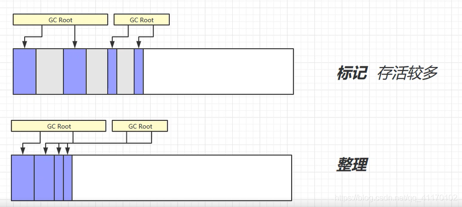

# 第02节 JVM内存结构和Java内存模型

JVM内存结构和Java内存模型都是面试的热点问题，名字看感觉都差不多，网上有些博客也都把这两个概念混着用，实际上他们之间差别还是挺大的。
通俗点说，【JVM内存结构】是与【JVM的内部存储结构】相关，而【Java内存模型】是与【多线程编程】相关，本文针对这两个总是被混用的概念展开讲解。

## 一、JVM内存结构
### JVM构成
说到JVM内存结构，就不会只是说内存结构的5个分区，而是会延展到整个JVM相关的问题，所以先了解下JVM的构成。


Java类被加载到类后的运行流程概述：
```text
1) Java源代码编译成Java Class文件后通过类加载器ClassLoader加载到JVM中
2) 类存放在方法区中
3) 类创建的对象存放在堆中
4) 堆中对象的调用方法时会使用到虚拟机栈，本地方法栈，程序计数器
5) 方法执行时每行代码由解释器逐行执行
6) 热点代码由JIT编译器即时编译
7) 垃圾回收机制回收堆中资源
8) 和操作系统打交道需要调用本地方法接口
```

### JVM内存结构

#### 程序计数器

程序计数器 通过移位寄存器实现。
程序计数器是 线程私有 的，每个线程单独持有一个程序计数器，用来储存当前执行指令的地址。
程序计数器 不会内存溢出。

#### 虚拟机栈
栈：线程运行需要的内存空间。

栈帧：每一个方法运行需要的内存（包括参数，局部变量，返回地址等信息）。

每个线程只有一 个活动栈帧（栈顶的栈帧），对应着正在执行的代码。

常见问题解析：
```text
1) 垃圾回收是否涉及栈内存？
    不涉及，垃圾回收只涉及堆内存。

2) 栈内存分配越大越好吗？
    内存一定时，栈内存越大，线程数就越少，所以不应该过大。

3) 方法内的局部变量是否是线程安全的？
      普通局部变量是安全的
      静态的局部变量是不安全的
      对象类型的局部变量被返回了是不安全的
      基本数据类型局部变量被返回时安全的
      参数传入对象类型变量是不安全的
      参数传入基本数据类型变量时安全的

4) 栈内存溢出（StackOverflowError）
      栈帧过多:
        如递归调用没有正确设置结束条件
      栈帧过大:
        json数据转换 对象嵌套对象 （用户类有部门类属性，部门类由用户类属性）
      线程运行诊断:
         CPU占用过高（定位问题）:
            'top'命令获取进程编号，查找占用高的进程
            'ps H -eo pid,tid,%cpu | grep 进程号' 命令获取线程的进程id，线程id，cpu占用
            将查看到的占用高的线程的线程号转化成16进制的数 ：如6626->19E2
            'jstack 进程id' 获取进程栈信息, 查找‘nid=0X19E2’的线程
            问题线程的最开始‘#数字’表示出现问题的行数，回到代码查看
         
         程序运行很长时间没有结果（死锁问题）:
            'jstack 进程id' 获取进程栈信息
            查看最后20行左右有无'Fount one Java-level deadlock'
            查看下面的死锁的详细信息描述和问题定位
            回到代码中定位代码进行解决
```

#### 本地方法栈
本地方法栈为虚拟机使用到的Native方法服务，
Native方法是Java通过JNI直接调用本地C/C++库，
可以认为是Native方法相当于C/C++暴露给Java的一个接口，如notify，hashcode，wait等都是native方法。

#### 堆
通过new关键字创建的对象都会使用堆内存，堆是线程共享的，有垃圾回收机制。
   
堆内存溢出（OutOfMemoryError）
   死循环创建对象

堆内存诊断：
   命令行方式：
      'jps'获取运行进程号
      'jmap -heap 进程号'查看当前时刻的堆内存信息
   jconsole：
      命令行输入jconsole打开可视化的界面连接上进程
      可视化的检测连续的堆内存信息
   jvisualvm：
      命令行输入jvisualvm打开可视化界面选择进程
      可视化的查看堆内存信息

#### 方法区
方法区只是一种概念上的规范，具体的实现各种虚拟机和不同版本不相同。
```text
HotSpot1.6 使用永久代作为方法区的实现
HotSpot1.8使用本地内存的元空间作为方法区的实现（但StringTable还是放在堆中）
```


常见问题：
```text
1) StringTable特性：
   常量池中的字符串仅是字符，第一次使用时才变为对象
   利用串池机制，避免重复创建字符串
   字符串常量拼接原理是StringBuilder（1.8）
   字符串常量拼接原理是编译器优化
   StringTable在1.6中存放在永久代，在1.8中存放在堆空间
   intern方法主动将串池中没有的字符串对象放入串池
      1.8中：尝试放入串池，如果有就不放入，只返回一个引用；如果没有就放入串池，同时返回常量池中对象引用
      1.6中：尝试放入串池，如果有就不放入，只返回一个引用；如果没有就复制一个放进去（本身不放入），同时返回常量池中的对象引用
      字符串常量池分析（1.8环境）
         String s1 = "a";
         String s2 = "b";
         String s3 = "a"+"b";
         String s4 = s1+s2;
         String s5 = "ab";
         String s6 = s4.intern();
         
         System.out.println(s3==s4);// s3在常量池中，s4在堆上（intern尝试s4放入常量池，因为ab存在了就拒绝放入返回ab引用给s6，s4还是堆上的）
         System.out.println(s3==s5);// s3在常量池中，s4也在常量池中（字符串编译期优化）
         System.out.println(s3==s6);// s3在常量池中，s6是s4的intern返回常量池中ab的引用，所以也在常量池中

         String x2 = new String("c")+new String("d");
         String x1 = "cd";
         x2.intern();
         System.out.println(x1==x2);//x2调用intern尝试放入常量池，但常量池中已经有cd了，所以只是返回一个cd的引用，而x2还是堆上的引用

2) JVM调优三大参数（如： java -Xms128m -Xmx128m -Xss256k -jar xxxx.jar）
   -Xss：规定了每个线程虚拟机栈的大小（影响并发线程数大小）
   -Xms：堆大小的初始值（超过初始值会扩容到最大值）
   -Xmx：堆大小的最大值（通常初始值和最大值一样，因为扩容会导致内存抖动，影响程序运行稳定性）

3) JVM内存结构中堆和栈的区别：
   管理方式：栈自动释放，堆需要GC
   空间大小：栈比堆小
   碎片：栈产生的碎片远少于堆
   分配方式：栈支持静态分配和动态分配，堆只支持动态分配
   效率：栈的效率比堆高
```

### GC垃圾回收机制
#### 1. 垃圾判别方法
引用计数算法：
```text
判断对象的引用数量来决定对象是否可以被回收

每个对象实例都有一个引用计数器，被引用则+1，完成引用则-1

优点：执行效率高，程序执行受影响小

缺点：无法检测出循环引用的情况，导致内存泄露
```

可达性分析算法：
```text
Java虚拟机中的垃圾回收器采用可达性分析来探索所有存活对象

扫描堆中的对象，看是否能沿着GC Root对象为起点的引用链找到该对象，找不到则可以回收

哪些对象可以作为GC Root

通过System Class Loader或者Boot Class Loader加载的class对象，通过自定义类加载器加载的class不一定是GC Root
```
注：哪些对象可以作为GC Root对象？
```text
1) 虚拟机栈中的引用的对象，
2) 本地方法栈中JNI（native方法）的引用的对象，
3) 方法区中的常量引用的对象，
4) 方法区中的类静态属性引用的对象，
5) 处于激活状态的线程，
6) 正在被用于同步的各种锁对象，
7) GC保留的对象，比如系统类加载器等。
```

#### 2. 垃圾回收算法

**标记清除法**：
```text
标记没有被GC Root引用的对象，清除被标记位置的内存。

优点：处理速度快
缺点：造成空间不连续，产生内存碎片
```


**标记整理法**：
```text
标记没有被GC Root引用的对象，整理被引用的对象。

优点：空间连续，没有内存碎片
缺点：整理导致效率较低
```


**复制算法**：
```text
分配同等大小的内存空间，标记被GC Root引用的对象，将引用的对象连续的复制到新的内存空间，清除原来的内存空间，交换FROM空间和TO空间。

优点：空间连续，没有内存碎片
缺点：占用双倍的内存空间
```


#### 3. 分代垃圾回收机制
**分代垃圾回收流程**：

```text
1) 对象首先分配在Eden伊甸园区域。
2) 【新生代空间不足】时，触发【Minor GC】，Eden伊甸园区和from survivor区存活的对象使用【复制算法】复制到to survivor区中，
    存活的对象年龄加一，并且交换from survivor区和to survivor区。
3) Minor GC会引发Stop the world（STW）现象，暂停其他用户的线程。垃圾回收结束后，用户线程才恢复运行。
4) 当对象寿命超过阈值时，会晋升至老年代，最大寿命是15（4位二进制）。
5) 当【老年代空间不足】，会先尝试触发【Minor GC】，如果之后空间仍不足，会触发【Full GC】(STW时间更长，老年代可能使用标签清除或标记整理算法)。
6) 当存放大对象新生代放不下而老年代可以放下，大文件会直接晋升到老年代。
7) 当存放大对象【新生代和老年代都放不下】时，抛出【OOM】异常。
```

**默认堆内存分配**：

```text
1) 新生代占1/3，老年代占2/3
2) -XX:NewRatio：老年代和年轻代内存大小的比例
3) 新生代中按8:1:1进行分配，两个幸存区大小需要保持一致
4) -XX:SurvivorRatio: Eden和Survivor的比值，默认是8（8:1）
```

**GC相关VM参数**：


#### 4. 垃圾回收器
##### 安全点（SafePoint）
```text
分析过程中【对象引用关系】不会发生改变的点。

产生安全点的地方：
    方法调用
    循环跳转
    异常跳转

安全点的数量应该设置适中。
```

##### 串行（SerialGC）

是单线程的垃圾回收器，堆内存较小，CPU核数少，适合个人电脑。

SerialGC收集器 （-XX:+UseSerialGC 复制算法） Client模式下默认的年轻代收集器。

SerialGC Old收集器 （-XX:+UseSerialOldGC 标记-整理算法）Client模式下默认的老年代收集器。


##### 吞吐量优先(ParallelGC)
是多线程的垃圾回收器，堆内存较大，多核CPU，适合服务器。
在发生gc时，尽可能让单位时间内STW暂停时间最短(吞吐量 = 运行代码时间 / (运行代码时间+垃圾回收时间) )，并行GC执行。

ParallelGC收集器（-XX:+UseParallelGC 复制算法） Server模式下默认的年轻代垃圾回收器。

ParallelGC Old收集器（-XX:+UseParallelOldGC 复制算法）。


##### 响应时间优先(CMS -XX:+UseConcMarkSweepGC 标记清除算法)
是多线程的垃圾回收器，堆内存较大，多核CPU，Server模式下默认的老年代垃圾回收器。
发生gc时，尽可能让单次STW暂停时间最短，部分时期内可以并发执行。

**执行流程**：
```text
初始标记：stop-the-world
并发标记：并发追溯标记，程序不会停顿
并发预清理：查找执行并发标记阶段从年轻代晋升到老年代的对象
重新标记：暂停虚拟机，扫描CMS堆中的剩余对象
并发清理：清理垃圾对象，程序不会停顿
并发重置：重置CMS收集器的数据结构
```


##### G1（-XX:+UseG1GC 复制+标记清除算法）

**G1垃圾回收器简介**
```text
定义：Garbage First （2017 jdk9 默认）

特点：
    并发和并行
    分代收集
    空间整合
    可预测的停顿

使用场景：
    同时注重吞吐量和低延迟，【默认暂停目标】是200ms
    【超大堆内存】，会将整个堆划分为多个大小相等的Region（新生代和老年代不再物理隔离了）
    整体上是【标记整理算法】，两个区域之间是【复制算法】
```

##### 垃圾回收阶段
```text
1) 新生代垃圾收集：
    会发生STW
    
2) 新生代垃圾收集 + 并发标记：
    在Young GC时会进行GC Root的初始标记
    老年代占用堆内存空间比例达到阈值时，进行并发标记（不会STW）

3) 混合收集，对新生代，幸存区和老年代都进行收集：
    最终标记，会STW
    拷贝存活，会STW
    三种阶段循环交替
```


##### Full GC
```text
SerialGC：
    新生代内存不足发生的垃圾收集：minor GC
    老年代内存不足发生的垃圾收集：full GC

ParallelGC：
    新生代内存不足发生的垃圾收集：minor GC
    老年代内存不足发生的垃圾收集：full GC
    
CMS：
    新生代内存不足发生的垃圾收集：minor GC
    老年代内存不足：
        并发收集成功：并发的垃圾收集
        并发收集失败：串行的full GC
        
G1：
    新生代内存不足发生的垃圾收集：minor GC
    老年代内存不足，达到阈值时进入并发标记和混合收集阶段：
        如果 回收速度 > 新产生垃圾的速度：并发垃圾收集
        如果 回收速度 < 新产生垃圾的速度：串行的full GC
```

#### 5. 四种引用

```text
强引用：
    最常见的对象：通过new关键字创建，通过GC Root能找到的对象。
    当所有的GC Root都不通过【强引用】引用该对象时，对象才能被垃圾回收

软引用：
    仅有【软引用】引用该对象时，在垃圾回收后，内存仍不足时会再次发起垃圾回收，回收软引用对象
    可以配合引用队列来释放软引用自身
    创建一个软引用：SoftReference ref = new SoftReference<>(new Object());
    软引用被回收后，仍然还保留一个null，如将软引用加入集合，回收后遍历集合仍然还存在一个null
        解决：使用引用队列，软引用关联的对象被回收时，软引用自身会被加入到引用队列中，通过queue.poll()取得对象进行删除
        创建一个而引用队列：ReferenceQueue queue = new ReferenceQueue<>();
        创建加入了引用队列的软引用：SoftReference ref = new SoftReference<>(new Object(),queue);

弱引用：
    仅有【弱引用】引用该对象时，在垃圾回收时，无论内存是否充足，都会回收弱引用对象
    可以配合引用队列来释放弱引用自身
    创建一个弱引用：WeakReference ref = new WeakReference<>(new Object());
    引用队列使用同软引用

虚引用：
    必须配合引用队列使用，主要配合ByteBuffer使用，被引用对象回收时，会将【虚引用】入队，
    由Reference Handler线程调用虚引用相关方法释放【直接内存】（unsafe类中方法）.

终结器引用：
    无需手动编码，但其内部配合引用队列使用，在垃圾回收时，终结器引用队列入队（引用对象暂未回收），
    再由Finalizer线程通过终结器引用找到被引用对象并调用他的finalize方法，第二次gc时回收被引用对象。
```

### 类加载

#### 类加载器的分类


#### 类加载过程


**加载**：
```text
通过ClassLoader加载Class文件字节码，生成Class对象
```
**链接**：
```text
校验：检查加载的的Class的正确性和安全性
准备：为【类变量】分配【存储空间】并设置类变量【初始值】
解析：JVM将常量池内的【符号引用】转换为【直接引用】
```
**初始化**：
```text
执行类变量【赋值】和【静态代码块】
```

#### LoadClass和forName的区别
```text
Class.forName得到的class是已经初始化完成的
ClassLoader.loadClass得到的class是还没有链接的
```

#### 双亲委派机制


##### 什么是双亲委派机制？
```text
当某个类加载器需要加载某个.class文件时，它首先把这个任务委托给他的上级类加载器，
递归这个操作，如果上级的类加载器没有加载，自己才会去加载这个类。
```

##### 为什么要使用双亲委派机？
```text
1) 防止重复加载同一个.class文件，通过委托去向上级问，加载过了就不用加载了。
2) 保证核心.class文件不会被串改，即使篡改也不会加载，即使加载也不会是同一个对象，
因为不同加载器加载同一个.class文件也不是同一个class对象，从而保证了class执行安全。
```

#### 自定义类加载器
需求场景：
```text
想要加载非classpath的随意路径的类文件
通过接口来使用实现，希望解耦合
```
步骤：
```text
继承Classloader父类
遵循双亲委派机制，重写findClass方法（不能重写loadClass，重写了就不符合双亲委派了）
读取类的字节码
调用父类的defineClass方法加载类
使用者调用类加载的loadClass方法
```
案例演示：

I) 创建自定义类加载器：
```text
public class MyClassLoader extends ClassLoader {
    private String path;
    private String classLoaderName;

    public MyClassLoader(String path, String classLoaderName) {
        this.path = path;
        this.classLoaderName = classLoaderName;
    }

    //用于寻找类文件
    @Override
    public Class findClass(String name) {
        byte[] b = loadClassData(name);
        return defineClass(name, b, 0, b.length);
    }


    //用于加载类文件
    private byte[] loadClassData(String name) {
        name = path + name + ".class";

        try (InputStream in = new FileInputStream(new File(name));
             ByteArrayOutputStream out = new ByteArrayOutputStream();) {
            int i = 0;
            while ((i = in.read()) != -1) {
                out.write(i);
            }
            return out.toByteArray();
        } catch (Exception e) {
            e.printStackTrace();
        }
        return null;
    }
}
```
II) 调用自定义类加载器加载类
```text
public class MyClassLoaderChecker {
    public static void main(String[] args) throws IllegalAccessException, InstantiationException, ClassNotFoundException {
        MyClassLoader m = new MyClassLoader("C:\\Users\\73787\\Desktop\\","myClassLoader");
        Class<?> c = m.loadClass("Robot");
        System.out.println(c.getClassLoader());
        c.newInstance();
    }
}
```

### 反射机制
#### 反射的定义
JAVA反射机制是在【运行状态】中，
对于任意一个类，都能够知道这个类的所有属性和方法；
对于任意一个对象，都能够调用它的任意方法和属性；
这种【动态获取类信息】以及【动态调用对象方法】的功能称为【java语言的反射机制】。

#### 反射的常用场景
第三方应用开发过程中，会需要某个类的某个成员变量、方法或是属性是私有的或者只对系统应用开放，
就可以通过Java的反射机制来获取所需的私有成员或者方法。

#### 反射相关的类


##### 案例：
定义一个Robot类
```text
public class Robot {
    // 私有属性
    private String name;
    
    // 公有方法
    public void sayHi(String hello){
        System.out.println(hello + " " + name);
    }
    
    // 私有方法
    private String throwHello(String tag){
        return "hello " + tag;
    }
}
```
编写一个反射应用类，针对私有的属性和方法必须设置setAccessible(true)才能进行访问
```text
public class ReflectSample {
    public static void main(String[] args) throws ClassNotFoundException, IllegalAccessException, InstantiationException, NoSuchMethodException, InvocationTargetException, NoSuchFieldException {
        // 加载类
        Class<?> rc = Class.forName("com.example.Robot");
        // 获取类实例
        Robot r = (Robot)rc.newInstance();
        //打印类名
        System.out.println(rc.getName());

        // 加载一个私有方法
        Method getHello = rc.getDeclaredMethod("throwHello",String.class);
        getHello.setAccessible(true);
        Object bob = getHello.invoke(r, "bob");
        System.out.println(bob);
       
        // 加载一个公有方法
        Method sayHi = rc.getMethod("sayHi",String.class);
        Object welcome = sayHi.invoke(r,"welcome");
       
        // 加载一个私有属性
        Field name = rc.getDeclaredField("name");
        name.setAccessible(true);
        name.set(r,"tom");
        sayHi.invoke(r,"welcome");
    }
}
```

## 二、Java内存模型

### 什么是Java内存模型（JMM）
通俗来说，JMM是一套【多线程】读写【共享数据】时，对数据的可见性，有序性和原子性的规则。

### 为什么会有Java内存模型
JVM实现不同会造成‘翻译’的效果不同，不同CPU平台的机器指令有千差万别，无法保证同一份代码并发下的效果一致。
所以需要一套统一的规范来约束JVM的翻译过程，保证并发效果一致性。

### 原子性

#### 什么是原子性
原子性指一系列的操作，要么全部执行成功，要么全部不执行，不会出现执行一半的情况，是不可分的。

#### 原子性怎么实现
```text
1) 使用synchronized或Lock加锁实现，保证任一时刻只有一个线程访问该代码块
2) 使用原子操作
```

#### Java中的原子操作有哪些
```text
1) 除long和double之外的基本类型的赋值操作（64位值，当成两次32位的进行操作）
2) 所有引用reference的赋值操作
3) java.concurrent.Atomic.*包中所有类的原子操作
```

#### 创建对象的过程是否是原子操作（常应用于双重检查 + volatile创建单例场景）
创建对象实际上有3个步骤，并不是原子性的
```text
1) 创建一个空对象
2) 调用构造方法
3) 创建好的实例赋值给引用
```

### 可见性

#### 什么是可见性问题
可见性指的是当一个线程修改了某个共享变量的值，其他线程是否能够马上得知这个修改的值。

#### 为什么会有可见性问题、
对于单线程程序来说，可见性是不存在的，因为我们在任何一个操作中修改了某个变量的值，后续的操作中都能读取这个变量值，并且是修改过的新值。

对于多线程程序而言，由于线程对共享变量的操作都是线程拷贝到各自的工作内存进行操作后才写回到主内存中的，
这就可能存在一个线程A修改了共享变量x的值，还未写回主内存时，另外一个线程B又对主内存中同一个共享变量x进行操作，
但此时A线程工作内存中共享变量x对线程B来说并不可见，这种【工作内存】与【主内存】【同步延迟现象】就造成了【可见性问题】。

#### 如何解决可见性问题
```text
解决方法1：
    加【volatile】关键字保证可见性。
    当一个共享变量被volatile修饰时，它会保证修改的值立即被其他的线程看到，
    即修改的值立即更新到主存中，当其他线程需要读取时，它会去内存中读取新值。
    
解决方法2：
    使用synchronized和Lock保证可见性。
    因为它们可以保证任一时刻只有一个线程能访问共享资源，并在其释放锁之前将修改的变量刷新到内存中。
```
案例：
```text
  public class FieldVisibility {
      int a = 1;
      int b = 2;

      private void change() {
          a = 3;
          b = a;
      }
      
      private void print() {
        System.out.println("b=" + b + ";a=" + a);
      }
      
      public static void main(String[] args) {
          while (true) {
              FieldVisibility test = new FieldVisibility();
              // 线程1
              new Thread(new Runnable() {
                  @Override
                  public void run() {
                      try {
                        Thread.sleep(1);
                      } catch (InterruptedException e) {
                        e.printStackTrace();
                      }
                      test.change();
                  }
              }).start();
              // 线程2
              new Thread(new Runnable() {
                  @Override
                  public void run() {
                      try {
                        Thread.sleep(1);
                      } catch (InterruptedException e) {
                          e.printStackTrace();
                      }
                      test.print();
                  }
              }).start();
          }
      }
  }
```
循环创建两类线程，一个线程用于做值的交换，一个线程用于打印值。

比较直观的三种结果：
```text
打印线程先执行：b = 2, a = 1
交换线程先执行：b = 3, a = 3
交换线程执行到一半就切出去打印了，只执行了a=3赋值操作：b = 2 , a =3
```
实际上除了很容易想到的三种情况外还有一种特殊情况：b = 3 , a = 1。

这种情况就是可见性问题。

a的值在线程1（执行交换线程）的本地缓存中进行了更新，但是并没有同步到共享缓存，
而b的值成功的更新到了共享缓存，导致线程2（执行打印线程）从共享缓存中获取到的数据并不是实时的最新数据。


### 有序性（重排序）

#### 什么是重排序
在线程内部的两行代码的实际执行顺序和代码在Java文件中的逻辑顺序不一致，
代码指令并不是严格按照代码语句顺序执行的，他们的顺序被改变了，这就是重排序。

#### 重排序的意义
JVM能根据处理器特性（CPU多级缓存系统、多核处理器等）适当的对机器指令进行重排序，使机器指令能更符合CPU的执行特性，最大限度的发挥机器性能。

案例
```text
计算：
a = 3;
b = 2;
a = a + 1;
重排序优化前的instructions

load a
set to 3
store 3

load b
set to 2
store b

load a
set to 4
store a

经过重排序处理后

load a
set to 3
set to 4
store a


load b
set to 2
store b

上述少了两个指令，优化了性能
```

重排序的3种情况：
```text
1) 【编译器优化】(JVM，JIT编辑器等)：编译器在不改变单线程程序语义放入前提下，可以重新安排语句的执行顺序。
2) 【指令级并行的重排序】：现代处理器采用了指令级并行技术来将多条指令重叠执行。
    如果不存在数据依赖性，处理器可以改变语句对应机器指令的执行顺序。
3) 【内存系统的重排序】：由于处理器使用缓存和读写缓冲区，这使得加载和存储操作看上去可能是在乱序执行。
```


### volatile

#### 什么是volatile
volatile是一种同步机制，比synchronized或者Lock相关类更轻量级，因为使用volatile并不会发生上下文切换等开销很大的行为。
volatile是无锁的，并且只能修饰单个属性。

#### 什么时候适合用volatile
一个共享变量始终只被各个线程赋值，没有其他操作。

作为刷新的触发器，引用刷新之后使修改内容对其他线程可见
（如CopyOnRightArrayList底层动态数组通过volatile修饰，保证修改完成后通过引用变化触发volatile刷新，使其他线程可见）。

#### volatile的作用
```text
可见性保障：
    修改一个volatile修饰变量之后，会立即将修改同步到主内存，使用一个volatile修饰的变量之前，会立即从主内存中刷新数据。
    保证读取的数据都是最新的，之前的修改都是可见的。
有序性保障（禁止指令重排序优化）：
    有volatile修饰的变量，赋值后多了一个“内存屏障“（指令重排序时不能把后面的指令重排序到内存屏障之前的位置）。
```

#### volatile的性能
volatile的读性能消耗与普通变量几乎相同，但是写操作稍慢，因为它需要在本地代码中插入许多【内存屏障】指令来保证处理器不发生乱序执行。

### happens-before规则

#### 产生背景：
多核环境下，存在指令重排序。happen-before是指有些情况【不能重排序的原则】。
```text
1) java存在线程工作内存及主内存（多核cpu及多级缓存导致），
    线程对变量的操作都是在工作内存中进行的，那么多线程的操作必然会导致共享数据的错乱。
2) 操作系统会对指令进行重排序，在多线程环境下，重排序会对线程的执行结果及执行顺序造成严重的影响。
```

#### 什么是happens-before规则：
happen-before 原则是作为java 内存模型(JMM)的一部分。
它规定了若A操作happen-before B操作，那么A操作对与B操作来说是可见的。
JVM在实现的时候就确保了是能够满足happen-before 原则的。
简而言之就是，前一个操作的结果 可以被 后续的操作获取。
```text
【程序的顺序性】规则：
    在一个线程内一段代码的执行结果是有序的。虽然还会指令重排，但是随便它怎么排，结果是按照我们代码的顺序生成的不会变！
    
【volatile】规则：
    如果一个线程先去写一个volatile变量，然后一个线程去读这个变量，那么这个写操作的结果一定对读的这个线程可见。
    
【传递性】规则：
    happens-before原则具有传递性，即A happens-before B ， B happens-before C，那么A happens-before C。
    
【管程锁定】规则：
    无论是在单线程环境还是多线程环境，对于同一个锁来说，一个线程对这个锁解锁之后，另一个线程获取了这个锁都能看到前一个线程的操作结果！
    (管程是一种通用的同步原语，synchronized就是管程的实现）
    对一个锁的解锁，happens-before于随后对这个锁的加锁。
    
【线程启动(start())】规则：
    在主线程A执行过程中，启动子线程B，那么线程A在启动子线程B之前对共享变量的修改结果对线程B可见。
    如果线程A执行操作ThreadB.start()（启动线程B），那么A线程的ThreadB.start()操作happens-before于线程B中的任意操作。
    
【线程终止(Join())】规则：
    在主线程A执行过程中，子线程B终止，那么线程B在终止之前对共享变量的修改结果在线程A中可见。
    如果线程A执行操作ThreadB.join()并成功返回，那么线程B中的任意操作happens-before于线程A从ThreadB.join()操作成功返回。
    
【线程中断(interrupt())】规则：
    对线程interrupt()方法的调用先行发生于被中断线程代码检测到中断事件的发生，可以通过Thread.interrupted()检测到是否发生中断。
    
【对象终结(finalize())】规则：
    一个对象的初始化的完成，也就是构造函数执行的结束一定 happens-before它的finalize()方法。
```
#### JVM 依靠什么来实现happen-before 原则呢？
主要是依靠内存屏障。