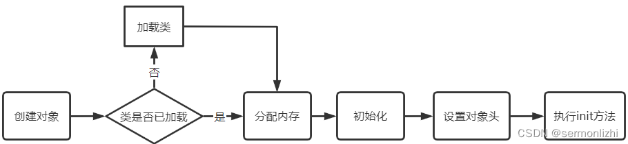
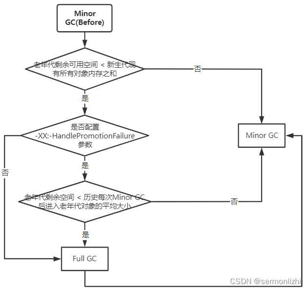
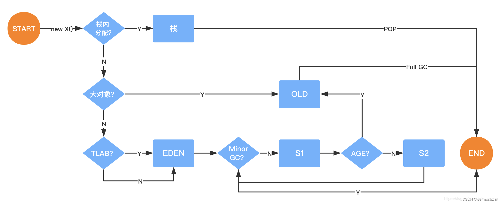
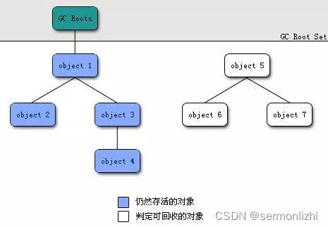

# 第03节 JVM内存分配机制

Java虚拟机最重要的工作就是如何给对象分配内存空间，以及通过GC如何回收已经不再使用的内存空间。
这篇文章主要介绍JVM中的Java对象是创建过程、对象内存的分配机制以及对象内存的回收机制。

## 一、对象的创建
在前面的文章《JVM类加载机制》中讲过，JVM中所有对象的创建，都需要先将对应的.class文件加载进内存，
所以JVM中通常一个对象的创建包含了如下几个步骤：


### 1.1 检查类是否加载
当JVM执行到new字节码指令时，首先会去运行时常量池检查该指令指定的参数能够找到对应类的符号引用，
并检查这个符号引用代表的类是否已经被加载、解析和初始化过。如果没有，就需要先进行该类的加载过程。

new字节码指定对应到Java语言层面，主要包括通过new关键字创建对象、对象克隆以及对象序列化等。

### 1.2 内存分配
确保类加载完成之后，接下来JVM就需要为新生对象分配内存。
对象所需内存的大小其实在【类加载完成之后】就可以确定了，然后就是从堆空间中划分出一块确定大小的内存给该对象使用。

内存分配涉及到两个问题，【如何划分内存】以及【如何保证内存划分的原子性】(多线程情况下不能给多个对象分配了同一块内存)。

#### 1.2.1 如何划分内存
内存划分主要包括两种方式：指针碰撞和空闲列表。
```text
指针碰撞(Bump the pointer)：
    如果Java堆中内存是绝对规整的，所有用过的内存都放在一边，空闲的内存放在另一边，中间放着一个指针作为分界点的指示器，
    那所分配内存就仅仅是把那个指针向空闲空间那边挪动一段与对象大小相等的距离。

空闲列表(Free List)：
    如果Java堆中的内存并不是规整的，已使用的内存和空闲的内存相互交错，
    那就没有办法简单地进行指针碰撞了，虚拟机就必须维护一个列表，记录上哪些内存块是可用的，
    在分配的时候从列表中找到一块足够大的空间划分给对象实例，并更新列表上的记录。
```
【指针碰撞】这种方式适用于对象内存回收时使用【复制算法】或【标记整理】这种情况，因为这两种算法内存回收之后会堆内存是比较规整的。
而【空闲列表】更适用于对象内存回收使用【标记清除】这种情况，内存回收后是零散的，关于垃圾回收下篇文章会重点介绍。

#### 1.2.2 保证内存划分的原子性
解决内存分配的并发问题也有两种方式：CAS和TLAB。
```text
CAS(Compare And Swap)：
    JVM采用CAS配上失败重试的方式保证更新操作的原子性来对分配内存空间的动作进行同步处理。

本地线程分配缓冲(Thread Local Allocation Buffer,TLAB)：
    把内存分配的动作按照线程划分在不同的空间之中进行，即每个线程在Java堆中预先分配一小块内存。
    通过-XX:+/-UseTLAB参数来设定虚拟机是否使用TLAB(JVM会默认开启-XX:+UseTLAB)，-XX:TLABSize 指定TLAB大小。
```

### 1.3 初始化
内存分配完成之后，虚拟机需要将分配到的内存空间都初始为零值(不包括对象头)，如果使用TLAB分配内存，这个过程会提前到TLAB内存分配时进行。

这一步操作保证了对象的实例字段在Java代码中可以不赋初始值就直接使用，程序能访问到这些字段的数据类型所对应的零值。

### 1.4 设置对象头
初始化零值之后，JVM要对对象进行必要的设置，例如这个对象是哪个类的实例、如何才能找到类的元数据信息、对象的哈希码、对象的GC分代年龄等信息。
这些信息存放在对象的对象头Object Header之中。

关于对象头的内存布局可以参考《深入理解Synchronized(二)》这篇文章，
从jdk1.6 update14开始，在64bit操作系统中，JVM支持指针压缩技术(默认开启)，为什么要进行指针压缩呢？

在32bit的操作系统中，内存最大只有4G，寻址时只需要使用32bit即可，
但在64bit的操作系统中，可以支持大于4G的内存，最大可以支持2^32 * 4G的内存大小，
但实际上服务器的内存大小比4G大，但又远小于64bit系统支持的最大值，所以在64bit系统寻址时可能只有使用到33bit或者34bit，
而其他的bit却都是空闲的，这是非常浪费内存。

在64位平台的HotSpot中使用32位指针(实际存储用64位)，内存使用会多出1.5倍左右，
使用较大指针在主内存和缓存之间移动数据，占用较大宽带，同时GC也会承受较大压力。

所以JVM通过对对象指针存入堆内存时压缩编码、取出到cpu寄存器后解码方式进行优化(对象指针在堆中是32位，在寄存器中是35位，2的35次方=32G)，
使得JVM只用32位地址就可以支持更大的内存配置(小于等于32G)。

但需要注意的是，堆内存小于4G时不需要指针压缩，但堆内存大于32G时，压缩指针就会失效，也就是说指针压缩只能将35bit的内存地址压缩为32bit，
大于35bit就不行了，会强制使用64位(即8字节)来对Java对象寻址。

### 1.5 执行init方法
执行<init>方法，即对象按照程序的意愿进行初始化。对应到语言层面上讲，就是为属性赋值，然后执行构造方法。

最后会进行对象的对其填充，对于大部分处理器，对象以8字节整数倍来对齐填充都是最高效的存取方式。

## 二、内存分配机制
Java中的对象基本上都是在堆上进行分配，在《JVM内存结构和Java内存模型》这篇文章的最后面，
介绍了JVM把堆中对象分为了新生代和老年代两大部分，而新生代里面又分了Eden区和Survivor区，
那么当创建对象时，到底要在哪一块区域来给对象分配内存呢？

### 2.1 栈上分配
上面也说了Java对象基本上是在堆上进行分配，但也有特殊情况会直接在线程栈上分配。
分配在堆空间的对象，当对象不再被引用的时候，需要依靠JVM的GC进行的内存回收，
在对象数量很多的情况下，会带来大量的GC，简介影响应用程序的性能。

但对于某些对象，它可能就是一个临时对象，即在某个方法中创建又不被外部访问，这种对象的生命周期随着方法调用结束也就结束了，
所以这一类对象完全没有必要在堆空间进行分配然后再由GC回收。

JVM通过【逃逸分析】来确定该临时对象不会被外部访问，然后就可以为该对象在栈上分配内存，而该对象所占用的内存也会随着方法栈帧出栈而销毁，
可以减轻垃圾回收的压力。

《深入理解Synchronized》这篇文章最后面介绍了什么是逃逸分析，简单来说就是分析对象动态作用域。

以下面两个例子：
```text
public User test1(){
    User user = new User();
    user.setName("lizhi");
    user.setAge(24);
    return user;
}

public void test2(){
    User user = new User();
    user.setName("lizhi");
    user.setAge(24);
    // 保存到数据库
}
```
显然test1()方法中的user对象被返回了，那么这个user对象的作用域就变成未知的了，而test2()方法中user对象在入库之后方法就结束了，
没有地方再引用该对象了，那么就可以认为该对象在方法调用完成之后就变成无效对象了，对于这样的对象可以将其分配在栈空间中，
让其在方法结束时跟随栈帧一起被回收掉即可。

JVM对于这种情况可以通过开启逃逸分析参数(-XX:+DoEscapeAnalysis)来优化对象内存分配位置，使其通过标量替换优先分配在栈上(栈上分配)，
JDK7之后默认开启逃逸分析，如果要关闭使用参数(-XX:-DoEscapeAnalysis)。

标量替换：
```text
通过【逃逸分析】JVM确定该【对象不会被外部访问】，并且对象还可以进一步分解时，JVM并不会创建该对象，
而是将该【对象的成员变量】【分解】成【若干个被当前方法使用的成员变量】所代替，这些代替的成员变量可以在栈帧或寄存器上分配空间，
这样就不会因为没有一大块连续空间导致对象内存不够分配的问题，对象的内存空间还要包含对象头，这也是较大的一部分开销。

开启标量替换参数(-XX:+EliminateAllocations)，JDK7之后默认开启。
```
标量与聚合量：
```text
标量即不可被进一步分解的量，而JAVA的基本数据类型就是标量（如：int，long等基本数据类型以及reference类型等），
标量的对立就是可以被进一步分解的量，而这种量称之为聚合量。而在JAVA中对象就是可以被进一步分解的聚合量。
```
下面的代码可以通过开启和关闭逃逸分析以及标量替换来查下GC的情况：
```text
// -Xmx15m -Xms15m 将堆空间设置小一点
public static void test2(){
    User user = new User();
    user.setName("lizhi");
    user.setAge(24);
    // 保存到数据库
}

public static void main(String[] args) {
    for (int i = 0;i < 100000000; i++){
        test2();
    }
}
```

在运行程序前，分别设置不同的参数：
```text
/**
* 第一次开启逃逸分析和标量替换
* -Xmx15m -Xms15m -XX:+DoEscapeAnalysis -XX:+PrintGC -XX:+EliminateAllocations
*
* 第二次关闭逃逸分析，开启标量替换
* -Xmx15m -Xms15m -XX:-DoEscapeAnalysis -XX:+PrintGC -XX:+EliminateAllocations
*
* 第三次开启逃逸分析，关闭标量替换
* -Xmx15m -Xms15m -XX:+DoEscapeAnalysis -XX:+PrintGC -XX:-EliminateAllocations
*/
```
分别三次运行上面的代码，通过-XX:+PrintGC参数打印GC日志，从运行结果可以看到只有第一次运行时没什么GC日志，
而第二次和第三次都会产品大量的GC日志。

通过测试可以发现：栈上分配依赖于逃逸分析和标量替换。

### 2.2 Eden区分配
除了栈上分配，其他对象都会被分配在堆空间，而这些分配在堆空间的对象，也会按照某些策略被分配在堆空间的不同区域。

对于在堆空间分配的对象，大多数情况下会被分配在新生代的Eden区。当Eden区空间不足时，虚拟机会发起一次Minor GC。

注：对于新创建的新生代对象，只能在Eden区分配内存，另外两个Survivor区是做垃圾回收时使用的。

JVM的GC分为两种：Minor GC和Full GC
```text
Minor GC(Young GC)：
    Minor GC又称为Young GC，主要是对堆空间中【新生代】的对象进行内存回收。Minor GC是比较频繁的，回收的速度也比较快。

Major GC(Full GC)：
    Major GC又称为Full GC，主要是回收堆空间的【老年代】和【新生代】以及【方法区】的垃圾，
    Major GC的执行频率是很低的，一般几个小时才会发生一次，但执行速度要比Minor GC慢很多，大概在10倍以上。
```
注：在HotSpot虚拟机中，新生代的Eden区与Survivor区的大小比例默认是8:1:1，即每10MB新生代空间，两个Survivor区分别占1MB。

JVM为什么要把堆空间分为新生代和老年代呢，因为Java的【很多对象都是朝生夕逝】的，而按照这个特性来管理这些对象就会方便很多。

大量新创建的对象会被分配在新生代的Eden区，当Eden区内存不够用时会触发Minor GC，新生代的对象在GC过程中可能会有90%以上的成为垃圾，
然后被回收，剩余存活的对象会被挪到空的Survivor区，也就是在新生代中，总有一个Survivor区的空间是为空。

当下一次触发Minor GC时，会把Eden区和上一次垃圾回收后存放存货对象的Survivor区一起进行回收， 然后再把存活的对象放入到另一块Survivor区。
因为新生代对象的生命周期大都很短，所以JVM默认的比例8:1:1是很合适的，不要随意更改这个比例(可以通过参数进行修改)。
要保证Eden区的空间足够大，Survivor区的空间够用即可。

JVM有个参数-XX:+UseAdaptiveSizePolicy(默认开启)，会导致这个8:1:1比例自动变化，
如果不想这个比例有变化可以设置参数-XX:-UseAdaptiveSizePolicy。

可以通过下面的测试来查看Eden区内存分配与回收：
```text
// -Xmx300m -Xms300m -XX:+PrintGCDetails
public static void main(String[] args) {
    byte[] t1,t2;
    t1 = new byte[70000 * 1024];
    // t2 = new byte[20000 * 1024];
}
```
JVM参数设置了堆空间的大小为300MB，按照新生代和老年代1:2的关系，新生代大概分配100MB的内存，
而新生代里面Eden区和Survivor区的比例为8:1:1，所以Eden区大概只有80MB的内存。

此时创建一个大小为70MB的数组，通过-XX:+PrintGCDetails参数打印GC的信息：
```text
Heap
PSYoungGen      total 89600K, used 76800K [0x00000000f9c00000, 0x0000000100000000, 0x0000000100000000)
eden space 76800K, 100% used [0x00000000f9c00000,0x00000000fe700000,0x00000000fe700000)
from space 12800K, 0% used [0x00000000ff380000,0x00000000ff380000,0x0000000100000000)
to   space 12800K, 0% used [0x00000000fe700000,0x00000000fe700000,0x00000000ff380000)
ParOldGen       total 204800K, used 0K [0x00000000ed400000, 0x00000000f9c00000, 0x00000000f9c00000)
object space 204800K, 0% used [0x00000000ed400000,0x00000000ed400000,0x00000000f9c00000)
Metaspace       used 3362K, capacity 4496K, committed 4864K, reserved 1056768K
class space    used 366K, capacity 388K, committed 512K, reserved 1048576K
```
从GC的信息中可以看到，新生代中Eden区的内存使用比例达到了100%，因为Java程序本身还有一些对象，
而两个Survivor区和老年代都没有内存被使用。

第二个程序将上面的注释放开，再看GC情况：
```text
public static void main(String[] args) {
    byte[] t1,t2;
    t1 = new byte[70000 * 1024];
    t2 = new byte[10000 * 1024];
}
```
```text
Heap
PSYoungGen      total 89600K, used 11784K [0x00000000f9c00000, 0x0000000100000000, 0x0000000100000000)
eden space 76800K, 14% used [0x00000000f9c00000,0x00000000fa684188,0x00000000fe700000)
from space 12800K, 7% used [0x00000000fe700000,0x00000000fe7fe010,0x00000000ff380000)
to   space 12800K, 0% used [0x00000000ff380000,0x00000000ff380000,0x0000000100000000)
ParOldGen       total 204800K, used 70008K [0x00000000ed400000, 0x00000000f9c00000, 0x00000000f9c00000)
object space 204800K, 34% used [0x00000000ed400000,0x00000000f185e010,0x00000000f9c00000)
Metaspace       used 3362K, capacity 4496K, committed 4864K, reserved 1056768K
class space    used 366K, capacity 388K, committed 512K, reserved 1048576K
```
此时新生代的内存占用只有14%，而老年代的内存占用有34%，说明在为t2分配内存时，发现老年代内存不够用了，
JVM并没有使用Survivor区为其分配内存，而是触发了一次Minor GC，但GC后t1仍然需要70MB的内存来存放，
但Survivor区又没有这么大的内存，所以直接将t1放入到了老年代，所以才会看到老年代内存占用34%，而垃圾收集后，
存活的小对象会被存放到Survior区，所以Survivor区内存占用7%。当需要为t2分配内存时，JVM仍然在新生代的Eden区为其分配内存，
所以Eden区内存占用为14%。

第三个程序再创建几个小对象：
```text
public static void main(String[] args) {
byte[] t1,t2,t3,t4;
t1 = new byte[70000 * 1024];
t2 = new byte[10000 * 1024];

    t3 = new byte[1000 * 1024];
    t4 = new byte[1000 * 1024];
}
```
```text
Heap
PSYoungGen      total 89600K, used 14305K [0x00000000f9c00000, 0x0000000100000000, 0x0000000100000000)
eden space 76800K, 17% used [0x00000000f9c00000,0x00000000fa8f2778,0x00000000fe700000)
from space 12800K, 8% used [0x00000000fe700000,0x00000000fe806010,0x00000000ff380000)
to   space 12800K, 0% used [0x00000000ff380000,0x00000000ff380000,0x0000000100000000)
ParOldGen       total 204800K, used 70008K [0x00000000ed400000, 0x00000000f9c00000, 0x00000000f9c00000)
object space 204800K, 34% used [0x00000000ed400000,0x00000000f185e010,0x00000000f9c00000)
Metaspace       used 3362K, capacity 4496K, committed 4864K, reserved 1056768K
class space    used 366K, capacity 388K, committed 512K, reserved 1048576K
```
第三个程序与第二个程序相比，只有Eden区的内存占用发生了变化，所以更加可以证明新的对象首先是在Eden区分配内存。

### 2.3 直接进去老年代
对于某些大对象，需要分配大量连续的内存空间(字符串、数组等)。JVM可以通过-XX:PretenureSizeThreshold参数进行设置大对象的大小，
如果对象超过该参数设置的大小，在分配内存时，就不在新生代分配内存，而是直接在老年代区分配内存，
不过这个参数只有在使用Serial和ParNew两个垃圾收集器时才有效。

比如上面的例子，如果设置了JVM参数-XX:PretenureSizeThreshold=1000000(单位字节)，同时需要设置-XX:+UseSerialGC，
因为JDK8默认的垃圾收集器是Parallel Scavenge和Parallel Old。再执行上面的第一个程序就会发现大对象直接进入了老年代。

至于为什么要这么设计，也可以看上面第二个程序，如果大对象比较多很快就会占满Eden区，但触发GC后，Survivor区又放不下这些大对象，
最终还是放到老年代。所以与其触发一次Minor GC仍然是把大对象放到老年代，还不如直接在分配内存的时候就直接放到老年代，
还能节省一次GC的时间和大对象复制操作(大对象复制是很消耗性能的)

### 2.4 长期存活的对象进入老年代
大部分对象创建时是在Eden区分配内存时，那什么时候会自动进入老年代呢？这个就与对象的年龄有关，在对象头的内存布局中，
使用两个bit位来存储对象的年龄，所以新生代中对象的最大年龄为15。

如果对象在 Eden 出生并经过第一次Minor GC后仍然能够存活，并且能被Survivor区容纳，该对象将被移动到 Survivor空间中，
并将对象年龄设为1。对象在Survivor中每熬过一次Minor GC，年龄就增加1岁，当它的年龄增加到一定程度
（默认为15岁，CMS收集器默认6岁，不同的垃圾收集器会略微有点不同），就会被晋升到老年代中。

对象晋升到老年代的年龄阈值，可以通过参数 -XX:MaxTenuringThreshold来设置。

### 2.5 对象动态年龄判断
新生代的对象除了到达指定年龄会被放入到老年代外，还会动态的将某些新生代对象移入到老年代中。这得益于对象的动态年龄判断机制。

一般在触发Minor GC后，对于存放存活对象的Survivor区域，如果一批对象的总大小大于这块Survivor区域内存大小的50%
(可以通过参数-XX:TargetSurvivorRatio指定)，那么此时大于等于这批对象年龄最大值的对象，就可以直接进入到老年代了。

比如，Survivor 1区现有一批对象，年龄1 + 年龄2 + 年龄3 … +年龄N的多个年龄对象所占用的内存大小超过了Survivor 1区内存大小的50%，
那么此时就会把年龄N(包含)以上的对象放入到老年代。简单来说就是年龄小于等于N的所有对象所占内存超过了50%，
就把年龄大于等于N的对象放入到老年代。

该机制就是为了那些可能是长期存活的对象，尽早进入老年代。对象动态年龄判断机制一般是在minor gc之后触发的。

### 2.6 老年代空间分配担保机制
年轻代在每次进行Minor GC之前，JVM都会计算老年代剩余可用空间。
如果老年代的剩余可用空间小于年轻代里面现有的所有对象所占内存大小之和(包括垃圾对象)。

下面就会判断JVM是否设置了-XX:-HandlePromotionFailure参数(JDK8默认设置)，
如果设置了该参数，JVM就会判断老年代的剩余可用空间大小是否大于之前每次Minor GC后进入老年代的对象的平均大小。

如果剩余可用空间小于进入老年代对象的平均大小或者没有设置-XX:-HandlePromotionFailure参数，那么就会触发一次Full GC，
对老年代和年轻代一起进行一次垃圾回收，如果回收完之后还没有足够空间存放新的对象就会发生OOM(Out Of Memory)。

如果只是触发了Minor GC，如果Minor GC之后剩余存活的对象需要移到老年代，但老年代没有足够的空间，那么也会触发Full FC，
如果Full GC之后，老年代仍然没有足够的空间容纳这些新生代过来的对象，也会发生OOM。

大概流程如下：


综合上面所有的内存配置机制，在创建一个对象时，大概的内存分配过程如下：


## 三、内存回收
当堆空间的内存不够时，需要将堆中无用对象的空间回收掉，那么就需要判断哪些对象是无用的。

判断无用对象通常有两种方法：引用计数器法和可达性分析算法。

### 3.1 引用计数器法
顾名思义，引用计数器法就是对象通过一个引用计数器来记录自己被引用的次数，每当有一个地方引用它时，引用计数器就加一，当引用生效时，
计数器就减一。只要对象的引用计数器为0，就表示该对象不再被使用，就可以回收对象的内存。

引用计数器法最大的优势就是实现简单，效率高，但基本上没有虚拟机采用这种方式来判断对象是否可回收，
主要就是因为该算法很难解决对象之间相互引用的问题。

比如下面的例子：
```text
public class ReferenceTest {

    ReferenceTest reference = null;

    public static void main(String[] args) {
        ReferenceTest test1 = new ReferenceTest();
        ReferenceTest test2 = new ReferenceTest();
        test1.reference = test2;
        test2.reference = test1;
    }
}
```
test和test2两个对象分别引用了彼此，就导致这两个对象的引用计数器都不为0，但这两个对象又不被其他地方使用，按理说是需要回收的，但如果使用引用计数器算法，这两个对象就没法回收。

### 3.2 可达性分析算法
可达性分析算法是从某个对象作为起点来向下搜索引用对象，搜索到的对象都会被标记为非垃圾对象，其余未标记的对象就是垃圾对象，
而这个起始的对象被称为GC Root。

可达性分析算法是由GC Root构成的集合作为起点的，称为GC Roots。

其中GC Roots主要包含了：线程栈的本地变量、静态变量、本地方法栈的变量等等。

大概的结构如下图所示：


现有的大多虚拟机都采用可达性分析算法来判断对象是否可回收。

### 3.3 对象引用类型
在Java1.2之后，引用类型被分为4种：强引用、软引用、弱引用和虚引用。
```text
强引用：
    就是我们通常使用的对象引用赋值，比例像User user = new User()这种引用赋值。
    对于强引用，只要引用关系还在，垃圾收集时就不能回收该对象的内存。

软引用：
    就是将实例对象使用SoftReference软引用类型的对象包裹，比如SoftReference<User> user = new SoftReference<User>(new User())。
    正常情况下，User对象的内存空间是不会被回收的。但如果在发生GC后，仍然没有足够用的空间，那么就会把这些软引用对象回收掉，
    也就是里面的User对象。如果内存还是不够就会发生内存溢出。

    软引用可以用在内存敏感的高速缓存中，当内存空间不够的时候，直接进行内存回收即可。

弱引用：
    弱引用是一种比软引用的引用强度更低的引用类型，通过WeakReference包裹引用对象来实现，比如WeakReference<User> user = new WeakReference<User>(new User())。
    弱引用对象的生命周期是非常短的，只能存活到下一次GC。即每次发生GC时，弱引用对象的内存都会被直接回收掉，所以弱引用也很少引用。

虚引用：
    虚引用也称为幽灵引用或者幻影引用，它是最弱的一种引用关系，程序中几乎不用。只有JVM在做垃圾回收时会用到，用于发送对象被回收的系统通知。
```
对于软引用、弱引用和虚引用，Java中都是通过一个类来包装的，分别是SoftReference、WeakReference和PhantomReference，
它们都继承自Reference抽象类。

### 3.4 生存还是死亡
即使在可达性分析算法中不可达的对象，也并非是“非死不可”的，这时候它们暂时处于“缓刑”阶段，要真正宣告一个对象死亡，至少要经历再次标记过程。

对象被标记回收的前提是经过可达性分析后，发现没有与GC Roots相连接的引用链。但是否能够回收还与finalize()方法有关。
```text
第一次标记与筛选：
    当对象没有与其相连的GC Roots时会进行一次垃圾收集的标记，同时会进行筛选。筛选的条件是该对象是否有必要执行finalize()方法。
    如果对象没有重写finalize()方法，则直接被回收。

第二次标记：
    如果对象重写了finalize()方法，会进行第二次标记，第二次标记是对象逃离被回收的最后一次机会。
    如果在finalize()方法中，对象重新与GC Roots引用链上的任何一个对象建立关联关系，那么第二次标记时就会把它从”即将回收“的集合中移除。

    如果第二次标记时对象仍然不能与引用链上的对象建立关系，那么就会被回收。
```
注：一个对象的finalize()方法只能被执行一次，也就是对象通过finalize()方法逃离回收的机会也只有一次。

比如下面的方法：
```text
public class FinalizeTest {
    public static List<Object> list = new ArrayList<>();
}

class User{
    private String name;
    private int age;

    @Override
    protected void finalize() throws Throwable {
        list.add(this);
    }
}
```
finalize()方法的运行代价高昂，不确定性大，无法保证各个对象的调用顺序，如今已被官方明确声明为不推荐使用的语法。

### 3.5 类卸载
Full GC发生时，不仅会回收老年代和新生代的空间，同时元空间(方法区)也会进行垃圾回收。
而方法区主要回收的就是无用的类，即类卸载。

但对于任何一个类来说，需要同时满足以下三个条件，才能算作是无用的类。
```text
该【类所有的实例对象】都已经被回收，即Java堆中不存在该类的任何实例
加载该【类的ClassLoader】已经被回收，这是因为ClassLoader会记录自己加载的类
该【类对应的java.lang.Class对象】没有在任何地方被引用，没有在任何地方通过反射访问该类的方法。
```
从上面的条件看出，想要回收一个类是非常困难的，所以方法区的垃圾回收成效并不显著。
