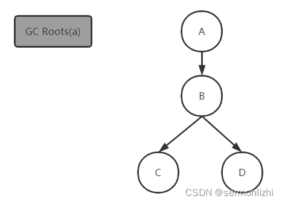

# 第04节 JVM GC算法与GC收集器

Java相比于C++这样语言，除了跨平台的特性外，最突出的特点就是垃圾回收机制。
C++的开发人员还需要手动分配和回收内存，但JVM直接承担起了垃圾回收的重任，开发人员可以专注于业务开发，不需要再去关心复杂的内存回收。

JVM的垃圾收集包含了两部分内容：垃圾收集算法与垃圾收集器，这两者是理论与实践的关系。前者提供【理论依据】，后者是对【理论的实现】。

在《JVM内存分配机制》这篇文章中介绍过了堆空间是按照新生代和老年代来划分的，这是因为根据对象的不同生命周期划分不同的区域后，
垃圾回收时可以根据各个区域的特性，采用不同的垃圾收集算法来实现，这也就是垃圾分代收集理论的雏形。

在JDK8之前的垃圾收集器，基本都是按照【分代收集】理论来设计的，但随着垃圾收集算法的精进，新的垃圾收集器慢慢淡化了分代收集理论，
从G1收集器开始，已经不再严格按照分代理论进行收集，到了ZGC收集器，更是完全抛弃了分代收集理论。

但老的垃圾收集器和新的垃圾收集器它们所适用的场景还是有很大差别的，作为开发人员是需要知道各个垃圾收集器的工作原理和优缺点，
才能在项目选择更合适的垃圾收集器。

这篇文章主要介绍以分代收集理论为代表的经典垃圾收集器和垃圾收集算法。

## 一、垃圾收集算法

### 1.1 标记-复制算法
复制算法可以将内存分为大小相同的块，每次使用其中的一块。当其中一块内存使用完之后，就将存活的对象复制到另一块去，
再把之前使用的那一块内存空间清理掉。这样每次内存回收都是对内存空间的一半进行回收。

使用复制算法，内存整理前后对比如下：


从上图可以看出，复制算法的缺点也是很明显的，每次只能使用一半的内存，另一半内存完全就是空闲。
但如果每次回收后存活的对象不多，这样算法的效率又是最高的。
所以JVM【新生代】的垃圾收集器基本都采用复制算法，但并不是将内存一分为2，而是将内存分为一个Eden和两个Survivor共三个区域，
反正每次GC后存活的对象不多，那么Survivor区只需要分配少量的内存就可以了，按照HotSpot中Eden与Survivor默认8:1:1的比例，
其中内存的利用率可以达到90%，这样就基本解决了复制算法浪费内存的弊端。

这也更能说明为什么堆空间要分老年代和新生代，而新生代又区分Eden区和Survivor区。

### 1.2 标记-清除算法
标记-清除算法分为标记和清除两个阶段：标记存活的对象，统一回收未被标记的对象；也可以直接标记待回收的对象，在标记完成后统一回收标记的对象。

使用标记-清除算法，内存整理前后对比如下：


标记-清除算法是最基础的算法，比较简单，但它也有两个明显的问题
```text
1) 空间碎片问题(标记清除后会产生大量不连续的碎片)
2) 如果标记对象太多，效率不高
```
JVM堆空间老年代的对象，Full GC之后存活的对象是比较多，如果也采用复制算法，因为有大量对象需要复制转移，效率是非常低。
但标记-清除算法不需要移动对象，只把老年代中部分可回收的空间释放掉即可。

所以在【老年代】的垃圾收集器，大多会基于标记-清除算法进行改进后使用。

### 1.3 标记-整理算法
标记-整理算法也分为两个阶段，标记和整理，其标记过程与标记-清除算法是一样的，但后续步骤并不是直接对可用对象进行回收，
而是让所有存活的对象向一端移动，然后直接清理掉存活对象边界以外的内存。

使用标记-整理算法，内存整理前后对比如下：


与复制算法相比，它的空间利用率更高，与标记-清除算法相比，它不会再产生大量的空间碎片，但移动存活的对象却是一个比较耗时的操作，
并且这个过程应用程序处于停止状态。

【老年代】的垃圾收集器会根据自己的特性来选择标记-清除算法和标记-整理算法，
如果想要低延迟，就采用标记-清除算法，
如果想要内存分配的效率比较高就采用标记-整理算法。

## 二、垃圾收集器
前面也说了JVM会根据新生代和老年代选择不同的垃圾收集算法，然后实现不同的垃圾收集器，其中现有的垃圾收集器如下所示：


新生代和老年代的垃圾收集之间有连线，说明这两个垃圾收集器可以搭配使用。
从垃圾收集器的发展历程来看，去按代收集理论已经是趋势了。但还是要根据程序自身的情况来选择合适的垃圾收集器。

### 2.1 Serial收集器
Serial垃圾收集器(串行)是最基本、历史最悠久的垃圾收集器，它是一个单线程的垃圾收集器。
单线程不仅意味只有一个线程做垃圾收集的工作，更重要的是在进行垃圾收集时，必须暂定所有的工作线程，
也就是应用程序所有的线程都需要暂定，这种情况称之为Stop The World。直到垃圾收集完成后，其他工作线程才能恢复。

Serial收集器新生代采用【标记-复制】算法，老年代使用【标记-整理】算法，
可以通过两个参数开启Serial收集器：-XX:+UseSerialGC -XX:+UseSerialOldGC，其中SerialOld是老年代的Serial收集器。

工作过程大概如下图所示：


垃圾回收时Stop The World会给用户带来不好的体验，所以可以说垃圾收集器的迭代发展都是为了减少垃圾收集期间的停顿。

Serial垃圾收集器最大的优点就是实现比较简单，没有多线程交互的开销，单个线程的收集效率非常高。

Serial Old收集器同样是一个单线程收集器。它主要有两大用途：
一种用途是与【Parallel Scavenge收集器】搭配使用，
另一种用途是作为【CMS收集器】的后备方案(下面会介绍)。

### 2.2 Parallel Scavenge收集器
Parallel 垃圾收集器其实就是Serial垃圾收集器的多线程版本，除了使用多线程进行垃圾回收外，
它的垃圾收集算法以及回收策略等和Serial垃圾收集器类似。
默认的收集线程数跟cpu核数相同，也可以通过参数-XX:ParallelGCThreads指定收集线程数，但是一般不推荐修改。

Parallel Scavenge垃圾收集器也提供了新生代和老年代的版本，其中Parallel为新生代的垃圾收集器，Parallel Old为老年代的垃圾收集器，
使用多线程和标记-整理算法。

Parallel 垃圾收集器的工作过程如下图所示：


Parallel Scavenge收集器关注点是【吞吐量(高效率的利用CPU)】。而CMS等垃圾收集器的关注点更多的是用户线程的【停顿时间】(提高用户体验)。
所谓吞吐量就是CPU中用于运行用户代码的时间与CPU总消耗时间的比值，所以需要内存分配时的效率足够高，才选择标记-整理算法。

在注重吞吐量以及CPU资源的场合，都可以优先考虑Parallel Scavenge收集器和Parallel Old收集器(JDK8默认的新生代和老年代收集器)。

### 2.3 ParNew收集器
ParNew作为新生代的垃圾收集器，它与Parallel收集器很类似，主要区别在于它可以和CMS收集器配合使用，而Parallel 收集器不行。

ParNew采用复制算法，其工作过程如下：


它是许多运行在Server模式下的虚拟机的首要选择，除了Serial收集器外，只有它能与CMS收集器配合工作。
如果通过参数-XX:+UseConcMarkSweepGC开启了CMS垃圾收集器，ParNew会作为默认的新生代的垃圾收集器。
也可以通过-XX:+/-UseParNewGC参数强制指定或禁用它。

正是因为CMS的出现，才让ParNew垃圾收集器的地位得到巩固，但随着G1、ZGC等新一代垃圾收集器的出现，它又要慢慢淡出历史舞台。

### 2.4 CMS收集器
CMS（Concurrent Mark Sweep）收集器是一种以获取最短停顿时间为目标的收集器。
它非常注重用户体验，是HotSpot虚拟机【第一款真正意义上的并发收集器】，它第一次实现了让【垃圾收集线程】与【用户线程】（基本上）同时工作。

从名字可以看出，CMS收集器是一种 “标记-清除”算法实现的，它的工作过程要比前面介绍的垃圾收集器都复杂。整个过程分为四个步骤：
```text
初始标记：
    【暂定所有其他线程(STW)】，并记录下GC Roots直接能引用的对象，因为只需要【标记GC Roots引用的对象】，而不是标记所有对象，
    所以这个过程是非常快的。

并发标记：
    并发标记阶段就是【从GC Roots开始向下遍历所有能关联到的对象】，虽然这个过程是比较耗时，但这个过程并不需要暂定所有其他线程，
    即【垃圾收集线程】和【应用程序线程】可以并行执行。

    由于应用程序继续运行，可能会出现之前标记的对象状态发生了变化(由在用对象变成了可回收对象)。

重新标记：
    重新标记就是为了【修复并发标记】阶段由于【应用程序的运行】而导致对象状态发生了那一部分对象，所以这个阶段需要【暂定所有其他线程】，
    这个阶段的停顿时间一般会比【初始标记】停顿的时间长一些，但远比【并发标记】执行的时间短。

    底层主要通过用到【三色标记】的【增量更新算法】做重新标记。

并发清理：
    应用线程继续运行，同时GC线程开始对未标记的区域进行清理。在这个过程中，也会出现并发标记阶段的问题，
    但这个阶段会把新增的需要清理的对象标记为黑色不做任何处理。

    后面会重点介绍CMS的三色标记算法。

并发重置：
    重置本次GC过程中的标记数据。
```

CMS的工作过程如下图所示：


CMS是一款非常优秀的垃圾收集器，主要优点：可以【并发收集】、【STW时间短】用户体验好。但CMS也有一些缺点：
```text
1) 因为是并发收集，所以会和服务抢夺CPU资源，对CPU资源比较敏感。
2) 在并发标记和并发清理阶段又会产生新的垃圾，这种垃圾称为【浮动垃圾】，需要等到下一次GC时才能清理。
3) 使用标记-清除算法收集垃圾对象，会导致生成大量的空间碎片，可以通过参数-XX:+UseCMSCompactAtFullCollection(默认是开启)
    让JVM在每次执行完标记清除后再做整理，因为整理存活对象的过程中需要STW，所以这又会增加STW的时间。
    于是CMS又提供了一个-XX:CMSFullGCsBeforeCompaction参数，可以让CMS垃圾收集器在执行若干次(由参数值决定)
    不整理内存碎片的Full GC，即若干次只使用标记-清除算法后，当下一次Full GC时，进行一次标记-整理算法来回收内存。
    默认值是0，即每次Full GC时都是用标记-整理算法回收内存。
4) 执行过程中的不确定性，可能存在上一次垃圾回收还没执行完，然后垃圾回收又被触发的情况，特别是在并发标记和并发清理阶段会出现，
    一边回收，系统一边运行，也许没回收完就再次触发full gc，也就是"concurrent mode failure"，
    此时会进入stop the world，用serial old垃圾收集器来回收，这是非常影响性能。
    CMS也提供了一个参数-XX:CMSInitiatingOccupancyFraction来控制触发垃圾收集的时机，默认值是92，
    即老年代的内存使用占比达到92%时才触发内存回收，这是一个非常危险的比例，建议稍微调低一点，
    避免**“concurrent mode failure”**的发生。
```

下面把CMS常用的一些参数设置列举出来:

| 参数	                                 | 说明                                                                                                                     |
|-------------------------------------|------------------------------------------------------------------------------------------------------------------------|
| -XX:+UseConcMarkSweepGC	            | 【启用cms】                                                                                                                |
| -XX:ConcGCThreads	                  | 【并发的GC线程数】，默认(处理器核数+3)/4                                                                                               |
| -XX:+UseCMSCompactAtFullCollection	 | 【FullGC之后做压缩整理（减少碎片）】                                                                                                  |
| -XX:CMSFullGCsBeforeCompaction	     | 【多少次FullGC之后压缩一次】，默认是0，代表每次FullGC后都会压缩一次                                                                               |
| -XX:CMSInitiatingOccupancyFraction	 | 【当老年代使用达到该比例时会触发FullGC（默认是92，这是百分比）】                                                                                   |
| -XX:+UseCMSInitiatingOccupancyOnly	 | 只使用设定的回收阈值(-XX:CMSInitiatingOccupancyFraction设定的值)，如果不指定，JVM仅在第一次使用设定值，后续则会自动调整                                        |
| -XX:+CMSScavengeBeforeRemark	       | 【在CMS GC前启动一次minor gc】，降低CMS GC标记阶段(也会对年轻代一起做标记，<br/>如果在minor gc就干掉了很多对垃圾对象，标记阶段就会减少一些标记时间)时的开销，【一般CMS的GC耗时 80%都在标记阶段】 |
| -XX:+CMSParallelInitialMarkEnabled	 | 表示【在初始标记的时候多线程执行】，缩短STW                                                                                                |
| -XX:+CMSParallelRemarkEnabled	      | 【在重新标记的时候多线程执行】，缩短STW                                                                                                  |

## 三、CMS底层实现算法
CMS在【并发标记】和【并发清理】阶段，由于应用线程仍然在继续执行，就会导致对象间的引用发生变化，【多标】和【漏标】的情况就有可能发生，
CMS通过【三色标记】和【读写屏障】来解决 漏标 的问题。

### 3.1 三色标记
三色标记算法就是把【GC Roots】【可达性分析】时遍历过程中遇到的对象，按照【是否访问过】这个条件将对象标记为三种颜色：

#### 白色：
白色，表示对象尚未被垃圾收集器访问过。
在可达性分析刚开始的时候，所有的对象都是白色，如果在可达性分析结束的时候，对象仍然是白色，说明是不可达的(暂时不能回收)。

#### 黑色：
黑色，表示该对象已经被垃圾收集器【访问过】，且这个对象【包含的所有引用都已经被扫描过】，所以黑色对象不能直接指向某个白色对象。

黑色的对象代表已经扫描过，它是【安全存活的对象】，不会被回收。如果有其他对象引用指向了黑色对象，不需要重新扫描。

#### 灰色：
灰色，表示该对象已经被垃圾收集器【访问过】，但这个对象【包含的所有引用中至少还有一个引用没有被扫描】。

以下面的代码为例来分析三色标记：
```java
public class ThreeColorRemark {

    public static void main(String[] args) {
        A a = new A();
        // 开始做并发标记
        D d = a.b.d;   // 1.读
        a.b.d = null;  // 2.写
        a.d = d;       // 3.写
    }
}

class A {
    B b = new B();
    D d = null;
}

class B {
    C c = new C();
    D d = new D();
}

class C {
}

class D {
}
```
在进行可达性分析前，所有的对象都是白色的：


当经过初始标记(只标记GC Root)后，对象A作为根引用，就变成了灰色(此时还没扫描它的引用B对象)：


然后进行并发标记，当进行到扫描完C对象时，A对象就变成了黑色(B对象已经被扫描了)；
B对象由于只有C对象扫描完了，D对象还没扫描，所以是灰色；
而C对象已经被扫描，且它没有其他引用，所以C对象是黑色；
D对象因为还没有被扫描，所以依然是白色：


在并发标记的过程中，应用程序还在继续运行，当执行完下面的代码后，对象之前的引用关系就发生了变化：
```text
D d = a.b.d;   // 1.读
a.b.d = null;  // 2.写
a.d = d;       // 3.写
```
这段代码将D对象从B对象的引用中移除，然后加到A对象的引用中，就变成了下面的情况：


由于D对象还没有被扫描过，所以还是白色，而A对象已经经过了扫描就不会再扫描了，如果此时进行垃圾回收，D对象就会被回收掉，
这样就会导致程序重大异常，这就是典型的【漏标】情况。

所以CMS在进行完并发标记之后，还要再经过一次【重新标记】，并且重新标记的过程中，【所有应用程序的线程都会被停掉(STW)】。

### 3.2 读写屏障
漏标会导致被引用的对象被当成垃圾误删除，这是严重bug，必须解决，
有两种解决方案：【增量更新】（Incremental Update）和【原始快照】（Snapshot At The Beginning，SATB）。

【增量更新】：
```text
    当黑色对象添加新的指向白色对象的引用时，就将这个新插入的引用记录下来，待并发标记完成之后，
    再将这些记录过的引用关系中的黑色对象为根，【重新扫描一次】。
    简单来说，就是黑色对象一旦插入新的指向白色对象的引用后，它就符合灰色对象的概念了。
```
【原始快照】：
```text
    当灰色对象要删除指向白色对象的引用时，就将这个要删除的引用记录下来，在并发标记完成后，
    再将这些记录过的引用关系中的灰色对象为根，【重新扫描一次】。
```
需要注意的是这次扫描是【以删除前的引用关系为快照】进行扫描，比如上面的对象D从对象B移除后，再次扫描时是从B对象开始，但它们的引用关系如下：


所以这就是为什么叫原始快照，经过这样的一次扫描以后，D对象就变成黑色了。
这样做的目的只是让这种对象在本轮GC清理中能存活下来，待下一轮GC的时候重新扫描，
如果这个对象没有被其他对象引用，这个对象就变成了浮动垃圾，等下一轮垃圾回收时再回收。

以上无论是对引用关系记录的插入还是删除， 虚拟机的记录操作都是通过写屏障实现的。

#### 3.2.1 写屏障
所谓的【读写屏障】，其实就是指【在赋值操作前后，加入一些处理(类似于AOP的概念)】：
```text
void oop_field_store(oop* field, oop new_value) {  
    pre_write_barrier(field);          // 写屏障-写前操作
    *field = new_value;
    post_write_barrier(field, value);  // 写屏障-写后操作
}
```
写屏障实现【原始快照】，当对象B的成员变量的引用发生变化时，比如引用消失（a.b.d = null），
可以利用写屏障，将B原来成员变量的引用对象D记录下来：
```text
void pre_write_barrier(oop* field) {
    oop old_value = *field;    // 获取旧值
    remark_set.add(old_value); // 记录原来的引用对象
}
```
写屏障实现【增量更新】，当对象A的成员变量的引用发生变化时，比如新增引用（a.d = d），
我们可以利用写屏障，将A新的成员变量引用对象D记录下来：
```text
void post_write_barrier(oop* field, oop new_value) {  
    remark_set.add(new_value);  // 记录新引用的对象
}
```

#### 3.2.2 读屏障
```text
oop oop_field_load(oop* field) {
    pre_load_barrier(field); // 读屏障-读取前操作
    return *field;
}
```
读屏障是直接针对第一步：D d = a.b.d，当读取成员变量时，记录下来：
```text
void pre_load_barrier(oop* field) {  
    oop old_value = *field;
    remark_set.add(old_value); // 记录读取到的对象
}
```

对于读写屏障，以HotSpot虚拟机为例，其并发标记时对漏标的处理方案如下：
```text
CMS：写屏障 + 增量更新
G1：Shenandoah：写屏障 + 原始快照
ZGC：读屏障
```

至于为什么CMS选择增量更新，而G1选择SATB，在下篇文章介绍完G1收集器的特性后，在讨论这个问题。

## 四、记忆集与卡表
在新生代做GC Roots可达性分析扫描的过程中，可能会遇到【跨代】引用的对象，即【老年代的对象引用了新生代的对象】，
这种情况在按区域进行垃圾回收的收集器中是非常常见的。
遇到跨代引用的对象，再去老年代(或另外一个区域)扫描效率是非常低的，并且在G1和ZGC这样的垃圾收集器，
收集区域的对象可能被多个非收集区的对象所引用，没必要把所有关联的非收集区域都扫描一遍，只需要关注【当前做垃圾收集的区域】即可。

为此在新生代可以引入【记忆集(Remember Set)】的数据结构，记录从垃圾【非收集区】到【收集区】的指针集合，
避免把整个老年代加入GC Roots扫描范围。

垃圾收集场景中，收集器只需通过【记忆集】判断出某一块非收集区域【是否存在】指向收集区域的指针即可，无需了解跨代引用指针的全部细节。

HotSpot使用一种叫做【卡表(CardTable)】的方式实现【记忆集】，也是目前最常用的一种方式。
卡表与记忆集的关系，可以类比为Java语言中HashMap与Map的关系。

【卡表】是使用一个【字节数组】实现：CARD_TABLE[]，每个元素对应着其标识的内存区域一块【特定大小的内存块】，称为【卡页】。
hotSpot使用的卡页是2^9大小，即【512字节】：


一个卡页中可包含多个对象，只要有一个对象的引用【存在跨代指针】，其对应的卡表的元素标识就变成【1】，表示该元素变脏，否则为0。
按照我的理解就是【卡表记录了新生代所有的对象】。
在GC时，只要筛选本收集区的【卡表】中【变脏的元素加入GCRoots】里。
因为每个元素对应一个卡页，而每一个卡页又可以包含多个对象，那么变脏的元素就对应多个对象。

以下面的引用关系为例，因为老年代对象G引用了新生代对象F，所以对象F所在卡页的标识就为1，假设对象C与对象F处于同一个卡页中，
那么当GC时，就把对象F和对象C都作为GC Roots的两个根节点继续往下去扫描。


卡表的维护也很简单，HotSpot通过写屏障来维护卡表状态，也就是发生引用关系赋值时(老年代对新生代的引用)，将卡表对应元素标识为1。
