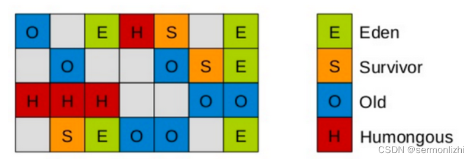
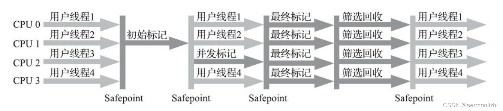
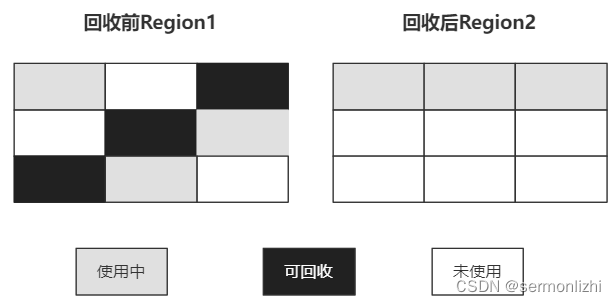

# 第05节 JVM详解G1垃圾收集器

G1(Garbage-First)作为【继CMS之后】新一代面向服务器的垃圾收集器，它已经不再严格按照之前老年代和新生代的划分来进行垃圾收集，
即它是一个【老年代】和【新生代】共用的垃圾收集器。

G1更多是在【多处理器(或多核)】以及【大内存】的机器上发挥优势，在满足指定【GC停顿时间】要求的同时，还具备【高吞吐量】的能力。

这篇文章主要从G1的设计理念和垃圾回收过程来详细介绍。

## 一、设计思想
在《JVM GC收集算法与GC收集器》这篇文章中介绍了JVM中经典的垃圾收集器，这些垃圾收集器的共性是在整个垃圾收集过程中，
一定会发生Stop The World，并且STW的时间是根据垃圾标记所需要的时间来确定，可能依然会存在某次垃圾收集时，
STW的时间过长的问题，导致这个问题的原因在于经典的垃圾收集器都是对整个新生代或老年代进行垃圾回收，要扫描的对象太多了。

但STW又是每个垃圾收集器都不可避免的，【垃圾收集器的发展】就是【为了能够尽量缩短STW的时间】。

G1采用了开创性的【局部收集】的设计思路和【以Region为基本单位的内存布局】方式，它将Java堆空间划分成多个大小相等的独立区域(Region)，
JVM目标是总共【不超过2048个Region】(由JVM源码参数TARGET_REGION_NUMBER定义)，虽然可以超过该值，但不推荐。

通常Region的大小等于堆空间总大小除以Region的个数，比如堆空间大小为4096MB，总共有2048个Region，那么每个Region的大小为2MB，
也可以通过参数-XX:G1HeapRegionSize来指定Region的大小，假设参数值为4MB，那么堆空间就只有1024个Region了，一般推荐默认的计算方式。

G1对应的堆空间的内存布局如下所示：


G1虽然抛弃了将新生代和老年代作为整块内存空间的方式，但【依然保留了新生代和老年代的概念】。
只是老年代和新生代的内存空间【不再是物理连续的】了，它们都是【Region的集合】。

G1将所有Region分为四种类型：**Eden**、**Survivor**、**Old**、**Humongous**。

默认新生代的Region内存占堆空间的5%，如果堆空间大小为4096MB，那么新生代占用200MB左右的内存，
按照每个Region为2MB，对应就是100个Region。也可以通过参数-XX:G1NewSizePercent设置新生代初始占比。

在系统运行过程中，JVM会动态地给年轻代增加更多的Region，但新生代的占比最多不会超过60%，可以通过参数-XX:G1MaxNewSizePercent设置。
Region的区域类型是动态变化的，可能之前是年轻代，经过了垃圾回收之后就变成了老年代。

G1中的新生代依然与经典垃圾收集器中一样，分为Eden区和Survivor区，默认比例也是8:1:1，
如果新生代有100个Region，那么就是Eden区占用80个，两个Survivor区各占用10个。

G1收集器对于对象【从新生代转移到老年代与CMS等经典垃圾收集器是一样的】，但对于【大对象的处理有所不同】。
G1为大对象的内存分配专门设计了一个【Humongous类型的Region】，而不再是让对象直接进入老年代的Region。

【在G1中，大对象的判断是超过一个Region大小的50%】，按照每个Region大小为2MB来计算，只要对象超过了1MB，
就会被放入到Humongous的Region中，如果一个对象太大，一个Region放不下，可能会存在跨多个Region来存放。

在进行【Full GC】的时候除了要收集新生代和老年代的Region外，还会将Humongous的Region一并进行回收。

与之前的经典垃圾收集器不同，【G1可以由用户自己去设置STW的最大时间】，然后G1会根据STW的时间来进行内存回收，
这个STW的时间包含了并发标记、最终标记和筛选回收三个阶段STW的总时间。

## 二、垃圾回收过程

### 2.1 G1垃圾收集过程
G1在进行垃圾收集的时候，会根据每个Region【预计垃圾收集所需时间】与【预计回收内存大小的占比】来选择对哪些区域进行回收，
也就是不再有Minor GC/Yong GC和Major GC/Full GC的概念，而是采用一种Mixed GC的方式，即混合回收的GC方式。

G1的垃圾收集(主要指Mixed GC)过程可以分为下面几个步骤：
```text
1) 初始标记：
    需要【暂定所有线程】，即STW，并记录下【GC Roots能直接引用的对象】，速度很快。与CMS的初始标记一样。

2) 并发标记：
    可以与应用线程一起工作，进行可达性分析，与CMS的并发标记一样。

3) 最终标记：
    需要【暂定所有线程(STW)】，根据【三色标记】算法修复一些引用的状态，与CMS的重新标记是一样的。

4) 筛选回收：
    筛选回收阶段会对各个Region的【回收价值和成本】进行【排序】，根据用户所期望的GC停顿STW时间
    (可以通过参数 -XX:MaxGCPauseMillis设置)来制定回收计划。

    比如此时有1000个Region都满了，但根据用户设置的STW时间，本次垃圾回收只能停顿200毫秒，那么通过之前的回收成本计算，
    200毫秒只能回收600个Region的内存空间，那么G1就会只回收这600个Region(Collection Set，要回收的集合)的内存空间，
    尽量把GC的停顿时间控制在用户指定的停顿时间内。

    在回收的时候，使用的是【复制算法】，将【一个Region中的存活对象】移动到【另一个空的Regin】中，然后将之前的Region内存空间清空，
    G1就不需要像CMS那样回收完内存后因为有很多碎片还要进行整理，采用复制算法几乎不会有内存碎片。

    CMS在并发清理阶段，垃圾收集线程是可以与用户线程一起并发执行，
    但G1因为内部实现太复杂就【没有实现并行回收】，不过到了【ZGC就实现了并发收集】。
```
G1的垃圾收集过程大概如下：


**在筛选回收阶段对各个Region进行回收价值和成本进行排序，这句话怎么理解？**
```text
比如，现在有Region1、Region2和Region3三个区域，
其中Region1预计可以回收1.5MB内存，预计耗时2MS；
Region2预计可以回收1MB内存，预计耗时1MS；
Region3预计可以回收0.5MB内存，预计耗时1MS。
那么Region1、Region2和Region3各自的回收价值与成本比值分别是：0.75、1和0.5。

比值越高说明同样的付出，收益越高，
如果此时只能回收一个Region的内存空间，G1就会选择Region2进行回收。
这种方式保证了G1收集器在有限的时间内尽可能地提高收集效率。
```

在《GC收集器》这篇文章介绍CMS底层算法的时候，遗留了一个问题，
在G1的最终标记和CMS的重新标记过程中，为什么【G1使用原始快照(SATB)】，而【CMS使用增量更新】？

主要原因是增量更新是一种深度扫描的算法，CMS中只有一块老年代，即使进行深度更新也没有什么问题。
但G1有很多个Region，且对象的引用可能分散在多个Region中，如果这种情况还选择深度扫描效率就会很低了。
而【原始快照(STAB)】相对【增量更新】就会快很多，虽然原始快照(STAB)可能产生浮动垃圾，但产生的【浮动垃圾下一次再回收】就好了，
并且这部分浮动垃圾也不会很多。所以G1选择原始快照(STAB)，只是将对象简单标记成黑色，保证本次垃圾收集不进行回收就可以了，
等下一次GC时再做深度更新。

### 2.2 G1特性
G1具备以下几个特性：
- 并行与并发
    
    G1能充分利用CPU、多核环境下的硬件优势，使用多个CPU（CPU或者CPU核心）来缩短Stop-The-World停顿时间。
    G1收集器可以通过并行和并发的方式让应用程序继续执行。

- 分代收集

    虽然G1可以不需要其他收集器配合就能独立管理整个GC堆，但是还是保留了分代的概念。

- 空间整合

    与CMS的标记–清理算法不同，G1从【整体】来看是基于【“标记-整理”】算法实现的收集器；从【局部】上来看是基于【“复制”】算法实现的。
    
    以下面的Region1和Region2为例，Region1回收后复制到了Region2，这个过程使用的复制算法，
    而Region2中使用中的对象是经过整理的，也个过程使用了整理算法。

- 可预测停顿

    这是G1相对于CMS的另一个大优势，【降低停顿时间】是G1和CMS共同的关注点，
    但G1除了追求低停顿外，还能建立【可预测的停顿时间模型】，能让使用者明确指定在一个长度为M毫秒的时间片段
    (通过参数-XX:MaxGCPauseMillis)内完成垃圾收集。

【由用户指定期望的停顿时间】是G1收集器很强大的一个功能，设置不同的期望停顿时间，可使得G1在不同应用场景中取得关注吞吐量和关注延迟之间的最佳平衡。 
不过，这里设置的“期望值”必须是符合实际的，不能异想天开，毕竟G1是要冻结用户线程来复制对象的，这个停顿时间再怎么低也得有个限度。

它【默认的停顿目标】为【两百毫秒】，一般来说，回收阶段占到几十到一百甚至接近两百毫秒都很正常，
但如果把停顿时间调得非常低，譬如设置为二十毫秒，很可能出现的结果就是由于停顿目标时间太短，
导致每次选出来的回收集只占堆内存很小的一部分，收集器收集的速度逐渐跟不上分配器分配的速度，导致垃圾慢慢堆积。
很可能一开始收集器还能从空闲的堆内存中获得一些喘息的时间，但应用运行时间一长就不行了，最终占满堆引发Full GC反而降低性能，
所以通常把【期望停顿时间】设置为【一两百毫秒或者两三百毫秒】会是比较合理的。

### 2.3 G1垃圾收集分类
G1的垃圾收集分为YoungGC、Mixed GC和Full GC。

#### 2.3.1 Young GC
G1与之前垃圾收集器的Young GC有所不同，并不是当新生代的Eden区放满了就进行垃圾回收，
G1会计算当前Eden区回收大概需要多久的时间，如果回收时间远小于参数-XX:MaxGCPauseMills设定的值，
那么G1就会增加年轻代的Region(可以从老年代或Humongous区划分Region给新生代)，继续给新对象存放；
直到下一次Eden区放满，G1计算回收时间接近参数-XX:MaxGCPauseMills设定的值，那么就会触发Young GC。

#### 2.3.2 Mixed GC
如果老年代的堆空间内存占用达到了参数-XX:InitiatingHeapOccupancyPercent设定的值就会触发Mixed GC，
回收所有的新生代和部分老年代(根据用户设置的GC停顿时间来确定老年代垃圾收集的先后顺序)以及Humongous区。
正常情况下G1的垃圾收集是先做Mixed GC，主要使用【复制算法】，需要把各个Region中存活的对象复制到另一个空闲的Region，
如果在复制过程中发现没有足够的空Region放复制的对象，那么就会触发一次Full GC。

#### 2.3.3 Full GC
停止系统程序，然后采用单线程进行标记、清理和压缩整理，好空闲出来一批Region来供下一次Mixed GC使用，这个过程是非常耗时的。

G1收集器的Region内存回收时，会涉及到大量跨区引用的对象，解决方式也是通过【记忆集(卡表)】。
【每个Region都要维护一个其他Region对自己内部对象的引用】。CMS中只有新生代和老年代，即使出现了跨代引用，也很好解决。

但G1是把堆分成了多个Region，Region中对象的可能被多个Region引用，所以G1的卡表实现要比CMS复杂很多。

## 三、相关参数设置
G1的相关参数与说明如下：

| 参数	                                 | 说明                                                                                                                                                                                          |
|-------------------------------------|---------------------------------------------------------------------------------------------------------------------------------------------------------------------------------------------|
| -XX:+UseG1GC	                       | 【开启使用G1垃圾收集器】                                                                                                                                                                               |
| -XX:ParallelGCThreads	              | 指定【GC工作的线程数量】                                                                                                                                                                               |
| -XX:G1HeapRegionSize	               | 指定【分区大小】(1MB~32MB，且必须是2的N次幂)，默认将整堆划分为2048个分区                                                                                                                                                |
| -XX:MaxGCPauseMillis	               | 【目标暂停(STW)时间】(默认200ms)                                                                                                                                                                      |
| -XX:G1NewSizePercent	               | 【新生代内存初始空间】(默认整堆5%，值配置整数，比如5，默认就是百分比)                                                                                                                                                       |
| -XX:G1MaxNewSizePercent	            | 【新生代内存最大空间】(最大60%，值配置整数)                                                                                                                                                                    |
| -XX:TargetSurvivorRatio	            | 【Survivor区的填充容量】(默认50%)，Survivor区域里的一批对象(年龄1+年龄2+年龄n的多个年龄对象)总和超过了Survivor区域的50%，此时就会把年龄n(含)以上的对象都放入老年代                                                                                      |
| -XX:MaxTenuringThreshold	           | 【最大年龄阈值】(默认15)                                                                                                                                                                              |
| -XX:InitiatingHeapOccupancyPercent	 | 【老年代占用空间达到整堆内存阈值】(默认45%)，则执行新生代和老年代的混合收集(MixedGC)，比如堆默认有2048个region，如果有接近1000个region都是老年代的region，则可能就要触发MixedGC了                                                                            |
| -XX:G1MixedGCLiveThresholdPercent	  | 默认85%，【Region中的存活对象低于这个值时才会回收该Region】，如果超过这个值，存活对象过多，回收的的意义不大                                                                                                                               |
| -XX:G1MixedGCCountTarget	           | 【在一次回收过程中指定做几次筛选回收】(默认8次)，在最后一个筛选回收阶段可以回收一会，然后暂停回收，恢复系统运行，一会再开始回收，这样可以让系统不至于单次停顿时间过长。                                                                                                       |
| -XX:G1HeapWastePercent	             | 默认5%，【GC过程中空出来的Region是否充足阈值】，在混合回收的时候，对Region回收都是基于复制算法进行的，都是把要回收的Region里的存活对象放入其他Region，然后这个Region中的垃圾对象全部清理掉，这样的话在回收过程就会不断空出来新的Region，一旦空闲出来的Region数量达到了堆内存的5%，此时就会立即停止混合回收，意味着本次混合回收就结束了 |

## 四、优化
假设参数-XX:MaxGCPauseMills设置的值很大，导致系统运行很久，年轻代可能都占用了堆内存的60%了，此时才触发年轻代gc。

那么存活下来的对象可能就会很多，此时就会导致Survivor区域放不下那么多的对象，就会进入老年代中。

或者是年轻代GC过后，存活下来的对象过多，导致进入Survivor区域后触发了动态年龄判定规则，达到了Survivor区域的50%，也会快速导致一些对象进入老年代中。

所以这里核心还是在于调节【-XX:MaxGCPauseMills】这个参数的值，在保证他的年轻代GC别太频繁的同时，还得考虑每次GC过后的存活对象有多少，
避免存活对象太多快速进入老年代，频繁触发Mixed GC。

**什么场景适合使用G1?**
- 50%以上的堆被存活对象占用
- 对象分配和晋升的速度变化非常大
- 垃圾回收时间特别长，超过1秒
- 8GB以上的堆内存(建议值)
- 停顿时间是500ms以内

## 五、安全点与安全区域
JVM的所有垃圾收集器在做垃圾收集时，以G1的Mixed GC为例，初始标记、并发标记等每一步都需要到达一个安全点或安全区域时才能开始执行，
那么是安全点和安全区域呢？

**安全点**就是指代码中一些特定的位置，当线程运行到这些位置时它的状态是确定的，这样JVM就可以安全的进行一些操作，
比如GC等，所以GC不是想什么时候做就立即触发的，是需要等待所有线程运行到安全点后才能触发。

这些特定的安全点位置主要有以下几种:
- 方法返回之前
- 调用某个方法之后
- 抛出异常的位置
- 循环的末尾

大体实现思想是当垃圾收集需要中断线程的时候，不直接对线程操作，仅仅简单地设置一个标志位，
各个线程执行过程时会不停地主动去轮询这个标志，一旦发现中断标志为真时就自己在最近的安全点上主动中断挂起。
轮询标志的地方和安全点是重合的。

Safe Point是对正在执行的线程设定的。

如果一个线程处于Sleep或中断状态，它就不能响应JVM的中断请求，不再运行到Safe Point上，因此JVM引入了Safe Region。
Safe Region是指在一段代码片段中，引用关系不会发生变化。在这个区域内的任意地方开始GC都是安全的。
