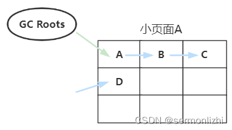

# 第06节 JVM详解ZGC垃圾收集器

从G1垃圾收集器开始，后面的垃圾收集器都不再将堆按照新生代和老年代作为整体进行回收，都采用了【局部收集】的设计思想。

可能是由于G1作为第一代局部收集的垃圾收集器，所以它继续保留了新生代和老年代的概念，笔者认为从局部收集和分区的内存布局来看，
按代收集理论已经没有什么特别存在的必要了。

## 一、ZGC的设计思路

### 1.1 ZGC的内存布局
新一代的垃圾收集器ZGC(Z Garbage Collector)就【完全抛弃了按代收集理论】，它与G1一样将内存划分成各个小的区域的，
但与G1有所不同的是，ZGC的各个内存区域称为【页面(Page或者ZPage)】，而且页面也不是全部大小相等。
ZGC按照页面大小将页面分为三类：【小页面】、【中页面】和【大页面】。

在x64的硬件平台上，ZGC的页面大小为：
- 小页面：
    容量固定为2MB，用于存放小于256KB的小对象
- 中页面：
    容量固定为32MB，用于存放大于等于256KB但小于4MB的对象
- 大页面：
    容量不固定，可以动态变化，但必须为2MB的整数倍，用于存放大于等于4MB的对象。
    【每个大页面只会存放一个大对象】，也就是虽然它叫大页面，但它的容量可能还没中页面大，最小容量为4MB。

ZGC的内存布局大概是下图这样：


ZGC对于不同页面的回收策略是不同的，简单说就是**小页面优先回收，中页面和大页面则尽量不回收**。

### 1.2 ZGC支持NUMA
在过去，对于X86架构的计算机，内存控制器还没有整合进CPU，所有对内存的访问都需要通过北桥芯片来完成。
X86系统中的所有内存都可以通过CPU进行同等访问。任何CPU访问任何内存的速度是一致的，不必考虑不同内存地址之间的差异，
这称为“统一内存访问”（Uniform Memory Access，UMA）。UMA系统的架构示意图如图所示。


在UMA中，各处理器与内存单元通过【互联总线】进行连接，各个CPU之间没有主从关系。
之后的X86平台经历了一场从“拼频率”到“拼核心数”的转变，越来越多的核心被尽可能地塞进了同一块芯片上，
各个核心对于内存带宽的争抢访问成为瓶颈，所以人们希望能够把CPU和内存集成在一个单元上（称Socket），
这就是非统一内存访问（Non-Uniform Memory Access，NUMA）。
很明显，在NUMA下，CPU访问本地存储器的速度比访问非本地存储器快一些。下图所示是支持NUMA处理器架构示意图。


ZGC是支持NUMA的，在进行小页面分配时会优先从【本地内存】分配，当不能分配时才会从【远端内存】分配。
对于中页面和大页面的分配，ZGC并没有要求从本地内存分配，而是直接交给操作系统，由操作系统找到一块能满足ZGC页面的空间。
ZGC这样设计的目的在于，对于小页面，存放的都是小对象，从本地内存分配速度很快，且不会造成内存使用的不平衡，
而中页面和大页面因为需要的空间大，如果也优先从本地内存分配，极易造成内存使用不均衡，反而影响性能。

## 二、染色指针
ZGC与G1不同的是在【回收整理】阶段，【G1需要STW】，而【ZGC可以进行并发回收】，即垃圾收集线程可以与应用程序线程同时工作。
但在并发整理阶段，如果应用程序要访问某个对象，而该对象被GC线程从原来的内存空间转移到了另一个块内存空间了，
那么对于应用程序来说，如何才能知道对象新的内存空间呢？

ZGC收集器有一个标志性的设计就是它采用【染色指针技术(Colored Pointer，也可以称为Tag Pointer或Version Pointer)】。
在之前如果想要在对象上存储一些额外的、只供垃圾收集器或虚拟机本身使用的数据，通常都会在对象头中添加额外的字段，
比如对象的哈希码、分代年龄、锁状态等。

对于垃圾收集而言，可能更多的关注的是对象的引用指针，比如三色标记，这些标记本质上就只和对象的引用有关，而与对象本身无关，
也就是某个对象只有它的引用关系能决定它存活与否，对象上的其他属性不无法影响它的存活判断。

HotSpot几种收集器的标记实现方案，有的把标记直接记录在对象头(如Serial)，有的把标记记录在与对象完成独立的数据结构上
(如G1采用BitMap的结构来记录标记信息，BitMap相当于堆内存大小的1/64)。
而ZGC的【染色指针】是最最直接的，直接把标记信息记在引用对象的指针上，这时，与其说可达性分析是遍历对象图来标记对象，
还不如说是遍历【引用图】来标记【引用】。

【染色指针】是一种直接将【少量额外的信息】存储到【指针】上的技术，那指针本身为什么可以存储额外信息呢？

这里面涉及到了虚拟地址空间的与物理地址的转换，先看一下ZGC中一个对象的引用指针包含了哪些信息。

在前面介绍对象内存布局的文章中讲过，在ZGC之前的虚拟机中，可以采用指针压缩技术，将35位以内的对象引用地址压缩到32位，
而ZGC中的染色指针就是要借助指针的bit位来存储额外信息，以下面的图为例：


【ZGC必须要在64bit的机器上才能运行】，其中使用【低42位】来【标识堆空间】，
然后借用几个高位来记录GC中的状态信息，分别为M0、M1、Remapped和一个预留字段，
因为对象的引用地址大于35bit，所以在ZGC中是无法使用压缩指针的。

正如图上所示，这个对象引用地址的64bit表示的是虚拟地址空间，并不是真实的物理地址空间，为什么这么设计呢？

想一下，在GC的过程中，指针中用于存储额外信息的bit位是变化的，也就是说对象的引用地址一直是在变化的，这怎么可能是物理空间的地址呢，
对程序来说，只要这个对象没有被移动，那么它的物理地址空间就一定是不变的，那么ZGC的对象引用地址一直在变，这里指的是对象的虚拟地址，
JVM怎么知道真实的物理地址空间呢？

这里面就涉及到了虚拟地址空间与物理地址空间的映射，不同层次的虚拟内存到物理内存的转换关系可以在硬件层面、操作系统层面以及软件进程层面来实现，
如何完成地址转换，是一对一、多对一还是一对多的映射，也可以根据实际需要来设计。

Linux/x86-64平台上的ZGC使用的是多重映射(Multi-Mapping)，即将多个不同的虚拟内存地址映射到同一个物理内存地址上，
这种多对一映射，意味着ZGC在虚拟地址中看到的地址空间要比实际的堆空间容量更大，因为在虚拟空间中，ZGC的对象占45bit，
而在物理内存空间中，只有其中的41bit表示内存地址。

有个多重映射，ZGC在GC过程中，不论M0、M1和Remapped对应的bit位怎么变化，它们对应的具体的对象的内存空间都是同一个。

下面可以通过一个例子演示Linux多视图映射，Linux中主要通过系统函数mmap完成视图映射。多个视图映射就是多次调用mmap函数，
多次调用的返回结果就是不同的虚拟地址。
```text
#include <stdio.h>
#include <stdlib.h>
#include <unistd.h>
#include <sys/mman.h>
#include <sys/types.h>
#include <fcntl.h>
#include <sys/stat.h>
#include <stdint.h>

int main()
{
    //创建一个共享内存的文件描述符
    int fd = shm_open("/example", O_RDWR | O_CREAT | O_EXCL, 0600);
    if (fd == -1) return 0;
    //防止资源泄露,需要删除。执行之后共享对象仍然存活,但是不能通过名字访问
    shm_unlink("/example");

    //将共享内存对象的大小设置为4字节
    size_t size = sizeof(uint32_t);
    ftruncate(fd, size);

    //3次调用mmap,把一个共享内存对象映射到3个虚拟地址上
    int prot = PROT_READ | PROT_WRITE;
    uint32_t *remapped = mmap(NULL, size, prot, MAP_SHARED, fd, 0);
    uint32_t *m0 = mmap(NULL, size, prot, MAP_SHARED, fd, 0);
    uint32_t *m1 = mmap(NULL, size, prot, MAP_SHARED, fd, 0);

    //关闭文件描述符
    close(fd);

    //测试,通过一个虚拟地址设置数据,3个虚拟地址得到相同的数据
    *remapped = 0xdeafbeef;
    printf("48bit of remapped is: %p, value of 32bit is: 0x%x\n", remapped, *remapped);
    printf("48bit of m0 is: %p, value of 32bit is: 0x%x\n", m0, *m0);
    printf("48bit of m1 is: %p, value of 32bit is: 0x%x\n", m1, *m1);

    return 0;
}
```
输出的结果如下：

从结果我们可以发现，3个变量对应3个不同的虚拟地址,但它们的真实物理内存地址都是一样。

实地址(32位指针)：
```text
0xdeafbeef <一位16进制代表4位二进制>
```
虚地址(48位指针):
```text
0x7f93aef8e000 <虚地址remapped>
0x7f93aef8d000 <虚地址m0>
0x7f93aef8c000 <虚地址m1>
```
但是因为它们都是通过mmap映射同一个内存共享对象，所以它们的物理地址是一样的，并且它们的值都是0xdeafbeef。

ZGC染色指针的三个bit位在GC过程中扮演着非常重要的作用，下面介绍ZGC的收集过程中会详细介绍各个bit位的作用。

## 三、ZGC垃圾收集流程

### 3.1 整体流程
ZGC的垃圾收集过程与G1有所不同，因为它支持并发整理，所以一次ZGC的垃圾收集过程主要包括两个阶段：【标记阶段】和【转移阶段】。
严格来说一次完整的GC过程需要跨越两次GC，即每一次GC会遗留一些问题，然后在下一次GC时处理，先看宏观上以下一次GC的流程，
大概如下图所示：


从ZGC完成的垃圾收集算法流程来说，ZGC分为三个阶段：
- 标记

    【从GC Roots出发，标记活跃对象】，此时内存中存在活跃对象和垃圾对象。

    在标记阶段，与G1基本相同，唯一的不同在于，在初始标记的时候，【G1只能单线程进行】，而ZGC为了追求性能，使用【多线程(多个GC线程)进行】。

    ZGC的再标记过程与G1的最终标记是一样，都是为了处理漏标对象，也是通过【原始快照(STAB)】算法解决，因为内存布局都是基于Region/Page。

- 转移
    
    将【活跃对象转移(复制)】到新的内存上，原来的内存空间可回收，在并发转移阶段准备阶段，如果发现某个页全部都是垃圾对象，
    直接在该过程就把这些区域全部回收了。

- 重定位

    因为活跃对象的地址发生了变化，所以所有指向对象老地址的指针需要调整到新的对象地址上。

### 3.2 标记阶段
上面已经讲了染色指针，通过M0、M1和Remapped来标记指针的状态，其中M0和M1主要用于区分连续的两次GC，
ZGC的整个GC过程涉及到两次连续的GC，并不是一次GC就把所有工作都做了。

下面我们给M0、M1和Remapped三种状态赋予不同的颜色，方便理解：


假设现在有四个对象，都在小页面(对象大小<2MB)A中，因为此时还没开始进行GC，所以所有引用的指针都处于Remapped状态


经过初始标记阶段后，对象A被GC Root引用，对象D被任何对象引用，A对象引用的指针颜色发生变化：


然后进行并发标记，并发标记过程中，将所有存活对象的指针状态全部改成M0，由于D对象不可达，所以它的指针颜色还是蓝色，
但在并发标记阶段，B对象又引用了一个新的对象E，因为是新的对象还没有被GC扫描过，所以指针颜色是蓝色：


而在重新标记阶段，根据原始快照(STAB)会从B对象继续开始扫描，然后把E对象的指针变为绿色：


至此标记阶段就完成，剩下的对象指针为Remapped的都是垃圾对象，转移阶段进行回收。

### 3.3 转移阶段
在并发转移阶段，会分析【最有价值的GC分页】，这个过程类似于G1筛选回收阶段的成本于收益比分析。

在初始转移阶段，只会转移初始标记的存活对象，同时做对象的重定位，假设小页面A的对象都要转移到小页面B中，
经过初始转移后，对象的位置及指针颜色如下：


因为A对象转移到新的页面时进行了重定位，所以A对象的指针状态变为Remapped蓝色。但对B对象的引用指针还是绿色。

然后进行并发转移，把B、C、E对象也都转移到小页面B中：


在并发转移阶段，只会把B、C、E对象转移到新的小页面B中，并不会修改它们对应的引用指针，也就是B对C的引用还指向原来小页面中的旧地址，
并没有对转移对象做重定位。

但对象既然转移了，那肯定需要根据之前旧的地址找到新的地址，所以每个页面都会维护一张转发表，这个转发表就记录了指针旧地址到新地址的映射。

**注：对象转移与转发表插入记录这是一个原子操作，要么都成功，要么都失败。**

至此ZGC的一次垃圾收集过程就结束了，但前面我们也说了，ZGC的整个垃圾收集流程是涉及到两次GC的。

### 3.3 重定位
在第一次GC的时候，只是用了M0，在第二次GC的时候，就会用到M1，这两个标志位就是为了区分两次不同的垃圾回收的。

在第一次GC完成和第二次GC开始的间隙，A对象又引用了一个新的对象F，如下图所示：


因为是一个新创建的对象，所以指针状态为Remapped。

当第二次GC开始，由于上一次GC使用M0来标识存活对象，那么这一次就采用M1来标识存活对象，然后经过初始标记后，对象A的引用就变成了红色：


然后进行并发标记，在并发标记的过程中，因为F对象的指针为蓝色，就将其直接改为红色。当对象A扫描引用B时，发现它的指针颜色为绿色，
状态为M0，它就会到原来的小页面A的【转发表】取到【对象B的新地址】进行重定位，然后再从转发表删除B指针的记录，
重定位和删除转发表同样也是原子操作。C对象和E对象的操作是一样，经过并发标记后，新的对象布局如下：


然后依次类推，下一次GC做标记时，在使用M0来标记存活对象。

为什么要把【重定向】放到下一次GC的并发标记过程来做呢？
```text
重定向需要遍历所有存活对象，而下一次GC并发标记的时候也需要遍历所有存活，
直接利用并发标记过程中遍历对象顺带做重定位减少一次扫描全部存活对象的开销，这样可以非常显著地提高垃圾收集性能。
```

## 四、ZGC的读屏障
上面介绍了并发标记阶段会进行【对象的重定位】以及【删除对应的转发表】，在ZGC中是通过读屏障来实现的。

读屏障就是JVM向应用程序代码中插入一小段代码的技术，当应用程序线程需要从堆中读取对象引用时，就会执行这段代码。

**注：仅从堆中读取对象引用时才会触发这段代码**


## 五、ZGC的GC时机

### 5.1 预热规则
服务刚启动时出现，一般不需要关注。日志中关键字是“Warmup”。

JVM启动预热，如果从来没有发生过GC，则在堆内存使用超过10%、20%、30%时，分别触发一次GC，以收集GC数据。


### 5.2 基于分配速率的自适应算法
最主要的GC触发方式（默认方式），其算法原理可简单描述为ZGC根据【近期的对象分配速率】以及【GC时间】，
计算出当内存占用达到什么阈值时触发下一次GC。通过ZAllocationSpikeTolerance参数控制阈值大小，该参数默认2，
数值越大，越早的触发GC。日志中关键字是Allocation Rate。


### 5.3 基于固定时间间隔
通过ZCollectionInterval控制，适合应对突增流量场景。

流量平稳变化时，自适应算法可能在堆使用率达到95%以上才触发GC。流量突增时，自适应算法触发的时机可能会过晚，导致部分线程阻塞。
我们通过调整此参数解决流量突增场景的问题，比如【定时活动】、【秒杀】等场景。

### 5.4 主动触发
类似于固定间隔规则，但时间间隔不固定，是ZGC自行算出来的时机，服务因为已经加了基于固定时间间隔的触发机制，
所以通过-ZProactive参数将该功能关闭，以免GC频繁，影响服务可用性。

### 5.5 阻塞内存分配请求触发
当垃圾来不及回收，垃圾将堆占满时，会导致部分线程阻塞。我们应当避免出现这种触发方式。日志中关键字是Allocation Stall。

### 5.6 外部触发
代码中显式调用System.gc()触发。 日志中关键字是System.gc()。

### 5.7 元数据分配触发
元数据区不足时导致，一般不需要关注。 日志中关键字是Metadata GC Threshold。

## 六、ZGC参数配置
ZGC优势不仅在于其超低的STW停顿，也在于其参数的简单，绝大部分生产场景都可以自适应。
当然，极端情况下，还是有可能需要对ZGC个别参数做个调整，大致可以分为三类：

- 堆大小：

    Xmx。当分配速率过高，超过回收速率，造成堆内存不够时，会触发Allocation Stall，这类Stall会减缓当前的用户线程。
    因此，当我们在GC日志中看到Allocation Stall，通常可以认为堆空间偏小或者concurrent gc threads数偏小。

- GC 触发时机：

    ZAllocationSpikeTolerance,ZCollectionInterval。

    ZAllocationSpikeTolerance 用来估算当前的堆内存分配速率，在当前剩余的堆内存下，ZAllocationSpikeTolerance 越大，
    估算的达到 OOM 的时间越快，ZGC 就会更早地进行触发 GC。

    ZCollectionInterval 用来指定 GC 发生的间隔，以秒为单位触发 GC。

- GC 线程：

    ParallelGCThreads，ConcGCThreads。

    ParallelGCThreads 是设置 STW 任务的 GC 线程数目，默认为 CPU 个数的 60%；

    ConcGCThreads 是并发阶段GC线程的数目，默认为CPU个数的12.5%。增加GC线程数目，可以加快GC完成任务，减少各个阶段的时间，
    但也会增加 CPU 的抢占开销，可根据生产情况调整。

由上可以看出 ZGC 需要调整的参数十分简单，通常设置 Xmx 即可满足业务的需求，大大减轻 Java 开发者的负担。
