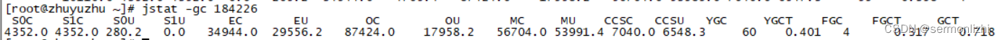

# 第07节 JVM调优工具

前面的文章已经介绍了JVM对象创建时的内存分配、类加载机制以及垃圾收集等核心的内容，对JVM的内存模型基本有了比较完整的了解。
但这些都只是理论，当程序运行遇到问题时，更多的时候是需要根据现象然后结合理论才能做出合理的判断。

而JDK就提供了很多的工具来帮助开发人员获取程序运行时的各种数据，包括异常堆栈、JVM运行日志、GC日志、线程快照文件、堆转储快照文件等等。

这篇文章就借助部分常用工具，结合具体的应用程序来查看程序运行过程中的各种数据，对这些数据进行分析，继而更好的调整JVM参数。

## 一、基础工具

### 1.1 jps
JPS(JVM Process Status Tool)用于查看虚拟机进程的状况的工具，名字与Unix的ps命令很想，功能也差不多，
可以列出正在运行的虚拟机进程，并显示虚拟机执行主类的名称以及这些进程的本地虚拟机唯一ID(lVMID,Local Virtual Machine Identifier)。
LVMID与操作系统的进程ID是一一对应，也可以通过ps命令查看虚拟机进程ID，但如果有多个虚拟机进程，
仅通过ps命令是无法区分每个进程对应哪个Java程序的，所以还是需要使用jps。

虽然该工具的功能比较单一，但它却是实际开发中用的最多的命令，它还提供了一些参数供选择。

JPS的命令格式如下：
```text
jps [options] [hostid]
```
如果不指定参数，输出信息如下：
```text
[root@lizhi ~]# jps
1892366 BrokerStartup
56755 Kafka
17540 NamesrvStartup
57652 ProdServerStart
```
主要选项如下：

| 选项	 | 作用                            |
|-----|-------------------------------|
| -q	 | 只输出JVM的进程ID，忽略主类的名称           |
| -m	 | 输出JVM进程启动时传递给main()函数的参数      |
| -l	 | 输出主类的全名，如果进程执行的是JAR包，则输出JAR路径 |
| -v	 | 输出虚拟机进程启动时的JVM参数              |
以-l参数为例，输出信息如下：
```text
[root@lizhi ~]# jps -l
1892366 org.apache.rocketmq.broker.BrokerStartup
56755 kafka.Kafka
17540 org.apache.rocketmq.namesrv.NamesrvStartup
57652 play.core.server.ProdServerStart
```

Jps的第二个参数表示可以查看远程服务器的JVM进程状态，如果不指定就输出当前服务器上JVM的进程，
但查看的远程主机需要开启jstatd，以linux系统为例：
```text
1) 在$JAVA_HOME的/bin目录下创建一个jstatd.all.policy文件(也可以在别的地方创建，执行的时候需要全限定文件名)

2) 配置文件内容:

    如果是JDK9以下的版本，文件内容如下：
        grant codebase "file:${java.home}/../lib/tools.jar" {   
            permission java.security.AllPermission;
        };

    如果是JDK9以上的版本，由于没有tools.jar，需要进行如下配置：
        grant codebase "jrt:/jdk.jstatd" {
            permission java.security.AllPermission;
        };
        grant codebase "jrt:/jdk.internal.jvmstat" {    
            permission java.security.AllPermission;    
        };

3) 启动jstatd:

    // 如果jstatd.all.policy文件不在bin目录下就需要指定全限定名
    jstatd -J-Djava.security.policy=jstatd.all.policy

    如果依然连不上，可以再把jstatd的服务器ip配置上:
        jstatd -J-Djava.security.policy=jstatd.all.policy -J-Djava.rmi.server.hostname=120.79.221.x

    如果不指定端口，默认就是1099端口，如果要指定端口，可以根据-p指定端口:
        jstatd -J-Djava.security.policy=jstatd.all.policy -J-Djava.rmi.server.hostname=120.79.221.x -p 1100

    然后在另外一台服务器，就可以通过jps命令来查看该服务器上虚拟机进程状态：
        [root@zhuyuzhu /]# jps -l 120.79.221.x
        1892366 org.apache.rocketmq.broker.BrokerStartup
        56755 kafka.Kafka
        17540 org.apache.rocketmq.namesrv.NamesrvStartup
        57652 play.core.server.ProdServerStart
```
注：后面介绍的可视化工具，只要需要进行远程监控，都需要开启jstatd

### 1.2 jmap
Jmap(Memory Map for Java)命令可以用来生成堆转储快照，一般称为heap dump或dump文件。
对于dump文件，除了通过jmap命令获取外，还可以通过配置JVM参数【-XX:+HeapDumpOnOutOfMemoryError】，
当虚拟机在出现内存溢出之后生成堆转储快照文件，还可以通过参数【-XX:HeapDumpPath】配置dump文件路径。

jmap命令除了可以生成【堆的快照文件】外，还可以查询【堆和方法区详细信息】、【finalize执行队列】等。

jmap的命令格式如下：
```text
jmap [option] vmid
```
详细的参数选项介绍如下：

| 选项	            | 作用                                                                                    |
|----------------|---------------------------------------------------------------------------------------|
| -dump	         | 生成Java堆快照。格式为jmap -dump:[live],format=b,file= pid;其中live表示只dump出存活的对象，format=b表示二进制文件 |
| -finalizeinfo	 | 显示在F-Queue中等待Finalizer线程执行finalize方法的对象                                               |
| -heap	         | 显示Java堆详细信息，如使用哪种回收期、参数配置等                                                            |
| -histo	        | 显示堆中的对象统计信息，包括类、实例数量、合计容量等                                                            |
| -permstat	     | 以ClassLoader为统计口径显示永久代内存状态                                                            |
| -F	            | 当JVM进程对-dump选项没有响应时，可以通过这个选项强制生成dump快照                                                |

#### 1.2.1 查看堆信息
```text
[root@zhuyuzhu /]# jmap -heap 184226
Attaching to process ID 184226, please wait...
Debugger attached successfully.
Server compiler detected.
JVM version is 25.302-b08

using thread-local object allocation.
Mark Sweep Compact GC

Heap Configuration:
MinHeapFreeRatio         = 40
MaxHeapFreeRatio         = 70
MaxHeapSize              = 134217728 (128.0MB)
NewSize                  = 44695552 (42.625MB)
MaxNewSize               = 44695552 (42.625MB)
OldSize                  = 89522176 (85.375MB)
NewRatio                 = 2
SurvivorRatio            = 8
MetaspaceSize            = 21807104 (20.796875MB)
CompressedClassSpaceSize = 1073741824 (1024.0MB)
MaxMetaspaceSize         = 17592186044415 MB
G1HeapRegionSize         = 0 (0.0MB)

Heap Usage:
New Generation (Eden + 1 Survivor Space):
capacity = 40239104 (38.375MB)
used     = 22749192 (21.69532012939453MB)
free     = 17489912 (16.67967987060547MB)
56.53503616780334% used
Eden Space:
capacity = 35782656 (34.125MB)
used     = 21525928 (20.528724670410156MB)
free     = 14256728 (13.596275329589844MB)
60.157434931604854% used
From Space:
capacity = 4456448 (4.25MB)
used     = 1223264 (1.166595458984375MB)
free     = 3233184 (3.083404541015625MB)
27.449304917279413% used
To Space:
capacity = 4456448 (4.25MB)
used     = 0 (0.0MB)
free     = 4456448 (4.25MB)
0.0% used
tenured generation:
capacity = 89522176 (85.375MB)
used     = 26558864 (25.328506469726562MB)
free     = 62963312 (60.04649353027344MB)
29.667357504804173% used

22978 interned Strings occupying 2364008 bytes.
```
在JDK11中，-heap、-F等选项已经被移除了，新的命令如下：
```text
[root@lizhi bin]# jmap -help
Usage:
jmap -clstats <pid>
to connect to running process and print class loader statistics
jmap -finalizerinfo <pid>
to connect to running process and print information on objects awaiting finalization
jmap -histo[:live] <pid>
to connect to running process and print histogram of java object heap
if the "live" suboption is specified, only count live objects
jmap -dump:<dump-options> <pid>
to connect to running process and dump java heap
jmap -? -h --help
to print this help message

    dump-options:
      live         dump only live objects; if not specified,
                   all objects in the heap are dumped.
      format=b     binary format
      file=<file>  dump heap to <file>

    Example: jmap -dump:live,format=b,file=heap.bin <pid>
```

#### 1.2.2 统计实例信息
// 统计所有实例
jmap -histo 184226

// 统计存活的实例，执行过程中可能会发生一次Full GC
jmap -histo:live 184226

统计信息如下：
```text
[root@zhuyuzhu /]# jmap -histo:live 184226 > jmap.txt
[root@zhuyuzhu /]# more jmap.txt

num     #instances         #bytes  class name
----------------------------------------------
1:         51392        5603816  [C
2:         13901        5128088  [I
3:         51220        1229280  java.lang.String
4:         13680        1203840  java.lang.reflect.Method
5:         37444        1198208  java.util.concurrent.ConcurrentHashMap$Node
```
注意：[C is a char[]，[S is a short[]，[I is a int[]，[B is a byte[]，[[I is a int[][]]

#### 1.2.3 dump堆快照
```text
[root@zhuyuzhu /]# jmap -dump:live,format=b,file=heap.dump 184226
Dumping heap to /heap.dump ...
Heap dump file created
[root@zhuyuzhu /]# more heap.dump
JAVA PROFILE 1.0.2 have an 'contextConfigLocations' init-param set?bjectHandlerPreJDK9iatedva/lang/Class<*>;[Lorg/springframework/core/ResolvableType;)Lorg/springframework/core/ResolvableType;tryException;ooter[Lcom/fasterxml/jackson/databind/DeserializationFeature;)Lcom/fasterxml/jackson/databind/DeserializationConfig;che/xerces/internal/util/MessageFormatterion;<*>;Ljava/lang/Class<*>;)Vs,isGetters=%s,setters=%s,creators=%s)rs$CalendarToLocalDateTimeConverter
```
dump出来的快照文件需要借助一些工具来进行解析，比如JDK自带的jvisualvm，或者第三方工具，比如：MemoryAnalyzer等

### 1.3 jstack
jstack(Stack Trace for Java)命令用于生成虚拟机当前时刻的线程快照，一般称为thread dump或javacore文件，
注意与jmap -dump 区分，后者是生成堆的快照，
jstack生成的是当前虚拟机内每一条线程正在执行的方法堆栈集合，
生成线程快照的目的是为了定位线程出现长时间停顿的原因，比如线程间死锁、死循环等。

线程出现停顿时就可以通过jstack来查看各个线程的调用堆栈，就可以知道没有响应的线程到底在后台做什么。

jstack的命令格式如下：
```text
jstack [option] vmid
```
相关选项如下：

| 选项	 | 作用                      |
|-----|-------------------------|
| -F	 | 当正常的输出的请求不被响应时，强制输出线程堆栈 |
| -l	 | 除线程堆栈外，显示关于锁的附加信息       |
| -m	 | 如果调用本地方法，可以显示C/C++的堆栈   |

#### 1.3.1 检查死锁
下面程序的两个线程，线程1获取了lock1对象锁，等待获取lock2对象锁，但线程2获取了lock2对象锁，等待获取lock1对象，
两个线程处于相互等待的状态(死锁)，启动程序，然后根据jstack来分析这两个线程。
```text
public class DeadLockTest {

    private static Object lock1 = new Object();
    private static Object lock2 = new Object();

    public static void main(String[] args) {
        new Thread(() -> {
            synchronized (lock1) {
                try {
                    System.out.println("thread1 begin");
                    Thread.sleep(5000);
                } catch (InterruptedException e) {
                }
                synchronized (lock2) {
                    System.out.println("thread1 end");
                }
            }
        }).start();

        new Thread(() -> {
            synchronized (lock2) {
                try {
                    System.out.println("thread2 begin");
                    Thread.sleep(5000);
                } catch (InterruptedException e) {
                }
                synchronized (lock1) {
                    System.out.println("thread2 end");
                }
            }
        }).start();

        System.out.println("main thread end");
    }
}
```
通过jps查看程序对应的进程ID:
```text
C:\Users\Administrator>jps
14608 DeadLockTest
```
通过jstack输出的线程堆栈信息如下：
```text
C:\Users\Administrator>jstack 14608
2022-05-21 16:26:37
Full thread dump Java HotSpot(TM) 64-Bit Server VM (25.301-b09 mixed mode):

"DestroyJavaVM" #13 prio=5 os_prio=0 tid=0x000001a0921d4800 nid=0x463c waiting on condition [0x0000000000000000]
java.lang.Thread.State: RUNNABLE

"Thread-1" #12 prio=5 os_prio=0 tid=0x000001a0abda7800 nid=0x1c48 waiting for monitor entry [0x00000004c75ff000]
java.lang.Thread.State: BLOCKED (on object monitor)
at com.example.DeadLockTest.lambda$main$1(DeadLockTest.java:36)
- waiting to lock <0x000000078134c010> (a java.lang.Object)
- locked <0x000000078134c020> (a java.lang.Object)
at com.example.DeadLockTest$$Lambda$2/1104106489.run(Unknown Source)
at java.lang.Thread.run(Thread.java:748)

"Thread-0" #11 prio=5 os_prio=0 tid=0x000001a0abda5000 nid=0x39dc waiting for monitor entry [0x00000004c74ff000]
java.lang.Thread.State: BLOCKED (on object monitor)
at com.example.DeadLockTest.lambda$main$0(DeadLockTest.java:23)
- waiting to lock <0x000000078134c020> (a java.lang.Object)
- locked <0x000000078134c010> (a java.lang.Object)
at com.example.DeadLockTest$$Lambda$1/2047329716.run(Unknown Source)
at java.lang.Thread.run(Thread.java:748)
```
其中Thread-1表示线程名称，prio表示线程在JVM的优先级，os_prio表示线程在操作系统中的优先级，tid表示线程ID，
nid表示JVM线程对应的本地线程标识(也就是操作系统线程标识)。

从输出信息可以很明确的看出Thread-0和Thread-1都处于BLOCKED阻塞状态，其中Thread-0锁住了0x000000078134c010，
然后等待去锁0x000000078134c020，而Thread-1锁住了0x000000078134c020，然后等待去锁0x000000078134c010，
然后两个线程就都处于相互等待状态。

对于这种简单的死锁，jstack工具还可以直接显示检测除了一个死锁：
```text
Java stack information for the threads listed above:
===================================================
"Thread-1":
at com.example.DeadLockTest.lambda$main$1(DeadLockTest.java:36)
- waiting to lock <0x000000078134c010> (a java.lang.Object)
- locked <0x000000078134c020> (a java.lang.Object)
at com.example.DeadLockTest$$Lambda$2/1104106489.run(Unknown Source)
at java.lang.Thread.run(Thread.java:748)
"Thread-0":
at com.example.DeadLockTest.lambda$main$0(DeadLockTest.java:23)
- waiting to lock <0x000000078134c020> (a java.lang.Object)
- locked <0x000000078134c010> (a java.lang.Object)
at com.example.DeadLockTest$$Lambda$1/2047329716.run(Unknown Source)
at java.lang.Thread.run(Thread.java:748)

Found 1 deadlock.
```

#### 1.3.2 查找导致CPU占用过高的线程信息
在开发中，有时候可能会遇到某个JVM进程的CPU占用率特别高，这个时候也可以通过jstack来找出导致CPU占用过高的线程。

以下面的代码为例：
```text
public class Math {

    public int compute() { 
        int a = 4;
        int b = 5;
        int c = (a + b) * 6;
        return c;
    }

    public static void main(String[] args) {
        Math math = new Math();
        while (true){
            math.compute();
        }
    }
}
```
在服务器创建一个Math.java文件，通过javac编译后执行：
```text
[root@zhuyuzhu test]# javac Math.java
[root@zhuyuzhu test]# java Math
```
先通过【top命令】查看所有线程占用CPU的情况：


可以发现，进程ID为185399的JVM进程占用的CPU异常的高，然后通过top -p <pid>来显示该JVM进程的内存占用情况：


接下来就要查看在该JVM进程中，是哪个线程导致的CPU占用过高，在内存占用页面按H就可以看到该JVM进程下的线程情况：


由图可见，线程PID为185400的线程占用的CPU最高，该线程ID是JVM的线程ID，需要将其转换为操作系统的线程ID，即将185400转换为16进制，nid为2d438。

然后执行jstack的命令就可以查看该线程的堆栈情况：
```text
// 得到线程堆栈信息中 2d438 这个线程所在行的后面10行，从堆栈中可以发现导致cpu飙高的调用方法
jstack -F 185400 |grep -A 10 2d438
```
然后程序运行的地址就会打印出线程的堆栈信息


从图中可以明显看出来导致CPU过高是由于Math类的main方法所致。

### 1.4 jinfo
jinfo(Configuration Info for Java)的作用是可以实时的查看和调整JVM各项参数。
使用jps -v命令可以查看【JVM进程启动时指定的参数】，但是如果想查看未被指定参数的【系统默认值】，就可以使用jinfo -flag命令进行查询。

jinfo的语法与其他工具的语法是一样的，查看JVM参数：
```text
[root@zhuyuzhu ~]# jinfo -flags 184226
Attaching to process ID 184226, please wait...
Debugger attached successfully.
Server compiler detected.
JVM version is 25.302-b08
Non-default VM flags: -XX:CICompilerCount=2 -XX:+HeapDumpOnOutOfMemoryError -XX:InitialHeapSize=134217728 -XX:MaxHeapSize=134217728 -XX:MaxNewSize=44695552 -XX:MinHeapDeltaBytes=196608 -XX:NewSize=44695552 -XX:OldSize=89522176 -XX:+UseCompressedClassPointers -XX:+UseCompressedOops -XX:+UseFastUnorderedTimeStamps
Command line:  -Xms128m -Xmx128m -XX:+HeapDumpOnOutOfMemoryError
```
还可以查看某个参数的值：
```text
[root@zhuyuzhu ~]# jinfo -flag CICompilerCount  184226
-XX:CICompilerCount=2
```
还可以通过-flag [+|-] name或-flag name=value命令在JVM进程运行过程中，动态修改部分参数(运行期间可写的虚拟机参数值)。

还可以通过-sysprops命令把虚拟机进程中的System.getProperties()的内容打印出来
```text
[root@zhuyuzhu ~]# jinfo -sysprops 184226
Attaching to process ID 184226, please wait...
Debugger attached successfully.
Server compiler detected.
JVM version is 25.302-b08
java.runtime.name = OpenJDK Runtime Environment
java.vm.version = 25.302-b08
sun.boot.library.path = /usr/lib/jvm/java-1.8.0-openjdk-1.8.0.302.b08-0.el8_4.x86_64/jre/lib/amd64
java.protocol.handler.pkgs = org.springframework.boot.loader
java.vendor.url = https://www.redhat.com/
```

### 1.5 Jstat
jstat(Java Statistics Monitoring Tool)是用于监视虚拟机各种运行状态信息的工具，它可以显示本地或远程JVM进程中的类加载、
内存、垃圾收集、即时编译等运行时数据，该工具提供的监视选项是非常丰富的，通常对JVM的优化主要根据jstat提供的检测数据。

jstat的命令格式如下：
```text
jstat -<option> [-t] [-h<lines>] <vmid> [<interval> [<count>]]
```
其中-t表示时间戳列显示为输出的第一列，-h<lines>表示标题行之间的样本数，也就是每lines行记录都会显示一行标题

interval表示前面命令查询的时间间隔，单位为毫秒或秒，默认为毫秒，count表示要指定多少次查询。

比如要查询JVM进程184226每200ms的垃圾收集情况，一共查询10次，显示时间戳，并且每5行显示以下标题，命令如下：
```text
jstat -gc -t -h 5 184226 200 10
```
打印的内容如下所示：


#### 1.5.1 选项列表
jstat工具提供了非常丰富的选择，主要的选项如下所示：

| 选项	                | 作用                                                         |
|--------------------|------------------------------------------------------------|
| -class	            | 监视类加载、卸载数量、总空间以及类装载所耗费的时间                                  |
| -gc	               | 监视Java堆状况，包括Eden区、两个Survivor区、老年代、元空间等的容量，以及空间，垃圾收集时间合计等信息 |
| -gccapacity	       | 监视内容与-gc基本相同，但主要关注Java堆各个区域使用到的最大值和最小值                     |
| -gcutil	           | 监视内容与-gc基本相同，但主要关注已使用空间占总空间的百分比                            |
| -gccause	          | 与-gcutil功能一样，但会额外输出导致上一次垃圾收集的原因                            |
| -gcnew	            | 监视新生代垃圾收集状况                                                |
| -gcnewcapacity	    | 监视内容与-gcnew基本相同，但主要关注使用到的最大空间和最小空间                         |
| -gcold	            | 监视老年代垃圾收集状况                                                |
| -gcoldcapacity	    | 监视内容与-gcold基本相同，但主要关注使用到的最大空间和最小空间                         |
| -gcpermcapaticy	   | 输出永久代使用到的最小、最大空间                                           |
| -complier	         | 输出即时编译器编译过的方法、耗时等信息                                        |
| -printcompilation	 | 输出已经被即时编译的方法                                               |

#### 1.5.2 参数说明

##### 垃圾回收统计

从参数名称就可以看出来各个参数的含义，以C结尾的表示总空间大小，以U结尾的表示使用的空间大小，比如S0C表示Survivor0区的总空间，
单位KB，S0U表示Survivor0区已经使用的空间大小。

M*表示元空间，CCS表示压缩类空间，YGC表示年轻代GC次数，YGCT表示年轻代垃圾回收消耗时间(总时间)，单位s，
GCT表示所有垃圾消耗总时间。

##### 堆内存统计

NGCMN表示新生代最小空间，NGCMX表示新生代最大空间，NGC表示当前新生代容量。

OGCMN表示老年代最小空间，其他参数类似新生代。

*MN表示最小值，*MX表示最大值，其他的参数与垃圾回收中的指标一样。

其他选项就不一一列举了，根据参数名称基本就可以看出来表示是哪块区域。

## 二、可视化工具
除了上面这些基本的命令行工具外，JDK在windows系统还提供了可视化的工具，主要有JConsole、JHSDB、VisualVM和JMC四个工具。
这些工具可以看作是对基本的命令行工具的封装，并且比之前的老工具更好用、更强大。

### 2.1 JConsole
在命令行下输入jconsole就会弹出JConsole的管理台，既可以选择本地的JVM进程，还可以选择服务器上的JVM进程，但连接远程服务器，
需要远程服务器启动jstat以及配置对JMX的支持。


选择一个JVM进程后，可以动态查看JVM中堆内存、类加载、线程以及CPU的使用情况


### 2.2 VisualVM
在命令行输入jvisualvm命令就可以启动VisualVM的控制台，从控制台可以看到本地所有的JVM进程，还可以连接连接远程服务器，
查看远程服务器上的JVM进程状态。


从VisualVM控制台中也可以看到堆内存等的变化情况


对于线程状态的监控，它还可以自动检测线程死锁


抽样器还可以CPU或内存的占用情况，可以分析停顿线程导致停顿的原因等


除了上面这些，VisualVM还可以导入堆快照的heap dump文件进行分析
