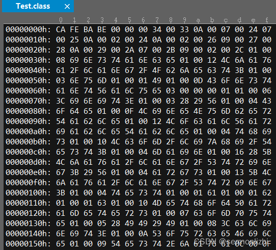
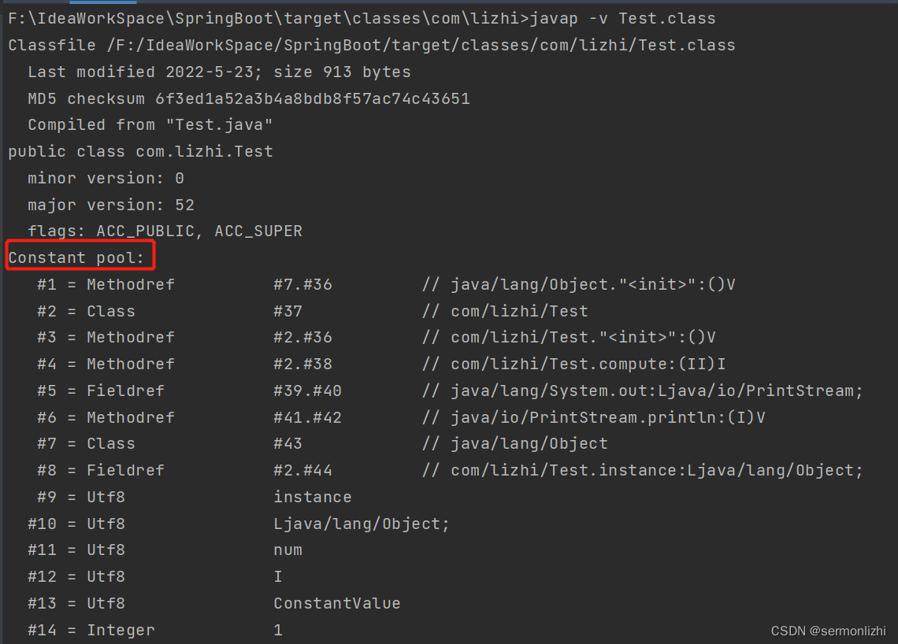
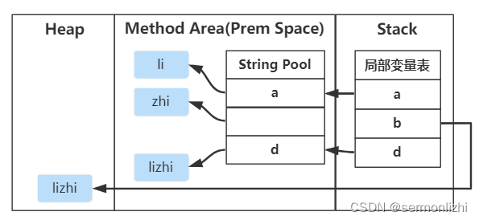
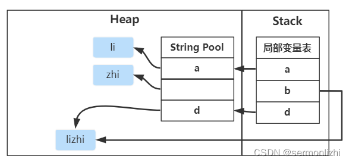

# 第08节 JVM的常量池

在《JVM类加载机制》和《JVM内存模型》这两篇文章都对常量池和运行时常量池做了不少介绍，这篇文章再次聚焦常量池，
搞清楚常量池到底都有什么。

## 一、静态常量池与运行时常量池
【静态常量池】也可以称为【Class常量池】，也就是每个.java文件经过编译后生成的.class文件，每个.class文件里面都包含了一个常量池，
因为这个常量池是【在Class文件里面定义】的，也就是.java文件编译后就不会在变了，也不能修改，所以称之为静态常量池。

以下面的Test.java文件为例：
```text
public class Test {
    public static Object instance = new Object();
    public static final int num = 1;

    public static void main(String[] args) {
        Test test = new Test();
        int a = 4;
        int b = 5;
        int c = test.compute(a,b);
        System.out.println(c);
    }

    public int compute(int a,int b){
        return a * b - num;
    }
}
```
经过编译后得到Test.class文件，打开Class文件，里面全部是【16进制】的字符：


虽然看着比较乱，但这个Class文件是有一定规则的，可以进行解析，比如前面4个字节为CAFEBABE，这是一个魔数，
每个Class文件都是以这个魔数开始，可以看作是Class文件的标识符；
后面两个字节0000表示次版本号，紧跟着的两个字节0034表示主版本号，转换为十进制是52，表示JDK1.8。

但这样一个文件，是给JVM解析的，对于开发人员来说就不算友好了，不过JDK也提供了工具可以把Class文件转换成开发人员能看懂的信息。
```text
javap -v Test.class
```
通过上面的命令可以将Class文件的16进制转换成可读文件显示


转换后的信息，可以看到里面包含了Test类中用到的各种类以及变量的常量信息，比如常量num和常量对应的值1。
第一行Methodref表示这是一个方法引用，#7.#36表示由这两个序号对应的常量组成。
```text
#15 = Utf8               <init>
#16 = Utf8               ()V
……
#36 = NameAndType        #15:#16        // "<init>":()V
```
在程序运行的时候，JVM会把Test.class加载进内存，然后在【解析阶段】会把Class中的【符号引用】转化成【直接引用】。

这些【直接引用】就是在内存的【运行时常量池】中，运行时常量池除了包含【类的相关信息】外，还有【字符串常量池】等，
运行时常量池与静态常量池最大的区别就在于运行时常量池里面的数据会随着程序的运行有所变动。

## 二、字面量与符号引用

### 2.1 字面量
字面量是指由字母、数字等构成的字符串或者数值常量。

字面量就是给变量赋予的一个常量值，比如上面的Test类中，num = 1的1就是一个字面量。

再比如下面的例子，等号右边的值都是字面量
```text
int a = 2;
int b = 90;
String c = "Hello World";
String d = "lizhi";
```

### 2.2 符号引用
【符号引用】是【编译原理】中的概念，是相对于直接引用来说的。

主要包括了以下三类常量：
```text
类和接口的全限定名
字段的名称和描述符
方法的名称和描述符
```
比如Test类中的instance、num都是字段名称，就是一种符号引用，还有常量池中的com/lizhi/Test就是类的全限定名，
main和test是方法名，()V是一种UTF8格式的描述符，这些统统都是符号引用。

这些常量池现在是静态信息，只有到运行时被加载到内存后，这些符号才有对应的内存地址信息，这些常量池一旦被装入内存就变成运行时常量池，
对应的符号引用在程序加载或运行时会被转变为被加载到内存区域的代码的【直接引用】，也就是【动态链接】。

例如，test()这个符号引用在运行时就会被转变为test()方法具体代码在内存中的地址，主要通过【对象头里的类型指针】去转换直接引用。

## 三、字符串常量池
字符串常量池是Java运行时常量池比较特殊的一块空间，在JDK7以后，字符串常量池的内存区域从之前的【永久代】就移动了【堆】内存，
也就是【逻辑上】字符串常量池是运行时常量池，属于【方法区】的一部分，但【实际】的内存区域是【堆】空间。

到了JDK8以后取消了永久代，取而代之的是【元空间(方法区)】，元空间使用的【直接内存(堆外内存)】，里面包含了运行时数据区，
但【运行时数据区的常量以及字符串常量池】是在【堆】中的，这一块需要区分清楚。

### 3.1 字符串长常量池的设计思想
字符串属于引用类型，但是在Java中字符串的使用频率与基本数据类型差不多，甚至更高。如果与其他的引用类型一样，
每个字符串都分配大量的额外空间，会导致时间和空间的双重浪费，同时也会极大地影响程序的性能。

JVM为了提供性能和减少字符串引用类型的【内存开销】，在实例化字符串常量的时候做了大量的优化：
```text
为字符串开启了一块独立的内存空间，【字符串常量池】，类似于缓冲区
创建字符串常量时，首先查询字符串常量池中是否存在该字符串(equal)
如果存在该字符串，直接返回引用实例；如果不存在，实例化该字符串并放入常量池中
```

### 3.2 字符串创建与内存分配
下面基于JDK8(JDK7以上均可)演示三种创建字符串的方法，以及分析每种方式对应的实例如何存放在内存中。

#### 3.2.1 直接赋值
```text
// a指向常量池中的引用
String a = "lizhi";
```
通过这种字面量创建的方式，字符串引用只会在常量池中。

因为这是一个字符串字面量，所以创建对象a的时候，JVM会先去常量池中通过equal(key)方法，判断是否有相同的对象。

如果有，则直接返回该对象在字符串常量池中的引用；

如果没有，则会在常量池中创建一个新对象，再返回引用。

#### 3.2.2 通过new关键字
```text
// a指向堆中的引用
String a = new String("lizhi");
```
通过new关键字创建的字符串引用，字符串常量池和堆内存都会有这个对象，没有就创建，最后返回的是堆内存中的对象引用。

因为有lizhi这个字面量，所以会先去检查字符串常量池中是否存在该字符串

如果不存在，就直接先在字符串常量池中创建一个字符串对象，然后再去堆内存中创建一个字符串对象lizhi；

如果存在，就直接去堆内存创建一个字符串对象，内容为lizhi；

最后将堆内存的字符串引用返回。

#### 3.2.3 intern方法
```text
String a = new String("lizhi");
String b = a.intern();

System.out.println(a == b); // 结果为false
```
先通过new关键字创建创建一个字符串对象，此时字符串常量池和堆内存空间都有一个lizhi的字符串引用。

然后调用intern()方法，需要注意的是该方法是String类的本地方法，部分注释如下：
```text
When the intern method is invoked, 
if the pool already contains a string equal to this String object as determined by the equals(Object) method, 
then the string from the pool is returned. Otherwise, 
this String object is added to the pool and a reference to this String object is returned.
It follows that for any two strings s and t, s.intern() == t.intern() is true 
if and only if s.equals(t) is true
```
从注释中可以比较清楚地看到，当调用intern()方法时，会判断字符串常量池中是否有该对象的引用，
通过equal()方法判断，如果存在就返回字符串常量池中的对象引用。

如果不存在，就把当前字符串对象直接添加到字符串常量池中，注意这里说的把该字符串对象添加到常量池池，是指把堆中对象的引用添加到常量池，
并不是在常量池中再创建一个该字符串的对象，然后返回该对象的引用。
```text
// 123不存在存在常量池中，注意a == b的结果
public class Test {

    public static void main(String[] args) {
        String f = "12";
        String a = f + "3";
        String b = g.intern();

        System.out.println(a == b); // true 原理如上
    }
}
```
对比
```text
// 123已经存在常量池中，注意g == h的结果
public class Test {

    public static void main(String[] args) {
        String a = "123";
        String b = "123";
        String c = "12" + "3";
        String f = "12";
        String g = f + "3";
        String h = g.intern();
        String d = new String("123");
        String e = d.intern();

        System.out.println(a == b); // true a,b都指向字符串常量池中的常量123
        System.out.println(a == c); // true 编译后“12” + “3”变成“123”，c也指向字符串常量池中的123
        System.out.println(a == d); // false d指向堆中的String字符串对象，String字符串指向了字符串常量池中的123
        System.out.println(a == g); // false g在运行时才计算出“12”+“3” = “123”，在堆中，和字符串常量池中的123不是同一个对象
        System.out.println(a == h); // true intern方法直接判断字符串常量池中有没有g的值123，有则将字符串常量池中的123引用给h
        System.out.println(a == e); // true 原理同上
        System.out.println(d == e); // false e指向字符串常量池中123，d指向堆中的String字符串对象，String字符串指向了字符串常量池中的123，
    }
}
```

### 3.3 字符串常量池设计
字符串常量池底层是由C++实现的，是一个类似于HashTable的数据结构，实质上保存的是字符串对象的引用。

下面通过一个例子来具体分析一下intern()方法的底层实现：
```text
public static void main(String[] args) {
    String a = "li";
    String b = a + "zhi";
    String d = b.intern();
    // 结果为true
    System.out.println(b == d);
}
```
在上面这个例子中，对象a是字符串常量池中li的引用，对象b是堆内存中lizhi的引用，此时字符串常量池中并没有lizhi这个字符串。

当调用对象b的intern()方法时，先去字符串常量池中检查，发现没有相等的字符串，然后就把【对象b的引用加入到字符串常量池】中，
所以对象b和对象d对应的是同一个引用，所以结果为true。

但需要注意，只有在JDK1.7以上的版本中，上面代码的执行结果采用true，如果在JDK1.6(包含)一下的版本，结果就为false，大概示意图如下。

JDK1.6:


JDK1.8:


intern()方法在JDK1.6以后随着字符串常量池移到了堆空间，整个实现也发生了变化，
主要体现在当字符串常量池中没有指定的字符串时，JDK1.6会单独在字符串常量池创建一个对象，
而在JDK1.6以后，直接将堆内存的对象引用放入到了字符串常量池中。

### 3.4 案例分析
下面通过几个例子来加深对String以及字符串常量池的理解

#### 3.4.1 编译合并
```text
String a = "lizhi";
String b = "lizhi";
String c = "li" + "zhi";
// 结果均为true
System.out.println(a == b);
System.out.println(a == c);
```
对于对象a和对象b，都是直接通过字面量来创建字符串对象，所以这两个对象对应的都是字符串常量池的对象引用，
而对象c，虽然是通过+进行连接，但相连的两个字符串都是字面量，在编译期是可以确定的，所以编译器会将这两个字面量进行合并。
即在Class文件的常量池中，就只有字面量lizhi，而没有li和zhi这两个字面量。

综上所述，上面三个对象都是用的是字符串常量池的引用。

#### 3.4.2 编译期无法合并引用
```text
String a = "lizhi";
String b = new String("lizhi");
String c = "li" + new String("zhi");
// 结果均为false
System.out.println(a == b);
System.out.println(a == c);
System.out.println(b == c);
```
对象a的引用是字符串常量池中的引用，对象b是堆内存中的对象引用，而对象c由于new String()创建的字符串不是常量或字面量，
在编译期间无法确定，所以new String()创建的字符串不会放入到常量池，自然也就没法在编译期进行合并了，
然后在运行时通过append在堆内存创建一个新的对象。

再比如下面的例子：
```text
String a = "lizhi";
String b = "li";
String c = b + "zhi";
// 结果为false
System.out.println(a == c);
```
由于在编译期对象b是符号引用，无法确定，所以对象c也没法在编译期进行合并，只能运行时在堆中创建li对象然后通过append拼接zhi。

但是，如果对象b是一个常量，在编译期会被解析成常量值的一个本地拷贝存储到常量池中，比如下面的例子：
```text
String a = "lizhi";
final String b = "li";
String c = b + "zhi";
// 结果为true
System.out.println(a == c);
```
与上面例子唯一的不同就在于对象b变成了一个常量，这在编译期是可以确定。

## 四、包装类与对象池
Java中八种基本数据类型的包装类基本都实现了【缓存技术】，目的也是为了避免重复创建多余的引用，
这其中就包含Byte、Short、Integer、Long、Character、Boolean，
而另外两种包装类型Float和Double则没有实现常量池技术，
原因在于这两种数据类型的数值是很随意的，就算有常量池命中率也不会高，还浪费额外的堆内存。
```text
Integer a = 127;
Integer b = 127;
// 结果为true
System.out.println(a == b);

Integer c = 128;
Integer d = 128;
// 结果为false
System.out.println(c == d);

Integer e = new Integer(127);
Integer f = new Integer(127);
// 结果为false
System.out.println(e == f);
```
对于上面的结果，这种通过通过字面量的方式赋值，其实在C++底层都是调用的Integer.valueOf(127)，
而这里面就是用到了Integer的缓存池，源码如下：
```text
public static Integer valueOf(int i) {
    if (i >= IntegerCache.low && i <= IntegerCache.high)
        return IntegerCache.cache[i + (-IntegerCache.low)];
    return new Integer(i);
}
```
最小值为-128，最大值默认为127，但可以通过属性进行配置，然后在IntegerCache的静态代码段中，
为-128~127的所有整数生成一个Integer对象，然后添加到cache数据中，当调用Integer.valueOf()时会判断数值是否在这个区间内，
如果在就直接返回已经缓存好的对象，如果不再就直接新创建一个Integer对象。

而对于通过new关键字创建的对象，自然不会使用缓存池中的对象。

```text
private static class IntegerCache {
    static final int low = -128;
    static final int high;
    static final Integer cache[];

    static {
        // high value may be configured by property
        int h = 127;
        String integerCacheHighPropValue =
            sun.misc.VM.getSavedProperty("java.lang.Integer.IntegerCache.high");
        if (integerCacheHighPropValue != null) {
            try {
                int i = parseInt(integerCacheHighPropValue);
                i = Math.max(i, 127);
                // Maximum array size is Integer.MAX_VALUE
                h = Math.min(i, Integer.MAX_VALUE - (-low) -1);
            } catch( NumberFormatException nfe) {
                // If the property cannot be parsed into an int, ignore it.
            }
        }
        high = h;

        cache = new Integer[(high - low) + 1];
        int j = low;
        for(int k = 0; k < cache.length; k++)
            cache[k] = new Integer(j++);

        // range [-128, 127] must be interned (JLS7 5.1.7)
        assert IntegerCache.high >= 127;
    }

    private IntegerCache() {}
}
```