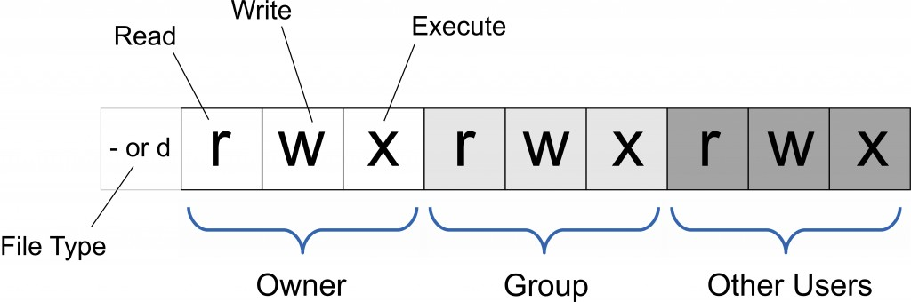
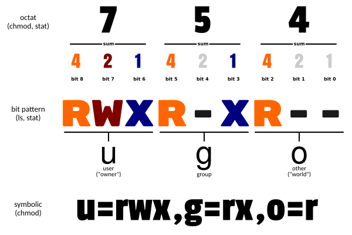

Linux chmod（英文全拼：change mode）命令是控制用户对文件的权限的命令

Linux/Unix 的文件调用权限分为三级 : 文件所有者（Owner）、用户组（Group）、其它用户（Other Users）。



只有文件所有者和超级用户可以修改文件或目录的权限。可以使用绝对模式（八进制数字模式），符号模式指定文件的权限。



使用权限 : 所有使用者

## 语法
```text
chmod [-cfvR] [--help] [--version] mode file...
```
## 参数说明
mode : 权限设定字串，格式如下 :
```text
[ugoa...][[+-=][rwxX]...][,...]
```

其中：
```text
u 表示该文件的拥有者，g 表示与该文件的拥有者属于同一个群体(group)者，o 表示其他以外的人，a 表示这三者皆是。
+ 表示增加权限、- 表示取消权限、= 表示唯一设定权限。
r 表示可读取，w 表示可写入，x 表示可执行，X 表示只有当该文件是个子目录或者该文件已经被设定过为可执行。
```

其他参数说明：
```text
-c : 若该文件权限确实已经更改，才显示其更改动作
-f : 若该文件权限无法被更改也不要显示错误讯息
-v : 显示权限变更的详细资料
-R : 对目前目录下的所有文件与子目录进行相同的权限变更(即以递归的方式逐个变更)
--help : 显示辅助说明
--version : 显示版本
```

## 符号模式
使用符号模式可以设置多个项目：who（用户类型），operator（操作符）和 permission（权限），每个项目的设置可以用逗号隔开。

命令 chmod 将修改 who 指定的用户类型对文件的访问权限，用户类型由一个或者多个字母在 who 的位置来说明，
如 who 的符号模式表所示:

| who	 | 用户类型	   | 说明            |
|------|---------|---------------|
| u	   | user	   | 文件所有者         |
| g	   | group	  | 文件所有者所在组      |
| o	   | others	 | 所有其他用户        |
| a	   | all	    | 所有用户, 相当于 ugo |

operator 的符号模式表:

| Operator	 | 说明                          |
|-----------|-----------------------------|
| +	        | 为指定的用户类型增加权限                |
| -	        | 去除指定用户类型的权限                 |
| =	        | 设置指定用户权限的设置，即将用户类型的所有权限重新设置 |

permission 的符号模式表:

| 模式	 | 名字	         | 说明                                          |
|-----|-------------|---------------------------------------------|
| r	  | 读	          | 设置为可读权限                                     |
| w	  | 写	          | 设置为可写权限                                     |
| x	  | 执行权限	       | 设置为可执行权限                                    |
| X	  | 特殊执行权限	     | 只有当文件为目录文件，或者其他类型的用户有可执行权限时，才将文件权限设置可执行     |
| s	  | setuid/gid	 | 当文件被执行时，根据who参数指定的用户类型设置文件的setuid或者setgid权限 |
| t	  | 粘贴位	        | 设置粘贴位，只有超级用户可以设置该位，只有文件所有者u可以使用该位           |

## 八进制语法
chmod命令可以使用八进制数来指定权限。文件或目录的权限位是由9个权限位来控制，每三位为一组，
它们分别是文件所有者（User）的读、写、执行，用户组（Group）的读、写、执行以及其它用户（Other）的读、写、执行。
历史上，文件权限被放在一个比特掩码中，掩码中指定的比特位设为1，用来说明一个类具有相应的优先级。

| #	 | 权限	         | rwx	 | 二进制 |
|----|-------------|------|-----|
| 7	 | 读 + 写 + 执行	 | rwx	 | 111 |
| 6	 | 读 + 写	      | rw-	 | 110 |
| 5	 | 读 + 执行	     | r-x	 | 101 |
| 4	 | 只读	         | r--	 | 100 |
| 3	 | 写 + 执行	     | -wx	 | 011 |
| 2	 | 只写	         | -w-	 | 010 |
| 1	 | 只执行	        | --x	 | 001 |
| 0	 | 无	          | ---	 | 000 |

例如， 765 将这样解释：
```text
所有者的权限用数字表达：属主的那三个权限位的数字加起来的总和。如 rwx ，也就是 4+2+1 ，应该是 7。
用户组的权限用数字表达：属组的那个权限位数字的相加的总和。如 rw- ，也就是 4+2+0 ，应该是 6。
其它用户的权限数字表达：其它用户权限位的数字相加的总和。如 r-x ，也就是 4+0+1 ，应该是 5。
```

## 实例
将文件 file1.txt 设为所有人皆可读取 :
```text
chmod ugo+r file1.txt
```

将文件 file1.txt 设为所有人皆可读取 :
```text
chmod a+r file1.txt
```

将文件 file1.txt 与 file2.txt 设为该文件拥有者，与其所属同一个群体者可写入，但其他以外的人则不可写入 :
```text
chmod ug+w,o-w file1.txt file2.txt
```

为 ex1.py 文件拥有者增加可执行权限:
```text
chmod u+x ex1.py
```

将目前目录下的所有文件与子目录皆设为任何人可读取 :
```text
chmod -R a+r *
```

此外chmod也可以用数字来表示权限如 :
```text
chmod 777 file
```

语法为：
```text
chmod abc file
```

其中a,b,c各为一个数字，分别表示User、Group、及Other的权限。

r=4，w=2，x=1
```text
若要 rwx 属性则 4+2+1=7；
若要 rw- 属性则 4+2=6；
若要 r-x 属性则 4+1=5。
```
```text
chmod a=rwx file
和
chmod 777 file
效果相同

chmod ug=rwx,o=x file
和
chmod 771 file
效果相同

若用 chmod 4755 filename 可使此程序具有 root 的权限。
```

## 更多说明
| 命令	                                       | 说明                                                  |
|-------------------------------------------|-----------------------------------------------------|
| chmod a+r file	                           | 给file的所有用户增加读权限                                     |
| chmod a-x file	                           | 删除file的所有用户的执行权限                                    |
| chmod a+rw file	                          | 给file的所有用户增加读写权限                                    |
| chmod +rwx file	                          | 给file的所有用户增加读写执行权限                                  |
| chmod u=rw,go= file	                      | 对file的所有者设置读写权限，清空该用户组和其他用户对file的所有权限（空格代表无权限）      |
| chmod -R u+r,go-r docs	                   | 对目录docs和其子目录层次结构中的所有文件给用户增加读权限，而对用户组和其他用户删除读权限      |
| chmod 664 file	                           | 对file的所有者和用户组设置读写权限, 为其其他用户设置读权限                    |
| chmod 0755 file	                          | 相当于u=rwx (4+2+1),go=rx (4+1 & 4+1)。0 没有特殊模式。        |
| chmod 4755 file	                          | 4设置了设置用户ID位，剩下的相当于 u=rwx (4+2+1),go=rx (4+1 & 4+1)。 |
| find path/ -type d -exec chmod a-x {} \;	 | 删除可执行权限对path/以及其所有的目录（不包括文件）的所有用户，使用'-type f'匹配文件   |
| find path/ -type d -exec chmod a+x {} \;	 | 允许所有用户浏览或通过目录path/                                  |