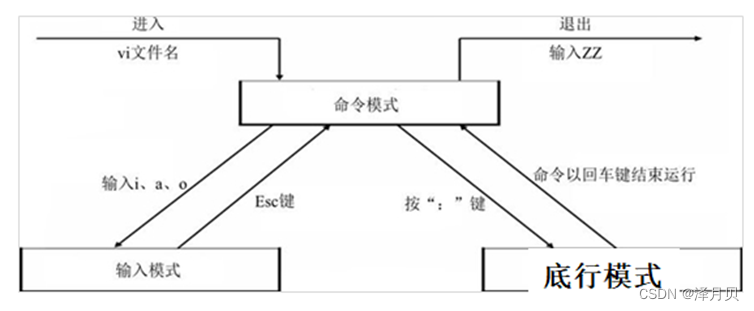

# vi编辑器

## Vi编辑器三种模式：
- 命令行模式
  - 打开文件首先进入命令模式, 是使用vi的入口
  - 通过 命令 对文件进行常规的编辑操作, 例如 定位 翻页 复制 粘贴 删除
  - 在其他图形编辑器下, 通过 快捷键 或者 鼠标 实现的操作, 都在 命令模式 下实现

- 末行模式 – 执行 保存 退出等操作
  - 要退出 vi 返回到控制台, 需要在莫行模式下输入命令
  - 末行模式 是 vi 的出口

- 编辑模式 – 正常的编辑文字

## 命令行模式常用命令

| 命令	  | 功能              |
|------|-----------------|
| o    | 在当前行后面插入一空行     |
| O    | 在当前行前面插入一空行     |
| dd   | 删除光标所在行         |
| ndd  | 从光标位置向下连续删除 n 行 |
| yy   | 复制光标所在行         |
| nyy  | 从光标位置向下连续复制n行   |
| p    | 粘贴              |
| u    | 撤销上一次命令         |
| gg   | 回到文件顶部          |
| G    | 回到文件末尾          |
| /str | 查找str           |

## 底行模式常用命令
| 命令	           | 功能               |
|---------------|------------------|
| :w 文件         | 另存为              |
| :w            | 保存(ctrl + s)     |
| :q            | 退出, 如果没有保存,不允许退出 |
| :q!           | 强行退出, 不保存退出      |
| :wq           | 保存并退出            |
| :x            | 保存并退出            |
| shift + z + z | 保存并退出            |
| :set nu       | 设置行号             |
| :set nonu     | 取消行号             |
| :%s/旧文本/新文本   | 文本替换             |
| :nohl         | 取消高亮             |

# vim介绍
## vim编辑器有三种模式：
命令模式、编辑模式、末行模式

## 模式间切换方法：
（1）命令模式下，输入:后，进入末行模式

（2）末行模式下，按esc慢退、按两次esc快退、或者删除所有命令，可以回到命令模式

（3）命令模式下，按下i、a等键，可以计入编辑模式

（4）编辑模式下，按下esc，可以回到命令模式

## vim打开文件：

| Vi 使用的选项	               | 说 明                           |
|-------------------------|-------------------------------|
| vim filename	           | 打开或新建一个文件，并将光标置于第一行的首部        |
| vim -r filename	        | 恢复上次 vim 打开时崩溃的文件             |
| vim -R filename	        | 把指定的文件以只读方式放入 Vim 编辑器中        |
| vim + filename	         | 打开文件，并将光标置于最后一行的首部            |
| vi +n filename	         | 打开文件，并将光标置于第 n 行的首部           |
| vi +/pattern filename	  | 打幵文件，并将光标置于第一个与 pattern 匹配的位置 |
| vi -c command filename	 | 在对文件进行编辑前，先执行指定的命令            |

# 命令模式

## 1.光标移动
| 快捷键	            | 功能描述                     |
|-----------------|--------------------------|
| jkhl	           | 基本上下左右                   |
| gg	             | 光标移动到文档首行                |
| G	              | 光标移动到文档尾行                |
| ^或_	            | 光标移动到行首第一个非空字符           |
| home键或0或者g0	    | 光标移动到行首第一个字符             |
| g_	             | 光标移动到行尾最后一个非空字符          |
| end或者 g 或者g或者g	 | 光标移动到行尾最后一个字符            |
| gm	             | 光标移动到当前行中间处              |
| b/B	            | 光标向前移动一个单词（大写忽略/-等等特殊字符） |
| w/W	            | 光标向后移动一个单词（大写忽略/-等等特殊字符） |
| e/E	            | 移到单词结尾（大写忽略/-等等特殊字符）     |
| ctrl+b或pageUp键	 | 翻屏操作，向上翻                 |
| ctrl+f或pageDn键	 | 翻屏操作，向下翻                 |
| 数字+G	           | 快速将光标移动到指定行              |
| `.	             | 移动到上次编辑处                 |
| 数字+上下方向键	       | 以当前光标为准，向上/下移动n行         |
| 数字+左右方向键	       | 以当前光标为准，向左/右移动n个字符       |
| H	              | 移动到屏幕顶部                  |
| M	              | 移动到屏幕中间                  |
| L	              | 移动到屏幕尾部                  |
| z+Enter键	       | 当前行在屏幕顶部                 |
| z+ .	           | 当前行在屏幕中间                 |
| z+ -	           | 当前行在屏幕底部                 |
| shift+6	        | 光标移动到行首                  |
| shift+4	        | 光标移动到行尾                  |
| -	              | 移动到上一行第一个非空字符            |
| +	              | 移动到下一行第一个非空字符            |
| )	              | 向前移动一个句子                 |
| (	              | 向后移动一个句子                 |
| }	              | 向前移动一个段落                 |
| {	              | 向前移动一个段落                 |
| count l	        | 移动到count 列               |
| counth	         | 向左移动count 字符             |
| countl	         | 向右移动count字符              |
| countgo	        | 移动到count字符               |

## 2.选中内容
| 快捷键	        | 功能描述           |
|-------------|----------------|
| v	          | 进行字符选中         |
| V 或shift+v	 | 进行行选中          |
| gv	         | 选中上一次选择的内容     |
| o	          | 光标移动到选中内容另一处结尾 |
| O	          | 光标移动到选中内容另一处角落 |
| ctr + V	    | 进行块选中          |

## 3.复制（配合粘贴命令p使用）
| 快捷键	             | 功能描述                      |
|------------------|---------------------------|
| y	               | 复制已选中的文本到剪贴板              |
| n+yy	            | 复制光标所在行，此命令前可以加数字 n，可复制多行 |
| yw	              | 复制光标位置的单词                 |
| ctrl+v + 方向键+yy	 | ctrl+v，并按方向键选中区块，按下yy复制   |

## 4.剪切
| 快捷键	   | 功能描述                     |
|--------|--------------------------|
| dd	    | 剪切光标所在行                  |
| 数字+dd	 | 以光标所在行为准（包含当前行），向下剪切指定行数 |
| D	     | 剪切光标所在行                  |

## 5.粘贴
| 快捷键	   | 功能描述           |
|--------|----------------|
| p	     | 将剪贴板中的内容粘贴到光标后 |
| P（大写）	 | 将剪贴板中的内容粘贴到光标前 |

## 6.删除
| 快捷键	     | 功能描述                     |
|----------|--------------------------|
| x	       | 删除光标所在位置的字符              |
| X(大写)	   | 删除光标前一个字符                |
| dd	      | 删除光标所在行，删除之后，下一行上移       |
| D	       | 删除光标位置到行尾的内容，删除之后，下一行不上移 |
| ndd	     | 删除当前行（包括此行）后 n 行文本       |
| dw	      | 移动光标到单词的开头以删除该单词         |
| dG	      | 删除光标所在行一直到文件末尾的所有内容      |
| :a1,a2d	 | 删除从 a1 行到 a2 行的文本内容      |

## 7.撤销/恢复
| 快捷键	    | 功能描述      |
|---------|-----------|
| u	      | 撤销最近修改    |
| ctrl+r	 | 恢复        |
| U(大写)	  | 撤销当前行所有编辑 |

## 8.字符转换
| 快捷键	 | 功能描述  |
|------|-------|
| ~	   | 转换大小写 |
| u	   | 变成小写  |
| U	   | 变成大写  |

## 9.编辑命令的快捷键
| 快捷键	       | 功能描述     |
|------------|----------|
| ↑或ctr + p	 | 上一条命令    |
| ↓或ctr + n	 | 下一条命令    |
| ctr + b	   | 移动到命令行开头 |
| ctr + e	   | 移动到命令行结尾 |
| ctr + ←	   | 向左一个单词   |
| ctr + →	   | 向右一个单词   |

# 末行模式(: xxx命令)
## 保存/退出文件操作
| 命令	          | 功能描述              |
|--------------|-------------------|
| :wq	         | 保存并退出 Vim 编辑器     |
| :wq!	        | 保存并强制退出 Vim 编辑器   |
| :q	          | 不保存就退出 Vim 编辑器    |
| :q!	         | 不保存，且强制退出 Vim 编辑器 |
| :w	          | 保存但是不退出 Vim 编辑器   |
| :w!	         | 强制保存文本            |
| :w filename	 | 另存到 filename 文件   |
| x！	          | 保存文本，并退出 Vim 编辑器  |
| ZZ	          | 直接退出 Vim 编辑器      |

## 查找：“/关键词”
在查找结果中，用N、n可以切换上下结果；输入nohl，可以取消高亮

| 快捷键	   | 功能描述               |
|--------|--------------------|
| /abc	  | 从光标所在位置向前查找字符串 abc |
| /^abc	 | 查找以 abc 为行首的行      |
| /abc$	 | 查找以 abc 为行尾的行      |
| ?abc	  | 从光标所在位置向后查找字符串 abc |
| n或；	   | 向同一方向重复上次的查找指令     |
| N或,	   | 向相反方向重复上次的查找指定     |

## 替换
| 快捷键	              | 功能描述                                        |
|-------------------|---------------------------------------------|
| r	                | 替换光标所在位置的字符                                 |
| R	                | 从光标所在位置开始替换字符，其输入内容会覆盖掉后面等长的文本内容，按“Esc”可以结束 |
| :s/a1/a2	         | 替换当前光标所在行第一处符合条件的内容                         |
| :s/a1/a2/g	       | 替换当前光标所在行所有的 a1 都用 a2 替换                    |
| :%s/a1/a2	        | 替换所有行中，第一处符合条件的内容                           |
| :%s/a1/a2/g	      | 替换所有行中，所有符合条件的内容                            |
| :n1,n2 s/a1/a2	   | 将文件中 n1 到 n2 行中第一处 a1 都用 a2 替换              |
| :n1,n2 s/a1/a2/g	 | 将文件中 n1 到 n2 行中所有 a1 都用 a2 替换               |

## 行号显示和取消：
行号显示：:set nu

取消行号显示：:set nonu

## 文件切换
使用vim打开多个文件后，在末行模式下可以进行切换。

* 查看当前已经打开的所有文件：:files(%a表示激活状态，#表示上一个打开的文件)
* 切换到指定文件：:open 文件名
* 切换到上一个文(back previous)：:bp
* 切换到下一个文件(back next)：:bn

# 编辑模式
| 快捷键	   | 功能描述                                         |
|--------|----------------------------------------------|
| i	     | 在当前光标所在位置插入，光标后的文本相应向右移动                     |
| I	     | 在光标所在行的行首插入，行首是该行的第一个非空白字符，相当于光标移动到行首执行 i 命令 |
| o	     | 在光标所在行的下插入新的一行。光标停在空行首，等待输入文本                |
| O（大写）	 | 在光标所在行的上插入新的一行。光标停在空行的行首，等待输入文本              |
| a	     | 在当前光标所在位置之后插入                                |
| A	     | 在光标所在行的行尾插入，相当于光标移动到行尾再执行 a 命令               |
| esc键	  | 退出编辑模式                                       |

# 扩展
## 代码颜色显示：
“：syntax on/off”

## vim内置计算器：
* a.进入编辑模式
* b.按“ctrl+r，光标变成引号，，输入=，光标转到最后一行
* c.输入需要计算的内容，按下enter后，计算结果回替代上一步中的引号，光标恢复

## vim的配置
* a.文件打开时，末行模式下输入的配置为临时配置，关闭文件后配置无效
* b.修改个人配置文件，可以永久保存个人配置（~/.vimrc，如果没有可以自行创建）
* c.修改全局配置文件，对每个用户生效（vim自带，/etc/vimrc）

注：个人配置文件优先级更高，当个人配置和全局配置发生冲突时，系统以当前用户的个人配置文件为准

## 异常退出
在编辑文件后，未正常保存退出时，会产生异常退出交换文件（.原文件名.swp）

将交换文件删除后，再次打开文件时，无提示：“#rm -f .原文件名.swp”

## 别名机制：自定义指令
Linux中，存在一个别名映射文件： ~/.bashrc

修改文件内容，可以自定义指令，重新登录账号后生效

## 文件快捷方式
对于深层文件，可以创建文件快捷方式，便于后续操作：#ln -s 源路径 新路径

## 退出方式
（1）在vim中退出文件编辑模式，可以使用:q或者:wq

（2）建议使用:x：使用效果等同于wq，如果文件有改动则先保存后退出；
但是如果文件没有做修改，会直接退出，不会修改文件更新时间，避免用户混淆文件的修改时间；
