# 第01节 kafka初识

```text
之前学过一点点，不过不是系统的学习，这次学习还是参照视频来的，主要是学习Kafka的使用以及整体的知识，以及面试的相关知识点，
主要针对春招的备战，同时也是为了让自己学会越来越多的知识，继续加油！
```

## 一、Kafka简介
Kafka是一种消息队列，主要用来处理【大量数据】状态下的消息队列，一般用来做【日志】的处理。
既然是消息队列，那么Kafka也就拥有消息队列的相应的特性了。

消息队列的好处：

- 解耦合

    耦合的状态表示当你实现某个功能的时候，是直接接入当前接口，而利用消息队列，可以将相应的消息发送到消息队列，
    这样的话，如果接口出了问题，将不会影响到当前的功能。
    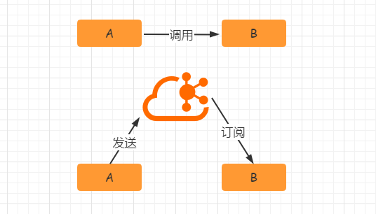

- 异步处理

    【异步处理】替代了之前的【同步处理】，异步处理不需要让流程走完就返回结果，可以将消息发送到消息队列中，然后返回结果，
    剩下让其他业务处理接口从消息队列中拉取消费处理即可。

- 流量削峰

    高流量的时候，使用消息队列作为中间件可以将流量的高峰保存在消息队列中，从而防止了系统的高请求，减轻服务器的请求处理压力。

### 1.1 Kafka消费模式
Kafka的消费模式主要有两种：
一种是一对一的消费，也即点对点的通信，即一个发送一个接收。
第二种为一对多的消费，即一个消息发送到消息队列，消费者根据消息队列的订阅拉取消息消费。

#### 1.1.1 一对一
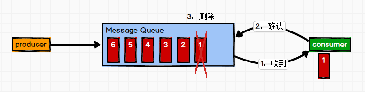

消息【生产者】发布消息到Queue队列中，通知消费者从队列中拉取消息进行消费。
消息被消费之后则删除，Queue支持多个消费者，但对于一条消息而言，只有一个消费者可以消费，即【一条消息只能被一个消费者消费】。

#### 1.1.2 一对多
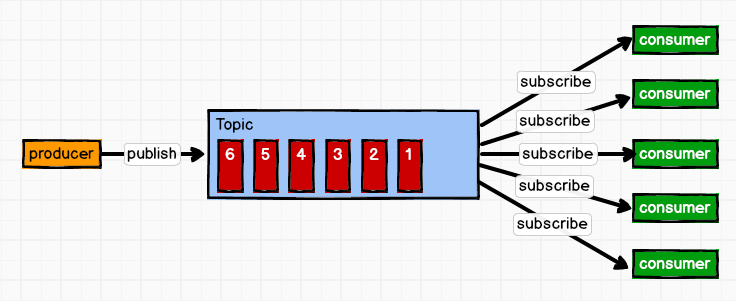

这种模式也称为【发布/订阅模式】，即利用Topic存储消息，消息生产者将消息发布到Topic中，同时有多个消费者订阅此topic，
消费者可以从中消费消息，注意发布到Topic中的消息会被多个消费者消费，
消费者消费数据之后，数据不会被清除，Kafka会默认保留一段时间，然后再删除。

### 1.2 Kafka的基础架构
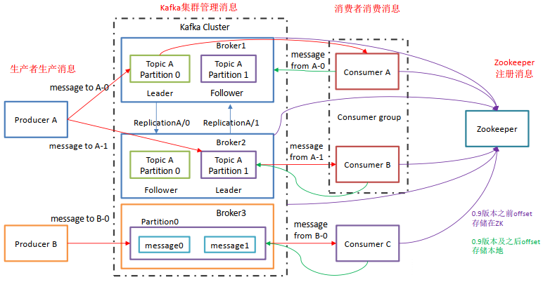

Kafka像其他Mq一样，也有自己的基础架构，主要存在生产者Producer、Kafka集群Broker、消费者Consumer、注册消息Zookeeper。
```text
Producer：
    【消息生产者】，向Kafka中发布消息的角色。
    
Consumer：
    【消息消费者】，即从Kafka中拉取消息消费的客户端。

Consumer Group：
    【消费者组】，消费者组则是一组中存在多个消费者，消费者消费Broker中当前Topic的不同分区中的消息，消费者组之间互不影响，
    所有的消费者都属于某个消费者组，即【消费者组】是逻辑上的【一个订阅者】。
    某【一个分区】中的消息只能够一个消费者组中的【一个消费者】所消费。

Broker：
    【经纪人】，一台Kafka服务器就是一个Broker，一个集群由多个Broker组成，一个Broker可以容纳多个Topic。

Topic：
    【主题】，可以理解为一个队列，生产者和消费者都是面向一个Topic。

Partition：
    【分区】，为了实现扩展性，一个【非常大的Topic】可以分布到多个Broker上，一个Topic可以分为多个Partition，
    每个Partition是一个有序的队列(【分区有序】，不能保证全局有序)。

Replica：
    【副本Replication】，为保证集群中某个节点发生故障，节点上的Partition数据不丢失，Kafka可以正常的工作，
    Kafka提供了副本机制，一个Topic的每个分区有若干个副本，【一个Leader和多个Follower】。

Leader：
    【每个分区】多个副本的【主角色】，生产者发送数据的对象，以及消费者消费数据的对象都是Leader。(消息的增删改都在Leader)

Follower：
    【每个分区】多个副本的【从角色】，实时的从Leader中同步数据，保持和Leader数据的同步，
    Leader发生故障的时候，某个Follower会成为新的Leader。(数据备份、容灾)
```
上述一个Topic会产生多个分区Partition，分区中分为Leader和Follower，消息一般发送到Leader，Follower通过数据的同步与Leader保持同步，消费的话也是在Leader中发生消费，如果多个消费者，则分别消费Leader和各个Follower中的消息，当Leader发生故障的时候，某个Follower会成为主节点，此时会对齐消息的偏移量。

### 1.3 Kafka的安装和使用
docker安装可以看这篇文章：Docker&Docker命令学习
```text
# docker直接拉取kafka和zookeeper的镜像
docker pull wurstmeister/kafka
docker pull wurstmeister/zookeeper
# 首先需要启动zookeeper，如果不先启动，启动kafka没有地方注册消息
docker run -it --name zookeeper -p 12181:2181 -d wurstmeister/zookeeper:latest
# 启动kafka容器，注意需要启动三台,注意端口的映射，都是映射到9092
# 第一台
docker run -it --name kafka01 -p 19092:9092 -d -e KAFKA_BROKER_ID=0 -e KAFKA_ZOOKEEPER_CONNECT=192.168.233.129:12181 -e KAFKA_ADVERTISED_LISTENERS=PLAINTEXT://192.168.233.129:19092 -e KAFKA_LISTENERS=PLAINTEXT://0.0.0.0:9092 wurstmeister/kafka:latest
# 第二台
docker run -it --name kafka02 -p 19093:9092 -d -e KAFKA_BROKER_ID=1 -e KAFKA_ZOOKEEPER_CONNECT=192.168.233.129:12181 -e KAFKA_ADVERTISED_LISTENERS=PLAINTEXT://192.168.233.129:19093 -e KAFKA_LISTENERS=PLAINTEXT://0.0.0.0:9092 wurstmeister/kafka:latest
# 第三台
docker run -it --name kafka03 -p 19094:9092 -d -e KAFKA_BROKER_ID=2 -e KAFKA_ZOOKEEPER_CONNECT=192.168.233.129:12181 -e KAFKA_ADVERTISED_LISTENERS=PLAINTEXT://192.168.233.129:19094 -e KAFKA_LISTENERS=PLAINTEXT://0.0.0.0:9092 wurstmeister/kafka:latest
```
上面端口的映射注意都是映射到Kafka的9092端口上！否则将不能够连接！

#### 具体命令学习
```text
# 创建topic名称为first，3个分区，1个副本
./kafka-topics.sh --zookeeper 192.168.233.129:12181 --create --topic first --replication-factor 1 --partitions 3
# 查看first此topic信息
./kafka-topics.sh --zookeeper 192.168.233.129:12181 --describe --topic first
Topic: first	PartitionCount: 3	ReplicationFactor: 1	Configs:
Topic: first	Partition: 0	Leader: 2	Replicas: 2	Isr: 2
Topic: first	Partition: 1	Leader: 0	Replicas: 0	Isr: 0
Topic: first	Partition: 2	Leader: 1	Replicas: 1	Isr: 1
# 调用生产者生产消息
./kafka-console-producer.sh --broker-list 192.168.233.129:19092,192.168.233.129:19093,192.168.233.129:19094 --topic first
# 调用消费者消费消息，from-beginning表示读取全部的消息
./kafka-console-consumer.sh --bootstrap-server 192.168.233.129:19092,192.168.233.129:19093,192.168.233.129:19094 --topic first --from-beginning
```
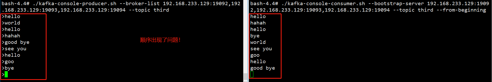
```text
# 删除topic
./kafka-topic.sh --zookeeper 192.168.233.129:12181 --delete --topic second
```
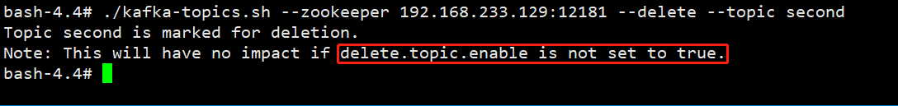
从上图可以看到删除的时候只是被标记为删除marked for deletion并没有真正的删除，
如果需要真正的删除，需要再config/server.properties中设置delete.topic.enable=true
```text
# 修改分区数
./kafka-topics.sh --zookeeper 192.168.233.129:12181 --alter --topic test2 --partitions 3
```
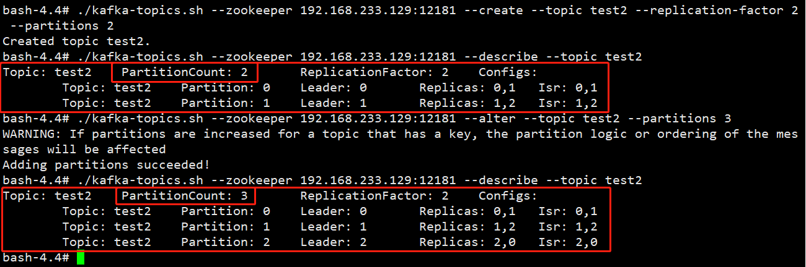

## 二、Kafka高级

### 2.1 工作流程
Kafka中消息是以【topic】进行【分类】的，Producer生产消息，Consumer消费消息，都是面向topic的。
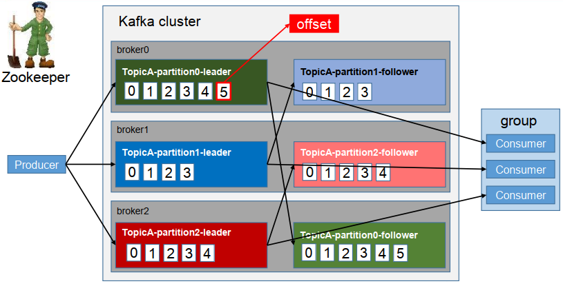
Topic是逻辑上的概念，Partition是物理上的概念，
每个Partition对应着一个【log文件】，该log文件中存储的就是producer生产的数据，topic=N*partition；partition=log。

Producer生产的数据会被不断的【追加】到该【log文件的末端】，且每条数据都有自己的offset，
consumer组中的每个consumer，都会实时记录自己消费到了哪个offset，以便出错恢复的时候，可以从上次的位置继续消费。
**流程：Producer => Topic（Log with offset）=> Consumer**。

### 2.2 文件存储
【Kafka文件存储】也是通过【本地落盘】的方式存储的，主要是通过【相应的log与index等文件】保存具体的消息文件。
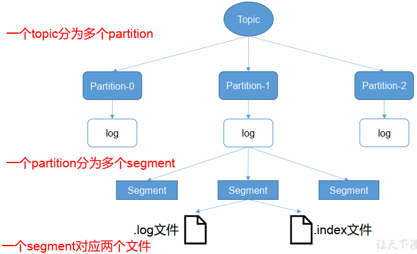
生产者不断的向log文件追加消息文件，为了防止log文件过大导致定位效率低下，Kafka的log文件以1G为一个分界点，
当.log文件大小超过1G的时候，此时会创建一个新的.log文件，同时为了快速定位大文件中消息位置，
Kafka采取了【分片】和【索引】的机制来【加速定位】。

在kafka的存储log的地方，即文件的地方，会存在【消费的偏移量】以及【具体的分区信息】，分区信息主要包括.index和.log文件组成，
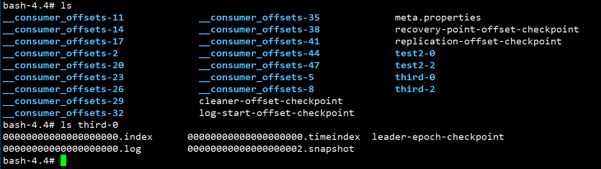
分区目的是为了备份，所以同一个分区存储在不同的broker上，即当third-2存在当前机器kafka01上，
实际上再kafka03中也有这个分区的文件（副本），分区中包含副本，即一个分区可以设置多个副本，
副本中有一个是leader，其余为follower。
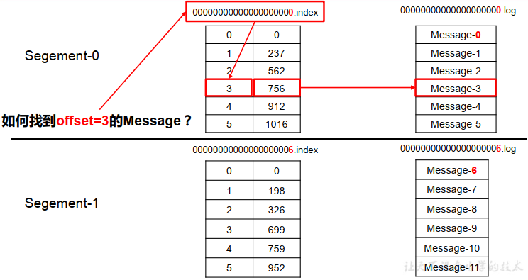
如果.log文件超出大小，则会产生新的.log文件。如下所示
```text
00000000000000000000.index
00000000000000000000.log
00000000000000170410.index
00000000000000170410.log
00000000000000239430.index
00000000000000239430.log
```
此时如何快速定位数据，步骤：
```text
.index文件存储的消息的offset+真实的起始偏移量。.log中存放的是真实的数据。
```
首先通过二分查找.index文件到查找到当前消息具体的偏移，如上图所示，查找为2，发现第二个文件为6，则定位到一个文件中。
然后通过第一个.index文件通过seek定位元素的位置3，定位到之后获取起始偏移量+当前文件大小=总的偏移量。
获取到总的偏移量之后，直接定位到.log文件即可快速获得当前消息大小。

### 2.3 生产者分区策略

#### 分区的原因
```text
方便在集群中扩展：
    每个partition通过调整以适应它所在的机器，而一个Topic又可以有多个partition组成，因此整个集群可以适应适合的数据。
可以提高并发：
    以Partition为单位进行读写。类似于多路。
```

#### 分区的原则
```text
1) 指明partition（这里的指明是指第几个分区）的情况下，直接将指明的值作为partition的值。
2) 没有指明partition的情况下，但是存在值key，此时将key的hash值与topic的partition总数进行取余得到partition值。
3) 值与partition均无的情况下，第一次调用时随机生成一个整数，后面每次调用在这个整数上自增，
    将这个值与topic可用的partition总数取余得到partition值，即round-robin算法。
```

### 2.4 生产者ISR
为保证producer发送的数据能够可靠的发送到指定的topic中，topic的每个partition收到producer发送的数据后，
都需要向producer发送acknowledgement，如果producer收到ack就会进行下一轮的发送，否则重新发送数据。
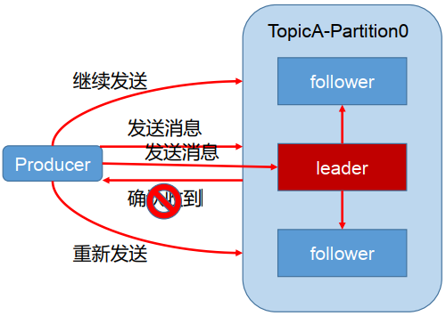

**发送ack的时机**：
```text
确保follower与leader同步完成之后，leader再发送ack，
这样可以保证在leader挂掉之后，follower中可以选出新的leader（主要是确保follower中数据不丢失）。
```
**follower同步完成多少才发送ack**
```text
半数以上的follower同步完成，即可发送ack
全部的follower同步完成，才可以发送ack
```

#### 2.4.1 副本数据同步策略
半数follower同步完成即发送ack：
```text
优点：
    延迟低

缺点：
    选举新的leader的时候，容忍n台节点的故障，需要2n+1个副本
    （因为需要半数同意，所以故障的时候，能够选举的前提是剩下的副本超过半数），容错率为1/2。
```
全部follower同步完成完成发送ack：
```text
优点：
    容错率高，选举新的leader的时候，容忍n台节点的故障只需要n+1个副本即可，因为只需要剩下的一个人同意即可发送ack。

缺点：
    延迟高，因为需要全部副本同步完成才可。
```
kafka选择的是第二种，因为在容错率上面更加有优势，同时对于分区的数据而言，每个分区都有大量的数据，第一种方案会造成大量数据的冗余。
虽然第二种网络延迟较高，但是网络延迟对于Kafka的影响较小。

#### 2.4.2 ISR(同步副本集)
猜想：
```text
采用了第二种方案进行同步ack之后，如果leader收到数据，所有的follower开始同步数据，但有一个follower因为某种故障，
迟迟不能够与leader进行同步，那么leader就要一直等待下去，直到它同步完成，才可以发送ack，此时需要如何解决这个问题呢？
```
解决：
```text
leader中维护了一个动态的ISR（in-sync replica set），即与leader保持同步的follower集合，
当ISR中的follower完成数据的同步之后，给leader发送ack，如果follower长时间没有向leader同步数据，
则该follower将从ISR中被踢出，该之间阈值由replica.lag.time.max.ms参数设定。
当leader发生故障之后，会从ISR中选举出新的leader。
```

### 2.5 生产者ack机制
对于某些不太重要的数据，对数据的可靠性要求不是很高，能够容忍数据的少量丢失，所以没有必要等到ISR中所有的follower全部接受成功。

Kafka为用户提供了三种可靠性级别，用户根据可靠性和延迟的要求进行权衡选择不同的配置。

#### acks参数配置

- 0：
    producer不等待broker的ack，这一操作提供了【最低的延迟】，broker接收到【还没有写入磁盘】就已经返回，
    当broker故障时有可能丢失数据。

- 1：
    producer等待broker的ack，【partition的leader落盘成功】后返回ack，
    如果在follower同步成功之前leader故障，那么将丢失数据。（只是leader落盘）

    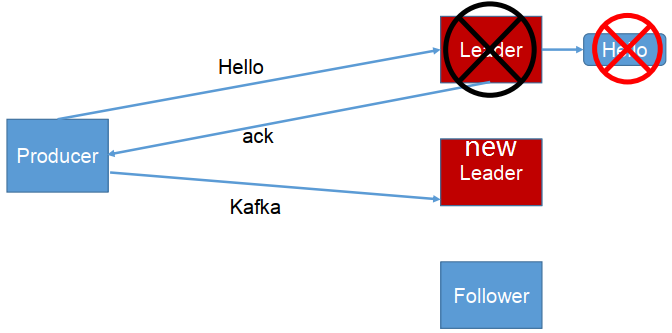

- -1(all)：
    producer等待broker的ack，【partition的leader和ISR的follower全部落盘成功】才返回ack，
    但是如果在follower同步完成后，broker发送ack之前，如果leader发生故障，会造成数据重复。
    (这里的数据重复是因为没有收到，所以继续重发导致的数据重复)
    
    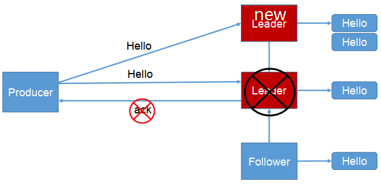

producer返ack，0无落盘直接返，1只leader落盘然后返，-1全部落盘然后返

### 2.6 数据一致性问题
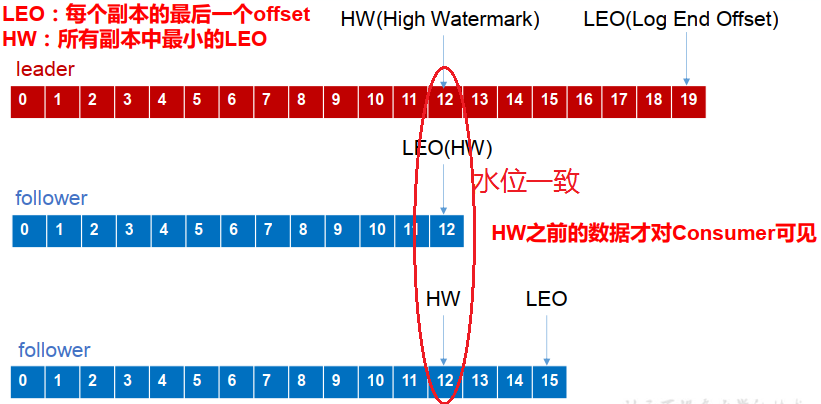

LEO(Log End Offset)：每个副本最后的一个offset。

HW(High Watermark)：高水位，指代消费者能见到的最大的offset，ISR队列中最小的LEO。

follower故障和leader故障：
```text
follower故障：
    follower发生故障后会被临时提出ISR(同步副本集)，等待该follower恢复后，follower会读取本地磁盘记录的上次的HW，
    并将log文件高于HW的部分截取掉，从HW开始向leader进行同步，等待该follower的LEO大于等于该partition的HW，
    即follower追上leader之后，就可以重新加入ISR(同步副本集)。
leader故障：
    leader发生故障之后，会从ISR中选出一个新的leader，为了保证多个副本之间的数据的一致性，
    其余的follower会先将各自的log文件高于HW的部分截掉，然后从新的leader中同步数据。
```
这只能保证副本之间的数据一致性，并不能保证数据不丢失或者不重复。

### 2.7 ExactlyOnce
将服务器的ACK级别设置为-1（all），可以保证producer到Server之间不会丢失数据，即At Least Once【至少一次】语义。
将服务器ACK级别设置为0，可以保证生产者每条消息只会被发送一次，即At Most Once【至多一次】。

At Least Once可以保证数据不丢失，但是不能保证数据不重复，而At Most Once可以保证数据不重复，但是不能保证数据不丢失，
对于重要的数据，则要求数据不重复也不丢失，即Exactly Once即精确的一次。

在0.11版本的Kafka之前，只能保证数据不丢失，在下游对数据的重复进行去重操作，对于多个下游应用的情况，则分别进行全局去重，对性能有很大影响。

0.11版本的kafka，引入了一项重大特性：幂等性。

幂等性指代Producer不论向Server发送了多少次重复数据，Server端都只会持久化一条数据。
幂等性结合At Least Once语义就构成了Kafka的Exactly Once语义。

启用幂等性，即在Producer的参数中设置enable.idempotence=true即可，
Kafka的幂等性实现实际是将之前的去重操作放在了数据上游来做，开启幂等性的Producer在初始化的时候会被分配一个PID，
发往同一个Partition的消息会附带Sequence Number，而Broker端会对<PID,Partition,SeqNumber>做缓存，
当具有相同主键的消息的时候，Broker只会持久化一条。

但PID在重启之后会发生变化，同时不同的Partition也具有不同的主键，所以幂等性无法保证跨分区跨会话的Exactly Once。

## 三、消费者分区分配策略
消费方式：
```text
pull模式：
    consumer采用pull拉的方式来从broker中读取数据。

push模式：
    push推的模式【很难适应】消费【速率不同的消费者】，因为消息发送率是由broker决定的，它的目标是尽可能以最快的速度传递消息，
    但是这样容易造成consumer来不及处理消息，典型的表现就是拒绝服务以及网络拥塞。
    而pull方式则可以让consumer根据自己的消费处理能力以适当的速度消费消息。
```
pull模式不足在于如果Kafka中没有数据，消费者可能会陷入循环之中 (因为消费者类似监听状态获取数据消费的)，一直返回空数据，
针对这一点，Kafka的消费者在消费数据时会传入一个时长参数timeout，如果当前没有数据可供消费，consumer会等待一段时间之后再返回，
时长为timeout。

### 3.1 分区分配策略
一个consumer group中有多个consumer，一个topic有多个partition，所以必然会涉及到partition的分配问题，
即确定哪个partition由哪个consumer消费的问题。

#### Kafka的两种分配策略：
```text
round-robin循环
range
```

##### Round-Robin
主要采用轮询的方式分配所有的分区，该策略主要实现的步骤：
```text
假设存在三个topic：t0/t1/t2，分别拥有1/2/3个分区，共有6个分区，分别为t0-0/t1-0/t1-1/t2-0/t2-1/t2-2，
这里假设我们有三个Consumer，C0、C1、C2，订阅情况为C0：t0，C1：t0、t1，C2：t0/t1/t2。
```
此时round-robin采取的分配方式，则是按照分区的字典对分区和消费者进行排序，然后对分区进行循环遍历，遇到自己订阅的则消费，
否则向下轮询下一个消费者。即按照分区轮询消费者，继而消息被消费。
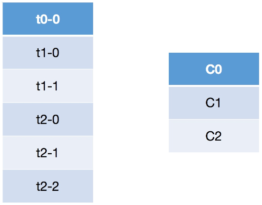
分区在循环遍历消费者，自己被当前消费者订阅，则消息与消费者共同向下（消息被消费），否则消费者向下消息继续遍历（消息没有被消费）。
轮询的方式会导致每个Consumer所承载的分区数量不一致，从而导致各个Consumer压力不均。
上面的C2因为订阅的比较多，导致承受的压力也相对较大。

##### Range
Range的重分配策略，首先计算各个Consumer将会承载的分区数量，然后将指定数量的分区分配给该Consumer。
假设存在两个Consumer，C0和C1，两个Topic，t0和t1，这两个Topic分别都有三个分区，那么总共的分区有6个，
t0-0，t0-1，t0-2，t1-0，t1-1，t1-2。分配方式如下：
```text
1) range按照topic一次进行分配，即消费者遍历topic，t0，含有三个分区，同时有两个订阅了该topic的消费者，
   将这些分区和消费者按照字典序排列。
2) 按照平均分配的方式计算每个Consumer会得到多少个分区，如果没有除尽，多出来的分区则按照字典序挨个分配给消费者。
   按照此方式以此分配每一个topic给订阅的消费者，最后完成topic分区的分配。
```
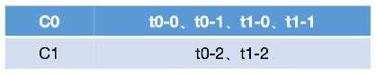
按照range的方式进行分配，本质上是以此遍历每个topic，然后将这些topic按照其订阅的consumer数进行平均分配，
多出来的则按照consumer的字典序挨个分配，这种方式会导致在前面的consumer得到更多的分区，导致各个consumer的压力不均衡。

### 3.2 消费者offset的存储
由于Consumer在消费过程中可能会出现断电宕机等故障，Consumer恢复以后，需要从故障前的位置继续消费，
所以Consumer需要实时记录自己消费到了那个offset，以便故障恢复后继续消费。

Kafka0.9版本之前，consumer默认将offset保存在zookeeper中，
从0.9版本之后，consumer默认将offset保存在kafka一个内置的topic中，该topic为__consumer_offsets。
```text
# 利用__consumer_offsets读取数据
./kafka-console-consumer.sh --topic __consumer_offsets --bootstrap-server 192.168.233.129:19092,192.168.233.129:19093,192.168.233.129:19094  --formatter "kafka.coordinator.group.GroupMetadataManager\$OffsetsMessageFormatter" --consumer.config ../config/consumer.properties --from-beginning
```

### 3.3 消费者组案例
测试同一个消费者组中的消费者，同一时刻是能有一个消费者消费。
```text
# 首先需要修改config/consumer.properties文件，可以修改为一个临时文件
group.id=xxxx
# 启动消费者
./kafka-console-consumer.sh --bootstrap-server 192.168.233.129:19093 --topic test --consumer.config ../config/consumer.properties
# 启动生产者
./kafka-console-producer.sh --broker-list 192.168.233.129:19092 --topic test
```
结果图：
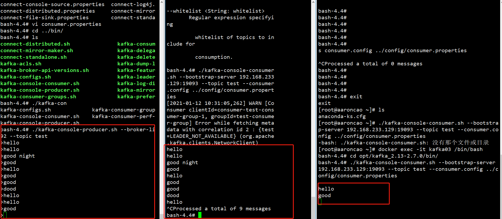
可以发现选定了一个组的，一条消息只会被一个组中的一个消费者所消费，只有ctrl+c退出了其中的一个消费者，另一个消费者才有机会进行消费。

## 四、高效读写&Zookeeper作用

### 4.1 Kafka的高效读写

**顺序写磁盘**：

Kafka的producer生产数据，需要写入到log文件中，写的过程是追加到文件末端，顺序写的方式，
官网有数据表明，同样的磁盘，顺序写能够到600M/s，而随机写只有200K/s，
这与磁盘的机械结构有关，顺序写之所以快，是因为其省去了大量磁头寻址的时间。

**零复制技术**：
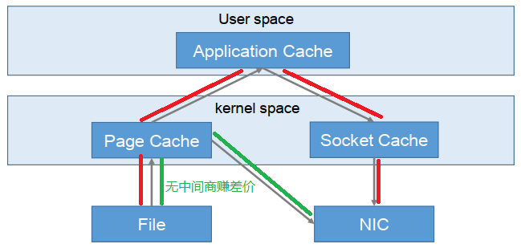
NIC：Network Interface Controller网络接口控制器
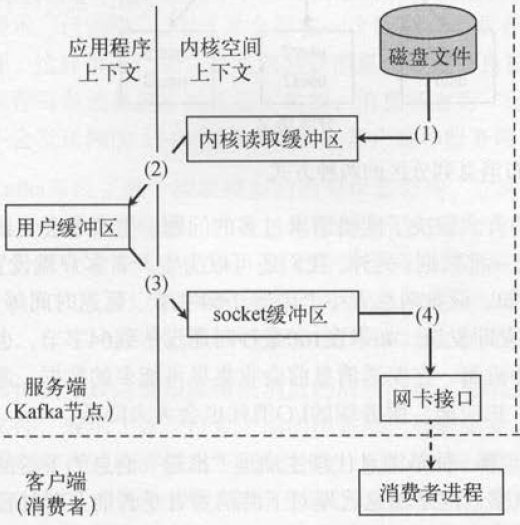
```text
这一段内容参考：Kafka的零拷贝技术
```
这是常规的读取操作：
```text
1) 操作系统将数据从【磁盘文件】中读取到【内核空间】的页面缓存。
2) 应用程序将数据从【内核空间】读入到【用户空间】缓冲区。
3) 应用程序将读到的数据从【用户空间】写回【内核空间】并放入到socket缓冲区。
4) 操作系统将数据从socket缓冲区复制到网卡接口，此时数据通过网络发送给消费者
```
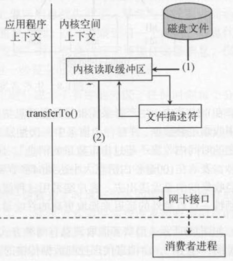
零拷贝技术只用将磁盘文件的数据复制到页面缓存中一次，然后将数据从页面缓存直接发送到网络中
（发送给不同的订阅者时，都可以使用同一个页面缓存），从而避免了重复复制的操作。
```text
如果有10个消费者，传统方式下，数据复制次数为4*10=40次，而使用“零拷贝技术”只需要1+10=11次，一次为从磁盘复制到页面缓存，10次表示10个消费者各自读取一次页面缓存。
```

### 4.2 Kafka中zookeeper的作用
Kafka集群中有一个broker会被选举为【Controller】，负责管理集群broker的上下线、所有topic的分区副本分配和leader的选举等工作。
Controller的工作管理是依赖于zookeeper的。

**Partition的Leader的选举过程**：
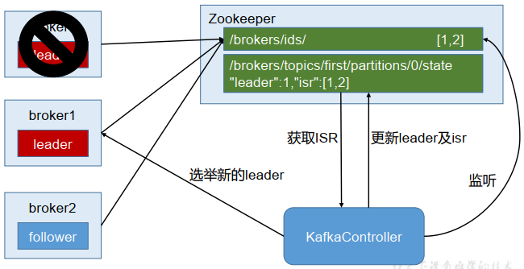

## 5. 事务
```text
kafka从0.11版本开始引入了事务支持，事务可以保证Kafka在Exactly Once语义的基础上，生产和消费可以跨分区的会话，
要么全部成功，要么全部失败。
```

### 5.1 Producer事务
为了按跨分区跨会话的事务，需要引入一个全局唯一的Transaction ID，
并将Producer获得的PID(可以理解为Producer ID)和Transaction ID进行绑定，
这样当Producer重启之后就可以通过正在进行的Transaction ID获得原来的PID。

为了管理Transaction，Kafka引入了一个新的组件Transaction Coordinator，
Producer就是通过有和Transaction Coordinator交互获得Transaction ID对应的任务状态，
Transaction Coordinator还负责将事务信息写入【内部的一个Topic】中，
这样即使整个服务重启，由于事务状态得到保存，进行中的事务状态可以恢复，从而继续进行。

### 5.2 Consumer事务
对于Consumer而言，事务的保证相比Producer相对较弱，尤其是无法保证Commit的信息被精确消费，
这是由于Consumer可以通过offset访问任意信息，而且不同的Segment File声明周期不同，
同一事务的消息可能会出现重启后被删除的情况。

## 六、API生产者流程
Kafka的Producer发送消息采用的是异步发送的方式，在消息发送的过程中，设计到了两个线程main线程和Sender线程，
以及一个线程共享变量RecordAccumulator，
main线程将消息发送给RecordAccumulator，
Sender线程不断从RecordAccumulator中拉取消息发送到Kafka broker中。
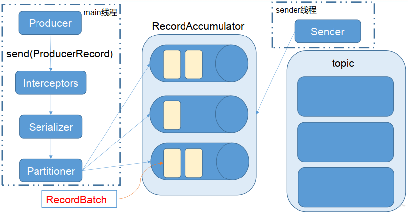

### 6.1 异步发送普通生产者
```text
/**
 * Kafka生产者
 */
public class CustomProducer {
    public static void main(String[] args) {
        Properties props = new Properties();
        // 配置可以使用具体的字符串，也可以使用producerConfig中配置的静态变量名
        // 设置集群配置
        props.put(ProducerConfig.BOOTSTRAP_SERVERS_CONFIG, "192.168.233.129:19092");
        // ack机制
        props.put(ProducerConfig.ACKS_CONFIG, "all");
        // 重试次数
        props.put(ProducerConfig.RETRIES_CONFIG, 1);
        // 批次大小:消息大小为16384才发送消息
        props.put("batch.size", 16384);
        // 等待时间:如果消息大小迟迟不为batch.size大小，则等待linger.ms时间后直接发送
        props.put(ProducerConfig.LINGER_MS_CONFIG, 1);
        // ReadAccumulator缓冲区大小
        props.put(ProducerConfig.BUFFER_MEMORY_CONFIG, 33554432);
        // 序列化
        props.put(ProducerConfig.KEY_SERIALIZER_CLASS_CONFIG, "org.apache.kafka.common.serialization.StringSerializer");
        props.put(ProducerConfig.VALUE_SERIALIZER_CLASS_CONFIG, "org.apache.kafka.common.serialization.StringSerializer");
        
        // 构造producer
        Producer<String, String> producer = new KafkaProducer<String, String>(props);
        // 生产消息
        for (int i = 1; i <= 10; i++) {
            // 构造消息体
            producer.send(new ProducerRecord<>("test", "test-" + i, "test-" + i));
        }
        producer.close();
    }
}
```
BATCH_SIZE_CONFIG = "batch.size"：消息为batch.size大小，生产者才发送消息
LINGER_MS_CONFIG = "linger.ms"：如果消息大小迟迟不为batch.size大小，则等待linger.ms时间后直接发送
此时在我们的shell中可以开启一个消费者监听。
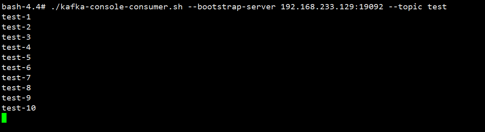

测试发现即使是100w的数据，Kafka的速度也非常快，感觉好秀~

### 6.2 异步发送带回调函数的生产者
回调函数会在producer收到ack时调用，为异步调用，该方法有两个参数，
分别为RecordMetaData和Exception，如果Exception为null，说明消息发送成功，如果Exception不为null，说明消息发送失败。

**消息发送失败会启动重试机制，但需要在回调函数中手动重试**。
```text
/**
 * kafka带有回调的生产者
 */
public class CallBackProducer {
    public static void main(String[] args) {
        Properties props = new Properties();
        props.put(ProducerConfig.BOOTSTRAP_SERVERS_CONFIG, "192.168.233.129:19092");
        props.put(ProducerConfig.ACKS_CONFIG, "all");
        props.put(ProducerConfig.RETRIES_CONFIG, 1);
        props.put("batch.size", 16384);
        props.put(ProducerConfig.LINGER_MS_CONFIG, 1);
        props.put(ProducerConfig.BUFFER_MEMORY_CONFIG, 33554432);
        props.put(ProducerConfig.KEY_SERIALIZER_CLASS_CONFIG, "org.apache.kafka.common.serialization.StringSerializer");
        props.put(ProducerConfig.VALUE_SERIALIZER_CLASS_CONFIG, "org.apache.kafka.common.serialization.StringSerializer");
        Producer<String, String> producer = new KafkaProducer<String, String>(props);
        for (int i = 1; i <= 100; i++) {
            // 构造消息体,主要是在这里使用使用了一个回调函数new CallBack()
            producer.send(new ProducerRecord<>("test", "test-" + i, "test-" + i), new Callback() {
                @Override
                public void onCompletion(RecordMetadata recordMetadata, Exception e) {
                    if (e == null) {
                        System.out.println(recordMetadata.partition() + "-" + recordMetadata.offset());
                    } else {
                        e.printStackTrace();
                    }
                }
            });
        }
        producer.close();
    }
}
```

### 6.3 生产者分区策略测试
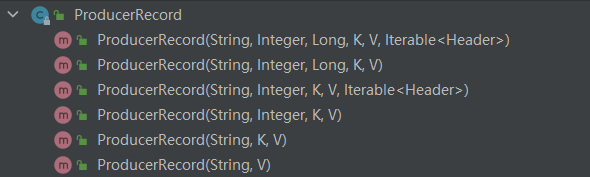
```text
public ProducerRecord(String topic, Integer partition, Long timestamp, K key, V value, Iterable<Header> headers) {};
public ProducerRecord(String topic, Integer partition, Long timestamp, K key, V value) {};
public ProducerRecord(String topic, Integer partition, K key, V value, Iterable<Header> headers) {};
public ProducerRecord(String topic, Integer partition, K key, V value) {};
public ProducerRecord(String topic, K key, V value) {};
public ProducerRecord(String topic, V value) {};
```
上面ProducerRecord中的【partition参数】即为指定的分区(分区是有编号的，这是指定分区中的某一个，实际应该为一个分区编号)。

这里要注意，如果指定特定分区的话，消息是会发送到这个编号的特定分区，
但是注意如果你的Topic分区只有默认的1个，而你却要发送到分区1号，此时发送会失败！因为你只有1个分区，即0号分区。
所以在构建的topic的时候需要注意。

**默认分区构造**
```text
// 构造消息体,这里加上具体的分区,其中的2是特定的分区编号
producer.send(new ProducerRecord<>("aaroncao",2, "test-" + i, "test-" + i), new Callback() {
    @Override
    public void onCompletion(RecordMetadata recordMetadata, Exception e) {
        if (e == null) {
            System.out.println(recordMetadata.partition() + "-" + recordMetadata.offset());
        } else {
            e.printStackTrace();
        }
    }
});
```
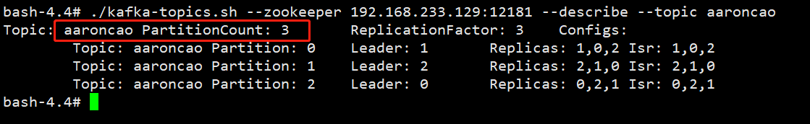

**自定义分区构造器**
```text
自定义分区构造器需要是实现【Partitioner】，实现其中的方法即可。
```
需要再Producer的参数中加入自己实现的【分区器】，否则会默认采用DefaultPartitioner，
进入到Partitioner中，在Idea中使用ctrl+h可以看到具体的实现类。
```text
props.put(ProducerConfig.PARTITIONER_CLASS_CONFIG,"com.duanxi.kafka.partition.CustomPartitioner");
```
```text
/**
 * Kafka的producer自定义分区器
 */
public class CustomPartitioner implements Partitioner {

    @Override
    public int partition(String topic, Object key, byte[] keyBytes, Object value, byte[] valueBytes, Cluster cluster) {
        // Integer nums = cluster.partitionCountForTopic(topic);
        // return key.hashCode() % nums;
        return 1;
    }
    
    @Override
    public void close() {
    }
    
    @Override
    public void configure(Map<String, ?> configs) {
    }
}
```
Producer发送消息默认是异步方式的，如果需要使用同步发送消息，则需要再Send之后获取到具体的Future的值，
通过调用Future.get()方法可以暂时阻塞，以达到同步发送的目的。

## 七、API消费者

### 7.1 简单消费者
Kafka提供了自动提交offset的功能enable.auto.commit=true;
```text
/**
 * Kafka的Consumer消费者
 */
public class CustomConsumer {
    public static void main(String[] args) {
        Properties props = new Properties();
        props.put(ConsumerConfig.BOOTSTRAP_SERVERS_CONFIG, "192.168.233.129:19092");
        // 设置消费者组
        props.put(ConsumerConfig.GROUP_ID_CONFIG, "abc");
        // 设置offset的自动提交
        props.put(ConsumerConfig.ENABLE_AUTO_COMMIT_CONFIG, "true");
        // 设置offset自动化提交的间隔时间
        props.put(ConsumerConfig.AUTO_COMMIT_INTERVAL_MS_CONFIG, "1000");
        // 生产者是序列化，消费者则为反序列化
        props.put(ConsumerConfig.KEY_DESERIALIZER_CLASS_CONFIG, StringDeserializer.class);
        props.put(ConsumerConfig.VALUE_DESERIALIZER_CLASS_CONFIG, StringDeserializer.class);
        
        KafkaConsumer<String, String> consumer = new KafkaConsumer<>(props);
        // 这里需要订阅具体的topic
        consumer.subscribe(Collections.singletonList("customconsumer"));
        
        // 一直处于监听状态中
        while (true) {
            // 因为消费者是通过pull获取消息消费的，这里设置间隔100ms
            ConsumerRecords<String, String> consumerRecords = consumer.poll(Duration.ofMillis(100));
            // 对获取到的结果遍历
            for (ConsumerRecord<String, String> consumerRecord : consumerRecords) {
                System.out.printf("offset=%d, key=%s, value=%s\n", consumerRecord.offset(),consumerRecord.key(),consumerRecord.value());
            }
        }
    }
}
```
输出结果：
```text
offset=0, key=test-1, value=test-1
offset=1, key=test-2, value=test-2
offset=2, key=test-3, value=test-3
offset=3, key=test-4, value=test-4
offset=4, key=test-5, value=test-5
offset=5, key=test-6, value=test-6
offset=6, key=test-7, value=test-7
offset=7, key=test-8, value=test-8
offset=8, key=test-9, value=test-9
offset=9, key=test-10, value=test-10
```

### 7.2 消费者重置offset
Consumer消费数据时的可靠性很容易保证，因为数据在Kafka中是持久化的，不用担心数据丢失问题。
但由于Consumer在消费过程中可能遭遇断电或者宕机等故障，Consumer恢复之后，需要从故障前的位置继续消费，
所以Consumer需要实时记录自己消费的offset位置，以便故障恢复后可以继续消费。

offset的维护是Consumer消费数据必须考虑的问题。
```text
// offset重置,需要设置自动重置为earliest
props.put(ConsumerConfig.AUTO_OFFSET_RESET_CONFIG,"earliest");
```
将消费者组的id变换一下即可，否则由于一条消息只能够被一个消费者组中的消费者消费一次，此时不会重新消费之前的消息，
即使设置了offset重置也没有作用。

注意，这里的auto.offset.reset="earliest"的作用等同于在linux控制台，消费者监听的时候添加的--from-beginning命令。

auto.offset.reset取值
```text
earliest：重置offset到最早的位置
latest：重置offset到最新的位置，默认值
none：如果在消费者组中找不到前一个offset则抛出异常
anything else：抛出异常给消费者
```

### 7.3 消费者保存offset读取问题
enable.auto.commit=true即自动提交offset。默认是自动提交的。

### 7.4 消费者手动提交offset
自动提交offset十分便利，但是由于其实基于时间提交的，开发人员难以把握offset提交的时机，因此kafka提供了手动提交offset的API。

手动提交offset的方法主要有两种：
```text
commitSync：同步提交
commitAsync：异步提交
```
```text
相同点：
    两种方式的提交都会将本次poll拉取的一批数据的最高的偏移量提交。

不同点：
    commitSync阻塞当前线程，持续到提交成功，失败会自动重试（由于不可控因素导致，也会出现提交失败）；
    而commitAsync则没有失败重试机制，有可能提交失败。
```

#### 同步提交
```text
/**
 * Kafka消费者同步提交offset
 */
public class SyncCommitOffset {
    public static void main(String[] args) {
        Properties props = new Properties();
        props.put(ConsumerConfig.BOOTSTRAP_SERVERS_CONFIG, "192.168.233.129:19092");
        // 设置消费者组
        props.put(ConsumerConfig.GROUP_ID_CONFIG, "abcd");
        // 设置offset的自动提交为false
        props.put(ConsumerConfig.ENABLE_AUTO_COMMIT_CONFIG, "false");
        props.put(ConsumerConfig.AUTO_COMMIT_INTERVAL_MS_CONFIG, "1000");
        props.put(ConsumerConfig.KEY_DESERIALIZER_CLASS_CONFIG, StringDeserializer.class);
        props.put(ConsumerConfig.VALUE_DESERIALIZER_CLASS_CONFIG, StringDeserializer.class);
        
        KafkaConsumer<String, String> consumer = new KafkaConsumer<>(props);
        consumer.subscribe(Collections.singletonList("customconsumer"));
        while (true) {
            ConsumerRecords<String, String> consumerRecords = consumer.poll(Duration.ofMillis(100));
            // 对获取到的结果遍历
            for (ConsumerRecord<String, String> consumerRecord : consumerRecords) {
                System.out.printf("offset=%d, key=%s, value=%s\n", consumerRecord.offset(),consumerRecord.key(),consumerRecord.value());
            }
            // 同步提交,会一直阻塞直到提交成功,这里可以设置超时时间,如果阻塞超过超时时间则释放
            consumer.commitSync();
        }
    }
}
```

#### 异步提交
异步提交多出一个offset提交的回调函数。
```text
consumer.commitAsync(new OffsetCommitCallback() {
    @Override
    public void onComplete(Map<TopicPartition, OffsetAndMetadata> offsets, Exception exception) {
        if (exception != null) {
            System.out.println("Commit failed, offset = " + offsets);
        }
    }
});
```

### 7.5 数据漏消费和重复消费分析
无论是同步提交还是异步提交offset，都可能会造成数据的漏消费或者重复消费，
先提交offset后消费，有可能造成数据的漏消费，
而先消费再提交offset，有可能会造成数据的重复消费。

### 7.6 自定义存储offset
Kafka0.9版本之前，offset存储在zookeeper中，
0.9版本及之后的版本，默认将offset存储在Kafka的一个内置的topic中，
除此之外，Kafka还可以选择自定义存储offset数据。
offset的维护相当繁琐，因为需要考虑到消费者的rebalance过程：
```text
当有新的消费者加入消费者组、已有的消费者退出消费者组或者订阅的主体分区发生了变化，
会触发分区的重新分配操作，重新分配的过程称为Rebalance。
```

消费者发生Rebalace之后，每个消费者消费的分区就会发生变化，
因此消费者需要先获取到重新分配到的分区，并且定位到每个分区最近提交的offset位置继续消费。（High Water高水位）
```text
/**
 * Kafka自定义offset提交
 */
public class CustomOffsetCommit {
    private static Map<TopicPartition, Long> currentOffset = new HashMap<>();

    public static void main(String[] args) {
        Properties props = new Properties();
        props.put(ConsumerConfig.BOOTSTRAP_SERVERS_CONFIG, "192.168.233.129:19092");
        // 设置消费者组
        props.put(ConsumerConfig.GROUP_ID_CONFIG, "abcd");
        // 设置offset的自动提交为false
        props.put(ConsumerConfig.ENABLE_AUTO_COMMIT_CONFIG, "false");
        props.put(ConsumerConfig.KEY_DESERIALIZER_CLASS_CONFIG, StringDeserializer.class);
        props.put(ConsumerConfig.VALUE_DESERIALIZER_CLASS_CONFIG, StringDeserializer.class);
        
        KafkaConsumer<String, String> consumer = new KafkaConsumer<>(props);
        // 这里的意思是订阅的时候同时定义Consumer重分配的监听器接口
        consumer.subscribe(Collections.singletonList("customconsumer"), new ConsumerRebalanceListener() {
            // 【rebalance发生之前调用】
            @Override
            public void onPartitionsRevoked(Collection<TopicPartition> partitions) {
                commitOffset(currentOffset);
            }
            // 【rebalance发生之后调用】
            @Override
            public void onPartitionsAssigned(Collection<TopicPartition> partitions) {
                currentOffset.clear();
                for (TopicPartition partition : partitions) {
                    // 定位到最新的offset位置
                    consumer.seek(partition, getOffset(partition));
                }
            }
        });
        while (true) {
            ConsumerRecords<String, String> consumerRecords = consumer.poll(Duration.ofMillis(100));
            for (ConsumerRecord<String, String> consumerRecord : consumerRecords) {
                System.out.printf("offset=%d, key=%s, value=%s\n", consumerRecord.offset(), consumerRecord.key(), consumerRecord.value());
                // 记录下当前的offset
                currentOffset.put(new TopicPartition(consumerRecord.topic(), consumerRecord.partition()), consumerRecord.offset());
            }
        }
    }

    // 获取某分区最新的offset
    private static long getOffset(TopicPartition topicPartition) {
        return 0;
    }

    // 提交该消费者所有分区的offset
    private static void commitOffset(Map<TopicPartition, Long> currentOffset) {

    }
}
```
即自己记录下需要提交的offset，利用Rebalance分区监听器监听rebalance事件，一旦发生rebalance，先将offset提交，
分区之后则找到最新的offset位置继续消费即可。

## 八、自定义拦截器

### 拦截器原理

Producer拦截器interceptor是在Kafka 0.10版本引入的，主要用于Clients端的定制化控制逻辑。
对于Producer而言，interceptor使得用户在消息发送之前以及Producer回调逻辑之前有机会对消息做一些定制化需求，
比如修改消息的展示样式等，同时Producer允许用户指定多个interceptor按序作用于同一条消息从而形成一个拦截链interceptor chain，
Interceptor实现的接口为ProducerInterceptor，主要有四个方法：
```text
configure(Map<String, ?> configs)：
    获取配置信息和初始化数据时调用。

onSend(ProducerRecord record)：
    该方法封装在KafkaProducer.send()方法中，运行在用户主线程中，Producer确保在消息【被序列化之前及计算分区前】调用该方法，
    并且通常都是在Producer回调逻辑出发之前。

onAcknowledgement(RecordMetadata metadata, Exception exception)：
    onAcknowledgement运行在Producer的IO线程中，因此不要在该方法中放入很重的逻辑，否则会拖慢Producer的消息发送效率。

close()：
    【关闭interceptor】，主要用于执行资源清理工作。
```
Interceptor可能被运行到多个线程中，在具体使用时需要自行确保线程安全，另外倘若指定了多个interceptor，
则producer将按照指定顺序调用它们，并紧紧是捕获每个interceptor可能抛出的异常记录到错误日志中而非向上传递。

自定义加入时间戳拦截器
```text
public class TimeInterceptor implements ProducerInterceptor<String, String> {
    @Override
    public ProducerRecord<String, String> onSend(ProducerRecord<String, String> record) {
        return new ProducerRecord(record.topic(), record.partition(), record.timestamp(), record.key(),
                "TimeInterceptor:" + System.currentTimeMillis() + "," + record.value());
    }
    // 其余方法省略
}
```
自定义消息发送统计拦截器
```text
public class CounterInterceptor implements ProducerInterceptor<String, String> {
    private int errorCounter = 0;
    private int successCounter = 0;

    @Override
    public ProducerRecord<String, String> onSend(ProducerRecord<String, String> record) {
        return record;
    }

    @Override
    public void onAcknowledgement(RecordMetadata metadata, Exception exception) {
        if (exception == null) {
            successCounter++;
        } else {
            errorCounter++;
        }
    }

    @Override
    public void close() {
        // 输出结果，结束输出
        System.out.println("Sent successful:" + successCounter);
        System.out.println("Sent failed:" + errorCounter);
    }
}
```
在CustomProducer中加入拦截器
```text
// 加入拦截器
List<Object> interceptors = new ArrayList<>();
interceptors.add(TimeInterceptor.class);
interceptors.add(CounterInterceptor.class);
props.put(ProducerConfig.INTERCEPTOR_CLASSES_CONFIG, interceptors);
```
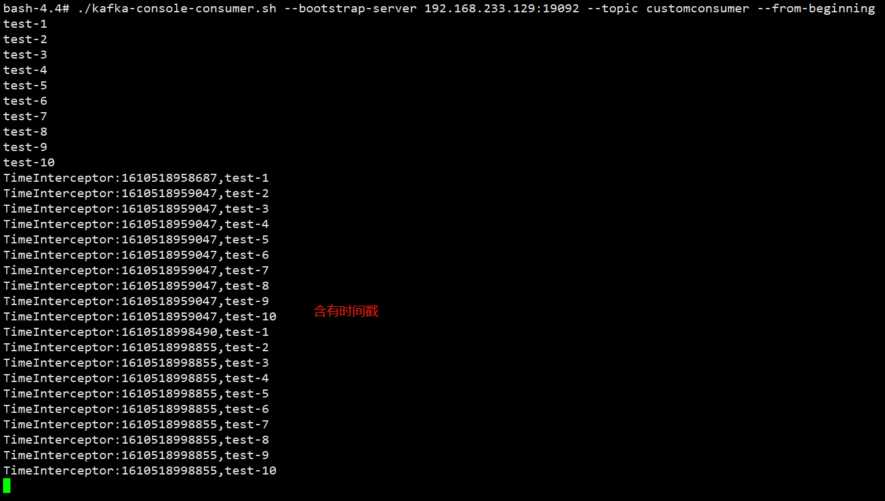
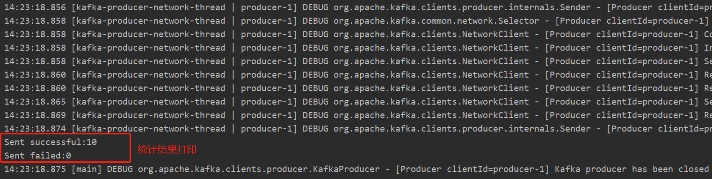
注意：拦截器的close()方法是收尾的，一定要调用Producer.close()方法，否则拦截器的close()方法不会被调用。

## 九、Kafka监控Eagle
**Eagle**
```text
Eagle是开源的可视化和管理软件，允许查询、可视化、提醒和探索存储在任何地方的指标，
简而言之，Eagle为您提供了将Kafka集群数据转换为漂亮的图形和可视化的工具。
```
实质**一个运行在tomcat上的web应用**。

具体安装可参考 [kafka 监控工具 eagle 的安装(内附高速下载地址)](https://www.cnblogs.com/keatsCoder/p/13291615.html)。

## 十、常见面试题
具体可参考：[Kafka常见面试题(附个人解读答案+持续更新)](https://blog.csdn.net/C_Xiang_Falcon/article/details/100917145)

上面的问题是学习上面内容过程中产生的问题，具体的面试的问题感觉上不止这些问题。

Kafka 中的 ISR(InSyncRepli)、 OSR(OutSyncRepli)、 AR(AllRepli)代表什么？
```text
ISR：速率和leader相差低于10s的follower的集合。
OSR：速率和leader相差大于10s的follower。
AR：所有分区的follower。
```

Kafka 中的 HW、 LEO 等分别代表什么？
```text
HW：High Water高水位，根据同一分区中最低的LEO决定（Log End Offset）。
LEO：每个分区最大的Offset。
```

Kafka 中是怎么体现消息顺序性的？
```text
在每个分区内，每条消息都有offset，所以消息在同一分区内有序，无法做到全局有序性。
```

Kafka 中的分区器、序列化器、拦截器是否了解？它们之间的处理顺序是什么？
```text
分区器Partitioner用来对分区进行处理的，即消息发送到哪一个分区的问题。
序列化器，这个是对数据进行序列化和反序列化的工具。
拦截器，即对于消息发送进行一个提前处理和收尾处理的类Interceptor，
处理顺序：拦截器=>序列化器=>分区器。
```

Kafka 生产者客户端的整体结构是什么样子的？使用了几个线程来处理？分别是什么？
```text
使用两个线程：main和sender 线程，
main线程会一次经过拦截器、序列化器、分区器将数据发送到RecordAccumulator线程共享变量，
再由sender线程从共享变量中拉取数据发送到kafka broker。

batch.size达到此规模消息才发送，
linger.ms未达到规模，等待当前时长就发送数据。
```

消费组中的消费者个数如果超过 topic 的分区，那么就会有消费者消费不到数据”这句 话是否正确？
```text
这句话是对的，超过分区个数的消费者不会在接收数据，主要原因是一个分区的消息只能够被一个消费者组中的一个消费者消费。
```

消费者 提交 消费位移 时提交的是当前消费到的最新消息的offset还是offset+1？
```text
生产者发送数据的offset是从0开始的，消费者消费的数据的offset是从1开始，故最新消息是offset+1。
```

有哪些情形会造成重复消费？
```text
先消费后提交offset，如果消费完宕机了，则会造成重复消费。
```

那些情景会造成消息漏消费？
```text
先提交offset，还没消费就宕机了，则会造成漏消费。
```

当你使用 kafka-topics.sh 创建（删除）了一个 topic 之后， Kafka 背后会执行什么逻辑？
```text
会在 zookeeper 中的/brokers/topics 节点下创建一个新的 topic 节点，如：/brokers/topics/first
触发 Controller 的监听程序
kafka Controller 负责 topic 的创建工作，并更新 metadata cache
```

topic 的分区数可不可以增加？如果可以怎么增加？如果不可以，那又是为什么？
```text
可以增加，修改分区个数--alter可以修改分区个数。
```

topic 的分区数可不可以减少？如果可以怎么减少？如果不可以，那又是为什么？
```text
不可以减少，减少了分区之后，之前的分区中的数据不好处理。
```

Kafka 有内部的 topic 吗？如果有是什么？有什么所用？
```text
有，__consumer_offsets主要用来在0.9版本以后保存消费者消费的offset。
```

Kafka 分区分配的概念？
```text
Kafka分区对于Kafka集群来说，分区可以做到【负载均衡】，对于消费者来说【分区】可以提高并发度，提高读取效率。
```

简述 Kafka 的日志目录结构？
```text
每一个分区对应着一个文件夹，命名为topic-0/topic-1…，每个文件夹内有.index和.log文件。
```

如果我指定了一个offset，Kafka Controller怎么查找到对应的消息？
```text
offset表示当前消息的编号，首先可以通过二分法定位当前消息属于哪个.index文件中，
随后采用seek定位的方法查找到当前offset在.index中的位置，此时可以拿到初始的偏移量。
通过初始的偏移量再通过seek定位到.log中的消息即可找到。
```

聊一聊 Kafka Controller 的作用？
```text
Kafka集群中有一个broker会被选举为Controller，
负责管理【集群broker的上下线】、【所有topic的分区副本分配】和【leader的选举】等工作。
Controller的工作管理是依赖于zookeeper的。
```

Kafka 中有哪些地方需要选举？这些地方的选举策略又有哪些？
```text
在ISR中需要选举出Leader，选择策略为先到先得。在分区中需要选举，需要选举出Leader和follower。
```

失效副本是指什么？有那些应对措施？
```text
失效副本为速率比leader相差大于10s的follower，ISR会将这些失效的follower踢出，
等速率接近leader的10s内，会重新加入ISR。
```

Kafka 的哪些设计让它有如此高的性能？
```text
Kafka天生的分布式架构
对log文件进行了分segment，并对segment建立了索引
对于单节点使用了顺序读写，顺序读写是指的文件的顺序追加，减少了磁盘寻址的开销，相比随机写速度提升很多
使用了零拷贝技术，不需要切换到用户态，在内核态即可完成读写操作，且数据的拷贝次数也更少。
```

消息队列面试题建议结合[中华石杉–互联网Java进阶面试训练营](https://github.com/shishan100/Java-Interview-Advanced)一起看会比较好！

## 十一、小结
这次学习Kafka耗费时间为3天，基本过了一遍Kafka的知识，从docker安装Kafka、zookeeper到运行到采用命令行的方式操作kafka，
到学习Kafka内部的原理，文件存储策略，分区策略，高效读写策略，文件落盘策略，消费者offset策略，以及事务，
以及消息消费的至少一次，至多一次，精确一次等策略。到最后利用SpringBoot集成Kafka跑了几个demo，
主要是针对生产者和消费者的例子，最后写了拦截器的例子，到最后一些常见的面试题，整个Kafka算是过完了，
但是只是大概知道了它的原理，感觉要想吃透还是需要花时间多看几遍！加油！

参考文献：[尚硅谷Kafka教程(kafka框架快速入门)](https://www.bilibili.com/video/BV1a4411B7V9)
