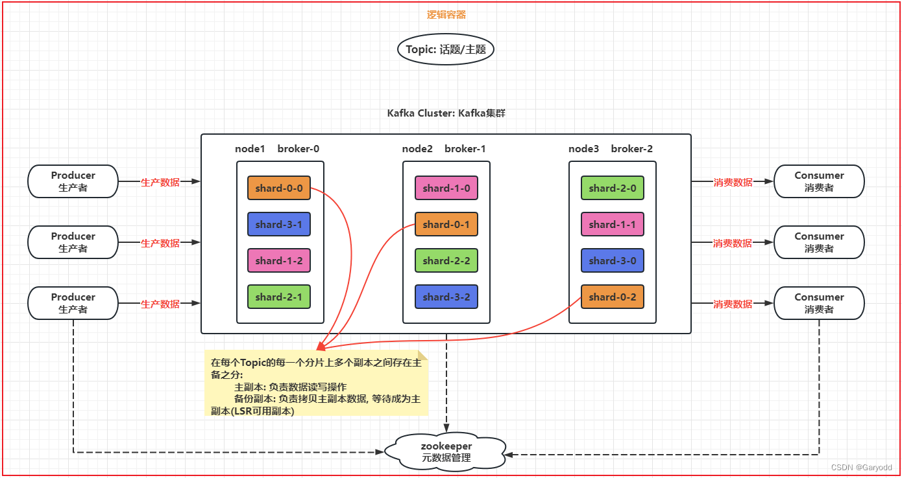

## 1. 消息队列的基本介绍
消息：数据，只不过这个数据具有流动的状态。

队列：存储数据的容器，只不过这个容器具有FIFO(先进先出)特性。

消息队列：数据在队列中，从队列的一端传递到另一端的过程，数据在整个队列中产生了一种流动状态。

## 2.消息队列的作用
- 同步操作转换为异步操作

- 应用的解耦合

- 流量削峰：在一些秒杀场景中, 遇到突然的庞大的并发量, 但是一般就是一瞬间的事情, 过后就没有了

- 消息驱动系统

## 3.消息队列的两种消费模式
在Java中，提供了消息队列的协议：JMS(Java Message Server) Java消息服务，
sun公司系统所有的消息队列支持Java客户端的时候，都按照JMS协议规范制定客户端(类似于提供JDBC协议)。

点对点：数据被生产到容器后, 最终这个数据只能被一个消费者来消费数据

发布订阅：数据被生产到容器后,可以被多个消费者所消费

两个角色：生产者 (producer) 和 消费者(consumer)

## 4. kafka的基本介绍
kafka是Apache旗下的一款开源免费的消息队列的中间件产品，
最早是有【领英】公司开发的，后期贡献给Apache，目前也是Apache旗下的顶级开源项目。 
采用的语言为scala，Kafka 2.x 依然要依赖于zookeeper的。

官方网站: https://www.kafka.apache.org

**kafka特点**：

- 可靠性：分布式，分区，复制和容错等

- 可扩展性：kafka消息传递系统轻松缩放，无需停机

- 持久性： kafka使用分布式提交日志，这个意味着消息会尽可能快速的保存在磁盘上，因此它是持久的

- 性能：kafka对于发布和订阅消息都是具有高吞吐量，即使存储了许多TB的消息，也能爆发出稳定的性能，能保证零停机和零数据丢失

**适用场景**：

- 数据传递工作，需要将数据从一端传递到另一端，此时可以使用Kafka实现，不局限于两端的程序

- 在实时领域中，主要是用于流式的数据处理工作

## 5. kafka的集群架构



相关名词:
```text
Kafka cluster: Kafka的集群
broker: Kafka的节点
producer: 生产者
consumer: 消费者
Topic: 话题/主题，理解为就是一个逻辑容器
partition/shard: 分区/分片，一个topic可以被分为N个分片，分片的数量和节点数据没有关系
replicas: 副本，可以对每一个分片构建N个副本，副本的数量最多和节点的数据一致(包含本身)
zookeeper: 管理kafka集群，并存储Kafka的相关元数据（2.8版本就开始支持不需要zookeeper管理kafka集群了）
```
