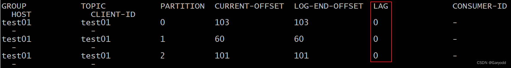

## 1.创建Topic: kafka-topics.sh
```text
./kafka-topics.sh 
--create 
--zookeeper node1:2181,node2:2181,node3:2181 
--topic test01 
--partitions 3 
--replication-factor 2

或者

./kafka-topics.sh 
--create 
--bootstrap-server node1:9092,node2:9092,node3:9092 
--topic test01 
--partitions 3 
--replication-factor 2
```
必备选项:
- 执行什么操作  --create 表示为创建
- 连接地址：是直连broker服务  --bootstrap-server
- 连接地址：建议是zookeeper地址 --zookeeper node1:2181,node2:2181,node3:2181
- 创建的topic的名字：--topic test01
- topic有多少个分片：--partitions 3
- 每个分片有多少个副本：--replication-factor 2

## 2.查看当前有那些topic
```text
./kafka-topics.sh --list --zookeeper node1:2181,node2:2181,node3:2181
```

## 3.查看某一个topic的详细信息
查看每一个topic的详细信息:
```text
./kafka-topics.sh --describe --zookeeper node1:2181,node2:2181,node3:2181
```

查看某一个topic的详细信息:
```text
./kafka-topics.sh --describe --zookeeper node1:2181,node2:2181,node3:2181 --topic test01
```

## 4. 如何修改Topic
Topic 仅允许增大分片，不允许减少分片，同时也不支持修改副本数量。

增大分区：
```text
./kafka-topics.sh 
--alter 
--zookeeper node1:2181,node2:2181,node3:2181 
--topic test01 
--partitions 5
```

## 5.如何删除Topic
```text
./kafka-topics.sh 
--delete 
--zookeeper node1:2181,node2:2181,node3:2181 
--topic test01
```

注意：

默认情况下，删除一个topic 仅仅是标记删除，主要原因：kafka担心误删数据，一般需要用户手动删除。

如果想执行删除的时候，直接将topic完整的删除掉：此时需要在 server.properties 配置中修改一个配置为true。
```text
delete.topic.enable=true
```

如果topic中的数据量非常少，或者说没有任何的数据的时候，此时topic会自动先执行逻辑删除，
然后在物理删除，不管是否配置了delete.topic.enable=true。

## 6.如何模拟生产者
```text
./kafka-console-producer.sh 
--broker-list node1:9092,node2:9092,node3:9092 
--topic test01
```

## 7.如何模拟消费者
```text
./kafka-console-consumer.sh 
--bootstrap-server node1:9092,node2:9092,node3:9092 
--topic test01
```

默认从当前时间开始消费数据，如果想从头开始消费，可以添加 --from-beginning 参数即可。

---

# Kafka基准测试

概念：主要指的安装完成Kafka集群后，进行测试操作，测试其是否承载多大的并发量(读写效率)

注意：在进行Kafka的基准测试的时候，受Topic的分片和副本的数量影响会比较大，
一般在测试的时候，会构建多个topic，每一个topic设置不同的分片和副本的数量，
比如：一个设置分片多一些，副本少一些，一个设置分片少一些，副本多一些，要不设置分片多副本也多。

## 1.创建一个Topic
```text
./kafka-topics.sh 
--create 
--zookeeper node1:2181,node2:2181,node3:2181 
--topic test02 
--partitions 6 
--replication-factor 1
```

## 2.测试写入的数据的效率
```text
./kafka-producer-perf-test.sh 
--topic test02  
--num-records 5000000 
--throughput -1 
--record-size 1000 
--producer-props bootstrap.servers=node1:9092,node2:9092,node3:9092 acks=1
```

属性说明:
```text
--num-records:  发送的总消息量
--throughput: 指定吞吐量(限流)  -1  不限制
--record-size: 每条数据的大小(字节)
# 设置生产者的配置信息(连接地址, 消息确认方案)
--producer-props bootstrap.servers=node1:9092,node2:9092,node3:9092 acks=1 
```

结果:
```text
5000000 records sent, 
134578.634296 records/sec (128.34 MB/sec), 
239.83 ms avg latency, 1524.00 ms max latency, 
45 ms 50th, 940 ms 95th, 1269 ms 99th, 1461 ms 99.9th.
```

需关注的信息:
```text
5000000 records sent :  总计写入了多少条数据
134578.634296 records/sec: 每秒中可以处理多少条数据
128.34 MB/sec: 每秒钟可以处理的数据量是多大
```

## 3.测试读取数据的效率
```text
./kafka-consumer-perf-test.sh 
--broker-list node1:9092,node2:9092,node3:9092 
--topic test02 
--fetch-size 1048576 
--messages 5000000
```

属性:
```text
--fetch-size 1048576  :  每次从kafka端拉取的数据量
--messages:  测试的总消息量
```
结果:
```text
start.time, end.time, data.consumed.in.MB, MB.sec, data.consumed.in.nMsg, nMsg.sec, rebalance.time.ms, fetch.time.ms, fetch.MB.sec, fetch.nMsg.sec
2023-03-30 21:08:26:464, 2023-03-30 21:08:42:373, 4768.3716, 299.7279, 5000000, 314287.5102, 1680181706706, -1680181690797, -0.0000, -0.0030
```
需要关注的属性：
```text
start.time: 2023-03-30 21:08:26:464  启动时间
end.time: 2023-03-30 21:08:42:373    结束时间
data.consumed.in.MB: 4768.3716       总大小
MB.sec: 299.7279  每秒中可以处理的大小
data.consumed.in.nMsg: 5000000  总消息量
nMsg.sec: 314287.5102  每秒钟可以处理的数据
```

## 总结:

假设Kafka的节点数量是无限多的:
```text
topic的分片数量越多, 理论上读写效率越高
topic的副本数量越多, 理论上写入的效率变差
```
一般可以将分片的数量设置为节点数量的三倍左右，副本数量为1，基本上可以测试出最佳性能。

---
# 检查Kafka是否有消息积压

通过命令的方式查看数据积压的问题
```text
./kafka-consumer-groups.sh  
--bootstrap-server node1:9092,node2:9092,node3:9092 
--group test01 
--describe
```



工作中，有时候运维工程师，会将lag指标纳入监控范围，当这个LAG 出现积压问题，基于告警系统进行告警。

