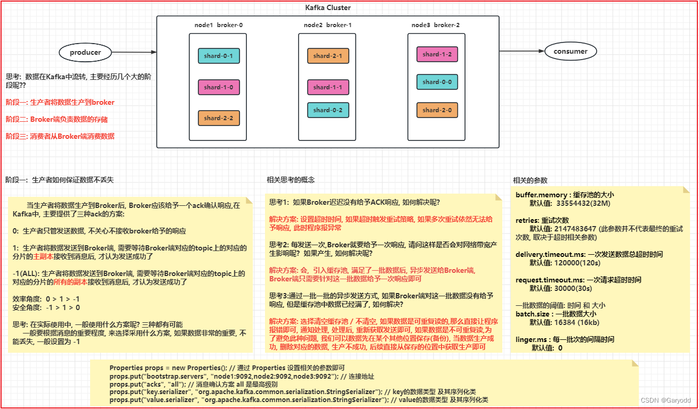
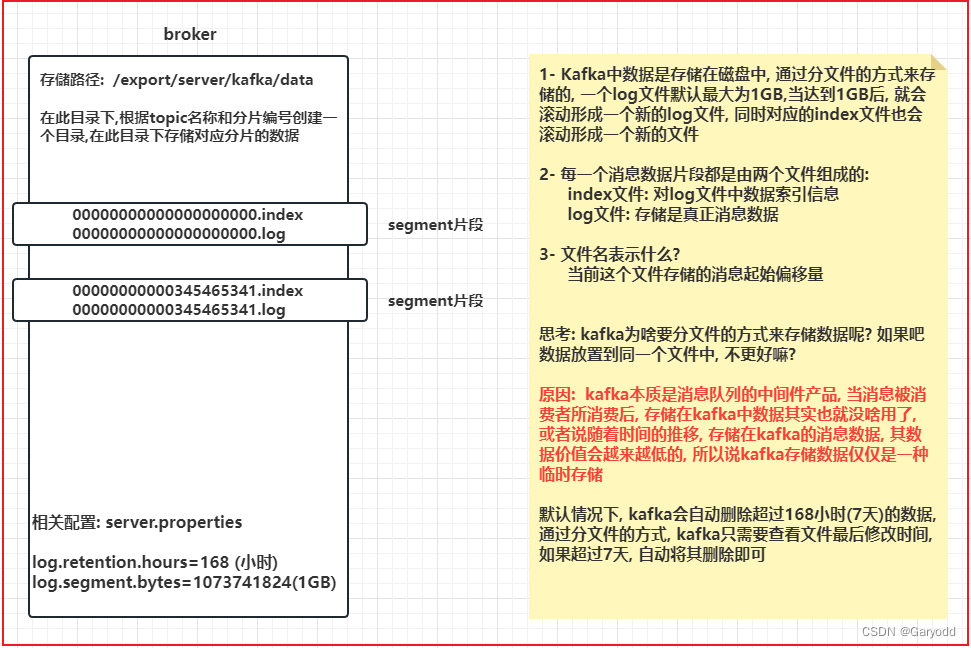
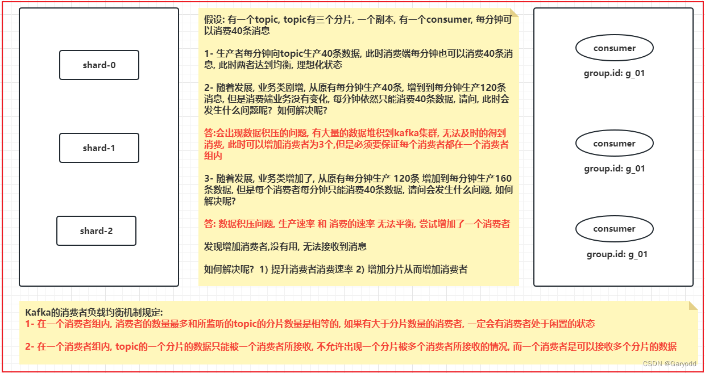

## 1.Topic的分片和副本机制
什么是分片呢?
```text
分片: 将一个Topic(大容器)拆分为N多个小容器，多个小的容器构建为一个Topic

目的:
1- 提高读写的效率: 分片可以分布在不同节点上，在进行读写的时候，可以让多个节点一起参与(提高并行度)
2- 分布式存储: 解决了单台节点存储容量有限的问题

分片的数量:分片是可以创建N多个, 理论上没有任何的限制
```
什么是副本呢?
```text
副本: 针对每个分片的数据, 可以设置备份, 可以将其备份多个

目的:
提高数据的可靠性, 防止数据丢失

副本的数量: 副本的数量最多和集群节点数量保持一致, 但是一般设置为 2个 或者 3个
```

## 2.kafka如何保证数据不丢失

### 2.1 生产端是如何保证数据不丢失




当生产者将数据生产到Broker后, Broker应该给予一个ack确认响应,在Kafka中, 主要提供了三种ack的方案:
```text
0: 
生产者只管发送数据, 不关心不接收broker给予的响应

1: 
生产者将数据发送到Broker端，需要等待Broker端对应的topic上的对应的分片的主副本接收到消息后，才认为发送成功。

-1(ALL): 
生产者将数据发送到Broker端，需要等待Broker端对应的topic上的对应的分片的所有的副本接收到消息后，才认为发送成功。

效率角度:  0 > 1 > -1
安全角度:  -1 > 1 > 0

思考: 在实际使用中, 一般使用什么方案呢? 三种都有可能
一般要根据消息的重要程度, 来选择采用什么方案, 如果数据非常的重要, 不能丢失, 一般设置为 -1
```

相关的思考的点:
```text
思考1: 
如果Broker迟迟没有给予ACK响应, 如何解决呢?

解决方案: 
设置超时时间, 如果超时触发重试策略, 如果多次重试依然无法给予响应, 此时程序报异常。

思考2: 
每发送一次,Broker就要给予一次响应, 请问这样是否会对网络带宽产生影响呢?  如果产生, 如何解决呢?

解决方案: 
会, 引入缓存池, 满足了一批数据后, 异步发送给Broker端, Broker端只需要针对这一批数据给予一次响应即可。

思考3:
通过一批一批的异步发送方式, 如果Broker端对这一批数据没有给予响应, 但是缓存池中数据已经满了, 如何解决?

解决方案: 
选择清空缓存池 / 不清空, 如果数据是可重复读的,那么直接让程序报错即可, 
通知处理, 处理后, 重新获取发送即可, 如果数据是不可重复读,
为了避免此种问题, 我们可以数据先在某个其他位置保存(备份), 
当数据生产成功, 删除对应的数据, 生产不成功, 后续直接从保存的位置中获取生产即可。
```

相关的参数:
```text
buffer.memory : 缓存池的大小
默认值:  33554432(32M)

retries: 重试次数
默认值: 2147483647 (此参数并不代表最终的重试次数, 取决于超时相关参数)

delivery.timeout.ms: 一次发送数据总超时时间
默认值: 120000(120s)

request.timeout.ms: 一次请求超时时间
默认值: 30000(30s)

一批数据的阈值: 时间 和 大小
batch.size : 一批数据大小  
默认值: 16384 (16kb)

linger.ms : 每一批次的间隔时间
默认值:  0
```

### 2.2 Broker端如何保证数据不丢失
保证方案: 磁盘存储 + 多副本 + producer的ack为-1

### 2.3 消费端如何保证数据不丢失
```text
第一步: 
    当Consumer启动后, 连接Kafka集群, 根据group.id 到Kafka中寻找上一次消费到了什么位置(偏移量)

第二步:
    如果consumer找到了上次消费位置, 接着从这个位置开始消费数据

    如果没有找到上一次消费的位置, 说明第一次来, 这个时候默认从当前时刻开始消费数据, 
    消费的位置也会从当前这个消息的偏移量位置开始消费

第三步: 
    消费者开始消费数据, 在消费的过程中, 每消费完数据后, 都要和kafka集群进行汇报, 
    汇报当前消费到了那一个偏移量信息

汇报方式: 自动 /  手动


思考: 请问在这种方式下是否可以保证消费端不会发送数据丢失的问题呢?

可以保证, 但是可能会存在重复消费的问题

思考: 消费者消费的消息偏移量信息是存储在哪里呢?

在 0.8.x版本之前, 消费者的消息偏移量信息是被记录在zookeeper中

在 0.8.x版本之后, 将消费者的消息偏移量信息记录在kafka集群上, 通过一个topic来记录: __consumer_offsets,
此topic默认有50个分片 1个副本
```

## 3.kafka的消息存储
```text
存儲路径:  log/dirs=/export/server/kafka/data

在此目录下,根据topic名称和分片编号创建一个目录,在此目录下存储对应分片的数据

1- Kafka中数据是存储在磁盘中, 通过分文件的方式来存储的, 一个log文件默认最大为1GB,
当达到1GB后, 就会滚动形成一个新的log文件, 同时对应的index文件也会滚动形成一个新的文件

2- 每一个消息数据片段都是由两个文件组成的:
index文件: 对log文件中数据索引信息
log文件: 存储是真正消息数据

3- 文件名表示什么?
当前这个文件存储的消息起始偏移量


思考: kafka为啥要分文件的方式来存储数据呢? 如果把数据放置到同一个文件中, 不更好嘛?

原因: 
kafka本质是消息队列的中间件产品, 
当消息被消费者所消费后, 存储在kafka中数据其实也就没啥用了, 
或者说随着时间的推移, 存储在kafka的消息数据, 其数据价值会越来越低的, 
所以说kafka存储数据仅仅是一种【临时存储】。

默认情况下, kafka会自动删除超过168小时(7天)的数据, 
通过分文件的方式, kafka只需要查看文件最后修改时间, 如果超过7天, 自动将其删除即可

相关配置: server.properties

log.retention.hours=168 (小时)
log.segment.bytes=1073741824(1GB)
```



## 4.kafka的查询机制
需求：读取offset=368776的Message消息数据，数据集如下：
```text
00000000000000000000.index
00000000000000000000.log
00000000000000368769.index
00000000000000368769.log
00000000000000737337.index
00000000000000737337.log
00000000000001105814.index
00000000000001105814.log
```

查询数据的步骤:
```text
1- 确定消息被存储在那个segment片段中

2- 先去对应segment片段中index文件, 从这个索引文件中, 查询对应消息偏移量, 在log文件的什么位置上进行存储着

3- 根据返回的log文件的具体的位置信息, 底层会基于磁盘顺序查询方式查询log文件, 找到对应位置上数据即可
```

扩展:
```text
磁盘的读写方式主要有二种:  顺序读写  和 随机读写

顺序读写的效率是远远高于随机读写的效率
```

## 5.kafka生产者数据分发机制
### 分发策略:
```text
1- 随机分发策略
2- 轮询分发策略
3- Hash取模分发策略
4- 指定分区策略
5- 范围分发策略
6- 自定义分区策略
```

### Kafka支持的策略 :
```text
1- 轮询策略(2.4版本以下), 目前为 粘性分发策略    是Java客户端拥有的
2- Hash取模分发策略
3- 指定分发策略
4- 随机分发策略 (Python 客户端支持, Java 客户端不支持)
5- 自定义分区策略
```

### 分发策略的使用：

#### 1- 指定分区策略
```text
public ProducerRecord(String topic, Integer partition, K key, V value) {
    this(topic, partition, null, key, value, null);
}
```
在生产端, 构建数据承载对象的时候, 采用此构造方式, 即可实现指定分区的策略

分区编号: 从 0 开始

#### 2- Hash 取模分发策略

创建数据承载对象的时候, 必须使用仅传递 k 和 v的构造方法, 即可使用hash模式
```text
public ProducerRecord(String topic, K key, V value) {
    this(topic, null, null, key, value, null);
}
```

当执行Hash取模分区策略,底层是通过一个默认的分区类实现完成Hash取模: DefaultPartitioner
```text
public class DefaultPartitioner implements Partitioner {

    private final StickyPartitionCache stickyPartitionCache = new StickyPartitionCache();
	
	// 执行分区的核心方法, 返回内容表示将当前这条数据发送到那个分片上
    public int partition(String topic, Object key, byte[] keyBytes, Object value, byte[] valueBytes, Cluster cluster) {
        if (keyBytes == null) {
            return stickyPartitionCache.partition(topic, cluster);
        } 
        List<PartitionInfo> partitions = cluster.partitionsForTopic(topic);
        int numPartitions = partitions.size();
        // hash the keyBytes to choose a partition
        return Utils.toPositive(Utils.murmur2(keyBytes)) % numPartitions;
    }
}
```

说明: 在使用此种分发策略的时候, key值一定是可变的, 千万不要固定不变

#### 3-粘性分区策略

创建生产者的数据承载对象的时候, 只需要传递value即可, 此时底层会采用粘性的分区策略
```text
public ProducerRecord(String topic, V value) {
    this(topic, null, null, null, value, null);
}
```

当执行粘性分区策略,底层是通过一个默认的分区类实现完成Hash取模: DefaultPartitioner

```text
public class DefaultPartitioner implements Partitioner {

    private final StickyPartitionCache stickyPartitionCache = new StickyPartitionCache();
	
	// 执行分区的核心方法, 返回内容表示将当前这条数据发送到那个分片上
    public int partition(String topic, Object key, byte[] keyBytes, Object value, byte[] valueBytes, Cluster cluster) {
        // 当key为null的时候, 执行的是粘性的分区策略
        if (keyBytes == null) {
            return stickyPartitionCache.partition(topic, cluster);
        } 
        List<PartitionInfo> partitions = cluster.partitionsForTopic(topic);
        int numPartitions = partitions.size();
        // hash the keyBytes to choose a partition
        return Utils.toPositive(Utils.murmur2(keyBytes)) % numPartitions;
    }
}
```

什么叫粘性分区策略:
```text
当生产者发送数据的时候, 一般都是采用异步(批)发送方案,当发送一批数据到Broker端后, 
首先会随机的选择其中一个分片, 然后尽可能黏上这个分区, 将这一批的数据全部都交给这一个分区即可
```

什么是轮询策略:
```text
当生产者发送数据的时候, 一般都是采用异步(批)发送方案,当发送一批数据到Broker端后, 
根据topic的分片的数量, 将一批数据拆分为N多个小的批次, 一个批次对应一个分片, 然后写入到topic的各个分片上
```

粘性分区的优势:
```text
减少中间的这个切分的操作, 直接将一批数据全部写入到某一个分片上, 
同时也减少了中间ack的响应的次数, 减少网络的带宽, 提升效率
```

但是如果生成的数量非常的块, 会导致大量的数据写入到同一个分片上, 无法解开

#### 4- 自定义分区策略: 在MR中自定义分区方案很相似的

如何自定义分区呢? 抄DefaultPartitioner

1）创建一个类, 实现 Partitioner 接口

2）重写接口中partition()方法 以及 close 方法, 主要核心重写: partition()
```text
partition方法的参数列表:
String topic : 指定要写入到那个topic
Object key :  传入的key值
byte[] keyBytes: 传入的key的字节
Object value :  传入的value数据
byte[] valueBytes : 传入的value的字节
Cluster cluster :  集群的对象 可以帮助获取指定的topic有多少个分片

其返回值为 要将这个数据写入到那个分片的编号
```

3）将自定义的分区类, 配置到生产者的代码的Properties配置信息中:
```text
key: partitioner.class
value: 自定义类的权限类名

将key 和value的值添加到properties对象中
```

## 6. Kafka消费者的负载均衡机制



Kafka的消费者负载均衡机制规定:
- 在一个消费者组内, 消费者的数量最多和所监听的topic的分片数量是相等的, 
  如果有大于分片数量的消费者, 一定会有消费者处于闲置的状态

- 在一个消费者组内, topic的一个分片的数据只能被一个消费者所接收, 
  不允许出现一个分片被多个消费者所接收的情况, 而一个消费者是可以接收多个分片的数据


如何模拟点对点消费模式: 让所有监听这个topic的消费者, 都处在同一个消费组内

如何模拟发布订阅模式:  让所有监听这个topic的消费者都不在同一个消费组内


