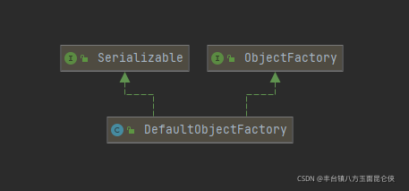

# 第04节 Mybatis全局配置文件

## 一. mybatis-config.xml模板（template）
```text
<?xml version="1.0" encoding="UTF-8" ?>
<!DOCTYPE configuration
  PUBLIC "-//mybatis.org//DTD Config 3.0//EN"
  "http://mybatis.org/dtd/mybatis-3-config.dtd">
<configuration>

</configuration>
```

## 二. 属性（properties）
### 使用示例
这些属性可以在properties元素的【子元素中设置】，也可以进行【外部配置】，通过resource引进，并进行动态替换。例如：
```xml
<!-- 通过resource引入属性 -->
<properties resource="org/mybatis/example/config.properties">
    <!-- 在子元素中进行设置 -->
    <property name="username" value="root"/>
    <property name="password" value="123456"/>
</properties>
```
### 优先级
如果一个属性在多个地方都进行了配置，那么Mybatis将按照下面的顺序来加载:
```text
1) 读取在properties元素体内指定的属性。
2) 根据properties元素中的resource属性读取类路径下属性文件，或根据url属性指定的路径读取属性文件，并覆盖之前读取过的同名属性。
3) 读取作为方法参数传递的属性，并覆盖之前读取过的同名属性。
```
我们看到上面的顺序，每次都是覆盖，因为上次的顺序是按照正序来排列，
通过方法参数传递的属性具有最高优先级，resource/url属性中指定的配置文件次之，最低优先级的则是properties元素中指定的属性。

## 三. 设置（settings）
常用的配置，全部的配置见官网

| 设置名	                      | 描述	                                                                  | 有效值	          | 默认值        |
|---------------------------|----------------------------------------------------------------------|---------------|------------|
| cacheEnabled	             | 全局性地【开启或关闭所有映射器配置文件中已配置的任何缓存】。	                                      | true/false	   | true       |
| lazyLoadingEnabled	       | 【延迟加载的全局开关】。当开启时，所有关联对象都会延迟加载。 特定关联关系中可通过设置 fetchType 属性来覆盖该项的开关状态。	 | true / false	 | false      |
| useColumnLabel	           | 使用列标签代替列名，也就是我们在查询的时候，是否使用AS后面的别名	                                   | true / false	 | true       |
| defaultStatementTimeout	  | 设置【超时时间】，它决定数据库驱动等待数据库响应的秒数。	                                        | 任意正整数	        | 未设置 (null) |                           
| mapUnderscoreToCamelCase	 | 【是否开启驼峰命名自动映射】，即从经典数据库列名 A_COLUMN 映射到经典 Java 属性名 aColumn。	           | true/false	   | false      |

使用示例
```xml
<settings>
    <setting name="cacheEnabled" value="true"/>
    <setting name="lazyLoadingEnabled" value="true"/>
    <setting name="multipleResultSetsEnabled" value="true"/>
    <setting name="useColumnLabel" value="true"/>
    <setting name="useGeneratedKeys" value="false"/>
    <setting name="autoMappingBehavior" value="PARTIAL"/>
    <setting name="autoMappingUnknownColumnBehavior" value="WARNING"/>
    <setting name="defaultExecutorType" value="SIMPLE"/>
    <setting name="defaultStatementTimeout" value="25"/>
    <setting name="defaultFetchSize" value="100"/>
    <setting name="safeRowBoundsEnabled" value="false"/>
    <setting name="mapUnderscoreToCamelCase" value="false"/>
    <setting name="localCacheScope" value="SESSION"/>
    <setting name="jdbcTypeForNull" value="OTHER"/>
    <setting name="lazyLoadTriggerMethods" value="equals,clone,hashCode,toString"/>
</settings>
```

## 四. 类型别名（typeAliases）
### 手动指定
类型别名可为Java类型设置一个缩写名字。它仅用于XML配置，意在降低冗余的全限定类名书写。例如：
```xml
<typeAliases>
  // 单独设置某个实体类的别名
  <typeAlias alias="Author" type="domain.blog.Author"/>
  <typeAlias alias="Blog" type="domain.blog.Blog"/>
  <typeAlias alias="Comment" type="domain.blog.Comment"/>
</typeAliases>
```
可以指定一个包名，全部设置别名为类名小写
```xml
<typeAliases>
  <package name="com.jianan.entity"/>
</typeAliases>
```
当每一个包的Java Bean中，别名默认为Bean的首字母小写的非限定类名，但是我们可以通过@Alias注解来修改
```text
@Alias("author")
public class Author {
    ...
}
```
### 默认提供
| 别名	         | 映射的类型      |
|-------------|------------|
| _byte	      | byte       |
| _short	     | short      |
| _int	       | int        |
| _long	      | long       |
| _float	     | float      |
| _double	    | double     |
| _boolean	   | boolean    |
| _integer	   | int        |
| string	     | String     |
| byte	       | Byte       |
| short	      | Short      |
| int	        | Integer    |
| long	       | Long       |
| float	      | Float      |
| double	     | Double     |
| boolean	    | Boolean    |
| date	       | Date       |
| object	     | Object     |
| map	        | Map        |
| hashmap	    | HashMap    |
| list	       | List       |
| arraylist	  | ArrayList  |
| collection	 | Collection |

## 五. 类型处理器（typeHandlers）
MyBatis在设置预处理语句（PreparedStatement）中的【参数】或从【结果集】中取出一个值时，
都会用类型处理器将获取到的值以合适的方式转换成Java类型。

### 默认提供
下面简单列举了一些，更多内容请见官网。

| 类型处理器	              | Java 类型	                    | JDBC 类型                   |
|---------------------|-----------------------------|---------------------------|
| BooleanTypeHandler	 | java.lang.Boolean, boolean	 | 数据库兼容的 BOOLEAN            |
| ByteTypeHandler	    | java.lang.Byte, byte	       | 数据库兼容的 NUMERIC 或 BYTE     |
| ShortTypeHandler	   | java.lang.Short, short	     | 数据库兼容的 NUMERIC 或 SMALLINT |
| IntegerTypeHandler	 | java.lang.Integer, int	     | 数据库兼容的 NUMERIC 或 INTEGER  |
| LongTypeHandler	    | java.lang.Long, long	       | 数据库兼容的 NUMERIC 或 BIGINT   |
| FloatTypeHandler	   | java.lang.Float, float	     | 数据库兼容的 NUMERIC 或 FLOAT    |
| DoubleTypeHandler	  | java.lang.Double, double	   | 数据库兼容的 NUMERIC 或 DOUBLE   |
| DateTypeHandler	    | java.util.Date	             | TIMESTAMP                 |
| StringTypeHandler	  | java.lang.String	           | CHAR, VARCHAR             |
| ...	                | ...                         | ...                       |

### 自定义处理器
你可以重写已有的类型处理器或创建你自己的类型处理器来处理不支持的或非标准的类型。 具体做法为：
```text
实现 org.apache.ibatis.type.TypeHandler 接口， 或继承一个很便利的类 org.apache.ibatis.type.BaseTypeHandler，
指定其可以（可选地）将它映射到一个 JDBC 类型
在Mybatis全局配置文件中注册
```
#### TypeHandler接口
```text
public interface TypeHandler<T> {

    /**
     * 用于定义mybatis设置参数时，如何把Java类型转换为对应的数据库类型
     * @param preparedStatement 当前的PreparedStatement对象
     * @param i 当前参数的位置
     * @param s 当前参数的Java对象
     * @param jdbcType 当前参数的数据库对象
     * @throws SQLException
     */
    void setParameter(PreparedStatement ps, int i, T parameter, JdbcType jdbcType) throws SQLException;

    /**
     * 用于定义在Mybatis获取数据集时，如何把数据库类型转换成对应的Java类型
     * @param resultSet 当前的数据集
     * @param s 转换后的Java对象
     * @return
     * @throws SQLException
     */
    T getResult(ResultSet rs, String columnName) throws SQLException;

    /**
     * 用于定义Mybatis通过字段位置获取字段数据时,如何把数据库类型转换成对应的Java类型
     * @param resultSet 当前的结果集
     * @param i 当前字段的位置
     * @return
     * @throws SQLException
     */
    T getResult(ResultSet rs, int columnIndex) throws SQLException;

    /**
     * 用于Mybatis在调用存储过程后把数据库类型的数据转换为对应的Java类型
     * @param callableStatement 当前的CallableStatement执行后的CallableStatement
     * @param i 当前输出参数的位置
     * @return
     * @throws SQLException
     */
    T getResult(CallableStatement cs, int columnIndex) throws SQLException;

}
```
#### BaseTypeHandler类(推荐)
我们可以看到BaseTypeHandler类实现了TypeHandler接口，并且 继承了TypeReference
```text
BaseTypeHandler 是个抽象类，需要子类去实现其定义的 4 个抽象方法，而它本身实现了 typeHandler 接口的 4 个方法。
BaseTypeHandler 这个类增加了非空判断，子类则省去了，子列重写方法后，则只专注于逻辑
```
```text
public abstract class BaseTypeHandler<T> extends TypeReference<T> implements TypeHandler<T> {

  protected Configuration configuration;

  public void setConfiguration(Configuration c) {
    this.configuration = c;
  }

  @Override
  public void setParameter(PreparedStatement ps, int i, T parameter, JdbcType jdbcType) throws SQLException {
    if (parameter == null) {
      if (jdbcType == null) {
        // 都为空 设置异常
        throw new TypeException("JDBC requires that the JdbcType must be specified for all nullable parameters.");
      }
      try {
        // 进行空设置
        ps.setNull(i, jdbcType.TYPE_CODE);
      } catch (SQLException e) {
        throw new TypeException("Error setting null for parameter #" + i + " with JdbcType " + jdbcType + " . " +
                "Try setting a different JdbcType for this parameter or a different jdbcTypeForNull configuration property. " +
                "Cause: " + e, e);
      }
    } else {
      try {
        // 正常设置参数 该方法由子类重写自定义
        setNonNullParameter(ps, i, parameter, jdbcType);
      } catch (Exception e) {
        throw new TypeException("Error setting non null for parameter #" + i + " with JdbcType " + jdbcType + " . " +
                "Try setting a different JdbcType for this parameter or a different configuration property. " +
                "Cause: " + e, e);
      }
    }
  }

  @Override
  public T getResult(ResultSet rs, String columnName) throws SQLException {
    T result;
    try {
      // 获取结果集 该方法由子类重写自定义
      result = getNullableResult(rs, columnName);
    } catch (Exception e) {
      throw new ResultMapException("Error attempting to get column '" + columnName + "' from result set.  Cause: " + e, e);
    }
    if (rs.wasNull()) {
      return null;
    } else {
      return result;
    }
  }

  @Override
  public T getResult(ResultSet rs, int columnIndex) throws SQLException {
    T result;
    try {
      // 获取结果集 该方法由子类重写自定义
      result = getNullableResult(rs, columnIndex);
    } catch (Exception e) {
      throw new ResultMapException("Error attempting to get column #" + columnIndex+ " from result set.  Cause: " + e, e);
    }
    if (rs.wasNull()) {
      return null;
    } else {
      return result;
    }
  }

  @Override
  public T getResult(CallableStatement cs, int columnIndex) throws SQLException {
    T result;
    try {
      // 获取结果集 该方法由子类重写自定义
      result = getNullableResult(cs, columnIndex);
    } catch (Exception e) {
      throw new ResultMapException("Error attempting to get column #" + columnIndex+ " from callable statement.  Cause: " + e, e);
    }
    if (cs.wasNull()) {
      return null;
    } else {
      return result;
    }
  }

  // 需要子类继承 实现的抽象方法
  public abstract void setNonNullParameter(PreparedStatement ps, int i, T parameter, JdbcType jdbcType) throws SQLException;
  public abstract T getNullableResult(ResultSet rs, String columnName) throws SQLException;
  public abstract T getNullableResult(ResultSet rs, int columnIndex) throws SQLException;
  public abstract T getNullableResult(CallableStatement cs, int columnIndex) throws SQLException;
}

```
### 测试用例
我们自定义一个类型处理器，实现的功能为将数组拼接后存入数据库，然后取出数据的时候转换成数组

#### a>自定义TypeHandler
```text
@MappedJdbcTypes(JdbcType.VARCHAR)
@MappedTypes(Array.class)
// 此处如果不用注解指定jdbcType, 那么，就可以在配置文件中通过"jdbcType"属性指定， 同理， javaType 也可通过 @MappedTypes指定
public class Example2TypeHandler extends BaseTypeHandler<String[]> {

    // Java --> 数据库  将数组拼接后存入数据库
    @Override
    public void setNonNullParameter(PreparedStatement ps, int i, String[] parameter, JdbcType jdbcType) throws SQLException {
        StringBuffer result = new StringBuffer();
        for (String value : parameter) {
            result.append(value).append(",");
        }
        ps.setString(i, result.toString());
    }

    // 数据库 --> Java  将数据截取成数组存入
    @Override
    public String[] getNullableResult(ResultSet rs, String columnName) throws SQLException {
        String columnValue = rs.getString(columnName);
        return this.getStringArray(columnValue);
    }

    @Override
    public String[] getNullableResult(ResultSet rs, int columnIndex) throws SQLException {
        String columnValue = rs.getString(columnIndex);
        return this.getStringArray(columnValue);
    }

    @Override
    public String[] getNullableResult(CallableStatement cs, int columnIndex) throws SQLException {
        String columnValue = cs.getString(columnIndex);
        return this.getStringArray(columnValue);
    }

    // 将字符串转换成数组
    private String[] getStringArray(String columnValue) {
        if (columnValue == null) {
            return null;
        }
        return columnValue.split(",");
    }
}
```

#### b>全局配置文件注册TypeHandler
```text
<typeHandlers>
    <typeHandler handler="com.jianan.config.Example2TypeHandler" />
</typeHandlers>
```
#### c>指定映射类型
```text
    <resultMap id="users" type="com.jianan.entity.User">
        <result column="id" property="id" />
        <result column="name" property="names" typeHandler="com.jianan.config.Example2TypeHandler"  />
    </resultMap>

    <select id="listAll" resultMap="users">
        SELECT id,name FROM `user`
    </select>
```
#### d>测试代码
```text
	static {
        try {
            String resource = "mybatis-config.xml";
            InputStream inputStream = Resources.getResourceAsStream(resource);
            SqlSessionFactory factory = new SqlSessionFactoryBuilder().build(inputStream);
            sqlSession = factory.openSession();

        } catch (IOException e) {
            e.printStackTrace();
        }
    }

    private static SqlSession sqlSession;

    @Test
    public void m1() {
        UserMapper userMapper = sqlSession.getMapper(UserMapper.class);
        List<User> list = userMapper.listAll();
        System.out.println(list);
    }

```
#### e>结果
```text
[User{id=1, name='null', names=[佳林1, 佳林2]}, User{id=2, name='null', names=[迦南1, 迦南2]}]
```

## 六.对象工厂（objectFactory）
每次mybatis创建【结果对象的新实例】时，它都会使用一个对象工厂（ObjectFactory）实例来完成实例化工作。
默认的对象工厂需要做的仅仅是实例化目标类，要么通过默认无参构造方法，要么通过参数来调用有参构造，
如果我们想覆盖对象工厂的默认行为，可以实现自定义。

### 1. 类关系图
从下面的类图中我们很容易看到，ObjectFactory为接口，提供对象工厂基础方法，而DefaultObjectFactory为默认的对象工厂，
而我们要自定义的话，继承DefaultObjectFactory类重写方法即可。


### 2. ObjectFactory接口
```text
public interface ObjectFactory {

    // 设置属性 用来配置对象工厂
    void setProperties(Properties properties);
    
    // 处理无参构造方法
    <T> T create(Class<T> type);
    
    // 处理有参构造方法
    <T> T create(Class<T> type, List<Class<?>> constructorArgTypes, List<Object> constructorArgs);
    
    // 判断是否是集合
    <T> boolean isCollection(Class<T> type);

}
```

### 3. DefaultObjectFactory接口
```text
public class DefaultObjectFactory implements ObjectFactory, Serializable {

  private static final long serialVersionUID = -8855120656740914948L;
  
  // 默认处理无参构造
  @Override
  public <T> T create(Class<T> type) {
    return create(type, null, null);
  }
  
  // 默认处理有参构造
  @SuppressWarnings("unchecked")
  @Override
  public <T> T create(Class<T> type, List<Class<?>> constructorArgTypes, List<Object> constructorArgs) {
    // 类型判断 如果类型是接口 则将其转换成子类 因为接口不能创建
    Class<?> classToCreate = resolveInterface(type);
    // we know types are assignable
    // 创建对象
    return (T) instantiateClass(classToCreate, constructorArgTypes, constructorArgs);
  }
  
  // 设置属性
  @Override
  public void setProperties(Properties properties) {
    // no props for default
  }

  <T> T instantiateClass(Class<T> type, List<Class<?>> constructorArgTypes, List<Object> constructorArgs) {
    try {
      Constructor<T> constructor;
      // 参数类型 或 参数 判断
      if (constructorArgTypes == null || constructorArgs == null) {
        // 获取无参构造方法
        constructor = type.getDeclaredConstructor();
        if (!constructor.isAccessible()) {
          constructor.setAccessible(true);
        }
        // 创建对象
        return constructor.newInstance();
      }
      // 如果执行到这里 代表需要使用有参构造
      constructor = type.getDeclaredConstructor(constructorArgTypes.toArray(new Class[constructorArgTypes.size()]));
      if (!constructor.isAccessible()) {
        constructor.setAccessible(true);
      }
      return constructor.newInstance(constructorArgs.toArray(new Object[constructorArgs.size()]));
    } catch (Exception e) {
      // 下面的就是拼接异常信息 然后抛出异常
      StringBuilder argTypes = new StringBuilder();
      if (constructorArgTypes != null && !constructorArgTypes.isEmpty()) {
        for (Class<?> argType : constructorArgTypes) {
          argTypes.append(argType.getSimpleName());
          argTypes.append(",");
        }
        argTypes.deleteCharAt(argTypes.length() - 1); // remove trailing ,
      }
      StringBuilder argValues = new StringBuilder();
      if (constructorArgs != null && !constructorArgs.isEmpty()) {
        for (Object argValue : constructorArgs) {
          argValues.append(String.valueOf(argValue));
          argValues.append(",");
        }
        argValues.deleteCharAt(argValues.length() - 1); // remove trailing ,
      }
      throw new ReflectionException("Error instantiating " + type + " with invalid types (" + argTypes + ") or values (" + argValues + "). Cause: " + e, e);
    }
  }
  
  // 处理类型 当创建的对象为接口时 我们进行类型转换 因为接口不能创建 我们将其转换成子类
  // 这个时候我们在想一下下面的isCollection()，主要提供的是集合的判断 但是我们用的很少 
  protected Class<?> resolveInterface(Class<?> type) {
    Class<?> classToCreate;
    if (type == List.class || type == Collection.class || type == Iterable.class) {
      classToCreate = ArrayList.class;
    } else if (type == Map.class) {
      classToCreate = HashMap.class;
    } else if (type == SortedSet.class) { // issue #510 Collections Support
      classToCreate = TreeSet.class;
    } else if (type == Set.class) {
      classToCreate = HashSet.class;
    } else {
      classToCreate = type;
    }
    return classToCreate;
  }
  
  // 是否是集合
  @Override
  public <T> boolean isCollection(Class<T> type) {
    return Collection.class.isAssignableFrom(type);
  }
}

```

### 4. 官网示例
```text
// ExampleObjectFactory.java
public class ExampleObjectFactory extends DefaultObjectFactory {
  public Object create(Class type) {
    return super.create(type);
  }
  public Object create(Class type, List<Class> constructorArgTypes, List<Object> constructorArgs) {
    return super.create(type, constructorArgTypes, constructorArgs);
  }
  public void setProperties(Properties properties) {
    super.setProperties(properties);
  }
  public <T> boolean isCollection(Class<T> type) {
    return Collection.class.isAssignableFrom(type);
  }}

```
```xml
<!-- mybatis-config.xml -->
<objectFactory type="org.mybatis.example.ExampleObjectFactory">
  <!-- 设置属性 -->
  <property name="someProperty" value="100"/>
</objectFactory>
```

## 七.环境配置（environments）
MyBatis可以配置成适应多种环境，例如，开发、测试和生产环境需要有不同的配置；或者想在具有相同Schema的多个生产数据库中使用相同的SQL映射。

不过要记住：尽管可以配置多个环境，但每个SqlSessionFactory实例只能选择一种环境，每个数据库对应一个SqlSessionFactory实例。

### 配置示例
```text
<environments default="development">
    <environment id="development">
        <transactionManager type="JDBC">
            <property name="..." value="..."/>
        </transactionManager>
        <dataSource type="POOLED">
            <property name="driver" value="${driver}"/>
            <property name="url" value="${url}"/>
            <property name="username" value="${username}"/>
            <property name="password" value="${password}"/>
        </dataSource>
    </environment>
    <environment id="prod">
        // 省略
    </environment>
</environments>
```

### 注意事项
#### 1. id配置
默认使用的环境 ID（比如：default=“development”），务必保证默认的环境 ID 要匹配其中一个环境 ID。
每个 environment 元素定义的环境 ID（比如：id=“development”）。
#### 2. 事务管理器(transactionManager)
在 MyBatis 中有两种类型的事务管理器，也就是 type="[JDBC|MANAGED]"，也可以自定义
```text
JDBC – 这个配置直接使用了 JDBC 的提交和回滚设施，它依赖从数据源获得的连接来管理事务作用域。
它从不提交或回滚一个连接，而是让容器来管理事务的整个生命周期
```
提示: 如果你正在使用 Spring + MyBatis，则没有必要配置事务管理器，因为 Spring 模块会使用自带的管理器来覆盖前面的配置。
#### 3. 数据源(dataSource)
dataSource 元素使用标准的 JDBC 数据源接口来配置 JDBC 连接对象的资源。
有三种内建的数据源类型，也就是 type="[UNPOOLED|POOLED|JNDI]"。

**UNPOOLED**：不使用连接池
```text
driver – 这是 JDBC 驱动的 Java 类全限定名（并不是 JDBC 驱动中可能包含的数据源类）。
url – 这是数据库的 JDBC URL 地址。
username – 登录数据库的用户名。
password – 登录数据库的密码。
defaultTransactionIsolationLevel – 默认的连接事务隔离级别。
defaultNetworkTimeout – 等待数据库操作完成的默认网络超时时间（单位：毫秒）。查看 java.sql.Connection#setNetworkTimeout() 的 API 文档以获取更多信息。
POOLED：使用连接池
```
除了上述提到**UNPOOLED**下的属性外，还有更多属性用来配置 POOLED 的数据源：
```text
poolMaximumActiveConnections – 在任意时间可存在的活动（正在使用）连接数量，默认值：10
poolMaximumIdleConnections – 任意时间可能存在的空闲连接数。
poolMaximumCheckoutTime – 在被强制返回之前，池中连接被检出（checked out）时间，默认值：20000 毫秒（即 20 秒）
poolTimeToWait – 这是一个底层设置，如果获取连接花费了相当长的时间，连接池会打印状态日志并重新尝试获取一个连接（避免在误配置的情况下一直失败且不打印日志），默认值：20000 毫秒（即 20 秒）。
poolMaximumLocalBadConnectionTolerance – 这是一个关于坏连接容忍度的底层设置， 作用于每一个尝试从缓存池获取连接的线程。 如果这个线程获取到的是一个坏的连接，那么这个数据源允许这个线程尝试重新获取一个新的连接，但是这个重新尝试的次数不应该超过 poolMaximumIdleConnections 与 poolMaximumLocalBadConnectionTolerance 之和。 默认值：3（新增于 3.4.5）
poolPingQuery – 发送到数据库的侦测查询，用来检验连接是否正常工作并准备接受请求。默认是“NO PING QUERY SET”，这会导致多数数据库驱动出错时返回恰当的错误消息。
poolPingEnabled – 是否启用侦测查询。若开启，需要设置 poolPingQuery 属性为一个可执行的 SQL 语句（最好是一个速度非常快的 SQL 语句），默认值：false。
poolPingConnectionsNotUsedFor – 配置 poolPingQuery 的频率。可以被设置为和数据库连接超时时间一样，来避免不必要的侦测，默认值：0（即所有连接每一时刻都被侦测 — 当然仅当 poolPingEnabled 为 true 时适用）。
```
**JNDI** – 这个数据源实现是为了能在如 EJB 或应用服务器这类容器中使用，

## 八. 数据库厂商标识（databaseIdProvider）
Mybatis可以根据不同的数据库厂商执行不同的语句
```text
<databaseIdProvider type="DB_VENDOR">
  <property name="SQL Server" value="sqlserver"/>
  <property name="DB2" value="db2"/>
  <property name="Oracle" value="oracle" />
</databaseIdProvider>
```
MyBatis会加载带有匹配当前数据库databaseId属性和所有不带databaseId属性的语句。
如果同时找到带有 databaseId 和不带 databaseId 的相同语句，则后者会被舍弃。
```text
<select id="selectTime" resultType="String" databaseId="mysql">
   SELECT * FROM `user`
</select>
```

## 九. 映射器（mappers）
```xml
<!-- 使用相对于类路径的资源引用 -->
<mappers>
     <mapper resource="com.jianan.mapper.UserMapper" />
</mappers>
```

```xml
<!-- 将包内的映射器接口实现全部注册为映射器 -->
<mappers>
  <package name="com.jianan.mapper"/>
</mappers>
```
```xml
<!-- 使用映射器接口实现类的完全限定类名 -->
<mappers>
  <mapper class="org.mybatis.builder.AuthorMapper"/>
  <mapper class="org.mybatis.builder.BlogMapper"/>
  <mapper class="org.mybatis.builder.PostMapper"/>
</mappers>
```
```xml
<!-- 使用完全限定资源定位符（URL） -->
<mappers>
  <mapper url="file:///var/mappers/AuthorMapper.xml"/>
  <mapper url="file:///var/mappers/BlogMapper.xml"/>
  <mapper url="file:///var/mappers/PostMapper.xml"/>
</mappers>
```
