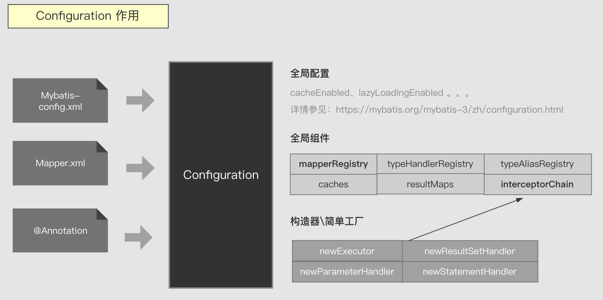
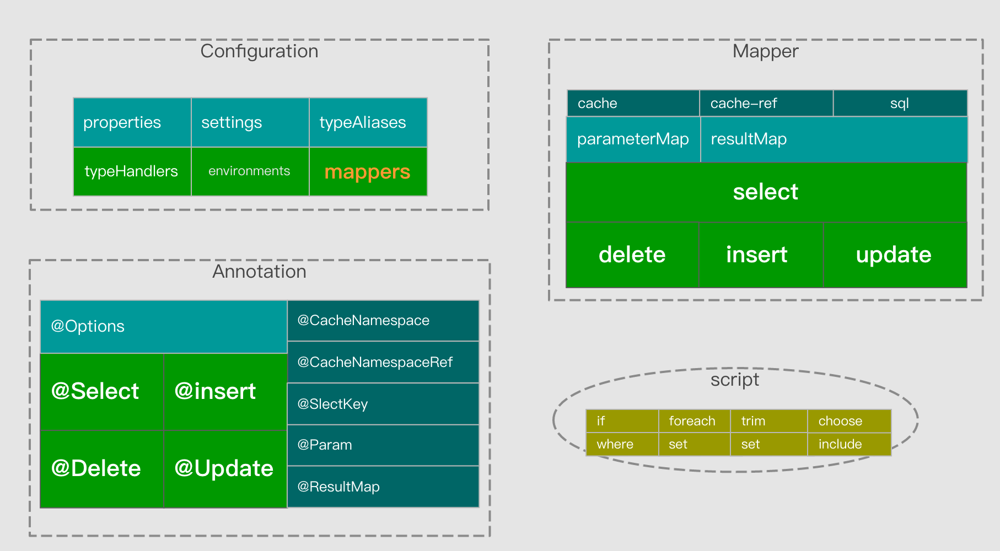
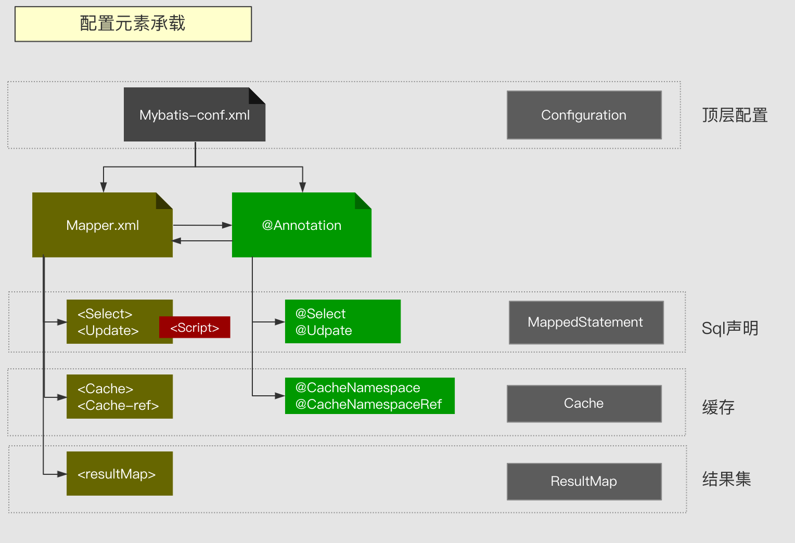
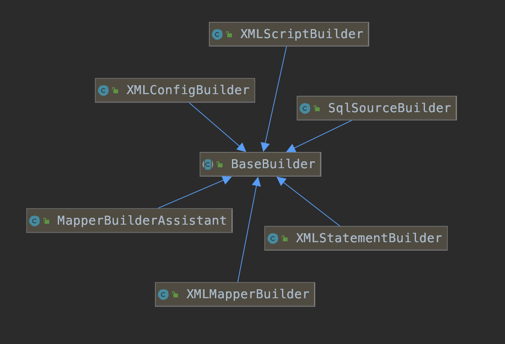
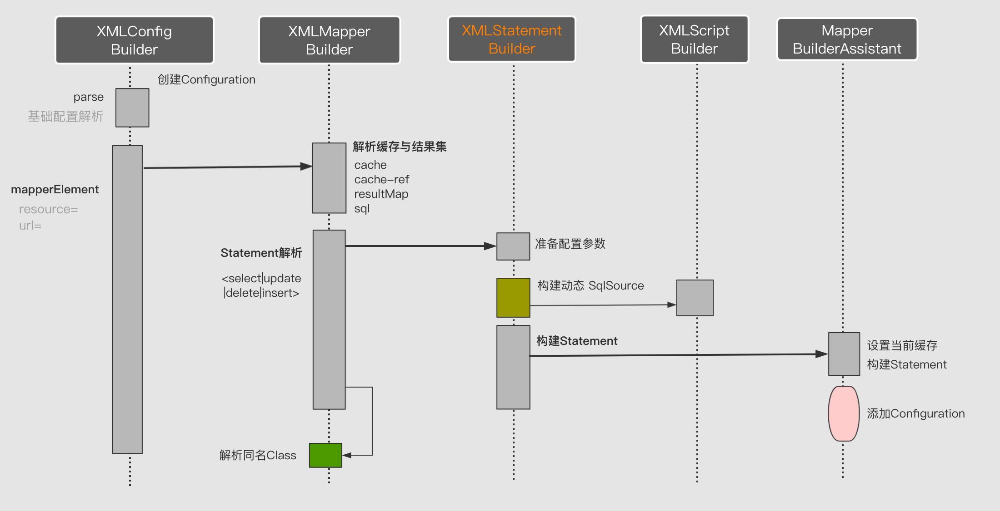
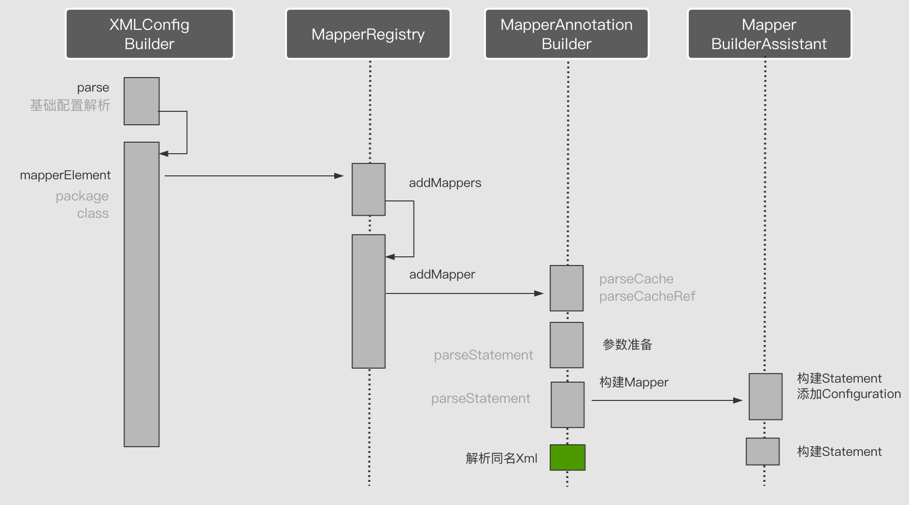

# 第05节 Mybatis的Configuration类

## 一、Configuration 配置体系
### Configuration概述
Configuration是整个MyBatis的【配置体系集中管理中心】，
前面所学Executor、StatementHandler、Cache、MappedStatement…等绝大部分组件都是由它直接或间接的创建和管理。
此外影响这些组件行为的属性配置也是由它进行保存和维护。如cacheEnabled、lazyLoadingEnabled … 等。
所以说它是【MyBatis的大管家】很形象。

### 核心作用总结
```text
1) 存储【全局配置信息】，其来源于settings（设置）

2) 初始化并维护【全局基础组件】
    typeAliases（类型别名）
    typeHandlers（类型处理器）
    plugins（插件）
    environments（环境配置）
    cache(二级缓存空间)
    
3) 初始化并维护【MappedStatement】

4) 【组件构造器】,并基于【插件】进行【增强】
    newExecutor（执行器）
    newStatementHandler（JDBC处理器）
    newResultSetHandler（结果集处理器）
    newParameterHandler（参数处理器）
```

### 配置来源
Configuration 配置来源有三项：
```text
1) Mybatis-config.xml 启动文件，全局配置、全局组件都是来源于此。
2) Mapper.xml SQL映射(MappedStatement) \结果集映射(ResultMapper)都来源于此。
3) @Annotation SQL映射与结果集映射的另一种表达形式。
```


### 配置元素
Configuration 配置信息来源于xml和注解，每个文件和注解都是由若干个配置元素组成，并呈现嵌套关系，总体关系如下图所示：


### 元素承载
无论是xml 还是我注解这些配置元素最弱都要被转换成JAVA配置属性或对象组件来承载。其对应关系如下：
```text
全局配置(config.xml) 由Configuration对像属性承载
sql映射<select|insert…>或@Select 等由MappedStatement对象承载
缓存<cache…>或@CacheNamespace 由Cache对象承载
结果集映射 由ResultMap对象承载
```


### 配置文件解析
配置文件解析需要我们分开讨论，首先来分析XML解析过程。
xml配置解析其底层使用dom4j先解析成一棵节点树，然后根据不同的节点类型与去匹配不同的解析器。最终解析成特定组件。

解析器的基类是【BaseBuilder】其内部包含全局的【configuration对象】，
这么做的用意是所有要解析的组件最后都要集中归属至configuration。接下来了解一下每个解析器的作用：
```text
XMLConfigBuilder :解析config.xml文件，会直接创建一个configuration对象，用于解析全局配置 。
XMLMapperBuilder ：解析Mapper.xml文件，内容包含 等
MapperBuilderAssistant：Mapper.xml解析辅助，在一个Mapper.xml中Cache是对Statement（sql声明）共享的，共享组件的分配即由该解析实现。
XMLStatementBuilder：SQL映射解析 即<select|update|insert|delete> 元素解析成MapperStatement。
SqlSourceBuilder：Sql数据源解析,将声明的SQL解析可执行的SQL。
XMLScriptBuilder：解析动态SQL数据源当中所设置 SqlNode脚本集。
```


### XML文件解析流程
整体解析流程是从XmlConfigBuilder 开始，然后逐步向内解析，直到解析完所有节点。
我们通过一个MappedStatement解析过程即可了解到期整体解析流程。


#### 流程说明：
```text
【XmlConfigBuilder】 接收一个config.xml 输入流，然后创建一个空Configuration对象
【XmlConfigBuilder】解析全局配置
【XmlConfigBuilder】mapperElements解析，通过Resource或url 指定mapper.xml文件
【XmlMapperBuilder】解析缓存、结果集配置等公共配置
【XmlMapperBuilder】解析Sql映射<select|insert|upate|delete>
【XMLScriptBuilder】解析生成SQL数据源，包括动态脚本
【XmlMapperBuilder】构建Statement
【MapperBuilderAssistant】设置缓存并添加至Configuration
```

### 注解配置解析
注解解析底层实现是通过反射获取Mapper接口当中注解元素实现。有两种方式一种是直接指定接口名，一种是指定包名然后自动扫描包下所有的接口类。这些逻辑均由Mapper注册器(MapperRegistry)实现。其接收一个接口类参数，并基于该参数创建针对该接口的动态代理工厂，然后解析内部方法注解生成每个MapperStatement 最后添加至Configuration 完成解析。



## 二、Configuration 源码
### 属性
```text
package org.apache.ibatis.session;

public class Configuration {
  /**   
  * MyBatis 可以配置成适应多种环境，这种机制有助于将 SQL 映射应用于多种数据库之中,   
  * 比如设置不同的开发、测试、线上配置，在每个配置中可以配置事务管理器和数据源对象.   
  */
  protected Environment environment;
 
  // 允许在嵌套语句中使用分页（RowBounds）。如果允许使用则设置为false。  
  protected boolean safeRowBoundsEnabled = false;   
  // 允许在嵌套语句中使用分页（ResultHandler）。如果允许使用则设置为false  
  protected boolean safeResultHandlerEnabled = true;  
  // 是否开启自动驼峰命名规则（camel case）映射，即从经典数据库列名 A_COLUMN 到经典 Java 属性名 aColumn 的类似映射。  
  protected boolean mapUnderscoreToCamelCase = false; 
  // 当开启时，任何方法的调用都会加载该对象的所有属性。否则，每个属性会按需加载（参考lazyLoadTriggerMethods).
  protected boolean aggressiveLazyLoading = true;  
  // 是否允许单一语句返回多结果集（需要兼容驱动）
  protected boolean multipleResultSetsEnabled = true;   
  // 允许 JDBC 支持自动生成主键，需要驱动兼容。 如果设置为 true 则这个设置强制使用自动生成主键，尽管一些驱动不能兼容但仍可正常工作（比如 Derby）。  
  protected boolean useGeneratedKeys = false;
  // 使用列标签代替列名。不同的驱动在这方面会有不同的表现， 具体可参考相关驱动文档或通过测试这两种不同的模式来观察所用驱动的结果。
  protected boolean useColumnLabel = true;  
  // 配置全局性的cache开关
  protected boolean cacheEnabled = true;  
  /* 指定当结果集中值为 null 的时候是否调用映射对象的 setter（map 对象时为 put）方法，这对于有 Map.keySet() 依赖或 null 值初始化的时候是有用的。    
  注意基本类型（int、boolean等）是不能设置成 null 的。*/
  protected boolean callSettersOnNulls = false;  
  // 指定 MyBatis 增加到日志名称的前缀。
  protected String logPrefix;  
  // 指定 MyBatis 所用日志的具体实现，未指定时将自动查找
  protected Class <? extends Log> logImpl;  
  /* MyBatis 利用本地缓存机制（Local Cache）防止循环引用（circular references）和加速重复嵌套查询。     
    默认值为 SESSION，这种情况下会缓存一个会话中执行的所有查询。     
    若设置值为 STATEMENT，本地会话仅用在语句执行上，对相同 SqlSession 的不同调用将不会共享数据。*/
  protected LocalCacheScope localCacheScope = LocalCacheScope.SESSION;  
  /* 当没有为参数提供特定的 JDBC 类型时，为空值指定 JDBC 类型。     
    某些驱动需要指定列的 JDBC 类型，多数情况直接用一般类型即可，比如 NULL、VARCHAR 或 OTHER。*/
  protected JdbcType jdbcTypeForNull = JdbcType.OTHER;  
  // 指定哪个对象的方法触发一次延迟加载。
  protected Set<String> lazyLoadTriggerMethods = new HashSet<String>(Arrays.asList(new String[] { "equals", "clone", "hashCode", "toString" }));  
  // 设置超时时间，它决定驱动等待数据库响应的秒数。
  protected Integer defaultStatementTimeout;  
  /* 配置默认的执行器。    
       SIMPLE 就是普通的执行器；    
       REUSE 执行器会重用预处理语句（prepared statements）；     
       BATCH 执行器将重用语句并执行批量更新。*/  
  protected ExecutorType defaultExecutorType = ExecutorType.SIMPLE;  
  /**   
    * 指定 MyBatis 应如何自动映射列到字段或属性。    
    * NONE 表示取消自动映射；   
    * PARTIAL 只会自动映射没有定义嵌套结果集映射的结果集。   
    * FULL 会自动映射任意复杂的结果集（无论是否嵌套）。   
    */
  protected AutoMappingBehavior autoMappingBehavior = AutoMappingBehavior.PARTIAL;

  // 这里配置的属性可以在整个配置文件中使用来替换需要动态配置的属性值    
  protected Properties variables = new Properties();
  // 对象创建工厂，默认的实现类DefaultObjectFactory，用来创建对象，比如传入List.class，利用反射返回ArrayList的实例
  protected ObjectFactory objectFactory = new DefaultObjectFactory();  
  // 对象包装工厂，默认实现类是DefaultObjectWrapperFactory，包装Object实例
  protected ObjectWrapperFactory objectWrapperFactory = new DefaultObjectWrapperFactory();  
  // 注册Mapper
  protected MapperRegistry mapperRegistry = new MapperRegistry(this);
  // 延迟加载的全局开关。当开启时，所有关联对象都会延迟加载。 特定关联关系中可通过设置fetchType属性来覆盖该项的开关状态。
  protected boolean lazyLoadingEnabled = false;  
  // 指定 Mybatis 创建具有延迟加载能力的对象所用到的代理工具
  protected ProxyFactory proxyFactory;
  // 数据库类型id，MyBatis 可以根据不同的数据库厂商执行不同的语句，这种多厂商的支持是基于映射语句中的 databaseId 属性
  protected String databaseId;
  /**   　　 
 　 * 指定一个提供Configuration实例的类. 这个被返回的Configuration实例是用来加载被反序列化对象的懒加载属性值. 
    * 这个类必须包含一个签名方法static Configuration getConfiguration(). (从 3.2.3 版本开始)
    */    
  protected Class<?> configurationFactory;
  // 拦截器链
  protected final InterceptorChain interceptorChain = new InterceptorChain();  
  // TypeHandler注册
  protected final TypeHandlerRegistry typeHandlerRegistry = new TypeHandlerRegistry();  
  // 别名和具体类注册
  protected final TypeAliasRegistry typeAliasRegistry = new TypeAliasRegistry();  
  // 这个是指定解析的驱动，比如你可以使用velocity模板引擎来替代xml文件，默认是XMLLanguageDriver，也就是使用xml文件来写sql语句
  protected final LanguageDriverRegistry languageRegistry = new LanguageDriverRegistry();
  // 对应Mapper.xml里配置的Statement
  protected final Map<String, MappedStatement> mappedStatements = new StrictMap<MappedStatement>("Mapped Statements collection");  
  // 对应Mapper.xml里配置的cache 也就是二级缓存
  protected final Map<String, Cache> caches = new StrictMap<Cache>("Caches collection");  
  // 对应Mapper.xml里的ResultMap
  protected final Map<String, ResultMap> resultMaps = new StrictMap<ResultMap>("Result Maps collection");  
  // 对应Mapper.xml里的ParameterMap
  protected final Map<String, ParameterMap> parameterMaps = new StrictMap<ParameterMap>("Parameter Maps collection");  
  // 主键生成器
  protected final Map<String, KeyGenerator> keyGenerators = new StrictMap<KeyGenerator>("Key Generators collection");
  // 存储已经加载过的mapper xml资源，见MapperAnnotationBuilder#loadXmlResource
  protected final Set<String> loadedResources = new HashSet<String>();  
  // 存储已经解析过的mapper对应的xml节点
  protected final Map<String, XNode> sqlFragments = new StrictMap<XNode>("XML fragments parsed from previous mappers");
  // 存储所有未处理的
  protected final Collection<XMLStatementBuilder> incompleteStatements = new LinkedList<XMLStatementBuilder>();  
  // 存储所有未处理的缓存信息
  protected final Collection<CacheRefResolver> incompleteCacheRefs = new LinkedList<CacheRefResolver>();  
  // 存储所有未处理ResultMap的映射信息
  protected final Collection<ResultMapResolver> incompleteResultMaps = new LinkedList<ResultMapResolver>();
  protected final Collection<MethodResolver> incompleteMethods = new LinkedList<MethodResolver>();
  /*     
   * A map holds cache-ref relationship. The key is the namespace that      
   * references a cache bound to another namespace and the value is the      
   * namespace which the actual cache is bound to.      
   */    
  protected final Map<String, String> cacheRefMap = new HashMap<String, String>();
  public Configuration(Environment environment) {
    this();
    this.environment = environment;
  }

  public Configuration() {
    // 通过使用TypeAliasRegistry来注册一些类的别名
    typeAliasRegistry.registerAlias("JDBC", JdbcTransactionFactory.class);
    typeAliasRegistry.registerAlias("MANAGED", ManagedTransactionFactory.class);

    typeAliasRegistry.registerAlias("JNDI", JndiDataSourceFactory.class);
    typeAliasRegistry.registerAlias("POOLED", PooledDataSourceFactory.class);
    typeAliasRegistry.registerAlias("UNPOOLED", UnpooledDataSourceFactory.class);

    typeAliasRegistry.registerAlias("PERPETUAL", PerpetualCache.class);
    typeAliasRegistry.registerAlias("FIFO", FifoCache.class);
    typeAliasRegistry.registerAlias("LRU", LruCache.class);
    typeAliasRegistry.registerAlias("SOFT", SoftCache.class);
    typeAliasRegistry.registerAlias("WEAK", WeakCache.class);

    typeAliasRegistry.registerAlias("DB_VENDOR", VendorDatabaseIdProvider.class);

    typeAliasRegistry.registerAlias("XML", XMLLanguageDriver.class);
    typeAliasRegistry.registerAlias("RAW", RawLanguageDriver.class);

    typeAliasRegistry.registerAlias("SLF4J", Slf4jImpl.class);
    typeAliasRegistry.registerAlias("COMMONS_LOGGING", JakartaCommonsLoggingImpl.class);
    typeAliasRegistry.registerAlias("LOG4J", Log4jImpl.class);
    typeAliasRegistry.registerAlias("LOG4J2", Log4j2Impl.class);
    typeAliasRegistry.registerAlias("JDK_LOGGING", Jdk14LoggingImpl.class);
    typeAliasRegistry.registerAlias("STDOUT_LOGGING", StdOutImpl.class);
    typeAliasRegistry.registerAlias("NO_LOGGING", NoLoggingImpl.class);

    typeAliasRegistry.registerAlias("CGLIB", CglibProxyFactory.class);
    typeAliasRegistry.registerAlias("JAVASSIST", JavassistProxyFactory.class);

    // 默认为动态SQL解析
    languageRegistry.setDefaultDriverClass(XMLLanguageDriver.class);
    // 也添加上静态SQL解析
    languageRegistry.register(RawLanguageDriver.class);
  }
  
 }

```

### 创建四大组件
把四大组件放在这里创建，主要是为了注册拦截器链interceptorChain
```text
  // 创建【参数处理器】
  public ParameterHandler newParameterHandler(MappedStatement mappedStatement, Object parameterObject, BoundSql boundSql) {
    ParameterHandler parameterHandler = mappedStatement.getLang().createParameterHandler(mappedStatement, parameterObject, boundSql);
    parameterHandler = (ParameterHandler) interceptorChain.pluginAll(parameterHandler);
    return parameterHandler;
  }
 
  // 创建【结果集处理器】
  public ResultSetHandler newResultSetHandler(Executor executor, MappedStatement mappedStatement, RowBounds rowBounds, ParameterHandler parameterHandler,
      ResultHandler resultHandler, BoundSql boundSql) {
    ResultSetHandler resultSetHandler = new DefaultResultSetHandler(executor, mappedStatement, parameterHandler, resultHandler, boundSql, rowBounds);
    resultSetHandler = (ResultSetHandler) interceptorChain.pluginAll(resultSetHandler);
    return resultSetHandler;
  }

  // 创建【Statement处理器】
  public StatementHandler newStatementHandler(Executor executor, MappedStatement mappedStatement, Object parameterObject, RowBounds rowBounds, ResultHandler resultHandler, BoundSql boundSql) {
    StatementHandler statementHandler = new RoutingStatementHandler(executor, mappedStatement, parameterObject, rowBounds, resultHandler, boundSql);
    statementHandler = (StatementHandler) interceptorChain.pluginAll(statementHandler);
    return statementHandler;
  }
 
  // 创建【执行器】
  public Executor newExecutor(Transaction transaction) {
    return newExecutor(transaction, defaultExecutorType);
  }

  public Executor newExecutor(Transaction transaction, ExecutorType executorType) {
    executorType = executorType == null ? defaultExecutorType : executorType;
    executorType = executorType == null ? ExecutorType.SIMPLE : executorType;
    Executor executor;
    if (ExecutorType.BATCH == executorType) {
      executor = new BatchExecutor(this, transaction);
    } else if (ExecutorType.REUSE == executorType) {
      executor = new ReuseExecutor(this, transaction);
    } else {
      executor = new SimpleExecutor(this, transaction);
    }
    if (cacheEnabled) {
      executor = new CachingExecutor(executor);
    }
    executor = (Executor) interceptorChain.pluginAll(executor);
    return executor;
  }

```

### setter/getter方法
这个就省略啦