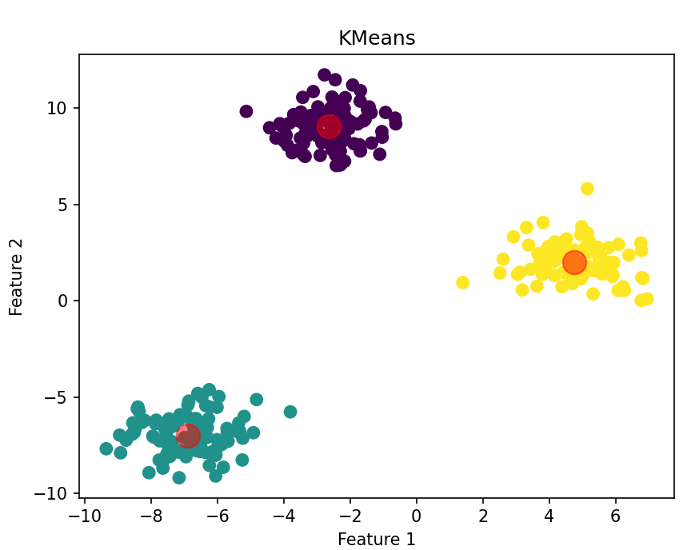
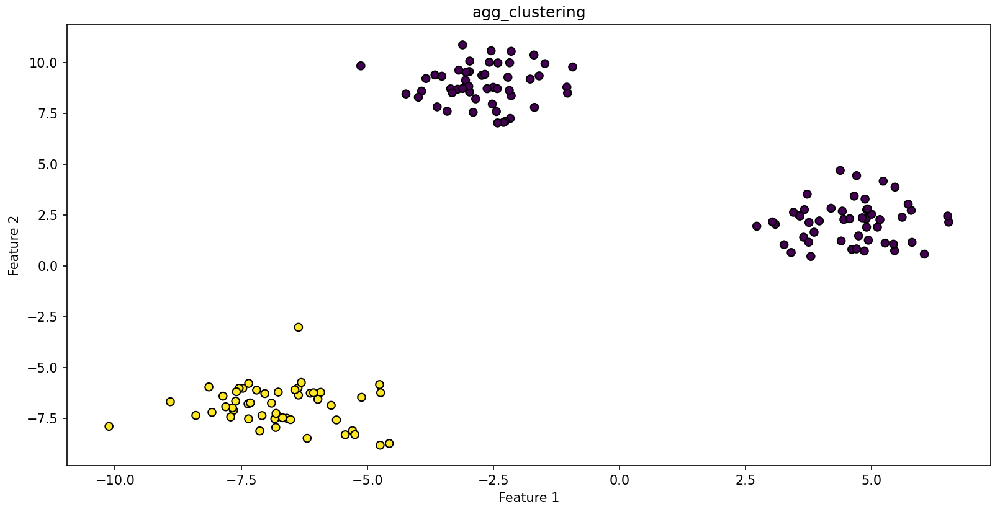
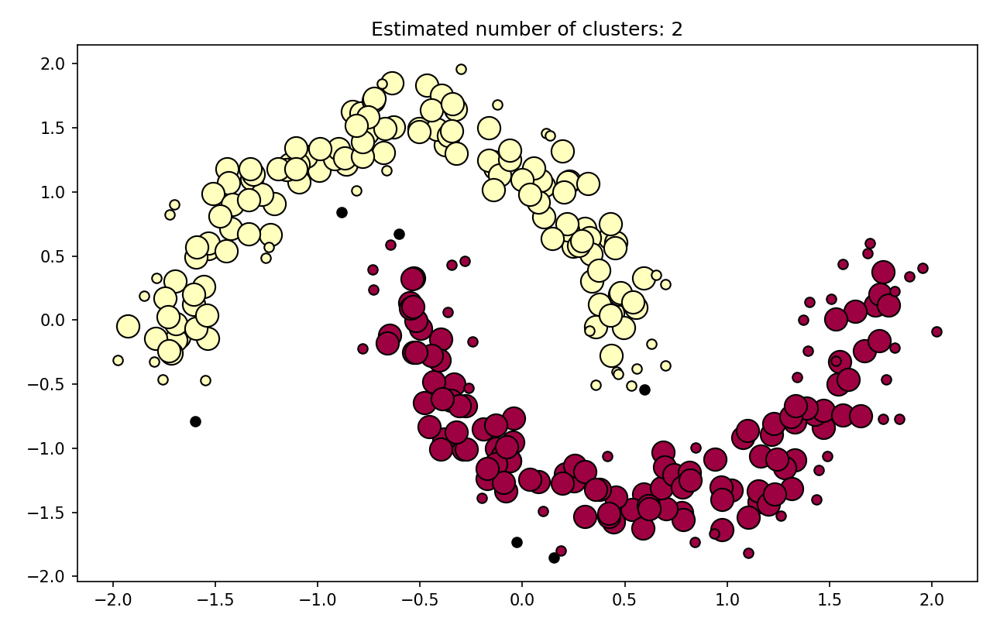
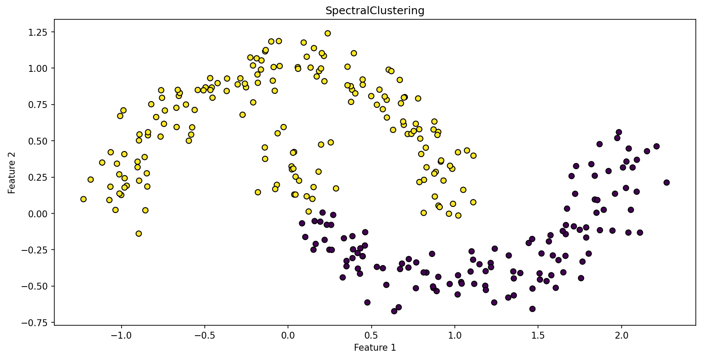
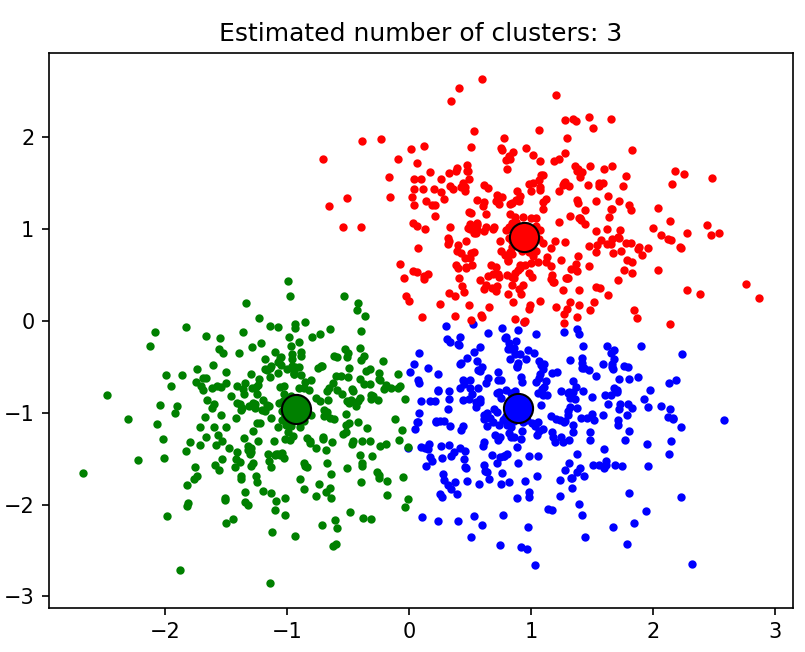
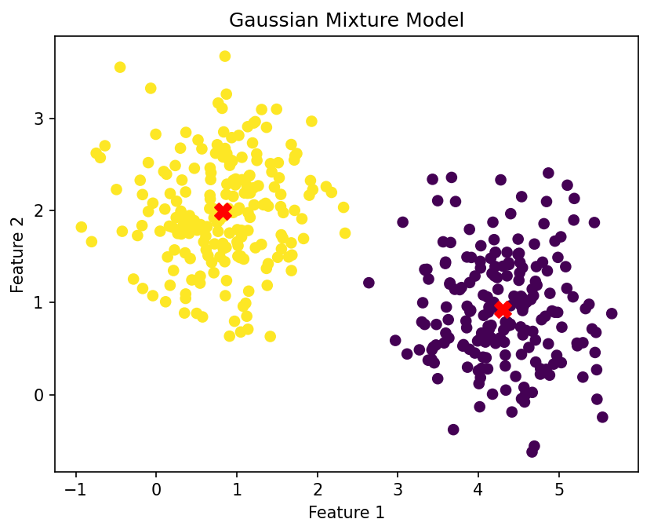

# Python 机器学习 聚类算法

聚类算法是机器学习中一种重要的无监督学习算法，
它的目的是将一组数据分成几个簇，使得同一个簇内的数据点之间相似度高，而不同簇内的数据点相似度低。

聚类算法广泛应用于数据挖掘、图像分割、市场细分等领域。

选择合适的聚类算法通常取决于数据的特性和分析目标。

## 1、K-均值聚类（K-Means Clustering）
K-均值聚类（K-Means Clustering）是一种广泛使用的机器学习算法，它属于无监督学习算法。
这种算法试图将数据分成预先指定数量的簇，使得同一簇内的数据点相似度高，而不同簇内的数据点相似度低。

初始化过程中，通过随机选择K个数据点作为起始的簇中心（质心）开始。
接着，在分配阶段，每个数据点会被分配给与其距离最小的簇中心，确保每个数据点归属于最近的簇。
随后的更新阶段要求对每个簇重新计算中心，通常采取簇内所有点的均值作为新的簇中心。
此过程不断重复，即不停地执行分配和更新步骤，直到满足结束条件：
簇中心不再发生显著变化，或者变化非常小，或者达到了预先设置的迭代次数上限。
此过程是很多聚类算法中的核心步骤，可以通过不断优化簇中心的位置，来提高聚类的准确性和效率。

K-均值聚类算法的关键参数是K，即预先设定的簇的数量。选择合适的K值是实现好的聚类效果的关键。
不同的K值会导致聚类结果的显著不同，通常需要依据具体问题和数据集的特性来决定。
有多种方法可以帮助确定最佳的K值，如肘方法（Elbow Method）和轮廓系数（Silhouette Coefficient）。

Python 的scikit-learn 库中，K-means 算法由 KMeans 类提供，它有多个参数可以调整算法的行为。

常用参数如下，

| 参数                   | 类型                 | 描述                                                                                                   |
|----------------------|--------------------|------------------------------------------------------------------------------------------------------|
| n_clusters           | 整数                 | 要形成的簇的数量，也即是中心点的数量。这是最重要的参数，直接影响聚类的结果。                                                               |
| init                 | 字符串或 ndarray       | 初始化中心点的方法。可以是 'k-means++'、'random' 或者传递一个 ndarray。'k-means++' 通过一种智能方式加速收敛，而 'random' 则从数据中随机选择初始中心。 |
| n_init               | 整数                 | 算法运行带不同质心种子的次数。默认为 10，算法将运行 n_init 次并选择误差平方和（SSE）最低的作为最终结果。                                          |
| max_iter             | 整数                 | 最大迭代次数，如果在达到最大次数之前已经收敛，则提前停止。默认值为 300。                                                               |
| tol                  | 浮点数                | 收敛的容忍度。如果簇中心的移动距离小于此值，则认为算法已经收敛。默认值为 1e-4。                                                           |
| precompute_distances | 废弃                 | （已废弃）是否提前计算距离。这个参数已在较新版本中废弃。                                                                         |
| verbose              | 整数                 | 控制算法的冗余级别。较高的值表示更多的信息输出。                                                                             |
| random_state         | 整数或 RandomState 实例 | 随机数生成器的种子。用于结果的可重现性。                                                                                 |
| algorithm            | 字符串                | 执行 K-means 算法的方法。可选 'auto'、'full' 或 'elkan'，其中 'auto' 会根据数据的特性自动选择最适合的算法。                            |

使用示例，
```text
from sklearn.cluster import KMeans
from sklearn.datasets import make_blobs
import matplotlib.pyplot as plt

# 生成样本数据
n_samples = 300
random_state = 42
X, _ = make_blobs(n_samples=n_samples, random_state=random_state)

# 设置KMeans聚类
kmeans = KMeans(n_clusters=3,  # 聚类中心的数量
                init='k-means++',  # 初始化中心点的方法
                n_init=10,  # 不同质心种子的运行次数
                max_iter=300,  # 最大迭代次数
                tol=1e-4,  # 收敛的容忍度
                random_state=random_state)  # 随机数种子，确保可重复性

# 对数据进行聚类
kmeans.fit(X)

# 预测每个样本的簇标签
labels = kmeans.labels_

# 获取聚类中心
centers = kmeans.cluster_centers_

# 绘制样本和聚类中心
plt.scatter(X[:, 0], X[:, 1], c=labels, s=50, cmap='viridis')
plt.scatter(centers[:, 0], centers[:, 1], c='red', s=200, alpha=0.5)
plt.title("KMeans")
plt.xlabel("Feature 1")
plt.ylabel("Feature 2")
plt.draw()
plt.show()
```
输出：



如果运行报错的话，可以运行一下命令：
```text
pip install --upgrade threadpoolctl==3.1.0
```

## 2、层次聚类（Hierarchical Clustering）
层次聚类（Hierarchical Clustering）是一种常用的聚类算法，
它旨在通过构建一个聚类层次来组织数据，可以是自底向上的聚合（Agglomerative）方式，也可以是自顶向下的分裂（Divisive）方式。
此算法不需要预先指定聚类的数量，非常适合于那些聚类结构未知或者聚类数量不确定的数据集。

在聚合方法中，每个数据点最初被视为一个独立的聚类，然后算法逐步将最相似的聚类合并，直至形成一个全局聚类或满足特定条件。
相反，分裂方法从将所有数据视为一个整体聚类开始，逐步将其分裂成最不相似的子聚类，直到每个聚类只包含单个数据点或达到特定条件。
在这个过程中，聚类之间的相似度可以通过不同的度量方式来计算，
包括单链接、完全链接、平均链接和中心链接方法，分别基于聚类中点对的最近距离、最远距离、平均距离和聚类中心点之间的距离来定义聚类间的相似度。

AgglomerativeClustering 是 scikit-learn（一个 Python 机器学习库）中的一种层次聚类算法。

常用参数如下，

| 参数名                | 默认值         | 描述                                                                        |
|--------------------|-------------|---------------------------------------------------------------------------|
| n_clusters         | 2           | 最终要形成的聚类数量。                                                               |
| metric             | 'euclidean' | 计算链接的距离度量，可以是 'euclidean'、'l1'、'l2'、'manhattan'、'cosine' 或 'precomputed'。 |
| linkage            | 'ward'      | 用于计算聚类间距离的链接策略，可以是 'ward'、'complete'、'average' 或 'single'。                |
| memory             | None        | 缓存连接矩阵以避免重复计算的位置，可以是字符串（缓存目录）或对象。                                         |
| compute_full_tree  | 'auto'      | 是否计算完整的合并树。如果是 'auto'，则只在需要时计算。也可以设置为 True 或 False。                       |
| distance_threshold | None        | 聚类停止的距离阈值。如果设置了这个参数，n_clusters必须为 None。                                   |

使用示例，
```text
# 导入必要的库
import matplotlib.pyplot as plt
from sklearn.cluster import AgglomerativeClustering
from sklearn.datasets import make_blobs

# 生成样本数据
X, y = make_blobs(n_samples=150, centers=3, cluster_std=1.0, random_state=42)

# 创建 AgglomerativeClustering 模型
agg_clustering = AgglomerativeClustering(metric='euclidean', linkage='ward')

# 拟合模型
y_pred = agg_clustering.fit_predict(X)

# 可视化结果
plt.figure(figsize=(10, 7))
plt.scatter(X[:, 0], X[:, 1], c=y_pred, cmap='viridis', marker='o', edgecolor='k')
# 标注
plt.title('KMeans')
plt.xlabel('Feature 1')
plt.ylabel('Feature 2')
plt.draw()
plt.show()
```
输出：



## 3、DBSCAN（Density-Based Spatial Clustering of Applications with Noise）
DBSCAN（Density-Based Spatial Clustering of Applications with Noise）是一种基于密度的空间聚类算法，
它能够将高密度区域的数据点归为同一个簇，适用于发现任意形状的簇并能够在噪声中识别出样本点。

DBSCAN算法的主要优势是不需要预先指定簇的数量，能够识别出噪声点，并且对数据集的形状和大小不敏感。

DBSCAN工作原理是先为每个点计算其eps邻域内的点数；如果某点的eps邻域内至少有min_samples个点，则该点被认定为【核心点】。
核心点及其密度可达的点形成一个簇。
对每个核心点，如果它还未归属于任何簇，就创建一个新的簇，并将其eps邻域内的所有点归入该簇，递归地应用这一过程。
那些既不是核心点也不是核心点密度可达的点，被视为【噪声】。
这种方法的优势在于其对于噪声的鲁棒性以及能够发现非线性分布的簇，而且不需要像K-means算法那样预先指定簇的数目。

DBSCAN 类是 scikit-learn 中的一种基于密度的聚类算法，常用参数如下，

| 参数          | 描述                                                             |
|-------------|----------------------------------------------------------------|
| eps         | 两个样本被认为是邻居的最大距离。较小的 eps 值导致更多、更小的聚类，较大的值导致较少、较大的聚类。默认依赖于具体实现。  |
| min_samples | 成为核心点所需的最小样本数（或邻居数），控制聚类的紧密程度。默认值为5。                           |
| metric      | 实例之间距离的度量方法，如'euclidean'、'manhattan'、'cosine'等。默认为'euclidean'。 |
| algorithm   | 计算点邻居的算法，包括'auto'、'ball_tree' 、'kd_tree'、'brute'。默认为'auto'。    |
| leaf_size   | 当使用 'ball_tree' 或 'kd_tree' 算法时，影响树构建和查询速度的参数。默认值为30。          |
| n_jobs      | 指定并行运行的作业数。-1意味着使用所有可用的CPU核心，可以加速邻居搜索步骤。默认未指定（None）。           |

使用代码，
```text
import numpy as np
import matplotlib.pyplot as plt
from sklearn.cluster import DBSCAN
from sklearn.datasets import make_moons
from sklearn.preprocessing import StandardScaler

# 生成数据：两个半月形
X, labels_true = make_moons(n_samples=300, noise=0.1, random_state=42)

# 数据标准化
X = StandardScaler().fit_transform(X)

# DBSCAN模型
dbscan = DBSCAN(eps=0.3, min_samples=10, metric='euclidean', algorithm='auto', leaf_size=30, n_jobs=-1)

# 模型拟合
dbscan.fit(X)

# 获取聚类标签
labels = dbscan.labels_

# 聚类结果的核心样本索引
core_samples_mask = np.zeros_like(dbscan.labels_, dtype=bool)
core_samples_mask[dbscan.core_sample_indices_] = True

# 聚类数量，忽略噪声点（如果存在）
n_clusters_ = len(set(labels)) - (1 if -1 in labels else 0)
n_noise_ = list(labels).count(-1)

print('Estimated number of clusters: %d' % n_clusters_)
print('Estimated number of noise points: %d' % n_noise_)

# 绘制结果
plt.figure(figsize=(10, 6))
# 黑色被用来表示噪声。
unique_labels = set(labels)
colors = [plt.cm.Spectral(each) for each in np.linspace(0, 1, len(unique_labels))]
for k, col in zip(unique_labels, colors):
    if k == -1:
        # 黑色用于噪声。
        col = [0, 0, 0, 1]

    class_member_mask = (labels == k)

    # 绘制核心点
    xy = X[class_member_mask & core_samples_mask]
    plt.plot(xy[:, 0], xy[:, 1], 'o', markerfacecolor=tuple(col), markeredgecolor='k', markersize=14)

    # 绘制非核心点
    xy = X[class_member_mask & ~core_samples_mask]
    plt.plot(xy[:, 0], xy[:, 1], 'o', markerfacecolor=tuple(col), markeredgecolor='k', markersize=6)

plt.title('Estimated number of clusters: %d' % n_clusters_)
plt.show()
```
输出：
```text
Estimated number of clusters: 2
Estimated number of noise points: 6
```



## 4、谱聚类（Spectral Clustering）
谱聚类（Spectral Clustering）是一种基于图的聚类算法，用于发现数据的组结构。
它不直接在【原始特征空间】上进行聚类，
而是通过分析数据的【相似度矩阵】来进行，能够识别出复杂形状的数据集群，并且对于数据集中的噪声也具有较好的鲁棒性。

Scikit-learn 的 SpectralClustering 类是一种基于图论的聚类方法，常用参数如下，

| 参数名           | 默认值        | 说明                                                           |
|---------------|------------|--------------------------------------------------------------|
| n_clusters    | 8          | 聚类的数量，即最终聚类中心的数量。                                            |
| eigen_solver  | None       | 用于降维步骤的特征值分解的策略。可选值包括 'arpack', 'lobpcg', 'amg'。             |
| n_components  | n_clusters | 降维后的维度数目。                                                    |
| random_state  | None       | 控制随机数生成器的状态，用于结果的可复现。                                        |
| n_init        | 10         | 运行算法的次数，最终结果会从中选择最佳输出。                                       |
| gamma         | 1.0        | RBF核的系数，仅当使用RBF核时适用。                                         |
| affinity      | 'rbf'      | 用于计算亲和力矩阵的方法。 可选值包括 'nearest_neighbors' 和 'rbf' 等，也可以是自定义函数。 |
| n_neighbors   | 10         | 如果affinity='nearest_neighbors'，则表示选取的近邻的数量。                  |
| assign_labels | 'kmeans'   | 聚类分配标签的策略，可选值为 'kmeans' 和 'discretize'。                      |
| degree        | 3          | 如果affinity='polynomial'，则为多项式核的度数。                           |
| coef0         | 1          | 如果affinity在['polynomial', 'sigmoid']中，则为核函数的独立项。             |
| kernel_params | None       | 传递给选定的核函数的参数。                                                |

使用代码，
```text
from sklearn.cluster import SpectralClustering
from sklearn.datasets import make_moons
import matplotlib.pyplot as plt

# 生成一些用于聚类的模拟数据
X, _ = make_moons(n_samples=300, noise=0.1, random_state=42)

# 配置 SpectralClustering
clustering = SpectralClustering(n_clusters=2,
                                eigen_solver='arpack',
                                affinity='nearest_neighbors',
                                n_neighbors=10,
                                assign_labels='kmeans',
                                random_state=42)

# 应用聚类
labels = clustering.fit_predict(X)

# 可视化聚类结果
plt.scatter(X[:, 0], X[:, 1], c=labels, cmap='viridis', edgecolors='k')
plt.title('SpectralClustering')
plt.xlabel('Feature 1')
plt.ylabel('Feature 2')
plt.draw()
plt.show()
```
output:



## 5、均值漂移聚类（Mean Shift Clustering）
均值漂移聚类（Mean Shift Clustering）是一种非参数的密度估计聚类算法，它不需要事先指定聚类的数量。
均值漂移算法的【基本思想】是迭代地更新候选聚类中心，使其向数据点密度最大的区域移动，直至收敛。

MeanShift 是 scikit-learn 中的一个非参数估计方法，用于寻找样本空间中的密度峰值。

常用参数如下，

| 参数           | 描述                                                         |
|--------------|------------------------------------------------------------|
| bandwidth    | 定义样本空间中“搜索窗口”的大小。影响聚类的粒度。未指定时，算法尝试估计一个合适的值。                |
| seeds        | 初始种子点的列表。未指定时，所有样本点被视为初始种子。                                |
| bin_seeding  | 布尔值，如果为 True，则使用高效的方法初始化种子点，通常会导致更快的收敛。可能会导致大数据集的内存问题。     |
| min_bin_freq | 与bin_seeding方法一起使用。是种子点在其邻域内需要有的最小样本数，以被考虑为种子点的阈值。         |
| cluster_all  | 布尔值，指定是否将所有点都分配给聚类。为 False 时，距离最近聚类中心超过bandwidth的样本被标记为噪声。 |
| n_jobs       | 指定并行计算时使用的CPU核心数。如果设置为 -1，则使用所有可用的核心。可显著加速执行时间，尤其是处理大数据集时。 |

使用代码，
```text
from itertools import cycle
import numpy as np
from sklearn.cluster import MeanShift, estimate_bandwidth
from sklearn.datasets import make_blobs
import matplotlib.pyplot as plt

# 生成一些样本数据
centers = [[1, 1], [-1, -1], [1, -1]]
X, _ = make_blobs(n_samples=1000, centers=centers, cluster_std=0.6)

# 使用estimate_bandwidth自动估计bandwidth值
bandwidth = estimate_bandwidth(X, quantile=0.2, n_samples=500)

# 初始化MeanShift
ms = MeanShift(bandwidth=bandwidth, bin_seeding=True)

# 对数据应用聚类
ms.fit(X)

# 提取聚类标签和聚类中心
labels = ms.labels_
cluster_centers = ms.cluster_centers_

# 获取聚类的数量（标签中的唯一值数量）
labels_unique = np.unique(labels)
n_clusters_ = len(labels_unique)

print("Number of estimated clusters : %d" % n_clusters_)

# 绘制结果
plt.figure(1)
plt.clf()

colors = cycle('bgrcmykbgrcmykbgrcmykbgrcmyk')
for k, col in zip(range(n_clusters_), colors):
    my_members = labels == k
    cluster_center = cluster_centers[k]
    plt.plot(X[my_members, 0], X[my_members, 1], col + '.')
    plt.plot(cluster_center[0], cluster_center[1], 'o', markerfacecolor=col,
             markeredgecolor='k', markersize=14)
plt.title('Estimated number of clusters: %d' % n_clusters_)
plt.show()
```
output:
```text
Number of estimated clusters : 3
```



## 6、高斯混合模型（Gaussian Mixture Models, GMM）
高斯混合模型（Gaussian Mixture Models, GMM）是一种概率模型，它假设所有的数据点都是由有限个高斯分布的混合生成的。
每个高斯分布被称为一个“成分”，并且每个成分都具有自己的均值（mean）和协方差矩阵（covariance matrix），
用于描述该成分的数据点的分布情况。

高斯混合模型是一种软聚类方法，不同于K-means这样的硬聚类方法，它允许一个数据点以一定的概率属于多个聚类。

Python中，可以使用scikit-learn库中的GaussianMixture类来实现高斯混合模型。

常用参数如下，

| 参数名             | 类型/默认值                                             | 描述              |
|-----------------|----------------------------------------------------|-----------------|
| n_components    | int, 默认=1                                          | 高斯混合模型的组件数量。    |
| covariance_type | {'full', 'tied', 'diag', 'spherical'}, 默认='full'   | 组件协方差参数的类型。     |
| tol             | float, 默认=1e-3                                     | 收敛阈值。           |
| reg_covar       | float, 默认=1e-6                                     | 正则化协方差矩阵以避免奇异性。 |
| max_iter        | int, 默认=100                                        | EM算法的最大迭代次数。    |
| n_init          | int, 默认=1                                          | 初始化次数。          |
| init_params     | {'kmeans', 'random'}, 默认='kmeans'                  | 初始化权重、均值和精度的方法。 |
| weights_init    | array-like of shape (n_components, ), 可选           | 混合组件的初始权重数组。    |
| means_init      | array-like of shape (n_components, n_features), 可选 | 混合组件的初始均值数组。    |
| precisions_init | array-like, 可选                                     | 混合组件的初始精度矩阵。    |

使用代码，

```text
# 导入必要的库
import matplotlib.pyplot as plt
from sklearn.mixture import GaussianMixture
from sklearn.datasets import make_blobs

# 生成模拟数据
X, y_true = make_blobs(n_samples=400, centers=2, cluster_std=0.60, random_state=0)
X = X[:, ::-1]  # 交换列是为了方便绘图

# 创建 GaussianMixture 模型实例
gmm = GaussianMixture(n_components=2, covariance_type='full', tol=1e-3, max_iter=100, n_init=1)

# 拟合数据
gmm.fit(X)

# 预测数据点的标签
labels = gmm.predict(X)

# 绘制结果
plt.scatter(X[:, 0], X[:, 1], c=labels, cmap='viridis', zorder=2)
plt.scatter(gmm.means_[:, 0], gmm.means_[:, 1], c='red', marker='X', s=100, zorder=3)

plt.title('Gaussian Mixture Model')
plt.xlabel('Feature 1')
plt.ylabel('Feature 2')
plt.show()
```
output:

