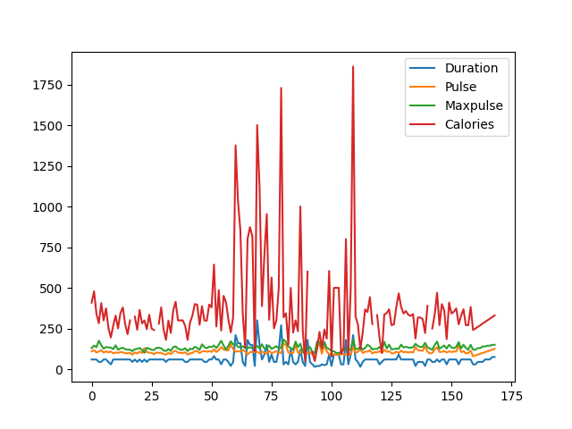
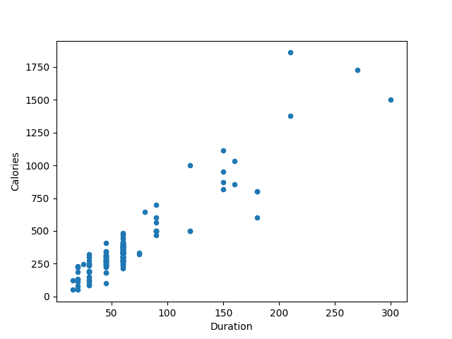
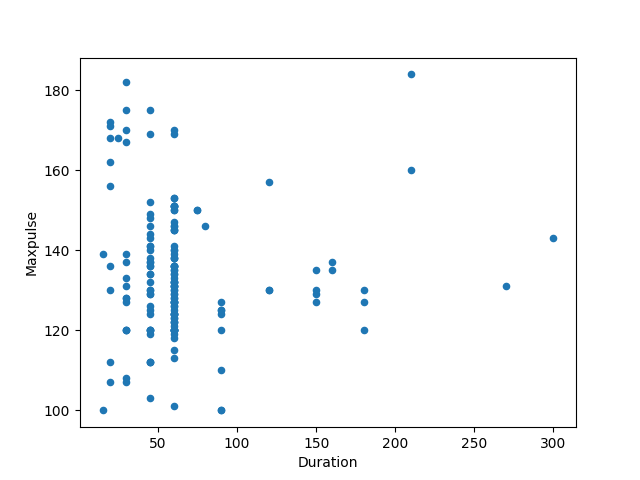
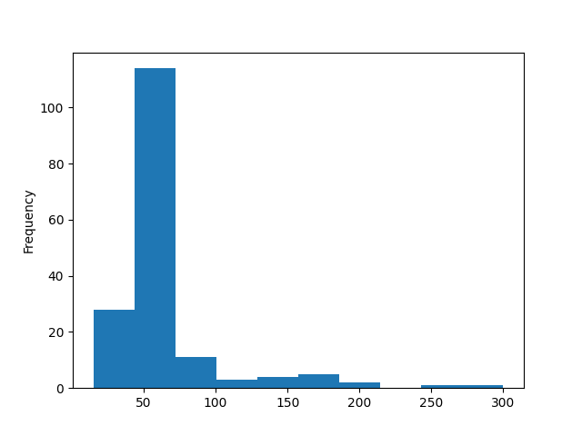

# Python Pandas 绘制图表

Pandas是基于NumPy 的一种工具，该工具是为了解决数据分析任务而创建的。
Pandas 纳入了大量库和一些标准的数据模型，提供了高效地操作大型数据集所需的工具。
Pandas提供了大量能使我们快速便捷地处理数据的函数和方法。
你很快就会发现，它是使Python成为强大而高效的数据分析环境的重要因素之一，本文主要介绍Python Pandas 绘制图表。

## 1、绘制

Pandas使用plot()方法创建图表。

Python使用Matplotlib库的子模块Pyplot在屏幕上可视化该图。

在我们的Matplotlib教程中阅读有关Matplotlib的更多信息。

例如：

从Matplotlib导入pyplot并可视化我们的DataFrame：
```text
import pandas as pd
import matplotlib.pyplot as plt

df = pd.read_csv('data.csv')

df.plot()

plt.show()
```
output:



此页面中的示例使用一个名为“data.csv”的CSV文件。

data.csv文件：https://www.cjavapy.com/download/5fe1f74edc72d93b4993067c/

## 2、散点图(Scatter Plot)
使用kind参数指定要散点图：
```text
kind = 'scatter'
```

散点图需要x轴和y轴。

在下面的示例中，我们将在x轴上使用"Duration"，在y轴上使用"Calories"。

包括如下x和y参数：
```text
x = 'Duration', y = 'Calories'
```

例如：
```text
import pandas as pd
import matplotlib.pyplot as plt

df = pd.read_csv('data/data.csv')

df.plot(kind='scatter', x='Duration', y='Calories')

plt.show()
```
output:



记住：在上一个示例中，我们了解到"Duration" 与 "Calories"之间的相关性为0.922721，并且得出结论，
持续时间越长意味着燃烧的卡路里越多通过查看散点图。

让我们创建另一个散点图，其中列之间存在不良关系，例如“Duration”和“Maxpulse”，且相关性为0.009403：

例如：

散点图，其中各列之间没有关系：
```text
import pandas as pd
import matplotlib.pyplot as plt

df = pd.read_csv('data/data.csv')

df.plot(kind='scatter', x='Duration', y='Maxpulse')

plt.show()
```
output:



## 3、直方图
使用kind参数指定要的直方图：
```text
kind = 'hist'
```

直方图只需要一列。

直方图显示了每个间隔的频率，例如，在50至60分钟之间进行了多少次锻炼？

在下面的示例中，我们将使用"Duration"列创建直方图：

例如：
```text
import pandas as pd
import matplotlib.pyplot as plt

df = pd.read_csv('data/data.csv')

df["Duration"].plot(kind='hist')

plt.show()
```
output:



注意：直方图告诉我们，有100多次锻炼持续了50到60分钟。