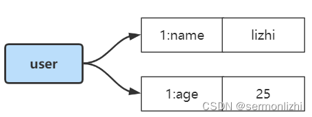
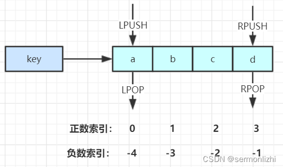
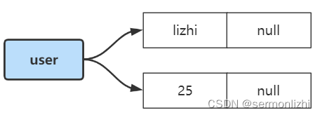
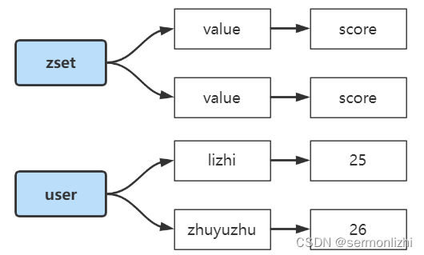
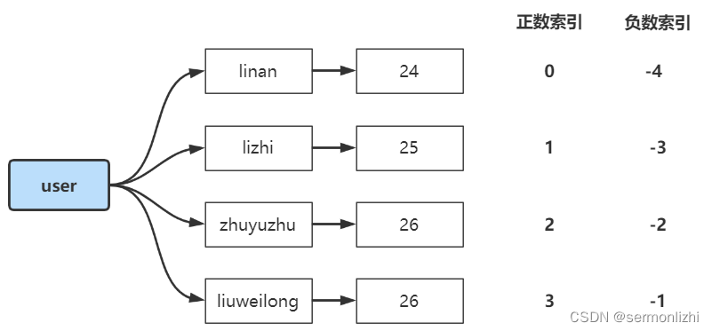
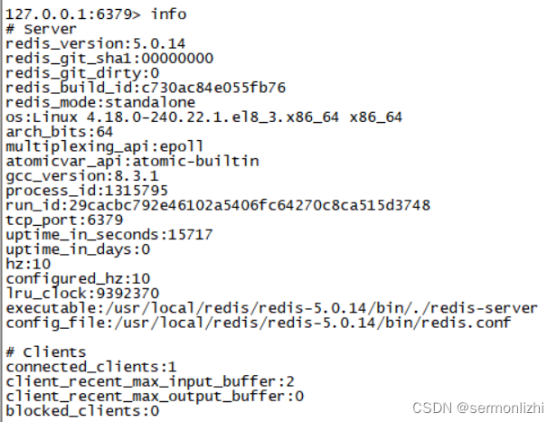
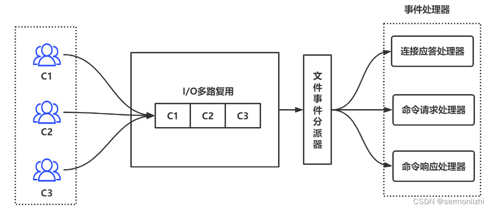

# 第01节 Redis介绍

## 一、Redis安装配置

Redis作为内存数据库的代表作，具有超高的性能，理论上单节点吞吐量可以达到10w，作为重要的产生组件，也是应用最广泛的。

### 1.1 安装Redis
文章就从安装开始认识Redis，下载地址：http://redis.io/download

在linux服务器上下载安装Redis：
```text
// 在Redis官网将鼠标放在下载的url上右键复制链接地址即可
[root@lizhi redis]# wget https://download.redis.io/releases/redis-5.0.14.tar.gz
// 然后进行解压
[root@lizhi redis]# tar -zxf redis-5.0.14.tar.gz
[root@lizhi redis]# ll
total 1956
drwxrwxr-x 6 root root     334 Oct  4  2021 redis-5.0.14
-rw-r--r-- 1 root root 2000179 Oct  4  2021 redis-5.0.14.tar.gz
```
解压后得到的是源文件(C语言编写)，所以需要在linux服务器上安装gcc编译工具，然后通过make命令进行编译和安装。

在安装gcc前需要先检查服务器是否已经安装过，可以通过gcc -v命令查看：
```text
[root@lizhi redis]# gcc -v
Using built-in specs.
COLLECT_GCC=gcc
COLLECT_LTO_WRAPPER=/usr/libexec/gcc/x86_64-redhat-linux/8/lto-wrapper
OFFLOAD_TARGET_NAMES=nvptx-none
OFFLOAD_TARGET_DEFAULT=1
Target: x86_64-redhat-linux
Configured with: ../configure --enable-bootstrap --enable-languages=c,c++,fortran,lto --prefix=/usr --mandir=/usr/share/man --infodir=/usr/share/info --with-bugurl=http://bugzilla.redhat.com/bugzilla --enable-shared --enable-threads=posix --enable-checking=release --enable-multilib --with-system-zlib --enable-__cxa_atexit --disable-libunwind-exceptions --enable-gnu-unique-object --enable-linker-build-id --with-gcc-major-version-only --with-linker-hash-style=gnu --enable-plugin --enable-initfini-array --with-isl --disable-libmpx --enable-offload-targets=nvptx-none --without-cuda-driver --enable-gnu-indirect-function --enable-cet --with-tune=generic --with-arch_32=x86-64 --build=x86_64-redhat-linux
Thread model: posix
gcc version 8.3.1 20191121 (Red Hat 8.3.1-5) (GCC)
```
如果没有安装，可以通过下面的命令进行安装：
```text
[root@lizhi redis]# yum install gcc
```

安装完成后，进入Redis解压后的文件目录(…/redis-5.0.14)，进行编译和安装
```text
[root@lizhi redis]# cd redis-5.0.14/
[root@lizhi redis-5.0.14]# make
cd src && make all
make[1]: Entering directory '/usr/local/redis/redis-5.0.14/src'
CC Makefile.dep
……
```

### 1.2 配置启动Redis
安装完成之后，就需要配置redis.conf文件
```text
// 进入配置文件
[root@lizhi redis]# vi redis.conf
// 然后在vi的命令行模式下,可以通过/来搜索需要配置的项,通过n或N向上或向下搜索
daemonize yes  #后台启动
protected-mode no  #关闭保护模式，开启的话，只有本机才可以访问redis
# 需要注释掉bind,bind绑定的是自己机器网卡的ip，如果有多块网卡可以配多个ip，代表允许客户端通过机器的哪些网卡ip去访问，内网一般可以不配置bind，注释掉即可
# bind 127.0.0.1
```
配置完成后，就可以通过src目录下的redis-server脚本来启动Redis，但为了使用方便，把src目录下的脚本都转移到redis-5.0.14/bin目录下，
这个bin文件夹是自己创建的，然后将src目录下常用的脚本都转移到bin目录，将配置文件也转移到bin目录。
```text
[root@lizhi redis-5.0.14]# cd bin/
[root@lizhi bin]# ll
total 37192
-rwxr-xr-x 1 root root 10493520 May 26 11:27 redis-check-aof
-rwxr-xr-x 1 root root 10493520 May 26 11:27 redis-check-rdb
-rwxr-xr-x 1 root root  6533928 May 26 11:27 redis-cli
-rw-rw-r-- 1 root root    63089 May 26 11:38 redis.conf
-rwxr-xr-x 1 root root 10493520 May 26 11:27 redis-server
```
然后使用redis-server脚本，指定配置文件redis.conf启动Redis
```text
[root@lizhi bin]# ./redis-server redis.conf
1315751:C 26 May 2022 13:37:09.645 # oO0OoO0OoO0Oo Redis is starting oO0OoO0OoO0Oo
1315751:C 26 May 2022 13:37:09.645 # Redis version=5.0.14, bits=64, commit=00000000, modified=0, pid=1315751, just started
1315751:C 26 May 2022 13:37:09.645 # Configuration loaded
```
最后通过ps命令查看是否启动成功
```text
[root@lizhi bin]# ps -ef |grep redis
root     1315752       1  0 13:37 ?        00:00:00 ./redis-server *:6379
root     1315757 1315658  0 13:37 pts/1    00:00:00 grep --color=auto redis
```
至此Redis服务就搭建起来了，接下来就是通过客户端连接
```text
[root@lizhi bin]# ./redis-cli
127.0.0.1:6379>
```
通过简单的命令测试一下
```text
[root@lizhi bin]# ./redis-cli
127.0.0.1:6379> set name lizhi
OK
127.0.0.1:6379> get name
"lizhi"
127.0.0.1:6379> keys *
1) "name"
```
退出时可以使用quit或exit命令推出客户端，关闭Redis服务可以通过下面的命令
```text
pkill redis-server

kill 进程号

./redis-cli shutdown
```

## 二、Redis基本数据类型与常用命令

### 2.1、Redis常用数据结构
Redis作为Key-Value类型的数据库，所有的key都是字符串类型，而通常所说的Redis的数据结构指的是value的数据结构，
Redis基本的数据结构有：string、hash、list、set、zset，
还有一些高级的数据结构比如bitmap，但这些高级的数据结构都是基本数据结构的变种，
后面会有文章特意介绍这些基本数据结构和高级数据结构底层实现的区别。

#### 2.1.1 String
这是Redis中最常用的数据结构，下面是一些基本命令：
```text
// 给键key设置一个字符串值value,最后一个参数是过期时间，可选,ex表示秒，px表示毫秒 set test test ex 10
set key value [ex|px 时间]

// 获取键key对应到的字符串值
get key

// 批量设置字符串键值对mset lizhi 25 zhuyuzhu 26
mset key1 value1 key2 value2
// 批量获取多个键对应的字符串值
mget key1 key2

// 删除key,可以删除多个
del key1 key2

// 给key设置一个过期时间(单位:秒)
expire key seconds

// 新建一个键值对，如果已存在就直接返回;如果使用set，key存在时，新的value将会覆盖旧的
// 这也是实现分布式锁的基本命令
setnx key value
```

除了上面这些基本操作，Redis还提供了类似操作数值操作的指令
```text
incr key // 将key对应的数值+1

decr key // 将key对应的数值-1

incrby key increment // 将key对应的数值加上increment的数值

decrby key decrement // 将key对应的住址减去decrement的值
```

但需要注意，这几条命令，如果操作key对应的数据不是数值型的字符串，
将会报错(error) ERR value is not an integer or out of range

在使用sting数据类型时，key一般会采用将业务标识作为前缀，比如set user:1:name lizhi，user:1:name是完成的KEY，
而user:1就是与业务相关的一个前缀。

setnx作为分布式锁的底层实现，基本原理如下，如果key不存在时，执行命令返回1；如果key存在，执行命令就会返回0
```text
127.0.0.1:6379> keys *
1) "zhuyuzhu"
2) "num"
3) "lizhi"
127.0.0.1:6379> setnx name lizhi
(integer) 1
127.0.0.1:6379> setnx name zhuyuzhu
(integer) 0
```
分布式锁实现：
```text
setnx product:123 true // 返回1表示获取锁成功,返回0表示获取锁失败
……执行业务代码
del product:123  // 业务代码执行完成之后释放锁，即删除该key
// 防止程序异常终止导致死锁，为加锁的key加上过期时间
set product:123 true ex 10 nx
```
setnx能在并发环境中保证线程安全，是因为Redis执行命令的线程是单线程操作，也就是虽然有多个客户端发送该命令，但在redis服务端执行的时候，
只会有一个客户端执行成功。

应用场景：
```text
作为计数器使用，比如统计微博中博客的点赞数
实现web集群的session共享
分布式系统中的全局序列号可以通过incrby来实现
```

#### 2.1.2 hash
Hash结构与Java中的HashMap是类似的，也是一种key-value类型的数据结果。

常用的基本命令如下：
```text
hset key field value //给键key存储一个hash表，其中hash表的key为field,置为value

hsetnx key field value // 存储一个存在在的hash表，与setnx语义一样

hmset key field1 value1 field2 value2  // 给键key存储一个hash表,hash表包含多个元素

hget key field // 获取键key对应的哈希表中，key为field的值

hmget key field1 field2 // 获取键key对应的哈希表中，多个key的值

hdel key field1 [field2……] // 删除hash表中key为field1的键值，可以删除多个

hlen key // 返回hash表中键值对的个数

hgetall key // 返回hash表中所有的键值

hincrby key field increment // 为hash表中field键对应的值加上increment
```

以下面的命令为例，看一下hash结果是如何存储的
```text
127.0.0.1:6379> hmset user 1:name lizhi 1:age 25
OK
127.0.0.1:6379> hgetall user
1) "1:name"
2) "lizhi"
3) "1:age"
4) "25"
```

其在Redis中的存储结构如下：


其中user为Redis的KEY，1:name和1:age为hash表的KEY。

Hash相比于其他数据结构，同类数据可以归类整合存储，方便数据管理，相比于string操作消耗内存和CPU都更小，相比String存储空间更节省。

但过期功能只能用在Redis的KEY上，不能用在hash表的KEY上，Redis集群架构下不适合大规模使用，
因为集群架构中，要保证各个节点的数据尽量平均，但同一个hash表中的所有数据，它们对应的Redis的key都是一样的，
而集群架构是根据Redis的key来决定数据放在哪个节点，这样就会导致整个hash表的数据全部存放在某一个节点，导致节点间数据不均衡，
当用户请求数据时，所有请求都发送到这个节点，导致该节点的压力过大。

#### 2.1.3 list
Redis的列表相当于Java的LinkedList，是一个双向链表，需要注意的是这是链表而不是数据，这就意味着它插入和删除的效率很高，
但查询的效率很低，需要挨个遍历，时间复杂度为O(n)。

常用的操作命令如下：
```text
lpush key value1 [value2……] // 将一个或多个值插入到key对应列表的最左边

rpush key value1 [value2……] // 将一个或多个值插入到key对应列表的最右边

lpop key // 移除并返回key列表最左边(链表头)元素

rpop key // 移除并返回key列表最右边(链表尾)元素

lrange key start stop // 返回key列表中指定区间的元素，区间由偏移量start和stop指定，偏移量从0开始。lrange key 0 -1 表示返回key列表中所有元素

blpop key timeout // 移除并返回key列表最左边(链表头)元素，如果列表没有元素，就阻塞等待timeout秒，如果timeout = 0就一直阻塞等待
brpop key timeout // 移除并返回key列表最右边(链表尾)元素，于blpop一样会进行阻塞

lindex key index // 获取key列表中指定索引下标的元素，相当于Java链表的get(int index)方法，时间复杂度为O(N),慎用
```
其存储结构如下图所示：


需要注意的是，list元素的索引分为正数索引和负数索引，获取区间元素时，这两种索引都可以使用。

list可以用来实现一些常用的数据结构，比如：栈、队列：
```text
Stack(栈)：LPUSH + LPOP
Queue(队列)：LPUSH + RPOP
BlockingQueue(阻塞队列)：LPUSH + BRPOP
Redis的列表底层实现并不是简单的LinkedList，而是使用ziplist+quicklist的方式来提高性能。
```

#### 2.1.4 set
Redis的内部实现相当于Java的HashSet，它内部的键值对是无序、唯一的，其内部实现可以看作是一个特殊的字典(hash表)，所有value都为null。

大概结构如下图所示：


当集合中所有元素被移除之后，数据结构会被自动删除，内存会被回收。

Redis集合提供了非常丰富的操作指令：
```text
sadd key member1 [member2……] // 向集合key中添加元素，元素存在则忽略，若key不存在则新建

srem key member1 [member2……] // 从集合key中删除元素

smembers key // 获取集合key中所有元素

scard key //获取集合key中所有元素个数

sismember key member // 判断member元素是否在集合key中

srandmember key count //从集合key中随机选出count个元素，元素不会从集合中删除

spop key count // 从集合key中选出count个元素，元素会从集合中删除
```

除了上面这个基本操作，Redis集合还提供了丰富的集合运算的指令：
```text
sinter key1 [key2……]  // 计算多个集合的交集
sinterstore dest key1 [key2……]  // 将多个集合的交集结果放入到新的dest集合中

sunion key1 [key2……]  // 计算多个集合的并集
sunionstore dest key1 [key2……]  // 将多个集合的并集结果放入到新的dest集合中

sdiff key1 [key2……]  // 计算多个集合的差集
sdiffstore dest key1 [key2……]  // 将多个集合的差集结果放入到新的dest集合中
```

应用场景：
```text
微信抽奖
    1、点击抽奖，将用户id加入集合 =》 sadd key {userID}
    2、查看所有参与抽奖的用户 =》 smembers key
    3、抽取count名中奖者 =》 srandmember key count，如果中奖了用户不能再参与抽奖 =》 spop key count

微博关注模型
    1、共同关注 =》 sinter ulist1 ulist2
    2、可能认识到的人 =》 sdiff ulist1 ulist2
```

#### 2.1.5 zset
zset是Redis中最有特色的数据结构，它类似于Java中SortedSet和HashMap的结合体，
一方面它是一个集合，保证了内部value的唯一性，另一方面又可以给它的每个value赋予一个score，代表这个value的排序权重(递增排序)，
其底层通过一种叫做”跳跃链表“的数据结构。

大概结构如下图所示：


zset与set一样，当最后一个元素被移除后，数据结构自动删除，内存被回收。

基本的常用命令如下：
```text
zadd key socre1 member1 [[score2 member2] ……]  // 向集合key中添加带有分值的元素

zrem key member1 [member2……]  // 从有序集合key中删除元素

zscore key member  // 返回有序集合key中member元素的分值

zincrby key increment member  // 为有序集合key中元素member的分值加上increment

acard key  // 返回有序集合key中元素个数

zrange key start stop [WITHSCORES]  // 正序获取有序集合key从start下标开始到stop下标的元素，加上最后一个参数会把元素的分值也展示出来
127.0.0.1:6379> zrange userset 0 -1 withscores
1) "linan"
2) "24"
3) "lizhi"
4) "25"
5) "zhuyuzhu"
6) "26"

zrevrange key start stop [WITHSOCRES] // 倒叙获取有序集合key从start下标开始到stop下标的元素
```

zset集合操作的命令
```text
zunionstore dest keynums key1 [key2……]  // 将多个集合并集结果存入到新的集合dest中，其中keynums表示参与合并的集合数量
zinterstore dest keynums key1 [key2……]  // 将多个集合交集的而结果存入新的集合dest中
```

zset与list一样，也分为正数索引和负数索引，如下图所示：


zset可以用来存储粉丝列表，value为粉丝的userID，score为粉丝关注的时间，可以按粉丝关注的时间对粉丝列表进行排序。
也可以用来存储学生成绩，value为学生的姓名，score为学生的分数，可以按分数对学生进行排名。

## 三、其他高级命令
### 3.1 全量遍历KEY
keys命令可以用来列出所有满足正则字符串规则的key，当redis的数据量比较大时，性能比较差，在线上环境进制使用该命令。

通过keys *查看所有的KEY
```text
127.0.0.1:6379> keys *
1) "userset"
2) "memb2"
3) "diffmemb"
4) "num"
5) "lizhi"
6) "memb1"
7) "zhuyuzhu"
8) "unionmemb"
9) "name"
10) "user"
11) "intermemb"
```

### 3.2 渐进式遍历KEY
使用keys遍历所有KEY过于暴躁，Redis提供了scan命令进行渐进式遍历，即每次遍历一部分，直到所有KEY都遍历完成，scan命令的格式如下：
```text
scan cursor [MATCH pattern] [COUNT count]
```
scan提供了三个参数，
第一个参数是cursor整数值(hash桶索引值)，
第二个参数是KEY的正则表达式，
第三个参数则是每一次遍历KEY的数量(这只是一个参考值，底层遍历的数量并不一定，有可能遍历的结果数量不符合该参数)。

第一次遍历时，cursor的值为0，然后将返回结果中的第一个整数作为下一次遍历的cursor值，一直遍历到返回的cursor值为0。
```text
127.0.0.1:6379> scan 0 match * count 3
1) "4"
2) 1) "userset"
2) "memb2"
3) "zhuyuzhu"

127.0.0.1:6379> scan 4 match * count 3
1) "1"
2) 1) "diffmemb"
2) "memb1"
3) "user"
4) "intermemb"

127.0.0.1:6379> scan 1 match * count 3
1) "11"
2) 1) "unionmemb"
2) "name"
3) "num"
4) "lizhi"

127.0.0.1:6379> scan 11 match * count 3
1) "0"
2) (empty list or set)
```

### 3.3 查看Redis服务信息
info命令可以查看Redis服务运行的信息，这些信息大概分为9个部分，每个部分都有非常多的参数，这9个部分分别是：
```text
Server：Redis服务端运行的环境参数
Clients：客户端相关信息
Memory：服务器运行内存统计数据
Persistance：持久化信息
Stats：通用统计信息
Replication：主从复制相关信息
CPU：CPU使用情况
Cluster：集群相关信息
KeySpace：键值对统计数量信息
```


个别参数说明：
```text
connected_clients:1            // 正在连接的客户端数量

used_memory:855864             // redis分配的内存总量，单位KB
used_memory_human:835.80K      // 内存总量，显示单位
// 带有`huamn`后缀的参数会显示单位
used_memory_rss_human:10.21M   // 向操作系统申请的内存大小(Mb)（这个值一般是大于used_memory的，因为Redis的内存分配策略会产生内存碎片）
used_memory_peak_human:855.37K // redis的内存消耗峰值(KB)

maxmemory_human:0B             // 配置中设置的最大可使用内存值
maxmemory_policy:noeviction    // 当达到maxmemory时的淘汰策略
```

## 四、Redis高性能原理
Redis是单线程的，但这个单线程并不是说Redis服务里面的所有操作都是由一个线程完成，
而是指Redis的网络IO和键值对读写是由一个线程来完成的，这也是Redis对外提供键值存储服务的主要流程。

但 Redis 的其他功能，比如持久化、异步删除、集群数据同步等，其实是由额外的线程执行的。

Redis数据存取虽然是单线程的，但它的性能却非常高，主要是因为它所有的数据都在内存中，
所有的运算都是内存级别的运算，而且单线程避免了多线程的切换性能损耗问题。

正因为Redis是单线程，所以要小心使用Redis指令，对于那些耗时的指令(比如keys)，一定要谨慎使用，一不小心就可能会导致Redis卡顿。

Redis单线程却可以接收多个客户端连接，是因为Redis采用的是IO多路复用：redis利用epoll来实现IO多路复用，将连接信息和事件放到队列中，
依次放到文件事件分派器，事件分派器将事件分发给事件处理器。

基本结构如下图所示：



