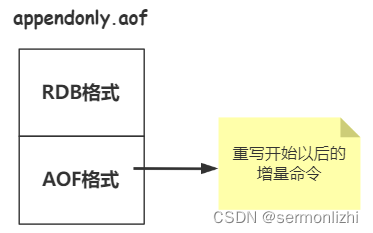

# 第02节 Redis持久化策略

Redis作为一款内存数据库，因为是内存读写，所以性能很强，但内存存储是易失性的，断电或系统奔溃都会导致数据丢失，
因此Redis也需要将其数据持久化到磁盘上面，当Redis服务重启时，会把磁盘上的数据再加载进内存。

Redis提供了两种持久化机制：RDB快照(snapshot)和AOF(append-only file)日志。

## 一、RDB快照

### 1.1 RDB原理
Redis是单线程操作的，这个线程需要同时负责多个客户端套接字的并发读写操作和内存数据的读写操作。

而在RDB的持久化方式下，Redis还需要进行保存内存快照，即某一时间内存数据的副本，而保存内存快照需要进行文件IO操作，
但文件IO又不能使用多路复用API。

如果Redis依然采用单线程既负责客户端的请求，又负责文件IO操作，就会导致文件IO严重影响Redis服务的性能。

还有一个重要的问题就是，在保存数据快照的时候，不能阻塞客户端的请求，也会导致内存中的数据结构一直处于一种变动的状态，
比如一个大KEY正在进行持久化，而此时有一个客户端请求把KEY删除，这种情况就不好处理了。

所以，Redis通过操作系统的多进程COW(Copy on Write)机制来实现持久化，
也就是Redis在进行持久化时会调用操作系统的fork函数产生一个子进程。

而子进程在刚创建的时候，它和父进程(处理客户端请求的进程)共享内存里面的代码和数据段。

然后子进程负责去做持久化，子进程不会修改内存的数据，它只负责对内存数据进行遍历读取，然后序列化写到磁盘。

而父进程继续为客户端请求提供服务，当需要修改数据时，就会使用到操作系统的COW机制，内存中的数据是由操作系统的很多页面组成，每个页只有4KB，
父进程修改数据时会把需要修改的数据页从父子进程共享的内存中复制一份分离出来，然后对这个复制的页面进行修改。

在整个过程中，子进程所使用的内存数据是不会发生变化的，相当在子进程产生的一瞬间就固定了，所以这种持久化的方式称为快照。

在持久化的过程中，并不是所有数据都会发生修改，一般都是热点数据发生修改，所以父进程复制出去的内存页也不会超过原来数据内存。

### 1.2 RDB配置
在默认情况下，这种快照的持久化方式会将内存数据快照保存到名字为dump.rdb的二进制文件中，
可以在redis.conf文件中通过dbfilename参数进行配置：
```text
# The filename where to dump the DB
dbfilename dump.rdb
```
除了配置持久化文件，还需要配置【触发RDB持久化的时机】，默认配置如下(三个策略)：
```text
// 格式:save m n
save 900 1     // 900秒内至少有一个key发生改动就保存一次数据
save 300 10    // 300秒内至少有10个key发生改动就保存一次数据
save 60 10000  // 60秒内只有有10000个key发生改动就保存一次数据
```
每个策略表示m秒内数据集至少有n个改动时，就会触发一次持久化。

可以配置多个策略，只要有一个策略满足就会进行一次持久化，而关闭RDB持久化方式时，就是把所有的save策略都注释掉即可。

还可以通过手动执行命令生成RDB快照，进入Redis的客户端，执行save或bgsave命令就可以生成xxx.rdb文件，
每次命令都会将Redis中数据快照进行一次持久化，会覆盖掉原来的rdb文件。

save与bgsave命令的主要区别在于是否会fork一个子进程来进行持久化，通过配置文件进行持久化使用的是bgsave的方式。

save与bgsave的区别：

| 命令	             | save	     | bgsave            |
|-----------------|-----------|-------------------|
| IO类型	           | 同步	       | 异步，子进程进行IO操作      |
| 是否阻塞redis客户端命令	 | 是	        | 否(fork子进程时会有短暂阻塞) |
| 优点	             | 没有额外内存消耗	 | 不阻塞客户端命令          |
| 缺点	             | 阻塞客户端命令	  | 需要fork子进程，消耗内存    |
rdb是二进制文件，所以当Redis服务重启时，解析rdb文件的速度会非常快。

## 二、AOF日志
### 2.1 AOF介绍
RDB这种持久化方式当Redis因为某些原因造成系统宕机后，服务器将会丢失最近写入内存但未保存到快照中的一部分数据，
为了尽量少了丢失，可以将持久化的频率增加，但RDB是一种全量持久化的方式，如果数据量比较大时，频繁进行持久化也是不可取的。

于是从Redis1.1版本开始，增加了一种完全耐久的持久化方式，也就是AOF持久化(append-only file)，
将修改的每一条指令增量记录到appendonly.aof文件中，先写入操作系统的缓存(os cache)，每隔一段时间fsync到磁盘。

比如执行下面两条命令：
```text
127.0.0.1:6379> set name lizhi
OK
127.0.0.1:6379> set age 25
OK
```
AOF文件记录数据如下：
```text
[root@lizhi bin]# more appendonly.aof
*2
$6
SELECT
$1
0
*3
$3
set
$4
name
$5
lizhi
*3
$3
set
$3
age
$2
25
```
这是一种【resp协议】的格式数据，
星号后面的数字代表命令有多少个参数，
$号后面的数字代表这个参数有几个字符，
但是如果执行带有过期时间的set命令，aof文件里面记录的并不是原始指令，而是记录key过期的时间戳，比如执行下面的命令：
```text
127.0.0.1:6379> set user:1 lizhi ex 10
OK
```
AOP文件的内容如下：
```text
*3
$3
set
$6
user:1
$5
lizhi
*3
$9
PEXPIREAT
$6
user:1
$13
1653653786127
*2
$3
DEL
$6
user:1
```

### 2.2 AOF配置
Redis的配置默认使用的是RDB持久化方式，可以通过修改配置文件的参数开启AOF功能
```text
appendonly yes   // 默认是no
```

修改完配置之后，重启Redis服务，然后Redis每执行一次改变数据集的命令时(比如set、del)，该命令就会追加在AOF文件的末尾。

当Redis再次重启时，程序就可以通过重新执行AOF文件中的命令来重建内存数据。

还可以通过下面的参数配置fsync刷盘的频率：
```text
appendfsync always    // 每次有新命令追加到AOF文件时就执行一次fsync,效率最低,但最安全
appendfsync everysec  // 每秒fsync一次,足够快,并且系统故障时只会丢失1s的数据,默认这种方式
appendfsync no        // 从不sync,将数据交给操作系统来处理,效率最高,但也是最不安全
```

一般都推荐使用appendfsync everysec ，这种策略可以兼顾速度和安全性。

### 2.3 AOF重写
因为AOF记录的是原生命令，就会导致整个文件容易变得非常大，而这些指令有些可能已经是无用的指令，
比如前面执行了set name，后面又执行了一次del name，这一组命令就没有再记录的必要了，所以AOF会定期根据内存数据重写aof文件，也称为瘦身。

比如下面的命令：
```text
127.0.0.1:6379> incr num
(integer) 1
127.0.0.1:6379> incr num
(integer) 2
```

在瘦身之前，aof文件内容如下：
```text
*2
$4
incr
$3
num
*2
$4
incr
$3
num
```

瘦身之后，aof文件内容如下：
```text
*3
$3
SET
$3
num
$1
2
```

会将原来的两条命令合并成一条命令。

还可以通过下面两个参数配置重写的频率：
```text
auto-aof-rewrite-min-size 64mb   // aof文件至少要达到64M才会自动重写，文件太小恢复速度本来就很快，重写的意义不大
auto-aof-rewrite-percentage 100  // aof文件自上一次重写后文件大小增长了100%则再次触发重写
```

第二个参数的意义是这样，比如参数配置的是50，即50%，当第一次重写后aof文件大小为60mb，随着操作进行aof文件继续追击，
当aof的文件大于60 + 60*50% = 90mb时，就会触发第二次重写，
第二次重写的前提也是要文件大小大于auto-aof-rewrite-min-size配置的大小。

AOF还可以手动重写，进入redis客户端执行命令bgrewriteaof重写AOF，AOF重写redis会fork出一个子进程去做(与bgsave命令类似)，
不会对redis正常命令处理有太多影响。

注意：redis自动进行的aof持久化或aof重写都是主进程完成的，并不会fork子进程来完成

RDB和AOF的区别：

| 命令	    | RDB	   | AOF    |
|--------|--------|--------|
| 启动优先级	 | 低	     | 高      |
| 体积	    | 小	     | 大      |
| 恢复速度	  | 快	慢    |
| 数据安全性	 | 容易丢数据	 | 根据决策决定 |

生产环境可以都启用，redis启动时如果既有rdb文件又有aof文件则优先选择aof文件恢复数据，因为aof一般来说数据更全一点。

## 三、混合持久化
RDB和AOF两种方式各有各自的优缺点，最好能将它们各自的优点整合到一起。
RDB的问题是可能会丢是数据，但Redis重启时，RDB因为是二进制文件，所以重建数据的速度会快很多。
AOF虽然数据安全性比较高，但重新构建数据时需要一条条去执行命令，当数据量比较大时，这个效率就显得非常慢了。

Redis4.0就将两者进行了结合，形成了新的持久化方式——混合持久化。

可以通过如下配置开启：
```text
aof-use-rdb-preamble yes  // 默认开启
```
注意：开始混合持久化的前提是要开启AOF持久化，因为混合持久化用的aof文件。

开启了混合持久化之后，AOF在重写时，不再是单纯将内存数据转换为RESP命令写入AOF文件，而是将重写这一刻之前的内存做RDB快照处理，
并且将RDB快照内容和增量的AOF修改内存数据的命令存在一起，都写入新的AOF文件，新的文件一开始不叫appendonly.aof，
等到重写完新的AOF文件才会进行改名，覆盖原有的AOF文件，完成新旧两个AOF文件的替换。

于是在 Redis 重启的时候，可以先加载RDB的内容，然后再重放增量AOF日志完成数据重建，因此重启效率大幅得到提升。

混合持久化策略下，AOF文件结果如下：


## 四、RDB 和 AOF 修复工具

根据上面的内容，我们知道 AOF 和 RDB 文件都是可以直接拷贝、删除、修改的，那么这两个文件就很容易就会不小心被修改或者篡改。
于是，Redis 顺道便提供了两个修复工具。我们先拿 AOF 文件试试，直接乱写一些内容。
```text
$3^M
setdfdfsdf^M
$3^M
ddd^M
$3^M
123^M
```
把 set 命令给随便加了些字符，这样的话如果重启服务，直接就会报出错误信息。
```text
39166:M 15 Jun 2022 09:53:51.755 * Reading the remaining AOF tail...
39166:M 15 Jun 2022 09:53:51.755 # Bad file format reading the append only file: make a backup of your AOF file, then use ./redis-check-aof --fix <filename>
```
从提示中就可以看出，它让我们尝试用修复工具去修复 AOF 文件。那么我们就来试试。
执行如下命令：
```text
./redis-check-aof --fix appendonly.aof
```
修复日志：
```text
The AOF appears to start with an RDB preamble.
Checking the RDB preamble to start:
[offset 0] Checking RDB file --fix
[offset 26] AUX FIELD redis-ver = '6.2.6'
[offset 40] AUX FIELD redis-bits = '64'
[offset 52] AUX FIELD ctime = '1655177336'
[offset 67] AUX FIELD used-mem = '1128240'
[offset 83] AUX FIELD aof-preamble = '1'
[offset 85] Selecting DB ID 0
[offset 103] Checksum OK
[offset 103] \o/ RDB looks OK! \o/
[info] 1 keys read
[info] 0 expires
[info] 0 already expired
RDB preamble is OK, proceeding with AOF tail...
0x              86: Expected \r\n, got: 6466
AOF analyzed: size=164, ok_up_to=126, ok_up_to_line=8, diff=38
This will shrink the AOF from 164 bytes, with 38 bytes, to 126 bytes
Continue? [y/N]: y
Successfully truncated AOF
```
修复成功之后再看看，它会直接把我们刚刚乱改的命令给删掉，也就是无效的内容会被清理掉，保证其它数据的正常加载。
（重启之后的实例中 ddd 这条数据也就没有了）

同样的，对于 RDB 文件来说，也有一个 redis-check-rdb 命令用于修复 RDB 文件，这个命令不需要使用参数，
直接就可以对指定的文件进行修复。