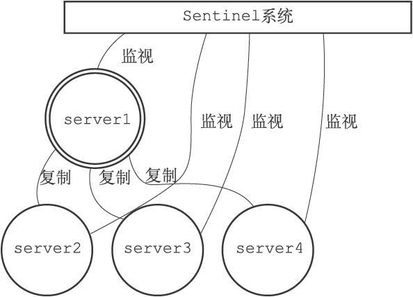
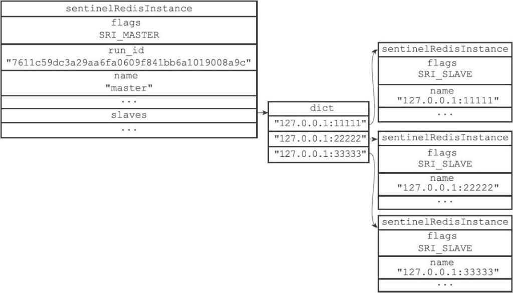
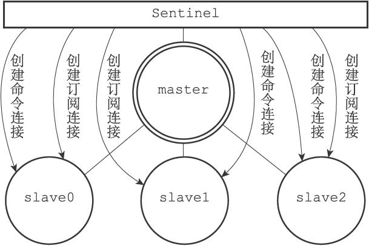
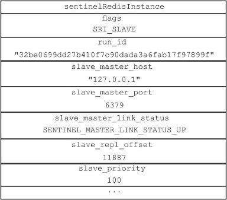
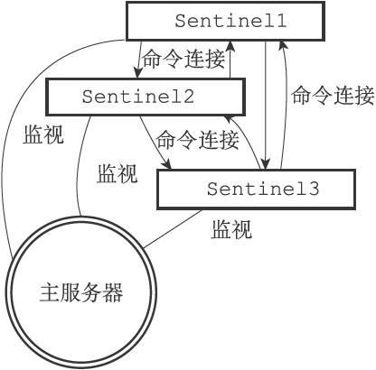
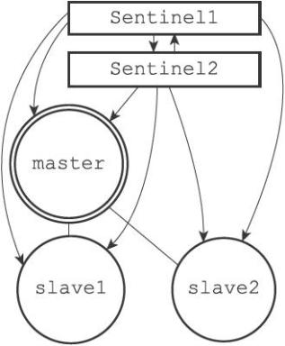
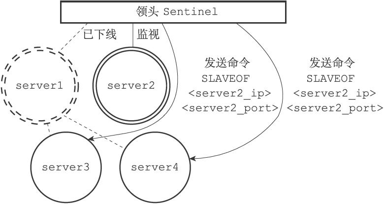
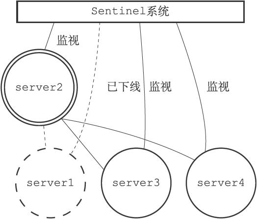
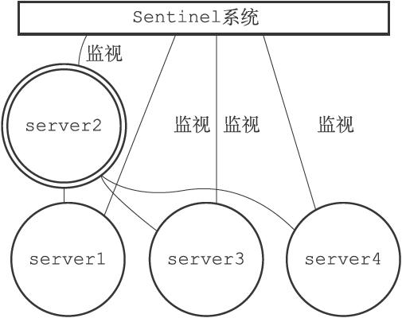

Sentinel（哨岗、哨兵）是Redis的高可用性（high avail-ability）解决方案：
由一个或多个Sentinel实例（instance）组成的Sentinel系统（system）对【主从服务器】进行监视。<!--more-->

所谓Sentinel['sentɪnl]的高可用性指**系统无中断地执行其功能的能力**。Sentinel的主要功能是：

1. 监控Redis整体是否正常运行。
2. 某个节点出问题时，**通知给其他进程**（比如他的客户端）。
3. 主服务器下线时，在从服务器中**选举**出一个新的主服务器。



# 1. 启动与初始化
启动命令：
```
$ redis-sentinel /path/to/your/sentinel.conf
$ redis-server /path/to/your/sentinel.conf --sentinel
```

一个Sentinel启动时，需要执行以下步骤：

1. 初始化服务器
2. 将普通Redis服务器使用的代码替换成Sentinel专用代码。
3. 初始化Sentinel状态
4. 根据给定的配置文件，初始化Sentinel的监视主服务器列表
5. 创建连向主服务器的网络连接

## （1）初始化服务器
Sentinel**本质上只是一个运行【在特殊模式下】的【Redis服务器】**，所以启动Sentinel的第一步，就是初始化一个普通的Redis服务器。

由于Sentinel执行的工作和普通的Redis服务器执行的工作不同，所以初始化也不相同。
首先先来回忆一下普通服务器的初始化过程：

1. 初始化服务器状态结构
2. 载入配置选项
3. 初始化服务器数据结构
4. 还原数据库状态
5. 执行事件循环

而Sentinel初始化时，并不会使用AOF和RDB来还原数据库，此外很多命令比如WATCH,EVAL等都不会使用。

## （2）使用Sentinel专用代码
主要分两部分：**端口**和**命令集**

普通Redis服务器使用`redis.h/REDIS_SERVERPORT`常量的值作为服务器端口：
```C
#define REDIS_SERVERPORT 6379
```

而Sentinel则使用`sentinel.c/REDIS_SENTINEL_PORT`常量的值作为服务器端口：
```C
#define REDIS_SENTINEL_PORT 26379
```

---

普通Redis服务器使用`redis.c/redisCom-mandTable`作为服务器的命令表。
而Sentinel则使用`sentinel.c/sentinelcmds`作为服务器的命令表。

`sentinelcmds`命令表也解释了为什么在Sentinel模式下，Redis服务器不能执行诸如SET、DBSIZE、EVAL等等这些命令，
因为服务器**根本没有在命令表中载入这些命令**。
PING、SEN-TINEL、INFO、SUBSCRIBE、UNSUBSCRIBE、PSUBSCRIBE和PUNSUBSCRIBE这七个命令就是客户端可以对Sentinel执行的全部命令了。

## （3）初始化Sentinel状态
在应用了Sentinel的专用代码之后，接下来，服务器会初始化一个`sentinel.c/sentinelState`结构，也就是Sentinel状态。
服务器的一般状态仍然由`redis.h/redisServer`结构保存。

## （4）初始化Sentinel状态的masters属性
Sentinel状态中的【masters字典】记录了所有被Sentinel监视的主服务器的相关信息，其中：
- 字典的**键**是**被监视主服务器**的名字。
- 而字典的**值**则是**被监视主服务器**对应的`sentinel.c/sentinelRedisInstance`结构。

每个`sentinelRedisInstance`结构（后面简称“实例结构”）**代表一个被Sentinel监视的Redis服务器实例（instance）**，
这个实例可以是主服务器、从服务器，或者另外一个Sentinel。

对Sentinel状态的初始化将引发对masters字典的初始化，而masters字典的初始化是根据被载入的Sentinel配置文件来进行的。

### （5）创建连向主服务器的网络连接
Sentinel会创建两个连向主服务器的异步网络连接：
- 一个是【命令连接】，这个连接专门用于向主服务器发送命令，并接收命令回复。
- 另一个是【订阅连接】，这个连接专门用于订阅主服务器的`__sentinel__:hello`频道。

Redis目前的发布与订阅功能中，被发送的信息都不会保存在Redis服务器里面，如果在信息发送时，想要接收信息的客户端不在线或者断线，
那么这个客户端就会丢失这条信息。因此，为了不丢失`__sentinel__:hello`频道的任何信息，
Sentinel必须专门用一个订阅连接来接收该频道的信息。

因为Sentinel需要与多个实例创建多个网络连接，所以Sentinel使用的是异步连接。

# 2. 获取服务器信息

## 2.1 获取主服务器信息
Sentinel默认会以每十秒一次的频率，通过命令连接向被监视的**主服务器发送INFO命令**，
并通过分析INFO命令的回复来获取主服务器的当前信息。


会收到类似以下内容的回复：
```C
#Server
...
run_id:7611c59dc3a29aa6fa0609f841bb6a1019008a9c
...
# Replication
role:master...
slave0:ip=127.0.0.1,port=11111,state=online,offset=43,lag=0
slave1:ip=127.0.0.1,port=22222,state=online,offset=43,lag=0
slave2:ip=127.0.0.1,port=33333,state=online,offset=43,lag=0
...
# Other sections
```

通过分析主服务器返回的INFO命令回复，Sentinel可以明确：主服务器本身的信息，从服务器的信息。之后进行更新：
- 根据run_id域和role域记录的信息，**更新Sentinel主服务器的实例结构**。
- 返回的从服务器信息，则会被用于**更新主服务器实例结构的slaves字典**，这个字典记录了主服务器属下从服务器的名单。



## 2.2 获取从服务器信息
当Sentinel发现主服务器有新的从服务器出现时，Sentinel除了会为这个新的从服务器创建相应的实例结构之外，
Sentinel还会创建连接到从服务器的命令连接和订阅连接。



在创建命令连接之后，Sentinel在默认情况下，会以每十秒一次的频率通过命令连接向**从服务器发送INFO命令**，
并获得类似于以下内容的回复：
```C
# Server
...
run_id:32be0699dd27b410f7c90dada3a6fab17f97899f
...
# Replication
role:slave
master_host:127.0.0.1
master_port:6379
master_link_status:up
slave_repl_offset:11887
slave_priority:100
# 
Other sections
...
```

利用这些信息更新从服务器的实例结构：



## 2.3 接收主从服务器的频道
当Sentinel与一个主服务器或者从服务器建立起订阅连接之后，Sentinel就会通过订阅连接，向服务器发送以下命令：
```C
SUBSCRIBE __sentinel__:hello
```
Sentinel对`__sentinel__:hello`频道的订阅会一直持续到Sentinel与服务器的连接断开为止。

对于每个与Sentinel连接的服务器，Sentinel既通过命令连接向服务器的`__sentinel__:hello`频道发送信息，
又通过订阅连接从服务器的`__sentinel__:hello`频道接收信息。


假设现在有sentinel1、sentinel2、sentinel3三个Sentinel在监视同一个服务器，
那么当sentinel1向服务器的`__sentinel__:hello`频道发送一条信息时，
所有订阅了`__sen-tinel__:hello`频道的Sentinel都会收到这条信息。


# 3. Sentinel互相监督

## 3.1 Sentinel字典
Sentinel为主服务器创建的实例结构中的**sentinels字典**保存了除Sentinel本身之外，
所有同样**监视这个主服务器的其他Sentinel的资料。**

当一个Sentinel接收到其他Sentinel发来的信息时，会提取出两方面信息：
- **与Sentinel有关的参数**：源Sentinel的IP，port，ID和配置参数
- **与主服务器有关的参数**：源Sentinel正在监视的主服务器的名字，IP，端口号和配置参数。

提取以后，Sentinel会在自己的Sentinel状态的masters字典中查找相应的主服务器实例结构，**检查源Sentinel的实例结构是否存在**：
- 存在，则更新
- 不存在，则创建

Sentinel可以通过分析接收到的频道信息来获知其他Sentinel的存在，并通过发送频道信息来让其他Sentinel知道自己的存在，
**监视同一个主服务器的多个Sentinel可以自动发现对方**。

## 3.2 连接其他Sentinel
当Sentinel通过频道信息发现一个新的Sentinel时，它不仅会为新Sentinel在【sentinels字典】中创建相应的实例结构，
**还会创建一个连向新Sentinel的命令连接**，而**新Sentinel也同样会创建连向这个Sentinel的命令连接**，
最终监视同一主服务器的多个Sentinel将形成相互连接的**环形网络**。



注意：Sentinel之间**只会创建命令连接，但不会创建订阅**。
Sentinel需要通过接收主服务器或者从服务器发来的频道信息来发现未知的新Sentinel，所以才需要建立订阅连接。
相互已知的Sentinel只要使用命令连接来进行通信就足够了。

# 4. 检测下线状态

## 4.1 检测主观下线状态
Sentinel会以每秒一次的频率向所有与它创建了【命令连接】的实例（包括**主服务器、从服务器、其他Sentinel在内**）发送PING命令，
并通过实例返回的PING命令回复来**判断对方是否在线。**



当对方超过一段时间不向Sentinel回复时（比如超时5000毫秒）则Sentinel1就会**将对方标记为主观下线**。

## 4.2 检查客观下线状态
当Sentinel将一个主服务器判断为主观下线之后，为了确认这个主服务器是否真的下线了，
它会**向同样监视这一主服务器的其他Sentinel进行询问，看它们是否也认为主服务器已经进入了下线状态**。
当Sentinel从其他Sentinel那里接收到【足够数量】的已下线判断之后，Sentinel就会将从服务器**判定为客观下线**，
并对主服务器执行【故障转移】操作。

# 5. 下线后的补救

## 5.1 选举Sentinel领袖
一个主服务器被判断为客观下线时，监视这个下线主服务器的各个Sentinel会进行协商，
**选举出一个【领头Sentinel】，并由领头Sentinel对下线主服务器执行故障转移操作。**

选举策略：
- **候选人**：所有在线的Sentinel
- **选举过程**：一个Sentinel向另一个Sentinel发送设置请求`SENTINEL is-master-down-by-addr`命令
- **胜选条件**：
    - **局部领头Sentinel**：**先到先得**，最先向目标Sentinel发送设置要求的源Sentinel将成为目标Sentinel的局部领头Sentinel，
      而之后接收到的所有设置要求都会被目标Sentinel拒绝。
    - **领头Sentinel**：如果有某个Sentinel**被半数**以上的Sentinel设置成了局部领头Sentinel，
      那么这个Sentinel成为领头Sentinel。
- **重选条件**：如果没有过半，则再次投票，知道选出过半的为止。


## 5.1 故障转移
在选举产生出领头Sentinel之后，领头Sentinel将对已下线的主服务器执行故障转移操作，该操作包含以下三个步骤：
1. 从已下线的主服务器的从服务器中**拔举**一个作为主服务器。
2. 让已下线主服务器属下的所有从服务器改为复制新的主服务器
3. 将已下线主服务器设置为新的主服务器的从服务器，当这个旧的主服务器重新上线时，它就会成为新的主服务器的从服务器。

### （1）选出新的主服务器
选择的标准是：状态良好、数据完整的从服务器。
在满足基本连接需求后，判断偏移量，**选出【偏移量最大（保存最新数据）】的从服务器作为新的主服务器**。
然后向这个从服务器发送**SLAVEOF no one**命令，将这个从服务器转换为主服务器。

在发送**SLAVEOF no one**命令之后，领头Sentinel会以每秒一次的频率（平时是每十秒一次），**向被升级的从服务器发送INFO命令**，
并观察命令回复中的角色（role）信息，当被升级服务器的role从原来的slave变为master时，
领头Sentinel就知道被选中的从服务器已经顺利升级为主服务器了。

### （2）修改复制目标
之后需要让已下线主服务器属下的所有从服务器去【复制】新的主服务器，这一动作可以通过客户端向从服务器发送SLAVEOF命令来实现。



### （3）将旧的主服务器变为从服务器
当原来的主服务器重新上线时，Sentinel就会向它发送SLAVEOF命令，让它成为新主服务器的从服务器。



