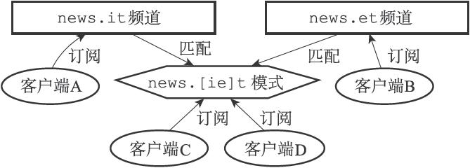
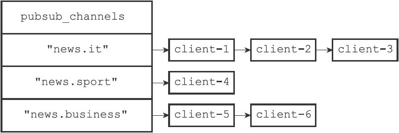

Redis的发布与订阅功能由PUBLISH、SUBSCRIBE、PSUBSCRIBE等命令组成。本章主要介绍这些命令的实现原理。<!--more-->

通过执行SUBSCRIBE命令，客户端可以订阅一个或多个频道，从而成为这些频道的**订阅者**（subscriber）：
**每当有其他客户端向被订阅的【频道】发送消息（message）时，频道的所有订阅者都会收到这条消息**。

假如ABC三个客户端都执行了：
```C
SUBSCRIBE "news.it"
```
那么这三个客户端都成了"news.it"频道的订阅者，


向"news.it"频道发送消息"hello"，那么"news.it"的三个订阅者都将收到这条消息。


除了订阅频道之外，客户端还可以通过执行**PSUBSCRIBE**命令订阅一个或多个**模式**，从而成为这些模式的订阅者：
每当有其他客户端向某个频道发送消息时，消息不仅会被发送给这个频道的所有订阅者，**它还会被发送给所有与这个频道相匹配的模式的订阅者。**



# 1. 订阅与退订

## 1.1 频道的订阅与退订
Redis将所有频道的订阅关系都保存在服务器状态的【`pubsub_channels`字典】里面，
这个字典的**键是某个被订阅的频道**，而键的**值则是一个链表**，链表里面记录了所有订阅这个频道的客户端。

看下图，不同客户端订阅了不同频道：



---

【订阅】的原理是：**服务器将客户端与被订阅频道在`pubsub_channels`字典中进行关联。**

假如客户端10086执行命令：
```C
SUBSCRIBE "news.sport" "news.movie"
```

服务器完成两件事：
- 将10086添加到sport链表后面。
- 新增一个键"news.movie"。


---

【退订】就是在链表中删除客户端信息，如果退订后某个键没有任何客户端，则**程序将从pubsub_channels字典中删除频道对应的键。**

## 1.2 模式的订阅与退订
类似地，服务器也将所有模式的订阅关系都保存在服务器状态的`pubsub_patterns`属性。

与频道不同的是，这是一个**链表**，链表中的每个节点都包含着一个`pubsubPattern`结构，
这个结构的`pattern`属性记录了被订阅的模式，而`client`属性则记录了订阅模式的客户端：
```C
typedef struct pubsub_Pattern 
{ 
    // 订阅模式的客户端 
    redisClient *client;
    // 被订阅的模式 
    robj *pattern;
} pubsubPattern;
```
下面举一个例子：
- 客户端7正在订阅模式"music.*"
- 客户端8正在订阅模式"book.*"
- 客户端9正在订阅模式"news.*"


---

订阅模式时，服务器会对每个被订阅的模式执行以下两个操作：
1. 新建一个`pubsubPattern`结构，将结构的`pattern`属性设置为被订阅的模式，`client`属性设置为订阅模式的客户端。
2. 将`pubsubPattern`结构添加到`pubsub_patterns`链表的表尾。


退订时，在`pubsub_patterns`链表中查找并删除。

# 2. 发布消息
发布消息有两个动作：
1. 将消息发送给所有channel的订阅者。
2. 如果有一个或多个模式与频道channel匹配，则同时将消息发送给模式的订阅者。

**对于频道订阅者**，首先服务器要在`pubsub_channels`中找到相对应的channel(一个链表)，
然后顺着这个链表，将消息发送给所有客户端。

**对于模式订阅者**，服务器会在`pubsub_patterns`链表中找到**与channel频道相匹配的模式**，
然后将消息发送给订阅了这些模式的所有客户端。

# 3. 查看订阅消息
**PUBSUB**命令是Redis 2.8新增加的命令之一，**客户端可以通过这个命令来查看【频道】或者【模式】的相关信息**，
比如某个频道目前有多少订阅者，又或者某个模式目前有多少订阅者。本节介绍这个命令的实现方法。

## 3.1 PUBSUB CHANNELS
`PUBSUB CHANNELS[pattern]`子命令用于返回服务器**当前被订阅的频道**，其中`pattern`参数是可选的：
- 不给定，则返回所有被订阅的所有频道。
- 给定，与pattern模式相匹配的频道。

比如：
```C
redis> PUBSUB CHANNELS
1) "news.it"
2) "news.sport"
3) "news.business"
4) "news.movie"
    
redis> PUBSUB CHANNELS "news.[is]*"
1) "news.it"
2) "news.sport"
```

## 3.2 PUBSUB NUMSUB
`PUBSUB NUMSUB[channel-1 channel-2...channel-n]`子命令接受任意多个频道作为输入参数，并返回这些**频道的订阅者数量**。

这个子命令是通过在`pubsub_channels`字典中找到频道对应的订阅者链表，然后**返回订阅者链表的长度**。

## 3.3 PUBSUB NUMPAT

`PUBSUB NUMPAT`子命令用于返回服务器当前被**订阅模式的数量**。

通过返回`pubsub_patterns`链表的长度来实现的。
注意一下频道数量的查找逻辑是：**频道字典->频道订阅者链表->数量**；而模式数量的查找逻辑是：**模式链表->数量**。
