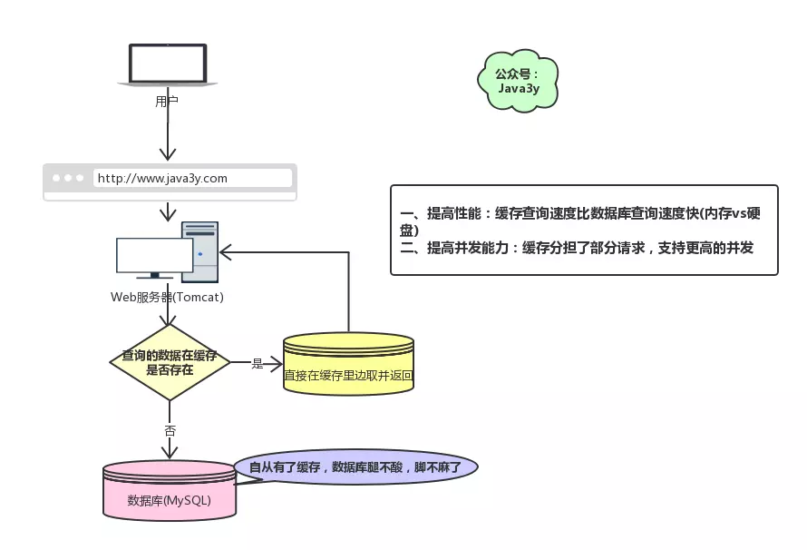
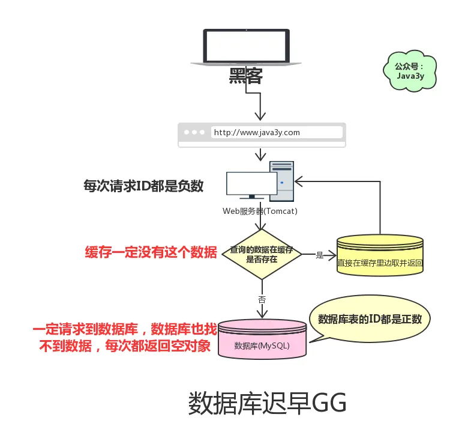
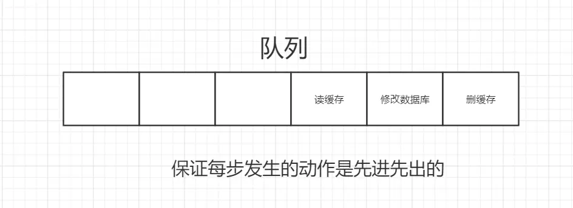
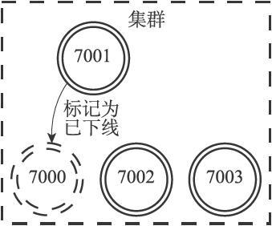
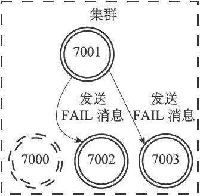

# 1.基础

## 1.1 什么是Redis？

Redis的全称是：Remote Dictionary Server，本质上是一个Key-Value类型的【内存数据库】。

整个数据库统**加载在内存**当中进行操作，定期通过异步操作把数据库数据保存在硬盘。因为是纯内存操作，Redis的性能非常出色。

## 1.2 Redis的优劣势？
优势：
- 纯内存读写操作，性能好。
- 支持多种数据结构。
- 单线程，不用担心竞争
- 特性丰富，支持发布订阅、过期、sentinel等功能。

劣势：
- 容量受物理内存限制，不能用作海量数据的高性能读写。

## 1.3 Redis和Memcached比较
Memcached早年被很多公司使用，现在内存越来越便宜，基本都是用Redis。
Redis被认为是Memcached的替代者，优势有：
- memcached值均为简单字符串，redis支持更丰富的类型
- redis性能更好（速度快，内存大）Memcached的key内存限制为1MB，而Redis的key可以达到1GB
- redis可以持久化
- Memcached集群功能不好，没有原生集群模式

劣势有：
- redis只是用一个核，而memcached使用多核，在大数据处理上，memecached效率要好一些。

## 1.4 Redis支持哪些数据类型

对象：
- 字符串对象，支持int、raw、embstr编码
- 列表对象，支持ziplist和linkedlist编码
- 哈希对象，支持ziplist和hashtable
- 集合对象，支持intset和hashtable
- 有序集合对象，支持ziplist和skiplist

# 2. 缓存相关

## 2.1 什么是缓存雪崩？

首先，为什么要使用缓存？

缓存区域的大小是有限的，为了避免数量膨胀，redis采取了过期删除策略。
但是如果缓存数据设置的【过期时间是相同的】，会导致这些缓存**同时失效**，所有请求全部跑向数据库，造成巨大冲击。这就是**缓存雪崩**。

发生的原因可能是：
- Redis挂掉。
- 由于过期键时间问题，导致同时失效。

## 2.2 如何解决缓存雪崩？

对于过期键失效问题：
- 在缓存的时候给过期时间加上一个**随机值**，这样就会大幅度的**减少缓存在同一时间过期**。

对于redis挂掉的问题：
- 主从服务器 + sentinel + 集群模式，保证有继承人存在，及时推举。
- 如果redis真的挂了，可以设置**本地缓存 + 限流**
- 事发后，利用持久化特性，尽快从磁盘上加载数据，恢复缓存。

## 2.3 什么是缓存穿透？

【缓存穿透】是指查询一个一定**不存在的数据**。

由于缓存不命中，并且出于容错考虑，如果从**数据库查不到数据则不写入缓存**，
这将导致这个不存在的数据**每次请求都要到数据库去查询**，失去了缓存的意义。

## 2.4 如何解决缓存穿透？

- 使用**布隆过滤器**
- 当我们从数据库找不到的时候，我们也将这个**空对象设置到缓存里边去**。下次再请求的时候，就可以从缓存里边获取了。
  这种情况我们一般会将空对象设置一个**较短的过期时间**。

布隆过滤器的原理解释https://zhuanlan.zhihu.com/p/43263751。

## 2.5 如何解决缓存与数据库双写不一致？
在写更新数据时，我们要进行两步操作：**删除缓存**和**更新数据库**（一般不使用更新缓存，都是直接删除），
现在的问题就是：这两步先做哪一个？

1. 先更新数据库，再删除缓存
2. 先删除缓存，再更新数据库

**如果是1**，则：
- 当原子性破坏时（更新了库，没删缓存），**导致数据不一致**
- 并发场景**出现问题的概率较低**，仅发生在**缓存失效时**
    1. 线程A查询数据库，得到旧值
    2. 线程B将新值写入数据库
    3. 线程B删除缓存
    4. 线程A将查到的旧值写入缓存

为什么说发生概率低呢？
- 仅发生在缓存失效时
- 写操作一般比较慢，很难出现【步骤3】在【步骤4】前面的情况。

**如果是2**，则：
- 原子性被破坏时，不影响一致性
- 并发时，问题很大
    1. 线程A删除缓存
    2. 线程B查询时缓存不存在，于是到数据库取了一个旧值
    3. 线程B将旧值写入缓存
    4. 线程A将新值写入数据库

### 如何保证并发下的一致呢？

将删除缓存、修改数据库、读取缓存等的操作积压到**队列**里边，实现**串行化**。

# 3. 线程模型

## 3.1 为什么Redis是单线程？
首先，CPU的性能并不是瓶颈，主要考虑【本地内存】和【网络带宽】。
其次，单线程可以避免【线程切换】的资源消耗和竞争问题，有利于性能提升。

## 3.2 介绍一下IO多路复用
IO多路复用的原理是：
存在一个接线员，当有客户连接时，接线员接收连接，分派到制定执行函数，然后接着监听。
这样就可以避免处理某一个连接而阻塞其他用户的情况。

---

Redis的【I/O多路复用程序】的所有功能都是**通过包装常见的select、epoll这些I/O多路复用函数库来实现的**。
由于IO复用程序提供了统一的接口，所以**底层实现方法可以互换。**

## 3.3 介绍一下redis线程模型的处理流程
Redis基于【Reactor模式】开发了自己的【网络事件处理器】：这个处理器被称为**文件事件处理器（file event handler）**。

文件事件处理器包括：
- 套接字
- IO复用程序
- 文件事件分派器
- 事件处理器

事件处理器包括：
- 连接应答处理器
- 命令请求处理器
- 命令回复处理器

# 4. 数据删除与淘汰机制

## 4.1 介绍一下redis的过期删除策略

**（1）惰性删除**

放着不管，每次从键空间获取时检查是否过期，过期就删除。

**对CPU最友好**，**但浪费内存**。
如果数据库中有很多过期键，而这些过期键永远也不会被访问的话，他们就会永远占据空间，可视为**内存泄漏**。
比如一些和时间有关的数据（日志）。

**（2）定期删除**

每隔一段时间，程序检查一次数据库，删除过期键。

**对CPU和内存是一种折中**。通过选择较为空闲的时间点来处理过期键，减少CPU压力。同时也能及时释放内存，避免内存泄漏。

在redis中由【周期函数severCron负责】，
它在规定的时间内，**分多次遍历服务器中的各个数据库**，从数据库的expires字典中**随机检查一部分键的过期时间**，并删除其中的过期键。
他会记录检查进度，在**下一次检查时接着上一次的进度进行处理**。
比如说，如果当前函数在遍历10号数据库时返回了，那么下次就会从11号数据库开始工作。

## 4.2 介绍一下Redis的内存淘汰机制
惰性删除和定期删除依然可能保留大量过期键，这时候需要用到内存淘汰机制。
内存淘汰机制有6个：
- **noeviction**：eviction是驱逐的意思，当内存不足以容纳新写入数据时，新写入操作会报错。
- **allkeys-lru**：当内存不足以容纳新写入数据时，在**键空间**中，移除最近最少使用的 key :ok_hand::ok_hand:
- **allkeys-random**：当内存不足以容纳新写入数据时，在**键空间**中，随机移除某个 key。
- **volatile-lru**：当内存不足以容纳新写入数据时，在**设置了过期时间的键空间**中，移除最近最少使用的 key。
- **volatile-random**：当内存不足以容纳新写入数据时，在**设置了过期时间的键空间**中，**随机移除**某个 key。:ok_hand:
- **volatile-ttl**：当内存不足以容纳新写入数据时，在**设置了过期时间的键空间**中，有**更早过期时间**的 key 优先移除。:ok_hand:

## 4.3 写一个LRU算法

我的博客有总结，是一道Leetcode题目，C++版本：

[Leetcode146-LRU缓存机制](https://jiangren.work/2019/09/05/Leetcode题目总结7-容器的应用/)

# 5. Redis高并发和高可用

## 5.1 Redis的高并发是如何实现的？
首先**从程序编写的角度上**来说，
- Redis是【纯内存数据库】，读写速度快，
- 采用了【非阻塞IO复用】，
- 采用了【单线程减少切换】，
- 采用了【优秀的数据结构设计】，
- 设计了分离的【文件事件处理器】和【文件事件分派器】。

然后，**从布局架构上**来说，实现**高并发**主要依靠**主从架构**（**单线程多进程**），
比如**单机写数据，多机查数据**。单机能达到几万QPS(queries per sec)，多个从实例能达到10W的QPS。

更进一步，可以采用集群，不仅能实现高并发，还能容纳大量数据。

## 5.2 Redis的高可用是如何实现的？
高可用性指**系统无中断地执行其功能的能力**。
Redis实现高可用依靠的是Sentinel哨兵机制。Sentinel**本质上只是一个运行在特殊模式下的Redis服务器**，是一个进程。

**Sentinel作用：**
- 监控Redis整体是否正常运行。
- 某个节点出问题时，**通知给其他进程**（比如他的客户端）。
- 主服务器下线时，在从服务器中**选举**出一个新的主服务器。

**Sentinel监督服务器：**
1. 与主服务器构建连接，每10秒向主服务器发送INFO命令，分析回复消息分析主服务器状态。
2. 从主服务器状态中获取从服务器信息，并与他们建立连接。达到全覆盖的目的。

**Sentinel互相监督：**
1. Sentinel和服务器之间建立hello频道连接
2. Sentinel在hello频道发送信息时会被其他Sentinel发现，达到握手的目的。
3. 发现后，Sentinel之间建立连接，形成环形网络。

**Sentinel监督下线：**
- 按频率向所有创建连接的实例发送PING，查看是否回复PONG来判断是否在线，不回复则**标记为主观下线状态**。
- 向其他Sentinel询问，如果足够数量的Sentinel也标记为下线状态，则改为**客观下线**。

**Sentinel下线补救措施：**

**（1）选举领头的Sentinel**
- 一个Sentinel向另一个Sentinel发送设置请求命令。
- **最先向目标Sentinel**发送设置要求的源Sentinel将成为目标Sentinel的局部领头Sentinel，
  而之后接收到的所有设置要求都会被目标Sentinel拒绝。
- 如果有某个Sentinel**被半数**以上的Sentinel设置成了局部领头Sentinel，那么这个Sentinel成为领头Sentinel。

**（2）故障转移**
1. 从已下线的主服务器的从服务器中**拔举**一个作为主服务器。标准：**偏移量最大**
2. 让已下线主服务器属下的所有从服务器改为复制新的主服务器
3. 将已下线主服务器设置为新的主服务器的从服务器，当这个旧的主服务器重新上线时，它就会成为新的主服务器的从服务器。

# 6. 多机架构

## 6.1 Redis有哪些多机架构？
不考虑中间件，原生的架构有**主从复制架构**和**集群架构**。

## 6.2 介绍一下复制过程

Redis中复制有新老两版。

老版：分为【同步】和【命令传播】两个阶段。

---

**老版：**

**在同步阶段：**
1. 从机向主机发送SYNC命令。
2. 主机收到后，执行BGSAVE生成RDB文件，并使用【复制缓冲区】记录现在开始执行的所有写操作。
3. 将RDB文件发给从服务器。
4. 将【缓冲区】内容发送给从服务器。

**在命令传播阶段：**
1. 主服务器将自己执行的写命令发送给从服务器，让他执行相同的命令。

**缺陷：**
1. 初次复制效果较好，但断线后重连复制效率很低，需要全部重录RDB文件。

---

**新版：**

分为【完整重同步】和【部分重同步】，前者和旧版一样。

【部分重同步】有三个部分：
- 主从服务器的【复制偏移量】
- 主服务器的【复制积压缓冲区】
- 服务器的【运行ID】

主服务器和从服务器会分别维护一个复制偏移量，通过对比偏移量来知道主从服务器是否处于一致状态：
- 主服务器每次向从服务器传播N个字节的数据时，就将自己的复制偏移量的值加上N。
- 从服务器每次收到主服务器传播来的N个字节的数据时，就将自己的复制偏移量的值加上N。

复制积压缓冲区是由【主服务器】维护的一个**固定长度**（fixed-size）先进先出（FIFO）队列。
当主服务器进行命令传播时，它不仅会将写命令发送给所有从服务器，还会**将写命令入队到复制积压缓冲区里面**。
同时，主服务器也会向积压缓冲区添加偏移量。重新上线时根据偏移量决定如何重同步：

- 下线后，数据长度超过了缓冲区，导致溢出，说明下线时间太长，执行完全重同步。
- 否则，部分重同步。

而主服务器ID则帮助重新上线的从服务器识别，

- 如果ID和从服务器记录的相同，则表示**之前同步的主服务器就是这个**，执行部分重同步。
- 如果ID不同，则表明从**服务器断线之前复制的主服务器并不是当前连接的这个主服务器**，执行完整重同步操作。

## 6.3 介绍一下集群
集群通过【分片】（sharding）来进行数据共享，并提供【复制】和【故障转移】功能，保证高可用性。

**集群的结构**是：多个节点（node）组成一个集群，节点是Redis中数据存储的单位，在刚开始的时候，每个节点都是相互独立的。
通过`CLUSTER MEET`命令相互握手，组成集群。

**集群数据的存储方式**是：集群的整个数据库被分为16384个槽（slot），数据库中的每个键都属于槽的其中一个。
当所有槽都有节点在处理时，集群处于上线状态。

## 6.4 集群的通信方式是怎样的？

集群依靠消息通信，消息有5种：MEET, PING, PONG, FAIL, PUBLISH。

Redis集群中的各个节点通过**Gossip协议**来交换各自关于不同节点的状态信息，其中Gossip协议由MEET、PING、PONG三种消息实现。

---

所谓Gossip是八卦消息的意思，在Redis中，发送每次发送MEET、PING、PONG消息时，
发送者都从自己的已知节点列表中**随机选出两个节点**（可以是主节点或者从节点），保存到一个特殊结构体中。

接受者接收到MEET、PING、PONG消息时，根据保存的两个节点是否认识来选择进行哪种操作：
- 不认识，说明接收者**第一次接触被选中节点**，则接收者与被选中节点握手
- 认识，根据结构信息进行更新。

比如A节点发送的PING给B，携带了CD两个节点，然后B回复PONG携带了EF两个节点，这样就完成了ABCDEF六个节点的信息交换。**每个节点按照周期向不同节点传播PING-PONG信息，就能完成整个集群的状态更新。**

---

如果节点很多，则Gossip消息比较慢，而主节点下线的消息需要立即通知给所有人。
FAIL消息的正文只包含已下线的节点名称，直接通知给所有已知节点。

---

接收到PUBLISH命令的节点**不仅会向channel频道发送消息message，它还会向集群广播一条PUBLISH消息，
所有接收到这条PUBLISH消息的节点都会向channel频道发送message消息**。

也就是说，向集群发送`PUBLISH`，会导致集群所有节点都向channel发送message消息。

## 6.5 【重要】集群分片的原理是什么?

Redis引入了【哈希槽】的概念，通过【槽】指派的方式【存储数据】。

Redis集群有$2^{14}=16384$个哈希槽，每个key通过CRC16（循环冗余校验码）校验后，
对16384取模来决定放置哪个槽`slot = CRC16(key) & 16383`，集群的每个节点负责一部分hash槽。

**使用哈希槽的好处就在于可以方便的添加或移除节点。**
1. 当需要增加节点时，只需要把其他节点的某些哈希槽挪到新节点就可以了；
2. 当需要移除节点时，只需要把移除节点上的哈希槽挪到其他节点就行了。

CRC16算法能分配65535个槽位，但作为包发送太臃肿，一般情况下一个redis集群不会有超过1000个master节点，所以采用$1/4$

## 6.6 【重要】集群扩容和收缩是怎么实现的？
集群的【伸缩】是通过【重新分片】的方式实现的，
【重新分片】操作可以将**任意数量已经指派给某个节点（源节点）的槽改为指派给另一个节点（目标节点）**，
并且相关槽所属的键值对也会从源节点被移动到目标节点。

【重新分片】操作可以**在线（online）进行**，在重新分片的过程中，集群不需要下线，并且**源节点和目标节点都可以继续处理命令请求**。

重新分片由【redis-trib】负责，步骤如下：
1. 【redis-trib】向【源节点】发送命令，包含了执行迁移的【槽slot】，要迁移【键的数量count】。
2. 【源节点】返回属于【槽slot的count个键】。
3. 对于【每个返回键】，redis-trib向源节点发送一个【MIGRATE命令】
4. 【源节点】根据【MIGRATE命令】将【键】迁移到【目标节点】，

【如果多个槽，则分别对不同槽执行多次】。

# 7. 持久化

## 7.1 为什么采用持久化？
持久化有两个作用：方便【主从复制】和【灾难恢复】。

由于Redis的数据全都放在内存而不是磁盘里面，如果Redis挂了，没有配置持久化的话，重启的时候数据会全部丢失。
所以需要将数据写入磁盘，本地化保存。

## 7.2 持久化的方式有哪些？
有RDB持久化和AOF持久化。

---

RDB持久化：

将数据库状态以RDB文件格式保存。可以采用【SAVE命令】阻塞服务器进程，也可以用【BGSAVE命令】fork一个子进程。

通过【周期性函数serverCron】不断的判断保存条件，如果条件满足就保存。

---

AOF持久化：

AOF(Append Only File)**记录Redis服务器所执行的写命令**。

AOF实现原理是**命令追加**和**文件写入同步**。
- 命令追加：
      服务器执行完一个命令后，会以协议格式将命令**追加到服务器状态【aof_buf缓冲区】的结尾**
- 文件写入同步：
      服务器每次结束一个【事件循环】之前都**考虑是否需要将【`aof_buf`缓冲区】中的内容写入和保存到【AOF文件】里面**。

AOF还原时需要建立一个不带网络连接的伪客户端，因为Redis的命令只能在客户端上下文中执行。

## 7.3 AOF的重写是什么意思？
【随着时间的增长，AOF文件的大小将会越来越大】。
通过【重写】，Redis服务器可以创建一个【新的AOF文件】来替代【现有的AOF文件】，
新旧两个**AOF文件保存的数据库状态完全相同**，但新的文件体积更小。

重写的策略是：
**从数据库中读取键现在的值，然后用一条命令去记录键值对**。相当于折叠命令，只求最终结果。

此外，子进程AOF重写时，主进程也在写命令，导致两者状态不一致。
因此，**Redis服务器设置了一个【AOF重写缓冲区】**，
当Redis服务器执行完一个写命令之后，它会**同时**将这个写命令发送给**AOF缓冲区**和**AOF重写缓冲区**。

## 7.4 AOF和RDB优劣势比较

RDB

优势：完整，恢复迅速

劣势：每次保存的间隔周期长，丢失数据多

---

AOF

优势：保存间隔短，丢失数据少，系统资源消耗少。保存格式清晰，适合误操作的恢复。

劣势：恢复速度较慢，需要建立伪客户端，如果发生崩溃的情况需要尽快恢复，最好采用RDB。重写后数据保存不一定完整，可能有BUG。

# 8. 事务

## 8.1 什么是事务？

Redis通过MULTI、EXEC、WATCH等命令来实现事务（transaction）功能。
事务将**一种将多个命令请求打包，然后一次性、按顺序地执行多个命令的机制**，并且在事务执行期间，**服务器不会中断事务**而改去执行其他客户端的命令请求。

##  8.2 Redis中事务是如何实现的？

事务从开始到结束经历三个阶段：
1. 事务开始
2. 事务入队
3. 事务执行

---

通过MULTI命令可以将执行该命令的客户端**从非事务状态切换至事务状态**，在是事务状态下，
- 如果客户端发送EXEC，DISCARD，WATCH，MULTI这四个命令，则立即执行。
- 如果发送的是其他命令，则放到事务队列里面，向客户端返回QUEUED回复。

---

每个【Redis客户端】都有自己的**事务状态结构体**，
每个结构体中又包含了一个**事务队列**和**已入队命令计数器。**在事务队列中包含了**具体的命令cmd**。

---

当一个处于事务状态的客户端向服务器发送EXEC命令时，这个EXEC命令将立即被服务器执行。
**服务器会遍历这个客户端的【事务队列】，执行队列中保存的所有命令，最后将执行命令所得的结果全部返回给客户端**。
过程是：
1. 创建空白【回复队列】
2. 抽取一条命令，读取参数、参数个数以及要执行的函数
3. 执行命令，取得返回值
4. 将返回值追加到1中的队列末尾，重复步骤2
5. 完成后，【清除事务标志】，回到非事务状态，同时【清空计数器】和【释放事务队列】。

## 8.3 事务中的乐观锁是什么？

乐观锁，也称CAS(check and set)，属于无罪推定原则，每次别人拿数据都假定他不修改，但是在更新的时候会判断一下在此期间别人有没有去更新这个数据。

Redis中通过WATCH来实现，它可以**在EXEC命令执行之前**，**监视任意数量的数据库键**，并在EXEC命令执行时，**检查被监视的键是否被其他客户修改过，**如果是的话，**服务器将拒绝执行事务**，并向客户端返回代表事务执行失败的空回复。

## 8.4 WATCH命令的原理是什么？

每个Redis数据库都保存着一个`watched_keys`字典，这个字典的**键是某个被WATCH命令监视的数据库键**，而**字典的值则是一个链表，链表中记录了所有监视相应数据库键的客户端**。

对数据库**执行修改命令**时，会对字典进行检查。**查看当前命令修改的键是否在`watched_keys`字典中**，如果有，且事务标志被打开**，表示该客户端的事务安全性已经被破坏**。将`REDIS_DIRTY_CAS`标识打开。

在EXEC命令执行时，检查`REDIS_DIRTY_CAS`标志是否打开判断是否应该执行。

## 8.5 解释一下事务的ACID性质

所谓ACID性质是指：**有原子性（Atomicity）、一致性（Consistency）、隔离性（Isolation）、耐久性（Durability）。**

**原子性**：事务在执行前用WATCH检查，命令有没有被插入执行过。

**一致性**：**入队错误**：事务入队时命令格式不正确，则Redis拒绝执行；**执行错误**：执行时操作不正确，会被服务器识别，并做错误处理，所以这些出错命令不会对数据库做任何修改；**停机后**根据持久化，也能还原为一致状态。

**隔离性**：单线程，且事务不会被打断，串行的方式保证不同事务的隔离性（不保证键不会冲突）

**耐久性**：不一定，得看哪种持久化，只有always模式下的AOF才有。（每次执行命令都会调用同步函数）