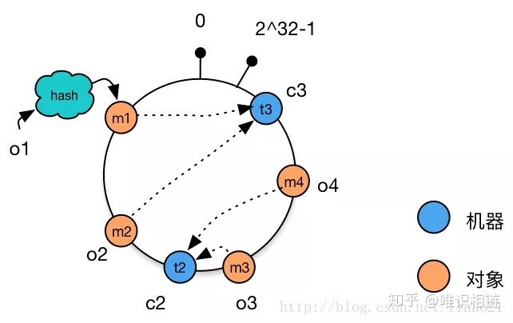

对于分布式存储，不同机器上存储不同对象的数据，我们使用哈希函数建立从数据到服务器之间的映射关系。

# 一、使用简单的哈希函数

```text
m = hash(o) mod n
```
其中，o为对象名称，n为机器的数量，m为机器编号。

考虑以下例子：
```text
3个机器节点，10个数据 的哈希值分别为1,2,3,4,…,10。使用的哈希函数为：(m=hash(o) mod 3)。
```
```text
机器0 上保存的数据有：3，6，9
机器1 上保存的数据有：1，4，7，10
机器2 上保存的数据有：2，5，8
```
当增加一台机器后，此时n = 4，各个机器上存储的数据分别为：
```text
机器0 上保存的数据有：4，8
机器1 上保存的数据有：1，5，9
机器2 上保存的数据有：2，6，10
机器3 上保存的数据有：3，7
```
只有数据1和数据2没有移动，所以当集群中数据量很大时，采用一般的哈希函数，在节点数量动态变化的情况下会造成大量的数据迁移，
导致网络通信压力的剧增，严重情况，还可能导致数据库宕机。

# 二、一致性哈希
一致性hash算法正是为了解决此类问题的方法，它可以保证当机器增加或者减少时，节点之间的数据迁移只限于两个节点之间，
不会造成全局的网络问题。

一致性hash算法简介：
```text
一致性哈希算法在1997年由麻省理工学院提出，是一种特殊的哈希算法，目的是解决分布式缓存的问题。
在移除或者添加一个服务器时，能够尽可能小地改变已存在的服务请求与处理请求服务器之间的映射关系。
一致性哈希解决了简单哈希算法在分布式哈希表( Distributed Hash Table，DHT) 中存在的动态伸缩等问题。
```

## 1. 环形Hash空间
按照常用的hash算法来将对应的key哈希到一个具有2^32次方个桶的空间中，即0~(2^32)-1的数字空间中。
现在我们可以将这些数字头尾相连，想象成一个闭合的环形。如下图：


## 2. 将数据通过hash算法映射到环上
将object1、object2、object3、object4四个对象通过特定的Hash函数计算出对应的key值，然后散列到Hash环上。
```text
   Hash(object1) = key1；
   Hash(object2) = key2；
   Hash(object3) = key3；
   Hash(object4) = key4；
```
如下图：


## 3. 将机器通过hash算法映射到环上
假设现在有NODE1，NODE2，NODE3三台机器，通过Hash算法（机器IP或机器的唯一的名称作为输入）得到对应的KEY值，映射到环中。
```text
   Hash(NODE1) = KEY1;
   Hash(NODE2) = KEY2;
   Hash(NODE3) = KEY3;
```
其示意图如下：


## 4. 将数据存储到机器上
通过上图可以看出对象与机器处于同一哈希空间中，这样按顺时针转动object1存储到了NODE1中，
object3存储到了NODE2中，object2、object4存储到了NODE3中。


## 5. 机器的添加与删除

### 5.1 向集群中添加一台新机器
向集群中增加机器c4，c4经过hash函数后映射到机器c2和c3之间。这时根据顺时针存储的规则，数据m4从机器c2迁移到机器c4。
数据的移动仅发生在c2和c4之间，其他机器上的数据并未受到影响。


### 5.2 从集群中删除一台机器
从集群中删除机器c1，这时只有c1原有的数据需要迁移到机器c3，其他数据并未受到影响。


相比于之前的简单取模方法中动态增删集群中机器的数量时，造成全局的数据迁移，使用一致性哈希算法将大大改善这种情况，减轻了网络通信的压力。

**存在的问题**：

当集群中的节点数量较少时，可能会出现节点在哈希空间中分布不平衡的问题。如下图所示，图中节点A、B、C分布较为集中，造成hash环的倾斜。
数据1、2、3、4、6全部被存储到了节点A上，节点B上只存储了数据5，而节点C上什么数据都没有存储。A、B、C三台机器的负载极其不均衡。


在极端情况下，假如A节点出现故障，存储在A上的数据要全部转移到B上，大量的数据导可能会导致节点B的崩溃，
之后A和B上所有的数据向节点C迁移，导致节点C也崩溃，由此导致整个集群宕机。这种情况被称为雪崩效应。

**解决方法——虚拟节点**：

解决哈希环偏斜问题的方法就是，让集群中的节点尽可能的多，从而让各个节点均匀的分布在哈希空间中。
在现实情境下，机器的数量一般都是固定的，所以我们只能将现有的物理节通过虚拟的方法复制多个出来，
这些由实际节点虚拟复制而来的节点被称为虚拟节点。加入虚拟节点后的情况如下图所示：


从上图可得：加入虚拟节点后，节点A存储数据1、3；节点B存储5、4；节点C存储2、6。节点的负载很均衡。


# Chord 环
在分布式集群中，经常要寻找指定数据存储的物理节点，关于这个问题有三种比较典型的方法来解决。

三种典型的解决方案：

1）Napster：
```text
使用一个中心服务器接收所有的查询，中心服务器返回数据存储的节点位置信息。
   
存在的问题：
    中心服务器单点失效导致整个网络瘫痪。
```

2）Gnutella：
```text
使用消息洪泛（message flooding）来定位数据。
一个消息被发到系统内每一个节点，直到找到其需要的数据为止。使用生存时间（TTL）来限制网络内转发消息的数量。
   
存在的问题：
    消息数与节点数成线性关系，导致网络负载较重。
```

3）SN型：
```text
现在大多数采用所谓超级节点（Super Node），SN保存网络中节点的索引信息，这一点和中心服务器类型一样，
但是网内有多个SN，其索引信息会在这些SN中进行传播，所以整个系统的崩溃几率就会小很多。尽管如此，网络还是有崩溃的可能。
```
