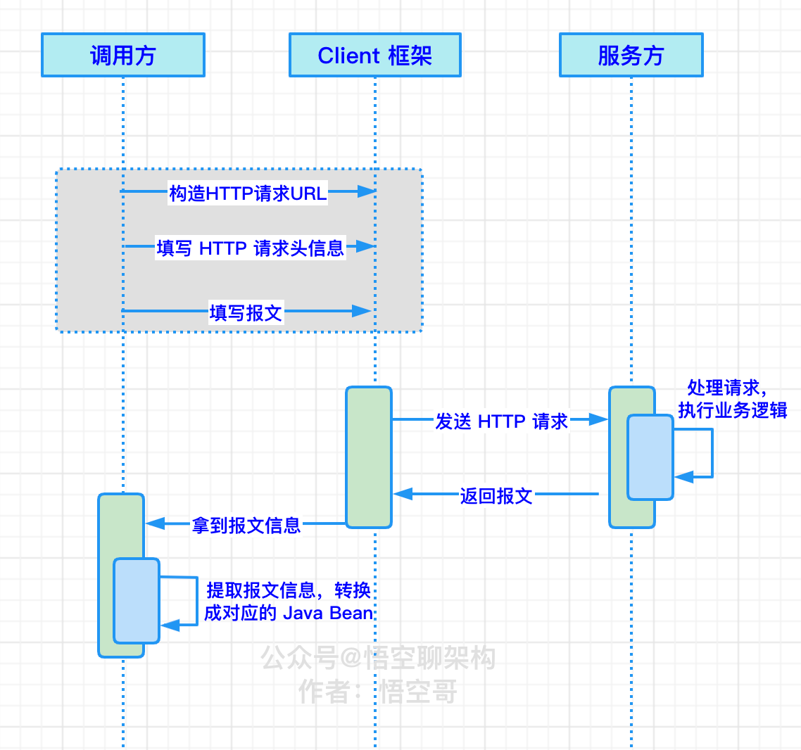
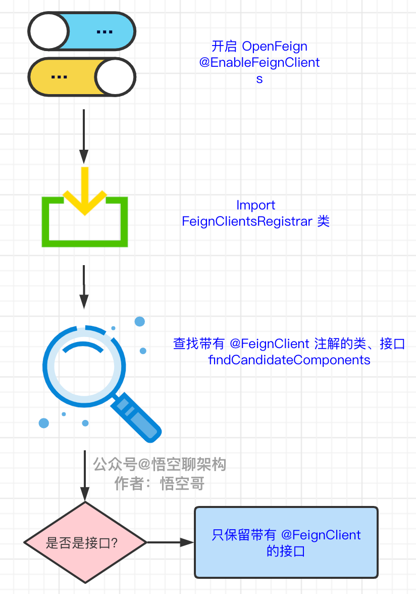
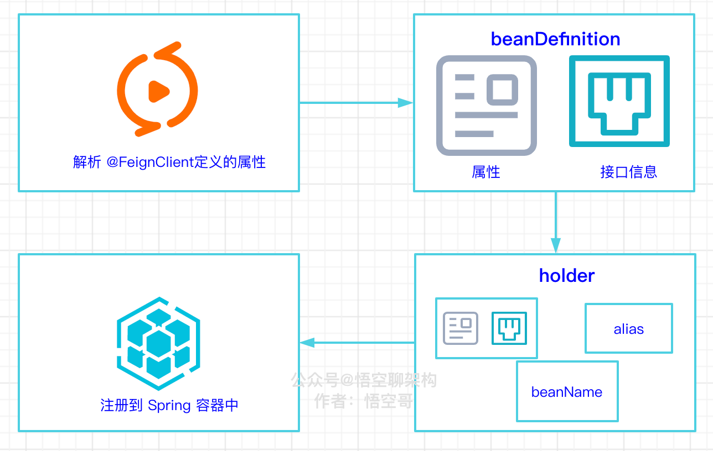
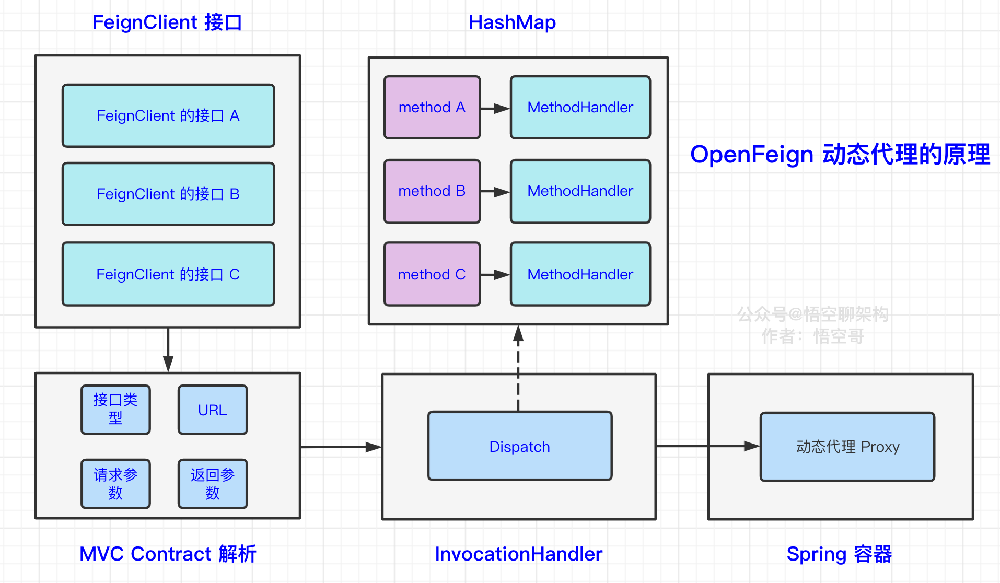
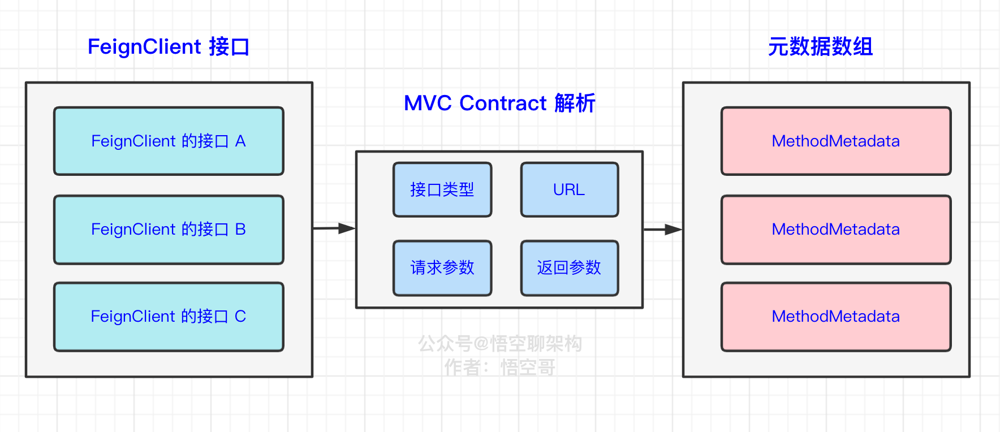
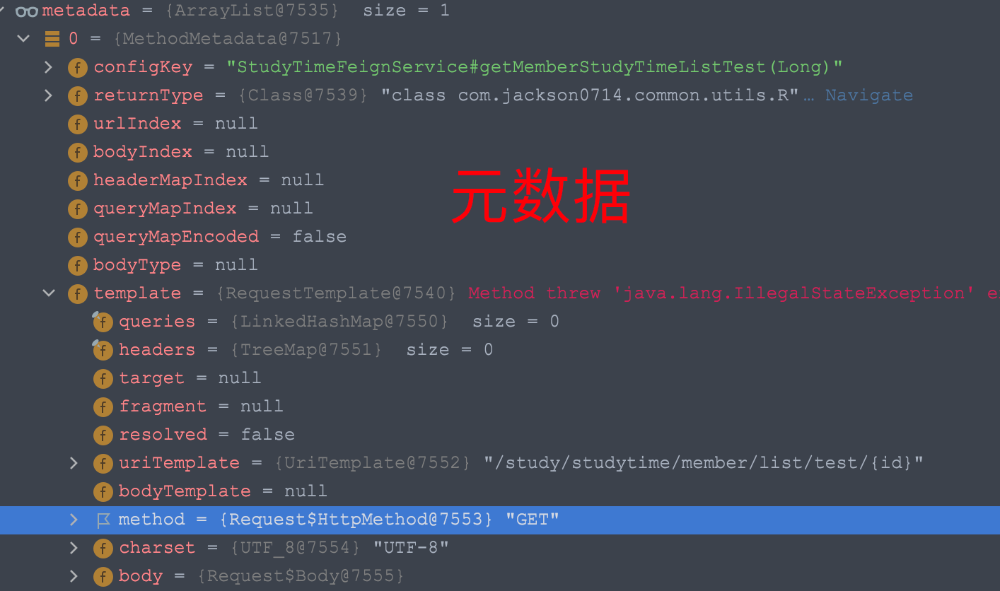
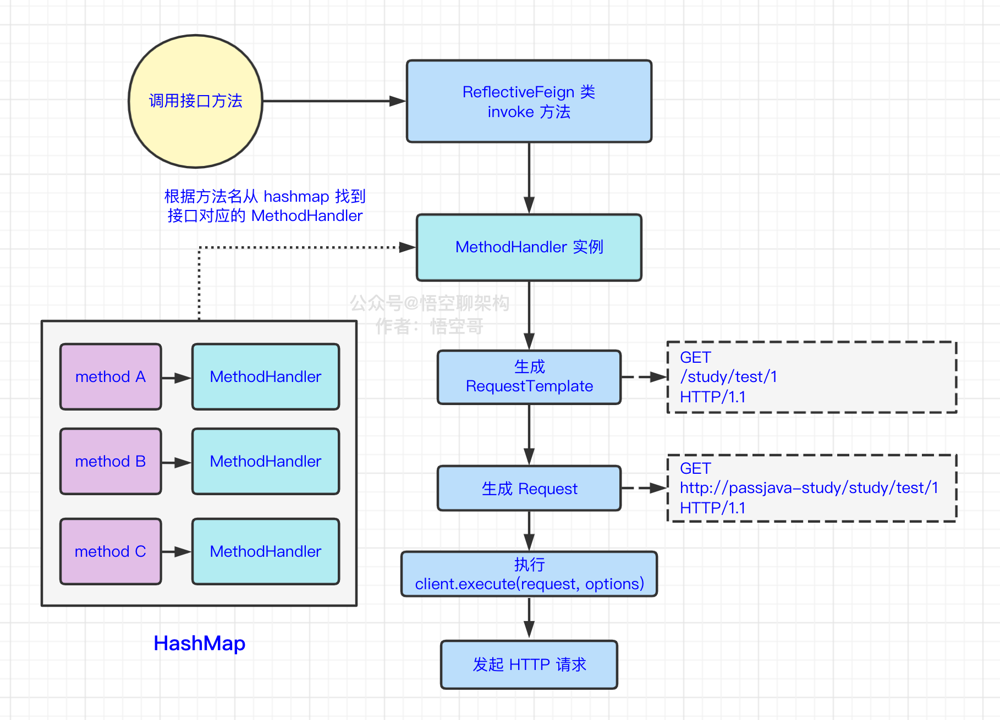
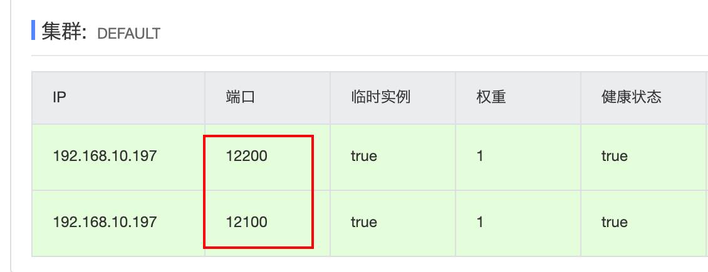
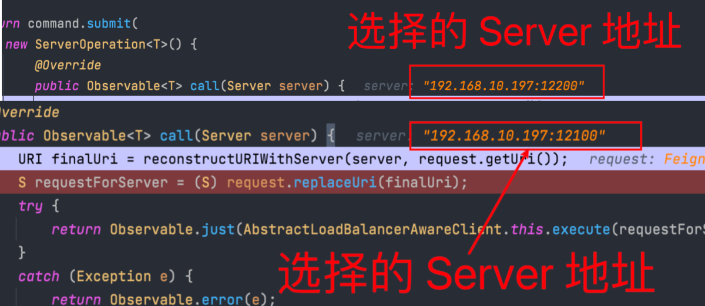

比较有趣的一点是 Feign 和 OpenFeign 这两个小家伙，这里做个总结：

Feign 最早是由 Netflix 公司进行维护的，后来 Netflix 不再对其进行维护，最终 Feign 由社区进行维护，更名为 OpenFeign。

Feign是 Springcloud组件中的一个轻量级 Restful的 HTTP 服务客户端，
Feign 内置了 Ribbon，用来做客户端负载均衡，去调用服务注册中心的服务。

Feign 的使用方式是：使用 Feign 的注解定义接口，调用这个接口，就可以调用服务注册中心的服务.

```text
    <dependency>
       <groupId>org.springframework.cloud</groupId>
       <artifactId>spring-cloud-starter-feign</artifactId>
    </dependency>
```

OpenFeign 是 Springcloud 在 Feign的基础上支持了 SpringMVC 的注解，如 @RequestMapping 等等。
OpenFeign 的 @FeignClient 可以解析 SpringMVC 的 @RequestMapping 注解下的接口，
并通过动态代理的方式产生实现类，实现类中做负载均衡并调用其他服务。
```text
    <dependency>
        <groupId>org.springframework.cloud</groupId>
        <artifactId>spring-cloud-starter-openfeign</artifactId>
    </dependency>
```

源码地址：https://github.com/openfeign/feign

# 一、理解远程调用
远程调用怎么理解呢？

远程调用和本地调用是相对的，那我们先说本地调用更好理解些，本地调用就是同一个 Service 里面的方法 A 调用方法 B。

那远程调用就是不同 Service 之间的方法调用。Service 级的方法调用，我们自己构造请求 URL和请求参数，就可以发起远程调用了。

在服务之间调用的话，我们都是基于 HTTP 协议，一般用到的远程服务框架有 OKHttp3，Netty, HttpURLConnection 等。
其调用流程如下：



但是这种虚线方框中的构造请求的过程是很繁琐的，有没有更简便的方式呢？

Feign 就是来简化我们发起远程调用的代码的，那简化到什么程度呢？简化成就像调用本地方法那样简单。

类似我的开源项目 PassJava 中的远程调用的代码：
```text
// 远程调用拿到该用户的学习时长
R memberStudyTimeList = studyTimeFeignService.getMemberStudyTimeListTest(id);
```

而 Feign 又是 Spring Cloud 微服务技术栈中非常重要的一个组件，如果让你来设计这个微服务组件，你会怎么来设计呢？

**我们需要考虑这几个因素**：
- 如何使远程调用像本地方法调用简单？（包扫描 + 动态代理）
- Feign 如何找到远程服务的地址的？
- Feign 是如何进行负载均衡的？（Feign 如何和 Ribbon 一起工作的）

接下来我们围绕这些核心问题来一起看下 Feign 的设计原理。

# 二、Feign 和 OpenFeign
OpenFeign 组件的前身是 Netflix Feign 项目，它最早是作为 Netflix OSS 项目的一部分，由 Netflix 公司开发。
后来 Feign 项目被贡献给了开源组织，于是才有了我们今天使用的 Spring Cloud OpenFeign 组件。

Feign 和 OpenFeign 有很多大同小异之处，不同的是 OpenFeign 支持 MVC 注解。

可以认为 OpenFeign 为 Feign 的增强版。

简单总结下 OpenFeign 能用来做什么：
- OpenFeign 是声明式的 HTTP 客户端，让远程调用更简单。
- 提供了HTTP请求的模板，编写简单的接口和插入注解，就可以定义好HTTP请求的参数、格式、地址等信息。
- 整合了【Ribbon（负载均衡组件）】和 【Hystrix（服务熔断组件）】，不需要显示使用这两个组件。
- Spring Cloud Feign 在 Netflix Feign的基础上扩展了对SpringMVC注解的支持。

# OpenFeign如何用
OpenFeign 的使用也很简单，这里还是用我的开源 SpringCloud 项目 PassJava 作为示例。

开源地址: https://github.com/Jackson0714/PassJava-Platform

Member 服务远程调用 Study 服务的方法 memberStudyTime()，如下图所示。


第一步：Member 服务需要定义一个 OpenFeign 接口：

```text
@FeignClient("passjava-study")
public interface StudyTimeFeignService {
    @RequestMapping("study/studytime/member/list/test/{id}")
    public R getMemberStudyTimeListTest(@PathVariable("id") Long id);
}
```

我们可以看到这个 interface 上添加了注解@FeignClient，而且括号里面指定了服务名：passjava-study。
显示声明这个接口用来远程调用 passjava-study服务。

第二步：Member 启动类上添加 @EnableFeignClients注解开启远程调用服务，且需要开启服务发现。如下所示：
```text
@EnableFeignClients(basePackages = "com.jackson0714.passjava.member.feign")
@EnableDiscoveryClient
```

第三步：Study 服务定义一个方法，其方法路径和 Member 服务中的接口 URL 地址一致即可。

URL 地址："study/studytime/member/list/test/{id}"

```text
@RestController
@RequestMapping("study/studytime")
public class StudyTimeController {
    @RequestMapping("/member/list/test/{id}")
    public R memberStudyTimeTest(@PathVariable("id") Long id) {
        ...
    }
}
```

第四步：Member 服务的 POM 文件中引入 OpenFeign 组件。

```text
<dependency>
    <groupId>org.springframework.cloud</groupId>
    <artifactId>spring-cloud-starter-openfeign</artifactId>
</dependency>
```

第五步：引入 studyTimeFeignService，Member 服务远程调用 Study 服务即可。

```text
Autowired
private StudyTimeFeignService studyTimeFeignService;

studyTimeFeignService.getMemberStudyTimeListTest(id);
```

通过上面的示例，我们知道，加了 @FeignClient 注解的接口后，我们就可以调用它定义的接口，然后就可以调用到远程服务了。

这里你是否有疑问：为什么接口都没有实现，就可以调用了？

OpenFeign 使用起来倒是简单，但是里面的原理可没有那么简单，OpenFeign 帮我们做了很多事情，
接下来我们来看下 OpenFeign 的架构原理。

# 四、梳理OpenFeign的核心流程
先看下 OpenFeign 的核心流程图：


1、在 Spring 项目启动阶段，服务 A 的OpenFeign 框架会发起一个主动的扫包流程。

2、从指定的目录下扫描并加载所有被 @FeignClient 注解修饰的接口，然后将这些接口转换成 Bean，统一交给 Spring 来管理。

3、根据这些接口会经过 MVC Contract 协议解析，将方法上的注解都解析出来，放到 MethodMetadata 元数据中。

4、基于上面加载的每一个FeignClient接口，会生成一个动态代理对象，指向了一个包含对应方法的MethodHandler的HashMap。
MethodHandler 对元数据有引用关系。
生成的动态代理对象会被添加到 Spring 容器中，并注入到对应的服务里。

5、服务 A 调用接口，准备发起远程调用。

6、从动态代理对象 Proxy 中找到一个 MethodHandler 实例，生成 Request，包含有服务的请求 URL（不包含服务的 IP）。

7、经过负载均衡算法找到一个服务的 IP 地址，拼接出请求的 URL。

8、服务 B 处理服务 A 发起的远程调用请求，执行业务逻辑后，返回响应给服务 A。

针对上面的流程，我们再来看下每一步的设计原理。首先主动扫包是如何扫的呢？

# 五、OpeFeign包扫描原理
上面的 PassJava 示例代码中，涉及到了一个 OpenFeign 的注解：@EnableFeignClients。
根据字面意思可以知道，可以注解是开启 OpenFeign 功能的。

包扫描的基本流程如下：



（1）@EnableFeignClients 这个注解使用 Spring 框架的 Import注解导入了 FeignClientsRegistrar 类，
开始了 OpenFeign 组件的加载。PassJava 示例代码如下所示。
```text
// 启动类加上这个注解
@EnableFeignClients(basePackages = "com.jackson0714.passjava.member.feign")

// EnableFeignClients 类还引入了 FeignClientsRegistrar 类
@Import(FeignClientsRegistrar.class)
public @interface EnableFeignClients {
    ...
}
```

（2）FeignClientsRegistrar 负责 Feign 接口的加载。
源码如下所示：
```text
@Override
public void registerBeanDefinitions(AnnotationMetadata metadata, BeanDefinitionRegistry registry) {
    // 注册配置
    registerDefaultConfiguration(metadata, registry);
    
    // 注册 FeignClient
    registerFeignClients(metadata, registry);
}
```

（3）registerFeignClients 会扫描指定包。

核心源码如下，
调用 find 方法来查找指定路径 basePackage 的所有带有 @FeignClients 注解的带有 @FeignClient 注解的类、接口。

```text
Set<BeanDefinition> candidateComponents = scanner.findCandidateComponents(basePackage);
```

（4）只保留带有 @FeignClient 的接口。
```text
// 判断是否是带有注解的 Bean。
if (candidateComponent instanceof AnnotatedBeanDefinition) {
    // 判断是否是接口
    AnnotatedBeanDefinition beanDefinition = (AnnotatedBeanDefinition) candidateComponent;
    AnnotationMetadata annotationMetadata = beanDefinition.getMetadata();
    // @FeignClient 只能指定在接口上。
    Assert.isTrue(annotationMetadata.isInterface(), "@FeignClient can only be specified on an interface");
}
```

接下来我们再来看这些扫描到的接口是如何注册到 Spring 中。

# 六、注册FeignClient到Spring的原理
还是在 registerFeignClients 方法中，当 FeignClient 扫描完后，就要为这些 FeignClient 接口生成一个【动态代理】对象。

顺藤摸瓜，进到这个方法里面，可以看到这一段代码：
```text
BeanDefinitionBuilder definition = BeanDefinitionBuilder.genericBeanDefinition(FeignClientFactoryBean.class);
```

核心就是 FeignClientFactoryBean 类，根据类的名字我们可以知道这是一个工厂类，用来创建 FeignClient Bean 的。

我们最开始用的 @FeignClient，里面有个参数 "passjava-study"，这个注解的属性，
当 OpenFeign 框架去创建 FeignClient Bean 的时候，就会使用这些参数去生成 Bean。
流程图如下：



- 解析 @FeignClient 定义的属性。
- 将注解@FeignClient 的属性 + 接口StudyTimeFeignService的信息构造成一个StudyTimeFeignService的beanDefinition。
- 然后将 beanDefinition 转换成一个 holder，这个 holder 就是包含了 beanDefinition, alias, beanName 信息。
- 最后将这个 holder 注册到 Spring 容器中。

源码如下：
```text
// 生成 beanDefinition
AbstractBeanDefinition beanDefinition = definition.getBeanDefinition();

// 转换成 holder，包含了 beanDefinition, alias, beanName 信息
BeanDefinitionHolder holder = 
    new BeanDefinitionHolder(beanDefinition, className, new String[] { alias });
    
// 注册到 Spring 上下文中。
BeanDefinitionReaderUtils.registerBeanDefinition(holder, registry);
```

上面我们已经知道 FeignClient 的接口是如何注册到 Spring 容器中了。
后面服务要调用接口的时候，就可以直接用 FeignClient 的接口方法了，如下所示：

```text
@Autowired
private StudyTimeFeignService studyTimeFeignService;

// 省略部分代码
// 直接调用
studyTimeFeignService.getMemberStudyTimeListTest(id);
```

但是我们并没有细讲这个 FeignClient 的创建细节，下面我们看下 FeignClient 的创建细节，这个也是 OpenFeign 核心原理。

# 七、OpenFeign动态代理原理
上面的源码解析中我们也提到了是由这个工厂类 FeignClientFactoryBean 来创建 FeignCient Bean，
所以我们有必要对这个类进行剖析。

在创建 FeignClient Bean 的过程中就会去生成动态代理对象。
调用接口时，其实就是调用动态代理对象的方法来发起请求的。

分析动态代理的入口方法为 getObject()。源码如下所示：
```text
Targeter targeter = get(context, Targeter.class);
return (T) targeter.target(this, builder, context,
    new HardCodedTarget<>(this.type, this.name, url));
```

接着调用 target 方法这一块，里面的代码真的很多很细，
我把核心的代码拿出来给大家讲下，这个 target 会有两种实现类：DefaultTargeter 和 HystrixTargeter。

而不论是哪种 target，都需要去调用 Feign.java 的 builder 方法去构造一个 feign client。

在构造的过程中，依赖 ReflectiveFeign 去构造。源码如下：

```text
// 省略部分代码
public class ReflectiveFeign extends Feign {
    // 为 feign client 接口中的每个接口方法创建一个 methodHandler
    public <T> T newInstance(Target<T> target) {
        for(...) {
            methodToHandler.put(method, handler);
        }
        // 基于JDK动态代理的机制，创建了一个passjava-study接口的动态代理，所有对接口的调用都会被拦截，然后转交给handler 的方法。
        InvocationHandler handler = factory.create(target, methodToHandler);
        T proxy = (T) Proxy.newProxyInstance(target.type().getClassLoader(),
            new Class<?>[] {target.type()}, handler);
        ...
    }
}
```

ReflectiveFeign 做的工作就是为带有 @FeignClient 注解的接口，创建出接口方法的动态代理对象。

比如示例代码中的接口 StudyTimeFeignService，会给这个接口中的方法 getMemberStudyTimeList 创建一个动态代理对象。

```text
@FeignClient("passjava-study")
public interface StudyTimeFeignService {
    @RequestMapping("study/studytime/member/list/test/{id}")
    public R getMemberStudyTimeList(@PathVariable("id") Long id);
}
```

创建动态代理的原理图如下所示：



- 解析 FeignClient 接口上各个方法级别的注解，
  比如远程接口的 URL、接口类型（Get、Post 等）、各个请求参数等。这里用到了 MVC Contract 协议解析，后面会讲到。
- 然后将解析到的数据封装成元数据，并为每一个方法生成一个对应的 MethodHandler 类作为方法级别的代理。
  相当于把服务的请求地址、接口类型等都帮我们封装好了。这些 MethodHandler 方法会放到一个 HashMap 中。
- 然后会生成一个 InvocationHandler 用来管理这个 hashMap，其中 Dispatch 指向这个 HashMap。
- 然后使用 Java 的 JDK 原生的动态代理，实现了 FeignClient 接口的动态代理 Proxy 对象。
  这个 Proxy 会添加到 Spring 容器中。
- 当要调用接口方法时，其实会调用动态代理 Proxy 对象的 methodHandler 来发送请求。

这个动态代理对象的结构如下所示，它包含了所有接口方法的 MethodHandler。


# 八、解析MVC注解的原理
上面我们讲到了接口上是有一些注解的，比如 @RequestMapping，@PathVariable，这些注解统称为 Spring MVC 注解。
但是由于 OpenFeign 是不理解这些注解的，所以需要进行一次解析。

解析的流程图如下：



而解析的类就是 SpringMvcContract 类，调用 parseAndValidateMetadata 进行解析。
解析完之后，就会生成元数据列表。
源码如下所示：
```text
List<MethodMetadata> metadata = contract.parseAndValidateMetadata(target.type());
```

这个类在这个路径下，大家可以自行翻阅下如何解析的，不在本篇的讨论范围内。

https://github.com/spring-cloud/spring-cloud-openfeign/blob/main/spring-cloud-openfeign-core/src/main/java/org/springframework/cloud/openfeign/support/SpringMvcContract.java

这个元数据 MethodMetadata 里面有什么东西呢？



- 方法的定义，如 StudyTimeFeignService 的 getMemberStudyTimeList 方法。
- 方法的参数类型，如 Long。
- 发送 HTTP 请求的地址，如 /study/studytime/member/list/test/{id}。

然后每个接口方法就会有对应的一个 MethodHandler，它里面就包含了元数据，
当我们调用接口方法时，其实是调用动态代理对象的 MethodHandler 来发送远程调用请求的。


上面我们针对 OpenFeign 框架如何为 FeignClient 接口生成动态代理已经讲完了，
下面我们再来看下当我们调用接口方法时，动态代理对象是如何发送远程调用请求的。

# 九、OpenFeign发送请求的原理
先上流程图：



还是在 ReflectiveFeign 类中，有一个 invoke 方法，会执行以下代码：
```text
dispatch.get(method).invoke(args);
```

这个 dispatch 我们之前已经讲解过了，它指向了一个 HashMap，里面包含了 FeignClient 每个接口的 MethodHandler 类。

这行代码的意思就是根据 method 找到 MethodHandler，调用它的 invoke 方法，且传的参数就是我们接口中的定义的参数。

那我们再跟进去看下这个 MethodHandler invoke 方法里面做了什么事情。源码如下所示：
```text
public Object invoke(Object[] argv) throws Throwable {
    RequestTemplate template = buildTemplateFromArgs.create(argv);
    ...
}
```

我们可以看到这个方法里面生成了 RequestTemplate，它的值类似如下：
```text
GET /study/list/test/1 HTTP/1.1
```

RequestTemplate 转换成 Request，它的值类似如下：
```text
GET http://passjava-study/study/list/test/1 HTTP/1.1
```

这不路径不就是我们要 study 服务的方法，这样就可以直接调用到 study 服了呀！

OpenFeign 帮我们组装好了发起远程调用的一切，我们只管调用就好了。

接着 MethodHandler 会执行以下方法，发起 HTTP 请求。
```text
client.execute(request, options);
```

从上面的我们要调用的服务就是 passjava-study，但是这个服务的具体 IP 地址我们是不知道的，
那 OpenFeign 是如何获取到 passjava-study 服务的 IP 地址的呢？

回想下最开始我们提出的核心问题：OpenFeign 是如何进行负载均衡的？

我们是否可以联想到上一讲的 Ribbon 负载均衡，它不就是用来做 IP 地址选择的么？

那我们就来看下 OpenFeign 又是如何和 Ribbon 进行整合的。

# 十、OpenFeign 如何与 Ribbon 整合的原理
为了验证 Ribbon 的负载均衡，我们需要启动两个 passjava-study 服务，这里我启动了两个服务，端口号分别为 12100 和 12200，IP 地址都是本机 IP：192.168.10.197。



接着上面的源码继续看，client.execute() 方法其实会调用 LoadBalancerFeignClient 的 exceute 方法。

这个方法里面的执行流程如下图所示：


将服务名称 passjava-study 从 Request 的 URL 中删掉，剩下的如下所示：
```text
GET http:///study/list/test/1 HTTP/1.1
```

根据服务名从缓存中找 FeignLoadBalancer，如果缓存中没有，则创建一个 FeignLoadBalancer。

FeignLoadBalancer 会创建出一个 command，这个 command 会执行一个 sumbit 方法。

submit 方法里面就会用 Ribbon 的负载均衡算法选择一个 server。源码如下：
```text
Server svc = lb.chooseServer(loadBalancerKey);
```

通过 debug 调试，我们可以看到两次请求的端口号不一样，一个是 12200，一个是 12100，说明确实进行了负载均衡。



然后将 IP 地址和之前剔除服务名称的 URL 进行拼接，生成最后的服务地址。

最后 FeignLoadBalancer 执行 execute 方法发送请求。

那大家有没有疑问，Ribbon 是如何拿到服务地址列表的？这个就是上一讲 Ribbon 架构里面的内容。

Ribbon 的核心组件 ServerListUpdater，用来同步注册表的，
它有一个实现类 PollingServerListUpdater ，专门用来做定时同步的。
默认1s 后执行一个 Runnable 线程，后面就是每隔 30s 执行 Runnable 线程。
这个 Runnable 线程就是去获取注册中心的注册表的。

# 十一、OpenFeign处理响应的原理
当远程服务 passjava-study 处理完业务逻辑后，就会返回 reponse 给 passjava-member 服务了，
这里还会对 reponse 进行一次解码操作。
```text
Object result = decode(response);
```

这个里面做的事情就是调用 ResponseEntityDecoder 的 decode 方法，将 Json 字符串转化为 Bean 对象。

# 十二、总结
本文通过我的开源项目 PassJava 中用到的 OpenFeign 作为示例代码作为入口进行讲解。
然后以图解+解读源码的方式深入剖析了 OpenFeign 的运行机制和架构设计。

核心思想：
- OpenFeign 会扫描带有 @FeignClient 注解的接口，然后为其生成一个动态代理。
- 动态代理里面包含有接口方法的 MethodHandler，MethodHandler 里面又包含经过 MVC Contract 解析注解后的元数据。
- 发起请求时，MethodHandler 会生成一个 Request。
- 负载均衡器 Ribbon 会从服务列表中选取一个 Server，拿到对应的 IP 地址后，拼接成最后的 URL，就可以发起远程服务调用了。

OpenFeign 的核心流程图：


