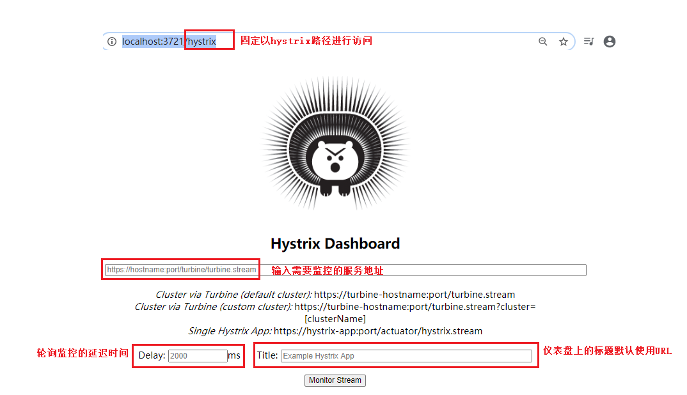

# 什么是Hystrix（概述）
微服务架构中，我们是将一个单体应用拆分成多个服务单元，
各个服务单元之间通过注册中心彼此发现和消费对方提供的服务，
每个服务单元都是单独部署，在各自的服务进程中运行，服务之间通过远程调用实现信息交互，
那么当某个服务的响应太慢或者故障，又或者因为网络波动或故障，则会造成调用者延迟或调用失败，
当出现大量请求的到来，则会造成请求堆积，导致调用者的线程挂起，从而引发调用者也无法响应，调用者也发生了故障。
因为一个服务单元的故障，导致服务调用单元也发生故障。


例如：
电商中的用户下订单，
我们有两个服务，订单服务和库存服务，
用户下订单时调用下订单服务，然后下订单服务又调用减库存服务，
如果减库存服务响应延迟或者没有响应，则会造成下订单服务的线程挂起等待，
如果大量的用户请求下订单，或导致大量的请求堆积，引起下订单服务也不可用，
如果还有另外一个服务依赖于订单服务，比如用户服务，它需要查询用户订单，
那么用户服务查询订单也会引起大量的延迟和请求堆积，导致用户服务也不可用。 

所以在微服务架构中，很容易造成服务故障的【蔓延】，引发整个微服务系统瘫痪不可用。 
为了解决此问题，微服务架构中引入了一种叫【熔断器】的【服务保护机制】。

【熔断器】也叫【断路器】，最早来源于微服务之父 Martin Fowler的论文CircuitBreaker一文。
“熔断器”本身是一种开关装置，用于在电路上保护线路过载，
当线路中有电器发生短路时，能够及时切断故障电路，防止发生过载、发热甚至起火等严重后果。 
微服务架构中的熔断器，就是当被调用方没有响应，调用方直接返回一个错误响应即可，而不是长时间的等待，
这样避免调用时因为等待而线程一直得不到释放，避免故障在分布式系统间蔓延。

Spring Cloud Hystrix实现了【熔断器】、【线程隔离】等一系列服务保护功能。
该功能也是基于 Netflix 的开源框架 Hystrix 实现的，
该框架的目标在于通过控制那些访问远程系统、服务和第三方库的节点，从而对延迟和故障提供更强大的容错能力。
Hystrix 具备服务【降级】、服务【熔断】、线程和信号【隔离】、【请求缓存】、【请求合并】以及【服务监控】等强大功能。

# Hystrix入门
## 步骤
1）添加依赖
```text
    <!-- https://mvnrepository.com/artifact/org.springframework.cloud/spring-cloud-starter-hystrix -->
    <dependency>
        <groupId>org.springframework.cloud</groupId>
        <artifactId>spring-cloud-starter-hystrix</artifactId>
        <version>1.4.7.RELEASE</version>
    </dependency>
```

2）在入口类中使用@EnableCircuitBreaker注解开启断路器功能。
也可以使用@SpringCloudApplication注解，
该注解相当于是@EnableCircuitBreaker，@SpringBootApplication，@EnableEurekaClient的复合注解。
```text
@SpringBootApplication
@EnableEurekaClient
@EnableCircuitBreaker // 开启断路器功能
public class Application {

    public static void main(String[] args) {
        SpringApplication.run(Application.class, args);
    }
}
```

3）在调用远程服务的方法上添加@HystrixCommand注解
```text
    @RequestMapping("/web/hystrix")
    @HystrixCommand(fallbackMethod = "error") //当发生熔断，回调error方法
    public String hystrix(){
        return restTemplate.getForEntity("http://01-SPRINGCLOUD-SERVICE-PROVIDER/service/hello", 
                                String.class).getBody();
    }

    public String error(){
        return "error";
    }
```

## 环境

- 至少一个Eureka注册中心程序
- 至少两个Eureka服务提供程序，服务名相同
- 一个服务调用程序

服务调用程序选择负载均衡策略为：重试策略。
```text
    @Bean
    public IRule iRule(){
        return new RetryRule(); // 重试策略
    }
```

配置如下：
```text
# 每间隔30秒，向服务端发送一次心跳，证明自己依然“存活”(默认30秒)
eureka.instance.lease-renewal-interval-in-seconds=2
# 告诉服务端，如果90s内没有发送心跳，就代表该服务故障了，让服务端注销该服务（默认90秒）
eureka.instance.lease-expiration-duration-in-seconds=8
```

启动所有程序，然后停止其中一个服务提供程序，模拟程序发生故障，
这时请求访问该方法使用的还是，轮询负载均衡策略，正常的节点依旧可以访问，故障的节点无法响应，
这时会调用消费端程序的错误响应方法返回（也就是error方法）这就是熔断器的作用，
当注册中心还处于服务保护机制中，会再次对发生故障的节点进行重试，
8秒后服务没有发送心跳，则注册中心将该服务注销，使得再发送该请求时，只会访问正常的节点。

# 服务消费者Hystrix测试
hystrix 默认超时时间是 1000 毫秒，如果你后端的响应超过此时间，就会触发熔断器；
```text
    @RequestMapping("/web/hystrix")
    @HystrixCommand(fallbackMethod = "error",
            commandProperties={ @HystrixProperty(
                    name="execution.isolation.thread.timeoutInMilliseconds",
                    value="1500")}) // 当发生熔断，回调error方法，通过commandProperties属性设置超时时间
    public String hystrix(){
        return restTemplate.getForEntity("http://01-SPRINGCLOUD-SERVICE-PROVIDER/service/hello",
                                String.class).getBody();
    }

    public String error(){
        return "error";
    }
```

其中一个服务提供者程序使用sleep方法模拟超时，远程调用服务方法的时间为1500毫秒，
而服务本身执行时间大于4500毫秒，所以会进行熔断。
```text
@RestController
public class HelloController {
    @RequestMapping("/service/hello")
    public String hello(){
        try {
            Thread.sleep(4000);
        } catch (InterruptedException e) {
            e.printStackTrace();
        }
        return "hello spring clound provider 1";
    }
}
```

# Hystrix的服务降级
有了服务的熔断，随之就会有服务的降级，
所谓服务降级，就是当某个服务熔断之后，服务端提供的服务将不再被调用，
此时由客户端自己准备一个本地的 fallback回调，返回一个默认值来代表服务端的返回。 
这种做法，虽然不能得到正确的返回结果，但至少保证了服务的可用，比直接抛出错误或服务不可用要好很多，
当然这需要根据具体的业务场景来选择。

# Hystrix的异常处理
我们在调用服务提供者时，我们自己也有可能会抛异常，默认情况下方法抛了异常会自动进行服务降级，交给服务降级中的方法去处理；
服务消费端本身也是一个程序，在远程调用程序的时候本身也可能出现异常；
不管是服务调用者还是服务消费者出现异常时，都会触发Hystrix熔断机制，也会进行熔断降级调用回调方法；

当我们自己发生异常后，只需要在服务降级方法中添加一个 Throwable 类型的参数就能够获取到抛出的异常的类型，如下：

**服务调用者异常**
```text
    @RequestMapping("/web/hystrix")
    @HystrixCommand(fallbackMethod = "error",
            commandProperties={ @HystrixProperty(
                    name="execution.isolation.thread.timeoutInMilliseconds",
                    value="1500")}) // 当发生熔断，回调error方法，通过commandProperties属性设置超时时间
    public String hystrix(){
        // 模拟调用者端发生异常
        int a = 10 / 0;
        return restTemplate.getForEntity("http://01-SPRINGCLOUD-SERVICE-PROVIDER/service/hello", 
                                String.class).getBody();
    }

    public String error(Throwable throwable){
        // 打印异常信息
        System.out.println(throwable.getMessage());
        return "error";
    }
```

**服务提供者异常**

服务提供者方法
```text
    @RequestMapping("/service/hello")
    public String hello(){
        int i = 10 / 0;
        return "hello spring cloud provider 2";
    }
```

服务调用者方法
```text
    @RequestMapping("/web/hystrix")
    @HystrixCommand(fallbackMethod = "error",
            commandProperties={ @HystrixProperty(
                    name="execution.isolation.thread.timeoutInMilliseconds",
                    value="1500")}) // 当发生熔断，回调error方法，通过commandProperties属性设置超时时间
    public String hystrix() {
        return restTemplate.getForEntity("http://01-SPRINGCLOUD-SERVICE-PROVIDER/service/hello",
                                String.class).getBody();
    }

    public String error(Throwable throwable){
        // 打印异常信息
        System.out.println(throwable.getMessage());
        return "error";
    }
```

此时我们可以在控制台看到异常的类型；
如果远程服务有一个异常抛出后我们不希望进入到服务降级方法中去处理，而是直接将异常抛给用户，
那么我们可以在@HystrixCommand注解中添加忽略异常，如下：
```text
@HystrixCommand(ignoreExceptions = Exception.class){  }
```

加上ignoreException属性后表示当出现该类异常时，不进行服务降级处理，直接将异常返回，
这里写的是Exception异常类，也就是出现任何异常都不进行服务降级处理；
```text
    @RequestMapping("/web/hystrix")
    @HystrixCommand(fallbackMethod = "error",
                    ignoreExceptions = Exception.class,
                    commandProperties={ @HystrixProperty(
                        name="execution.isolation.thread.timeoutInMilliseconds",
                        value="1500")}) // 当发生熔断，回调error方法，通过commandProperties属性设置超时时间
    public String hystrix() {
        return restTemplate.getForEntity("http://01-SPRINGCLOUD-SERVICE-PROVIDER/service/hello", 
                                String.class).getBody();
    }

    public String error(Throwable throwable){
        // 打印异常信息
        System.out.println(throwable.getMessage());
        return "error";
    }
```

测试之后发现，当发生异常的情况下，并不会走服务降级处理方法（级error方法），
需要注意的是服务超时并不是异常，所以会进行服务降级处理。

# 自定义Hystrix请求的服务异常熔断处理
我们也可以自定义类继承自 HystrixCommand 来实现自定义的Hystrix 请求，
在 getFallback 方法中调用 getExecutionException 方法来获取服务抛出的异常。

## 服务消费端自定义异常熔断处理类
```text
/**
* 自定义的Hystrix请求
*/
public class MyHystrixCommand extends HystrixCommand<String>{

    private RestTemplate restTemplate;

    /**
    * setter是服务的分组命名等信息
    * @param setter
    * @param restTemplate
    */
    public MyHystrixCommand(Setter setter, RestTemplate restTemplate){
        super(setter);
        this.restTemplate = restTemplate;
    }

    @Override
    protected String run() throws Exception {
        // 调用远程服务
        return restTemplate.getForEntity("http://01-SPRINGCLOUD-SERVICE-PROVIDER/service/hello", 
                                String.class).getBody();
    }

    /**
    * 覆盖getFallback方法实现服务熔断降级的逻辑
    * 当远程服务超时，异常，不可用等情况时，会触发熔断方法
    * @return
    */
    @Override
    protected String getFallback() {
        // 表示触发熔断
        return "error";
    }
}
```

Controller调用
```text
    @RequestMapping("/web/hystrix2")
    public String hystrix2(){
        MyHystrixCommand myHystrixCommand = 
            new MyHystrixCommand(
                com.netflix.hystrix.HystrixCommand.Setter
                    .withGroupKey(HystrixCommandGroupKey.Factory.asKey("")), 
                restTemplate);
        // 如果执行远程调用没有问题则返回结果，如果远程调用出现异常，则返回异常处理的结果
        String execute = myHystrixCommand.execute();
        return execute;
    }
```

自定义异常熔断处理类，调用时可以进行同步或异步调用，使用【execute()方法】属于同步调用，
该方法执行后，会等待远程的返回结果，获得返回结果后才返回，代码继续往下执行；
如果是【queue()方法】，则该方法是异步调用，并不等待结果放回才执行下面的程序，而是执行异步方法后，直接执行下面的程序；
```text
    @RequestMapping("/web/hystrix3")
    public String hystrix3() throws ExecutionException, InterruptedException {
        MyHystrixCommand myHystrixCommand = 
            new MyHystrixCommand(
                com.netflix.hystrix.HystrixCommand.Setter
                    .withGroupKey(HystrixCommandGroupKey.Factory.asKey("")), 
                restTemplate);
        // 异步调用（该方法执行后，不会马上有远程的返回结果，而是去执行下面的其他代码）
        Future<String> queue = myHystrixCommand.queue();

        // 业务逻辑代码（省略）

        // 通过Future对象获取，如果没有获取到，该方法会一直阻塞
        String str = queue.get();

        // 业务逻辑代码（省略）

        return str;
    }
```

自定义的熔断处理类可以通过getExecutionException方法来获取服务抛出的异常；
```text
    /**
    * 覆盖getFallback方法实现服务熔断降级的逻辑
    * 当远程服务超时，异常，不可用等情况时，会触发熔断方法
    * @return
    */
    @Override
    protected String getFallback() {
        // 调用父类的getExecutionException方法获取异常信息
        Throwable throwable = super.getExecutionException();
    
        System.out.println("=============" + throwable.getMessage());
        System.out.println("=============" + throwable.getStackTrace());
    
        // 表示触发熔断
        return "error";
    }
```

# Hystrix仪表盘监控
Hystrix 仪表盘（Hystrix Dashboard），就像汽车的仪表盘实时显示汽车的各项数据一样，
Hystrix 仪表盘主要用来监控 Hystrix 的实时运行状态，通过它我们可以看到Hystrix的各项指标信息，
从而快速发现系统中存在的问题进而解决它。

要使用Hystrix仪表盘功能，我们首先需要有一个Hystrix Dashboard，
这个功能我们可以在原来的消费者应用上添加，让原来的消费者应用具备Hystrix仪表盘功能，
但一般地，微服务架构思想是推崇服务的拆分，Hystrix Dashboard也是一个服务，
所以通常会单独创建一个新的工程专门用做 Hystrix Dashboard服务；

**创建一个新的SpringBoot项目**

**添加依赖**
```text
        <!-- hystrix-dashboard 功能的起步依赖 -->
        <dependency>
            <groupId>org.springframework.cloud</groupId>
            <artifactId>spring-cloud-starter-hystrix-dashboard</artifactId>
            <version>1.4.7.RELEASE</version>
        </dependency>

    <dependencyManagement>
        <dependencies>
            <dependency>
                <groupId>org.springframework.cloud</groupId>
                <artifactId>spring-cloud-dependencies</artifactId>
                <version>Hoxton.RELEASE</version>
                <type>pom</type>
                <scope>import</scope>
            </dependency>
            <dependency>
                <groupId>org.springframework.boot</groupId>
                <artifactId>spring-boot-dependencies</artifactId>
                <version>${spring-boot.version}</version>
                <type>pom</type>
                <scope>import</scope>
            </dependency>
        </dependencies>
    </dependencyManagement>
```

在启动类上添加 @EnableHystrixDashboard注解开启仪表盘功能
```text
@SpringBootApplication
@EnableHystrixDashboard // 注解开启仪表盘功能
public class Application {
    public static void main(String[] args) {
        SpringApplication.run(Application.class, args);
    }
}
```

属性配置
```text
# 应用服务 WEB 访问端口(hystrix的仪表盘服务端口)
server.port=3721
```

搭建完成后，启动项目，通过http://localhost:3721/hystrix 进行访问；



Hystrix 仪表盘工程已经创建好了，现在我们需要有一个服务，让这个服务提供一个路径为/actuator/hystrix.stream 接口，
然后就可以使用 Hystrix 仪表盘来对该服务进行监控了；

我们改造消费者服务，让其能提供/actuator/hystrix.stream接口，步骤如下：

1、消费者项目需要有hystrix的依赖
```text
        <!-- spring cloud 熔断器起步依赖-->
        <dependency>
            <groupId>org.springframework.cloud</groupId>
            <artifactId>spring-cloud-starter-hystrix</artifactId>
            <version>1.4.7.RELEASE</version>
        </dependency>
```

2、需要有一个spring boot的服务监控依赖：
```text
        <!-- spring-boot 提供的健康检查依赖 -->
        <dependency>
            <groupId>org.springframework.boot</groupId>
            <artifactId>spring-boot-starter-actuator</artifactId>
            <version>2.3.2.RELEASE</version>
        </dependency>
```

3、配置文件需要配置spring boot监控端点的访问权限：

监控端点就是服务消费者程序
```text
# spring-boot 的监控端点访问权限，*代表所有的访问端点都允许访问，方便测试；
# hystrix.stream 则代表health 和 info 以及hystrix.stream三个可以访问
# 默认不配置是支持health 和 info
management.endpoints.web.exposure.include=*
```

注意：
这里有一个细节需要注意，要访问/hystrix.stream接口，
首先得访问consumer工程中的任意一个使用熔断器的接口，否则直接访问/hystrix.stream接口时会输出出一连串的ping:ping: …，
先访问consumer中的任意一个其他接口，然后再访问/hystrix.stream接口即可；

先访问consumer接口 http://localhost:8082/web/hystrix2
```text
    @RequestMapping("/web/hystrix2")
    public String hystrix2(){
        MyHystrixCommand myHystrixCommand = 
            new MyHystrixCommand(
                com.netflix.hystrix.HystrixCommand.Setter
                    .withGroupKey(HystrixCommandGroupKey.Factory.asKey("")), 
                restTemplate);
        // 如果执行远程调用没有问题则返回结果，如果远程调用出现异常，则返回异常处理的结果
        String execute = myHystrixCommand.execute();
        return execute;
    }
```

再访问Hystrix-Dashboard工程的接口：localhost:8082/actuator/hystrix.steam
注意 8082是consumer的端口


