# 0. Hystrix是什么?
Hystrix的本意是指 豪猪 的动物，它身上长满了很长的较硬的空心尖刺，当受到攻击时，通过后退的方式使其尖刺刺入敌方的身体。
作为这种特征的引申，Netflix公司在分布式微服务架构的践行下，
将其保护服务的稳定性而设计的客户端熔断和断路器的解决方案，称之为Hystrix。

Hystrix的【设计目的】是将应用中的远程系统访问、服务调用、第三方依赖包的调用入口，通过资源控制的方式隔离开，
避免了在分布式系统中失败的级联塌方式传递，提升系统的弹性和健壮性。

**Hystrix的现状–官方社区已死**
```text
Hystrix 当前已经进入为维护阶段，Netflix 认为Hystrix的定位和使命在功能上，
当前已经完全满足了既有的内部系统，所以后期不再有新的开发和新的特性出现。
团队由于精力的原因，在Github上，不再review issue，不再接受Merge request，也不再发布新的版本，版本定格在1.5.8。
```

**问题：官方社区已死，还有必要学习吗？**
```text
Hystrix虽然官方社区不再维护，但是其客户端熔断保护，断路器设计理念，有非常高的学习价值，
为我们在服务保护的设计上，提供了非常好的设计思路；
除了官方不再维护之外，hystrix目前对于一般的分布式服务调度，甚至本地服务保护上，完全可以胜任，在短期内可以正常使用。
```

# 1. Hystrix模型基础
- **设计模式：命令模式(Command Pattern)**
   命令模式 将客户端对服务直接调用，封装成一个待执行的请求，客户端和请求被封装为一个对象，
   对于服务方而言，每个不同的请求就是不同的参数，从而让我们可用不同的请求对客户进行参数化；
   命令模式的最大特征就是把客户端和服务端直接关系，通过命令对象进行解耦，
   在执行上，可以对请求排队或者记录请求日志，以及支持可撤销的操作。

- **线程池和信号量隔离**
   计算机系统中，线程作为系统运行的基本单位，
   可以通过划分指定的线程池资源的使用目的，对系统资源进行分离，具备资源限定的能力，进而保护系统；
   另外在Java中，Semaphore的信号量机制，也能提供资源竞争的隔离作用。

# 2. Hystrix工作原理
   如下图所示，Hystrix的工作流程上大概会有如下9个步骤，下文将详细介绍每个流程：

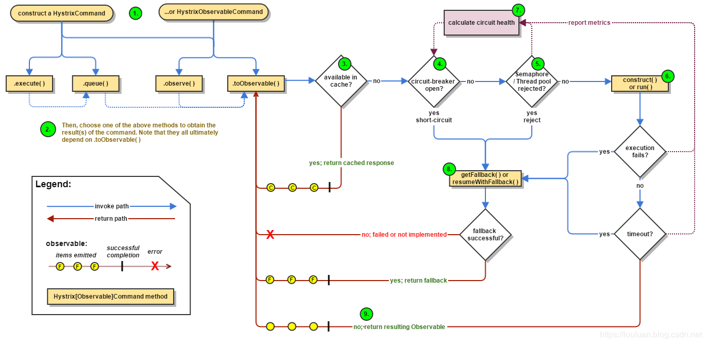

## 2.1 创建HystrixCommand或者HystrixObservableCommand
在使用Hystrix的过程中，会对依赖服务的调用请求封装成命令对象，
Hystrix对命令对象抽象了两个抽象类：HystrixCommand 和 HystrixObservableCommand。

HystrixCommand 表示的命令对象会返回一个唯一返回值：
```text
public class QueryOrderCommand extends HystrixCommand<Order> {
    private String orderId;
    public QueryOrderCommand(String orderId){
        super(Setter.withGroupKey(HystrixCommandGroupKey.Factory.asKey("hystrix-order-group"))
                .andThreadPoolKey(HystrixThreadPoolKey.Factory.asKey("hystrix-thread-order"))
                .andCommandKey(HystrixCommandKey.Factory.asKey("hystrix-pay-order"))
                .andCommandPropertiesDefaults(HystrixCommandProperties.defaultSetter())
                .andThreadPoolPropertiesDefaults(HystrixThreadPoolProperties.defaultSetter()
                        .withCoreSize(10)
                        .withQueueSizeRejectionThreshold(15)
                )
        );
        this.orderId = orderId;
    }
    @Override
    protected Order run() throws Exception {
        System.out.println("fetching order info via service call");
        return new Order();
    }
}

class Order{
    private String orderId;
    private String productId;
    private String status;
}
```

HystrixObservableCommand 表示的命令对象会返回多个返回值。

## 2.2. 执行命令
Hystrix中共有4种方式执行命令，如下所示：

| 执行方式           | 说明                                                                                 | 可用对象                     |
|----------------|------------------------------------------------------------------------------------|--------------------------|
| execute()      | 阻塞式同步执行，返回依赖服务的单一返回结果(或者抛出异常)                                                      | HystrixCommand           |
| queue()        | 基于Future的异步方式执行，返回依赖服务的单一返回结果(或者抛出异常)                                              | HystrixCommand           |
| observe()      | 基于Rxjava的Observable方式，返回通过Observable表示的依赖服务返回结果,代调用代码先执行(Hot Obserable)            | HystrixObservableCommand |
| toObservable() | 基于Rxjava的Observable方式，返回通过Observable表示的依赖服务返回结果,执行代码等到真正订阅的时候才会执行(cold observable) | HystrixObservableCommand |

这四种命令中，execute()、queue()、observe()的表示也是通过toObservable()实现的，其转换关系如下图所示：

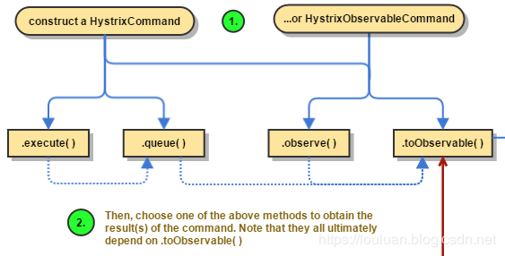

```text
K             value   = command.execute();
// 等价语句：
K             value = command.execute().queue().get();


Future<K>     fValue  = command.queue();
// 等价语句：
Future<K>     fValue = command.toObservable().toBlocking().toFuture();


// hot observable，立刻订阅，命令立刻执行
Observable<K> ohValue = command.observe();         
// 等价语句：
Observable<K> ohValue = command.toObservable().subscribe(subject);


// 上述执行最终实现还是基于toObservable()
// cold observable，延后订阅，订阅发生后，执行才真正执行
Observable<K> ocValue = command.toObservable();    
```

## 2.3. 返回结果是否被缓存？
如果当前命令对象配置了允许从结果缓存中取返回结果，并且在结果缓存中已经缓存了请求结果，
则缓存的请求结果会立刻通过Observable的格式返回。具体Hystrix的缓存策略，请参考。

## 2.4. 断路器是否打开？
如果第3步没有缓存没有命中，则判断一下当前断路器的断路状态是否打开。

如果断路器状态为打开状态，则Hystrix将不会执行此Command命令，直接执行 步骤8 调用Fallback。

如果断路器状态是关闭，则执行 步骤5 检查是否有足够的资源运行 Command命令。

## 2.5. 资源(线程池/队列/信号量)是否已满？
如果当前要执行的 Command命令 关联的线程池 和队列(或者信号量)资源已经满了，
Hystrix将不会运行 Command命令，直接执行 步骤8 的Fallback降级处理；
如果未满，表示有剩余的资源执行Command命令，则执行 步骤6。

## 2.6. 执行 HystrixObservableCommand.construct() 或者 HystrixCommand.run()
当经过 步骤5 判断，有足够的资源执行Command命令时，本步骤将调用Command命令运行方法
，基于不同类型的Command，有如下两种两种运行方式：

| 运行方式                                 | 说明                                          |
|--------------------------------------|---------------------------------------------|
| HystrixCommand.run()                 | 返回一个处理结果或者抛出一个异常                            |
| HystrixObservableCommand.construct() | 返回一个Observable表示的结果(可能多个)，或者 基于onError的错误通知 |

如果run()或者construct()方法的真实执行时间超过了Command设置的超时时间阈值，
则当前则执行线程（或者是独立的定时器线程）将会抛出TimeoutException。
抛出超时异常TimeoutException后，将执行步骤8的Fallback降级处理。
即使run()或者construct()执行没有被取消或中断，最终能够处理返回结果，
但在降级处理逻辑中，将会抛弃run()或construct()方法的返回结果，而返回Fallback降级处理结果。

```text
【注意事项】
需要注意的是，Hystrix无法强制将正在运行的线程停止掉——Hystrix能够做的最好的方式就是在JVM中抛出一个InterruptedException。
如果Hystrix包装的工作不抛出中断异常InterruptedException，则在Hystrix线程池中的线程将会继续执行，
尽管调用的客户端已经接收到了TimeoutException。
这种方式会使Hystrix的线程池处于饱和状态。
大部分的Java Http Client 开源库并不会解析 InterruptedException。
所以确认HTTP client 相关的连接和读/写相关的超时时间设置。

如果Command命令没有抛出任何异常，并且有返回结果，则Hystrix将会在做完日志记录和统计之后会将结果返回。 
如果是通过run()方式运行，则返回一个Observable对象，包含一个唯一值，并且发送一个onCompleted通知；
如果是通过construct()方式运行 ，则返回一个Observable对象。
```

## 2.7. 计算断路器的健康状况
Hystrix 会统计Command命令执行执行过程中的成功数、失败数、拒绝数和超时数，将这些信息记录到断路器(Circuit Breaker)中。
断路器将上述统计按照【时间窗】的形式记录到一个定长数组中。
断路器根据时间窗内的统计数据去判定请求什么时候可以被熔断，熔断后，在接下来一段恢复周期内，相同的请求过来后会直接被熔断。
当再次校验，如果健康监测通过后，熔断开关将会被关闭。

## 2.8. 获取Fallback
当以下场景出现后，Hystrix将会尝试触发Fallback:

- 步骤6 Command执行时抛出了任何异常；
- 步骤4 断路器已经被打开
- 步骤5 执行命令的线程池、队列或者信号量资源已满
- 命令执行的时间超过阈值

## 2.9. 返回成功结果
如果 Hystrix 命令对象执行成功，将会返回结果，或者以Observable形式包装的结果。
根据步骤2的command 调用方式，返回的Observable 会按照如下图说是的转换关系进行返回：

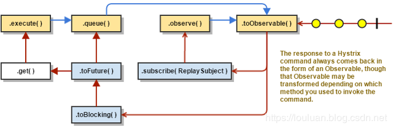

# 3. 断路器工作原理

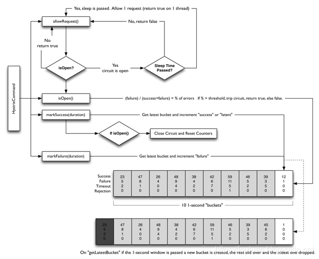

1）断路器时间窗内的请求数是否超过了请求数断路器生效阈值circuitBreaker.requestVolumeThreshold，
如果超过了阈值，则将会触发断路，断路状态为开启。
例如，如果当前阈值设置的是20,则当时间窗内统计的请求数共计19个，即使19个全部失败了，都不会触发断路器。

2）并且请求错误率超过了请求错误率阈值errorThresholdPercentage。

3）如果两个都满足，则将断路器由关闭迁移到开启。

4）如果断路器开启，则后续的所有相同请求将会被断路掉。

5）直到过了沉睡时间窗sleepWindowInMilliseconds后，再发起请求时，允许其通过（此时的状态为半开起状态）。
如果请求失败了，则保持断路器状态为开启状态，并更新沉睡时间窗。
如果请求成功了，则将断路器状态改为关闭状态。

核心的逻辑如下：
```text
@Override
public void onNext(HealthCounts hc) {
    // check if we are past the statisticalWindowVolumeThreshold
    if (hc.getTotalRequests() < properties.circuitBreakerRequestVolumeThreshold().get()) {
        // we are not past the minimum volume threshold for the stat window,
        // so no change to circuit status.
        // if it was CLOSED, it stays CLOSED
        // if it was half-open, we need to wait for a successful command execution
        // if it was open, we need to wait for sleep window to elapse
    } else {
        if (hc.getErrorPercentage() < properties.circuitBreakerErrorThresholdPercentage().get()) {
            //we are not past the minimum error threshold for the stat window,
            // so no change to circuit status.
            // if it was CLOSED, it stays CLOSED
            // if it was half-open, we need to wait for a successful command execution
            // if it was open, we need to wait for sleep window to elapse
        } else {
            // our failure rate is too high, we need to set the state to OPEN
            if (status.compareAndSet(Status.CLOSED, Status.OPEN)) {
                circuitOpened.set(System.currentTimeMillis());
            }
        }
    }
}
```

## 3.1 断路器相关配置：
| key值                                     | 说明              | 默认值      |
|------------------------------------------|-----------------|----------|
| circuitBreaker.enabled                   | 是否开启断路器         | true     |
| circuitBreaker.requestVolumeThreshold    | 断路器启用请求数阈值      | 20       |
| circuitBreaker.sleepWindowInMilliseconds | 断路器启用后的睡眠时间窗    | 5000(ms) |
| circuitBreaker.errorThresholdPercentage  | 断路器启用失败率阈值      | 50(%)    |
| circuitBreaker.forceOpen                 | 是否强制将断路器设置成开启状态 | false    |
| circuitBreaker.forceClosed               | 是否强制将断路器设置成关闭状态 | false    |

```text
Key值的配置问题：
默认配置：上述Key值之前要加上hystrix.command.default.前缀拼接
实例配置：上述Key值之前要加上hystrix.command.<command-key>. 前缀拼接
```

## 3.2 系统指标
Hystrix对系统指标的统计是基于时间窗模式的：
```text
【时间窗】：最近的一个时间区间内，比如前一小时到现在，那么时间窗的长度就是1小时；
【桶】：桶是在特定的时间窗内，等分的指标收集的统计集合；
比如时间窗的长度为1小时，而桶的数量为10，那么每个桶在时间轴上依次排开，时间由远及近，
每个桶统计的时间分片为 1h / 10 = 6 min 6分钟。
一个桶中，包含了成功数、失败数、超时数、拒绝数 四个指标。
```

在系统内，时间窗会随着系统的运行逐渐向前移动，而时间窗的长度和桶的数量是固定不变的，
那么随着时间的移动，会出现较久的过期的桶被移除出去，新的桶被添加进来，如下图所示：

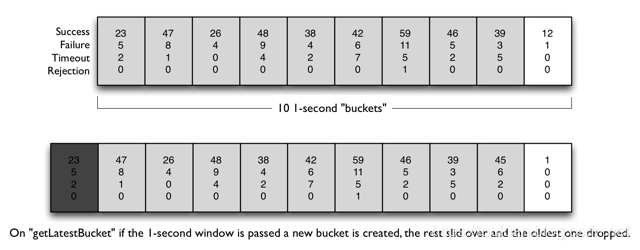

| key值                                          | 说明                                          | 默认值       |
|-----------------------------------------------|---------------------------------------------|-----------|
| metrics.rollingStats.timeInMilliseconds       | 时间窗的长度                                      | 10000(ms) |
| metrics.rollingStats.numBuckets               | 桶的数量，需要保证timeInMilliseconds % numBuckets =0 | 10        |
| metrics.rollingPercentile.enabled             | 是否统计运行延迟的占比                                 | true      |
| metrics.rollingPercentile.timeInMilliseconds  | 运行延迟占比统计的时间窗                                | 60000(ms) |
| metrics.rollingPercentile.numBuckets          | 运行延迟占比统计的桶数                                 | 6         |
| metrics.rollingPercentile.bucketSize          | 百分比统计桶的容量，桶内最多保存的运行时间统计                     | 100       |
| metrics.healthSnapshot.intervalInMilliseconds | 统计快照刷新间隔                                    | 500 (ms)  |

# 4. 资源隔离技术
## 基于线程池的隔离
如下图所示，由于计算机系统的基本执行单位就是线程，线程具备独立的执行能力，
所以，为了做到资源保护，需要对系统的线程池进行划分，
对于外部调用方User Request的请求，调用各个线程池的服务，各个线程池独立完成调用，然后将结果返回调用方。
在调用服务的过程中，如果服务提供方执行时间过长，则调用方可以直接以超时的方式直接返回，快速失败。

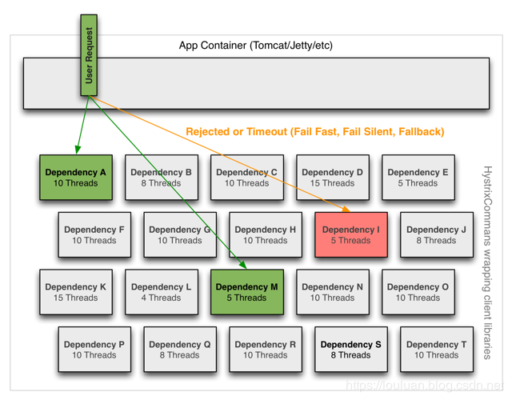

**线程池隔离的几点好处：**
- 使用超时返回的机制，避免同步调用服务时，调用时间过长，无法释放，导致资源耗尽的情况；
- 服务方可以控制请求数量，请求过多，可以直接拒绝,达到快速失败的目的；
- 请求排队，线程池可以维护执行队列，将请求压到队列中处理；

举个例子，如下代码段，模拟了同步调用服务的过程：
```text
    // 服务提供方，执行服务的时候模拟2分钟的耗时
    Callable<String> callableService  = ()->{
        long start = System.currentTimeMillis();
        while(System.currentTimeMillis()-start> 1000 * 60 *2){
           // 模拟服务执行时间过长的情况
        }
        return "OK";
    };

    // 模拟10个客户端调用服务
    ExecutorService clients = Executors.newFixedThreadPool(10);
    // 模拟给10个客户端提交处理请求
    for (int i = 0; i < 20; i++) {
        clients.execute(()->{
            // 同步调用
            try {
                String result = callableService.call();
                System.out.println("当前客户端："+Thread.currentThread().getName()+"调用服务完成，得到结果："+result);
            } catch (Exception e) {
                e.printStackTrace();
            }
        });
    }
```

在此环节中，客户端 clients必须等待服务方返回结果之后，才能接收新的请求。
如果用吞吐量来衡量系统的话，会发现系统的处理能力比较低。
为了提高相应时间，可以借助线程池的方式，设置超时时间，这样的话，客户端就不需要必须等待服务方返回，
如果时间过长，可以提前返回，改造后的代码如下所示：
```text
    // 服务提供方，执行服务的时候模拟2分钟的耗时
    Callable<String> callableService  = ()->{
        long start = System.currentTimeMillis();
        while(System.currentTimeMillis()-start> 1000 * 60 *2){
           // 模拟服务执行时间过长的情况
        }
        return "OK";
    };

    // 创建线程池作为服务方
    ExecutorService executorService = Executors.newFixedThreadPool(30);


    // 模拟10个客户端调用服务
    ExecutorService clients = Executors.newFixedThreadPool(10);
    for (int i = 0; i < 10; i++) {
        clients.execute(()->{
            // 同步调用
            // 将请求提交给线程池执行，Callable 和 Runnable在某种意义上，也是Command对象
            Future<String> future = executorService.submit(callableService::call);
            // 在指定的时间内获取结果，如果超时，调用方可以直接返回
            try {
                String result = future.get(1000, TimeUnit.SECONDS);
                // 客户端等待时间之后，快速返回
                System.out.println("当前客户端："+Thread.currentThread().getName()+"调用服务完成，得到结果："+result);
            }catch (TimeoutException timeoutException){
                System.out.println("服务调用超时，返回处理");
            } catch (InterruptedException e) {
                
            } catch (ExecutionException e) {
            }
        });
    }
```

如果我们将服务方的线程池设置为：
```text
ThreadPoolExecutor executorService = new ThreadPoolExecutor(10,1000,TimeUnit.SECONDS,
new ArrayBlockingQueue<>(100),
new ThreadPoolExecutor.DiscardPolicy() // 提交请求过多时，可以丢弃请求，避免死等阻塞的情况。
)
```

**线程池隔离模式的弊端**
- 线程池隔离模式，会根据服务划分出独立的线程池，系统资源的线程并发数是有限的，
  当线程数过多，系统花费大量的CPU时间来做线程上下文切换的无用操作，反而降低系统性能；
- 如果线程池隔离的过多，会导致真正用于接收用户请求的线程就相应地减少，系统吞吐量反而下降；

在实践上，应当对像远程方法调用，网络资源请求这种服务时间不太可控的场景下使用线程池隔离模式处理
如下图所示，是线程池隔离模式的三种场景：

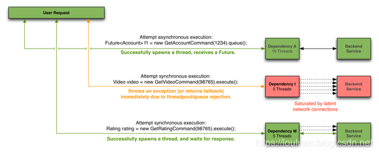

## 基于信号量的隔离
由于基于线程池隔离的模式占用系统线程池资源，Hystrix还提供了另外一个隔离技术：基于信号量的隔离。

基于信号量的隔离方式非常地简单，其核心就是使用共用变量semaphore进行原子操作，控制线程的并发量，
当并发量达到一定量级时，服务禁止调用。

如下图所示：信号量本身不会消耗多余的线程资源，所以就非常轻量。

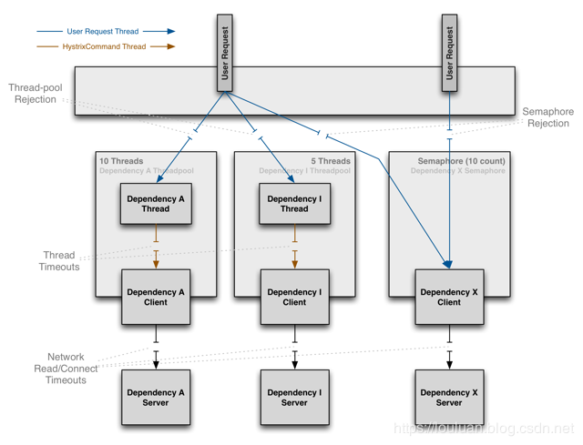

**基于信号量隔离的利弊**

- 利：基于信号量的隔离，利用JVM的原子性CAS操作，避免了资源锁的竞争，省去了线程池开销，效率非常高；
- 弊：本质上基于信号量的隔离是同步行为，所以无法做到超时熔断，所以服务方自身要控制住执行时间，避免超时。

应用场景：业务服务上，有并发上限限制时，可以考虑此方式。

Alibaba Sentinel开源框架，就是基于信号量的熔断和断路器框架。

# 5. Spring Cloud 下 Hystrix使用要注意的问题
- **Hystrix配置无法动态调节生效。**
  Hystrix框架本身是使用的Archaius框架完成的配置加载和刷新，
  但是集成自 Spring Cloud下，无法有效地根据实时监控结果，动态调整熔断和系统参数。
- 线程池和Command之间的配置比较复杂，在Spring Cloud在做feign-hystrix集成的时候，
  还有些BUG，对command的默认配置没有处理好，导致所有command占用公共的command线程池，
  没有细粒度控制，还需要做框架适配调整。

```text
public interface SetterFactory {

  /**
   * Returns a hystrix setter appropriate for the given target and method
   */
  HystrixCommand.Setter create(Target<?> target, Method method);

  /**
   * Default behavior is to derive the group key from {@link Target#name()} and the command key from
   * {@link Feign#configKey(Class, Method)}.
   */
  final class Default implements SetterFactory {

    @Override
    public HystrixCommand.Setter create(Target<?> target, Method method) {
      String groupKey = target.name();
      String commandKey = Feign.configKey(target.type(), method);
      return HystrixCommand.Setter
          .withGroupKey(HystrixCommandGroupKey.Factory.asKey(groupKey))
          .andCommandKey(HystrixCommandKey.Factory.asKey(commandKey));
          //没有处理好default配置项的加载
    }
  }
}
```

# 6. Hystrix官方已死，还有什么替代方案吗？
- resilience4j
   Hystrix虽然官方宣布不再维护，其推荐另外一个框架：resilience4j，
   这个框架是是为Java 8 和 函数式编程设计的一个轻量级的容错框架，该框架充分利用函数式编程的概念，
   为函数式接口、lambda表达式、方法引用高阶函数进行包装，(本质上是装饰者模式的概念)，
   通过包装实现断路、限流、重试、舱壁功能。
   这个框架整体而言比较轻量，没有控制台，不太好做系统级监控；
- Alibaba Sentinel
   Sentinel 是 阿里巴巴开源的轻量级的流量控制、熔断降级 Java 库，
   该库的核心是使用的是信号量隔离的方式做流量控制和熔断，其优点是其集成性和易用性，
   几乎能和当前主流的Spring Cloud, dubbo ,grpc ,nacos, zookeeper做集成，如下图所示：

  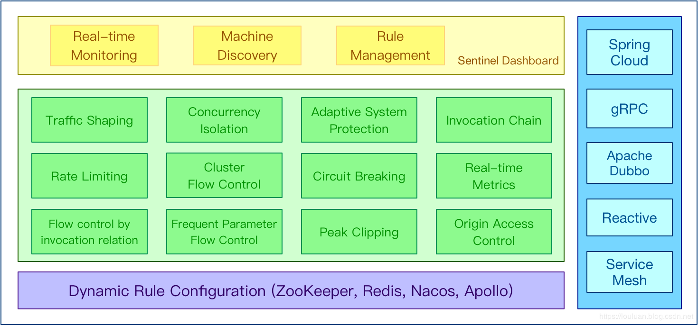

Sentinel的目标生态圈：

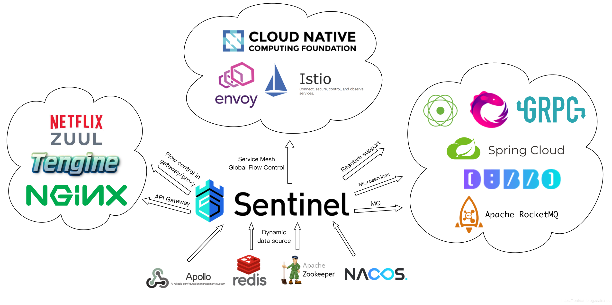

sentinel 一个强大的功能，就是它有一个流控管理控制台，你可以实时地监控每个服务的流控情况，
并且可以实时编辑各种流控、熔断规则，有效地保证了服务保护的及时性。

下图是内部试用的sentinel控制台：

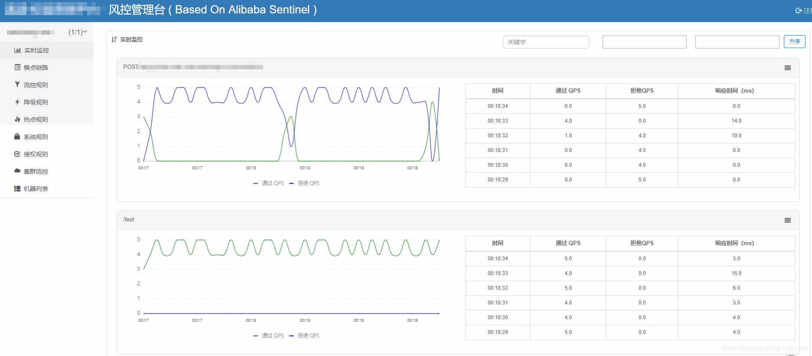

另外，sentinel还可以和 apollo 分布式配置系统进行集成，将流控规降级等各种规则先配置在apollo中，
然后服务启动自动加载流控规则。

本文不是介绍sentinel的重点，关于sentinel的设计原理和使用方式，将另起博文介绍，有兴趣的同学可以先关注下我。

**题外话**
```text
alibaba 近期的开源支持力度比较大，感觉应该是为了增加阿里巴巴在云原生的大生态，
借助spring-cloud-alibaba,集合nacos,sentinel,dubbo,seata、rocketmq，提高其影响力。
在投入度上来看，sentinel的社区活跃度较好，并且紧跟spring-cloud-alibaba, 
如果使用的技术体系偏 阿里系的话，这是不错的选择。
```