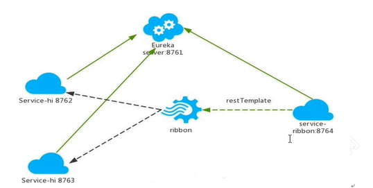

# Spring Cloud 中的Ribbon是什么
负载均衡是指将一个请求均匀地分摊到不同的节点单元上执行，负载均衡分为硬件和软件负载均衡。

以下属于服务器端的负载均衡：
- 硬件负载均衡 比如 F5，深信服，Array等；
- 软件负载均衡 比如 Nginx、LVS、HAProxy等；

硬件负载均衡或是软件负载均衡，都会维护可用的服务端清单，
通过心跳检测来剔除故障的服务端节点，保证清单中都是可用正常访问的服务端节点。

当客户端发送请求到负载均衡设备的时候，
该设备会按某种算法（比如轮询，权重，最小连接数等）从维护的可用服务端清单中取出一台服务端的地址，然后进行转发。

Ribbon 是 Netflix 发布的开源项目，主要是提供客户端的软件负载均衡算法，是一个基于Http和TCP的客户端负载均衡工具。

Spring Cloud 对 Ribbon做了二次封装，可以让我们使用RestTemplate的服务请求，自动转换成客户端负载均衡的服务调用。

Ribbon 支持多种负载均衡算法，还支持自定义的负载均衡算法。

Ribbon 只是一个工具类框架，比较小巧，Spring Cloud对它封装后使用也非常方便，
不像服务注册中心，配置中心，API网关那样需要独立部署，Ribbon只需要在代码中直接使用即可；

# Ribbon与Nginx的区别
- Ribbon是客户端负载均衡工具，Nginx是服务端负载均衡工具
- 服务清单存储位置不同

在客户端负载均衡中，所有客户端节点下的服务端清单，需要自己从服务注册中心上获取，客户端本身是没有服务清单的，比如Eureka服务注册中心。
同服务端负载均衡的架构类似，在客户端负载均衡中需要心跳去维护服务端清单的健康性，只是这个步骤需要与服务注册中心配合完成。

在Spring Cloud中，由于Spring Cloud 对 Ribbon做二次封装，所以默认会创建对Ribbon的自动化整合配置，
Ribbon会去服务注册中心获取该服务，然后再决定用什么算法进行负载均衡。
而服务端的负载均衡是提前配置好的，
例如Nginx与tomcat先进行配置，当前台发送请求过来Nginx时，就知道该请求应该访问那几台tomcat。

在Spring Could 中 Ribbon 总是和 RestTemplate 对象配合着使用，
Ribbon会自动化配置RestTemplate 对象，通过@LoadBalanced开启RestTemplate对象调用时的负载均衡。



# Ribbon实现客户端负载均衡
**步骤**

1、启动多个服务提供者实例并注册到一个服务注册中心或是服务注册中心或是服务注册中心集群

(1)创建spring-boot项目，项目名前缀保持一致。

(2)引入Eureka Client 依赖，添加Spring Cloud 版本管理。

(3)启动类上添加@EnableEurekaClient。

(4)编写配置文件，如下：
```text
# 注意，多个服务提供者程序的应用名称要保持一致
spring.application.name=01-springcloud-service-provider
# 应用服务 WEB 访问端口（注意端口占用问题）
server.port=9200
# eureka的访问注册中心的地址
eureka.client.service-url.defaultZone=http://eureka8761:8761/eureka,http://eureka8762:8762/eureka
```

(5)编写controller
```text
@RestController
public class HelloController {
    @RequestMapping("/service/hello")
    public String hello() {
        return "hello spring cloud provider 1";
    }
}
```

(6)启动服务注册中心程序，以及服务提供者程序。
此时的状态栏一个栏一个应用名称对应着两个服务地址。

2、服务消费者通过被@LoadBalanced注解修饰过的 RestTemplate 来调用服务提供者。

(1)创建spring-boot项目。

(2)添加Eureka Client依赖，以及SpringCloud版本管理。

(3)启动类上添加@EnableEurekaClient注解。

(4)编写配置文件，如下：
```text
# 应用服务 WEB 访问端口
server.port=8082    
#eureka的访问地址
eureka.client.service-url.defaultZone=http://eureka8761:8761/eureka,http://eureka8762:8762/eureka
```

(5)编写Spring配置类,并添加@LoadBalanced。
```text
//配置文件
@Configuration
public class BeanConfig {
    /**
    * @Bean 等价于 <bean id="restTemplate" class="xxx.xxx.RestTemplate"/>
    *
    * @return
    */
    @LoadBalanced  // 使用Ribbon实现负载均衡的调用
    @Bean
    public RestTemplate restTemplate(){
        return new RestTemplate();
    }
}
```

(6)编写Controller
```text
@RestController
public class WebController {

    @Autowired
    private RestTemplate restTemplate;

    @RequestMapping("/web/hello")
    public String hello(){
        // Eureka + Ribbon的调用服务的方式（这种方式不再需要ip地址和端口号了）
        return restTemplate.getForEntity("http://01-SPRINGCLOUD-SERVICE-PROVIDER/service/hello", 
                                String.class).getBody();
    }
}
```

(7)测试
通过localhost:8082/web/hello 访问，不断刷新会发现，请求的服务提供者顺序不断不变换，这就是Ribbon的负载均衡策略。