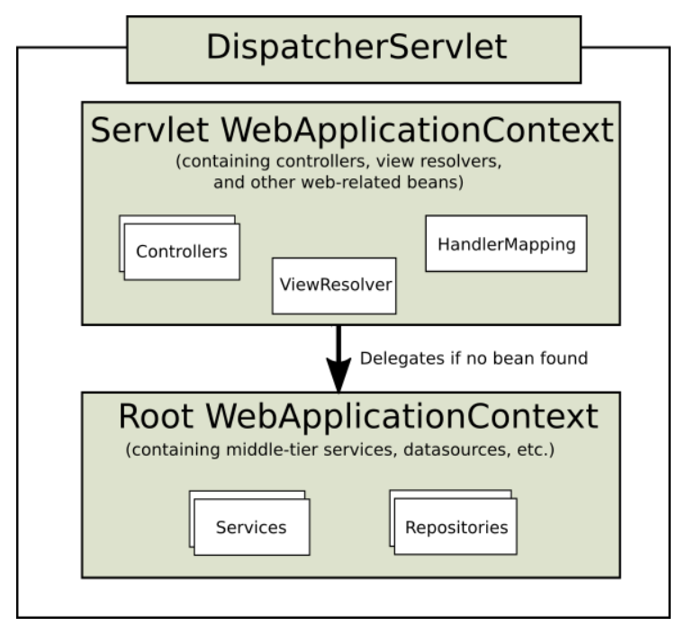

# 第03节 Spring MVC启动原理详解

在《从Servlet到Spring MVC》中，介绍了基于【xml配置】使用的方式，
但我们我现在用的更多的基于【注解零配置】的方式，尤其是在使用SpringBoot的时候，只需要引入web的start包即可，
这边文章前面会简单介绍一下Spring MVC零配置的的使用，
然后详细分析Spring MVC启动的原理，可以更加深入理解为什么只需要简单的配置，就可以提供强大的功能。

## 一、零配置Spring MVC实现
在之前，先简单介绍一下Spring MVC是如何整合Spring的，在Spring MVC的官网，提供了一张父子容器的图：


从上面这张图可以清晰的看到，在Spring MVC整合Spring中，其实是由两个容器组成的，
其中下面的根容器就是Spring自身的容器，而上面的容器，是Spring MVC特有的容器，
那为什么要这么设计呢？只是用一个容器不行吗？

其实这种设计方法最大的考量【兼容】第三方MVC框架，
比如以前常用的Struts框架，MVC容器用于存放Controller、视图解析器、处理器映射器这样的Bean，
而提供服务的Bean由下层的Spring容器来管理，实现了解耦。
但在SpringBoot中就不再使用父子容器，SpringBoot作为一个集成的解决方法，
就是使用SpringMVC来作为Web框架，不需要再兼容其他第三方框架，那么直接使用是一个容器就可以了。

既然由两个容器，那么两个容器再启动时，就会用到不同的配置来加载Bean，所有使用零配置实现SpringMVC时首先就要定义两个配置文件。

### 1.1 定义配置文件
定义根容器的配置类，不扫描@Controller注解的类和子容器的配置类
```text
@Configuration
@ComponentScan(basePackages = "com.lizhi",excludeFilters = {
@ComponentScan.Filter(type = FilterType.ANNOTATION,value={Controller.class}),
@ComponentScan.Filter(type = ASSIGNABLE_TYPE,value =WebAppConfig.class ),
})
public class RootConfig {

}
```

定义子容器的配置类，只扫描有@RestController和@Controller注解的类，同时需要添加@EnableWebMvc注解。
子容器的配置类，可以实现WebMvcConfigurer接口，该接口中提供了添加拦截器、资源处理器、参数解析器等的扩展，下面我们只配置添加一个拦截器。
```text
@Configuration
@ComponentScan(basePackages = {"com.lizhi"},includeFilters = {
@ComponentScan.Filter(type = FilterType.ANNOTATION,value = {RestController.class, Controller.class})
},useDefaultFilters =false)
@EnableWebMvc
public class WebAppConfig implements WebMvcConfigurer{

    /**
    * 配置拦截器
    * @return
    */
    @Bean
    public LizhiInterceptor lizhiInterceptor() {
        return new LizhiInterceptor();
    }

    @Override
    public void addInterceptors(InterceptorRegistry registry) {
        registry.addInterceptor(lizhiInterceptor()).addPathPatterns("/*");
    }
}

public class LizhiInterceptor implements HandlerInterceptor {

    public boolean preHandle(HttpServletRequest request, HttpServletResponse response, Object handler)
        throws Exception {
        System.out.println("Interceptor....preHandle");
        return true;
    }
}
```

### 1.2 实现初始化器接口
上面定义完了配置类，但是并没有配置这两个配置类该给哪个容器用，
所以，接下来就是要去实现AbstractAnnotationConfigDispatcherServletInitializer抽象类，定义每个容器启动时加载的类。

在创建容器时，可以通过下面的方法，来获取配置类进行解析。
```text
public class LizhiStarterInitializer extends AbstractAnnotationConfigDispatcherServletInitializer {

    // IOC 父容器的启动类
    @Override
    protected Class<?>[] getRootConfigClasses() {
        return new Class[]{RootConfig.class};
    }
    
    // IOC子容器配置 web容器配置
    @Override
    protected Class<?>[] getServletConfigClasses() {
        return new Class[]{WebAppConfig.class};
    }
    
    // 我们前端控制器DispatcherServlet的拦截路径
    @Override
    protected String[] getServletMappings() {
        return new String[]{"/"};
    }
}
```

## 二、Spring MVC容器启动灵魂 —SPI
在使用Spring MVC整合Spring的时候，我们没有像执行main()方法一样去手动创建Spring的容器， 那么Spring的容器又是在什么时候创建的，
这就要说到Java强大的扩展机制 —— SPI(Service Provider Interface)，翻译过来就是【服务提供商接口】，那SPI是如何用的呢？

### 2.1 Java扩展机制SPI
按照Java的SPI规范，我们只要在META-INF/services目录创建一个文件，文件名就是【服务提供商提供的接口名】，
而文件内容就是实现这个接口的类的全限定名，
然后Java在运行时候，可以通过ServiceLoader来加载这些类，这种方法提供了良好的扩展，下面代码示例SPI的使用：

定义一个接口：
```text
public interface Search {
    public List<String> searchDoc(String keyword);   
}
```
定义两个接口的实现类：
```text
public class FileSearch implements Search{
    @Override
    public List<String> searchDoc(String keyword) {
        System.out.println("文件搜索 " + keyword);
        return null;
    }
}

public class DatabaseSearch implements Search{
    @Override
    public List<String> searchDoc(String keyword) {
        System.out.println("数据搜索 " + keyword);
        return null;
    }
}
```

然后在META-INF/services目录下创建一个接口完全限定名的文件：
```text
com.lizhi.Search
```
文件内容如下：
```text
com.lizhi.FileSearch
com.lizhi.DatabaseSearch
```

测试方法：ServiceLoader的load()方法会拿到接口对应的文件里面的实现类，
然后在iterator的next()方法中，会去实例化这些实现类，这就是Java SPI的使用。
```text
public class TestCase {
    public static void main(String[] args) {
        // 利用ServiceLoader获取指定服务接口的实现类
        ServiceLoader<Search> s = ServiceLoader.load(Search.class);
        Iterator<Search> iterator = s.iterator();
        while (iterator.hasNext()) {
            Search search =  iterator.next();
            search.searchDoc("hello world");
        }
    }
}
```
注：数据库连接的依赖包中，比如mysql-connector-java-5.1.44.jar，也有利用这种SPI机制来加载驱动。

### 2.2 Servlet规范中的SPI
在Servlet3.1的规范中，明确指出Web容器需要支持对javax.servlet.ServletContainerInitializer接口的扩展，
Web容器(Tomcat)在启动的的时候，会根据META-INF/services目录中的文件内容，去加载所有ServletContainerInitializer的实现类，
然后调用它们的onStartup()方法。
```text
public interface ServletContainerInitializer {

    public void onStartup(Set<Class<?>> c, ServletContext ctx)
        throws ServletException; 
}
```

而Spring MVC中就定义了一个实现该接口的类SpringServletContainerInitializer，
该类上面的注解@HandlesTypes指定了，在调用onStartup()方法时，第一个参数需要传入什么类型的实现类，
SpringMVC指定了需要传入WebApplicationInitializer的实现类或接口。
```text
@HandlesTypes(WebApplicationInitializer.class)
public class SpringServletContainerInitializer implements ServletContainerInitializer {

    public void onStartup(@Nullable Set<Class<?>> webAppInitializerClasses, ServletContext servletContext)
        throws ServletException {
		……
    }
}
```
SpringMVC在onStartup()方法的实现中，然后拿到了所有实现了WebApplicationInitializer接口的类和接口，
但是，会把接口和抽象类过滤掉，SpringMVC自身提供了三个实现类，
分别是：AbstractContextLoaderInitializer、AbstractDispatcherServletInitializer和AbstractAnnotationConfigDispatcherServletInitializer，
不过这三个类都是抽象类，在启动的时候是没法使用的，这就是为什么我们在零配置使用SpringMVC的时候需要，需要添加一个类，
来继承AbstractAnnotationConfigDispatcherServletInitializer抽象类。

过滤完之后，就会去遍历所有过滤得到的WebApplicationInitializer类的是实现类，然后调用它们的onStartup()方法。
```text
List<WebApplicationInitializer> initializers = Collections.emptyList();

if (webAppInitializerClasses != null) {
    initializers = new ArrayList<>(webAppInitializerClasses.size());
    for (Class<?> waiClass : webAppInitializerClasses) {
        // 接口和抽象类servlet容器也会给我们，但是我们不要
        // 排除接口和容器
        if (!waiClass.isInterface() && !Modifier.isAbstract(waiClass.getModifiers()) &&
                WebApplicationInitializer.class.isAssignableFrom(waiClass)) {
            // 实例化，然后添加到集合中
            initializers.add((WebApplicationInitializer)
            ReflectionUtils.accessibleConstructor(waiClass).newInstance());
        }
    }
}

AnnotationAwareOrderComparator.sort(initializers);

// 调用initializer.onStartup  进行扩展
for (WebApplicationInitializer initializer : initializers) {
    initializer.onStartup(servletContext); 
}
```

## 三、创建父子容器

### 3.1 创建父容器
在前面我们定义的AbstractAnnotationConfigDispatcherServletInitializer的实现类LizhiStarterInitializer中，
并没有实现onStartup()方法，所以会去调用父类的onStartup()方法。

AbstractAnnotationConfigDispatcherServletInitializer中onStartup()方法的定义如下：
```text
public abstract class AbstractDispatcherServletInitializer extends AbstractContextLoaderInitializer {

    @Override
    public void onStartup(ServletContext servletContext) throws ServletException {
        //registerContextLoaderListener  ok
        super.onStartup(servletContext);
        // registerDispatcherServlet
        registerDispatcherServlet(servletContext);
    }
    ...... // 非核心代码，省略
}
```
因为其继承自AbstractContextLoaderInitializer抽象类，所以又会去调用父类的onStartup()方法

在AbstractContextLoaderInitializer类的onStartup()方法中，就会去创建Spring的父容器，
然后再创建一个ContextLoaderListener类型的监听器，这个监听器实现了ServletContextListener接口，可以监听Servlet上下文信息，
这个我们在使用xml开发时，是要固定配置的，后面会详细讲到这个监听器的用处。

最后把这个监听器添加到Servlet容器中。
```text
public abstract class AbstractContextLoaderInitializer implements WebApplicationInitializer {

    @Override
    public void onStartup(ServletContext servletContext) throws ServletException {
        registerContextLoaderListener(servletContext);
    }

    protected void registerContextLoaderListener(ServletContext servletContext) {
        // 创建父容器 ，
        WebApplicationContext rootAppContext = createRootApplicationContext();
        if (rootAppContext != null) {
            ContextLoaderListener listener = new ContextLoaderListener(rootAppContext);
            // 设置初始化器
            listener.setContextInitializers(getRootApplicationContextInitializers());
            servletContext.addListener(listener);
        }
    }
    
    ...... // 非核心代码，省略
}
```

创建父容器的方法实现在AbstractAnnotationConfigDispatcherServletInitializer类中，看到这里就很熟悉了，
根据getRootConfigClasses()方法来获取父容器的配置类，然后注册该配置类，到这里，Spring容器还并没有启动，只是创建完成了而已。
```text
protected WebApplicationContext createRootApplicationContext() {
    // 获取 根容器配置类
    Class<?>[] configClasses = getRootConfigClasses();
    if (!ObjectUtils.isEmpty(configClasses)) {
        AnnotationConfigWebApplicationContext context = new AnnotationConfigWebApplicationContext();
        context.register(configClasses);
        return context;
    }
    else {
        return null;
    }
}
```

### 3.2 创建子容器
在AbstractDispatcherServletInitializer中，调用父类的onStartup()创建完父容器之后，
接着就会去调用registerDispatcherServlet()方法来创建子容器，以及创建DispatcherServlet实例。
```text
public void onStartup(ServletContext servletContext) throws ServletException {
    // registerContextLoaderListener  ok
    super.onStartup(servletContext);
    
    // registerDispatcherServlet
    registerDispatcherServlet(servletContext);
}
```
registerDispatcherServlet()方法中，会调用createServletApplicationContext()方法创建子容器，逻辑与创建父容器一样。

然后调用createDispatcherServlet()方法来创建DispatcherServlet，
会把子容器设置到DispatcherServlet实例中，这个需要注意，在DispatcherServlet初始化的时候，会使用到子容器的。

然后就是把DispatcherServlet添加到Servlet上下文中，返回一个ServletRegistration.Dynamic的对象，
然后设置一些DispatcherServlet的基础信息，这些信息都是在使用xml时需要手动配置的。
```text
protected void registerDispatcherServlet(ServletContext servletContext) {
    String servletName = getServletName();
    Assert.hasLength(servletName, "getServletName() must not return null or empty");
    
    // 创建子容器
    WebApplicationContext servletAppContext = createServletApplicationContext();
    Assert.notNull(servletAppContext, "createServletApplicationContext() must not return null");
    
    // 创建DispatcherServlet
    FrameworkServlet dispatcherServlet = createDispatcherServlet(servletAppContext);

    ServletRegistration.Dynamic registration = servletContext.addServlet(servletName, dispatcherServlet);
    
    // 启动时加载
    registration.setLoadOnStartup(1);
    // 映射
    registration.addMapping(getServletMappings());
    
    // 是否异步支持
    registration.setAsyncSupported(isAsyncSupported());
    
    // 设置DispatcherServlet的过滤器
    Filter[] filters = getServletFilters();
    if (!ObjectUtils.isEmpty(filters)) {
        for (Filter filter : filters) {
            registerServletFilter(servletContext, filter);
        }
    }
}
```
基于前面几个步骤，就完成了基于Java注解零XML配置的方式搭建Spring MVC项目。

## 四、Spring MVC启动原理

### 4.1 父容器启动

在《SpringMVC启动原理解析(上)》中，父子容器已经创建了，但是都还没有启动，那容器又是在哪里启动，我们先讲一下父容器是什么时候启动的，
在上面创建父容器的时候，添加了一个ContextLoaderListener监听器，这个监听器实现了ServletContextListener接口，
可以监听Web容器(Tomcat)的状态变化，属性变化等情况，在ContextLoaderListener中有一个contextInitialized()方法，
这个方法表示Web容器初始化完成，也就是在Web容器初始化完成之后，就回去调用这个方法，而父容器的启动也就是在这个方法中完成的。

在Web容器初始化完成的方法中，会去调用initWebApplicationContext来初始化父容器。
```text
public class ContextLoaderListener extends ContextLoader implements ServletContextListener {
    
    // Initialize the root web application context.
    @Override
    public void contextInitialized(ServletContextEvent event) {
        initWebApplicationContext(event.getServletContext());
    }
}
```
在父容器创建过程中创建ContextLoaderListener时，把父容器作为ContextLoaderListener构造参数的入参传给了这个监听器。

所以父容器初始化的时候，context就是父容器，在初始胡之前，首先判断父容器是否为空，
因为只有【Java注解零配置】SpringMVC实现时，才会在初始化容器之前去创建父子容器，
使用xml方式时，这个时候是还没有父容器的，所以，这里需要判断，
如果没有父容器，则通过createWebApplicationContext()方法来创建一个父容器。

这个时候父容器还没有启动，只是创建完成了而已，所以容器状态isActive肯定为false，这个时候根容器是没有父容器的，
但是loadParentContext()提供了扩展，可以为根容器再添加容器，默认返回是null。

接下来最重要的就是配置启动容器，然后进行解析，容器启动完成之后，把根容器添加到Servlet上下文中。

一个Web容器可以同时运行多个SpringMVC应用，所以，会按照webapp的加载器类区分各个应用的父容器。
```text
public WebApplicationContext initWebApplicationContext(ServletContext servletContext) {

    long startTime = System.currentTimeMillis();

    // xml会在这里创建
    if (this.context == null) {
        this.context = createWebApplicationContext(servletContext);
    }
    if (this.context instanceof ConfigurableWebApplicationContext) {
        ConfigurableWebApplicationContext cwac = (ConfigurableWebApplicationContext) this.context;
        if (!cwac.isActive()) {
            // The context has not yet been refreshed -> provide services such as
            // setting the parent context, setting the application context id, etc
            if (cwac.getParent() == null) {
                // The context instance was injected without an explicit parent ->
                // determine parent for root web application context, if any.
                ApplicationContext parent = loadParentContext(servletContext);
                cwac.setParent(parent);
            }
            configureAndRefreshWebApplicationContext(cwac, servletContext);
        }
    }
    // 在servlet域中设置根容器（在子容器就可以直接拿到了）
    servletContext.setAttribute(WebApplicationContext.ROOT_WEB_APPLICATION_CONTEXT_ATTRIBUTE, this.context);

    // 获取线程上下文类加载器，默认为WebAppClassLoader
    ClassLoader ccl = Thread.currentThread().getContextClassLoader();
    // 如果spring的jar包放在每个webapp自己的目录中
    // 此时线程上下文类加载器会与本类的类加载器（加载spring的）相同，都是
    if (ccl == ContextLoader.class.getClassLoader()) {
        currentContext = this.context;
    }
    // 如果不同，也就是上面说的那个问题的情况，那么用一个map把刚才创建的
    else if (ccl != null) {
        // 一个webapp对应一个记录，后续调用时直接根据WebAppClassLoader来取出
        currentContextPerThread.put(ccl, this.context);
    }

    return this.context;
}
```

接下来重点看下configureAndRefreshWebApplicationContext()方法中，是如何启动父容器的？

首先会把Servlet上下文中的全局参数设置到父容器中，如果父容器中有与Servlet相关的环境变量，会对这些变量进行初始化，
最后调用容器的refresh()方法来启动容器，加载配置，解析Bean。
```text
protected void configureAndRefreshWebApplicationContext(ConfigurableWebApplicationContext wac, ServletContext sc) {
    // 设置ServletContext到spring上下文
    wac.setServletContext(sc);
    // 获得servlet容器中的全局参数contextConfigLocation  （xml）
    String configLocationParam = sc.getInitParameter(CONFIG_LOCATION_PARAM);
    if (configLocationParam != null) {
        wac.setConfigLocation(configLocationParam);
    }

    ConfigurableEnvironment env = wac.getEnvironment();
    if (env instanceof ConfigurableWebEnvironment) {
        ((ConfigurableWebEnvironment) env).initPropertySources(sc, null);
    }
    // 刷新容器
    wac.refresh();
}
```

### 4.2 子容器启动
在子容器创建的时候，创建了DispatcherServlet实例，并把子容器添加到了Servlet实例中，
而子容器的启动就是在DispatcherServlet初始化的时候才启动的。

【DispatcherServlet】继承自FrameworkServlet，
而【FrameworkServlet】又继承自HttpServletBean类，
所以在DispatcherServlet和FrameworkServlet都没有重写init()方法，
所以，在DispatcherServlet初始化的时候，会调用【HttpServletBean】的init()方法。
```text
@Override
public final void init() throws ServletException {

    // 解析 init-param 并封装只 pvs 中(xml)
    PropertyValues pvs = new ServletConfigPropertyValues(getServletConfig(), this.requiredProperties);
    if (!pvs.isEmpty()) {
        // 将当前的这个 Servlet 类转化为一个 BeanWrapper，从而能够以 Spring 的方法来对 init-param 的值进行注入
        BeanWrapper bw = PropertyAccessorFactory.forBeanPropertyAccess(this);
        ResourceLoader resourceLoader = new ServletContextResourceLoader(getServletContext());
        bw.registerCustomEditor(Resource.class, new ResourceEditor(resourceLoader, getEnvironment()));
        initBeanWrapper(bw);
        // 属性注入
        bw.setPropertyValues(pvs, true);
    }

    // Let subclasses do whatever initialization they like.
    initServletBean();
}
```
在init()方法中，首先会把DispatcherServlet的初始化参数解析封装成PropertyValues对象，
然后把DispatcherServlet封装成为一个BeanWrapper，然后通过属性注入的方式来为DispatcherServlet的参数赋值。

最后会调用initServletBean()方法来初始化子容器。

#### 4.2.1 子容器初始化
initServletBean()方法的实现是在FrameworkServlet类中，调用initWebApplicationContext()来初始化子容器。
```text
protected final void initServletBean() throws ServletException {

    this.webApplicationContext = initWebApplicationContext();
}
```
我们前面一直说SpringMVC的父子容器，但是在这一步之前，这两个容器是完全独立的，没有任何关系，
而在初始化子容器的时候，才会确定它们的父子关系，然后调用configureAndRefreshWebApplicationContext()方法来初始化子容器。

对于使用xml的方式来说，这个时候还没有创建子容器，所以同样先去Servlet上下文取，
没有再调用createWebApplicationContext()方法创建子容器，与父容器的创建是一样的。
```text
protected WebApplicationContext initWebApplicationContext() {
    // 获得ContextLoaderListener存的父容器
    WebApplicationContext rootContext =
    WebApplicationContextUtils.getWebApplicationContext(getServletContext());
    WebApplicationContext wac = null;

    if (this.webApplicationContext != null) {
        // 获得子容器
        wac = this.webApplicationContext;
        if (wac instanceof ConfigurableWebApplicationContext) {
            ConfigurableWebApplicationContext cwac = (ConfigurableWebApplicationContext) wac;
            if (!cwac.isActive()) {
                // 如果没有设置父容器   spring  doGetBean
                if (cwac.getParent() == null) {
                    cwac.setParent(rootContext);
                }
                // 配置并且加载子容器
                configureAndRefreshWebApplicationContext(cwac);
            }
        }
    }
    if (wac == null) {
        // 从servlet上下文根据<contextAttribute>名字从域里面获取
        wac = findWebApplicationContext();
    }
    if (wac == null) {
        // xml会在这里创建
        wac = createWebApplicationContext(rootContext);
    }

    // refreshEventReceived 它会在容器加载完设置为true (通过事件onApplicationEvent)
    // springBoot在这初始化组件
    if (!this.refreshEventReceived) {
        synchronized (this.onRefreshMonitor) {
            onRefresh(wac);
        }
    }

    if (this.publishContext) {
        // 将当前容器放到servlet域中， 可以再创建子容器
        String attrName = getServletContextAttributeName();
        getServletContext().setAttribute(attrName, wac);
    }

    return wac;
}
```

下面看下子容器初始化过程中都干了什么。
```text
protected void configureAndRefreshWebApplicationContext(ConfigurableWebApplicationContext wac) {
    // 设置servlet上下文
    wac.setServletContext(getServletContext());
    wac.setServletConfig(getServletConfig());
    wac.setNamespace(getNamespace());
    
    // 监听器  委托设计模式
    wac.addApplicationListener(new SourceFilteringListener(wac, new ContextRefreshListener()));
    
    // 将init-param设置到Environment中
    ConfigurableEnvironment env = wac.getEnvironment();
    if (env instanceof ConfigurableWebEnvironment) {
        ((ConfigurableWebEnvironment) env).initPropertySources(getServletContext(), getServletConfig());
    }
    
    // 容器启动前初始化
    applyInitializers(wac);
    wac.refresh();
}
```
也是设置一些Servlet信息和环境变量的参数，但不同的是，子容器添加了一个ContextRefreshListener的监听器，
然后调用子容器的refresh()方法加载解析配置，生成Bean实例。

#### 4.2.2 初始化SpringMVC其他组件
在子容器初始化的时候，添加了一个ContextRefreshListener监听器，这个监听器用于监听Spring容器启动完成的事件。
```text
private class ContextRefreshListener implements ApplicationListener<ContextRefreshedEvent> {

    @Override
    public void onApplicationEvent(ContextRefreshedEvent event) {
        FrameworkServlet.this.onApplicationEvent(event);
    }
}
```
在refresh()方法中，当容器启动完成之后，会发布一个ContextRefreshedEvent事件，
这个时候ContextRefreshListener监听器就回去调用它的onApplicationEvent()方法。
```text
@Override
public void refresh() throws BeansException, IllegalStateException {
    ……
    // Last step: publish corresponding event.
    finishRefresh();
}

protected void finishRefresh() {
    ……
    // Publish the final event.
    publishEvent(new ContextRefreshedEvent(this));
}
```

在ContextRefreshListener监听器的onApplicationEvent()方法，它会去调用FrameworkServlet的onApplicationEvent()方法。
```text
public void onApplicationEvent(ContextRefreshedEvent event) {
    this.refreshEventReceived = true;
    synchronized (this.onRefreshMonitor) {
        onRefresh(event.getApplicationContext());
    }
}
```

onRefresh()方法的实现在DispatcherServlet，在initStrategies()方法中，就会去加载SpringMVC中配置的一些组件
，比如处理器映射器、处理器适配器、视图解析器等，下面以处理器映射器为例，查看它的实现逻辑。
```text
@Override
protected void onRefresh(ApplicationContext context) {
    initStrategies(context);
}

/**
 * 初始化策略,加了s都是多个
 * Initialize the strategy objects that this servlet uses.
 * <p>May be overridden in subclasses in order to initialize further strategy objects.
 */
protected void initStrategies(ApplicationContext context) {
    initMultipartResolver(context);
    initLocaleResolver(context);
    initThemeResolver(context);
    initHandlerMappings(context);
    initHandlerAdapters(context);
    initHandlerExceptionResolvers(context);
    initRequestToViewNameTranslator(context);
    initViewResolvers(context);
    initFlashMapManager(context);
}
```
就是通过Spring容器取获取所有HandlerMapping实现类的Bean实例，然后按照beanName为KEY，Bean实例为VALUE的方式缓存。
```text
private void initHandlerMappings(ApplicationContext context) {
    this.handlerMappings = null;

    // 根据类型（多个）   默认true
    if (this.detectAllHandlerMappings) {
        // Find all HandlerMappings in the ApplicationContext, including ancestor contexts.
        Map<String, HandlerMapping> matchingBeans =
            BeanFactoryUtils.beansOfTypeIncludingAncestors(context, HandlerMapping.class, true, false);
        if (!matchingBeans.isEmpty()) {
            this.handlerMappings = new ArrayList<>(matchingBeans.values());
            // We keep HandlerMappings in sorted order.
            AnnotationAwareOrderComparator.sort(this.handlerMappings);
        }
    }
    // 根据名字（唯一）
    else {
        try {
            HandlerMapping hm = context.getBean(HANDLER_MAPPING_BEAN_NAME, HandlerMapping.class);
            this.handlerMappings = Collections.singletonList(hm);
        }
        catch (NoSuchBeanDefinitionException ex) {
            // Ignore, we'll add a default HandlerMapping later.
        }
    }

    // 如果没有配 ， 就去DispatcherServlet.properties拿默认的
    if (this.handlerMappings == null) {
        this.handlerMappings = getDefaultStrategies(context, HandlerMapping.class);
    }

    for (HandlerMapping mapping : this.handlerMappings) {
        if (mapping.usesPathPatterns()) {
            this.parseRequestPath = true;
            break;
        }
    }
}
```

### 4.3 @EnableWebMvc的作用
@EnableWebMvc注解用在子容器的配置类上，也就是《SpringMVC启动原理解析(上)》定义的WebAppConfig类上，该注解源码如下：
```text
@Import(DelegatingWebMvcConfiguration.class)
public @interface EnableWebMvc {
}
```
@EnableWebMvc源码主要的作用就是添加DelegatingWebMvcConfiguration这个配置类，而这个配置类继承了WebMvcConfigurationSupport，
在WebMvcConfigurationSupport中定义SpringMVC各种组件的创建过程。
```text
@Configuration(proxyBeanMethods = false)
public class DelegatingWebMvcConfiguration extends WebMvcConfigurationSupport {
}
```
在上面的初始化SpringMVC其他组件中，其实只是从Spring容器中去拿这些组件而已，而这些组件真正创建是在WebMvcConfigurationSupport配置类中，
以RequestMappingHandlerMapping为例，配置类的解析是在子容器启动的过程中，
而这些组件的初始化，是在容器启动后DispatcherServlet的初始化过程中，所以在初始化的时候，可以从Spring容器里面获取到这些组件。
```text
public class WebMvcConfigurationSupport implements ApplicationContextAware, ServletContextAware {

    @Bean
    @SuppressWarnings("deprecation")
    public RequestMappingHandlerMapping requestMappingHandlerMapping(
            @Qualifier("mvcContentNegotiationManager") ContentNegotiationManager contentNegotiationManager,
            @Qualifier("mvcConversionService") FormattingConversionService conversionService,
            @Qualifier("mvcResourceUrlProvider") ResourceUrlProvider resourceUrlProvider) {

        // 创建RequestMappingHandlerMapping实例,下面全部是填充它的属性
        RequestMappingHandlerMapping mapping = createRequestMappingHandlerMapping();
        mapping.setOrder(0);
        mapping.setInterceptors(getInterceptors(conversionService, resourceUrlProvider));
        mapping.setContentNegotiationManager(contentNegotiationManager);
        mapping.setCorsConfigurations(getCorsConfigurations());

        PathMatchConfigurer pathConfig = getPathMatchConfigurer();
        if (pathConfig.getPatternParser() != null) {
            mapping.setPatternParser(pathConfig.getPatternParser());
        }
        else {
            mapping.setUrlPathHelper(pathConfig.getUrlPathHelperOrDefault());
            mapping.setPathMatcher(pathConfig.getPathMatcherOrDefault());

            Boolean useSuffixPatternMatch = pathConfig.isUseSuffixPatternMatch();
            if (useSuffixPatternMatch != null) {
                mapping.setUseSuffixPatternMatch(useSuffixPatternMatch);
            }
            Boolean useRegisteredSuffixPatternMatch = pathConfig.isUseRegisteredSuffixPatternMatch();
            if (useRegisteredSuffixPatternMatch != null) {
                mapping.setUseRegisteredSuffixPatternMatch(useRegisteredSuffixPatternMatch);
            }
        }
        Boolean useTrailingSlashMatch = pathConfig.isUseTrailingSlashMatch();
        if (useTrailingSlashMatch != null) {
            mapping.setUseTrailingSlashMatch(useTrailingSlashMatch);
        }
        if (pathConfig.getPathPrefixes() != null) {
            mapping.setPathPrefixes(pathConfig.getPathPrefixes());
        }

        return mapping;
    }

    protected RequestMappingHandlerMapping createRequestMappingHandlerMapping() {
        return new RequestMappingHandlerMapping();
    }

}
```

